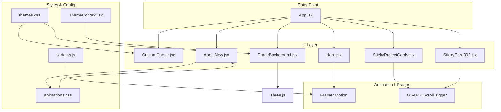
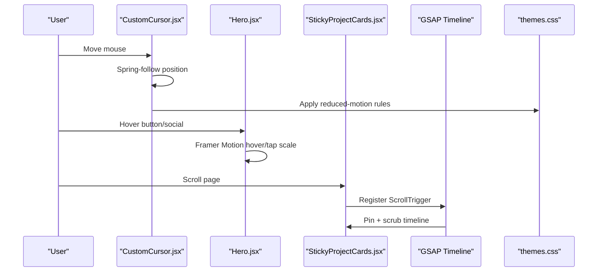
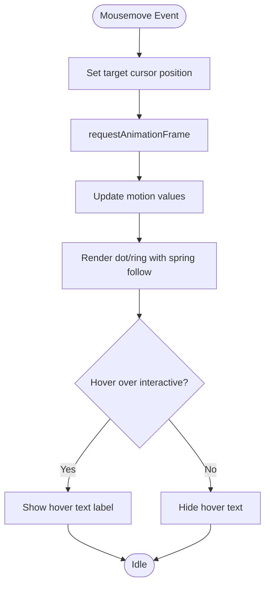
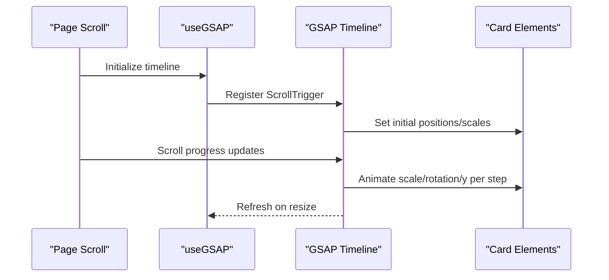
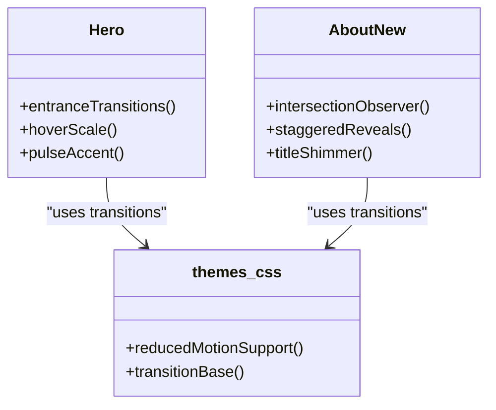
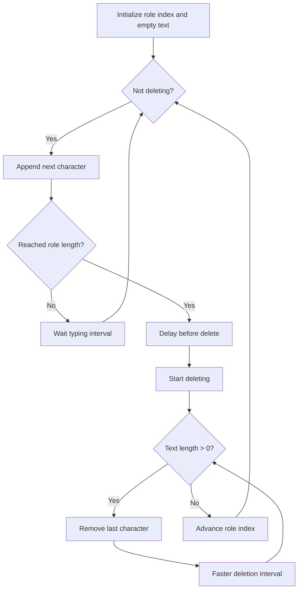
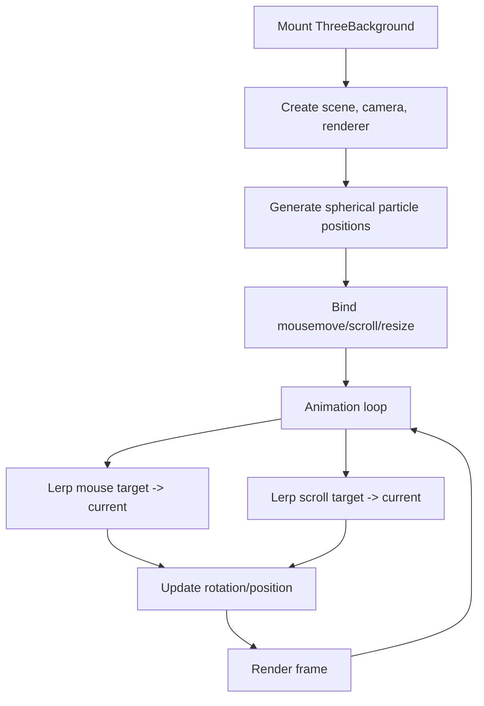
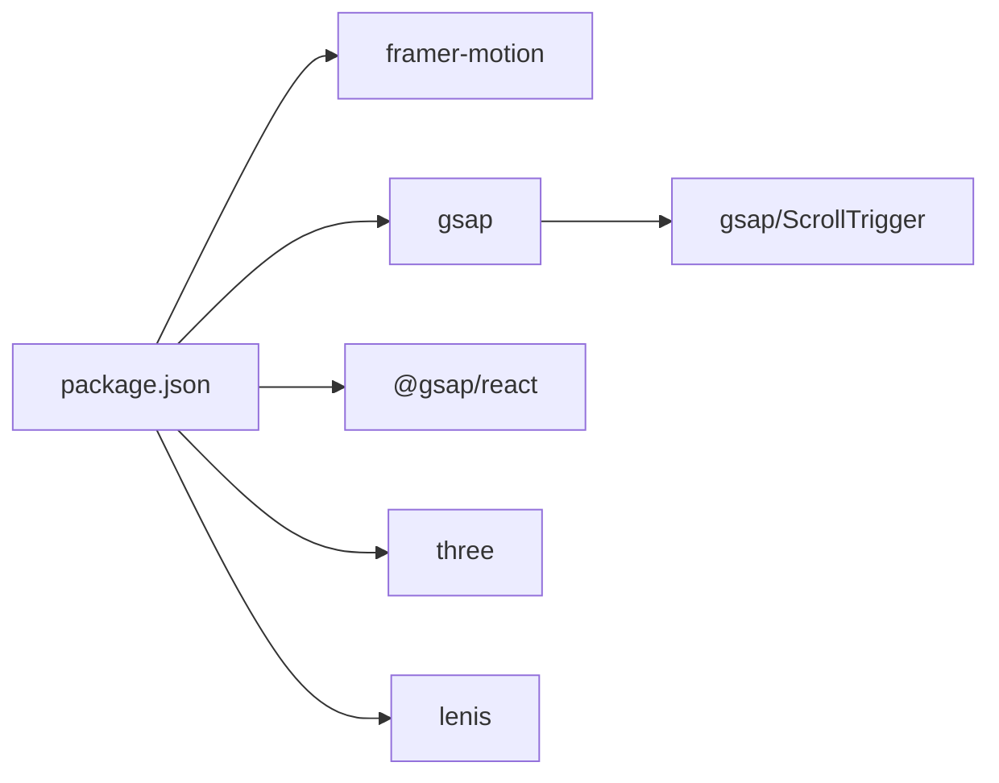

# Animation System

<cite>
**Referenced Files in This Document**
- [variants.js](file://src/utils/variants.js)
- [CustomCursor.jsx](file://src/components/ui/CustomCursor.jsx)
- [animations.css](file://src/styles/animations.css)
- [useSectionObserver.js](file://src/hooks/useSectionObserver.js)
- [Hero.jsx](file://src/components/sections/Hero.jsx)
- [AboutNew.jsx](file://src/components/sections/AboutNew.jsx)
- [StickyProjectCards.jsx](file://src/components/ui/StickyProjectCards.jsx)
- [StickyCard002.jsx](file://src/components/ui/StickyCard002.jsx)
- [ThreeBackground.jsx](file://src/components/ui/ThreeBackground.jsx)
- [App.jsx](file://src/App.jsx)
- [themes.css](file://src/styles/themes.css)
- [ThemeContext.jsx](file://src/context/ThemeContext.jsx)
- [package.json](file://package.json)
</cite>

## Table of Contents
1. [Introduction](#introduction)
2. [Project Structure](#project-structure)
3. [Core Components](#core-components)
4. [Architecture Overview](#architecture-overview)
5. [Detailed Component Analysis](#detailed-component-analysis)
6. [Dependency Analysis](#dependency-analysis)
7. [Performance Considerations](#performance-considerations)
8. [Troubleshooting Guide](#troubleshooting-guide)
9. [Conclusion](#conclusion)
10. [Appendices](#appendices)

## Introduction
This document explains the portfolio’s animation system built with Framer Motion and GSAP. It covers animation variants configuration, custom cursor implementation, scroll-triggered animations, interactive element behaviors, lifecycle, performance optimization, responsive handling, and accessibility. It also provides examples of typewriter effects, particle animations, and transition effects, along with integration guidance between libraries and best practices for creating custom animations.

## Project Structure
The animation system spans several layers:
- Global theme and animation utilities define base transitions and reduced-motion support.
- Section components orchestrate Framer Motion-driven entrance and hover interactions.
- GSAP powers scroll-triggered timelines for sticky cards and advanced parallax.
- A custom cursor integrates Framer Motion for smooth pointer behavior and hover states.
- A variant library centralizes shared motion configurations.

**Diagram sources**
- [App.jsx:15-44](file://src/App.jsx#L15-L44)
- [CustomCursor.jsx:4-245](file://src/components/ui/CustomCursor.jsx#L4-L245)
- [Hero.jsx:7-229](file://src/components/sections/Hero.jsx#L7-L229)
- [AboutNew.jsx:26-349](file://src/components/sections/AboutNew.jsx#L26-L349)
- [StickyProjectCards.jsx:8-145](file://src/components/ui/StickyProjectCards.jsx#L8-L145)
- [StickyCard002.jsx:24-135](file://src/components/ui/StickyCard002.jsx#L24-L135)
- [ThreeBackground.jsx:5-183](file://src/components/ui/ThreeBackground.jsx#L5-L183)
- [variants.js:1-17](file://src/utils/variants.js#L1-L17)
- [animations.css:1-426](file://src/styles/animations.css#L1-L426)
- [themes.css:224-377](file://src/styles/themes.css#L224-L377)
- [ThemeContext.jsx:1-23](file://src/context/ThemeContext.jsx#L1-L23)

**Section sources**
- [App.jsx:15-44](file://src/App.jsx#L15-L44)
- [variants.js:1-17](file://src/utils/variants.js#L1-L17)
- [animations.css:1-426](file://src/styles/animations.css#L1-L426)
- [themes.css:224-377](file://src/styles/themes.css#L224-L377)

## Core Components
- Animation variants: Centralized container/item variants for staggered entrance.
- Custom cursor: Framer Motion-based pointer with spring-follow and hover labeling.
- Scroll-triggered animations: GSAP timelines pinned to scroll for sticky cards.
- Theme-aware animations: CSS-based transitions and reduced-motion support.
- Interactive elements: Hover/tap states with micro-interactions and magnetic effects.

Key implementation references:
- Variants configuration: [variants.js:1-17](file://src/utils/variants.js#L1-L17)
- Custom cursor: [CustomCursor.jsx:4-245](file://src/components/ui/CustomCursor.jsx#L4-L245)
- GSAP scroll-triggered cards: [StickyProjectCards.jsx:8-145](file://src/components/ui/StickyProjectCards.jsx#L8-L145), [StickyCard002.jsx:24-135](file://src/components/ui/StickyCard002.jsx#L24-L135)
- Theme and reduced motion: [themes.css:224-377](file://src/styles/themes.css#L224-L377)
- Section observers: [useSectionObserver.js:1-52](file://src/hooks/useSectionObserver.js#L1-L52)

**Section sources**
- [variants.js:1-17](file://src/utils/variants.js#L1-L17)
- [CustomCursor.jsx:4-245](file://src/components/ui/CustomCursor.jsx#L4-L245)
- [StickyProjectCards.jsx:8-145](file://src/components/ui/StickyProjectCards.jsx#L8-L145)
- [StickyCard002.jsx:24-135](file://src/components/ui/StickyCard002.jsx#L24-L135)
- [themes.css:224-377](file://src/styles/themes.css#L224-L377)
- [useSectionObserver.js:1-52](file://src/hooks/useSectionObserver.js#L1-L52)

## Architecture Overview
The system blends declarative and imperative animation approaches:
- Declarative motion with Framer Motion for component entrances, hover states, and micro-interactions.
- Imperative control with GSAP for scroll-driven experiences and precise timing.
- CSS-based micro-interactions and theme transitions for lightweight effects.
- Theme-awareness ensures color and transition consistency across modes.

**Diagram sources**
- [CustomCursor.jsx:51-130](file://src/components/ui/CustomCursor.jsx#L51-L130)
- [Hero.jsx:141-174](file://src/components/sections/Hero.jsx#L141-L174)
- [StickyProjectCards.jsx:12-50](file://src/components/ui/StickyProjectCards.jsx#L12-L50)
- [themes.css:355-377](file://src/styles/themes.css#L355-L377)

## Detailed Component Analysis

### Animation Variants Configuration
- Container/item variants enable staggered entrance with controlled delays and easing.
- Typical usage: wrap groups of elements and pass variants to motion components.

Implementation highlights:
- Container variant defines global transition staggering.
- Item variant controls opacity/y-axis and easing for individual children.

**Section sources**
- [variants.js:1-17](file://src/utils/variants.js#L1-L17)

### Custom Cursor Implementation
The custom cursor combines:
- Instant dot and smooth-follow ring using Framer Motion values and springs.
- Dynamic hover detection with MutationObserver for dynamic content.
- Reduced-motion-safe visibility and transitions.
- Desktop-only activation with optional text label on hover targets.

**Diagram sources**
- [CustomCursor.jsx:51-130](file://src/components/ui/CustomCursor.jsx#L51-L130)
- [CustomCursor.jsx:156-242](file://src/components/ui/CustomCursor.jsx#L156-L242)

**Section sources**
- [CustomCursor.jsx:4-245](file://src/components/ui/CustomCursor.jsx#L4-L245)

### Scroll-Triggered Animations (GSAP)
Two sticky card implementations demonstrate scroll-driven timelines:
- StickyProjectCards: Pins a container and stages card transitions with scrubbed tweens.
- StickyCard002: Similar pinning with image elements and timeline sequencing.

**Diagram sources**
- [StickyProjectCards.jsx:12-50](file://src/components/ui/StickyProjectCards.jsx#L12-L50)
- [StickyCard002.jsx:33-103](file://src/components/ui/StickyCard002.jsx#L33-L103)

**Section sources**
- [StickyProjectCards.jsx:8-145](file://src/components/ui/StickyProjectCards.jsx#L8-L145)
- [StickyCard002.jsx:24-135](file://src/components/ui/StickyCard002.jsx#L24-L135)

### Interactive Element Behaviors
- Hero section showcases hover/tap scaling, animated accents, and staggered social links.
- About section uses CSS animations for title shimmer and staggered reveals.
- Theme transitions ensure smooth color swaps and reduced-motion compliance.

**Diagram sources**
- [Hero.jsx:74-224](file://src/components/sections/Hero.jsx#L74-L224)
- [AboutNew.jsx:32-52](file://src/components/sections/AboutNew.jsx#L32-L52)
- [themes.css:224-377](file://src/styles/themes.css#L224-L377)

**Section sources**
- [Hero.jsx:74-224](file://src/components/sections/Hero.jsx#L74-L224)
- [AboutNew.jsx:32-52](file://src/components/sections/AboutNew.jsx#L32-L52)
- [themes.css:224-377](file://src/styles/themes.css#L224-L377)

### Typewriter Effects
- The Hero section implements a typewriter loop with configurable typing/deleting speeds and role cycling.
- Uses React state and timers to incrementally build and erase text.

**Diagram sources**
- [Hero.jsx:15-39](file://src/components/sections/Hero.jsx#L15-L39)

**Section sources**
- [Hero.jsx:15-39](file://src/components/sections/Hero.jsx#L15-L39)

### Particle Animations
- ThreeBackground creates a particle system with Three.js and animates positions over time.
- Mouse and scroll interactions influence rotation and vertical position.
- Color lerping aligns with theme accent color.

**Diagram sources**
- [ThreeBackground.jsx:19-165](file://src/components/ui/ThreeBackground.jsx#L19-L165)

**Section sources**
- [ThreeBackground.jsx:5-183](file://src/components/ui/ThreeBackground.jsx#L5-L183)
- [ThemeContext.jsx:1-23](file://src/context/ThemeContext.jsx#L1-L23)

### Transition Effects
- CSS animations provide reusable micro-interactions (bounce, slide, rotate, float, flip, etc.).
- Theme transitions unify color and border changes with cubic-bezier curves.
- Reduced-motion media queries disable continuous animations and excessive transitions.

Examples of transition categories:
- Entrance: slide-up-fade, rotate-in, scale-fade, reveal-from-bottom, flip-in.
- Hover: lift, glow, scale.
- Decorative: shimmer, gradient-shift, heartbeat, spin-slow, wiggle.

**Section sources**
- [animations.css:6-426](file://src/styles/animations.css#L6-L426)
- [themes.css:224-377](file://src/styles/themes.css#L224-L377)

## Dependency Analysis
External libraries and integrations:
- Framer Motion: declarative animations, springs, and motion values.
- GSAP + ScrollTrigger: scroll-driven timelines and precise scrubbing.
- Three.js: GPU-accelerated particle systems.
- Lenis: smooth scrolling integration (referenced in StickyCard002).

**Diagram sources**
- [package.json:12-24](file://package.json#L12-L24)

**Section sources**
- [package.json:12-24](file://package.json#L12-L24)
- [StickyCard002.jsx:3-7](file://src/components/ui/StickyCard002.jsx#L3-L7)

## Performance Considerations
- Prefer transform and opacity for animations to avoid layout/paint thrashing.
- Use requestAnimationFrame and throttled scroll handlers; cancel on unmount.
- Leverage will-change and GPU-friendly properties for smoother motion.
- Respect reduced-motion preferences to minimize CPU/GPU overhead.
- Keep particle counts reasonable; clamp device pixel ratio for mobile.
- Pin containers for sticky timelines to reduce DOM churn.

Guidelines:
- Use springs for pointer smoothing; tune damping/stiffness/mass appropriately.
- Limit concurrent animations to 1–2 key elements per view.
- Avoid animating width/height/top/left; prefer transforms for layout stability.
- Refresh scroll triggers on resize; dispose geometries/materials on unmount.

**Section sources**
- [themes.css:254-258](file://src/styles/themes.css#L254-L258)
- [CustomCursor.jsx:13-16](file://src/components/ui/CustomCursor.jsx#L13-L16)
- [ThreeBackground.jsx:116-117](file://src/components/ui/ThreeBackground.jsx#L116-L117)
- [StickyProjectCards.jsx:41-47](file://src/components/ui/StickyProjectCards.jsx#L41-L47)

## Troubleshooting Guide
Common issues and resolutions:
- Cursor not following on mobile: The custom cursor hides below a desktop breakpoint; verify media query thresholds.
- GSAP timeline not updating on dynamic content: Ensure MutationObserver or ResizeObserver refreshes ScrollTrigger.
- Excessive redraws: Replace width/height animations with transform; use will-change sparingly.
- Reduced-motion overrides not applied: Confirm prefers-reduced-motion media query blocks continuous animations.
- Three.js memory leaks: Dispose geometries, materials, textures, and cancel animation frames on unmount.

**Section sources**
- [CustomCursor.jsx:51-54](file://src/components/ui/CustomCursor.jsx#L51-L54)
- [StickyProjectCards.jsx:41-47](file://src/components/ui/StickyProjectCards.jsx#L41-L47)
- [themes.css:355-377](file://src/styles/themes.css#L355-L377)
- [ThreeBackground.jsx:154-164](file://src/components/ui/ThreeBackground.jsx#L154-L164)

## Conclusion
The portfolio’s animation system harmonizes Framer Motion’s declarative power with GSAP’s scroll precision, enriched by CSS micro-interactions and robust theme-aware transitions. By following performance and accessibility guidelines, developers can extend the system with reliable, efficient, and inclusive motion.

## Appendices

### Choosing Between Framer Motion and GSAP
- Use Framer Motion for:
  - Component entrances/exits and hover/tap interactions.
  - Micro-interactions and spring-based pointer behavior.
  - Orchestration of staggered animations via variants.
- Use GSAP for:
  - Scroll-driven experiences (pinning, scrubbing).
  - Precise timing and complex choreography across elements.
  - Advanced parallax and performance-sensitive sequences.

**Section sources**
- [variants.js:1-17](file://src/utils/variants.js#L1-L17)
- [CustomCursor.jsx:13-16](file://src/components/ui/CustomCursor.jsx#L13-L16)
- [StickyProjectCards.jsx:12-50](file://src/components/ui/StickyProjectCards.jsx#L12-L50)

### Accessibility Guidelines for Animations
- Respect reduced-motion: Disable continuous animations and excessive transitions.
- Prefer subtle motion: Use short durations and modest easing curves.
- Provide alternatives: Allow skipping or pausing where appropriate.
- Test with assistive technologies: Ensure focus order and keyboard navigation remain intact.

**Section sources**
- [themes.css:355-377](file://src/styles/themes.css#L355-L377)