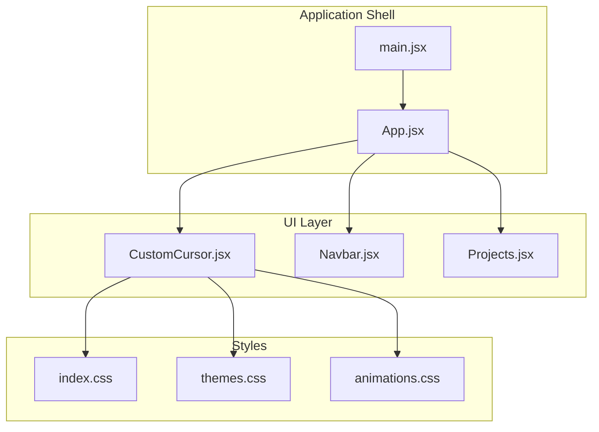
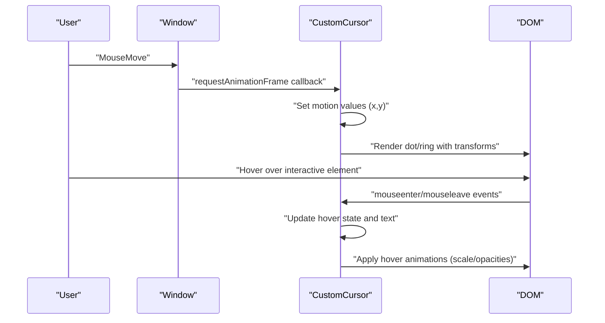
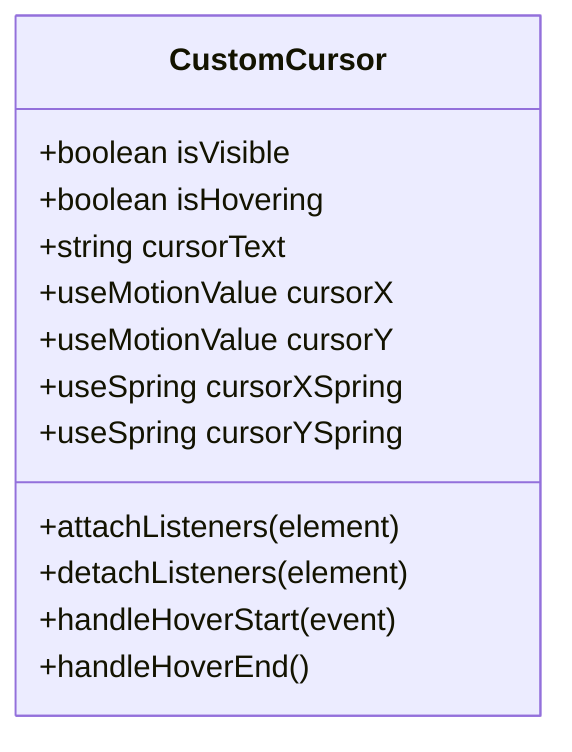
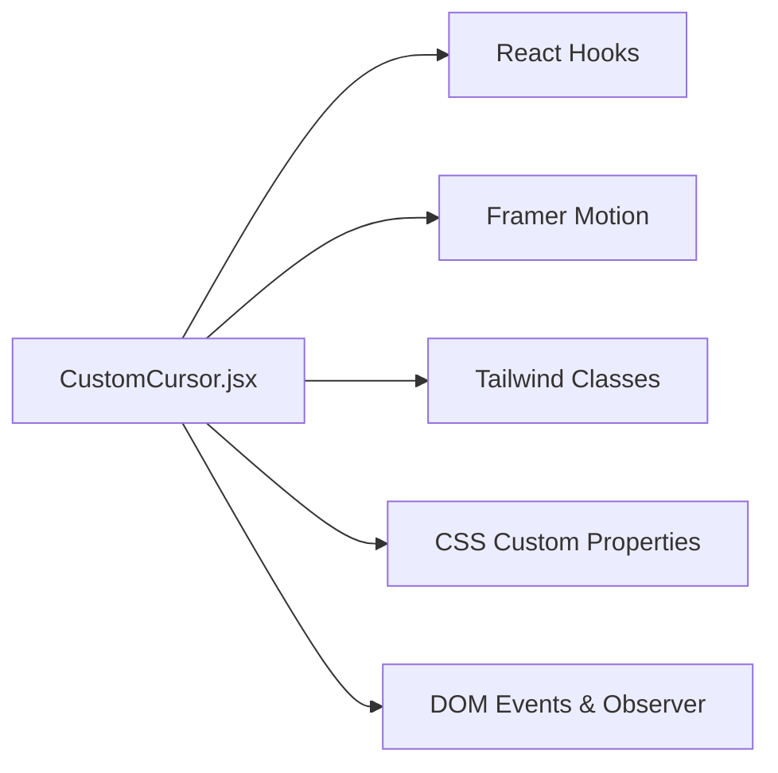

# Custom Cursor Effects

<cite>
**Referenced Files in This Document**
- [CustomCursor.jsx](file://src/components/ui/CustomCursor.jsx)
- [App.jsx](file://src/App.jsx)
- [main.jsx](file://src/main.jsx)
- [index.css](file://src/index.css)
- [themes.css](file://src/styles/themes.css)
- [animations.css](file://src/styles/animations.css)
- [Navbar.jsx](file://src/components/layout/Navbar.jsx)
- [Projects.jsx](file://src/components/sections/Projects.jsx)
</cite>

## Table of Contents
1. [Introduction](#introduction)
2. [Project Structure](#project-structure)
3. [Core Components](#core-components)
4. [Architecture Overview](#architecture-overview)
5. [Detailed Component Analysis](#detailed-component-analysis)
6. [Dependency Analysis](#dependency-analysis)
7. [Performance Considerations](#performance-considerations)
8. [Troubleshooting Guide](#troubleshooting-guide)
9. [Conclusion](#conclusion)
10. [Appendices](#appendices)

## Introduction
This document explains the custom cursor implementation that enhances user interaction across the portfolio. It covers the cursor tracking mechanism, hover state detection, visual feedback systems, cursor scaling effects, pointer interactions with interactive elements, and performance optimization techniques. It also provides examples of customization, trail effects, responsive behavior, browser compatibility, accessibility considerations, and integration with other UI components. Guidelines are included for creating custom cursor styles and animations.

## Project Structure
The custom cursor is implemented as a standalone React component and integrated into the application shell. Styling leverages Tailwind, CSS custom properties, and Framer Motion for animations.

**Diagram sources**
- [main.jsx:1-16](file://src/main.jsx#L1-L16)
- [App.jsx:15-44](file://src/App.jsx#L15-L44)
- [CustomCursor.jsx:4-242](file://src/components/ui/CustomCursor.jsx#L4-L242)
- [index.css:1-172](file://src/index.css#L1-L172)
- [themes.css:1-395](file://src/styles/themes.css#L1-L395)
- [animations.css:1-426](file://src/styles/animations.css#L1-L426)

**Section sources**
- [main.jsx:1-16](file://src/main.jsx#L1-L16)
- [App.jsx:15-44](file://src/App.jsx#L15-L44)

## Core Components
- CustomCursor: Provides a dual-layer animated cursor with instant dot and smooth-follow ring, dynamic text label, and subtle glow on hover. It tracks mouse movement with requestAnimationFrame, hides the native cursor on desktop, and dynamically attaches hover listeners to interactive elements.

Key capabilities:
- Mouse tracking with requestAnimationFrame and motion values
- Spring-based smooth-follow ring for fluid motion
- Hover detection via MutationObserver and event listeners
- Dynamic text label from data attributes
- Conditional visibility and responsiveness thresholds
- Theme-aware colors and transitions

**Section sources**
- [CustomCursor.jsx:4-242](file://src/components/ui/CustomCursor.jsx#L4-L242)

## Architecture Overview
The cursor system is composed of three animated layers rendered above the page content, with a dedicated motion value for the dot and a spring-driven motion value for the ring. Event listeners are attached to interactive elements to update hover state and optional text labels. The default OS cursor is hidden on desktop devices.

**Diagram sources**
- [CustomCursor.jsx:51-130](file://src/components/ui/CustomCursor.jsx#L51-L130)
- [CustomCursor.jsx:156-241](file://src/components/ui/CustomCursor.jsx#L156-L241)

## Detailed Component Analysis

### CustomCursor Component
The component manages:
- Visibility state and hover state
- Two motion values for precise dot positioning
- Spring configuration for the outer ring
- Hover listener registry and MutationObserver
- Desktop-only rendering and default cursor hiding
- Three layered visuals: inner dot, outer ring, and glow

**Diagram sources**
- [CustomCursor.jsx:4-49](file://src/components/ui/CustomCursor.jsx#L4-L49)

**Section sources**
- [CustomCursor.jsx:4-242](file://src/components/ui/CustomCursor.jsx#L4-L242)

### Visual Feedback System
- Inner dot: immediate response to pointer movement; scales to zero on hover; fades in/out with opacity transitions.
- Outer ring: follows with a spring physics model; scales up and adjusts border color on hover; text label appears centered.
- Glow: appears on hover with scale and opacity transitions.

These effects rely on Framer Motion’s animate/transition props and CSS custom properties for theme colors.

**Section sources**
- [CustomCursor.jsx:156-241](file://src/components/ui/CustomCursor.jsx#L156-L241)

### Hover State Detection and Dynamic Text
- Elements matching a selector are observed for mouseenter/mouseleave.
- On hover, the component reads a data attribute for a contextual label and updates the ring’s text.
- A MutationObserver ensures newly added interactive elements are automatically handled.

Selector includes anchors, buttons, inputs, selects, and elements with specific attributes/classes.

**Section sources**
- [CustomCursor.jsx:71-104](file://src/components/ui/CustomCursor.jsx#L71-L104)
- [CustomCursor.jsx:22-31](file://src/components/ui/CustomCursor.jsx#L22-L31)

### Responsive Behavior and Desktop-Only Rendering
- The cursor is hidden on screens below a threshold width.
- The default OS cursor is hidden via injected stylesheet on desktop devices.

**Section sources**
- [CustomCursor.jsx:52-54](file://src/components/ui/CustomCursor.jsx#L52-L54)
- [CustomCursor.jsx:132-154](file://src/components/ui/CustomCursor.jsx#L132-L154)

### Pointer Interactions with Interactive Elements
- The cursor integrates with existing interactive UI elements (buttons, links, cards) by leveraging the hover detection mechanism.
- Example interactive elements include navigation links, project filter buttons, and call-to-action links.

**Section sources**
- [Navbar.jsx:80-134](file://src/components/layout/Navbar.jsx#L80-L134)
- [Projects.jsx:66-80](file://src/components/sections/Projects.jsx#L66-L80)

### Visual Feedback Examples Across UI
- Buttons and links use hover states with scaling, color shifts, and shadows; the cursor augments this with visual feedback.
- Cards and CTAs demonstrate hover transitions that complement the cursor’s presence.

**Section sources**
- [Navbar.jsx:80-134](file://src/components/layout/Navbar.jsx#L80-L134)
- [Projects.jsx:66-80](file://src/components/sections/Projects.jsx#L66-L80)

## Dependency Analysis
The cursor component depends on:
- React hooks for state and effects
- Framer Motion for motion values, springs, and animations
- Tailwind and CSS custom properties for styling and theming
- DOM APIs for event listeners and MutationObserver

**Diagram sources**
- [CustomCursor.jsx:1-2](file://src/components/ui/CustomCursor.jsx#L1-L2)
- [index.css:3-16](file://src/index.css#L3-L16)
- [themes.css:7-57](file://src/styles/themes.css#L7-L57)

**Section sources**
- [CustomCursor.jsx:1-2](file://src/components/ui/CustomCursor.jsx#L1-L2)
- [index.css:3-16](file://src/index.css#L3-L16)
- [themes.css:7-57](file://src/styles/themes.css#L7-L57)

## Performance Considerations
- requestAnimationFrame batching: Movement updates are batched per frame to minimize layout thrashing.
- Spring physics: Tight damping and stiffness parameters keep the ring close during fast movements, reducing perceived lag.
- Passive event listeners: Mousemove and scroll listeners use passive options to improve scrolling performance.
- Visibility gating: The cursor is hidden on small screens and re-enabled on desktop widths.
- Minimal DOM writes: Animations rely on transforms and opacity rather than layout-affecting properties.

Recommendations:
- Keep hover targets scoped to interactive elements to limit event listener overhead.
- Prefer CSS transitions for static properties; reserve JavaScript-driven animations for dynamic tracking.
- Monitor frame drops in heavy pages and adjust spring stiffness or reduce layers if needed.

**Section sources**
- [CustomCursor.jsx:56-66](file://src/components/ui/CustomCursor.jsx#L56-L66)
- [CustomCursor.jsx:106-113](file://src/components/ui/CustomCursor.jsx#L106-L113)
- [CustomCursor.jsx:13](file://src/components/ui/CustomCursor.jsx#L13)

## Troubleshooting Guide
Common issues and resolutions:
- Cursor not visible on mobile: By design, the cursor is disabled below a desktop breakpoint. This is expected.
- Hover text not appearing: Ensure the interactive element has the appropriate data attribute or class so it matches the hover selector.
- Cursor flickers or feels sluggish: Verify passive event listener usage and confirm that no heavy synchronous DOM queries occur in the mousemove handler.
- Default cursor still visible: Confirm the injected stylesheet runs on desktop devices and that no other styles override it.
- Z-index conflicts: The cursor layers use high z-index values; ensure other overlays do not exceed them unintentionally.

**Section sources**
- [CustomCursor.jsx:52-54](file://src/components/ui/CustomCursor.jsx#L52-L54)
- [CustomCursor.jsx:71-74](file://src/components/ui/CustomCursor.jsx#L71-L74)
- [CustomCursor.jsx:132-154](file://src/components/ui/CustomCursor.jsx#L132-L154)

## Conclusion
The custom cursor enhances interactivity with smooth tracking, layered visuals, and contextual feedback. It integrates seamlessly with the existing UI through hover detection and theme-aware styling, while maintaining strong performance and accessibility considerations.

## Appendices

### Browser Compatibility
- Desktop-focused: Designed for mouse interactions; hidden on smaller screens.
- Modern browsers: Uses requestAnimationFrame, passive listeners, and CSS custom properties widely supported in current browsers.
- Reduced motion: Respects user preferences via media queries.

**Section sources**
- [CustomCursor.jsx:52-54](file://src/components/ui/CustomCursor.jsx#L52-L54)
- [CustomCursor.jsx:132-154](file://src/components/ui/CustomCursor.jsx#L132-L154)
- [themes.css:355-377](file://src/styles/themes.css#L355-L377)

### Accessibility Considerations
- Focus visibility: The app maintains skip-link and focus-visible styles for keyboard navigation.
- Reduced motion: Animations adapt to user preferences.
- Contrast and visibility: Cursor colors derive from theme variables; ensure sufficient contrast against backgrounds.

**Section sources**
- [App.jsx:20-26](file://src/App.jsx#L20-L26)
- [themes.css:355-377](file://src/styles/themes.css#L355-L377)
- [index.css:102-114](file://src/index.css#L102-L114)

### Customization Guidelines
- Colors: Adjust accent variables in the theme stylesheet to change cursor colors.
- Sizes and spacing: Modify ring and dot sizes via Tailwind classes or CSS overrides.
- Animations: Tune transition durations and easing curves in the component’s animate/transition props.
- Text labels: Add data attributes to interactive elements to display contextual text.
- Responsiveness: Control visibility breakpoints by adjusting the desktop threshold.

**Section sources**
- [themes.css:7-57](file://src/styles/themes.css#L7-L57)
- [CustomCursor.jsx:156-241](file://src/components/ui/CustomCursor.jsx#L156-L241)
- [CustomCursor.jsx:22-31](file://src/components/ui/CustomCursor.jsx#L22-L31)

### Integration Examples
- Place the cursor component near the top of the application shell so it renders above all content.
- Ensure interactive elements use explicit cursor pointer classes or roles so they trigger hover states.
- Combine with other micro-interactions (e.g., hover lifts, glows) for cohesive UX.

**Section sources**
- [App.jsx:31](file://src/App.jsx#L31)
- [Navbar.jsx:80-134](file://src/components/layout/Navbar.jsx#L80-L134)
- [Projects.jsx:66-80](file://src/components/sections/Projects.jsx#L66-L80)