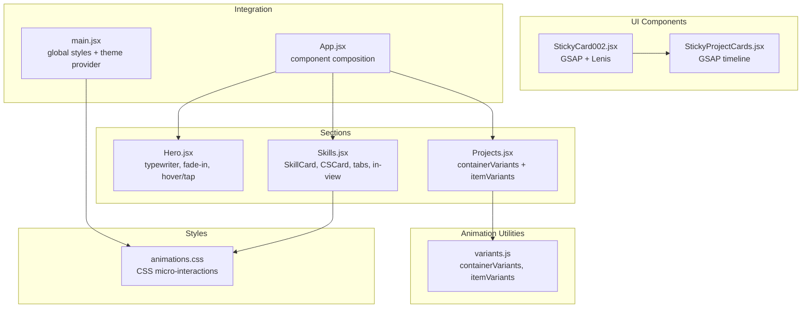
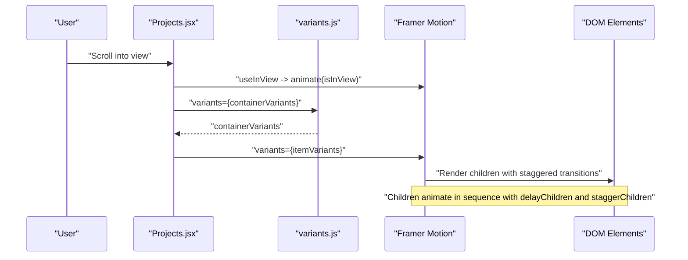
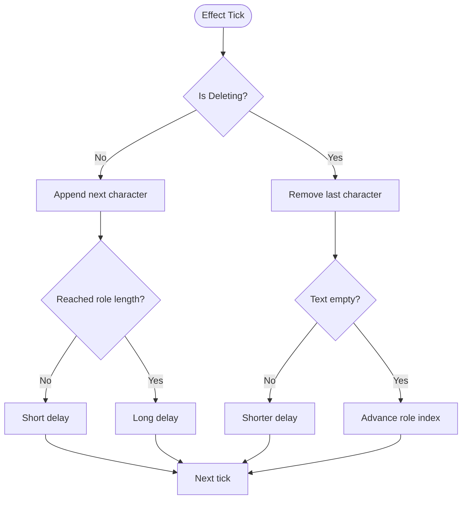
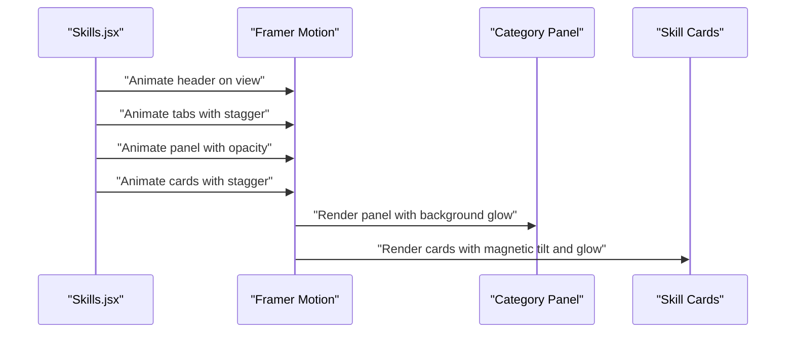
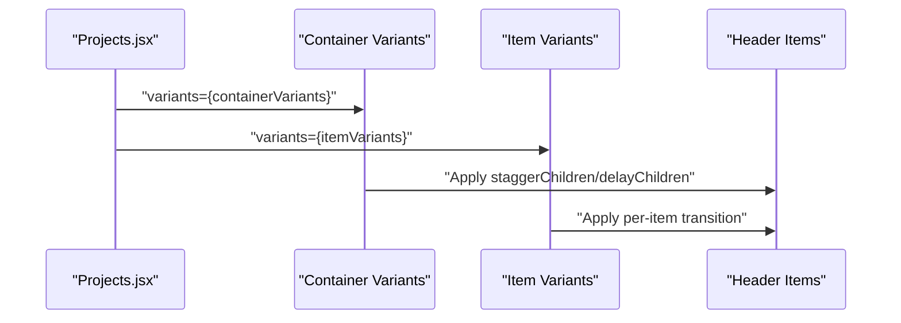
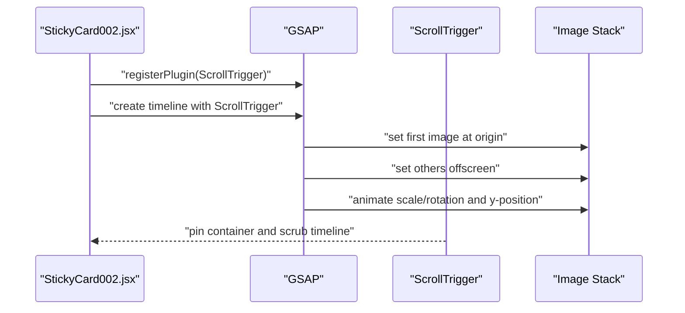
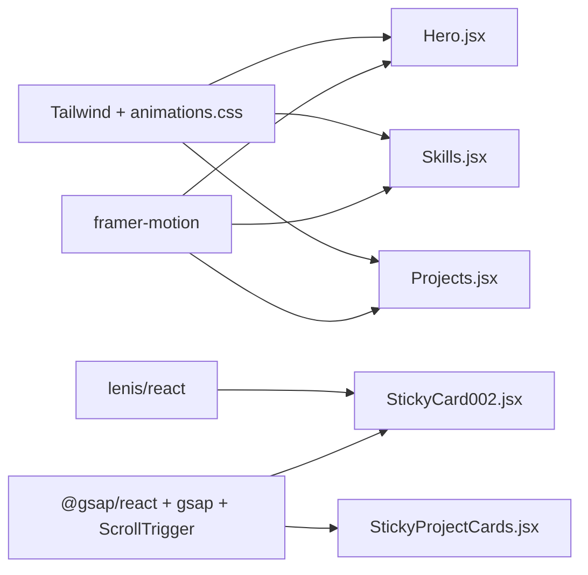

# Motion Animations

<cite>
**Referenced Files in This Document**
- [variants.js](file://src/utils/variants.js)
- [animations.css](file://src/styles/animations.css)
- [package.json](file://package.json)
- [Hero.jsx](file://src/components/sections/Hero.jsx)
- [Skills.jsx](file://src/components/sections/Skills.jsx)
- [Projects.jsx](file://src/components/sections/Projects.jsx)
- [StickyCard002.jsx](file://src/components/ui/StickyCard002.jsx)
- [StickyProjectCards.jsx](file://src/components/ui/StickyProjectCards.jsx)
- [personal.js](file://src/data/personal.js)
- [skills.js](file://src/data/skills.js)
- [App.jsx](file://src/App.jsx)
- [main.jsx](file://src/main.jsx)
</cite>

## Table of Contents
1. [Introduction](#introduction)
2. [Project Structure](#project-structure)
3. [Core Components](#core-components)
4. [Architecture Overview](#architecture-overview)
5. [Detailed Component Analysis](#detailed-component-analysis)
6. [Dependency Analysis](#dependency-analysis)
7. [Performance Considerations](#performance-considerations)
8. [Troubleshooting Guide](#troubleshooting-guide)
9. [Conclusion](#conclusion)
10. [Appendices](#appendices)

## Introduction
This document explains the Framer Motion-based animation system used across the portfolio. It focuses on:
- Animation variants configuration for container and item staggering
- Transition effects and easing customization
- Practical patterns for typewriter effects, fade-in transitions, and staggered child animations
- Real-world examples from section headers, skill cards, and project items
- Animation lifecycle, performance considerations, and reusable patterns
- Integration with React components and coexistence with other libraries (GSAP, Lenis)

## Project Structure
The animation system spans several layers:
- Utility variants define reusable container/item configurations
- Styles provide micro-interactions and CSS-driven animations
- Sections integrate Framer Motion for page-level and component-level animations
- UI components combine Framer Motion with GSAP/Lenis for advanced scrolling experiences

**Diagram sources**
- [variants.js:1-17](file://src/utils/variants.js#L1-L17)
- [animations.css:1-426](file://src/styles/animations.css#L1-L426)
- [Hero.jsx:1-229](file://src/components/sections/Hero.jsx#L1-L229)
- [Skills.jsx:1-531](file://src/components/sections/Skills.jsx#L1-L531)
- [Projects.jsx:1-125](file://src/components/sections/Projects.jsx#L1-L125)
- [StickyCard002.jsx:1-127](file://src/components/ui/StickyCard002.jsx#L1-L127)
- [StickyProjectCards.jsx:1-145](file://src/components/ui/StickyProjectCards.jsx#L1-L145)
- [App.jsx:1-47](file://src/App.jsx#L1-L47)
- [main.jsx:1-16](file://src/main.jsx#L1-L16)

**Section sources**
- [variants.js:1-17](file://src/utils/variants.js#L1-L17)
- [animations.css:1-426](file://src/styles/animations.css#L1-L426)
- [Hero.jsx:1-229](file://src/components/sections/Hero.jsx#L1-L229)
- [Skills.jsx:1-531](file://src/components/sections/Skills.jsx#L1-L531)
- [Projects.jsx:1-125](file://src/components/sections/Projects.jsx#L1-L125)
- [StickyCard002.jsx:1-127](file://src/components/ui/StickyCard002.jsx#L1-L127)
- [StickyProjectCards.jsx:1-145](file://src/components/ui/StickyProjectCards.jsx#L1-L145)
- [App.jsx:1-47](file://src/App.jsx#L1-L47)
- [main.jsx:1-16](file://src/main.jsx#L1-L16)

## Core Components
- Container and item variants for staggered animations
- CSS micro-interactions for polished UI feedback
- Framer Motion hooks for lifecycle and viewport-triggered animations
- Coordinated scroll-driven animations with GSAP and Lenis

Key capabilities:
- Staggered children with configurable delays and easing
- Smooth transitions for section headers and interactive elements
- Typewriter effect with controlled speed and looping behavior
- Magnetic/hover/tap interactions for buttons and cards
- Scroll-triggered card stacks with layered transforms

**Section sources**
- [variants.js:1-17](file://src/utils/variants.js#L1-L17)
- [animations.css:1-426](file://src/styles/animations.css#L1-L426)
- [Hero.jsx:1-229](file://src/components/sections/Hero.jsx#L1-L229)
- [Skills.jsx:1-531](file://src/components/sections/Skills.jsx#L1-L531)
- [Projects.jsx:1-125](file://src/components/sections/Projects.jsx#L1-L125)
- [StickyCard002.jsx:1-127](file://src/components/ui/StickyCard002.jsx#L1-L127)
- [StickyProjectCards.jsx:1-145](file://src/components/ui/StickyProjectCards.jsx#L1-L145)

## Architecture Overview
The animation pipeline integrates multiple libraries:
- Framer Motion: declarative animations, variants, viewport triggers, presence transitions
- GSAP: scroll-driven timelines and precise control over complex sequences
- Lenis: smooth scrolling to align scroll-driven animations
- CSS micro-interactions: hover states, transitions, and small feedback loops

**Diagram sources**
- [Projects.jsx:47-81](file://src/components/sections/Projects.jsx#L47-L81)
- [variants.js:1-17](file://src/utils/variants.js#L1-L17)

**Section sources**
- [Projects.jsx:47-81](file://src/components/sections/Projects.jsx#L47-L81)
- [variants.js:1-17](file://src/utils/variants.js#L1-L17)

## Detailed Component Analysis

### Variant System: containerVariants and itemVariants
- containerVariants defines a parent container with:
  - A hidden state with zero opacity
  - A visible state with:
    - Opacity 1
    - Transition with staggerChildren and delayChildren to orchestrate child animations
- itemVariants defines individual children with:
  - Hidden state: opacity 0 and slight upward offset
  - Visible state: opacity 1 and settled position
  - Transition with duration and a custom cubic-bezier easing

Implementation highlights:
- Staggering is configured at the container level; children inherit the stagger timing
- Easing is centralized in itemVariants for consistent feel across components

Practical usage:
- Apply containerVariants to a wrapper and itemVariants to immediate children
- Combine with viewport triggers (useInView) to animate on scroll

**Section sources**
- [variants.js:1-17](file://src/utils/variants.js#L1-L17)
- [Projects.jsx:47-81](file://src/components/sections/Projects.jsx#L47-L81)

### Typewriter Effect in Hero
The Hero section demonstrates a typewriter animation:
- State machine tracks current role index, display text, deletion state, and typing speed
- Uses useEffect to increment/decrement displayText with controlled timing
- On completion of typing, waits briefly before deleting
- On deletion completion, cycles to the next role
- A blinking cursor is animated via CSS for realism

Key behaviors:
- Variable typing speed during typing vs. deleting
- Role cycling with persistence across sessions
- Cursor blink animation synchronized with text changes

**Diagram sources**
- [Hero.jsx:15-39](file://src/components/sections/Hero.jsx#L15-L39)
- [personal.js:22-27](file://src/data/personal.js#L22-L27)

**Section sources**
- [Hero.jsx:15-39](file://src/components/sections/Hero.jsx#L15-L39)
- [personal.js:22-27](file://src/data/personal.js#L22-L27)

### Fade-In Transitions and Staggered Children
- Section headers animate in with fade and subtle vertical movement
- Tabs and category panels animate in with staggered delays
- Skill cards and CS fundamentals use staggered entrance with per-item delays
- AnimatePresence coordinates panel transitions when switching categories

Examples:
- Section header fade-in with custom easing
- Tab buttons animate with spring-like transitions
- Skill cards stagger with per-index delays
- CS cards animate in with viewport triggers

**Diagram sources**
- [Skills.jsx:329-454](file://src/components/sections/Skills.jsx#L329-L454)

**Section sources**
- [Skills.jsx:329-454](file://src/components/sections/Skills.jsx#L329-L454)

### Staggered Child Animations in Projects
- The Projects section wraps header content in a container using containerVariants
- Each header item uses itemVariants to animate in sequence
- Filters and buttons are individually staggered for a cohesive entrance
- Combined with viewport triggers for scroll-driven activation

**Diagram sources**
- [Projects.jsx:47-81](file://src/components/sections/Projects.jsx#L47-L81)
- [variants.js:1-17](file://src/utils/variants.js#L1-L17)

**Section sources**
- [Projects.jsx:47-81](file://src/components/sections/Projects.jsx#L47-L81)
- [variants.js:1-17](file://src/utils/variants.js#L1-L17)

### Scroll-Driven Card Stacks (GSAP + Lenis)
Two complementary approaches demonstrate scroll-driven animations:
- StickyCard002: Uses GSAP timeline and ScrollTrigger to coordinate image transitions as the user scrolls
- StickyProjectCards: Similar approach with a floating particle background and GSAP timeline

Both rely on:
- Registering ScrollTrigger and creating a timeline
- Setting initial positions and scaling
- Animating scale, rotation, and vertical offsets across images
- Refreshing on resize and cleaning up on unmount

**Diagram sources**
- [StickyCard002.jsx:25-95](file://src/components/ui/StickyCard002.jsx#L25-L95)

**Section sources**
- [StickyCard002.jsx:25-95](file://src/components/ui/StickyCard002.jsx#L25-L95)
- [StickyProjectCards.jsx:12-50](file://src/components/ui/StickyProjectCards.jsx#L12-L50)

### CSS Micro-Interactions and Transitions
The animations.css file provides:
- Hover effects (lift, glow, scale) with smooth transitions
- Staggered delays for lists and grids
- Predefined animations (bounce-in, slide-up-fade, rotate-in, etc.)
- Parallax layers and loading spinners
- Typewriter cursor animation for terminal-style text

These are used alongside Framer Motion to enhance interactivity and polish.

**Section sources**
- [animations.css:1-426](file://src/styles/animations.css#L1-L426)

## Dependency Analysis
External libraries and their roles:
- framer-motion: primary animation library for declarative motion and variants
- @gsap/react + gsap + ScrollTrigger: advanced scroll-driven animations
- lenis/react: smooth scrolling to align scroll-triggered animations
- tailwind-merge, clsx: utility-based class composition
- three: 3D background in Hero
- @emailjs/browser, zod: unrelated to animations but part of the app

**Diagram sources**
- [package.json:12-23](file://package.json#L12-L23)
- [Hero.jsx:1-229](file://src/components/sections/Hero.jsx#L1-L229)
- [Skills.jsx:1-531](file://src/components/sections/Skills.jsx#L1-L531)
- [Projects.jsx:1-125](file://src/components/sections/Projects.jsx#L1-L125)
- [StickyCard002.jsx:1-127](file://src/components/ui/StickyCard002.jsx#L1-L127)
- [StickyProjectCards.jsx:1-145](file://src/components/ui/StickyProjectCards.jsx#L1-L145)

**Section sources**
- [package.json:12-23](file://package.json#L12-L23)

## Performance Considerations
- Prefer useInView for viewport-triggered animations to avoid unnecessary renders
- Use staggered animations judiciously; excessive delays can increase perceived load
- Leverage will-change and transform properties for GPU-accelerated animations
- Keep easing curves simple and consistent to reduce layout thrashing
- For scroll-driven animations, register ScrollTrigger once and refresh on resize
- Use CSS transitions for lightweight hover states; reserve Framer Motion for complex choreography
- Defer heavy assets (videos, 3D backgrounds) and preload critical images

[No sources needed since this section provides general guidance]

## Troubleshooting Guide
Common issues and remedies:
- Children not staggering:
  - Ensure containerVariants is applied to the parent and itemVariants to immediate children
  - Verify useInView is toggling animate states correctly
- Inconsistent easing:
  - Centralize easing in itemVariants for uniformity
  - Avoid overriding easing per child unless intentional
- Scroll-triggered animations not firing:
  - Confirm ScrollTrigger registration and timeline creation
  - Ensure container has sufficient height and pinning is configured
- Typewriter speed anomalies:
  - Adjust typingSpeed state transitions and useEffect timing
  - Normalize speeds between typing and deleting modes
- Cursor flicker:
  - Use CSS animation for the cursor; keep it outside of React state updates

**Section sources**
- [variants.js:1-17](file://src/utils/variants.js#L1-L17)
- [Projects.jsx:47-81](file://src/components/sections/Projects.jsx#L47-L81)
- [StickyCard002.jsx:25-95](file://src/components/ui/StickyCard002.jsx#L25-L95)
- [Hero.jsx:15-39](file://src/components/sections/Hero.jsx#L15-L39)

## Conclusion
The portfolio’s animation system blends Framer Motion’s declarative power with CSS micro-interactions and GSAP/Lenis for immersive scroll-driven experiences. By centralizing variant definitions, leveraging viewport triggers, and carefully managing easing and delays, the system achieves polished, performant motion that enhances storytelling without overwhelming the user.

[No sources needed since this section summarizes without analyzing specific files]

## Appendices

### Animation Lifecycle Reference
- Initial render: elements mount with hidden variants
- Viewport trigger: useInView sets animate state to visible
- Staggered children: containerVariants orchestrates staggerChildren and delayChildren
- Transitions: itemVariants apply duration and easing per child
- Presence transitions: AnimatePresence manages panel switches with exit/enter

**Section sources**
- [variants.js:1-17](file://src/utils/variants.js#L1-L17)
- [Skills.jsx:440-454](file://src/components/sections/Skills.jsx#L440-L454)
- [Projects.jsx:47-81](file://src/components/sections/Projects.jsx#L47-L81)

### Customizing Easing Functions and Timing
- Easing: define custom cubic-bezier arrays in itemVariants for consistent feel
- Duration: tune per component based on content density and importance
- Delay: use delayChildren for container-level staggering; per-item delays for fine control
- Repeat and loops: use animate loops for pulsing or breathing effects sparingly

**Section sources**
- [variants.js:9-16](file://src/utils/variants.js#L9-L16)
- [Hero.jsx:76-124](file://src/components/sections/Hero.jsx#L76-L124)
- [Skills.jsx:96-99](file://src/components/sections/Skills.jsx#L96-L99)

### Reusable Animation Patterns
- Section headers: fade-in with custom easing and viewport triggers
- Filterable grids: AnimatePresence + variants for smooth panel transitions
- Interactive cards: hover/tap states with spring-like transitions
- Staggered lists: containerVariants + itemVariants for ordered entrances
- Scroll stacks: GSAP timelines with ScrollTrigger for coordinated transforms

**Section sources**
- [Skills.jsx:329-454](file://src/components/sections/Skills.jsx#L329-L454)
- [Projects.jsx:47-81](file://src/components/sections/Projects.jsx#L47-L81)
- [StickyCard002.jsx:25-95](file://src/components/ui/StickyCard002.jsx#L25-L95)

### Integrating with React Components
- Import motion primitives and variants from Framer Motion
- Wrap containers with variants and children with itemVariants
- Use useInView for viewport-triggered animations
- Combine with CSS classes for hover and transition effects
- For scroll-driven experiences, integrate GSAP and Lenis as needed

**Section sources**
- [Hero.jsx:1-229](file://src/components/sections/Hero.jsx#L1-L229)
- [Skills.jsx:1-531](file://src/components/sections/Skills.jsx#L1-L531)
- [Projects.jsx:1-125](file://src/components/sections/Projects.jsx#L1-L125)
- [StickyCard002.jsx:1-127](file://src/components/ui/StickyCard002.jsx#L1-L127)
- [animations.css:1-426](file://src/styles/animations.css#L1-L426)