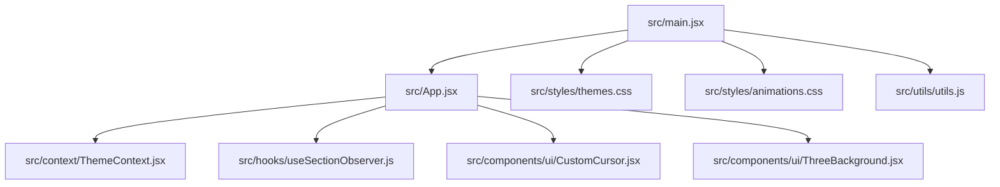
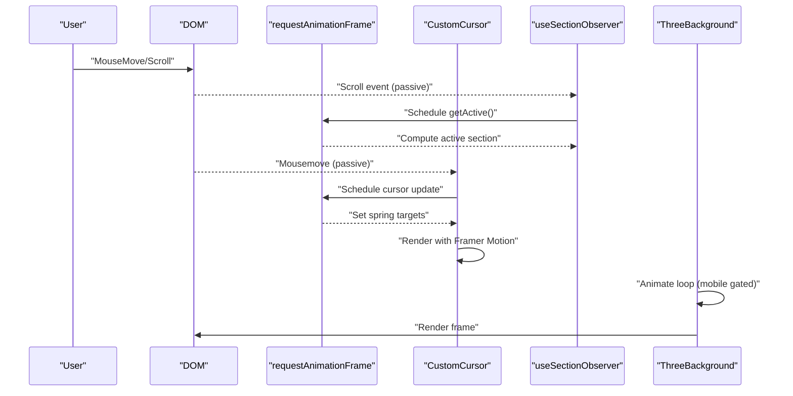
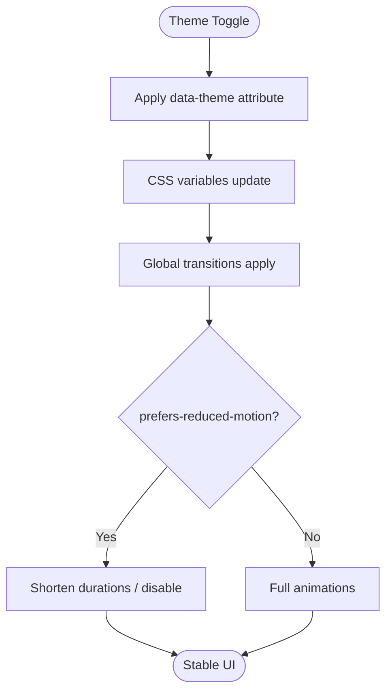
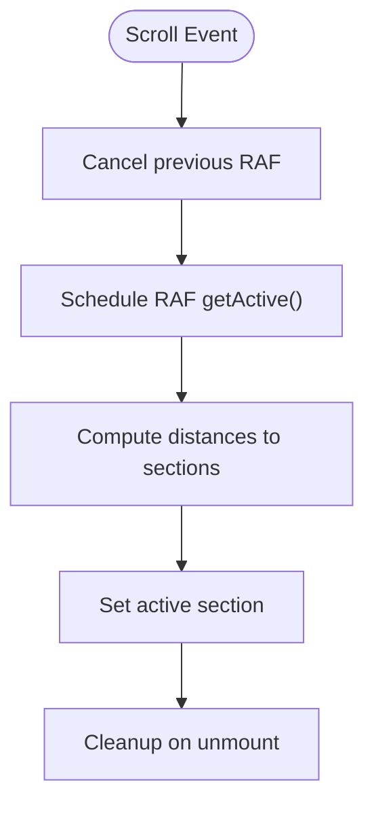
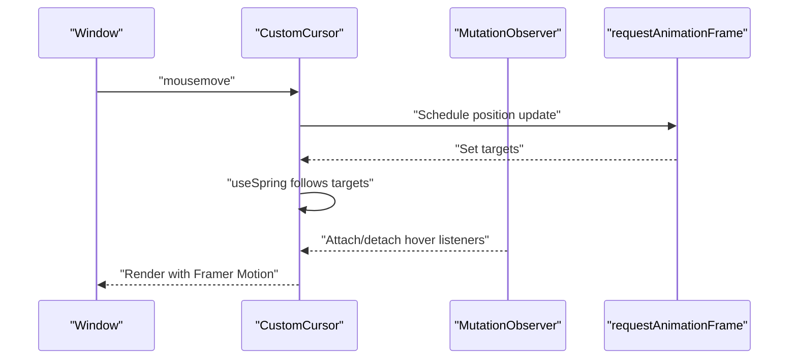
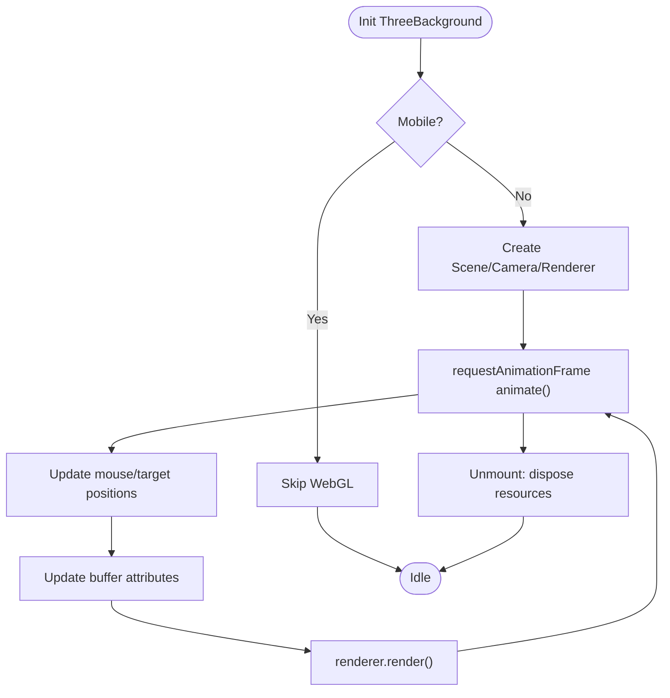
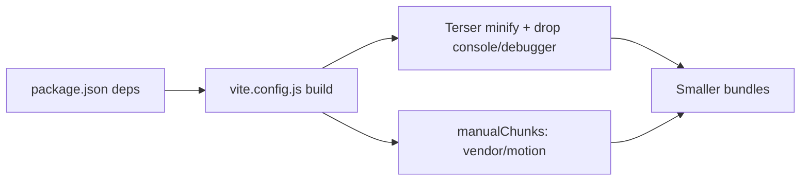
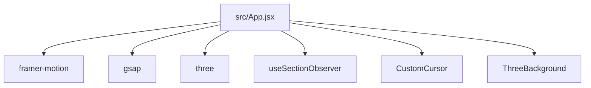

# Performance Optimization

<cite>
**Referenced Files in This Document**
- [README.md](file://README.md)
- [QUICK-START.md](file://QUICK-START.md)
- [vite.config.js](file://vite.config.js)
- [package.json](file://package.json)
- [src/main.jsx](file://src/main.jsx)
- [src/App.jsx](file://src/App.jsx)
- [src/context/ThemeContext.jsx](file://src/context/ThemeContext.jsx)
- [src/hooks/useSectionObserver.js](file://src/hooks/useSectionObserver.js)
- [src/components/ui/CustomCursor.jsx](file://src/components/ui/CustomCursor.jsx)
- [src/components/ui/ThreeBackground.jsx](file://src/components/ui/ThreeBackground.jsx)
- [src/styles/themes.css](file://src/styles/themes.css)
- [src/styles/animations.css](file://src/styles/animations.css)
- [src/utils/utils.js](file://src/utils/utils.js)
</cite>

## Table of Contents
1. [Introduction](#introduction)
2. [Project Structure](#project-structure)
3. [Core Components](#core-components)
4. [Architecture Overview](#architecture-overview)
5. [Detailed Component Analysis](#detailed-component-analysis)
6. [Dependency Analysis](#dependency-analysis)
7. [Performance Considerations](#performance-considerations)
8. [Troubleshooting Guide](#troubleshooting-guide)
9. [Conclusion](#conclusion)
10. [Appendices](#appendices)

## Introduction
This document provides a comprehensive guide to animation performance optimization for the portfolio project. It explains GPU acceleration techniques, animation throttling, memory management, and strategies to reduce jank. It also covers render cycle optimization, cleanup patterns, and practical guidance for choosing between Framer Motion and GSAP based on performance needs. Additional topics include mobile performance and battery life considerations, accessibility performance implications, monitoring techniques, profiling tools, and optimization checklists.

## Project Structure
The project is a React + Vite application with performance-conscious defaults and modular components. Key performance-related areas include:
- Build-time optimizations via Vite and Terser
- CSS-driven animations and theme transitions
- GPU-accelerated motion using Framer Motion and Three.js
- Scroll-throttled observers and requestAnimationFrame usage
- Theme-aware animations and reduced-motion support

**Diagram sources**
- [src/main.jsx:1-16](file://src/main.jsx#L1-L16)
- [src/App.jsx:1-47](file://src/App.jsx#L1-L47)
- [src/context/ThemeContext.jsx:1-23](file://src/context/ThemeContext.jsx#L1-L23)
- [src/hooks/useSectionObserver.js:1-52](file://src/hooks/useSectionObserver.js#L1-L52)
- [src/components/ui/CustomCursor.jsx:1-245](file://src/components/ui/CustomCursor.jsx#L1-L245)
- [src/components/ui/ThreeBackground.jsx:1-184](file://src/components/ui/ThreeBackground.jsx#L1-L184)
- [src/styles/themes.css:1-395](file://src/styles/themes.css#L1-L395)
- [src/styles/animations.css:1-426](file://src/styles/animations.css#L1-L426)
- [src/utils/utils.js:1-7](file://src/utils/utils.js#L1-L7)

**Section sources**
- [README.md:1-204](file://README.md#L1-L204)
- [QUICK-START.md:1-331](file://QUICK-START.md#L1-L331)
- [vite.config.js:1-41](file://vite.config.js#L1-L41)
- [package.json:1-42](file://package.json#L1-L42)
- [src/main.jsx:1-16](file://src/main.jsx#L1-L16)

## Core Components
- Theme system and CSS-driven animations: Centralized theme tokens and animation utilities enable consistent, GPU-friendly transitions and reduced-motion compliance.
- Scroll-throttled section observer: Uses requestAnimationFrame to minimize layout thrash during scroll.
- Custom cursor with springs: Demonstrates efficient motion with spring physics and per-frame updates.
- WebGL particle background: Implements a mobile-aware rendering pipeline with cleanup and resource disposal.

**Section sources**
- [src/styles/themes.css:224-395](file://src/styles/themes.css#L224-L395)
- [src/hooks/useSectionObserver.js:33-46](file://src/hooks/useSectionObserver.js#L33-L46)
- [src/components/ui/CustomCursor.jsx:51-130](file://src/components/ui/CustomCursor.jsx#L51-L130)
- [src/components/ui/ThreeBackground.jsx:19-166](file://src/components/ui/ThreeBackground.jsx#L19-L166)

## Architecture Overview
The runtime performance architecture emphasizes:
- Offloading animation to the compositor via transform/opacity
- Throttling expensive event handlers with requestAnimationFrame
- Conditional rendering for heavy effects on mobile
- Cleanup of resources and observers on unmount

**Diagram sources**
- [src/hooks/useSectionObserver.js:33-46](file://src/hooks/useSectionObserver.js#L33-L46)
- [src/components/ui/CustomCursor.jsx:51-130](file://src/components/ui/CustomCursor.jsx#L51-L130)
- [src/components/ui/ThreeBackground.jsx:121-153](file://src/components/ui/ThreeBackground.jsx#L121-L153)

## Detailed Component Analysis

### Theme System and CSS Animations
- Theme tokens drive consistent color and spacing; transitions are applied globally with cubic-bezier curves optimized for perceived smoothness.
- Animation utilities leverage transform and opacity with will-change hints to encourage GPU acceleration.
- Reduced-motion media queries disable or shorten animations for accessibility.

**Diagram sources**
- [src/context/ThemeContext.jsx:6-22](file://src/context/ThemeContext.jsx#L6-L22)
- [src/styles/themes.css:224-395](file://src/styles/themes.css#L224-L395)

**Section sources**
- [src/styles/themes.css:224-395](file://src/styles/themes.css#L224-L395)
- [src/context/ThemeContext.jsx:1-23](file://src/context/ThemeContext.jsx#L1-L23)

### Scroll-Throttled Section Observer
- Uses requestAnimationFrame to batch computations and avoid layout thrash.
- Passive event listeners reduce scroll blocking.
- Efficient distance calculation identifies the active section near a viewport trigger.

**Diagram sources**
- [src/hooks/useSectionObserver.js:33-46](file://src/hooks/useSectionObserver.js#L33-L46)

**Section sources**
- [src/hooks/useSectionObserver.js:1-52](file://src/hooks/useSectionObserver.js#L1-L52)

### Custom Cursor with Spring Physics
- Uses Framer Motion’s useMotionValue and useSpring for smooth, low-latency motion.
- requestAnimationFrame ensures cursor updates align with vsync.
- MutationObserver tracks dynamic hover targets to maintain responsiveness.
- Desktop-only behavior avoids unnecessary overhead on mobile.

**Diagram sources**
- [src/components/ui/CustomCursor.jsx:51-130](file://src/components/ui/CustomCursor.jsx#L51-L130)

**Section sources**
- [src/components/ui/CustomCursor.jsx:1-245](file://src/components/ui/CustomCursor.jsx#L1-L245)

### WebGL Particle Background
- Mobile gating prevents heavy WebGL rendering on low-power devices.
- requestAnimationFrame loop with delta timing for smooth motion.
- Buffer geometry updates and additive blending for glow effects.
- Comprehensive cleanup disposes geometries, materials, textures, and observers.

**Diagram sources**
- [src/components/ui/ThreeBackground.jsx:19-166](file://src/components/ui/ThreeBackground.jsx#L19-L166)

**Section sources**
- [src/components/ui/ThreeBackground.jsx:1-184](file://src/components/ui/ThreeBackground.jsx#L1-L184)

### Build-Time Optimizations
- Terser removes console and debugger statements.
- Manual chunking separates vendor and motion libraries for efficient caching and lazy loading.

**Diagram sources**
- [package.json:12-24](file://package.json#L12-L24)
- [vite.config.js:17-38](file://vite.config.js#L17-L38)

**Section sources**
- [package.json:12-24](file://package.json#L12-L24)
- [vite.config.js:17-38](file://vite.config.js#L17-L38)

## Dependency Analysis
- Framer Motion is used for lightweight, declarative animations and springs.
- GSAP is included for advanced timelines and high-performance sequencing when needed.
- Three.js powers the WebGL background with explicit resource lifecycle management.

**Diagram sources**
- [src/App.jsx:1-47](file://src/App.jsx#L1-L47)
- [package.json:12-24](file://package.json#L12-L24)

**Section sources**
- [src/App.jsx:1-47](file://src/App.jsx#L1-L47)
- [package.json:12-24](file://package.json#L12-L24)

## Performance Considerations

### GPU Acceleration Techniques
- Prefer transform and opacity for animations to leverage the compositor.
- Use will-change hints sparingly; rely on modern browsers’ heuristics.
- Keep paint areas minimal; avoid animating layout-affecting properties.

**Section sources**
- [src/styles/themes.css:254-258](file://src/styles/themes.css#L254-L258)
- [src/styles/animations.css:6-14](file://src/styles/animations.css#L6-L14)

### Animation Throttling
- Use requestAnimationFrame for motion loops and scroll handlers.
- Passive event listeners reduce scroll jank.
- Debounce or throttle frequent callbacks (e.g., resize) with minimal delay.

**Section sources**
- [src/hooks/useSectionObserver.js:33-46](file://src/hooks/useSectionObserver.js#L33-L46)
- [src/components/ui/CustomCursor.jsx:57-66](file://src/components/ui/CustomCursor.jsx#L57-L66)
- [src/components/ui/ThreeBackground.jsx:118-120](file://src/components/ui/ThreeBackground.jsx#L118-L120)

### Memory Management
- Dispose of Three.js resources (geometry, material, texture) on unmount.
- Cancel animation frames and disconnect observers.
- Avoid accumulating event listeners; track attached nodes and remove them.

**Section sources**
- [src/components/ui/ThreeBackground.jsx:155-165](file://src/components/ui/ThreeBackground.jsx#L155-L165)
- [src/components/ui/CustomCursor.jsx:115-129](file://src/components/ui/CustomCursor.jsx#L115-L129)

### Reducing Jank
- Keep animation durations short and consistent (Apple-like easing).
- Limit concurrent animations; stagger where appropriate.
- Avoid forced synchronous layouts; batch DOM reads/writes.

**Section sources**
- [QUICK-START.md:37-41](file://QUICK-START.md#L37-L41)
- [src/styles/animations.css:318-325](file://src/styles/animations.css#L318-L325)

### Optimizing Render Cycles
- Use CSS transforms and opacity; avoid layout-triggering properties.
- Minimize reflows by batching DOM writes.
- Prefer offscreen canvases for heavy WebGL workloads.

**Section sources**
- [src/styles/themes.css:230-246](file://src/styles/themes.css#L230-L246)
- [src/components/ui/ThreeBackground.jsx:37-39](file://src/components/ui/ThreeBackground.jsx#L37-L39)

### Animation Cleanup
- Always clean up RAF loops, event listeners, observers, and Three.js disposables.
- Ensure cleanup runs before component remounts or route changes.

**Section sources**
- [src/components/ui/ThreeBackground.jsx:155-165](file://src/components/ui/ThreeBackground.jsx#L155-L165)
- [src/components/ui/CustomCursor.jsx:115-129](file://src/components/ui/CustomCursor.jsx#L115-L129)

### Choosing Between Framer Motion and GSAP
- Framer Motion: Best for declarative UI animations, springs, gesture-driven motion, and tight React integration.
- GSAP: Best for precise timelines, complex sequencing, and high-performance DOM/scene manipulation when fine-grained control is needed.

**Section sources**
- [package.json:14-17](file://package.json#L14-L17)

### Mobile Performance and Battery Life
- Gate heavy WebGL on mobile; detect device capabilities and pointer type.
- Reduce pixel ratio and use conservative particle counts.
- Disable or simplify animations for lower-end devices.

**Section sources**
- [src/components/ui/ThreeBackground.jsx:20-21](file://src/components/ui/ThreeBackground.jsx#L20-L21)
- [src/components/ui/CustomCursor.jsx:52-54](file://src/components/ui/CustomCursor.jsx#L52-L54)

### Accessibility Performance Implications
- Respect reduced-motion preferences; disable or shorten animations.
- Ensure keyboard and screen-reader friendly interactions remain smooth.

**Section sources**
- [src/styles/themes.css:355-377](file://src/styles/themes.css#L355-L377)

### Performance Monitoring and Profiling
- Use browser devtools to profile long tasks, paint, and composite stalls.
- Measure frame times and identify jank contributors.
- Monitor bundle sizes and chunk loading to avoid main-thread contention.

**Section sources**
- [README.md:125-135](file://README.md#L125-L135)

### Optimization Checklist
- Prefer transform/opacity animations
- Use requestAnimationFrame for motion loops
- Apply passive event listeners
- Dispose of Three.js resources
- Respect reduced-motion preferences
- Gate heavy WebGL on mobile
- Split bundles and minimize console/debugger statements
- Profile regularly and iterate

**Section sources**
- [src/styles/themes.css:230-246](file://src/styles/themes.css#L230-L246)
- [src/components/ui/ThreeBackground.jsx:155-165](file://src/components/ui/ThreeBackground.jsx#L155-L165)
- [vite.config.js:19-24](file://vite.config.js#L19-L24)

## Troubleshooting Guide
- Build fails after dependency changes: Clear node_modules and lockfile, then rebuild.
- Images not loading: Verify paths and formats; ensure WebP/JPG/PNG availability.
- Theme not persisting: Confirm localStorage availability and theme keys alignment.
- Animations too slow/fast: Adjust transition durations in components or CSS utilities.

**Section sources**
- [README.md:169-186](file://README.md#L169-L186)

## Conclusion
By combining CSS-driven animations, GPU-accelerated motion, throttled event handling, and careful resource management, the portfolio achieves smooth, accessible performance across devices. Use Framer Motion for most UI animations and reserve GSAP for advanced sequencing. Continuously monitor and profile to maintain optimal performance, especially on mobile and lower-end hardware.

## Appendices

### Bundle Size Highlights
- Total size and gzip sizes are documented in the project readme, aiding performance baseline checks.

**Section sources**
- [README.md:125-135](file://README.md#L125-L135)