# Scroll-Triggered Animations

<cite>
**Referenced Files in This Document**
- [App.jsx](file://src/App.jsx)
- [Navbar.jsx](file://src/components/layout/Navbar.jsx)
- [BackToTop.jsx](file://src/components/ui/BackToTop.jsx)
- [useSectionObserver.js](file://src/hooks/useSectionObserver.js)
- [StickyProjectCards.jsx](file://src/components/ui/StickyProjectCards.jsx)
- [StickyCard002.jsx](file://src/components/ui/StickyCard002.jsx)
- [Projects.jsx](file://src/components/sections/Projects.jsx)
- [animations.css](file://src/styles/animations.css)
- [variants.js](file://src/utils/variants.js)
- [ThreeBackground.jsx](file://src/components/ui/ThreeBackground.jsx)
- [package.json](file://package.json)
</cite>

## Table of Contents
1. [Introduction](#introduction)
2. [Project Structure](#project-structure)
3. [Core Components](#core-components)
4. [Architecture Overview](#architecture-overview)
5. [Detailed Component Analysis](#detailed-component-analysis)
6. [Dependency Analysis](#dependency-analysis)
7. [Performance Considerations](#performance-considerations)
8. [Troubleshooting Guide](#troubleshooting-guide)
9. [Conclusion](#conclusion)
10. [Appendices](#appendices)

## Introduction
This document explains scroll-based animation triggers and sticky element behaviors implemented in the portfolio. It covers:
- Intersection Observer–inspired section visibility detection
- Scroll position tracking and animated navigation highlighting
- Back-to-top functionality
- Sticky project cards with GSAP ScrollTrigger
- Scroll-responsive UI elements and parallax effects
- Performance optimization, memory management, and cross-browser compatibility
- Guidelines for building custom scroll animations and responsive behavior detection

## Project Structure
The scroll-triggered features are composed of:
- A hook that computes the active section based on scroll position
- A navbar that highlights the active section and reacts to scroll
- A back-to-top button that appears after scrolling down
- Sticky card stacks powered by GSAP ScrollTrigger and Lenis smooth scrolling
- CSS-driven micro-interactions and parallax layers
- A WebGL background that responds to mouse movement and scroll

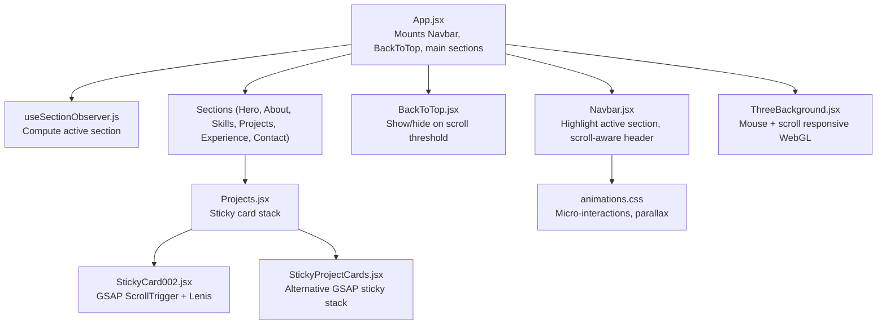

**Diagram sources**
- [App.jsx:15-44](file://src/App.jsx#L15-L44)
- [useSectionObserver.js:3-49](file://src/hooks/useSectionObserver.js#L3-L49)
- [Navbar.jsx:14-25](file://src/components/layout/Navbar.jsx#L14-L25)
- [BackToTop.jsx:4-17](file://src/components/ui/BackToTop.jsx#L4-L17)
- [Projects.jsx:17-88](file://src/components/sections/Projects.jsx#L17-L88)
- [StickyCard002.jsx:25-95](file://src/components/ui/StickyCard002.jsx#L25-L95)
- [StickyProjectCards.jsx:12-50](file://src/components/ui/StickyProjectCards.jsx#L12-L50)
- [animations.css:326-338](file://src/styles/animations.css#L326-L338)
- [ThreeBackground.jsx:19-166](file://src/components/ui/ThreeBackground.jsx#L19-L166)

**Section sources**
- [App.jsx:15-44](file://src/App.jsx#L15-L44)
- [package.json:12-24](file://package.json#L12-L24)

## Core Components
- Active section detection via scroll position sampling with requestAnimationFrame
- Animated navigation highlighting based on the active section
- Back-to-top button with scroll threshold and smooth scroll
- Sticky card stacks using GSAP ScrollTrigger with pinning and scrubbing
- CSS micro-interactions and parallax layers
- Mouse-move and scroll-responsive WebGL background

**Section sources**
- [useSectionObserver.js:3-49](file://src/hooks/useSectionObserver.js#L3-L49)
- [Navbar.jsx:14-25](file://src/components/layout/Navbar.jsx#L14-L25)
- [BackToTop.jsx:4-17](file://src/components/ui/BackToTop.jsx#L4-L17)
- [StickyCard002.jsx:25-95](file://src/components/ui/StickyCard002.jsx#L25-L95)
- [animations.css:326-338](file://src/styles/animations.css#L326-L338)
- [ThreeBackground.jsx:94-107](file://src/components/ui/ThreeBackground.jsx#L94-L107)

## Architecture Overview
The scroll system integrates React hooks, DOM scroll listeners, GSAP ScrollTrigger, and CSS animations. The active section is computed efficiently using requestAnimationFrame and a 30% viewport trigger. The navbar reflects the active section, and the back-to-top button appears when the user scrolls down sufficiently. Sticky stacks use GSAP timelines controlled by ScrollTrigger, with ResizeObserver refresh for responsiveness.

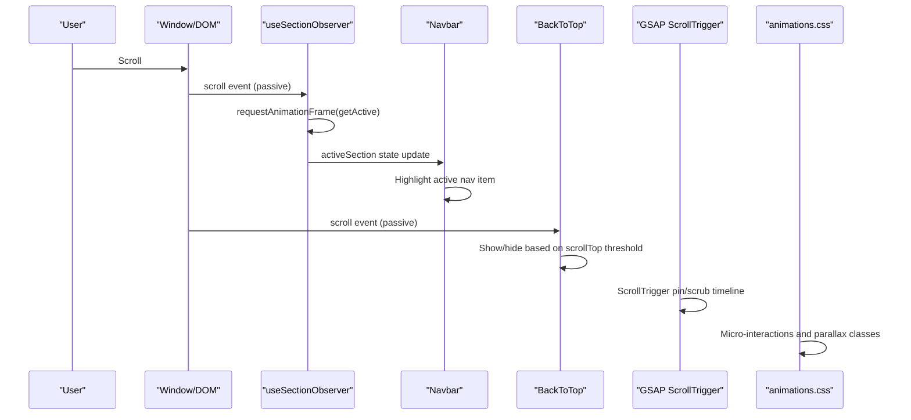

**Diagram sources**
- [useSectionObserver.js:33-41](file://src/hooks/useSectionObserver.js#L33-L41)
- [Navbar.jsx:19-25](file://src/components/layout/Navbar.jsx#L19-L25)
- [BackToTop.jsx:11-16](file://src/components/ui/BackToTop.jsx#L11-L16)
- [StickyCard002.jsx:41-50](file://src/components/ui/StickyCard002.jsx#L41-L50)
- [animations.css:326-338](file://src/styles/animations.css#L326-L338)

## Detailed Component Analysis

### Active Section Detection Hook
- Uses a scroll container (main content) and a 30% viewport trigger to compute the nearest section to the trigger line.
- Debounces with requestAnimationFrame to avoid layout thrash.
- Cleans up listeners and cancels frame requests on unmount.

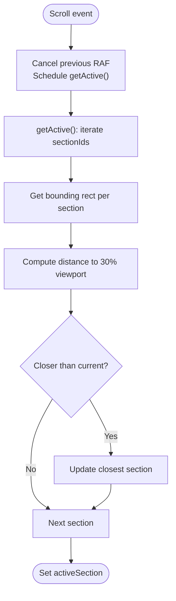

**Diagram sources**
- [useSectionObserver.js:10-31](file://src/hooks/useSectionObserver.js#L10-L31)

**Section sources**
- [useSectionObserver.js:3-49](file://src/hooks/useSectionObserver.js#L3-L49)

### Animated Navigation Highlighting
- The navbar listens to scroll to set a “scrolled” state for styling.
- The active section prop drives the highlight indicator via a layout animation.

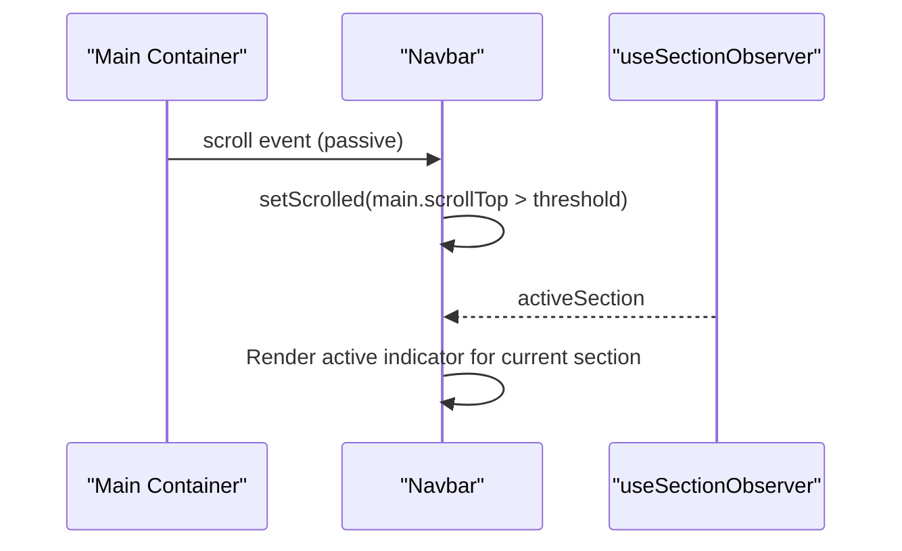

**Diagram sources**
- [Navbar.jsx:19-25](file://src/components/layout/Navbar.jsx#L19-L25)
- [useSectionObserver.js:4-5](file://src/hooks/useSectionObserver.js#L4-L5)

**Section sources**
- [Navbar.jsx:14-25](file://src/components/layout/Navbar.jsx#L14-L25)
- [App.jsx:16-17](file://src/App.jsx#L16-L17)

### Back-to-Top Button
- Toggles visibility based on scroll threshold on the main content container.
- Smoothly scrolls to top on click using native smooth scrolling.

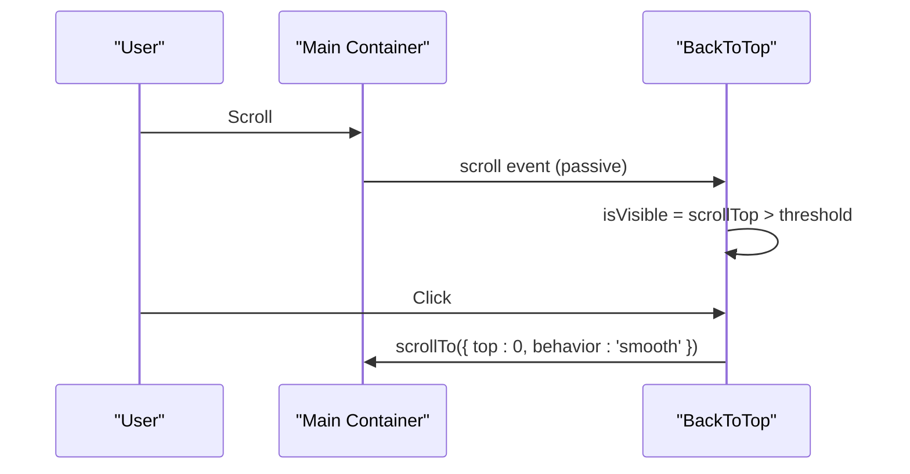

**Diagram sources**
- [BackToTop.jsx:11-24](file://src/components/ui/BackToTop.jsx#L11-L24)

**Section sources**
- [BackToTop.jsx:4-17](file://src/components/ui/BackToTop.jsx#L4-L17)

### Sticky Project Cards (GSAP ScrollTrigger)
- Registers ScrollTrigger and builds a timeline to animate a stack of cards as the user scrolls.
- Pins the container and scrubs the animation smoothly.
- Uses ResizeObserver to refresh ScrollTrigger on layout changes.

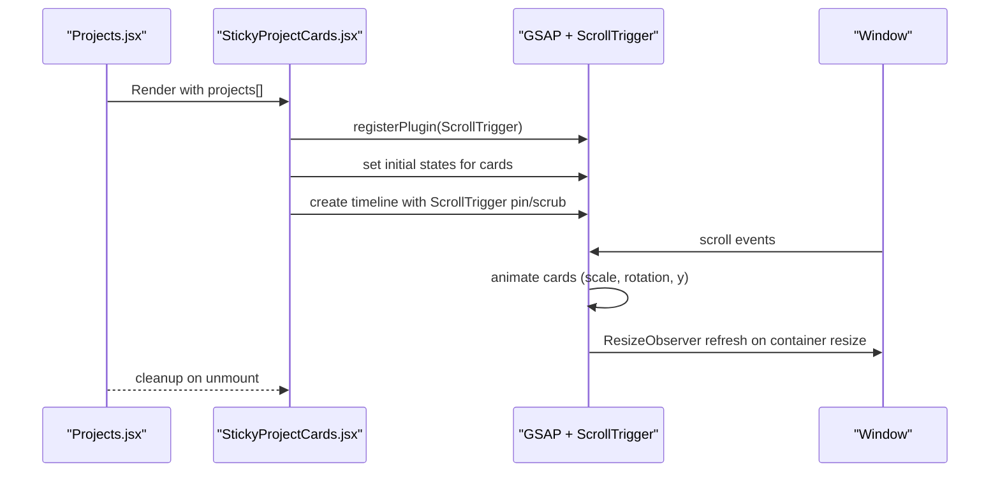

**Diagram sources**
- [Projects.jsx:84-88](file://src/components/sections/Projects.jsx#L84-L88)
- [StickyProjectCards.jsx:12-50](file://src/components/ui/StickyProjectCards.jsx#L12-L50)

**Section sources**
- [StickyProjectCards.jsx:8-50](file://src/components/ui/StickyProjectCards.jsx#L8-L50)
- [Projects.jsx:17-88](file://src/components/sections/Projects.jsx#L17-L88)

### Alternative Sticky Card Stack (StickyCard002)
- Similar pattern using GSAP ScrollTrigger with Lenis for smooth scrolling.
- Demonstrates layered transforms and pinning across multiple images.

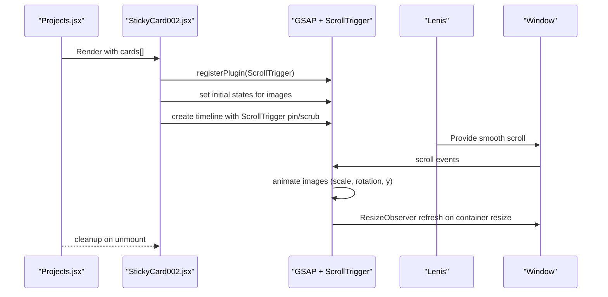

**Diagram sources**
- [Projects.jsx:84-88](file://src/components/sections/Projects.jsx#L84-L88)
- [StickyCard002.jsx:25-95](file://src/components/ui/StickyCard002.jsx#L25-L95)

**Section sources**
- [StickyCard002.jsx:16-95](file://src/components/ui/StickyCard002.jsx#L16-L95)
- [Projects.jsx:17-88](file://src/components/sections/Projects.jsx#L17-L88)

### Scroll-Responsive UI Elements and Parallax
- CSS provides parallax layers via transform and will-change hints.
- Micro-interactions (bounce, slide, float, glow) enhance feedback during scroll.

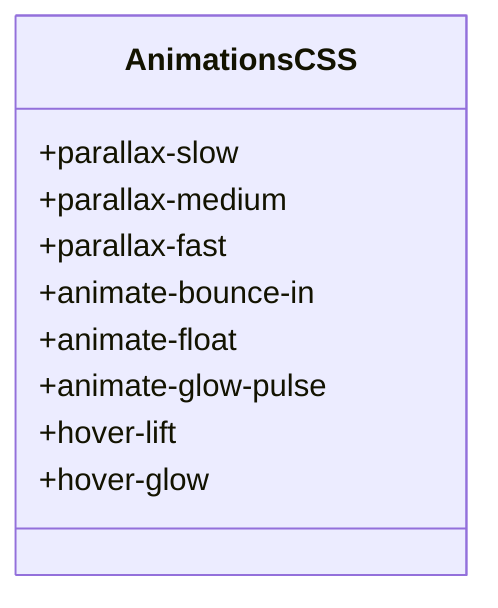

**Diagram sources**
- [animations.css:326-338](file://src/styles/animations.css#L326-L338)
- [animations.css:52-118](file://src/styles/animations.css#L52-L118)

**Section sources**
- [animations.css:326-338](file://src/styles/animations.css#L326-L338)
- [animations.css:52-118](file://src/styles/animations.css#L52-L118)

### Scroll-Progress Animations and Viewport-Based Triggers
- The active section hook uses a viewport-relative trigger (30% down) to decide the active section.
- Framer Motion’s useInView and viewport props enable staggered entrance animations when sections come into view.

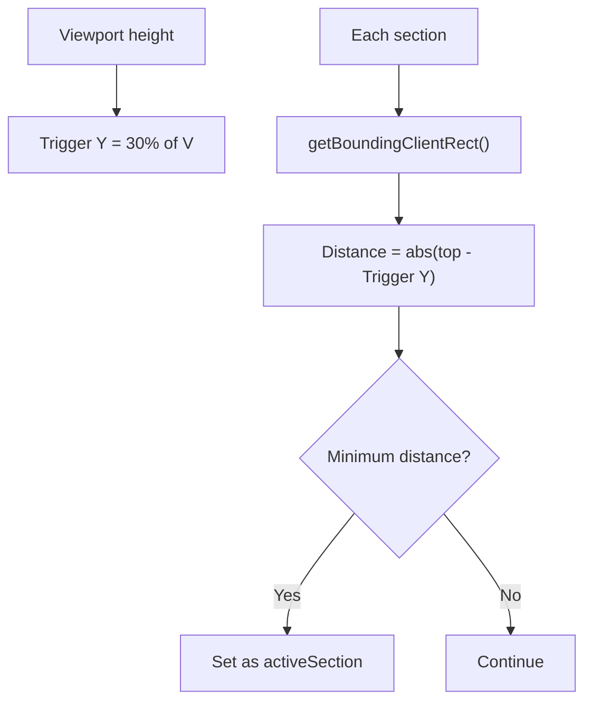

**Diagram sources**
- [useSectionObserver.js:11-28](file://src/hooks/useSectionObserver.js#L11-L28)

**Section sources**
- [useSectionObserver.js:10-31](file://src/hooks/useSectionObserver.js#L10-L31)
- [variants.js:1-17](file://src/utils/variants.js#L1-L17)

### Mouse and Scroll Responsive Background (WebGL)
- A WebGL particle system responds to mouse movement and scroll.
- Scroll updates a vertical offset that influences particle positions and camera tilt.
- Uses requestAnimationFrame and ResizeObserver for smooth rendering and responsive updates.

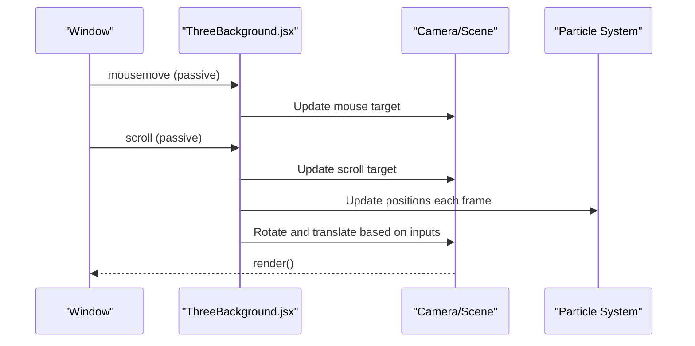

**Diagram sources**
- [ThreeBackground.jsx:94-107](file://src/components/ui/ThreeBackground.jsx#L94-L107)
- [ThreeBackground.jsx:124-151](file://src/components/ui/ThreeBackground.jsx#L124-L151)

**Section sources**
- [ThreeBackground.jsx:19-166](file://src/components/ui/ThreeBackground.jsx#L19-L166)

## Dependency Analysis
- React and Framer Motion power UI animations and scroll-aware components.
- GSAP and ScrollTrigger drive complex scroll-linked animations.
- Lenis provides smooth scrolling for enhanced UX.
- Tailwind and CSS animations supply lightweight micro-interactions.

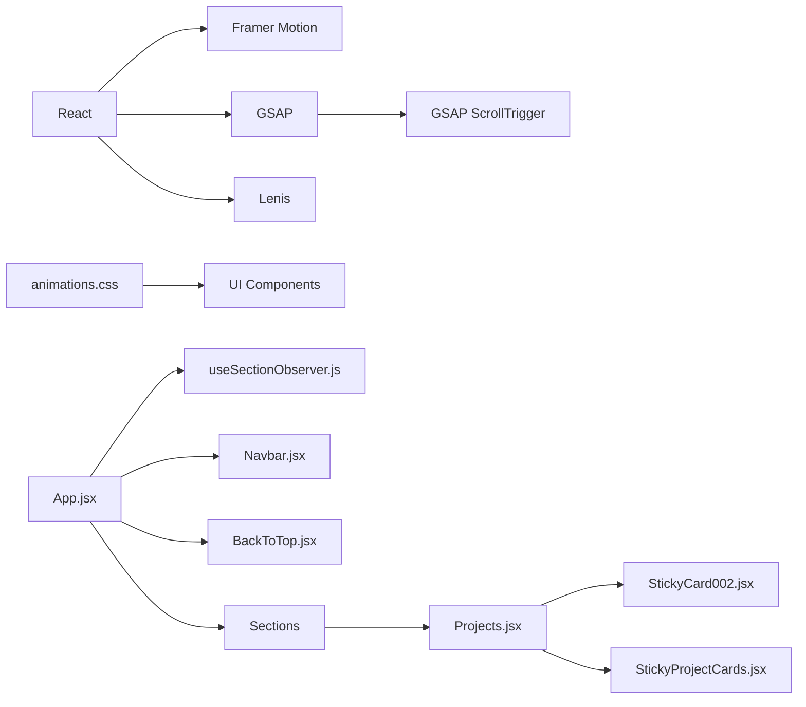

**Diagram sources**
- [package.json:12-24](file://package.json#L12-L24)
- [App.jsx:13-17](file://src/App.jsx#L13-L17)

**Section sources**
- [package.json:12-24](file://package.json#L12-L24)
- [App.jsx:13-17](file://src/App.jsx#L13-L17)

## Performance Considerations
- Event listeners are passive to improve scrolling performance.
- requestAnimationFrame is used to batch computations and reduce layout thrash.
- GSAP ScrollTrigger leverages efficient timeline updates and pinning with scrubbing.
- ResizeObserver refresh ensures accurate scroll-linked animations after layout changes.
- WebGL background uses requestAnimationFrame and targeted updates to minimize GPU overhead.
- CSS parallax layers rely on transform and will-change for hardware acceleration-friendly movement.

[No sources needed since this section provides general guidance]

## Troubleshooting Guide
- Active section not updating:
  - Verify the main content container ID matches the expected element.
  - Ensure section IDs passed to the hook correspond to actual DOM elements.
- Back-to-top not appearing:
  - Confirm the scroll threshold and container ID are correct.
  - Check that smooth scroll behavior is supported in the target browser.
- Sticky cards not animating:
  - Ensure GSAP and ScrollTrigger plugins are registered.
  - Confirm the trigger element and container dimensions are measurable.
  - Verify ResizeObserver is observing the container and ScrollTrigger.refresh is called on resize.
- WebGL background not responding:
  - Check for mobile exclusions and ensure event listeners are attached to the correct target.
  - Confirm requestAnimationFrame loop is running and geometry/material resources are disposed on unmount.

**Section sources**
- [useSectionObserver.js:8](file://src/hooks/useSectionObserver.js#L8)
- [BackToTop.jsx:11-16](file://src/components/ui/BackToTop.jsx#L11-L16)
- [StickyProjectCards.jsx:41-47](file://src/components/ui/StickyProjectCards.jsx#L41-L47)
- [StickyCard002.jsx:80-92](file://src/components/ui/StickyCard002.jsx#L80-L92)
- [ThreeBackground.jsx:155-166](file://src/components/ui/ThreeBackground.jsx#L155-L166)

## Conclusion
The portfolio implements robust scroll-triggered animations using a combination of a lightweight active-section hook, passive scroll listeners, GSAP ScrollTrigger for sticky stacks, and CSS micro-interactions. The system balances performance with rich visual feedback, ensuring smooth experiences across devices. The included guidelines help extend the approach to custom scroll animations and responsive behavior detection.

[No sources needed since this section summarizes without analyzing specific files]

## Appendices

### Creating Custom Scroll Animations
- Choose a trigger mechanism:
  - Viewport-relative thresholds (like the active section hook)
  - Intersection Observer for enter/exit events
  - Scroll position thresholds for simple show/hide
- For complex animations:
  - Use GSAP timelines with ScrollTrigger pin/scrub
  - Combine with Lenis for smooth scrolling
- For lightweight effects:
  - Use CSS transform and will-change for hardware-accelerated movement
  - Apply micro-interactions for subtle feedback
- Performance tips:
  - Prefer passive listeners and requestAnimationFrame
  - Use ResizeObserver to refresh scroll-linked layouts
  - Dispose of WebGL resources and cancel animation frames on unmount

[No sources needed since this section provides general guidance]