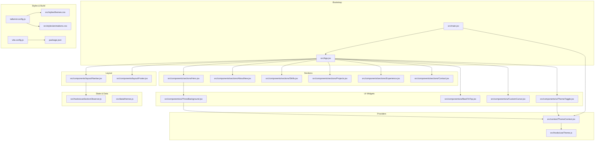
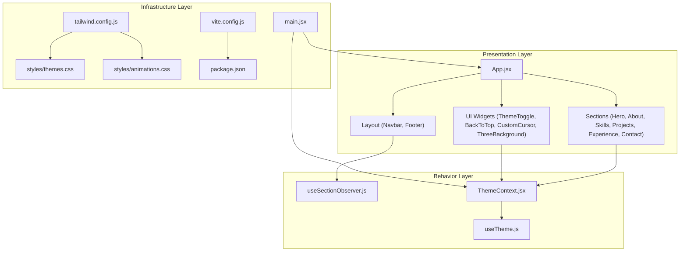
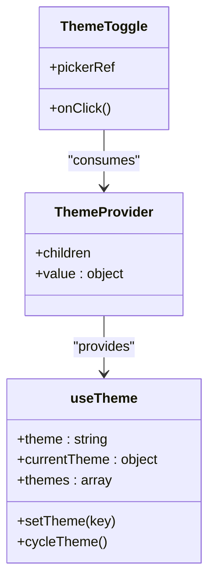
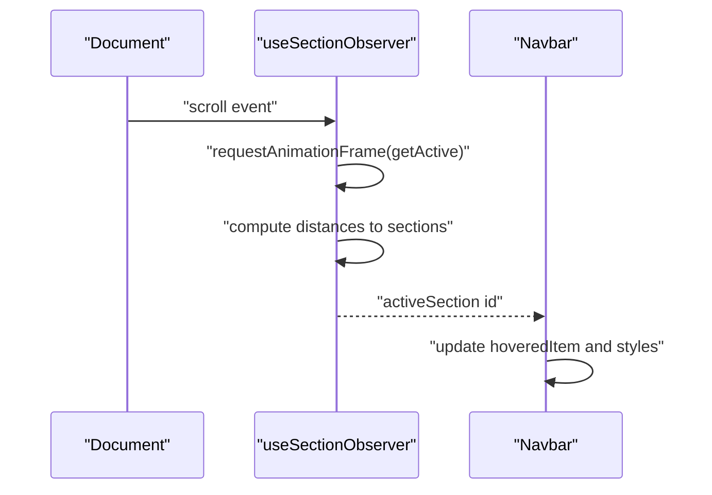
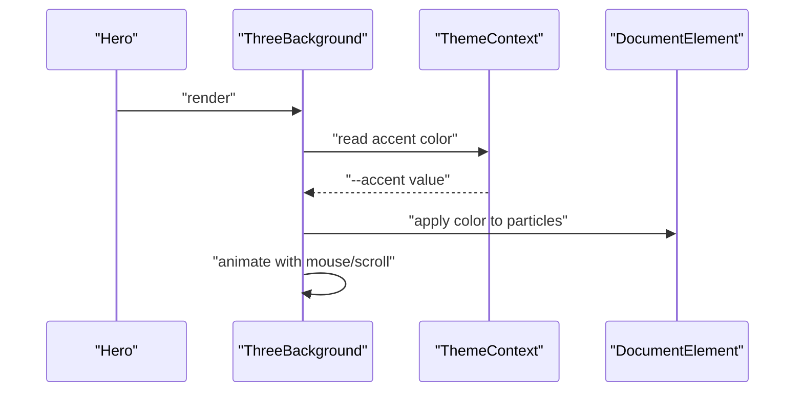
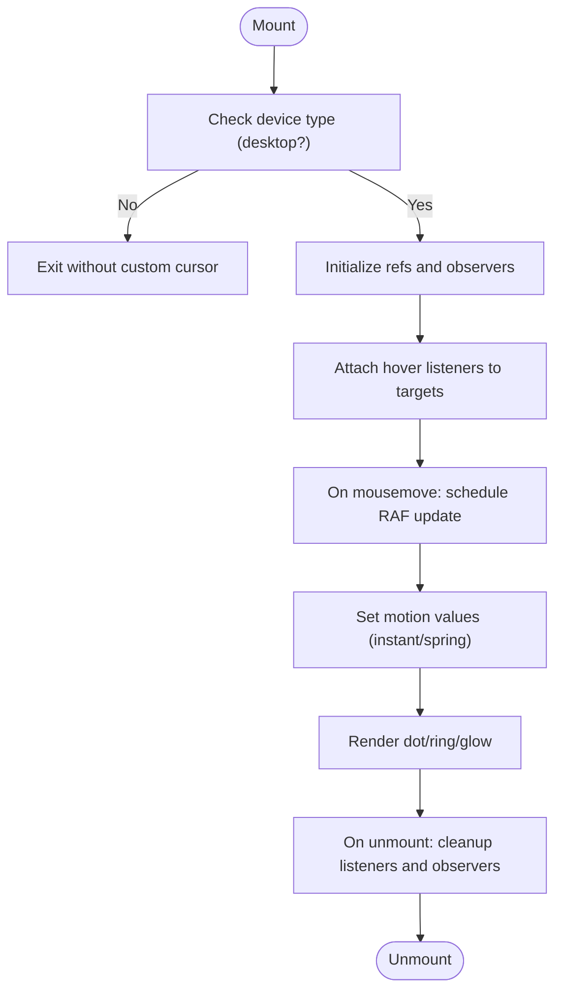
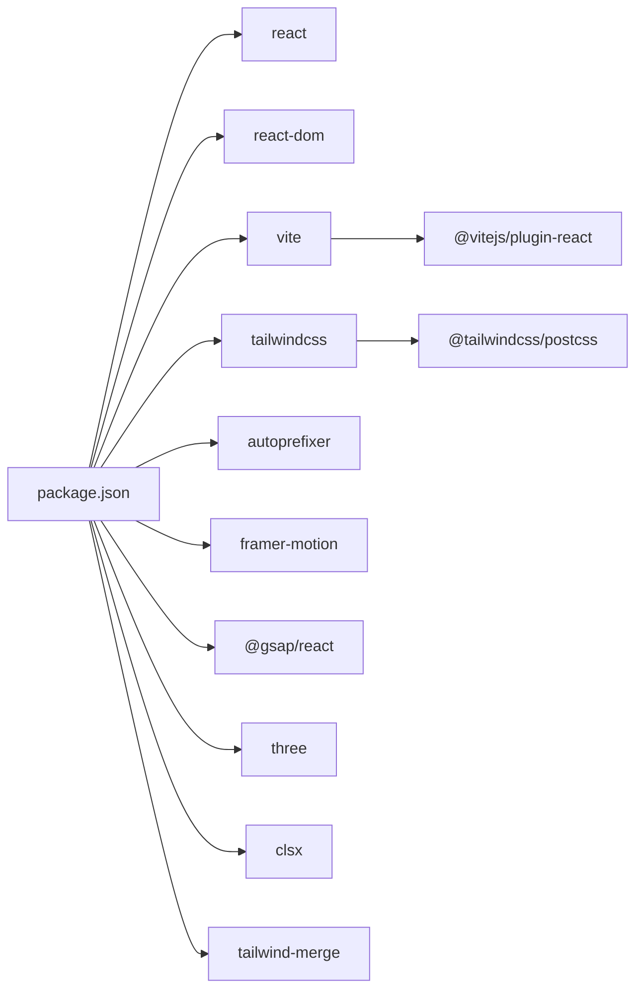

# Architecture Overview

<cite>
**Referenced Files in This Document**
- [src/main.jsx](file://src/main.jsx)
- [src/App.jsx](file://src/App.jsx)
- [src/context/ThemeContext.jsx](file://src/context/ThemeContext.jsx)
- [src/hooks/useTheme.js](file://src/hooks/useTheme.js)
- [src/hooks/useSectionObserver.js](file://src/hooks/useSectionObserver.js)
- [src/components/layout/Navbar.jsx](file://src/components/layout/Navbar.jsx)
- [src/components/ui/ThemeToggle.jsx](file://src/components/ui/ThemeToggle.jsx)
- [src/components/ui/CustomCursor.jsx](file://src/components/ui/CustomCursor.jsx)
- [src/components/ui/ThreeBackground.jsx](file://src/components/ui/ThreeBackground.jsx)
- [src/components/sections/Hero.jsx](file://src/components/sections/Hero.jsx)
- [src/data/themes.js](file://src/data/themes.js)
- [src/lib/utils.js](file://src/lib/utils.js)
- [src/utils/variants.js](file://src/utils/variants.js)
- [src/styles/themes.css](file://src/styles/themes.css)
- [src/styles/animations.css](file://src/styles/animations.css)
- [tailwind.config.js](file://tailwind.config.js)
- [vite.config.js](file://vite.config.js)
- [package.json](file://package.json)
</cite>

## Table of Contents
1. [Introduction](#introduction)
2. [Project Structure](#project-structure)
3. [Core Components](#core-components)
4. [Architecture Overview](#architecture-overview)
5. [Detailed Component Analysis](#detailed-component-analysis)
6. [Dependency Analysis](#dependency-analysis)
7. [Performance Considerations](#performance-considerations)
8. [Troubleshooting Guide](#troubleshooting-guide)
9. [Conclusion](#conclusion)

## Introduction
This document presents the architectural blueprint of a modern portfolio website built with React and Vite. It focuses on the component-based architecture, state management strategies, theming and animation systems, and build-time optimizations. The design emphasizes composability, performance, and a cohesive user experience across desktop and mobile contexts.

## Project Structure
The project follows a feature-based organization under src/, separating concerns into:
- Application bootstrap and provider wiring
- Layout and section components
- UI primitives and interactive widgets
- Hooks for cross-cutting concerns
- Context and data for theming
- Styles for design tokens, animations, and Tailwind integration
- Utilities for class merging and animation variants

**Diagram sources**
- [src/main.jsx:1-16](file://src/main.jsx#L1-L16)
- [src/App.jsx:1-47](file://src/App.jsx#L1-L47)
- [src/context/ThemeContext.jsx:1-23](file://src/context/ThemeContext.jsx#L1-L23)
- [src/hooks/useTheme.js:1-33](file://src/hooks/useTheme.js#L1-L33)
- [src/hooks/useSectionObserver.js:1-52](file://src/hooks/useSectionObserver.js#L1-L52)
- [src/components/layout/Navbar.jsx:1-255](file://src/components/layout/Navbar.jsx#L1-L255)
- [src/components/ui/ThemeToggle.jsx:1-113](file://src/components/ui/ThemeToggle.jsx#L1-L113)
- [src/components/ui/CustomCursor.jsx:1-245](file://src/components/ui/CustomCursor.jsx#L1-L245)
- [src/components/ui/ThreeBackground.jsx:1-183](file://src/components/ui/ThreeBackground.jsx#L1-L183)
- [src/components/sections/Hero.jsx:1-229](file://src/components/sections/Hero.jsx#L1-L229)
- [src/data/themes.js:1-30](file://src/data/themes.js#L1-L30)
- [src/styles/themes.css:1-395](file://src/styles/themes.css#L1-L395)
- [src/styles/animations.css:1-426](file://src/styles/animations.css#L1-L426)
- [tailwind.config.js:1-54](file://tailwind.config.js#L1-L54)
- [vite.config.js:1-34](file://vite.config.js#L1-L34)
- [package.json:1-41](file://package.json#L1-L41)

**Section sources**
- [src/main.jsx:1-16](file://src/main.jsx#L1-L16)
- [src/App.jsx:1-47](file://src/App.jsx#L1-L47)
- [tailwind.config.js:1-54](file://tailwind.config.js#L1-L54)
- [vite.config.js:1-34](file://vite.config.js#L1-L34)
- [package.json:1-41](file://package.json#L1-L41)

## Core Components
This section outlines the primary building blocks and their responsibilities.

- Application shell and routing anchors
  - App orchestrates the page structure, composes layout and sections, and exposes the active section identifier to the navbar.
  - Bootstrap wires providers and renders the app tree.

- Theming subsystem
  - ThemeProvider encapsulates theme state and exposes it via a custom hook.
  - useTheme manages persisted theme selection, applies the data-theme attribute, and cycles through available themes.
  - ThemeToggle offers a floating UI to switch themes and integrates with the provider.

- Navigation and scroll awareness
  - Navbar displays links and reacts to active section and scroll state.
  - useSectionObserver computes the currently active section based on viewport thresholds and requestAnimationFrame throttling.

- Interactive widgets
  - CustomCursor provides a desktop-enhanced cursor with hover text and spring physics.
  - ThreeBackground renders a WebGL particle system that responds to theme color and user input.

- Sections and media
  - Hero showcases animated typewriter text, gradients, and micro-interactions.
  - Other sections (About, Skills, Projects, Experience, Contact) are composed similarly and benefit from shared animations and theme tokens.

- Utilities and animation helpers
  - cn merges Tailwind classes safely.
  - variants defines Framer Motion container/item animation sequences.

**Section sources**
- [src/App.jsx:15-44](file://src/App.jsx#L15-L44)
- [src/main.jsx:7-15](file://src/main.jsx#L7-L15)
- [src/context/ThemeContext.jsx:6-22](file://src/context/ThemeContext.jsx#L6-L22)
- [src/hooks/useTheme.js:4-32](file://src/hooks/useTheme.js#L4-L32)
- [src/components/ui/ThemeToggle.jsx:5-110](file://src/components/ui/ThemeToggle.jsx#L5-L110)
- [src/hooks/useSectionObserver.js:3-49](file://src/hooks/useSectionObserver.js#L3-L49)
- [src/components/layout/Navbar.jsx:14-254](file://src/components/layout/Navbar.jsx#L14-L254)
- [src/components/ui/CustomCursor.jsx:4-242](file://src/components/ui/CustomCursor.jsx#L4-L242)
- [src/components/ui/ThreeBackground.jsx:5-180](file://src/components/ui/ThreeBackground.jsx#L5-L180)
- [src/components/sections/Hero.jsx:7-226](file://src/components/sections/Hero.jsx#L7-L226)
- [src/lib/utils.js:4-6](file://src/lib/utils.js#L4-L6)
- [src/utils/variants.js:1-17](file://src/utils/variants.js#L1-L17)

## Architecture Overview
The architecture is layered and component-centric:
- Presentation layer: App, sections, and UI widgets
- Behavior layer: Hooks for scroll observation and theme management
- Infrastructure layer: Providers, build configuration, and styles

**Diagram sources**
- [src/main.jsx:1-16](file://src/main.jsx#L1-L16)
- [src/App.jsx:1-47](file://src/App.jsx#L1-L47)
- [src/context/ThemeContext.jsx:1-23](file://src/context/ThemeContext.jsx#L1-L23)
- [src/hooks/useTheme.js:1-33](file://src/hooks/useTheme.js#L1-L33)
- [src/hooks/useSectionObserver.js:1-52](file://src/hooks/useSectionObserver.js#L1-L52)
- [src/components/layout/Navbar.jsx:1-255](file://src/components/layout/Navbar.jsx#L1-L255)
- [src/components/ui/ThemeToggle.jsx:1-113](file://src/components/ui/ThemeToggle.jsx#L1-L113)
- [src/components/ui/CustomCursor.jsx:1-245](file://src/components/ui/CustomCursor.jsx#L1-L245)
- [src/components/ui/ThreeBackground.jsx:1-183](file://src/components/ui/ThreeBackground.jsx#L1-L183)
- [src/components/sections/Hero.jsx:1-229](file://src/components/sections/Hero.jsx#L1-L229)
- [tailwind.config.js:1-54](file://tailwind.config.js#L1-L54)
- [src/styles/themes.css:1-395](file://src/styles/themes.css#L1-L395)
- [src/styles/animations.css:1-426](file://src/styles/animations.css#L1-L426)
- [vite.config.js:1-34](file://vite.config.js#L1-L34)
- [package.json:1-41](file://package.json#L1-L41)

## Detailed Component Analysis

### Theme System and Context API
The theme system uses a small, focused Context API pattern:
- ThemeProvider wraps the app and exposes theme values via useThemeContext.
- useTheme manages local state, persists the selected theme, and applies a data-theme attribute to the document element.
- ThemeToggle reads the context and renders a theme picker with animated transitions.

**Diagram sources**
- [src/context/ThemeContext.jsx:6-22](file://src/context/ThemeContext.jsx#L6-L22)
- [src/hooks/useTheme.js:4-32](file://src/hooks/useTheme.js#L4-L32)
- [src/components/ui/ThemeToggle.jsx:5-110](file://src/components/ui/ThemeToggle.jsx#L5-L110)

**Section sources**
- [src/context/ThemeContext.jsx:1-23](file://src/context/ThemeContext.jsx#L1-L23)
- [src/hooks/useTheme.js:1-33](file://src/hooks/useTheme.js#L1-L33)
- [src/data/themes.js:1-30](file://src/data/themes.js#L1-L30)
- [src/styles/themes.css:1-395](file://src/styles/themes.css#L1-L395)

### Scroll-Aware Navigation
Navbar integrates with useSectionObserver to highlight the active navigation item as the user scrolls. The hook computes the nearest section to a viewport threshold using requestAnimationFrame for smoothness.

**Diagram sources**
- [src/hooks/useSectionObserver.js:3-49](file://src/hooks/useSectionObserver.js#L3-L49)
- [src/components/layout/Navbar.jsx:14-254](file://src/components/layout/Navbar.jsx#L14-L254)

**Section sources**
- [src/hooks/useSectionObserver.js:1-52](file://src/hooks/useSectionObserver.js#L1-L52)
- [src/components/layout/Navbar.jsx:1-255](file://src/components/layout/Navbar.jsx#L1-L255)

### Animated Hero Section and Background
Hero uses Framer Motion for entrance animations and a typewriter effect. ThreeBackground renders a WebGL particle system that:
- Reads the current accent color from CSS variables
- Responds to mousemove and scroll events
- Uses requestAnimationFrame for smooth updates

**Diagram sources**
- [src/components/sections/Hero.jsx:7-226](file://src/components/sections/Hero.jsx#L7-L226)
- [src/components/ui/ThreeBackground.jsx:5-180](file://src/components/ui/ThreeBackground.jsx#L5-L180)
- [src/context/ThemeContext.jsx:1-23](file://src/context/ThemeContext.jsx#L1-L23)

**Section sources**
- [src/components/sections/Hero.jsx:1-229](file://src/components/sections/Hero.jsx#L1-L229)
- [src/components/ui/ThreeBackground.jsx:1-183](file://src/components/ui/ThreeBackground.jsx#L1-L183)

### Custom Cursor Interactions
CustomCursor tracks mouse movement with requestAnimationFrame, applies spring physics to the outer ring, and dynamically attaches hover listeners to interactive elements. It hides the default cursor on desktop devices.

**Diagram sources**
- [src/components/ui/CustomCursor.jsx:51-130](file://src/components/ui/CustomCursor.jsx#L51-L130)
- [src/components/ui/CustomCursor.jsx:133-154](file://src/components/ui/CustomCursor.jsx#L133-L154)

**Section sources**
- [src/components/ui/CustomCursor.jsx:1-245](file://src/components/ui/CustomCursor.jsx#L1-L245)

### Animation Utilities and Variants
- Tailwind is configured to read CSS variables for colors, fonts, and animations, enabling dynamic theming and consistent motion.
- src/styles/animations.css defines reusable micro-interactions and staggered animations.
- src/utils/variants.js centralizes Framer Motion container/item animation sequences.

**Section sources**
- [tailwind.config.js:1-54](file://tailwind.config.js#L1-L54)
- [src/styles/animations.css:1-426](file://src/styles/animations.css#L1-L426)
- [src/utils/variants.js:1-17](file://src/utils/variants.js#L1-L17)

## Dependency Analysis
External dependencies and build-time configuration shape runtime performance and developer ergonomics.

**Diagram sources**
- [package.json:12-38](file://package.json#L12-L38)

Build configuration:
- Vite aliases @ to src for concise imports.
- Rollup chunk splitting groups vendor libraries and motion-heavy bundles separately to improve caching and load performance.

**Section sources**
- [vite.config.js:10-33](file://vite.config.js#L10-L33)
- [package.json:12-38](file://package.json#L12-L38)

## Performance Considerations
- Rendering and scroll handling
  - useSectionObserver uses requestAnimationFrame and passive listeners to minimize layout thrash.
  - Navbar leverages CSS transforms and reduced motion support to respect user preferences.

- Bundle size and caching
  - Vite’s manualChunks separates react/react-dom from motion libraries, aiding long-term caching.

- Animations
  - CSS variables drive theme transitions; exclusions prevent jank on animated elements.
  - Reduced motion media query short-circuits complex animations.

- 3D background
  - ThreeBackground avoids heavy computations on mobile and uses efficient BufferGeometry updates.

[No sources needed since this section provides general guidance]

## Troubleshooting Guide
- Theme not applying
  - Verify the data-theme attribute is present on the document element and CSS variables are defined in themes.css.
  - Confirm ThemeProvider wraps the app and useThemeContext is used within Navbar and ThemeToggle.

- Navbar active section incorrect
  - Ensure section elements have correct id attributes matching the sectionIds list passed to useSectionObserver.
  - Check scroll container id matches the main content wrapper.

- Custom cursor not visible
  - Confirm desktop detection logic and that MutationObserver attaches listeners to interactive elements.
  - Verify custom cursor styles are injected and not overridden.

- WebGL background not rendering
  - Check device width thresholds and that the container has non-zero dimensions.
  - Ensure three is installed and the canvas context is supported.

**Section sources**
- [src/styles/themes.css:229-377](file://src/styles/themes.css#L229-L377)
- [src/hooks/useSectionObserver.js:7-46](file://src/hooks/useSectionObserver.js#L7-L46)
- [src/components/layout/Navbar.jsx:19-25](file://src/components/layout/Navbar.jsx#L19-L25)
- [src/components/ui/CustomCursor.jsx:51-130](file://src/components/ui/CustomCursor.jsx#L51-L130)
- [src/components/ui/ThreeBackground.jsx:19-165](file://src/components/ui/ThreeBackground.jsx#L19-L165)

## Conclusion
The portfolio employs a clean, component-driven architecture with deliberate use of React patterns, Context API, and modern animation libraries. Theming is centralized via CSS variables and a lightweight hook, while Tailwind and PostCSS enable rapid iteration with consistent design tokens. Vite’s build pipeline and chunking strategy balance developer experience and runtime performance. Together, these choices yield a responsive, visually engaging, and maintainable portfolio site.