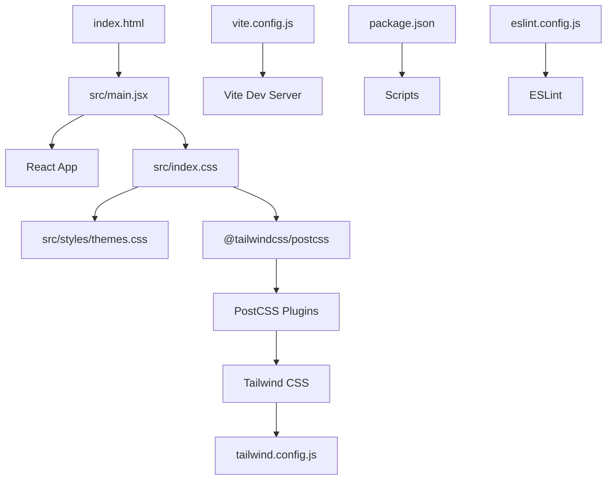
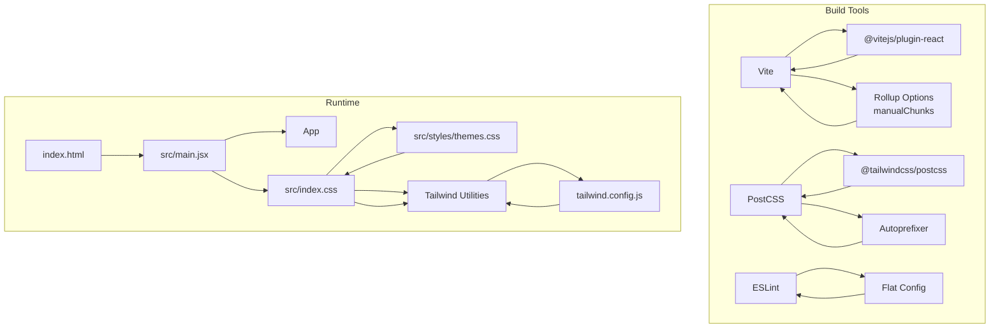
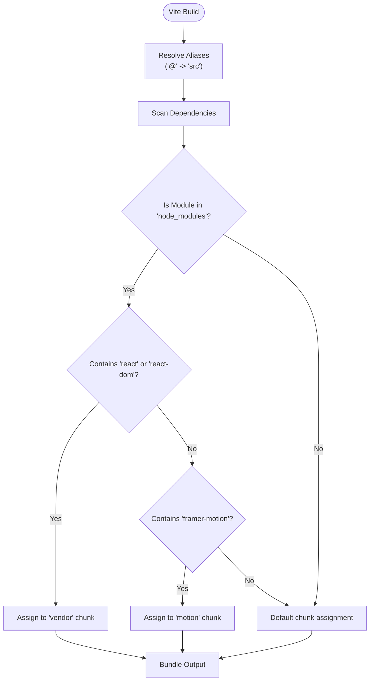
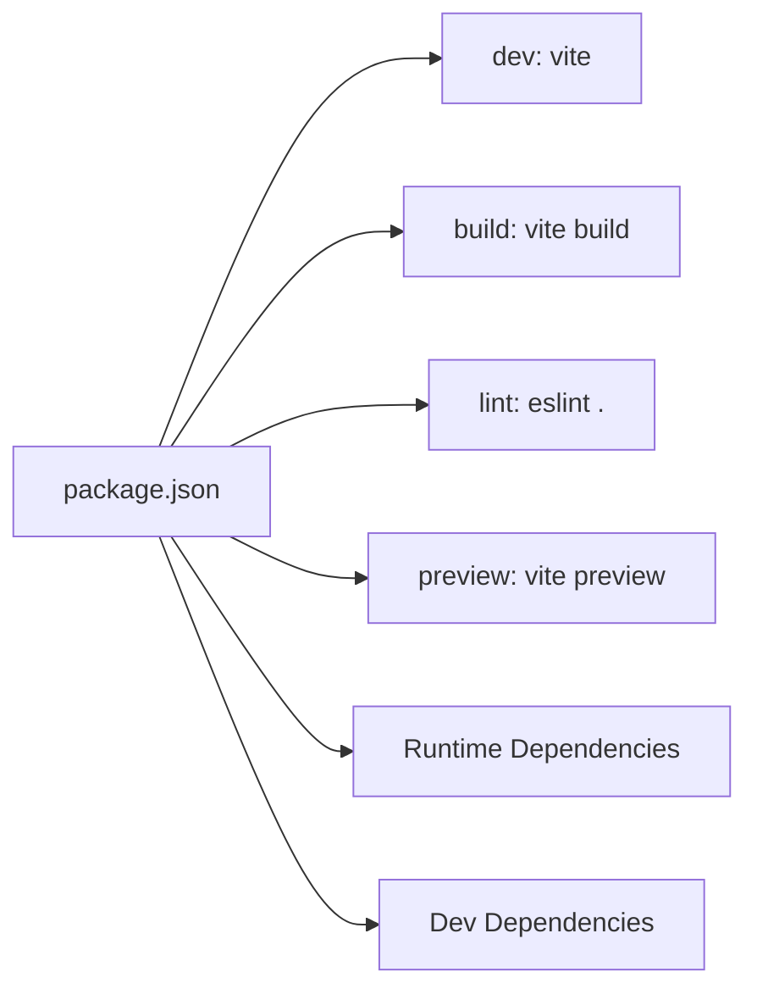
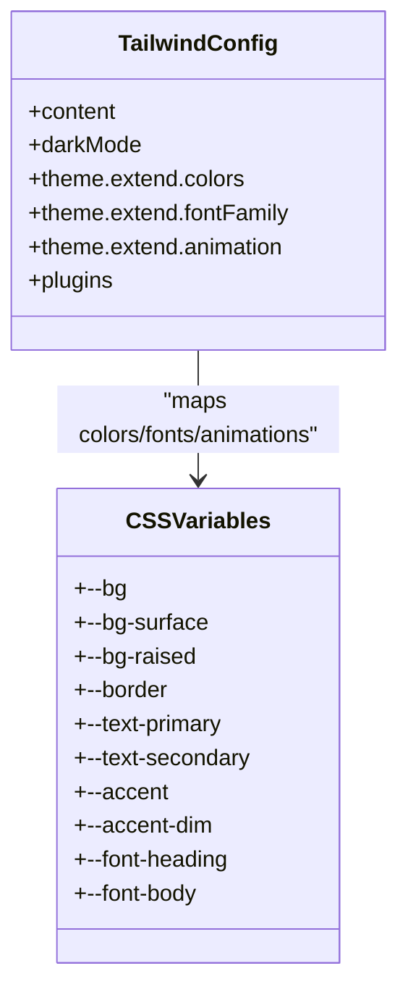
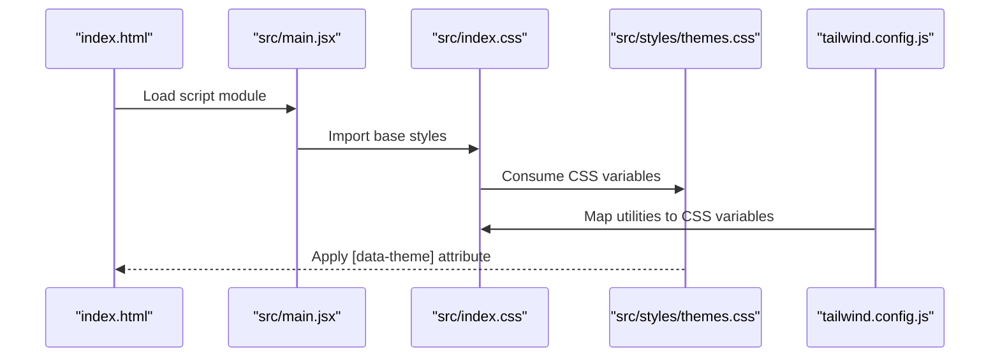
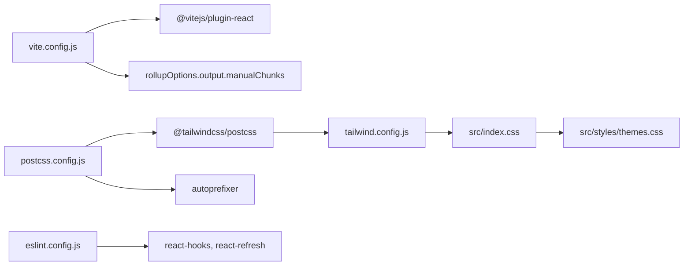

# Build Configuration

<cite>
**Referenced Files in This Document**
- [vite.config.js](file://vite.config.js)
- [package.json](file://package.json)
- [tailwind.config.js](file://tailwind.config.js)
- [postcss.config.js](file://postcss.config.js)
- [eslint.config.js](file://eslint.config.js)
- [src/index.css](file://src/index.css)
- [src/styles/themes.css](file://src/styles/themes.css)
- [src/data/themes.js](file://src/data/themes.js)
- [src/main.jsx](file://src/main.jsx)
- [index.html](file://index.html)
</cite>

## Table of Contents
1. [Introduction](#introduction)
2. [Project Structure](#project-structure)
3. [Core Components](#core-components)
4. [Architecture Overview](#architecture-overview)
5. [Detailed Component Analysis](#detailed-component-analysis)
6. [Dependency Analysis](#dependency-analysis)
7. [Performance Considerations](#performance-considerations)
8. [Troubleshooting Guide](#troubleshooting-guide)
9. [Conclusion](#conclusion)
10. [Appendices](#appendices)

## Introduction
This document explains the build configuration for the portfolio website’s development and production environments. It covers Vite configuration (aliases, chunk splitting, and development server), package scripts and dependency strategy, Tailwind CSS configuration (custom theme variables, responsive breakpoints, and utility extensions), PostCSS processing pipeline, ESLint configuration, build optimization techniques, bundle analysis and performance monitoring, and environment variable management and deployment preparation.

## Project Structure
The build system centers around Vite, Tailwind CSS, PostCSS, and ESLint. The project initializes the React application and applies a CSS-first theming system driven by CSS variables and Tailwind’s theme extension.

**Diagram sources**
- [index.html:1-78](file://index.html#L1-L78)
- [src/main.jsx:1-16](file://src/main.jsx#L1-L16)
- [src/index.css:1-172](file://src/index.css#L1-L172)
- [src/styles/themes.css:1-395](file://src/styles/themes.css#L1-L395)
- [postcss.config.js:1-7](file://postcss.config.js#L1-L7)
- [tailwind.config.js:1-54](file://tailwind.config.js#L1-L54)
- [vite.config.js:1-34](file://vite.config.js#L1-L34)
- [package.json:1-41](file://package.json#L1-L41)
- [eslint.config.js:1-22](file://eslint.config.js#L1-L22)

**Section sources**
- [index.html:1-78](file://index.html#L1-L78)
- [src/main.jsx:1-16](file://src/main.jsx#L1-L16)
- [src/index.css:1-172](file://src/index.css#L1-L172)
- [src/styles/themes.css:1-395](file://src/styles/themes.css#L1-L395)
- [postcss.config.js:1-7](file://postcss.config.js#L1-L7)
- [tailwind.config.js:1-54](file://tailwind.config.js#L1-L54)
- [vite.config.js:1-34](file://vite.config.js#L1-L34)
- [package.json:1-41](file://package.json#L1-L41)
- [eslint.config.js:1-22](file://eslint.config.js#L1-L22)

## Core Components
- Vite configuration defines the React plugin, a TypeScript-style alias for the source directory, and Rollup manual chunking for vendor and motion libraries.
- Package scripts provide dev, build, lint, and preview commands; dependencies include React, Tailwind merge, GSAP, Lenis, and Three.js; devDependencies include Vite, Tailwind CSS, PostCSS, ESLint, and related plugins.
- Tailwind CSS configuration enables class-based dark mode using a CSS selector, extends colors, fonts, and animations mapped to CSS variables, and disables plugins.
- PostCSS configuration wires Tailwind and Autoprefixer.
- ESLint configuration uses flat config with recommended rulesets for React Hooks, React Refresh, and browser globals.
- CSS theming is driven by CSS variables defined in a dedicated theme stylesheet and consumed by Tailwind’s theme extension and index.css.

**Section sources**
- [vite.config.js:1-34](file://vite.config.js#L1-L34)
- [package.json:1-41](file://package.json#L1-L41)
- [tailwind.config.js:1-54](file://tailwind.config.js#L1-L54)
- [postcss.config.js:1-7](file://postcss.config.js#L1-L7)
- [eslint.config.js:1-22](file://eslint.config.js#L1-L22)
- [src/index.css:1-172](file://src/index.css#L1-L172)
- [src/styles/themes.css:1-395](file://src/styles/themes.css#L1-L395)

## Architecture Overview
The build pipeline integrates Vite for bundling and dev server, Tailwind CSS for utility classes and animations, PostCSS for CSS processing, and ESLint for code quality. The theme system is CSS variable-driven and controlled via a data-theme attribute.

**Diagram sources**
- [vite.config.js:1-34](file://vite.config.js#L1-L34)
- [postcss.config.js:1-7](file://postcss.config.js#L1-L7)
- [tailwind.config.js:1-54](file://tailwind.config.js#L1-L54)
- [eslint.config.js:1-22](file://eslint.config.js#L1-L22)
- [src/main.jsx:1-16](file://src/main.jsx#L1-L16)
- [src/index.css:1-172](file://src/index.css#L1-L172)
- [src/styles/themes.css:1-395](file://src/styles/themes.css#L1-L395)
- [index.html:1-78](file://index.html#L1-L78)

## Detailed Component Analysis

### Vite Configuration
- Plugin: React plugin is enabled for JSX/TSX support.
- Alias: The @ alias resolves to the src directory for concise imports.
- Build: Rollup manualChunks splits third-party packages into named chunks:
  - Vendor chunk for React and ReactDOM.
  - Motion chunk for framer-motion.
- Development server: No explicit server configuration is set; defaults apply.

**Diagram sources**
- [vite.config.js:10-33](file://vite.config.js#L10-L33)

**Section sources**
- [vite.config.js:1-34](file://vite.config.js#L1-L34)

### Package Scripts and Dependency Management
- Scripts:
  - dev: Starts the Vite dev server.
  - build: Produces the production bundle.
  - lint: Runs ESLint across the project.
  - preview: Serves the production build locally.
- Dependencies:
  - React ecosystem, Tailwind merge, clsx, GSAP, Lenis, Three.js, EmailJS, Zod.
- DevDependencies:
  - Vite, @vitejs/plugin-react, Tailwind CSS v4, PostCSS, Autoprefixer, ESLint, React Hooks and Refresh plugins, globals, and TypeScript types.

**Diagram sources**
- [package.json:6-11](file://package.json#L6-L11)
- [package.json:25-39](file://package.json#L25-L39)

**Section sources**
- [package.json:1-41](file://package.json#L1-L41)

### Tailwind CSS Configuration
- Content scanning targets index.html and all TS/JS/JSX/TX files under src.
- Dark mode: Enabled via class strategy with a CSS selector targeting [data-theme].
- Theme extension:
  - Colors mapped to CSS variables for background, surfaces, borders, text, and accents.
  - Fonts mapped to CSS variables for headings, body, and monospace.
  - Animation utilities mapped to keyframes defined in CSS.
- Plugins: Disabled.

**Diagram sources**
- [tailwind.config.js:3-52](file://tailwind.config.js#L3-L52)
- [src/index.css:3-100](file://src/index.css#L3-L100)
- [src/styles/themes.css:7-57](file://src/styles/themes.css#L7-L57)

**Section sources**
- [tailwind.config.js:1-54](file://tailwind.config.js#L1-L54)
- [src/index.css:1-172](file://src/index.css#L1-L172)
- [src/styles/themes.css:1-395](file://src/styles/themes.css#L1-L395)

### PostCSS Configuration
- Plugins:
  - @tailwindcss/postcss: Tailwind directive processing.
  - autoprefixer: Vendor prefixing for compatibility.
- This setup ensures Tailwind directives are processed and CSS is autoprefixed during build.

**Section sources**
- [postcss.config.js:1-7](file://postcss.config.js#L1-L7)

### ESLint Configuration
- Flat config with recommended rulesets:
  - @eslint/js recommended.
  - eslint-plugin-react-hooks recommended.
  - eslint-plugin-react-refresh for Vite.
- Browser globals enabled for DOM APIs.
- Ignores dist folder from linting.

**Section sources**
- [eslint.config.js:1-22](file://eslint.config.js#L1-L22)

### CSS Theming and Animations
- CSS variables define theme tokens and are consumed by Tailwind and index.css.
- Tailwind theme extension maps Tailwind utilities to CSS variables.
- Keyframes and animations are defined in index.css and referenced by Tailwind’s animation utilities.
- Themes are applied via a data-theme attribute on the root element, with theme metadata in themes.js.

**Diagram sources**
- [index.html:1-78](file://index.html#L1-L78)
- [src/main.jsx:1-16](file://src/main.jsx#L1-L16)
- [src/index.css:1-172](file://src/index.css#L1-L172)
- [src/styles/themes.css:1-395](file://src/styles/themes.css#L1-L395)
- [tailwind.config.js:5-52](file://tailwind.config.js#L5-L52)

**Section sources**
- [src/index.css:1-172](file://src/index.css#L1-L172)
- [src/styles/themes.css:1-395](file://src/styles/themes.css#L1-L395)
- [src/data/themes.js:1-30](file://src/data/themes.js#L1-L30)

## Dependency Analysis
- Vite depends on @vitejs/plugin-react and Rollup options for chunking.
- Tailwind CSS depends on PostCSS and Tailwind directives.
- ESLint depends on flat config presets and browser globals.
- Runtime CSS depends on CSS variables defined in themes.css and consumed by Tailwind and index.css.

**Diagram sources**
- [vite.config.js:10-33](file://vite.config.js#L10-L33)
- [postcss.config.js:1-7](file://postcss.config.js#L1-L7)
- [tailwind.config.js:3-52](file://tailwind.config.js#L3-L52)
- [eslint.config.js:7-21](file://eslint.config.js#L7-L21)
- [src/index.css:1-172](file://src/index.css#L1-L172)
- [src/styles/themes.css:1-395](file://src/styles/themes.css#L1-L395)

**Section sources**
- [vite.config.js:1-34](file://vite.config.js#L1-L34)
- [postcss.config.js:1-7](file://postcss.config.js#L1-L7)
- [tailwind.config.js:1-54](file://tailwind.config.js#L1-L54)
- [eslint.config.js:1-22](file://eslint.config.js#L1-L22)
- [src/index.css:1-172](file://src/index.css#L1-L172)
- [src/styles/themes.css:1-395](file://src/styles/themes.css#L1-L395)

## Performance Considerations
- Chunk splitting:
  - Vendor chunk isolates React and ReactDOM to maximize cache hits across updates.
  - Motion chunk isolates framer-motion for targeted caching.
- CSS processing:
  - Tailwind directives and Autoprefixer reduce runtime CSS overhead and improve compatibility.
- Animations:
  - CSS variables and keyframes minimize JavaScript-driven animations; prefers GPU-friendly transforms and opacity.
- Fonts and resources:
  - Preconnect links in index.html reduce DNS and connection latency for external resources.
- Reduced motion:
  - Respect user motion preferences to avoid unnecessary animations.

[No sources needed since this section provides general guidance]

## Troubleshooting Guide
- Vite dev server not starting:
  - Verify scripts in package.json and ensure Node.js and npm/yarn are installed.
- Missing Tailwind utilities:
  - Confirm content paths in tailwind.config.js include current source files.
  - Ensure PostCSS plugins are present in postcss.config.js.
- CSS variables not applying:
  - Check that themes.css is imported in src/main.jsx and index.html sets the data-theme attribute.
- ESLint errors:
  - Run the lint script and address reported issues; ensure browser globals are enabled for DOM APIs.

**Section sources**
- [package.json:6-11](file://package.json#L6-L11)
- [tailwind.config.js:3](file://tailwind.config.js#L3)
- [postcss.config.js:2-5](file://postcss.config.js#L2-L5)
- [src/main.jsx:3-6](file://src/main.jsx#L3-L6)
- [index.html:34](file://index.html#L34)
- [eslint.config.js:16-19](file://eslint.config.js#L16-L19)

## Conclusion
The build configuration establishes a modern, efficient pipeline using Vite, Tailwind CSS, PostCSS, and ESLint. The CSS variable-driven theme system integrates tightly with Tailwind utilities and animations. Chunk splitting and PostCSS processing optimize bundle size and compatibility. The setup supports rapid iteration in development and optimized production builds.

[No sources needed since this section summarizes without analyzing specific files]

## Appendices

### Environment Variables and Deployment Preparation
- Environment variables:
  - Not currently configured in the repository. Add a .env file for sensitive or environment-specific values and load them via Vite’s built-in environment variable handling.
- Deployment preparation:
  - Build with the production script and serve the dist output using a static host or platform of choice.
  - Ensure robots.txt and sitemap.xml are accessible and up-to-date.
  - Validate meta tags and structured data in index.html for SEO and social sharing.

**Section sources**
- [package.json:8](file://package.json#L8)
- [index.html:10-28](file://index.html#L10-L28)
- [public/robots.txt](file://public/robots.txt)
- [public/sitemap.xml](file://public/sitemap.xml)