# Component Architecture

<cite>
**Referenced Files in This Document**
- [App.jsx](file://src/App.jsx)
- [main.jsx](file://src/main.jsx)
- [Navbar.jsx](file://src/components/layout/Navbar.jsx)
- [Footer.jsx](file://src/components/layout/Footer.jsx)
- [Hero.jsx](file://src/components/sections/Hero.jsx)
- [AboutNew.jsx](file://src/components/sections/AboutNew.jsx)
- [Skills.jsx](file://src/components/sections/Skills.jsx)
- [Projects.jsx](file://src/components/sections/Projects.jsx)
- [Experience.jsx](file://src/components/sections/Experience.jsx)
- [Contact.jsx](file://src/components/sections/Contact.jsx)
- [BackToTop.jsx](file://src/components/ui/BackToTop.jsx)
- [CustomCursor.jsx](file://src/components/ui/CustomCursor.jsx)
- [ThemeToggle.jsx](file://src/components/ui/ThemeToggle.jsx)
- [ThemeContext.jsx](file://src/context/ThemeContext.jsx)
- [useSectionObserver.js](file://src/hooks/useSectionObserver.js)
- [useTheme.js](file://src/hooks/useTheme.js)
</cite>

## Table of Contents
1. [Introduction](#introduction)
2. [Project Structure](#project-structure)
3. [Core Components](#core-components)
4. [Architecture Overview](#architecture-overview)
5. [Detailed Component Analysis](#detailed-component-analysis)
6. [Dependency Analysis](#dependency-analysis)
7. [Performance Considerations](#performance-considerations)
8. [Troubleshooting Guide](#troubleshooting-guide)
9. [Conclusion](#conclusion)

## Introduction
This document describes the component architecture of the portfolio website. It explains the hierarchical structure starting from the main container App.jsx, the layout components (Navbar, Footer), the main sections (Hero, About, Skills, Projects, Experience, Contact), and utility components (UI elements). It also covers composition patterns, prop drilling prevention, component communication strategies, lifecycle management, conditional rendering, dynamic component loading, and reusability/customization patterns.

## Project Structure
The application follows a feature-based organization under src/components, grouped into:
- layout: reusable page scaffolding (Navbar, Footer)
- sections: major page areas (Hero, About, Skills, Projects, Experience, Contact)
- ui: small, focused UI utilities (ThemeToggle, BackToTop, CustomCursor, etc.)
Context and hooks are placed under src/context and src/hooks respectively. The entry point initializes providers and renders App.

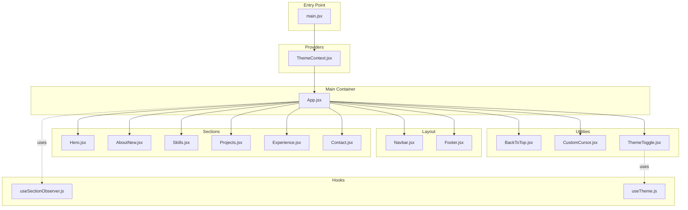

**Diagram sources**
- [main.jsx:1-16](file://src/main.jsx#L1-L16)
- [ThemeContext.jsx:1-23](file://src/context/ThemeContext.jsx#L1-L23)
- [App.jsx:1-47](file://src/App.jsx#L1-L47)
- [Navbar.jsx:1-255](file://src/components/layout/Navbar.jsx#L1-L255)
- [Footer.jsx:1-65](file://src/components/layout/Footer.jsx#L1-L65)
- [Hero.jsx:1-229](file://src/components/sections/Hero.jsx#L1-L229)
- [AboutNew.jsx:1-420](file://src/components/sections/AboutNew.jsx#L1-L420)
- [Skills.jsx:1-531](file://src/components/sections/Skills.jsx#L1-L531)
- [Projects.jsx:1-125](file://src/components/sections/Projects.jsx#L1-L125)
- [Experience.jsx:1-168](file://src/components/sections/Experience.jsx#L1-L168)
- [Contact.jsx:1-293](file://src/components/sections/Contact.jsx#L1-L293)
- [BackToTop.jsx:1-50](file://src/components/ui/BackToTop.jsx#L1-L50)
- [CustomCursor.jsx:1-245](file://src/components/ui/CustomCursor.jsx#L1-L245)
- [ThemeToggle.jsx:1-113](file://src/components/ui/ThemeToggle.jsx#L1-L113)
- [useSectionObserver.js:1-52](file://src/hooks/useSectionObserver.js#L1-L52)
- [useTheme.js:1-33](file://src/hooks/useTheme.js#L1-L33)

**Section sources**
- [main.jsx:1-16](file://src/main.jsx#L1-L16)
- [App.jsx:1-47](file://src/App.jsx#L1-L47)

## Core Components
- App.jsx orchestrates the entire page:
  - Provides skip-link for accessibility
  - Renders layout and utility components
  - Renders all sections in order
  - Computes activeSection via useSectionObserver and passes it to Navbar
- ThemeContext and ThemeProvider wrap the app to supply theme state globally
- useSectionObserver computes the currently active section based on scroll position and viewport thresholds

Key composition patterns:
- Parent-to-child data flow: App calculates activeSection and passes it to Navbar
- Provider pattern: ThemeProvider supplies theme state to ThemeToggle and other consumers via ThemeContext
- Hook encapsulation: useSectionObserver abstracts scroll detection and throttling logic

Prop drilling prevention:
- Theme state is accessed via ThemeContext, avoiding passing props through multiple intermediate components
- useSectionObserver encapsulates scroll logic, so App remains the single source of truth for active section

Component communication:
- Navbar reads activeSection to highlight the current navigation item
- BackToTop listens to main content scroll events to show/hide itself
- CustomCursor observes DOM for interactive targets and updates state reactively

Conditional rendering and lifecycle:
- Sections use IntersectionObserver or useInView to trigger animations when scrolled into view
- Utility components conditionally render based on visibility states (e.g., BackToTop, ThemeToggle tray)
- Effects clean up event listeners and observers to prevent leaks

Dynamic component loading:
- Projects section dynamically filters project cards based on category
- Contact form validates inputs and conditionally renders success/error messages
- ThemeToggle maintains an internal state for the picker tray

Reusability and customization:
- Sections accept no props and rely on data modules for content
- UI components expose minimal APIs (e.g., ThemeToggle toggles a tray, BackToTop scrolls to top)
- Motion primitives from Framer Motion enable consistent animation patterns across components

**Section sources**
- [App.jsx:15-44](file://src/App.jsx#L15-L44)
- [ThemeContext.jsx:6-13](file://src/context/ThemeContext.jsx#L6-L13)
- [useSectionObserver.js:3-49](file://src/hooks/useSectionObserver.js#L3-L49)

## Architecture Overview
The runtime architecture centers on a single-page scrolling experience with smooth transitions and responsive interactions.

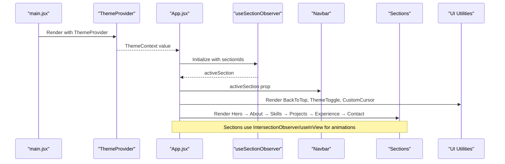

**Diagram sources**
- [main.jsx:9-15](file://src/main.jsx#L9-L15)
- [ThemeContext.jsx:6-13](file://src/context/ThemeContext.jsx#L6-L13)
- [App.jsx:15-44](file://src/App.jsx#L15-L44)
- [useSectionObserver.js:3-49](file://src/hooks/useSectionObserver.js#L3-L49)
- [Navbar.jsx:14-254](file://src/components/layout/Navbar.jsx#L14-L254)
- [Hero.jsx:42-225](file://src/components/sections/Hero.jsx#L42-L225)
- [AboutNew.jsx:34-142](file://src/components/sections/AboutNew.jsx#L34-L142)
- [Skills.jsx:288-528](file://src/components/sections/Skills.jsx#L288-L528)
- [Projects.jsx:17-122](file://src/components/sections/Projects.jsx#L17-L122)
- [Experience.jsx:14-165](file://src/components/sections/Experience.jsx#L14-L165)
- [Contact.jsx:13-292](file://src/components/sections/Contact.jsx#L13-L292)
- [BackToTop.jsx:4-47](file://src/components/ui/BackToTop.jsx#L4-L47)
- [CustomCursor.jsx:4-242](file://src/components/ui/CustomCursor.jsx#L4-L242)
- [ThemeToggle.jsx:5-112](file://src/components/ui/ThemeToggle.jsx#L5-L112)

## Detailed Component Analysis

### App.jsx
- Responsibilities:
  - Declares sectionIds and computes activeSection via useSectionObserver
  - Renders layout and utility components
  - Renders all sections in order
- Prop drilling prevention:
  - Uses ThemeContext for theme state
  - Passes activeSection to Navbar only
- Lifecycle:
  - Initializes observer on mount
  - Cleans up event listeners on unmount
- Conditional rendering:
  - Renders skip-to-main-content link for accessibility
- Dynamic loading:
  - No dynamic imports; sections are static

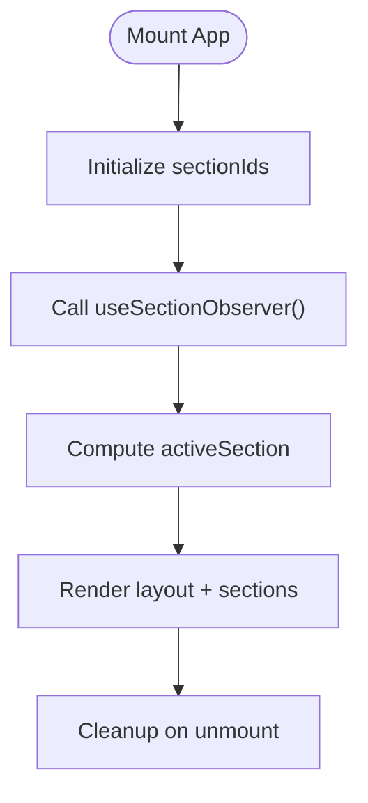

**Diagram sources**
- [App.jsx:15-44](file://src/App.jsx#L15-L44)
- [useSectionObserver.js:3-49](file://src/hooks/useSectionObserver.js#L3-L49)

**Section sources**
- [App.jsx:15-44](file://src/App.jsx#L15-L44)
- [useSectionObserver.js:3-49](file://src/hooks/useSectionObserver.js#L3-L49)

### ThemeContext and Theme Provider
- ThemeProvider wraps the app and supplies theme state to consumers
- useTheme manages theme selection, persistence, and DOM attribute updates
- ThemeToggle reads and updates theme via ThemeContext

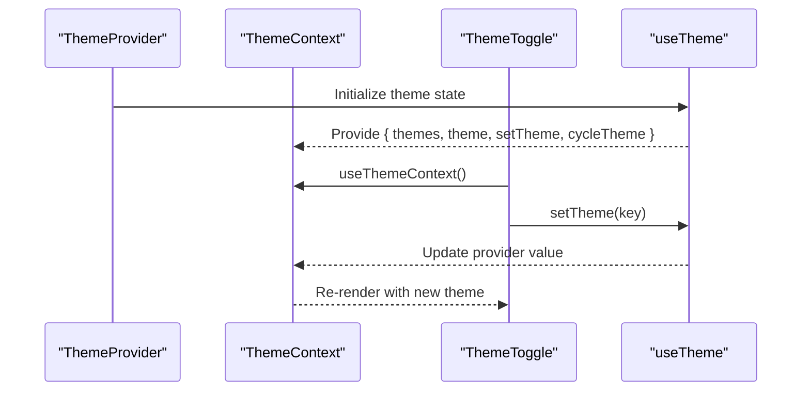

**Diagram sources**
- [ThemeContext.jsx:6-22](file://src/context/ThemeContext.jsx#L6-L22)
- [ThemeToggle.jsx:5-112](file://src/components/ui/ThemeToggle.jsx#L5-L112)
- [useTheme.js:4-31](file://src/hooks/useTheme.js#L4-L31)

**Section sources**
- [ThemeContext.jsx:6-22](file://src/context/ThemeContext.jsx#L6-L22)
- [ThemeToggle.jsx:5-112](file://src/components/ui/ThemeToggle.jsx#L5-L112)
- [useTheme.js:4-31](file://src/hooks/useTheme.js#L4-L31)

### Navbar
- Responsibilities:
  - Displays navigation links mapped to section ids
  - Highlights active link based on activeSection
  - Handles desktop and mobile navigation states
- Communication:
  - Receives activeSection from App
  - Updates hover state for animated background
- Lifecycle:
  - Adds scroll listener to main content to detect scrolled state
  - Cleans up listeners on unmount

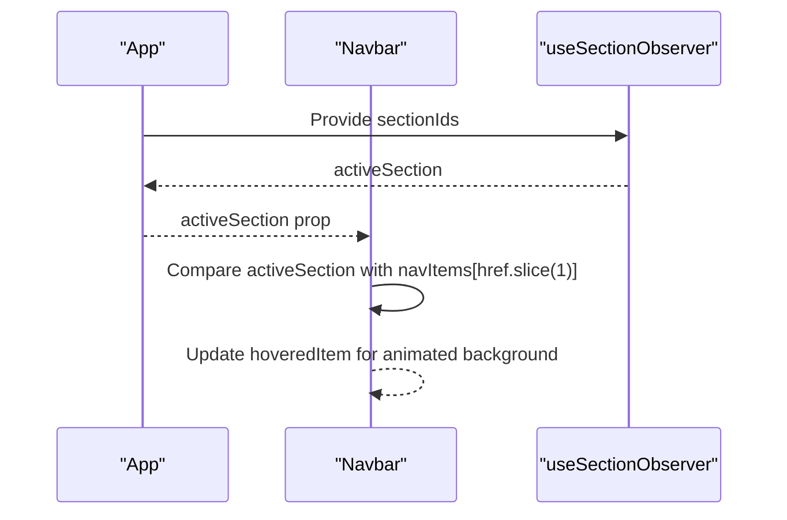

**Diagram sources**
- [Navbar.jsx:14-254](file://src/components/layout/Navbar.jsx#L14-L254)
- [useSectionObserver.js:3-49](file://src/hooks/useSectionObserver.js#L3-L49)

**Section sources**
- [Navbar.jsx:14-254](file://src/components/layout/Navbar.jsx#L14-L254)

### Hero
- Responsibilities:
  - Displays animated typewriter roles
  - Renders hero visuals and CTAs
- Lifecycle:
  - Uses useEffect to manage typewriter animation timers
  - Cleans up timers on unmount

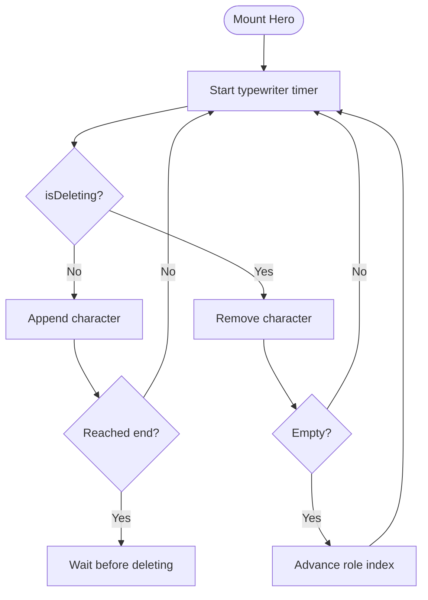

**Diagram sources**
- [Hero.jsx:7-39](file://src/components/sections/Hero.jsx#L7-L39)

**Section sources**
- [Hero.jsx:7-39](file://src/components/sections/Hero.jsx#L7-L39)

### AboutNew
- Responsibilities:
  - Displays biographical content with staggered animations
  - Uses IntersectionObserver to trigger animations when section enters viewport
- Composition:
  - Contains nested components (SectionTitle, BioBlock, TechStack, StatsGrid, StatusBadge, CTAButtons)
  - Each nested component receives a visible prop to coordinate entrance timing

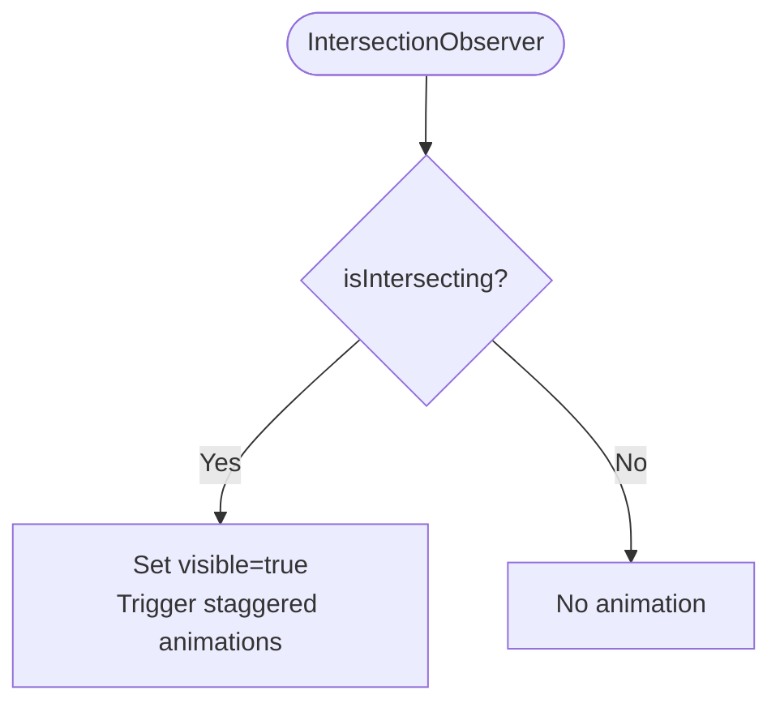

**Diagram sources**
- [AboutNew.jsx:21-32](file://src/components/sections/AboutNew.jsx#L21-L32)

**Section sources**
- [AboutNew.jsx:21-32](file://src/components/sections/AboutNew.jsx#L21-L32)

### Skills
- Responsibilities:
  - Renders categorized skill cards with 3D tilt and glow effects
  - Implements tabbed navigation to switch categories
  - Uses IntersectionObserver and Framer Motion for entrance animations
- Customization:
  - Categories and icons are configurable
  - Skill cards adapt colors per category

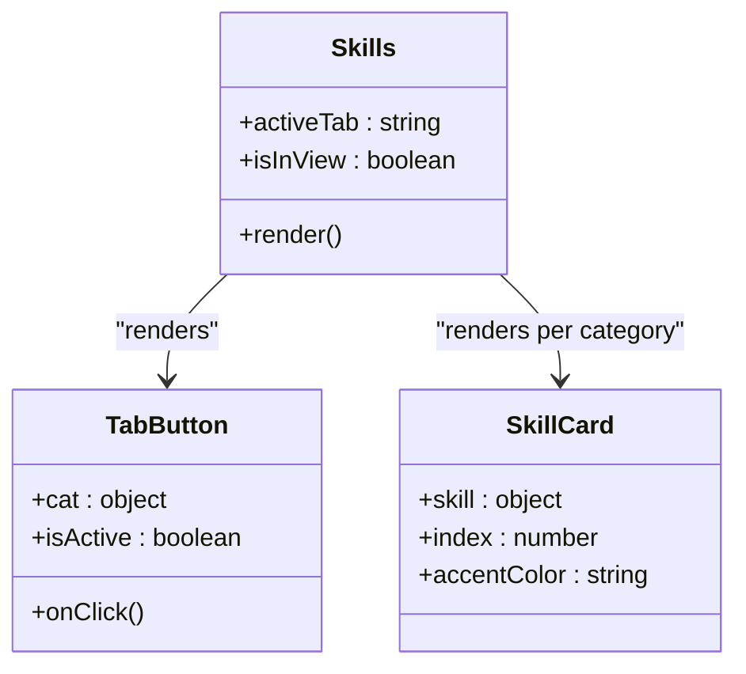

**Diagram sources**
- [Skills.jsx:288-528](file://src/components/sections/Skills.jsx#L288-L528)
- [Skills.jsx:232-268](file://src/components/sections/Skills.jsx#L232-L268)
- [Skills.jsx:70-187](file://src/components/sections/Skills.jsx#L70-L187)

**Section sources**
- [Skills.jsx:288-528](file://src/components/sections/Skills.jsx#L288-L528)

### Projects
- Responsibilities:
  - Filters projects by category and renders a sticky card stack
  - Integrates Lenis for smooth scrolling
- Dynamic filtering:
  - activeFilter controls which projects to display

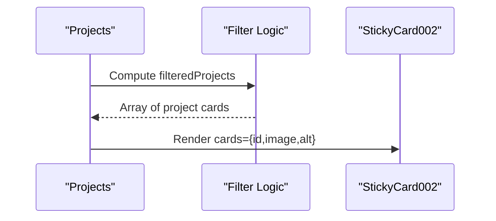

**Diagram sources**
- [Projects.jsx:17-122](file://src/components/sections/Projects.jsx#L17-L122)

**Section sources**
- [Projects.jsx:17-122](file://src/components/sections/Projects.jsx#L17-L122)

### Experience
- Responsibilities:
  - Renders a timeline of professional experiences with animated milestones
  - Uses Framer Motion variants for staggered entrance
- Animation:
  - Timeline line scales in, pins are animated on appear

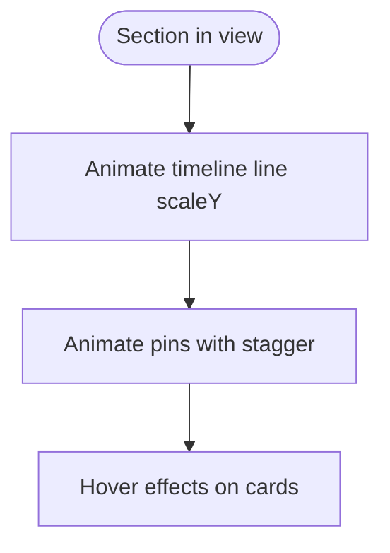

**Diagram sources**
- [Experience.jsx:14-165](file://src/components/sections/Experience.jsx#L14-L165)

**Section sources**
- [Experience.jsx:14-165](file://src/components/sections/Experience.jsx#L14-L165)

### Contact
- Responsibilities:
  - Provides a functional contact form with client-side validation
  - Integrates EmailJS for submission when configured
- Error handling:
  - Validates inputs and displays localized error messages
  - Shows success/error status after submission attempts

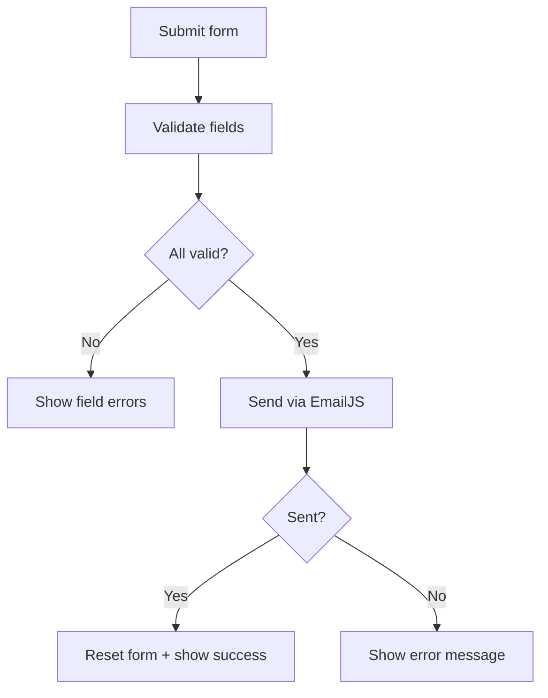

**Diagram sources**
- [Contact.jsx:56-91](file://src/components/sections/Contact.jsx#L56-L91)

**Section sources**
- [Contact.jsx:56-91](file://src/components/sections/Contact.jsx#L56-L91)

### Utility Components
- BackToTop
  - Observes main content scroll and toggles visibility
  - Smoothly scrolls to top on click
- CustomCursor
  - Tracks mouse movement with springs for smoothness
  - Observes DOM for interactive targets and updates hover state
  - Hides default cursor on desktop
- ThemeToggle
  - Opens a themed picker tray
  - Updates theme via ThemeContext

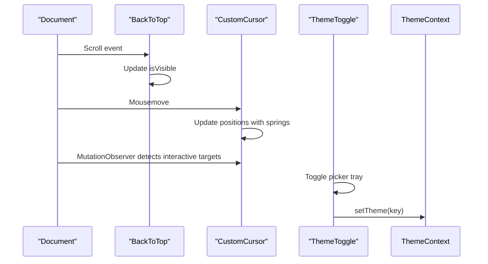

**Diagram sources**
- [BackToTop.jsx:4-47](file://src/components/ui/BackToTop.jsx#L4-L47)
- [CustomCursor.jsx:4-242](file://src/components/ui/CustomCursor.jsx#L4-L242)
- [ThemeToggle.jsx:5-112](file://src/components/ui/ThemeToggle.jsx#L5-L112)

**Section sources**
- [BackToTop.jsx:4-47](file://src/components/ui/BackToTop.jsx#L4-L47)
- [CustomCursor.jsx:4-242](file://src/components/ui/CustomCursor.jsx#L4-L242)
- [ThemeToggle.jsx:5-112](file://src/components/ui/ThemeToggle.jsx#L5-L112)

## Dependency Analysis
- App depends on:
  - useSectionObserver for active section computation
  - Layout and utility components for UX polish
  - All sections for content
- Theme system:
  - ThemeProvider depends on useTheme
  - ThemeToggle depends on ThemeContext
- Sections depend on:
  - Data modules for content
  - Framer Motion for animations
  - IntersectionObserver or useInView for scroll-triggered animations
- Utilities depend on:
  - Event listeners and DOM APIs
  - Framer Motion for smooth transitions

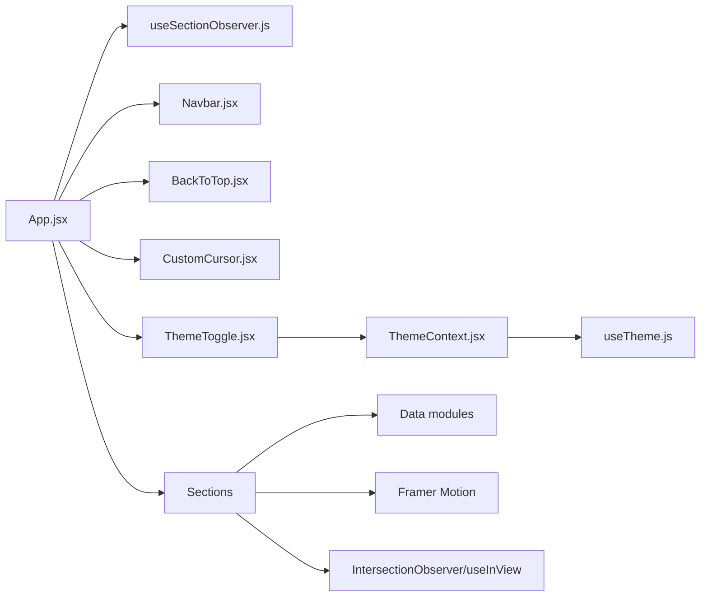

**Diagram sources**
- [App.jsx:13-17](file://src/App.jsx#L13-L17)
- [ThemeContext.jsx:6-13](file://src/context/ThemeContext.jsx#L6-L13)
- [useTheme.js:4-31](file://src/hooks/useTheme.js#L4-L31)
- [useSectionObserver.js:3-49](file://src/hooks/useSectionObserver.js#L3-L49)

**Section sources**
- [App.jsx:13-17](file://src/App.jsx#L13-L17)
- [ThemeContext.jsx:6-13](file://src/context/ThemeContext.jsx#L6-L13)
- [useTheme.js:4-31](file://src/hooks/useTheme.js#L4-L31)
- [useSectionObserver.js:3-49](file://src/hooks/useSectionObserver.js#L3-L49)

## Performance Considerations
- Scroll handling:
  - useSectionObserver uses requestAnimationFrame to throttle calculations
  - Listeners are cleaned up on unmount to prevent memory leaks
- Animations:
  - Framer Motion leverages hardware acceleration; avoid animating heavy properties unnecessarily
  - IntersectionObserver is configured to trigger once and with appropriate margins
- Rendering:
  - Sections use lazy initialization and conditional rendering to minimize work
  - Utility components debounce visibility changes to reduce re-renders
- Accessibility:
  - Skip link improves keyboard navigation
  - Proper ARIA attributes and labels are used in interactive components

## Troubleshooting Guide
- Theme not applying:
  - Ensure ThemeProvider wraps the app and ThemeContext is consumed correctly
  - Verify localStorage persistence and HTML attribute updates
- Form not sending:
  - Confirm EmailJS environment variables are set
  - Check browser console for errors and verify template/service/public keys
- Scroll indicators incorrect:
  - Verify section ids match anchor targets and main content element id
  - Ensure useSectionObserver is initialized with correct sectionIds
- Cursor not appearing:
  - Confirm desktop detection and MutationObserver setup
  - Check for custom cursor style injection and hover target selectors

**Section sources**
- [ThemeContext.jsx:16-22](file://src/context/ThemeContext.jsx#L16-L22)
- [useTheme.js:17-21](file://src/hooks/useTheme.js#L17-L21)
- [Contact.jsx:26-30](file://src/components/sections/Contact.jsx#L26-L30)
- [useSectionObserver.js:7-46](file://src/hooks/useSectionObserver.js#L7-L46)
- [CustomCursor.jsx:51-130](file://src/components/ui/CustomCursor.jsx#L51-L130)

## Conclusion
The portfolio’s component architecture emphasizes a clean separation of concerns, efficient scroll-driven interactions, and a robust theme system. App.jsx orchestrates the layout and sections while delegating specialized responsibilities to hooks and utilities. The design minimizes prop drilling through context and encapsulates cross-cutting concerns in reusable hooks and components, enabling maintainable growth and consistent user experience.