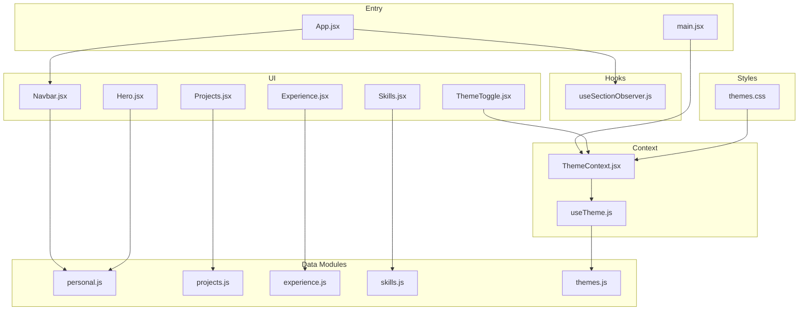
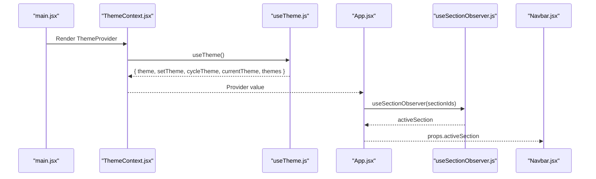
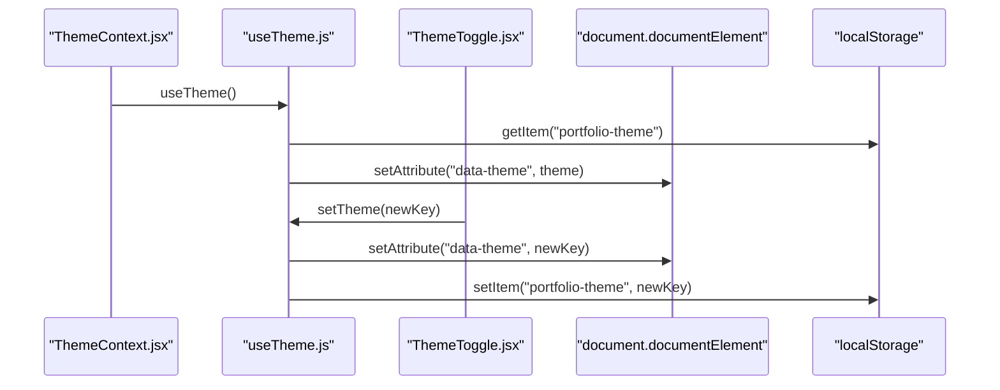
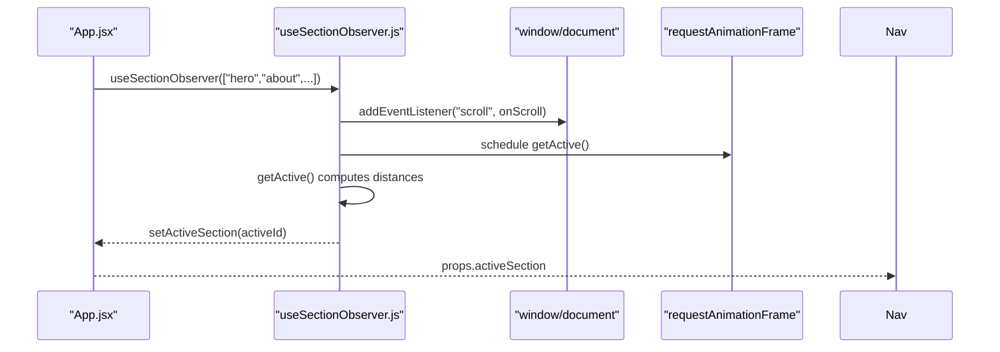
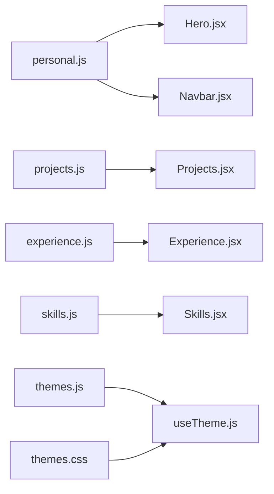
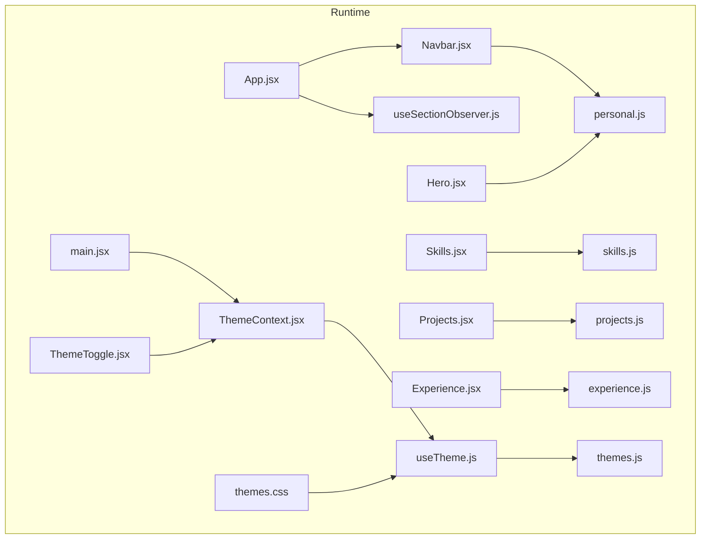

# Data Flow Patterns

<cite>
**Referenced Files in This Document**
- [ThemeContext.jsx](file://src/context/ThemeContext.jsx)
- [useTheme.js](file://src/hooks/useTheme.js)
- [useSectionObserver.js](file://src/hooks/useSectionObserver.js)
- [personal.js](file://src/data/personal.js)
- [projects.js](file://src/data/projects.js)
- [experience.js](file://src/data/experience.js)
- [skills.js](file://src/data/skills.js)
- [themes.js](file://src/data/themes.js)
- [App.jsx](file://src/App.jsx)
- [main.jsx](file://src/main.jsx)
- [Navbar.jsx](file://src/components/layout/Navbar.jsx)
- [ThemeToggle.jsx](file://src/components/ui/ThemeToggle.jsx)
- [Hero.jsx](file://src/components/sections/Hero.jsx)
- [Projects.jsx](file://src/components/sections/Projects.jsx)
- [Skills.jsx](file://src/components/sections/Skills.jsx)
- [Experience.jsx](file://src/components/sections/Experience.jsx)
- [themes.css](file://src/styles/themes.css)
- [utils.js](file://src/lib/utils.js)
</cite>

## Table of Contents
1. [Introduction](#introduction)
2. [Project Structure](#project-structure)
3. [Core Components](#core-components)
4. [Architecture Overview](#architecture-overview)
5. [Detailed Component Analysis](#detailed-component-analysis)
6. [Dependency Analysis](#dependency-analysis)
7. [Performance Considerations](#performance-considerations)
8. [Troubleshooting Guide](#troubleshooting-guide)
9. [Conclusion](#conclusion)

## Introduction
This document explains the portfolio’s data flow architecture with a focus on React’s Context API, custom hooks, and static data imports. It details how theme state is managed from ThemeContext to components, how scroll-based navigation tracks active sections, and how structured data (personal info, projects, experience, skills) is organized and consumed. It also covers data transformation, state normalization, and component binding patterns.

## Project Structure
The application is organized around a small set of data modules, a theme context provider, and reusable hooks. Components import static data and use hooks to compute derived state and bind to global theme and navigation state.

**Diagram sources**
- [main.jsx:1-16](file://src/main.jsx#L1-L16)
- [ThemeContext.jsx:1-23](file://src/context/ThemeContext.jsx#L1-L23)
- [useTheme.js:1-33](file://src/hooks/useTheme.js#L1-L33)
- [useSectionObserver.js:1-52](file://src/hooks/useSectionObserver.js#L1-L52)
- [personal.js:1-29](file://src/data/personal.js#L1-L29)
- [projects.js:1-67](file://src/data/projects.js#L1-L67)
- [experience.js:1-43](file://src/data/experience.js#L1-L43)
- [skills.js:1-39](file://src/data/skills.js#L1-L39)
- [themes.js:1-30](file://src/data/themes.js#L1-L30)
- [App.jsx:1-47](file://src/App.jsx#L1-L47)
- [Navbar.jsx:1-255](file://src/components/layout/Navbar.jsx#L1-L255)
- [ThemeToggle.jsx:1-113](file://src/components/ui/ThemeToggle.jsx#L1-L113)
- [Hero.jsx:1-229](file://src/components/sections/Hero.jsx#L1-L229)
- [Skills.jsx:1-531](file://src/components/sections/Skills.jsx#L1-L531)
- [Projects.jsx:1-125](file://src/components/sections/Projects.jsx#L1-L125)
- [Experience.jsx:1-168](file://src/components/sections/Experience.jsx#L1-L168)
- [themes.css:1-395](file://src/styles/themes.css#L1-L395)

**Section sources**
- [main.jsx:1-16](file://src/main.jsx#L1-L16)
- [App.jsx:1-47](file://src/App.jsx#L1-L47)

## Core Components
- ThemeContext and useTheme: Provide theme state, persistence, and cycling across components.
- useSectionObserver: Computes the active section based on scroll position.
- Static data modules: Personal info, projects, experience, skills, and theme definitions.
- UI components: Consume data and hooks to render content and drive interactions.

Key responsibilities:
- ThemeContext.jsx: Exposes a provider and a consumer hook.
- useTheme.js: Manages theme state, persists to localStorage, applies data-theme on the document element, and exposes theme switching helpers.
- useSectionObserver.js: Observes section visibility thresholds and returns the active section ID.
- Data modules: Export normalized objects/arrays ready for component consumption.

**Section sources**
- [ThemeContext.jsx:1-23](file://src/context/ThemeContext.jsx#L1-L23)
- [useTheme.js:1-33](file://src/hooks/useTheme.js#L1-L33)
- [useSectionObserver.js:1-52](file://src/hooks/useSectionObserver.js#L1-L52)
- [personal.js:1-29](file://src/data/personal.js#L1-L29)
- [projects.js:1-67](file://src/data/projects.js#L1-L67)
- [experience.js:1-43](file://src/data/experience.js#L1-L43)
- [skills.js:1-39](file://src/data/skills.js#L1-L39)
- [themes.js:1-30](file://src/data/themes.js#L1-L30)

## Architecture Overview
The data flow centers on two axes:
- Global state via Context and hooks (theme and active section).
- Localized data via static imports (personal, projects, experience, skills).

**Diagram sources**
- [main.jsx:1-16](file://src/main.jsx#L1-L16)
- [ThemeContext.jsx:1-23](file://src/context/ThemeContext.jsx#L1-L23)
- [useTheme.js:1-33](file://src/hooks/useTheme.js#L1-L33)
- [App.jsx:1-47](file://src/App.jsx#L1-L47)
- [useSectionObserver.js:1-52](file://src/hooks/useSectionObserver.js#L1-L52)
- [Navbar.jsx:1-255](file://src/components/layout/Navbar.jsx#L1-L255)

## Detailed Component Analysis

### Theme State Management Flow
The theme system uses a Context provider and a custom hook to manage theme state globally, persist it, and apply it to the document.

- Persistence: The hook reads the saved theme on mount and writes changes to localStorage.
- Application: The theme key is applied as a data attribute on the root HTML element, enabling CSS variable switching via themes.css.
- Consumption: Components access theme metadata and controls via ThemeToggle and ThemeContext consumers.

**Diagram sources**
- [ThemeContext.jsx:1-23](file://src/context/ThemeContext.jsx#L1-L23)
- [useTheme.js:1-33](file://src/hooks/useTheme.js#L1-L33)
- [ThemeToggle.jsx:1-113](file://src/components/ui/ThemeToggle.jsx#L1-L113)
- [themes.css:1-395](file://src/styles/themes.css#L1-L395)

**Section sources**
- [ThemeContext.jsx:1-23](file://src/context/ThemeContext.jsx#L1-L23)
- [useTheme.js:1-33](file://src/hooks/useTheme.js#L1-L33)
- [ThemeToggle.jsx:1-113](file://src/components/ui/ThemeToggle.jsx#L1-L113)
- [themes.css:1-395](file://src/styles/themes.css#L1-L395)

### Scroll-Based Navigation Data Flow
The App component computes the active section by passing section IDs to useSectionObserver. The hook calculates the nearest section based on viewport intersection and a trigger threshold.

- Threshold: A trigger point at 30% of viewport height determines the active section.
- Optimization: Uses requestAnimationFrame to batch scroll computations.
- Binding: The returned active section ID is passed to Navbar to highlight the active link.

**Diagram sources**
- [App.jsx:1-47](file://src/App.jsx#L1-L47)
- [useSectionObserver.js:1-52](file://src/hooks/useSectionObserver.js#L1-L52)
- [Navbar.jsx:1-255](file://src/components/layout/Navbar.jsx#L1-L255)

**Section sources**
- [App.jsx:1-47](file://src/App.jsx#L1-L47)
- [useSectionObserver.js:1-52](file://src/hooks/useSectionObserver.js#L1-L52)
- [Navbar.jsx:1-255](file://src/components/layout/Navbar.jsx#L1-L255)

### Data Structures and Consumption Patterns
Static data modules export normalized structures that components import directly. This pattern enables:
- Predictable data shapes.
- Easy filtering and mapping in components.
- Centralized configuration for lists and metadata.

- Personal info: Provides branding, availability, and social links used across Hero and Navbar.
- Projects: Array of project entries with categorization and highlights; filtered and mapped in Projects.
- Experience: Array of job entries with bullets and tech tags; rendered in Experience.
- Skills: Hierarchical categories with proficiency levels; rendered in Skills with tabbed views.
- Themes: Theme keys and defaults; used by useTheme to select and persist the active theme.

**Diagram sources**
- [personal.js:1-29](file://src/data/personal.js#L1-L29)
- [projects.js:1-67](file://src/data/projects.js#L1-L67)
- [experience.js:1-43](file://src/data/experience.js#L1-L43)
- [skills.js:1-39](file://src/data/skills.js#L1-L39)
- [themes.js:1-30](file://src/data/themes.js#L1-L30)
- [Hero.jsx:1-229](file://src/components/sections/Hero.jsx#L1-L229)
- [Navbar.jsx:1-255](file://src/components/layout/Navbar.jsx#L1-L255)
- [Projects.jsx:1-125](file://src/components/sections/Projects.jsx#L1-L125)
- [Experience.jsx:1-168](file://src/components/sections/Experience.jsx#L1-L168)
- [Skills.jsx:1-531](file://src/components/sections/Skills.jsx#L1-L531)
- [themes.css:1-395](file://src/styles/themes.css#L1-L395)

**Section sources**
- [personal.js:1-29](file://src/data/personal.js#L1-L29)
- [projects.js:1-67](file://src/data/projects.js#L1-L67)
- [experience.js:1-43](file://src/data/experience.js#L1-L43)
- [skills.js:1-39](file://src/data/skills.js#L1-L39)
- [themes.js:1-30](file://src/data/themes.js#L1-L30)

### Data Transformation and Normalization Examples
- Projects filtering: Projects.jsx transforms the projects array into a minimal card dataset and filters by category.
- Typewriter effect: Hero.jsx manages a local state machine to cycle through roles and simulate typing/deleting.
- Skill cards: Skills.jsx maps hierarchical categories to tabbed UI and renders cards with motion transforms.
- Experience timeline: Experience.jsx renders a vertical timeline from the experience array with badges and tech tags.

These transformations occur inside components using imported data, keeping the data modules flat and normalized.

**Section sources**
- [Projects.jsx:1-125](file://src/components/sections/Projects.jsx#L1-L125)
- [Hero.jsx:1-229](file://src/components/sections/Hero.jsx#L1-L229)
- [Skills.jsx:1-531](file://src/components/sections/Skills.jsx#L1-L531)
- [Experience.jsx:1-168](file://src/components/sections/Experience.jsx#L1-L168)

### Component Data Binding Patterns
- Props: App passes activeSection to Navbar; components receive data via direct imports.
- Context: ThemeToggle consumes theme metadata and setters from ThemeContext.
- Local state: Components maintain UI-specific state (e.g., Hero typing state, Projects activeFilter, Skills activeTab).
- Utility: cn helper merges Tailwind classes consistently.

**Section sources**
- [App.jsx:1-47](file://src/App.jsx#L1-L47)
- [Navbar.jsx:1-255](file://src/components/layout/Navbar.jsx#L1-L255)
- [ThemeToggle.jsx:1-113](file://src/components/ui/ThemeToggle.jsx#L1-L113)
- [Hero.jsx:1-229](file://src/components/sections/Hero.jsx#L1-L229)
- [Projects.jsx:1-125](file://src/components/sections/Projects.jsx#L1-L125)
- [Skills.jsx:1-531](file://src/components/sections/Skills.jsx#L1-L531)
- [utils.js:1-7](file://src/lib/utils.js#L1-L7)

## Dependency Analysis
The following diagram shows how components depend on hooks and data modules, and how the theme system integrates with CSS.

- Coupling: Components depend on data modules and hooks; ThemeContext decouples UI from theme persistence.
- Cohesion: Hooks encapsulate cross-cutting concerns (theme and scroll observation).
- External integrations: Framer Motion is used for animations; DevIcon CDN is used for skill icons.

**Diagram sources**
- [main.jsx:1-16](file://src/main.jsx#L1-L16)
- [ThemeContext.jsx:1-23](file://src/context/ThemeContext.jsx#L1-L23)
- [useTheme.js:1-33](file://src/hooks/useTheme.js#L1-L33)
- [useSectionObserver.js:1-52](file://src/hooks/useSectionObserver.js#L1-L52)
- [personal.js:1-29](file://src/data/personal.js#L1-L29)
- [projects.js:1-67](file://src/data/projects.js#L1-L67)
- [experience.js:1-43](file://src/data/experience.js#L1-L43)
- [skills.js:1-39](file://src/data/skills.js#L1-L39)
- [themes.js:1-30](file://src/data/themes.js#L1-L30)
- [App.jsx:1-47](file://src/App.jsx#L1-L47)
- [Navbar.jsx:1-255](file://src/components/layout/Navbar.jsx#L1-L255)
- [ThemeToggle.jsx:1-113](file://src/components/ui/ThemeToggle.jsx#L1-L113)
- [Hero.jsx:1-229](file://src/components/sections/Hero.jsx#L1-L229)
- [Skills.jsx:1-531](file://src/components/sections/Skills.jsx#L1-L531)
- [Projects.jsx:1-125](file://src/components/sections/Projects.jsx#L1-L125)
- [Experience.jsx:1-168](file://src/components/sections/Experience.jsx#L1-L168)
- [themes.css:1-395](file://src/styles/themes.css#L1-L395)

**Section sources**
- [main.jsx:1-16](file://src/main.jsx#L1-L16)
- [ThemeContext.jsx:1-23](file://src/context/ThemeContext.jsx#L1-L23)
- [useTheme.js:1-33](file://src/hooks/useTheme.js#L1-L33)
- [useSectionObserver.js:1-52](file://src/hooks/useSectionObserver.js#L1-L52)
- [App.jsx:1-47](file://src/App.jsx#L1-L47)

## Performance Considerations
- Scroll handling: useSectionObserver throttles computations with requestAnimationFrame and attaches a passive scroll listener to avoid layout thrashing.
- Theme transitions: themes.css defines smooth transitions for background, border, and color properties, with exclusions for heavy elements to prevent jank.
- Motion libraries: Components use Framer Motion for animations; prefer reduced-motion settings and avoid unnecessary re-renders by memoizing expensive computations.
- Data imports: Static imports are evaluated at build time; keep data modules small and normalized to minimize payload.

[No sources needed since this section provides general guidance]

## Troubleshooting Guide
- Theme not applying:
  - Verify the data-theme attribute is present on the HTML element after mounting.
  - Confirm localStorage contains a valid theme key recognized by themes.js.
  - Ensure themes.css is loaded and defines variables for the selected key.
- Active section not updating:
  - Confirm section IDs passed to useSectionObserver match element IDs.
  - Check that the scroll container is correct and the trigger threshold aligns with viewport expectations.
- Icons missing in Skills:
  - DevIcon CDN fallback switches to plain icons on error; ensure network access and correct icon slugs.
- Build-time class merging:
  - Use the cn utility to merge Tailwind classes safely.

**Section sources**
- [useTheme.js:1-33](file://src/hooks/useTheme.js#L1-L33)
- [themes.css:1-395](file://src/styles/themes.css#L1-L395)
- [useSectionObserver.js:1-52](file://src/hooks/useSectionObserver.js#L1-L52)
- [Skills.jsx:1-531](file://src/components/sections/Skills.jsx#L1-L531)
- [utils.js:1-7](file://src/lib/utils.js#L1-L7)

## Conclusion
The portfolio’s data flow relies on a clean separation of concerns: static data modules supply normalized content, Context and custom hooks manage global state and cross-cutting behaviors, and components bind to these sources with minimal duplication. The theme system demonstrates robust persistence and CSS-driven adaptation, while the scroll observer provides responsive navigation feedback. This architecture supports scalability, maintainability, and a smooth user experience.