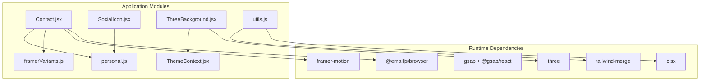
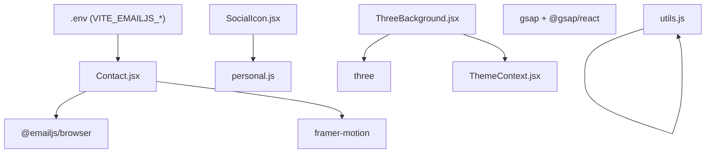
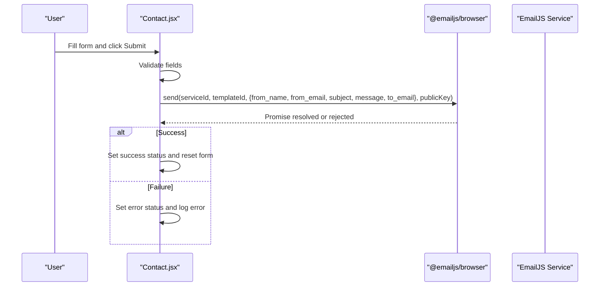
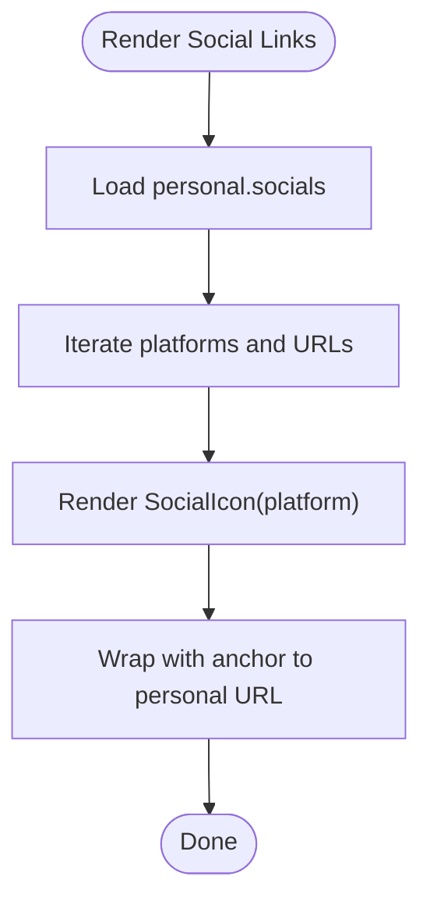
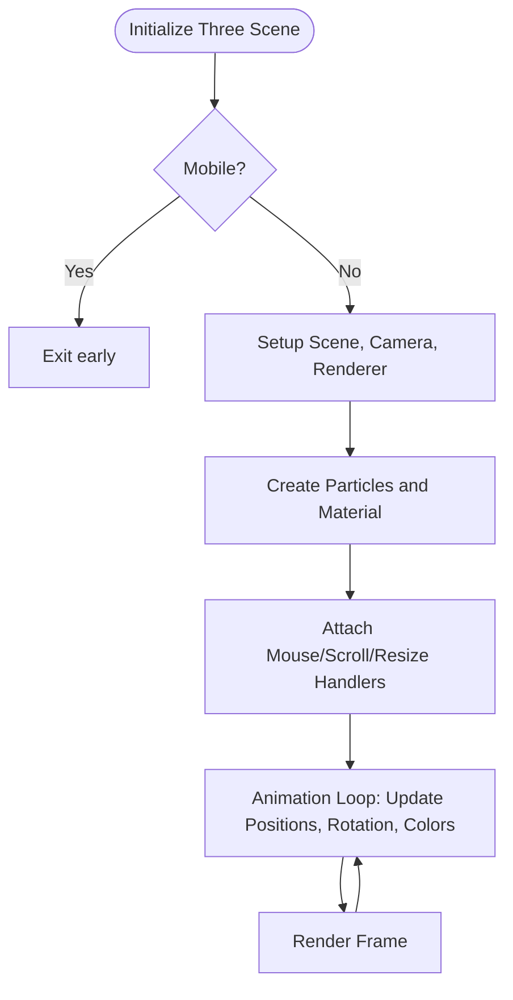
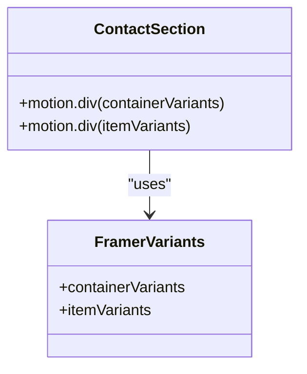
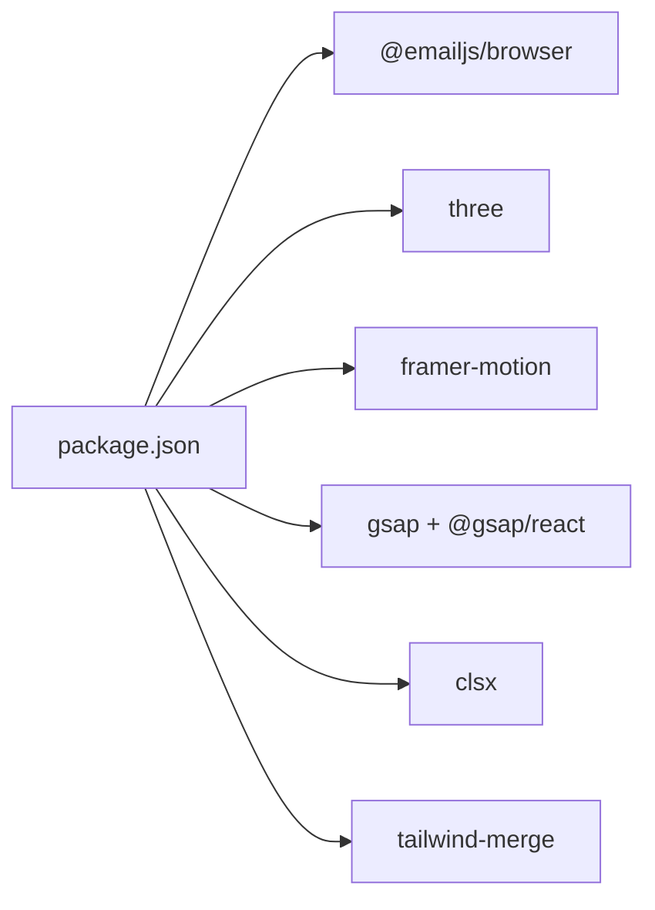

# Integration Points

<cite>
**Referenced Files in This Document**
- [package.json](file://package.json)
- [Contact.jsx](file://src/components/sections/Contact.jsx)
- [personal.js](file://src/data/personal.js)
- [SocialIcon.jsx](file://src/components/ui/SocialIcon.jsx)
- [ThreeBackground.jsx](file://src/components/ui/ThreeBackground.jsx)
- [ThemeContext.jsx](file://src/context/ThemeContext.jsx)
- [utils.js](file://src/utils/utils.js)
- [framerVariants.js](file://src/utils/framerVariants.js)
- [QUICK-START.md](file://QUICK-START.md)
- [README.md](file://README.md)
</cite>

## Table of Contents
1. [Introduction](#introduction)
2. [Project Structure](#project-structure)
3. [Core Components](#core-components)
4. [Architecture Overview](#architecture-overview)
5. [Detailed Component Analysis](#detailed-component-analysis)
6. [Dependency Analysis](#dependency-analysis)
7. [Performance Considerations](#performance-considerations)
8. [Troubleshooting Guide](#troubleshooting-guide)
9. [Conclusion](#conclusion)

## Introduction
This document catalogs all external integrations and third-party services powering the portfolio website. It covers:
- EmailJS integration for contact form functionality, including configuration, submission handling, and error management
- Social media platform integrations via personal data configuration and reusable social icon components
- Three.js integration for 3D particle backgrounds, including WebGL optimization and mobile responsiveness
- Framer Motion and GSAP integrations for advanced animations
- Utility function integrations and helper modules
- API endpoints, authentication requirements, and error handling strategies
- Troubleshooting guidance and performance optimization tips

## Project Structure
The portfolio leverages a React + Vite stack with Tailwind CSS for styling. Third-party integrations are declared in the project dependencies and consumed within dedicated components and utilities.

**Diagram sources**
- [package.json:12-23](file://package.json#L12-L23)
- [Contact.jsx:1-6](file://src/components/sections/Contact.jsx#L1-L6)
- [SocialIcon.jsx:1-32](file://src/components/ui/SocialIcon.jsx#L1-L32)
- [ThreeBackground.jsx:1-3](file://src/components/ui/ThreeBackground.jsx#L1-L3)
- [ThemeContext.jsx:1-23](file://src/context/ThemeContext.jsx#L1-L23)
- [utils.js:1-7](file://src/utils/utils.js#L1-L7)
- [framerVariants.js:1-17](file://src/utils/framerVariants.js#L1-L17)
- [personal.js:1-29](file://src/data/personal.js#L1-L29)

**Section sources**
- [package.json:12-23](file://package.json#L12-L23)

## Core Components
This section highlights the primary integration points and their roles:
- EmailJS contact form: form validation, environment variable-driven configuration, and submission pipeline
- Social media integration: centralized personal data and reusable SVG-based social icons
- Three.js 3D background: animated particle system with WebGL rendering and responsive behavior
- Animation libraries: Framer Motion for declarative animations and GSAP for advanced timelines and effects
- Utilities: Tailwind CSS merging and conditional class composition helpers

**Section sources**
- [Contact.jsx:7-11](file://src/components/sections/Contact.jsx#L7-L11)
- [personal.js:15-21](file://src/data/personal.js#L15-L21)
- [SocialIcon.jsx:1-32](file://src/components/ui/SocialIcon.jsx#L1-L32)
- [ThreeBackground.jsx:19-166](file://src/components/ui/ThreeBackground.jsx#L19-L166)
- [utils.js:1-7](file://src/utils/utils.js#L1-L7)
- [framerVariants.js:1-17](file://src/utils/framerVariants.js#L1-L17)

## Architecture Overview
The integrations are organized around component boundaries and shared utilities. The contact form integrates with EmailJS using Vite environment variables. Social icons consume personal data for platform links. The Three.js background runs independently and reacts to theme changes. Animation utilities are shared across components.

**Diagram sources**
- [Contact.jsx:7-11](file://src/components/sections/Contact.jsx#L7-L11)
- [Contact.jsx:6-6](file://src/components/sections/Contact.jsx#L6-L6)
- [SocialIcon.jsx:23-28](file://src/components/ui/SocialIcon.jsx#L23-L28)
- [personal.js:15-21](file://src/data/personal.js#L15-L21)
- [ThreeBackground.jsx:1-3](file://src/components/ui/ThreeBackground.jsx#L1-L3)
- [ThemeContext.jsx:1-23](file://src/context/ThemeContext.jsx#L1-L23)
- [utils.js:1-7](file://src/utils/utils.js#L1-L7)

## Detailed Component Analysis

### EmailJS Integration (Contact Form)
- Configuration: Uses Vite environment variables for service ID, template ID, and public key. The component checks for completeness and displays a user-friendly message if missing.
- Validation: Client-side validation ensures required fields meet minimum length criteria.
- Submission: On submit, the component constructs a payload with sender and recipient data and invokes the EmailJS SDK to send the message.
- Error Handling: Catches submission errors, logs them, and surfaces a user-facing message. Disables submission button during requests to prevent duplicates.
- Authentication: Relies on the configured public key; no server-side authentication is implemented in this component.
- Environment Setup: Requires adding VITE_EMAILJS_SERVICE_ID, VITE_EMAILJS_TEMPLATE_ID, and VITE_EMAILJS_PUBLIC_KEY to the environment.

**Diagram sources**
- [Contact.jsx:56-91](file://src/components/sections/Contact.jsx#L56-L91)
- [Contact.jsx:71-82](file://src/components/sections/Contact.jsx#L71-L82)

**Section sources**
- [Contact.jsx:7-11](file://src/components/sections/Contact.jsx#L7-L11)
- [Contact.jsx:32-48](file://src/components/sections/Contact.jsx#L32-L48)
- [Contact.jsx:56-91](file://src/components/sections/Contact.jsx#L56-L91)
- [QUICK-START.md:292-298](file://QUICK-START.md#L292-L298)
- [README.md:95-103](file://README.md#L95-L103)

### Social Media Platform Integrations
- Personal Data: Social platform URLs are defined centrally in personal data for maintainability.
- Social Icon Component: Renders platform-specific SVG icons and falls back to a default icon if a platform is unrecognized.
- Usage: The contact section and other areas render social links using the SocialIcon component and personal data.

**Diagram sources**
- [personal.js:15-21](file://src/data/personal.js#L15-L21)
- [SocialIcon.jsx:1-32](file://src/components/ui/SocialIcon.jsx#L1-L32)
- [Contact.jsx:188-201](file://src/components/sections/Contact.jsx#L188-L201)

**Section sources**
- [personal.js:15-21](file://src/data/personal.js#L15-L21)
- [SocialIcon.jsx:1-32](file://src/components/ui/SocialIcon.jsx#L1-L32)
- [Contact.jsx:188-201](file://src/components/sections/Contact.jsx#L188-L201)

### Three.js Integration (3D Particle Background)
- Initialization: Creates a WebGL renderer with antialiasing and alpha transparency, sets pixel ratio cap for performance, and initializes fog and camera.
- Geometry and Material: Uses BufferGeometry and PointsMaterial for efficient particle rendering with additive blending and depth write disabled.
- Particle System: Spawns particles on concentric spheres, animates positions using sine/cosine offsets, and rotates the system based on mouse movement and scroll position.
- Responsiveness: Listens to window resize and scroll events; disables rendering on mobile devices via a breakpoint.
- Theming: Reads the accent color from CSS variables and interpolates toward it smoothly.
- Cleanup: Disposes geometries, materials, textures, and cancels animation frames on unmount.

**Diagram sources**
- [ThreeBackground.jsx:19-166](file://src/components/ui/ThreeBackground.jsx#L19-L166)

**Section sources**
- [ThreeBackground.jsx:19-166](file://src/components/ui/ThreeBackground.jsx#L19-L166)
- [ThemeContext.jsx:1-23](file://src/context/ThemeContext.jsx#L1-L23)

### Framer Motion Integration
- Variants: Centralized animation variants for staggered entrance and smooth transitions.
- Usage: Applied in the contact section to animate child elements with container and item variants.
- Motion Primitives: Used for hover effects and button interactions.

**Diagram sources**
- [framerVariants.js:1-17](file://src/utils/framerVariants.js#L1-L17)
- [Contact.jsx:141-145](file://src/components/sections/Contact.jsx#L141-L145)
- [Contact.jsx:146-152](file://src/components/sections/Contact.jsx#L146-L152)

**Section sources**
- [framerVariants.js:1-17](file://src/utils/framerVariants.js#L1-L17)
- [Contact.jsx:141-152](file://src/components/sections/Contact.jsx#L141-L152)

### GSAP Integration
- Library: GSAP and @gsap/react are included as dependencies for advanced animations and timelines.
- Usage Pattern: While not directly shown in the referenced files, the presence of these dependencies indicates potential use in animation-heavy components or custom hooks.

**Section sources**
- [package.json:14-16](file://package.json#L14-L16)

### Utility Function Integrations
- clsx and tailwind-merge: Combined in a single utility to merge and deduplicate Tailwind CSS classes safely.
- Purpose: Ensures predictable class composition across components.

**Section sources**
- [utils.js:1-7](file://src/utils/utils.js#L1-L7)

## Dependency Analysis
External dependencies and their roles:
- @emailjs/browser: Enables client-side email sending via EmailJS
- three: Provides WebGL-based 3D rendering for the particle background
- framer-motion: Declarative animation library for React
- gsap + @gsap/react: Advanced animation and timeline control
- clsx + tailwind-merge: Safe class merging for Tailwind CSS
- zod: Validation library (present in dependencies)

**Diagram sources**
- [package.json:12-23](file://package.json#L12-L23)

**Section sources**
- [package.json:12-23](file://package.json#L12-L23)

## Performance Considerations
- Three.js
  - Pixel ratio capped to reduce GPU load on high-DPI screens
  - Alpha channel enabled for composited backgrounds
  - Depth writes disabled for additive blending
  - Mobile detection to disable heavy rendering
  - Dispose of resources on unmount
- Framer Motion
  - Prefer transform-based animations and avoid layout thrashing
  - Use lazy loading for heavy animations
- GSAP
  - Use efficient timelines and avoid unnecessary DOM reads
  - Leverage GPU acceleration where possible
- Utilities
  - Use the merged class utility to minimize redundant classes

[No sources needed since this section provides general guidance]

## Troubleshooting Guide
- EmailJS
  - Missing environment variables: The contact form warns and displays a fallback message if VITE_EMAILJS_* variables are not set. Ensure the .env file contains the required keys.
  - Validation errors: Fix field lengths and formats as indicated by the inline error messages.
  - Submission failures: Inspect browser console for error logs; confirm template and service IDs are correct and the public key is valid.
- Social Icons
  - Missing platform icon: Falls back to a default circle icon if the platform is not recognized.
  - Broken links: Verify URLs in personal data are correct.
- Three.js Background
  - Not rendering on mobile: Expected behavior; rendering is disabled on small screens and devices with coarse pointers.
  - Poor performance: Reduce particle count or disable on low-power devices; verify pixel ratio and device capabilities.
- Animations
  - Framer Motion: Ensure variants are correctly imported and applied to motion components.
  - GSAP: Confirm dependencies are installed and timelines are properly disposed.

**Section sources**
- [Contact.jsx:26-30](file://src/components/sections/Contact.jsx#L26-L30)
- [Contact.jsx:32-48](file://src/components/sections/Contact.jsx#L32-L48)
- [Contact.jsx:86-90](file://src/components/sections/Contact.jsx#L86-L90)
- [SocialIcon.jsx:19-21](file://src/components/ui/SocialIcon.jsx#L19-L21)
- [ThreeBackground.jsx:20-21](file://src/components/ui/ThreeBackground.jsx#L20-L21)
- [QUICK-START.md:292-298](file://QUICK-START.md#L292-L298)

## Conclusion
The portfolio integrates several third-party services and libraries to deliver a modern, interactive experience:
- EmailJS powers the contact form with environment-driven configuration and robust error handling
- Social icons and personal data centralization streamline social media presence
- Three.js creates an immersive, responsive 3D background optimized for performance
- Framer Motion and GSAP enable polished, performant animations
- Utility modules ensure clean, maintainable styling and class composition

By following the configuration steps and troubleshooting guidance, developers can reliably operate and optimize these integrations.