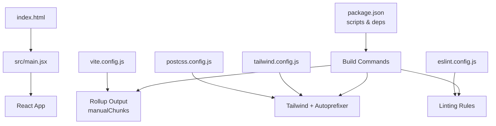
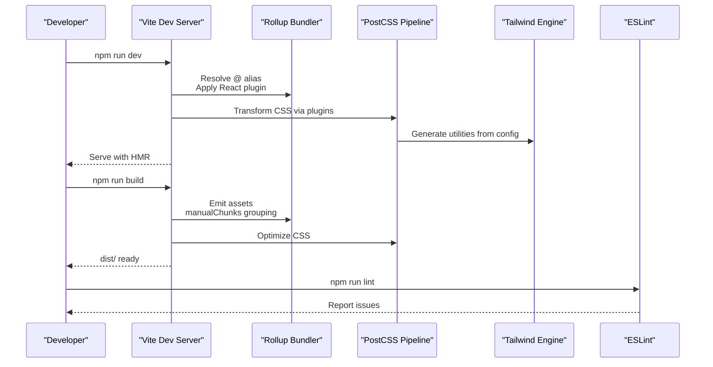
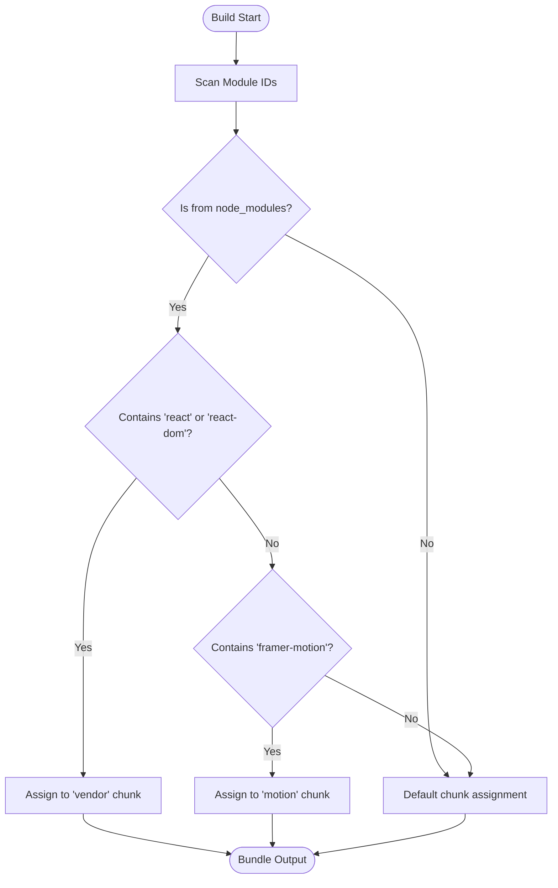
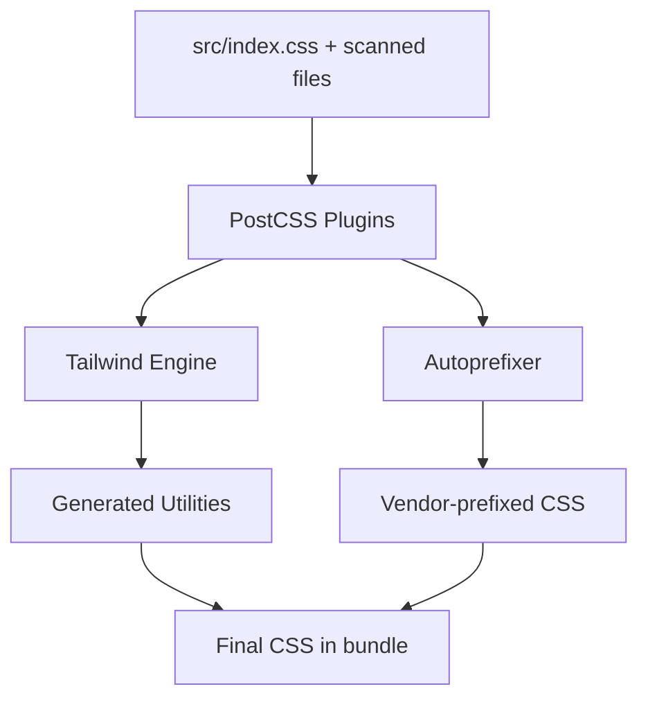
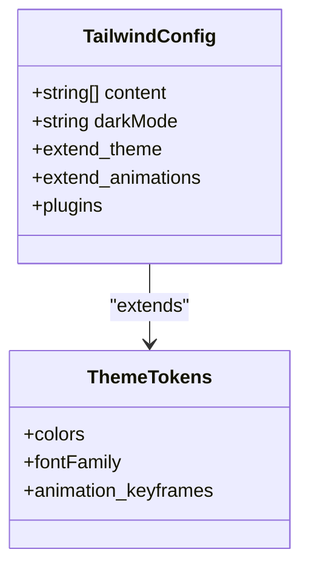
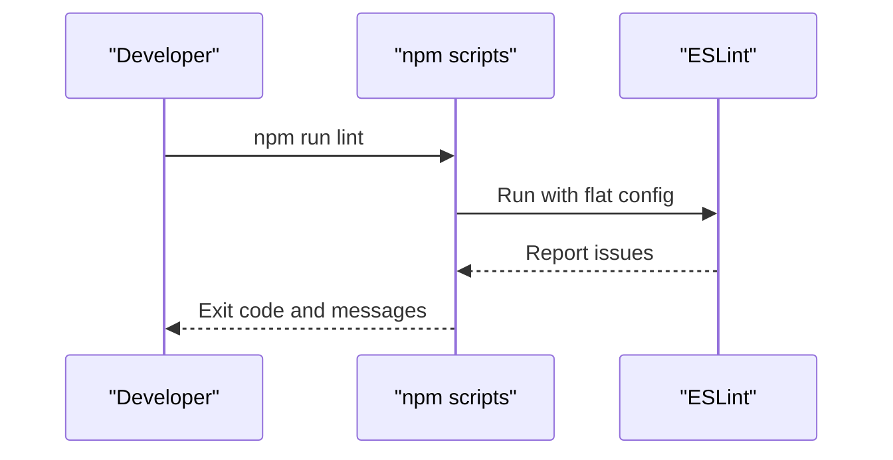
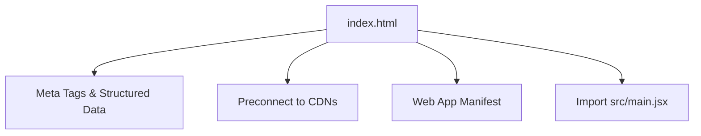
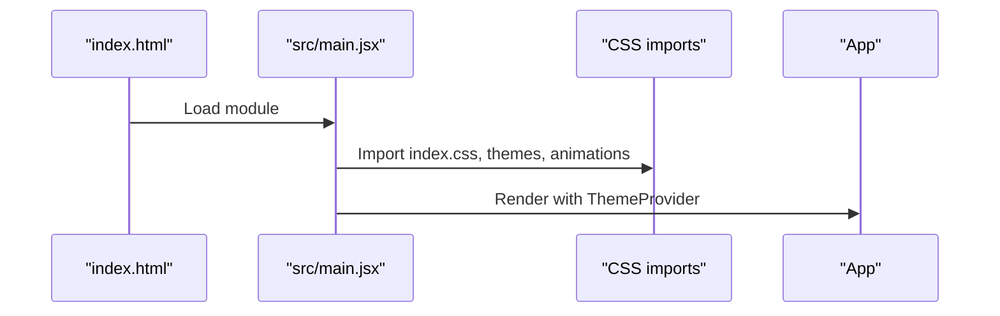
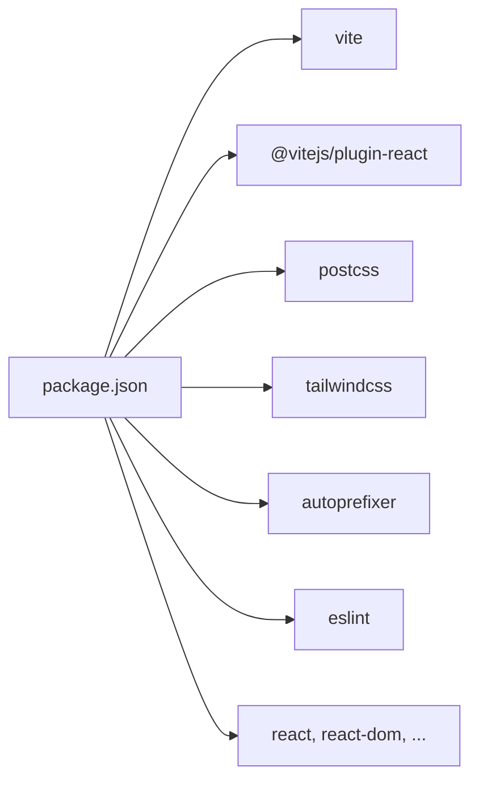

# Build & Optimization

<cite>
**Referenced Files in This Document**
- [vite.config.js](file://vite.config.js)
- [package.json](file://package.json)
- [postcss.config.js](file://postcss.config.js)
- [tailwind.config.js](file://tailwind.config.js)
- [eslint.config.js](file://eslint.config.js)
- [index.html](file://index.html)
- [src/main.jsx](file://src/main.jsx)
- [src/index.css](file://src/index.css)
- [CLEANUP-PLAN.md](file://CLEANUP-PLAN.md)
</cite>

## Table of Contents
1. [Introduction](#introduction)
2. [Project Structure](#project-structure)
3. [Core Components](#core-components)
4. [Architecture Overview](#architecture-overview)
5. [Detailed Component Analysis](#detailed-component-analysis)
6. [Dependency Analysis](#dependency-analysis)
7. [Performance Considerations](#performance-considerations)
8. [Troubleshooting Guide](#troubleshooting-guide)
9. [Conclusion](#conclusion)
10. [Appendices](#appendices)

## Introduction
This document explains the portfolio’s build configuration and performance optimization strategies. It covers Vite configuration (aliases, chunk splitting, and asset handling), the PostCSS pipeline and Tailwind setup, CSS optimization, ESLint configuration and automated linting, production build optimization and code splitting, performance monitoring approaches, customization guidance for build configurations and plugins, troubleshooting build issues, and deployment optimization with continuous integration considerations.

## Project Structure
The build system centers around Vite, PostCSS/Tailwind, and ESLint. Key configuration files and entry points are organized as follows:
- Vite configuration defines plugin usage, path aliases, and Rollup output chunking.
- PostCSS configuration enables Tailwind and autoprefixing.
- Tailwind configuration scopes content scanning, theme tokens, and animations.
- ESLint flat config enforces recommended rules for React and Vite.
- The HTML entry declares metadata, preconnects, and structured data.
- The React entry imports styles and initializes the app with a theme provider.

**Diagram sources**
- [index.html](file://index.html)
- [src/main.jsx](file://src/main.jsx)
- [vite.config.js](file://vite.config.js)
- [postcss.config.js](file://postcss.config.js)
- [tailwind.config.js](file://tailwind.config.js)
- [eslint.config.js](file://eslint.config.js)
- [package.json](file://package.json)

**Section sources**
- [vite.config.js](file://vite.config.js)
- [postcss.config.js](file://postcss.config.js)
- [tailwind.config.js](file://tailwind.config.js)
- [eslint.config.js](file://eslint.config.js)
- [index.html](file://index.html)
- [src/main.jsx](file://src/main.jsx)
- [package.json](file://package.json)

## Core Components
- Vite configuration
  - Plugin stack includes React Fast Refresh.
  - Path alias resolves @ to src for concise imports.
  - Rollup manualChunks groups vendor libraries and motion-specific dependencies into dedicated chunks.
- PostCSS pipeline
  - Tailwind PostCSS plugin generates utility classes from Tailwind config.
  - Autoprefixer adds vendor prefixes for target browsers.
- Tailwind configuration
  - Scans HTML and JSX sources for unused CSS elimination.
  - Defines CSS variables for theme tokens and animation keyframes.
- ESLint configuration
  - Flat config extends recommended sets for JS, React Hooks, and React Refresh for Vite.
  - Ignores dist output during lint scans.
- HTML entry
  - Declares SEO metadata, social previews, PWA manifest, theme color, preconnect hints, and structured data.

**Section sources**
- [vite.config.js](file://vite.config.js)
- [postcss.config.js](file://postcss.config.js)
- [tailwind.config.js](file://tailwind.config.js)
- [eslint.config.js](file://eslint.config.js)
- [index.html](file://index.html)

## Architecture Overview
The build pipeline integrates development and production workflows:
- Development: Vite serves React code with HMR, resolving @ aliases and applying PostCSS transforms.
- Production: Vite bundles assets, splits chunks via manualChunks, and emits optimized static assets.
- CSS: Tailwind generates utilities from scanned content; PostCSS/Autoprefixer ensures compatibility.
- Quality: ESLint runs on staged/committed files to maintain code quality.

**Diagram sources**
- [vite.config.js](file://vite.config.js)
- [postcss.config.js](file://postcss.config.js)
- [tailwind.config.js](file://tailwind.config.js)
- [eslint.config.js](file://eslint.config.js)
- [package.json](file://package.json)

## Detailed Component Analysis

### Vite Configuration
Key behaviors:
- Alias: The @ alias maps to src for cleaner imports across components and utilities.
- Plugins: React plugin enables Fast Refresh and JSX transforms.
- Chunk splitting: manualChunks groups:
  - React core libraries into a vendor chunk.
  - Motion libraries into a motion chunk.
  - Other third-party modules remain unchunked or grouped by default.

**Diagram sources**
- [vite.config.js](file://vite.config.js)

**Section sources**
- [vite.config.js](file://vite.config.js)

### PostCSS Pipeline and CSS Optimization
- Plugins:
  - Tailwind PostCSS plugin reads Tailwind config and generates utilities.
  - Autoprefixer adds vendor prefixes based on browser targets.
- CSS optimization strategies:
  - Tailwind content scanning limits generated CSS to used utilities.
  - CSS variables and keyframes are scoped to theme tokens for efficient reuse.
  - Animations are centralized in Tailwind and CSS to avoid duplication.

**Diagram sources**
- [postcss.config.js](file://postcss.config.js)
- [tailwind.config.js](file://tailwind.config.js)
- [src/index.css](file://src/index.css)

**Section sources**
- [postcss.config.js](file://postcss.config.js)
- [tailwind.config.js](file://tailwind.config.js)
- [src/index.css](file://src/index.css)

### Tailwind Configuration
Highlights:
- Content paths scan index.html and all JSX/TSX under src for purge.
- Dark mode strategy uses class-based toggling with data attributes.
- Theme extension defines color tokens, fonts, and animation keyframes mapped to CSS variables.
- Animation set includes fade-ups, slides, pops, gradients, and glowing effects.

**Diagram sources**
- [tailwind.config.js](file://tailwind.config.js)

**Section sources**
- [tailwind.config.js](file://tailwind.config.js)

### ESLint Configuration and Automated Linting
- Flat config:
  - Extends recommended JS rules, React Hooks recommended rules, and React Refresh for Vite.
  - Ignores dist during lint scans.
  - Parses JSX features for accurate analysis.
- Scripts:
  - Lint command runs against the repository root.

**Diagram sources**
- [eslint.config.js](file://eslint.config.js)
- [package.json](file://package.json)

**Section sources**
- [eslint.config.js](file://eslint.config.js)
- [package.json](file://package.json)

### HTML Entry and Metadata
- Declares SEO metadata, Open Graph and Twitter cards, PWA manifest, theme color, and preconnect hints for fonts and CDNs.
- Includes JSON-LD structured data for person schema.
- References the React entry module.

**Diagram sources**
- [index.html](file://index.html)

**Section sources**
- [index.html](file://index.html)

### React Entry Point
- Imports global CSS and animation/theme styles.
- Wraps the app in a theme provider before mounting.

**Diagram sources**
- [src/main.jsx](file://src/main.jsx)
- [src/index.css](file://src/index.css)

**Section sources**
- [src/main.jsx](file://src/main.jsx)
- [src/index.css](file://src/index.css)

## Dependency Analysis
- Build-time dependencies:
  - Vite, @vitejs/plugin-react, PostCSS, Tailwind, autoprefixer.
- Runtime dependencies:
  - React ecosystem, GSAP, Lenis, Three.js, Framer Motion, and utility libraries.
- Scripts orchestrate dev, build, preview, and lint commands.

**Diagram sources**
- [package.json](file://package.json)

**Section sources**
- [package.json](file://package.json)

## Performance Considerations
- Bundle size and chunking
  - manualChunks separates vendor and motion libraries to improve caching and reduce payload for updates.
  - The cleanup plan demonstrates significant dependency reduction and improved build performance.
- CSS optimization
  - Tailwind content scanning purges unused utilities.
  - CSS variables centralize theme tokens for smaller CSS and faster rendering.
- Asset delivery
  - Preconnect hints reduce DNS and TLS overhead for external resources.
  - JSON-LD improves SEO and page discoverability.
- Maintenance and hygiene
  - Removing unused dependencies and assets reduces install time and build footprint.

**Section sources**
- [vite.config.js](file://vite.config.js)
- [CLEANUP-PLAN.md](file://CLEANUP-PLAN.md)
- [index.html](file://index.html)
- [src/index.css](file://src/index.css)

## Troubleshooting Guide
Common issues and resolutions:
- Alias resolution errors
  - Ensure the @ alias points to the correct src directory in Vite config.
- Missing CSS utilities
  - Verify Tailwind content paths include all relevant templates and components.
- Vendor chunk not updating
  - Confirm manualChunks conditions match library identifiers and that caching aligns with semantic versioning.
- Lint failures
  - Run the lint script and address reported issues; ensure IDE extensions reflect the flat config.
- Build hangs or slow performance
  - Review dependency tree and remove unused packages; confirm autoprefixer and Tailwind versions are compatible.

**Section sources**
- [vite.config.js](file://vite.config.js)
- [tailwind.config.js](file://tailwind.config.js)
- [eslint.config.js](file://eslint.config.js)
- [package.json](file://package.json)

## Conclusion
The portfolio’s build system leverages Vite for fast development and optimized production builds, PostCSS/Tailwind for efficient CSS generation and purging, and ESLint for code quality. Strategic chunking, content-driven CSS generation, and preconnect optimizations contribute to a responsive and maintainable deployment. The cleanup plan further validates the impact of dependency hygiene on performance.

## Appendices

### Customization Playbook
- Add a new optimization plugin
  - Install the plugin as a dev dependency.
  - Register it in the Vite plugins array and configure options in vite.config.js.
- Introduce additional chunk groups
  - Extend manualChunks to split frequently changing or large third-party modules into separate chunks.
- Expand CSS pipeline
  - Add PostCSS plugins in postcss.config.js and tune Tailwind content globs to include new templates.
- Enforce stricter lint rules
  - Extend eslint.config.js with additional recommended configs or plugin rulesets.
- Deployment and CI
  - Use npm scripts to run build and lint in CI jobs.
  - Cache node_modules and optimize CI logs by filtering noisy output.

[No sources needed since this section provides general guidance]