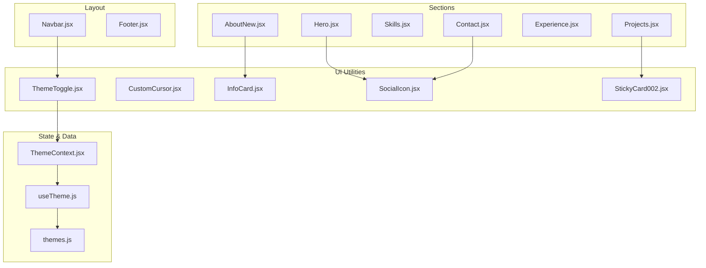
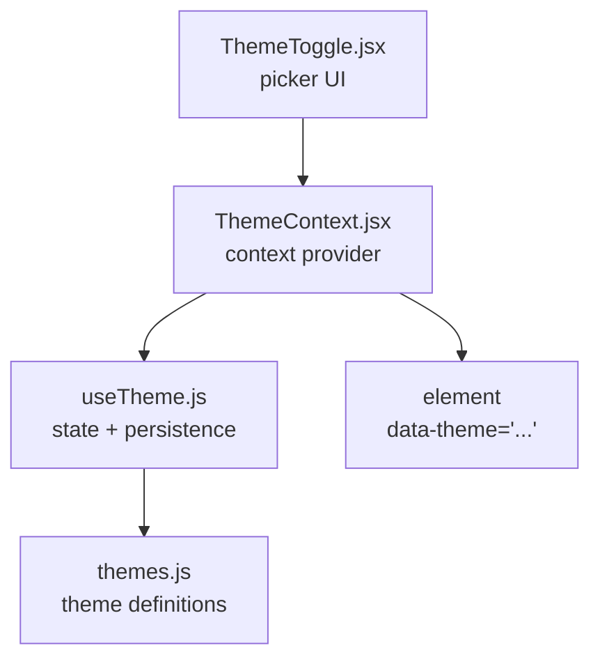
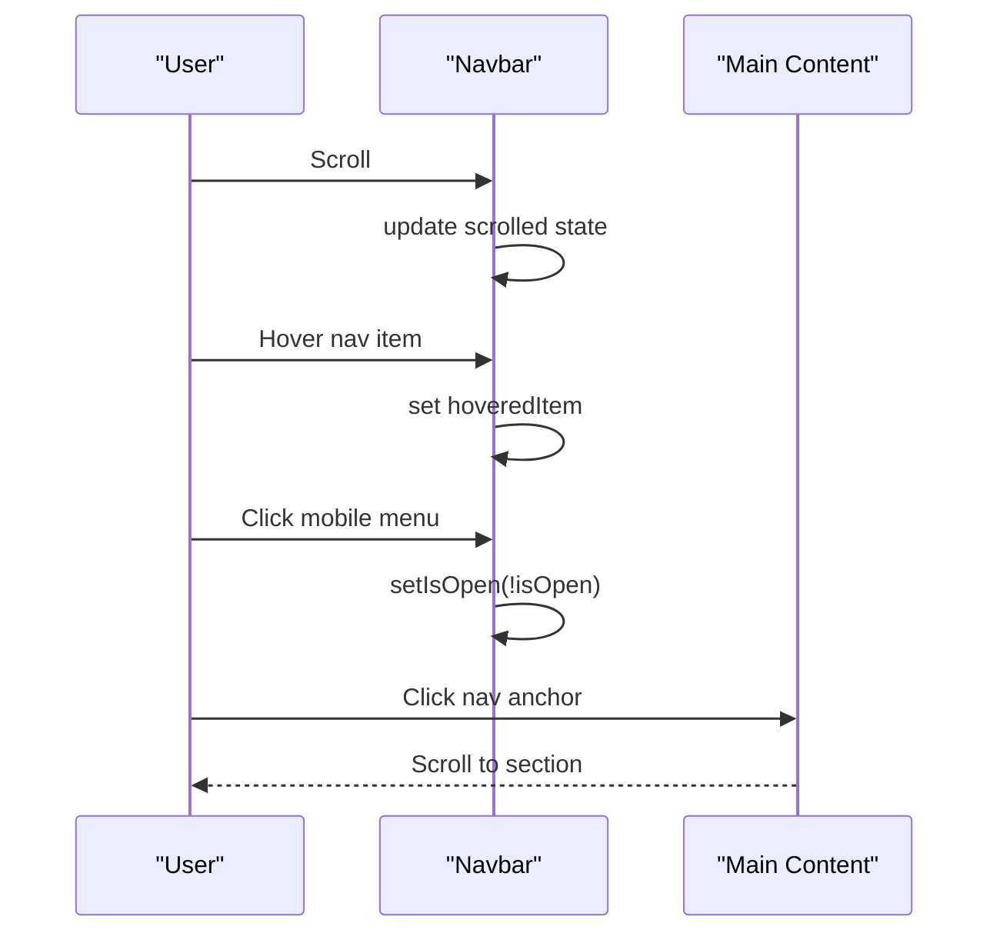
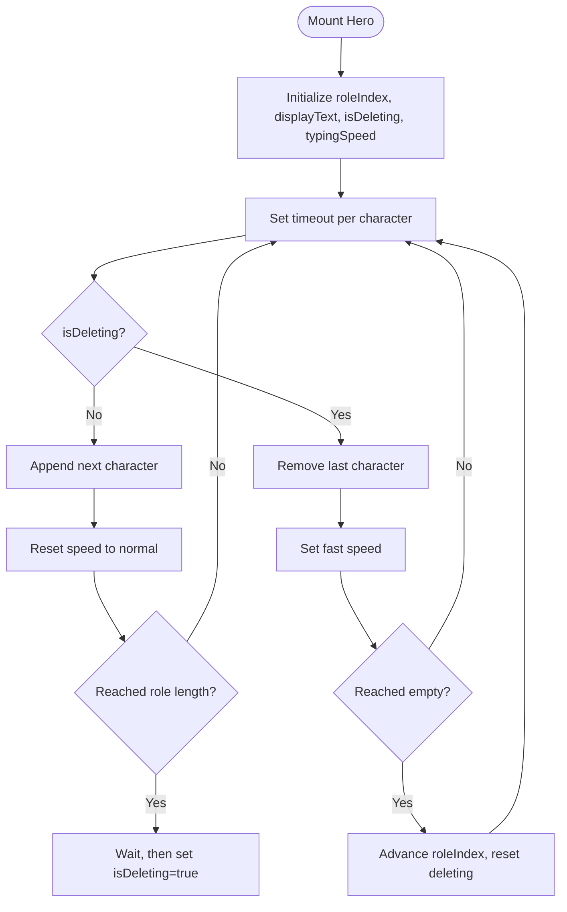
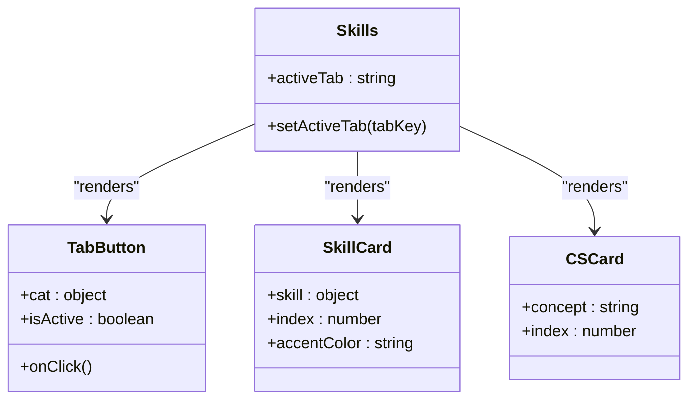
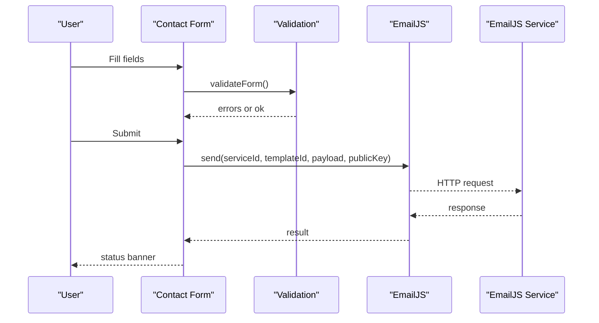
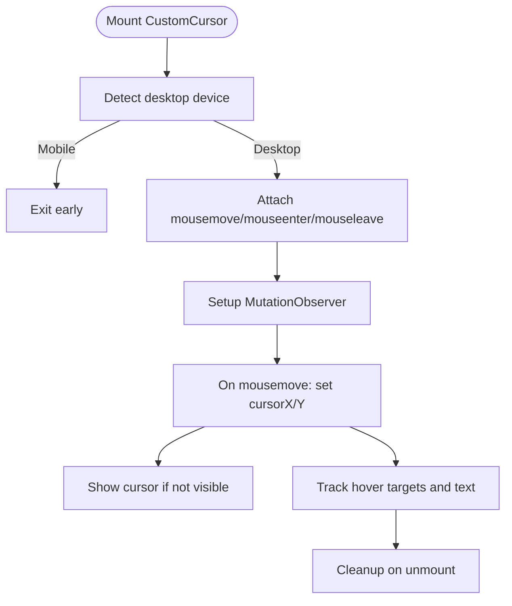
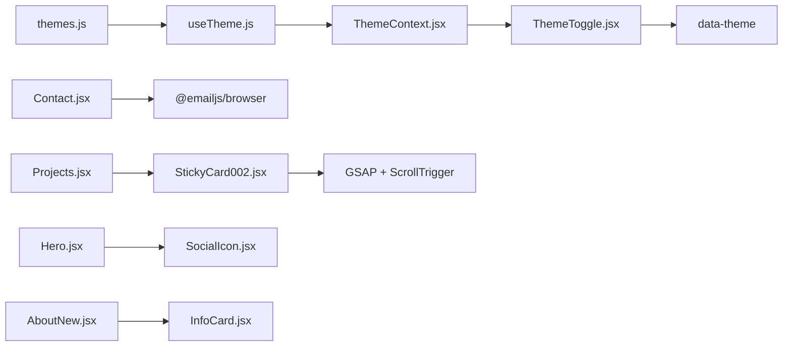

# Component Library

<cite>
**Referenced Files in This Document**
- [Navbar.jsx](file://src/components/layout/Navbar.jsx)
- [Footer.jsx](file://src/components/layout/Footer.jsx)
- [Hero.jsx](file://src/components/sections/Hero.jsx)
- [AboutNew.jsx](file://src/components/sections/AboutNew.jsx)
- [Skills.jsx](file://src/components/sections/Skills.jsx)
- [Projects.jsx](file://src/components/sections/Projects.jsx)
- [Experience.jsx](file://src/components/sections/Experience.jsx)
- [Contact.jsx](file://src/components/sections/Contact.jsx)
- [ThemeToggle.jsx](file://src/components/ui/ThemeToggle.jsx)
- [CustomCursor.jsx](file://src/components/ui/CustomCursor.jsx)
- [InfoCard.jsx](file://src/components/ui/InfoCard.jsx)
- [SocialIcon.jsx](file://src/components/ui/SocialIcon.jsx)
- [StickyCard002.jsx](file://src/components/ui/StickyCard002.jsx)
- [ThemeContext.jsx](file://src/context/ThemeContext.jsx)
- [useTheme.js](file://src/hooks/useTheme.js)
- [themes.js](file://src/data/themes.js)
</cite>

## Table of Contents
1. [Introduction](#introduction)
2. [Project Structure](#project-structure)
3. [Core Components](#core-components)
4. [Architecture Overview](#architecture-overview)
5. [Detailed Component Analysis](#detailed-component-analysis)
6. [Dependency Analysis](#dependency-analysis)
7. [Performance Considerations](#performance-considerations)
8. [Troubleshooting Guide](#troubleshooting-guide)
9. [Conclusion](#conclusion)
10. [Appendices](#appendices)

## Introduction
This document describes the portfolio’s component library, focusing on component hierarchy, reusability patterns, and design system integration. It covers layout components (Navbar, Footer), section components (Hero, About, Skills, Projects, Experience, Contact), and utility components (ThemeToggle, CustomCursor). For each component, we outline props, events, styling options, customization guidelines, composition patterns, and integration with the theming system. Practical usage examples and best practices for extending the library are included.

## Project Structure
The component library is organized by domain:
- Layout: reusable page scaffolding (Navbar, Footer)
- Sections: page-scoped content areas (Hero, About, Skills, Projects, Experience, Contact)
- UI: small, focused utilities (ThemeToggle, CustomCursor, InfoCard, SocialIcon, StickyCard002)
- Context and Hooks: ThemeContext and useTheme encapsulate theme state and persistence
- Data: themes.js defines available themes and defaults

**Diagram sources**
- [Navbar.jsx:14-253](file://src/components/layout/Navbar.jsx#L14-L253)
- [Footer.jsx:3-62](file://src/components/layout/Footer.jsx#L3-L62)
- [Hero.jsx:7-226](file://src/components/sections/Hero.jsx#L7-L226)
- [AboutNew.jsx:26-178](file://src/components/sections/AboutNew.jsx#L26-L178)
- [Skills.jsx:288-528](file://src/components/sections/Skills.jsx#L288-L528)
- [Projects.jsx:17-122](file://src/components/sections/Projects.jsx#L17-L122)
- [Experience.jsx:14-165](file://src/components/sections/Experience.jsx#L14-L165)
- [Contact.jsx:13-290](file://src/components/sections/Contact.jsx#L13-L290)
- [ThemeToggle.jsx:5-110](file://src/components/ui/ThemeToggle.jsx#L5-L110)
- [CustomCursor.jsx:4-242](file://src/components/ui/CustomCursor.jsx#L4-L242)
- [InfoCard.jsx:3-131](file://src/components/ui/InfoCard.jsx#L3-L131)
- [SocialIcon.jsx:23-31](file://src/components/ui/SocialIcon.jsx#L23-L31)
- [StickyCard002.jsx:24-132](file://src/components/ui/StickyCard002.jsx#L24-L132)
- [ThemeContext.jsx:6-22](file://src/context/ThemeContext.jsx#L6-L22)
- [useTheme.js:4-31](file://src/hooks/useTheme.js#L4-L31)
- [themes.js:2-27](file://src/data/themes.js#L2-L27)

**Section sources**
- [Navbar.jsx:14-253](file://src/components/layout/Navbar.jsx#L14-L253)
- [Footer.jsx:3-62](file://src/components/layout/Footer.jsx#L3-L62)
- [Hero.jsx:7-226](file://src/components/sections/Hero.jsx#L7-L226)
- [AboutNew.jsx:26-178](file://src/components/sections/AboutNew.jsx#L26-L178)
- [Skills.jsx:288-528](file://src/components/sections/Skills.jsx#L288-L528)
- [Projects.jsx:17-122](file://src/components/sections/Projects.jsx#L17-L122)
- [Experience.jsx:14-165](file://src/components/sections/Experience.jsx#L14-L165)
- [Contact.jsx:13-290](file://src/components/sections/Contact.jsx#L13-L290)
- [ThemeToggle.jsx:5-110](file://src/components/ui/ThemeToggle.jsx#L5-L110)
- [CustomCursor.jsx:4-242](file://src/components/ui/CustomCursor.jsx#L4-L242)
- [InfoCard.jsx:3-131](file://src/components/ui/InfoCard.jsx#L3-L131)
- [SocialIcon.jsx:23-31](file://src/components/ui/SocialIcon.jsx#L23-L31)
- [StickyCard002.jsx:24-132](file://src/components/ui/StickyCard002.jsx#L24-L132)
- [ThemeContext.jsx:6-22](file://src/context/ThemeContext.jsx#L6-L22)
- [useTheme.js:4-31](file://src/hooks/useTheme.js#L4-L31)
- [themes.js:2-27](file://src/data/themes.js#L2-L27)

## Core Components
- Layout components
  - Navbar: responsive navigation with animated background, mobile drawer, and premium CTA
  - Footer: copyright, back-to-top link, and social links
- Section components
  - Hero: animated headline, typewriter roles, CTAs, and social links
  - About: animated info cards, SVG lightning lines, and CTA buttons
  - Skills: category tabs, animated skill cards with magnetic tilt, CS fundamentals grid
  - Projects: category filters, sticky card stack with GSAP/ScrollTrigger
  - Experience: timeline with animated milestones and badges
  - Contact: form with validation, EmailJS integration, and contact methods
- Utility components
  - ThemeToggle: theme picker overlay and floating action button
  - CustomCursor: desktop-only animated cursor with hover targets and dynamic text
  - InfoCard: animated glass-like cards with shimmer and glow effects
  - SocialIcon: platform-specific SVG icons
  - StickyCard002: GSAP-driven sticky card carousel

**Section sources**
- [Navbar.jsx:14-253](file://src/components/layout/Navbar.jsx#L14-L253)
- [Footer.jsx:3-62](file://src/components/layout/Footer.jsx#L3-L62)
- [Hero.jsx:7-226](file://src/components/sections/Hero.jsx#L7-L226)
- [AboutNew.jsx:26-178](file://src/components/sections/AboutNew.jsx#L26-L178)
- [Skills.jsx:288-528](file://src/components/sections/Skills.jsx#L288-L528)
- [Projects.jsx:17-122](file://src/components/sections/Projects.jsx#L17-L122)
- [Experience.jsx:14-165](file://src/components/sections/Experience.jsx#L14-L165)
- [Contact.jsx:13-290](file://src/components/sections/Contact.jsx#L13-L290)
- [ThemeToggle.jsx:5-110](file://src/components/ui/ThemeToggle.jsx#L5-L110)
- [CustomCursor.jsx:4-242](file://src/components/ui/CustomCursor.jsx#L4-L242)
- [InfoCard.jsx:3-131](file://src/components/ui/InfoCard.jsx#L3-L131)
- [SocialIcon.jsx:23-31](file://src/components/ui/SocialIcon.jsx#L23-L31)
- [StickyCard002.jsx:24-132](file://src/components/ui/StickyCard002.jsx#L24-L132)

## Architecture Overview
The theming system is centralized:
- useTheme manages theme state, persistence, and cycling
- ThemeContext exposes theme values to the app
- themes.js defines available themes and defaults
- ThemeToggle renders a picker and toggles the active theme
- Components consume theme variables via CSS custom properties applied to the HTML element

**Diagram sources**
- [useTheme.js:4-31](file://src/hooks/useTheme.js#L4-L31)
- [themes.js:2-27](file://src/data/themes.js#L2-L27)
- [ThemeContext.jsx:6-22](file://src/context/ThemeContext.jsx#L6-L22)
- [ThemeToggle.jsx:5-110](file://src/components/ui/ThemeToggle.jsx#L5-L110)

**Section sources**
- [useTheme.js:4-31](file://src/hooks/useTheme.js#L4-L31)
- [themes.js:2-27](file://src/data/themes.js#L2-L27)
- [ThemeContext.jsx:6-22](file://src/context/ThemeContext.jsx#L6-L22)
- [ThemeToggle.jsx:5-110](file://src/components/ui/ThemeToggle.jsx#L5-L110)

## Detailed Component Analysis

### Layout Components

#### Navbar
- Purpose: Primary navigation with animated background, desktop and mobile layouts, and a premium resume CTA
- Props: activeSection (string) — used to highlight the active nav item
- Events: internal state updates for scroll, hover, and mobile drawer toggle
- Styling: Tailwind classes with CSS variables for accents and backgrounds; Framer Motion for animations
- Composition: Uses personal data for branding and resume link; integrates with theme accents
- Best practices:
  - Keep activeSection synchronized with the currently visible section
  - Ensure smooth scroll on anchor clicks in main content area

**Diagram sources**
- [Navbar.jsx:19-25](file://src/components/layout/Navbar.jsx#L19-L25)

**Section sources**
- [Navbar.jsx:14-253](file://src/components/layout/Navbar.jsx#L14-L253)

#### Footer
- Purpose: Copyright, back-to-top link, and social links
- Props: none
- Events: handleScrollToTop prevents default and scrolls smoothly to top
- Styling: Tailwind classes with theme-aware text and borders
- Best practices:
  - Keep social URLs in personal data for easy updates
  - Ensure accessibility with aria-labels on interactive elements

**Section sources**
- [Footer.jsx:3-62](file://src/components/layout/Footer.jsx#L3-L62)

### Section Components

#### Hero
- Purpose: Hero section with animated tagline, typewriter roles, CTAs, and social links
- Props: none
- Events: internal state for typing animation and role cycling
- Styling: Radial gradients, animated glow, and staggered entrance animations
- Composition: Integrates ThreeBackground, SocialIcon, and personal data
- Best practices:
  - Keep role list in personal data for maintainability
  - Optimize background assets for performance

**Diagram sources**
- [Hero.jsx:15-39](file://src/components/sections/Hero.jsx#L15-L39)

**Section sources**
- [Hero.jsx:7-226](file://src/components/sections/Hero.jsx#L7-L226)

#### About
- Purpose: Animated “About” section with SVG lightning lines, animated info cards, and CTAs
- Props: none
- Events: IntersectionObserver triggers animations; staggered visibility for lines and cards
- Styling: Video background, radial glows, and custom animations
- Composition: Uses InfoCard, personal data, and custom SVG animations
- Best practices:
  - Keep card data in arrays for easy maintenance
  - Ensure observer cleanup on unmount

**Section sources**
- [AboutNew.jsx:26-178](file://src/components/sections/AboutNew.jsx#L26-L178)

#### Skills
- Purpose: Skill showcase with category tabs, animated cards, and CS fundamentals grid
- Props: none
- Events: Tab switching, mouse move for magnetic tilt, view-based in-view triggers
- Styling: Dynamic category accents, glow effects, and animated transitions
- Composition: Uses devicon CDN for icons; integrates with theme accents
- Best practices:
  - Keep category configuration centralized
  - Use view-based triggers to optimize performance

**Diagram sources**
- [Skills.jsx:232-268](file://src/components/sections/Skills.jsx#L232-L268)
- [Skills.jsx:70-187](file://src/components/sections/Skills.jsx#L70-L187)
- [Skills.jsx:192-227](file://src/components/sections/Skills.jsx#L192-L227)

**Section sources**
- [Skills.jsx:288-528](file://src/components/sections/Skills.jsx#L288-L528)

#### Projects
- Purpose: Filterable project showcase with sticky card stack
- Props: none
- Events: Filter change, scroll with Lenis, and view-based triggers
- Styling: Hover background, category filters, and glass-like cards
- Composition: Uses StickyCard002 and project data
- Best practices:
  - Ensure Lenis is initialized at the section level
  - Keep category filters aligned with project metadata

**Section sources**
- [Projects.jsx:17-122](file://src/components/sections/Projects.jsx#L17-L122)

#### Experience
- Purpose: Professional timeline with animated milestones and badges
- Props: none
- Events: View-based triggers and hover animations
- Styling: Central timeline, animated pins, and glass-like cards
- Composition: Uses experience data and variant helpers
- Best practices:
  - Keep entries sorted chronologically
  - Use badges sparingly for emphasis

**Section sources**
- [Experience.jsx:14-165](file://src/components/sections/Experience.jsx#L14-L165)

#### Contact
- Purpose: Contact form with validation, EmailJS integration, and contact methods
- Props: none
- Events: Form submission, validation, and status updates
- Styling: Glass-like panels, hover states, and status banners
- Composition: Uses personal data and EmailJS SDK
- Best practices:
  - Configure environment variables for EmailJS
  - Provide clear user feedback for success/error states

**Diagram sources**
- [Contact.jsx:56-91](file://src/components/sections/Contact.jsx#L56-L91)

**Section sources**
- [Contact.jsx:13-290](file://src/components/sections/Contact.jsx#L13-L290)

### Utility Components

#### ThemeToggle
- Purpose: Floating theme picker with animated tray and check indicator
- Props: none
- Events: Outside-click detection, theme selection, and toggle
- Styling: Backdrop blur, glow effects, and layoutId animations
- Composition: Consumes ThemeContext and renders theme list from themes.js
- Best practices:
  - Keep picker closed by default
  - Use layoutId for smooth transitions

**Section sources**
- [ThemeToggle.jsx:5-110](file://src/components/ui/ThemeToggle.jsx#L5-L110)

#### CustomCursor
- Purpose: Desktop-only animated cursor with hover targets and optional text
- Props: none
- Events: Mousemove tracking, hover enter/leave, and visibility control
- Styling: Two-layer ring and dot with spring physics
- Composition: Uses Framer Motion springs and MutationObserver for dynamic targets
- Best practices:
  - Disable on mobile/tablet devices
  - Clean up event listeners and observers on unmount

**Diagram sources**
- [CustomCursor.jsx:51-130](file://src/components/ui/CustomCursor.jsx#L51-L130)

**Section sources**
- [CustomCursor.jsx:4-242](file://src/components/ui/CustomCursor.jsx#L4-L242)

#### InfoCard
- Purpose: Animated glass-like info card with shimmer and glow
- Props: card (object), visible (boolean), delay (number), side ("left"|"right")
- Events: hover enter/leave
- Styling: Backdrop blur, glow edges, and staggered animations
- Composition: Used within About section
- Best practices:
  - Keep card data consistent with About layout
  - Use side prop to align glow direction

**Section sources**
- [InfoCard.jsx:3-131](file://src/components/ui/InfoCard.jsx#L3-L131)

#### SocialIcon
- Purpose: Platform-specific SVG icons
- Props: platform (string), className (string)
- Events: none
- Styling: Inline SVG sizing via className
- Composition: Reused across Hero, Contact, and Footer
- Best practices:
  - Add new platforms to ICONS map
  - Keep className consistent for uniform sizing

**Section sources**
- [SocialIcon.jsx:23-31](file://src/components/ui/SocialIcon.jsx#L23-L31)

#### StickyCard002
- Purpose: GSAP-powered sticky card carousel pinned during scroll
- Props: cards (array of CardData), className, containerClassName, imageClassName
- Events: ScrollTrigger lifecycle and resize observer
- Styling: Responsive container with rounded corners and overflow hidden
- Composition: Used in Projects section with Lenis
- Best practices:
  - Ensure ScrollTrigger refresh on resize
  - Provide fallbacks for missing image refs

**Section sources**
- [StickyCard002.jsx:24-132](file://src/components/ui/StickyCard002.jsx#L24-L132)

## Dependency Analysis
- Theming dependency chain
  - useTheme reads/writes localStorage and applies data-theme on <html>
  - ThemeContext provides theme values to components
  - ThemeToggle consumes ThemeContext to switch themes
- Component coupling
  - Sections depend on shared UI utilities (SocialIcon, variants)
  - Projects depends on StickyCard002 and external libraries (GSAP, Lenis)
  - Contact depends on EmailJS SDK and environment variables
- External integrations
  - EmailJS for contact form
  - GSAP/ScrollTrigger for sticky cards
  - Framer Motion for animations
  - Devicon CDN for skill icons

**Diagram sources**
- [themes.js:2-27](file://src/data/themes.js#L2-L27)
- [useTheme.js:4-31](file://src/hooks/useTheme.js#L4-L31)
- [ThemeContext.jsx:6-22](file://src/context/ThemeContext.jsx#L6-L22)
- [ThemeToggle.jsx:5-110](file://src/components/ui/ThemeToggle.jsx#L5-L110)
- [Contact.jsx:6-11](file://src/components/sections/Contact.jsx#L6-L11)
- [Projects.jsx:6-7](file://src/components/sections/Projects.jsx#L6-L7)
- [StickyCard002.jsx:3-7](file://src/components/ui/StickyCard002.jsx#L3-L7)
- [Hero.jsx:4-5](file://src/components/sections/Hero.jsx#L4-L5)
- [AboutNew.jsx](file://src/components/sections/AboutNew.jsx#L3)
- [InfoCard.jsx](file://src/components/ui/InfoCard.jsx#L1)

**Section sources**
- [themes.js:2-27](file://src/data/themes.js#L2-L27)
- [useTheme.js:4-31](file://src/hooks/useTheme.js#L4-L31)
- [ThemeContext.jsx:6-22](file://src/context/ThemeContext.jsx#L6-L22)
- [ThemeToggle.jsx:5-110](file://src/components/ui/ThemeToggle.jsx#L5-L110)
- [Contact.jsx:6-11](file://src/components/sections/Contact.jsx#L6-L11)
- [Projects.jsx:6-7](file://src/components/sections/Projects.jsx#L6-L7)
- [StickyCard002.jsx:3-7](file://src/components/ui/StickyCard002.jsx#L3-L7)
- [Hero.jsx:4-5](file://src/components/sections/Hero.jsx#L4-L5)
- [AboutNew.jsx](file://src/components/sections/AboutNew.jsx#L3)
- [InfoCard.jsx](file://src/components/ui/InfoCard.jsx#L1)

## Performance Considerations
- Animations
  - Prefer useSpring and useMotionValue for smooth cursor movement
  - Use viewport-based triggers (useInView) to avoid unnecessary computations
- Rendering
  - Memoize expensive computations (e.g., line lengths in About)
  - Avoid heavy DOM updates in mousemove handlers
- External libraries
  - Initialize GSAP plugins once and clean up on unmount
  - Debounce or throttle resize observers
- Assets
  - Lazy-load hero background and project images
  - Use optimized SVGs for icons

## Troubleshooting Guide
- Theme not applying
  - Verify data-theme attribute is set on <html> and matches theme key
  - Check localStorage persistence and theme validity
- Theme picker not closing
  - Ensure outside click handler is attached and cleaned up
- Contact form not sending
  - Confirm VITE_EMAILJS_* environment variables are set
  - Check browser console for EmailJS errors
- Sticky cards not scrolling
  - Ensure ScrollTrigger is registered and refreshed on resize
  - Verify container and image refs are present
- Custom cursor not visible
  - Confirm desktop device detection and style injection
  - Ensure MutationObserver handles dynamically added targets

**Section sources**
- [useTheme.js:17-21](file://src/hooks/useTheme.js#L17-L21)
- [ThemeToggle.jsx:11-19](file://src/components/ui/ThemeToggle.jsx#L11-L19)
- [Contact.jsx:26-30](file://src/components/sections/Contact.jsx#L26-L30)
- [StickyCard002.jsx:88-100](file://src/components/ui/StickyCard002.jsx#L88-L100)
- [CustomCursor.jsx:133-154](file://src/components/ui/CustomCursor.jsx#L133-L154)

## Conclusion
The component library emphasizes composability, theme-driven styling, and smooth interactions. Layout components provide consistent navigation and footer, while section components deliver rich storytelling and professional presentation. Utility components enhance UX with subtle animations and theme flexibility. Following the documented patterns and best practices ensures maintainability and scalability.

## Appendices

### Component Prop Interfaces and Composition Patterns
- Navbar
  - Props: activeSection (string)
  - Composition: Uses personal data, motion variants, and theme variables
- ThemeToggle
  - Props: none
  - Composition: Consumes ThemeContext; renders theme list from themes.js
- CustomCursor
  - Props: none
  - Composition: Uses Framer Motion springs and MutationObserver
- InfoCard
  - Props: card (object), visible (boolean), delay (number), side ("left"|"right")
  - Composition: Renders with staggered animations and hover effects
- SocialIcon
  - Props: platform (string), className (string)
  - Composition: Returns inline SVG for platform
- StickyCard002
  - Props: cards (CardData[]), className, containerClassName, imageClassName
  - Composition: Uses GSAP and ScrollTrigger for sticky behavior

**Section sources**
- [Navbar.jsx:14-253](file://src/components/layout/Navbar.jsx#L14-L253)
- [ThemeToggle.jsx:5-110](file://src/components/ui/ThemeToggle.jsx#L5-L110)
- [CustomCursor.jsx:4-242](file://src/components/ui/CustomCursor.jsx#L4-L242)
- [InfoCard.jsx:3-131](file://src/components/ui/InfoCard.jsx#L3-L131)
- [SocialIcon.jsx:23-31](file://src/components/ui/SocialIcon.jsx#L23-L31)
- [StickyCard002.jsx:17-22](file://src/components/ui/StickyCard002.jsx#L17-L22)

### Theming Integration Guidelines
- Define new themes in themes.js with key, label, preview, and dark flag
- Persist theme selection via useTheme hook; apply data-theme on <html>
- Consume theme variables in components via CSS custom properties
- Provide ThemeToggle for manual switching and optional keyboard cycling

**Section sources**
- [themes.js:2-27](file://src/data/themes.js#L2-L27)
- [useTheme.js:4-31](file://src/hooks/useTheme.js#L4-L31)
- [ThemeContext.jsx:6-22](file://src/context/ThemeContext.jsx#L6-L22)
- [ThemeToggle.jsx:5-110](file://src/components/ui/ThemeToggle.jsx#L5-L110)