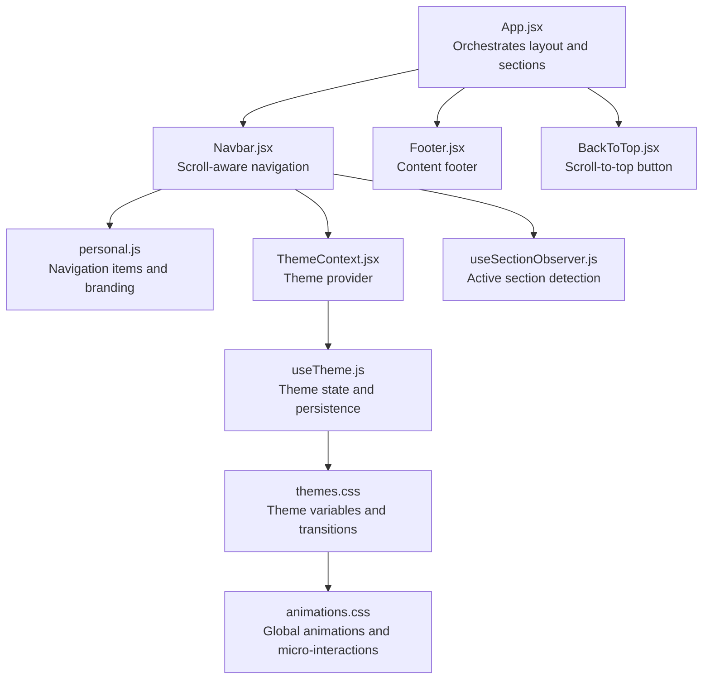
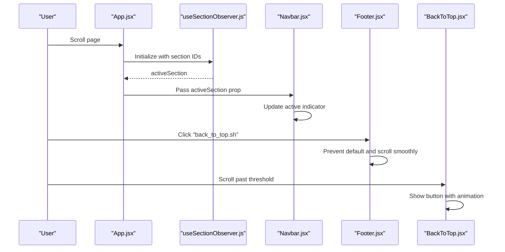
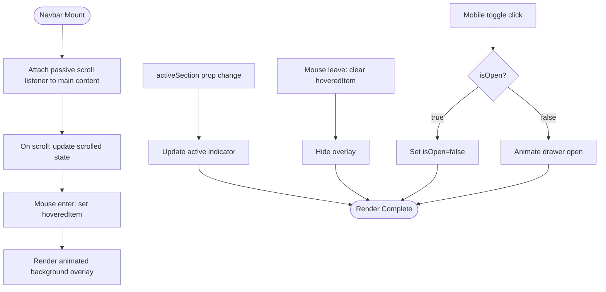
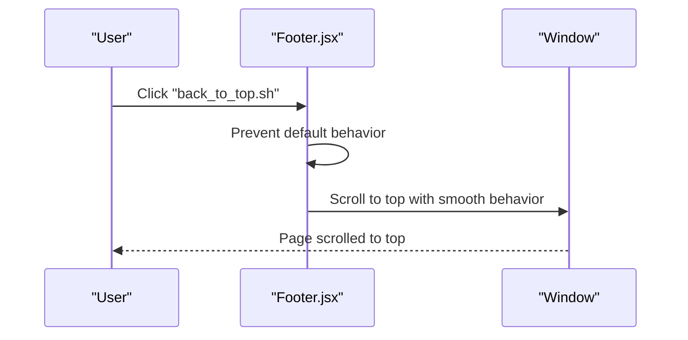
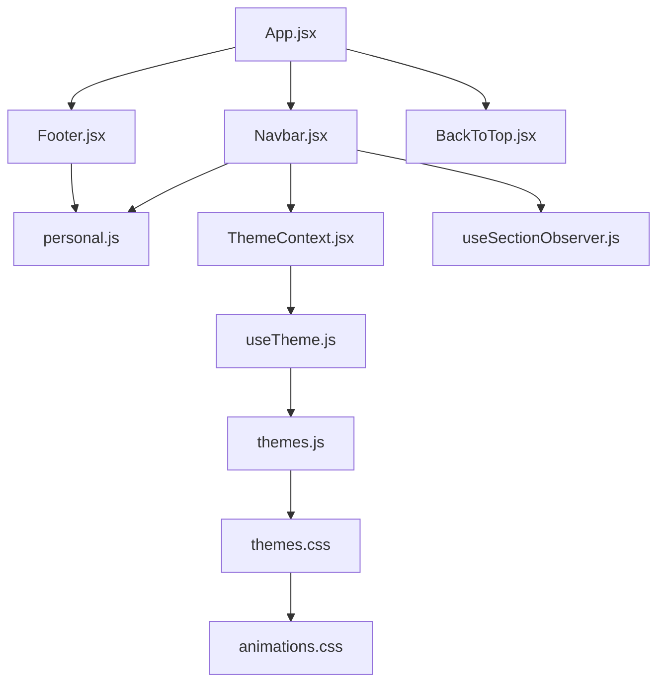

# Layout Components

<cite>
**Referenced Files in This Document**
- [Navbar.jsx](file://src/components/layout/Navbar.jsx)
- [Footer.jsx](file://src/components/layout/Footer.jsx)
- [useSectionObserver.js](file://src/hooks/useSectionObserver.js)
- [App.jsx](file://src/App.jsx)
- [personal.js](file://src/data/personal.js)
- [ThemeContext.jsx](file://src/context/ThemeContext.jsx)
- [useTheme.js](file://src/hooks/useTheme.js)
- [themes.js](file://src/data/themes.js)
- [themes.css](file://src/styles/themes.css)
- [animations.css](file://src/styles/animations.css)
- [BackToTop.jsx](file://src/components/ui/BackToTop.jsx)
- [main.jsx](file://src/main.jsx)
</cite>

## Table of Contents
1. [Introduction](#introduction)
2. [Project Structure](#project-structure)
3. [Core Components](#core-components)
4. [Architecture Overview](#architecture-overview)
5. [Detailed Component Analysis](#detailed-component-analysis)
6. [Dependency Analysis](#dependency-analysis)
7. [Performance Considerations](#performance-considerations)
8. [Troubleshooting Guide](#troubleshooting-guide)
9. [Conclusion](#conclusion)

## Introduction
This document provides comprehensive technical documentation for the layout components that form the structural foundation of the portfolio. It focuses on the Navbar and Footer components, detailing their scroll-aware behavior, animated hover effects, mobile-responsive design, and integration with the active section indicator. The documentation covers component props, state management, event handlers, responsive design patterns, accessibility features, mobile navigation behavior, and performance optimizations. It also explains how to customize navigation items, modify styling, and integrate with the theme system.

## Project Structure
The layout components are organized under the `src/components/layout` directory and integrate with the global theme system and section observer hook. The Navbar component manages scroll awareness, animated hover effects, and mobile navigation, while the Footer provides content organization and social links. The App component orchestrates the active section detection and passes the active section to the Navbar.

**Diagram sources**
- [App.jsx:15-47](file://src/App.jsx#L15-L47)
- [Navbar.jsx:14-255](file://src/components/layout/Navbar.jsx#L14-L255)
- [Footer.jsx:3-65](file://src/components/layout/Footer.jsx#L3-L65)
- [BackToTop.jsx:4-50](file://src/components/ui/BackToTop.jsx#L4-L50)
- [personal.js:1-29](file://src/data/personal.js#L1-L29)
- [ThemeContext.jsx:6-23](file://src/context/ThemeContext.jsx#L6-L23)
- [useSectionObserver.js:3-52](file://src/hooks/useSectionObserver.js#L3-L52)
- [useTheme.js:4-33](file://src/hooks/useTheme.js#L4-L33)
- [themes.css:7-395](file://src/styles/themes.css#L7-L395)
- [animations.css:1-426](file://src/styles/animations.css#L1-L426)

**Section sources**
- [App.jsx:15-47](file://src/App.jsx#L15-L47)
- [main.jsx:9-16](file://src/main.jsx#L9-L16)

## Core Components
This section documents the primary layout components and their responsibilities:
- Navbar: Provides scroll-aware navigation with animated hover effects, desktop and mobile layouts, and integration with the active section indicator.
- Footer: Presents copyright, scroll-to-top functionality, and social media links with responsive design.
- Active Section Detection: Uses a custom hook to track the currently active section based on scroll position.
- Theme System: Manages theme switching, persistence, and CSS variable updates across the application.

Key responsibilities:
- Navbar manages scroll detection on the main content container, maintains hover state for animated backgrounds, controls mobile drawer visibility, and integrates with the active section indicator.
- Footer organizes content across three regions (left, center, right) with responsive flex layout and handles smooth scrolling to top.
- The App component initializes the section observer and passes the active section to the Navbar.

**Section sources**
- [Navbar.jsx:14-255](file://src/components/layout/Navbar.jsx#L14-L255)
- [Footer.jsx:3-65](file://src/components/layout/Footer.jsx#L3-L65)
- [useSectionObserver.js:3-52](file://src/hooks/useSectionObserver.js#L3-L52)
- [App.jsx:15-47](file://src/App.jsx#L15-L47)

## Architecture Overview
The layout architecture centers around the App component, which coordinates the Navbar, Footer, and BackToTop components. The Navbar consumes the active section from the useSectionObserver hook and applies visual indicators for the active section. The theme system is globally applied via ThemeProvider, enabling dynamic theme switching and persistent theme selection.

**Diagram sources**
- [App.jsx:15-47](file://src/App.jsx#L15-L47)
- [useSectionObserver.js:3-52](file://src/hooks/useSectionObserver.js#L3-L52)
- [Navbar.jsx:14-255](file://src/components/layout/Navbar.jsx#L14-L255)
- [Footer.jsx:3-65](file://src/components/layout/Footer.jsx#L3-L65)
- [BackToTop.jsx:4-50](file://src/components/ui/BackToTop.jsx#L4-L50)

## Detailed Component Analysis

### Navbar Component
The Navbar component provides a premium navigation experience with scroll-aware behavior, animated hover effects, and mobile-responsive design. It integrates with the active section indicator and theme system.

#### Props and State Management
- Props:
  - activeSection: String representing the currently active section ID (e.g., "hero", "about").
- Internal State:
  - hoveredItem: Object storing the currently hovered navigation item for animated background.
  - scrolled: Boolean indicating whether the user has scrolled beyond a threshold.
  - isOpen: Boolean controlling the mobile drawer visibility.

#### Event Handlers and Scroll Awareness
- Scroll Listener:
  - Attaches a passive scroll listener to the main content container to update the scrolled state when the scroll position exceeds a threshold.
- Hover Effects:
  - Tracks hovered navigation items to render animated background overlays using Framer Motion.
- Mobile Navigation:
  - Toggles the mobile drawer with animated entrance/exit and backdrop interaction.

#### Active Section Indicator
- Desktop:
  - Renders an animated underline indicator using layoutId for smooth transitions when the active section changes.
- Mobile:
  - Highlights the active item with a bordered accent and background highlight.

#### Accessibility Features
- Keyboard Accessible:
  - Uses aria-label and aria-expanded attributes on the mobile toggle button.
  - Focus management ensures skip links and interactive elements are reachable.
- Reduced Motion:
  - Respects prefers-reduced-motion by minimizing animations and transitions.

#### Responsive Design Patterns
- Desktop:
  - Fixed header with backdrop blur and subtle shadow when scrolled.
  - Animated gradient buttons with hover effects and glow transitions.
- Mobile:
  - Spring-loaded drawer with backdrop overlay and animated close button.
  - Full-width navigation list with prominent active state.

#### Integration with Theme System
- CSS Variables:
  - Uses theme-defined variables for background, borders, and accent colors.
- Gradient Animations:
  - Applies gradient backgrounds and animated transitions aligned with the current theme.

#### Usage Examples
- Customizing Navigation Items:
  - Modify the navItems array to add, remove, or reorder navigation entries. Each item requires label, href, and bgVar properties.
- Modifying Styling:
  - Adjust spacing, typography, and colors by updating theme CSS variables in themes.css.
- Integrating with Theme System:
  - Switch themes via ThemeToggle, which uses the theme context and persists selections in localStorage.

**Diagram sources**
- [Navbar.jsx:19-25](file://src/components/layout/Navbar.jsx#L19-L25)
- [Navbar.jsx:87-106](file://src/components/layout/Navbar.jsx#L87-L106)
- [Navbar.jsx:137-160](file://src/components/layout/Navbar.jsx#L137-L160)
- [Navbar.jsx:165-250](file://src/components/layout/Navbar.jsx#L165-L250)

**Section sources**
- [Navbar.jsx:14-255](file://src/components/layout/Navbar.jsx#L14-L255)
- [personal.js:1-29](file://src/data/personal.js#L1-L29)
- [themes.css:7-57](file://src/styles/themes.css#L7-L57)
- [animations.css:383-406](file://src/styles/animations.css#L383-L406)

### Footer Component
The Footer component organizes content across three regions: copyright information, a scroll-to-top action, and social media links. It uses responsive design to adapt to different screen sizes.

#### Structure and Content Organization
- Left Region:
  - Displays the current year and author name with a built-with statement.
- Center Region:
  - Provides a smooth-scroll link to the top of the page with a custom label.
- Right Region:
  - Lists social media links with target and rel attributes for security.

#### Accessibility and Interaction
- Smooth Scrolling:
  - Prevents default anchor behavior and scrolls to the top with smooth behavior.
- Responsive Flex Layout:
  - Adapts from column to row layout on medium screens and above.

#### Usage Examples
- Customizing Content:
  - Update the personal data to reflect different names, emails, and social links.
- Styling Modifications:
  - Adjust padding, typography, and colors using Tailwind utility classes.

**Diagram sources**
- [Footer.jsx:6-9](file://src/components/layout/Footer.jsx#L6-L9)

**Section sources**
- [Footer.jsx:3-65](file://src/components/layout/Footer.jsx#L3-L65)
- [personal.js:15-21](file://src/data/personal.js#L15-L21)

### Active Section Observer Hook
The useSectionObserver hook calculates the currently active section based on scroll position and viewport geometry. It uses requestAnimationFrame for performance and a 30% trigger point to determine proximity to the active section.

#### Implementation Details
- Section IDs:
  - Accepts an array of section IDs to monitor.
- Trigger Point:
  - Uses 30% of viewport height as the trigger distance to select the nearest section.
- Performance:
  - Debounces updates with requestAnimationFrame and cleans up listeners on unmount.

#### Integration with Navbar
- The App component initializes the hook with section IDs and passes the active section to the Navbar for indicator updates.

**Section sources**
- [useSectionObserver.js:3-52](file://src/hooks/useSectionObserver.js#L3-L52)
- [App.jsx:16-17](file://src/App.jsx#L16-L17)

### Theme System Integration
The theme system enables dynamic color schemes and persistent theme selection across the application. It integrates with the Navbar and other components through CSS variables and theme context.

#### Theme Provider and Context
- ThemeProvider wraps the application and supplies theme values via context.
- useThemeContext retrieves theme values and enforces provider usage.

#### Theme Persistence and Cycling
- useTheme manages theme state, persists selections in localStorage, and cycles through available themes.
- themes.js defines available themes and the default theme.

#### CSS Variables and Transitions
- themes.css defines CSS variables for colors, typography, and gradients across multiple themes.
- Global transitions and animation utilities enhance micro-interactions and reduce jank.

**Section sources**
- [ThemeContext.jsx:6-23](file://src/context/ThemeContext.jsx#L6-L23)
- [useTheme.js:4-33](file://src/hooks/useTheme.js#L4-L33)
- [themes.js:2-29](file://src/data/themes.js#L2-L29)
- [themes.css:7-395](file://src/styles/themes.css#L7-L395)
- [animations.css:230-246](file://src/styles/animations.css#L230-L246)

## Dependency Analysis
The layout components depend on shared utilities, hooks, and theme resources. The Navbar depends on the personal data for navigation items and branding, while the App component orchestrates the active section detection and theme context.

**Diagram sources**
- [Navbar.jsx:1-4](file://src/components/layout/Navbar.jsx#L1-L4)
- [Footer.jsx:1](file://src/components/layout/Footer.jsx#L1)
- [App.jsx:1-13](file://src/App.jsx#L1-L13)
- [ThemeContext.jsx:2](file://src/context/ThemeContext.jsx#L2)
- [useTheme.js:2](file://src/hooks/useTheme.js#L2)
- [themes.js:1-30](file://src/data/themes.js#L1-L30)
- [themes.css:1-6](file://src/styles/themes.css#L1-L6)
- [animations.css:1-4](file://src/styles/animations.css#L1-L4)

**Section sources**
- [Navbar.jsx:1-4](file://src/components/layout/Navbar.jsx#L1-L4)
- [Footer.jsx:1](file://src/components/layout/Footer.jsx#L1)
- [App.jsx:1-13](file://src/App.jsx#L1-L13)
- [ThemeContext.jsx:2](file://src/context/ThemeContext.jsx#L2)
- [useTheme.js:2](file://src/hooks/useTheme.js#L2)
- [themes.js:1-30](file://src/data/themes.js#L1-L30)
- [themes.css:1-6](file://src/styles/themes.css#L1-L6)
- [animations.css:1-4](file://src/styles/animations.css#L1-L4)

## Performance Considerations
- Passive Event Listeners:
  - Scroll listeners use passive: true to improve scroll performance.
- requestAnimationFrame:
  - Debounces active section calculations to minimize layout thrashing.
- CSS Transitions and Animations:
  - Global transitions and reduced-motion support optimize rendering for various devices.
- Theme Transitions:
  - Controlled transition exclusions prevent performance drops during theme changes.

Best practices:
- Prefer CSS transitions over JavaScript animations for smoother performance.
- Use requestAnimationFrame for scroll-based computations.
- Respect user motion preferences to avoid unnecessary animations.

**Section sources**
- [useSectionObserver.js:33-46](file://src/hooks/useSectionObserver.js#L33-L46)
- [themes.css:230-246](file://src/styles/themes.css#L230-L246)
- [animations.css:355-377](file://src/styles/animations.css#L355-L377)

## Troubleshooting Guide
Common issues and resolutions:
- Navigation Items Not Updating:
  - Verify that navItems in Navbar matches the section IDs passed to useSectionObserver.
- Active Indicator Not Visible:
  - Ensure activeSection prop is correctly passed from App and matches the href values in navItems.
- Mobile Drawer Not Opening/Closing:
  - Confirm isOpen state toggles on mobile toggle click and that backdrop click closes the drawer.
- Theme Not Persisting:
  - Check localStorage key and theme context provider wrapping the application.
- Scroll Behavior Issues:
  - Ensure main content container has the correct ID and passive scroll listeners are attached.

Accessibility checks:
- Verify aria-label and aria-expanded attributes on mobile toggle.
- Test keyboard navigation and focus management.
- Confirm reduced-motion compatibility and graceful degradation.

**Section sources**
- [Navbar.jsx:137-160](file://src/components/layout/Navbar.jsx#L137-L160)
- [Navbar.jsx:165-250](file://src/components/layout/Navbar.jsx#L165-L250)
- [App.jsx:16-17](file://src/App.jsx#L16-L17)
- [useTheme.js:17-21](file://src/hooks/useTheme.js#L17-L21)
- [ThemeContext.jsx:16-22](file://src/context/ThemeContext.jsx#L16-L22)

## Conclusion
The layout components deliver a polished, responsive, and accessible navigation experience. The Navbar’s scroll-aware behavior, animated hover effects, and mobile drawer provide a premium user interface, while the Footer offers structured content and smooth navigation to the top. The integration with the active section observer and theme system ensures a cohesive and customizable design. By following the customization and performance guidelines, developers can extend the components to meet evolving design requirements while maintaining optimal performance and accessibility.