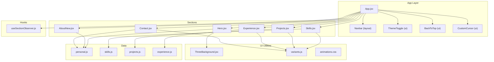
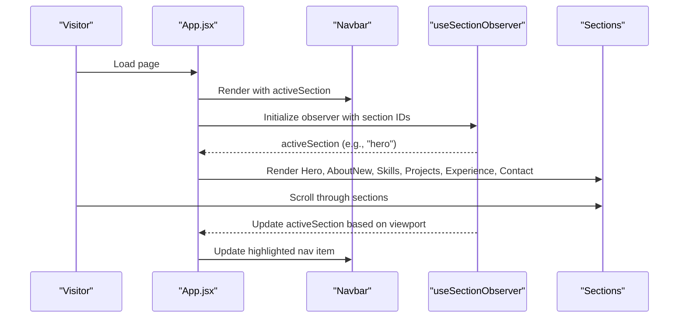
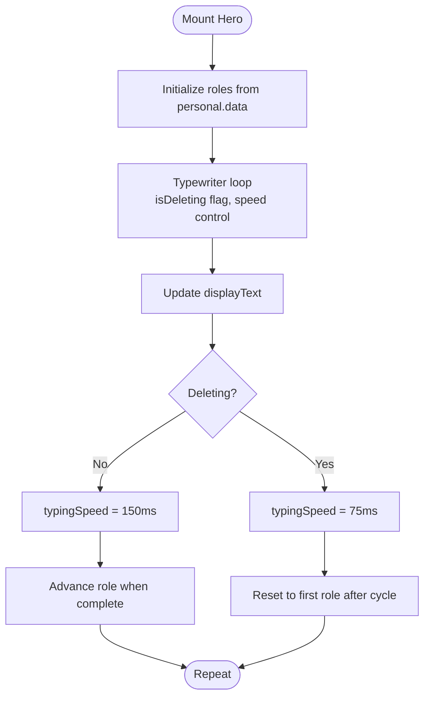
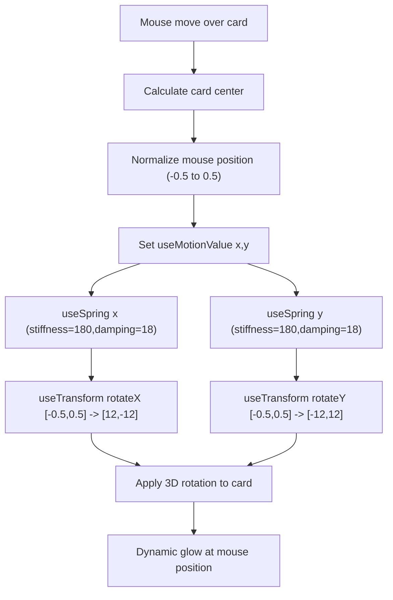
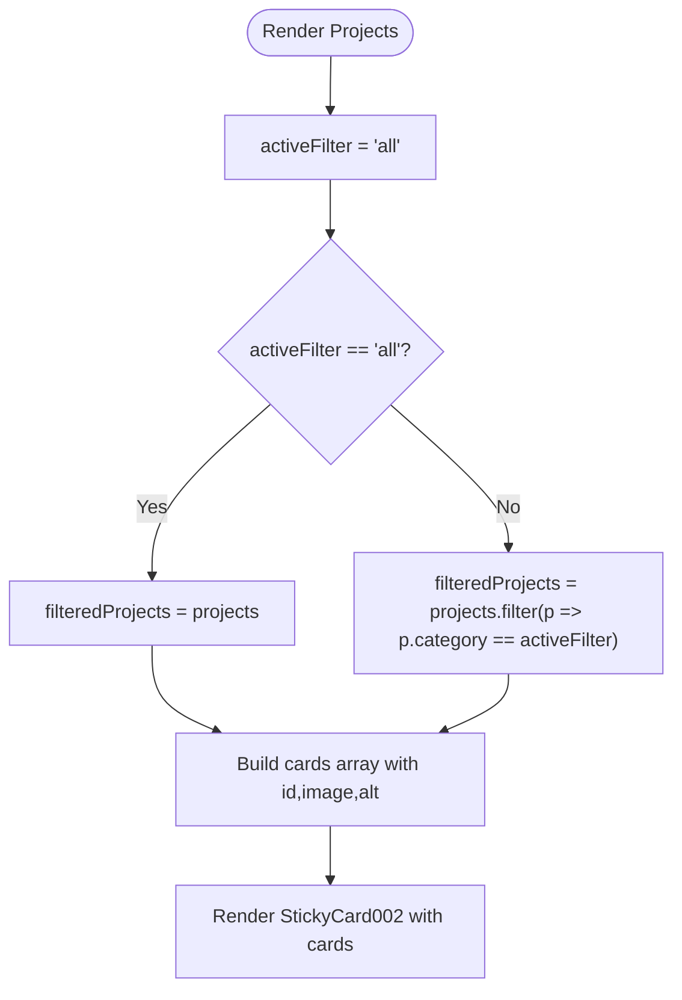
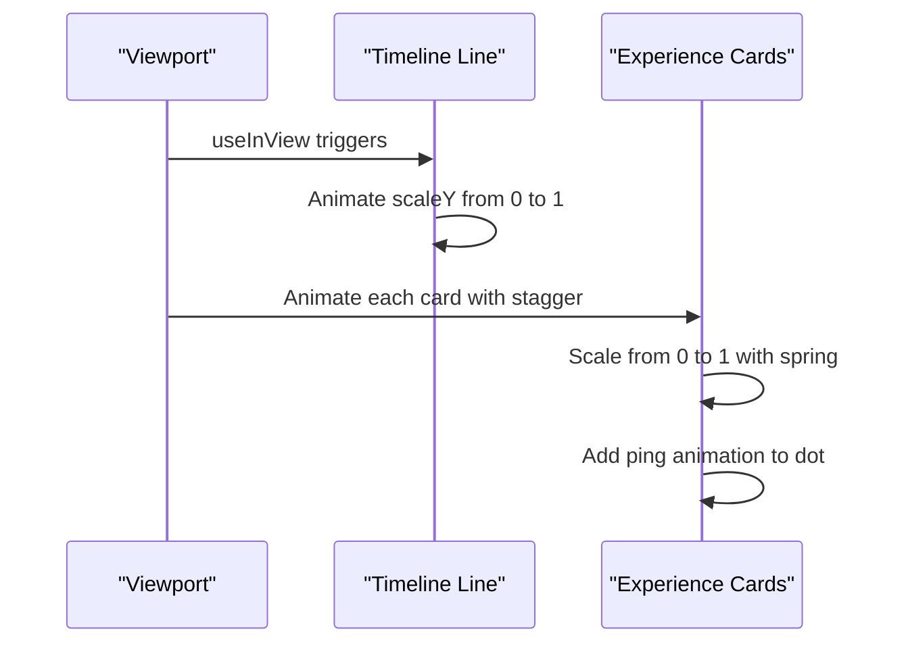
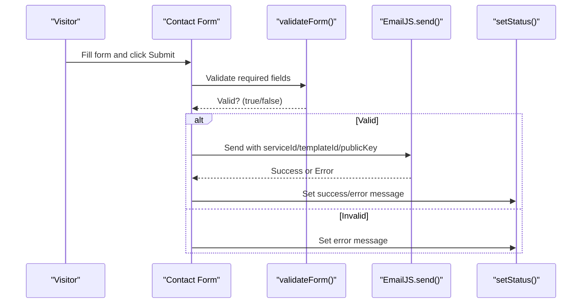
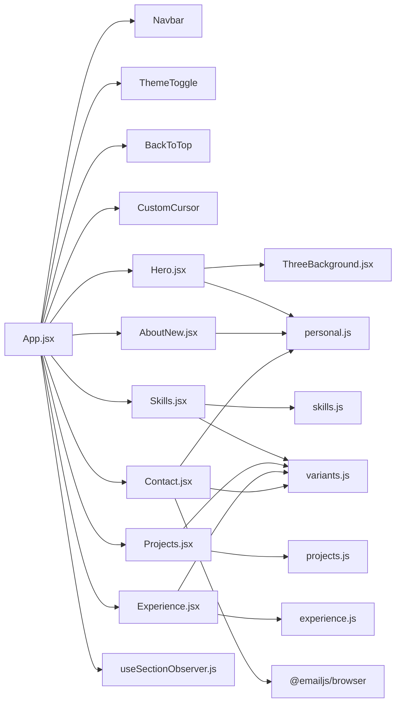

# Section Components

<cite>
**Referenced Files in This Document**
- [Hero.jsx](file://src/components/sections/Hero.jsx)
- [AboutNew.jsx](file://src/components/sections/AboutNew.jsx)
- [Skills.jsx](file://src/components/sections/Skills.jsx)
- [Projects.jsx](file://src/components/sections/Projects.jsx)
- [Experience.jsx](file://src/components/sections/Experience.jsx)
- [Contact.jsx](file://src/components/sections/Contact.jsx)
- [ThreeBackground.jsx](file://src/components/ui/ThreeBackground.jsx)
- [personal.js](file://src/data/personal.js)
- [skills.js](file://src/data/skills.js)
- [projects.js](file://src/data/projects.js)
- [experience.js](file://src/data/experience.js)
- [variants.js](file://src/utils/variants.js)
- [animations.css](file://src/styles/animations.css)
- [App.jsx](file://src/App.jsx)
- [useSectionObserver.js](file://src/hooks/useSectionObserver.js)
</cite>

## Table of Contents
1. [Introduction](#introduction)
2. [Project Structure](#project-structure)
3. [Core Components](#core-components)
4. [Architecture Overview](#architecture-overview)
5. [Detailed Component Analysis](#detailed-component-analysis)
6. [Dependency Analysis](#dependency-analysis)
7. [Performance Considerations](#performance-considerations)
8. [Accessibility Features](#accessibility-features)
9. [Mobile Optimization Strategies](#mobile-optimization-strategies)
10. [Customization Guidelines](#customization-guidelines)
11. [Troubleshooting Guide](#troubleshooting-guide)
12. [Conclusion](#conclusion)

## Introduction
This document provides comprehensive documentation for the main content section components that constitute the portfolio's primary content areas. It covers the Hero (with typewriter animation and 3D background), AboutNew (personal information display), Skills (technology stack visualization), Projects (portfolio showcase with filtering), Experience (work history timeline), and Contact (form integration). For each component, we explain props, data structures, animation implementations, responsive behavior, and integration points. We also include customization guidelines, performance considerations, accessibility features, and mobile optimization strategies.

## Project Structure
The portfolio is organized around distinct section components located under src/components/sections. Each section consumes data from src/data and leverages shared UI utilities and animations from src/components/ui, src/styles, and src/utils. The App component orchestrates the layout and integrates navigation and global UI elements.



**Diagram sources**
- [App.jsx:15-43](file://src/App.jsx#L15-L43)
- [Hero.jsx:1-229](file://src/components/sections/Hero.jsx#L1-L229)
- [AboutNew.jsx:1-420](file://src/components/sections/AboutNew.jsx#L1-L420)
- [Skills.jsx:1-531](file://src/components/sections/Skills.jsx#L1-L531)
- [Projects.jsx:1-125](file://src/components/sections/Projects.jsx#L1-L125)
- [Experience.jsx:1-168](file://src/components/sections/Experience.jsx#L1-L168)
- [Contact.jsx:1-293](file://src/components/sections/Contact.jsx#L1-L293)
- [ThreeBackground.jsx:1-184](file://src/components/ui/ThreeBackground.jsx#L1-L184)
- [personal.js:1-29](file://src/data/personal.js#L1-L29)
- [skills.js:1-39](file://src/data/skills.js#L1-L39)
- [projects.js:1-67](file://src/data/projects.js#L1-L67)
- [experience.js:1-43](file://src/data/experience.js#L1-L43)
- [variants.js:1-17](file://src/utils/variants.js#L1-L17)
- [animations.css:1-426](file://src/styles/animations.css#L1-L426)
- [useSectionObserver.js:1-52](file://src/hooks/useSectionObserver.js#L1-L52)

**Section sources**
- [App.jsx:15-43](file://src/App.jsx#L15-L43)

## Core Components
Each section component is responsible for rendering a specific part of the portfolio content. They share common patterns:
- Use of Framer Motion for entrance and hover animations
- Responsive design with Tailwind classes
- Data-driven rendering from centralized data modules
- Accessibility attributes and semantic markup
- Integration with global theme and animations

Key responsibilities:
- Hero: Introduces the visitor with animated typewriter roles, interactive CTAs, and a 3D particle background
- AboutNew: Presents personal info, stats, tech stack, and availability with staggered animations
- Skills: Visualizes technology stack with magnetic cards, category tabs, and CS fundamentals
- Projects: Showcases portfolio items with category filtering and a sticky card stack
- Experience: Timeline of professional journey with animated milestones
- Contact: Form integration with EmailJS and social contact methods

**Section sources**
- [Hero.jsx:7-226](file://src/components/sections/Hero.jsx#L7-L226)
- [AboutNew.jsx:21-143](file://src/components/sections/AboutNew.jsx#L21-L143)
- [Skills.jsx:288-528](file://src/components/sections/Skills.jsx#L288-L528)
- [Projects.jsx:17-122](file://src/components/sections/Projects.jsx#L17-L122)
- [Experience.jsx:14-165](file://src/components/sections/Experience.jsx#L14-L165)
- [Contact.jsx:13-292](file://src/components/sections/Contact.jsx#L13-L292)

## Architecture Overview
The sections are rendered sequentially within the main content area. Navigation highlighting is handled by a hook that tracks the active section based on scroll position. Animations leverage Framer Motion and CSS keyframes. Data is injected via props from centralized data modules.



**Diagram sources**
- [App.jsx:15-43](file://src/App.jsx#L15-L43)
- [useSectionObserver.js:3-48](file://src/hooks/useSectionObserver.js#L3-L48)

**Section sources**
- [App.jsx:15-43](file://src/App.jsx#L15-L43)
- [useSectionObserver.js:1-52](file://src/hooks/useSectionObserver.js#L1-L52)

## Detailed Component Analysis

### Hero Section
Purpose:
- Deliver a strong first impression with animated typewriter roles, hero text, tagline, CTAs, and social links
- Feature a 3D particle background that responds to mouse movement and scroll

Key features:
- Typewriter effect with roles array from personal data
- Animated radial gradients and subtle pulsing backgrounds
- Interactive CTAs with hover effects and directional arrows
- Social icons with hover states and accessibility labels
- 3D background using Three.js with mouse and scroll interactions

Props and data:
- Consumes personal data for name, tagline, social links, and typewriter roles
- Uses ThreeBackground for immersive visuals

Animation implementation:
- Framer Motion for staggered entrance of headline, tagline, and buttons
- CSS keyframes for blinking cursor and continuous background pulses
- Mouse move and scroll handlers adjust particle rotation and position

Responsive behavior:
- Flexible typography scales with clamp and responsive breakpoints
- Centered layout adapts to mobile and desktop widths
- Social icons and buttons stack appropriately on smaller screens

Accessibility:
- Proper heading hierarchy (h1, h2)
- ARIA labels for social links
- Focus management via skip link

**Section sources**
- [Hero.jsx:1-229](file://src/components/sections/Hero.jsx#L1-L229)
- [personal.js:15-27](file://src/data/personal.js#L15-L27)
- [ThreeBackground.jsx:1-184](file://src/components/ui/ThreeBackground.jsx#L1-L184)
- [animations.css:199-211](file://src/styles/animations.css#L199-L211)

#### Hero Animation Flow


**Diagram sources**
- [Hero.jsx:15-39](file://src/components/sections/Hero.jsx#L15-L39)
- [personal.js:22-27](file://src/data/personal.js#L22-L27)

### AboutNew Section
Purpose:
- Present personal information, stats, tech stack, and availability in an elegant two-column layout
- Use staggered animations triggered by intersection observer

Key features:
- Video background with overlay and radial gradient
- Ambient glowing orbs for depth
- Animated title with gradient text and shimmer
- Personal bio with emphasis on achievements
- Tech stack pills with hover effects
- Stats grid with animated cards
- Availability badge and CTA buttons

Props and data:
- Consumes personal data for availability, resume link, and socials
- Builds a combined tech stack list from skills data
- Uses predefined stats for CGPA, users impacted, etc.

Animation implementation:
- IntersectionObserver triggers visibility-based transforms and opacity
- Staggered delays for title, image, bio, tech stack, stats, and CTAs
- Hover states with glow, scale, and shimmer effects

Responsive behavior:
- Flex layout switches to stacked columns on small screens
- Image container maintains aspect ratio with max-width constraints
- Typography scales using clamp for readability

Accessibility:
- Semantic headings and lists
- Proper contrast for gradient text
- Hover/focus states for interactive elements

**Section sources**
- [AboutNew.jsx:1-420](file://src/components/sections/AboutNew.jsx#L1-L420)
- [personal.js:1-29](file://src/data/personal.js#L1-L29)
- [skills.js:1-39](file://src/data/skills.js#L1-L39)

#### AboutNew Staggered Animation Sequence
```mermaid
sequenceDiagram
participant IO as "IntersectionObserver"
participant Title as "SectionTitle"
participant Image as "Visual Column"
participant Bio as "BioBlock"
participant Stack as "TechStack"
participant Stats as "StatsGrid"
participant CTA as "StatusBadge + CTAButtons"
IO-->>Title : visible=true (delay 0s)
IO-->>Image : visible=true (delay 0.2s)
IO-->>Bio : visible=true (delay 0.4s)
IO-->>Stack : visible=true (delay 0.6s)
IO-->>Stats : visible=true (delay 0.9s)
IO-->>CTA : visible=true (delay 1.3s)
```

**Diagram sources**
- [AboutNew.jsx:25-32](file://src/components/sections/AboutNew.jsx#L25-L32)
- [AboutNew.jsx:146-180](file://src/components/sections/AboutNew.jsx#L146-L180)
- [AboutNew.jsx:74-118](file://src/components/sections/AboutNew.jsx#L74-L118)
- [AboutNew.jsx:183-207](file://src/components/sections/AboutNew.jsx#L183-L207)
- [AboutNew.jsx:210-232](file://src/components/sections/AboutNew.jsx#L210-L232)
- [AboutNew.jsx:266-274](file://src/components/sections/AboutNew.jsx#L266-L274)
- [AboutNew.jsx:336-417](file://src/components/sections/AboutNew.jsx#L336-L417)

### Skills Section
Purpose:
- Showcase technical competencies with category tabs, animated skill cards, and CS fundamentals

Key features:
- Category tabs with icons and color accents
- Magnetic skill cards with 3D tilt, glow follow, and icon pop
- Animated proficiency indicators
- Floating particles for ambient feel
- CS fundamentals grid with numbered cards
- Live skill count badge

Props and data:
- Consumes skills data for categories and CS concepts
- Uses personal data for theme accent color retrieval

Animation implementation:
- Framer Motion for entrance, hover, and exit transitions
- useInView to trigger animations when section enters viewport
- useTransform and useMotionValue for magnetic card physics
- AnimatePresence for smooth tab transitions

Responsive behavior:
- Grid adjusts from 3 to 6 columns based on screen size
- Cards maintain aspect ratios and padding
- Tab list wraps to multiple rows on small screens

Accessibility:
- Tablist with aria-label and proper keyboard navigation
- Color contrast maintained for text and borders
- Focus-visible rings for interactive elements

**Section sources**
- [Skills.jsx:1-531](file://src/components/sections/Skills.jsx#L1-L531)
- [skills.js:1-39](file://src/data/skills.js#L1-L39)
- [personal.js:14-14](file://src/data/personal.js#L14-L14)

#### Magnetic Skill Card Physics


**Diagram sources**
- [Skills.jsx:70-187](file://src/components/sections/Skills.jsx#L70-L187)

### Projects Section
Purpose:
- Display a curated portfolio with category filtering and a visually engaging sticky card stack

Key features:
- Category filter buttons with active state styling
- StickyCard002 stack powered by Lenis for smooth scrolling
- Hover background that reveals on interaction
- GitHub CTA with animated arrow

Props and data:
- Consumes projects data for filtering and card rendering
- Uses personal socials for fallback GitHub link

Animation implementation:
- Framer Motion variants for staggered entrance
- useInView to trigger animations when section becomes visible
- Filter state controls which projects render

Responsive behavior:
- Filters wrap to multiple rows on small screens
- Cards maintain aspect ratios and spacing
- Stack adapts to viewport height

Accessibility:
- Clear button states and focus management
- Semantic headings and labels
- Links open in new tabs with appropriate attributes

**Section sources**
- [Projects.jsx:1-125](file://src/components/sections/Projects.jsx#L1-L125)
- [projects.js:1-67](file://src/data/projects.js#L1-L67)
- [personal.js:15-21](file://src/data/personal.js#L15-L21)
- [variants.js:1-17](file://src/utils/variants.js#L1-L17)

#### Projects Filtering Logic


**Diagram sources**
- [Projects.jsx:22-31](file://src/components/sections/Projects.jsx#L22-L31)

### Experience Section
Purpose:
- Present professional journey as an animated timeline with milestones and technologies

Key features:
- Vertical timeline with animated line and pulsing dots
- Glass-morphism cards with hover enhancements
- Bullet points with checkmark icons
- Technology tags with hover states
- Call-to-action for collaboration

Props and data:
- Consumes experience data for entries and tech tags

Animation implementation:
- Framer Motion variants for staggered item animations
- useInView to trigger timeline line and milestone animations
- Individual cards scale in with spring easing

Responsive behavior:
- Timeline adjusts to single column on small screens
- Cards stack vertically with proper spacing
- Icons scale appropriately across breakpoints

Accessibility:
- Proper heading hierarchy and article semantics
- List structure for bullet points
- Focusable interactive elements with clear labels

**Section sources**
- [Experience.jsx:1-168](file://src/components/sections/Experience.jsx#L1-L168)
- [experience.js:1-43](file://src/data/experience.js#L1-L43)
- [variants.js:1-17](file://src/utils/variants.js#L1-L17)

#### Experience Timeline Animation


**Diagram sources**
- [Experience.jsx:6-12](file://src/components/sections/Experience.jsx#L6-L12)
- [Experience.jsx:54-127](file://src/components/sections/Experience.jsx#L54-L127)

### Contact Section
Purpose:
- Provide multiple ways to connect, including a functional contact form integrated with EmailJS

Key features:
- Contact methods with icons and links
- Social profiles with hover states
- Fully validated contact form with client-side validation
- EmailJS integration with environment variables
- Status feedback for success/error states
- Animated submit button with loading state

Props and data:
- Consumes personal data for contact info and social links
- Uses EmailJS SDK for form submission

Animation implementation:
- Framer Motion variants for staggered entrance
- useInView to trigger animations when section becomes visible
- Form submission with loading spinner and status messages

Responsive behavior:
- Two-column layout on large screens, stacked on small
- Inputs and buttons scale appropriately
- Status messages adapt to screen sizes

Accessibility:
- Proper labels and placeholders
- Error messages with accessible contrast
- Disabled states during submission
- Focus management for form fields

**Section sources**
- [Contact.jsx:1-293](file://src/components/sections/Contact.jsx#L1-L293)
- [personal.js:13-21](file://src/data/personal.js#L13-L21)

#### Contact Form Submission Flow


**Diagram sources**
- [Contact.jsx:32-91](file://src/components/sections/Contact.jsx#L32-L91)

## Dependency Analysis
The sections depend on shared data modules, UI utilities, and animation helpers. The App component wires everything together and manages the active section state for navigation.



**Diagram sources**
- [App.jsx:15-43](file://src/App.jsx#L15-L43)
- [Hero.jsx:3-4](file://src/components/sections/Hero.jsx#L3-L4)
- [AboutNew.jsx:1](file://src/components/sections/AboutNew.jsx#L1)
- [Skills.jsx:3](file://src/components/sections/Skills.jsx#L3)
- [Projects.jsx:3-5](file://src/components/sections/Projects.jsx#L3-L5)
- [Experience.jsx:3-4](file://src/components/sections/Experience.jsx#L3-L4)
- [Contact.jsx:6](file://src/components/sections/Contact.jsx#L6)
- [useSectionObserver.js:1-52](file://src/hooks/useSectionObserver.js#L1-L52)

**Section sources**
- [App.jsx:15-43](file://src/App.jsx#L15-L43)

## Performance Considerations
- Hero 3D background: Uses requestAnimationFrame and ResizeObserver; disables on mobile to preserve performance
- Skills magnetic cards: Leverages useMotionValue and useTransform with springs; optimized with device pixel ratio limits
- Projects sticky stack: Integrates Lenis for smooth scrolling; consider lazy-loading images for large galleries
- Experience timeline: Uses useInView with viewport thresholds to avoid unnecessary computations
- Contact form: Client-side validation reduces server calls; EmailJS integration requires environment variables to prevent runtime errors
- General: Prefer CSS transforms and opacity for animations; minimize heavy computations in render loops

**Section sources**
- [ThreeBackground.jsx:20-21](file://src/components/ui/ThreeBackground.jsx#L20-L21)
- [Skills.jsx:70-86](file://src/components/sections/Skills.jsx#L70-L86)
- [Experience.jsx:15-16](file://src/components/sections/Experience.jsx#L15-L16)
- [Contact.jsx:8-11](file://src/components/sections/Contact.jsx#L8-L11)

## Accessibility Features
- Semantic HTML: Proper headings, lists, and landmarks
- Focus management: Skip link to main content, focus-visible rings
- ARIA attributes: aria-labels for icons, aria-pressed for tabs, aria-hidden for decorative elements
- Color contrast: Ensures sufficient contrast for text and interactive elements
- Keyboard navigation: Tabs work correctly across forms and interactive elements
- Screen reader friendly: Descriptive labels and roles for form controls and navigation

**Section sources**
- [Hero.jsx:194-196](file://src/components/sections/Hero.jsx#L194-L196)
- [Skills.jsx:244](file://src/components/sections/Skills.jsx#L244)
- [Experience.jsx:146-158](file://src/components/sections/Experience.jsx#L146-L158)
- [Contact.jsx:196](file://src/components/sections/Contact.jsx#L196)

## Mobile Optimization Strategies
- Flexible grids: Columns adjust from 3–6 in Skills, 2–3 in CS fundamentals
- Stacked layouts: AboutNew switches to vertical layout on small screens
- Responsive typography: clamp units for scalable headings and body text
- Touch-friendly targets: Buttons and links sized for touch interaction
- Reduced motion: Disable heavy animations on reduced-motion preferences
- Performance: Hero background disabled on mobile devices to save resources

**Section sources**
- [Skills.jsx:443-454](file://src/components/sections/Skills.jsx#L443-L454)
- [AboutNew.jsx:72-139](file://src/components/sections/AboutNew.jsx#L72-L139)
- [ThreeBackground.jsx:20-21](file://src/components/ui/ThreeBackground.jsx#L20-L21)

## Customization Guidelines
- Modify content:
  - Update personal data in personal.js for name, tagline, availability, and social links
  - Adjust skills categories and CS concepts in skills.js
  - Add or edit projects in projects.js with images and categories
  - Populate experience entries in experience.js
- Add new sections:
  - Create a new component under src/components/sections
  - Import and render it in App.jsx
  - Add the section ID to the sectionIds array in App.jsx and useSectionObserver hook
  - Implement useInView and variants for animations
- Integrate external data sources:
  - Replace data modules with API calls in useEffect
  - Add loading and error states
  - Cache data locally to improve performance
- Customize animations:
  - Adjust easing curves and durations in Framer Motion
  - Extend animations.css with new keyframes
  - Use theme variables for consistent color palettes

**Section sources**
- [personal.js:1-29](file://src/data/personal.js#L1-L29)
- [skills.js:1-39](file://src/data/skills.js#L1-L39)
- [projects.js:1-67](file://src/data/projects.js#L1-L67)
- [experience.js:1-43](file://src/data/experience.js#L1-L43)
- [App.jsx:16-17](file://src/App.jsx#L16-L17)
- [variants.js:1-17](file://src/utils/variants.js#L1-L17)

## Troubleshooting Guide
- Contact form not working:
  - Verify VITE_EMAILJS_SERVICE_ID, VITE_EMAILJS_TEMPLATE_ID, and VITE_EMAILJS_PUBLIC_KEY environment variables
  - Check EmailJS account configuration and template mapping
  - Review browser console for network errors
- Hero 3D background not rendering:
  - Confirm Three.js is loaded and canvas element exists
  - Check for mobile device detection disabling the background
  - Validate theme variable --accent is defined
- Skills magnetic cards not responding:
  - Ensure useMotionValue and useTransform are properly initialized
  - Verify mousemove and mouseleave event handlers
  - Check for conflicting z-index or pointer-events
- Projects filtering not updating:
  - Confirm activeFilter state updates on button clicks
  - Verify projects data structure matches category keys
  - Check for missing image paths causing render issues

**Section sources**
- [Contact.jsx:26-30](file://src/components/sections/Contact.jsx#L26-L30)
- [ThreeBackground.jsx:19-27](file://src/components/ui/ThreeBackground.jsx#L19-L27)
- [Skills.jsx:81-86](file://src/components/sections/Skills.jsx#L81-L86)
- [Projects.jsx:22-25](file://src/components/sections/Projects.jsx#L22-L25)

## Conclusion
The portfolio's section components are designed with modern web practices, combining data-driven rendering, sophisticated animations, and responsive layouts. The Hero introduces visitors with a memorable 3D background and typewriter effect, while AboutNew presents personal information with elegant animations. Skills showcases technical abilities with interactive magnetic cards, Projects displays a filtered portfolio with a smooth sticky stack, Experience chronicles professional growth via an animated timeline, and Contact provides a robust communication channel with EmailJS integration. By following the customization guidelines and best practices outlined here, you can extend and maintain the portfolio effectively.