# Utility Components

<cite>
**Referenced Files in This Document**
- [ThemeToggle.jsx](file://src/components/ui/ThemeToggle.jsx)
- [CustomCursor.jsx](file://src/components/ui/CustomCursor.jsx)
- [BackToTop.jsx](file://src/components/ui/BackToTop.jsx)
- [SocialIcon.jsx](file://src/components/ui/SocialIcon.jsx)
- [InfoCard.jsx](file://src/components/ui/InfoCard.jsx)
- [StickyProjectCards.jsx](file://src/components/ui/StickyProjectCards.jsx)
- [StickyCard002.jsx](file://src/components/ui/StickyCard002.jsx)
- [ThreeBackground.jsx](file://src/components/ui/ThreeBackground.jsx)
- [ThemeContext.jsx](file://src/context/ThemeContext.jsx)
- [useTheme.js](file://src/hooks/useTheme.js)
- [themes.js](file://src/data/themes.js)
- [themes.css](file://src/styles/themes.css)
- [utils.js](file://src/lib/utils.js)
- [App.jsx](file://src/App.jsx)
</cite>

## Table of Contents
1. [Introduction](#introduction)
2. [Project Structure](#project-structure)
3. [Core Components](#core-components)
4. [Architecture Overview](#architecture-overview)
5. [Detailed Component Analysis](#detailed-component-analysis)
6. [Dependency Analysis](#dependency-analysis)
7. [Performance Considerations](#performance-considerations)
8. [Troubleshooting Guide](#troubleshooting-guide)
9. [Conclusion](#conclusion)

## Introduction
This document provides comprehensive documentation for the utility and helper components that enhance user experience and provide specialized functionality in the portfolio application. These components include ThemeToggle (color scheme switching), CustomCursor (interactive cursor effects), BackToTop (navigation helper), SocialIcon (social media links), InfoCard (content display), StickyProjectCards (project highlights), StickyCard002 (alternative card styling), and ThreeBackground (3D graphics). The documentation covers component props, integration patterns, styling options, customization possibilities, usage examples, performance considerations, and best practices for extending these utility components.

## Project Structure
The utility components are organized within the `src/components/ui/` directory and integrate with the theme system, GSAP animations, and Framer Motion for smooth transitions. The components leverage Tailwind CSS classes, CSS custom properties for theming, and modern React patterns including hooks and context providers.

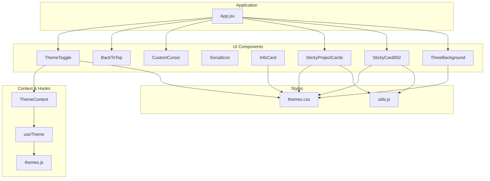

**Diagram sources**
- [App.jsx:15-44](file://src/App.jsx#L15-L44)
- [ThemeToggle.jsx:5-113](file://src/components/ui/ThemeToggle.jsx#L5-L113)
- [CustomCursor.jsx:4-245](file://src/components/ui/CustomCursor.jsx#L4-L245)
- [BackToTop.jsx:4-50](file://src/components/ui/BackToTop.jsx#L4-L50)
- [StickyProjectCards.jsx:8-145](file://src/components/ui/StickyProjectCards.jsx#L8-L145)
- [StickyCard002.jsx:16-127](file://src/components/ui/StickyCard002.jsx#L16-L127)
- [ThreeBackground.jsx:5-184](file://src/components/ui/ThreeBackground.jsx#L5-L184)
- [ThemeContext.jsx:6-22](file://src/context/ThemeContext.jsx#L6-L22)
- [useTheme.js:4-32](file://src/hooks/useTheme.js#L4-L32)
- [themes.js:2-29](file://src/data/themes.js#L2-L29)
- [themes.css:7-222](file://src/styles/themes.css#L7-L222)
- [utils.js:4-6](file://src/lib/utils.js#L4-L6)

**Section sources**
- [App.jsx:15-44](file://src/App.jsx#L15-L44)
- [ThemeToggle.jsx:5-113](file://src/components/ui/ThemeToggle.jsx#L5-L113)
- [CustomCursor.jsx:4-245](file://src/components/ui/CustomCursor.jsx#L4-L245)
- [BackToTop.jsx:4-50](file://src/components/ui/BackToTop.jsx#L4-L50)
- [SocialIcon.jsx:23-32](file://src/components/ui/SocialIcon.jsx#L23-L32)
- [InfoCard.jsx:3-132](file://src/components/ui/InfoCard.jsx#L3-L132)
- [StickyProjectCards.jsx:8-145](file://src/components/ui/StickyProjectCards.jsx#L8-L145)
- [StickyCard002.jsx:16-127](file://src/components/ui/StickyCard002.jsx#L16-L127)
- [ThreeBackground.jsx:5-184](file://src/components/ui/ThreeBackground.jsx#L5-L184)

## Core Components
This section provides an overview of each utility component, their primary responsibilities, and integration patterns within the application.

### ThemeToggle
The ThemeToggle component provides an interactive interface for switching between predefined color schemes. It integrates with the theme context system to manage theme state and persistence.

Key capabilities:
- Theme selection interface with animated transitions
- Persistent theme storage using localStorage
- Real-time theme preview with accent color visualization
- Keyboard accessibility and screen reader support

Integration pattern:
- Wrapped with ThemeProvider in the application root
- Consumes useTheme hook for theme state management
- Uses Framer Motion for smooth animations and transitions

### CustomCursor
The CustomCursor component creates an immersive cursor experience with sophisticated animations and interactive feedback. It handles dynamic element detection and responsive behavior.

Key capabilities:
- Dual-layer cursor system with precise positioning
- Spring-based physics for smooth tracking
- Dynamic hover state detection and text labeling
- Automatic desktop/mobile device adaptation
- Performance-optimized with requestAnimationFrame

Integration pattern:
- Mounted globally in the application layout
- Uses MutationObserver for dynamic DOM element tracking
- Implements custom CSS to hide native cursor on supported devices

### BackToTop
The BackToTop component provides a convenient navigation helper that appears when scrolling down long pages. It offers smooth scrolling behavior and subtle animations.

Key capabilities:
- Conditional visibility based on scroll position
- Smooth animated appearance/disappearance
- Configurable scroll threshold and behavior
- Accessible ARIA labels and keyboard navigation

Integration pattern:
- Targets the main content container by ID
- Uses Framer Motion for entrance/exit animations
- Responsive sizing and positioning

### SocialIcon
The SocialIcon component delivers a compact, scalable solution for displaying social media icons with consistent styling and fallback support.

Key capabilities:
- SVG-based icon rendering with optimized paths
- Platform-specific icon mapping
- Fallback icon for unsupported platforms
- Flexible sizing and styling through className prop

Integration pattern:
- Stateless functional component with minimal dependencies
- Uses inline SVG definitions for optimal performance
- Supports arbitrary sizing through Tailwind classes

### InfoCard
The InfoCard component renders visually appealing information cards with sophisticated hover effects, animations, and glass-morphism styling.

Key capabilities:
- Dynamic opacity and transform animations
- Glass-morphism background with backdrop blur
- Animated edge glow effects and shimmer overlays
- Hover-triggered state changes with smooth transitions
- Configurable positioning and timing delays

Integration pattern:
- Accepts structured card data with icon, label, and value properties
- Uses CSS custom properties for theme-aware styling
- Implements advanced CSS animations for visual effects

### StickyProjectCards
The StickyProjectCards component creates an immersive scrolling experience with animated project showcase cards that transition as users scroll through content.

Key capabilities:
- Multi-card sticky scrolling with GSAP timeline
- Progressive card scaling and rotation effects
- Responsive image handling with graceful fallbacks
- Pinning behavior with scroll-triggered animations
- Dynamic resize handling and cleanup

Integration pattern:
- Requires GSAP and ScrollTrigger plugins
- Uses ref-based element targeting for precise control
- Implements ResizeObserver for responsive adjustments

### StickyCard002
The StickyCard002 component provides an alternative card styling solution with simplified image-centric presentation and smooth scrolling transitions.

Key capabilities:
- Minimalist card design focused on imagery
- Advanced GSAP animations with rotation and scaling
- Responsive image containers with aspect ratio preservation
- Container class customization through props
- Performance-optimized rendering pipeline

Integration pattern:
- Uses cn utility for conditional class merging
- Implements strict ref-based element management
- Provides extensible class customization options

### ThreeBackground
The ThreeBackground component delivers an immersive 3D particle system background with interactive mouse and scroll effects, creating a dynamic visual experience.

Key capabilities:
- WebGL-powered particle system with Three.js
- Interactive mouse and scroll-responsive animations
- Dynamic accent color synchronization with theme system
- Mobile device detection and adaptive behavior
- Performance-optimized rendering with requestAnimationFrame

Integration pattern:
- Integrates with theme system for color synchronization
- Uses ResizeObserver for responsive canvas updates
- Implements cleanup procedures for memory management

**Section sources**
- [ThemeToggle.jsx:5-113](file://src/components/ui/ThemeToggle.jsx#L5-L113)
- [CustomCursor.jsx:4-245](file://src/components/ui/CustomCursor.jsx#L4-L245)
- [BackToTop.jsx:4-50](file://src/components/ui/BackToTop.jsx#L4-L50)
- [SocialIcon.jsx:23-32](file://src/components/ui/SocialIcon.jsx#L23-L32)
- [InfoCard.jsx:3-132](file://src/components/ui/InfoCard.jsx#L3-L132)
- [StickyProjectCards.jsx:8-145](file://src/components/ui/StickyProjectCards.jsx#L8-L145)
- [StickyCard002.jsx:16-127](file://src/components/ui/StickyCard002.jsx#L16-L127)
- [ThreeBackground.jsx:5-184](file://src/components/ui/ThreeBackground.jsx#L5-L184)

## Architecture Overview
The utility components follow a cohesive architecture pattern that emphasizes separation of concerns, performance optimization, and user experience enhancement. The system leverages modern React patterns including hooks, context providers, and third-party libraries for advanced animations and interactions.

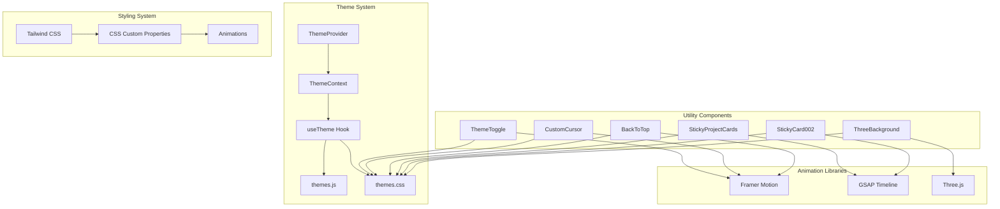

**Diagram sources**
- [ThemeContext.jsx:6-22](file://src/context/ThemeContext.jsx#L6-L22)
- [useTheme.js:4-32](file://src/hooks/useTheme.js#L4-L32)
- [themes.js:2-29](file://src/data/themes.js#L2-L29)
- [themes.css:7-222](file://src/styles/themes.css#L7-L222)
- [ThemeToggle.jsx:24-76](file://src/components/ui/ThemeToggle.jsx#L24-L76)
- [CustomCursor.jsx:156-241](file://src/components/ui/CustomCursor.jsx#L156-L241)
- [BackToTop.jsx:27-46](file://src/components/ui/BackToTop.jsx#L27-L46)
- [StickyProjectCards.jsx:12-50](file://src/components/ui/StickyProjectCards.jsx#L12-L50)
- [StickyCard002.jsx:25-95](file://src/components/ui/StickyCard002.jsx#L25-L95)
- [ThreeBackground.jsx:19-166](file://src/components/ui/ThreeBackground.jsx#L19-L166)

The architecture demonstrates several key design principles:
- **Separation of Concerns**: Each component has a focused responsibility
- **Performance Optimization**: Strategic use of libraries and efficient rendering
- **Accessibility**: Proper ARIA attributes and keyboard navigation support
- **Responsive Design**: Adaptive behavior across different device sizes
- **Theme Integration**: Seamless integration with the global theme system

## Detailed Component Analysis

### ThemeToggle Component Analysis
The ThemeToggle component serves as the primary interface for color scheme switching, featuring an elegant floating action button with an expandable theme picker tray.

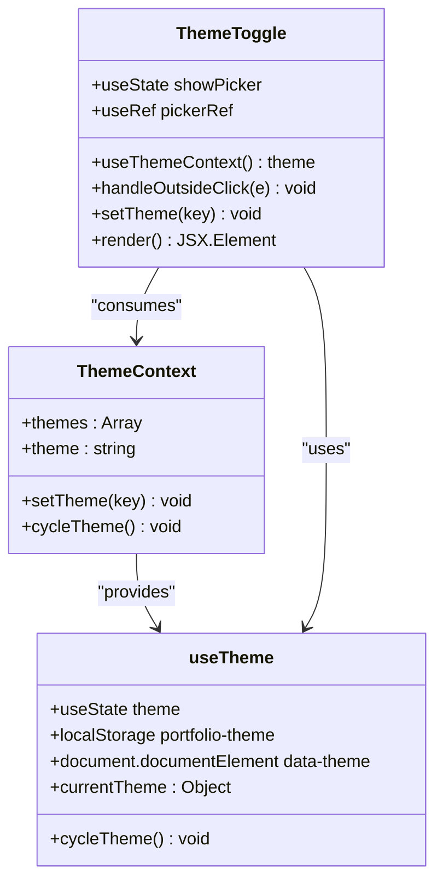

**Diagram sources**
- [ThemeToggle.jsx:5-113](file://src/components/ui/ThemeToggle.jsx#L5-L113)
- [ThemeContext.jsx:6-22](file://src/context/ThemeContext.jsx#L6-L22)
- [useTheme.js:4-32](file://src/hooks/useTheme.js#L4-L32)

Key implementation patterns:
- **State Management**: Uses local state for picker visibility and theme context for global state
- **Event Handling**: Implements outside-click detection for closing the picker tray
- **Animation System**: Leverages Framer Motion for smooth enter/exit animations
- **Accessibility**: Provides proper ARIA labels and keyboard navigation support

Props and customization options:
- No props required (fully self-contained)
- Styling controlled through Tailwind classes and CSS custom properties
- Theme options defined in themes.js data structure

Integration patterns:
- Mounted globally in the application layout
- Consumes ThemeProvider context for theme state
- Persists theme preference in localStorage

**Section sources**
- [ThemeToggle.jsx:5-113](file://src/components/ui/ThemeToggle.jsx#L5-L113)
- [ThemeContext.jsx:6-22](file://src/context/ThemeContext.jsx#L6-L22)
- [useTheme.js:4-32](file://src/hooks/useTheme.js#L4-L32)
- [themes.js:2-29](file://src/data/themes.js#L2-L29)

### CustomCursor Component Analysis
The CustomCursor component implements a sophisticated dual-layer cursor system with spring physics, hover detection, and dynamic text labeling.

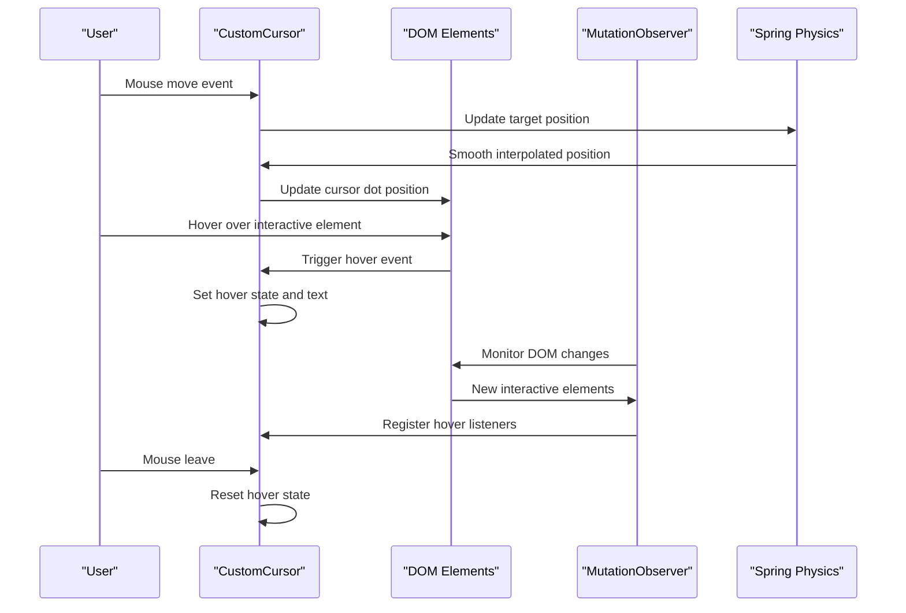

**Diagram sources**
- [CustomCursor.jsx:51-130](file://src/components/ui/CustomCursor.jsx#L51-L130)
- [CustomCursor.jsx:156-241](file://src/components/ui/CustomCursor.jsx#L156-L241)

Advanced features:
- **Spring Physics**: Custom damping and stiffness configuration for smooth tracking
- **Dynamic Detection**: Automatic hover listener registration using MutationObserver
- **Performance Optimization**: RequestAnimationFrame-based animation loop
- **Device Adaptation**: Desktop-only cursor with mobile fallback detection

Implementation complexity:
- **Time Complexity**: O(n) for hover listener management where n is interactive elements
- **Space Complexity**: O(k) for hover targets tracking where k is registered elements
- **Animation Performance**: Optimized with spring physics and efficient state updates

**Section sources**
- [CustomCursor.jsx:4-245](file://src/components/ui/CustomCursor.jsx#L4-L245)

### BackToTop Component Analysis
The BackToTop component provides a simple yet effective navigation helper with smooth scrolling behavior and conditional visibility.

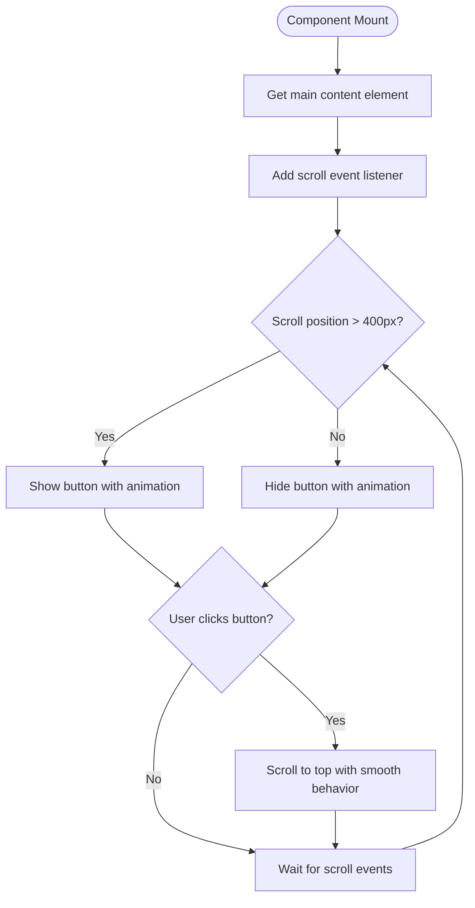

**Diagram sources**
- [BackToTop.jsx:7-17](file://src/components/ui/BackToTop.jsx#L7-L17)
- [BackToTop.jsx:19-24](file://src/components/ui/BackToTop.jsx#L19-L24)

Key features:
- **Conditional Visibility**: Appears only when scrolling down significant distances
- **Smooth Scrolling**: Utilizes native smooth scrolling behavior
- **Animation System**: Framer Motion for entrance/exit animations
- **Accessibility**: Proper ARIA labels and keyboard navigation support

**Section sources**
- [BackToTop.jsx:4-50](file://src/components/ui/BackToTop.jsx#L4-L50)

### SocialIcon Component Analysis
The SocialIcon component offers a lightweight, scalable solution for displaying social media icons with platform-specific support and fallback mechanisms.

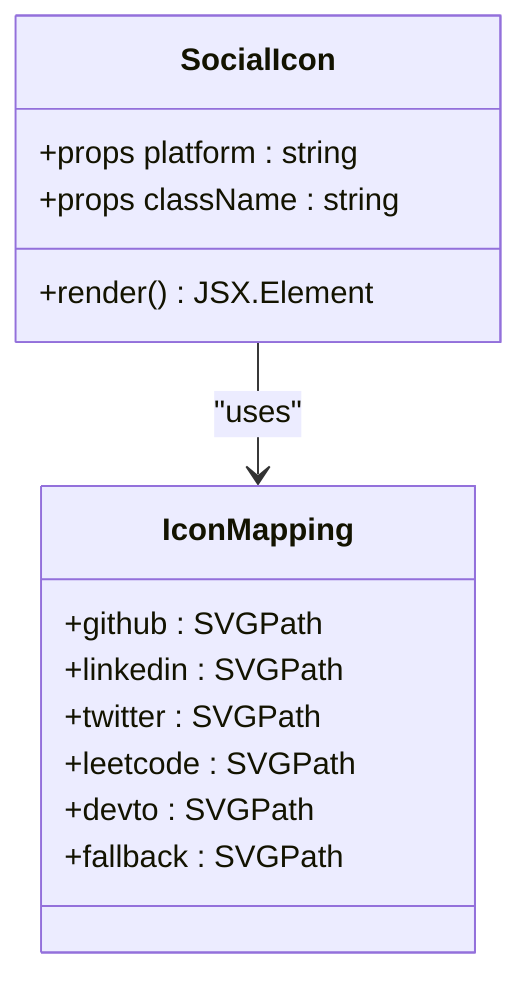

**Diagram sources**
- [SocialIcon.jsx:1-32](file://src/components/ui/SocialIcon.jsx#L1-L32)

Implementation characteristics:
- **SVG-Based Rendering**: Inline SVG definitions for optimal performance
- **Platform Support**: Built-in support for major social media platforms
- **Fallback Mechanism**: Graceful degradation for unsupported platforms
- **Flexible Sizing**: Customizable through className prop with Tailwind utilities

**Section sources**
- [SocialIcon.jsx:23-32](file://src/components/ui/SocialIcon.jsx#L23-L32)

### InfoCard Component Analysis
The InfoCard component delivers sophisticated visual effects with glass-morphism styling, animated edge glows, and hover-triggered transformations.

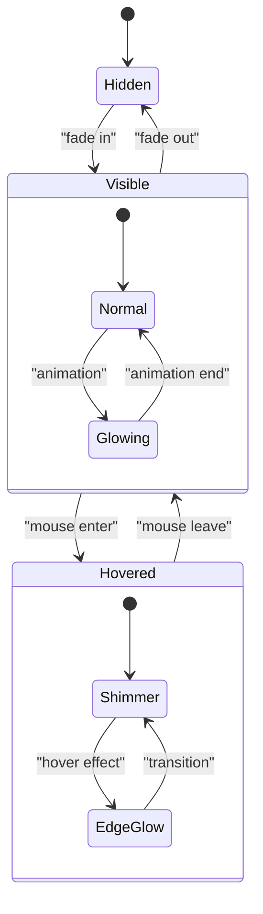

**Diagram sources**
- [InfoCard.jsx:3-132](file://src/components/ui/InfoCard.jsx#L3-L132)

Visual effects implementation:
- **Glass-Morphism**: Backdrop blur with RGBA transparency
- **Edge Glows**: Animated gradient borders with pulse effects
- **Shimmer Effects**: Dynamic highlight animations on hover
- **Transform Animations**: Sophisticated translate and scale transitions

**Section sources**
- [InfoCard.jsx:3-132](file://src/components/ui/InfoCard.jsx#L3-L132)

### StickyProjectCards Component Analysis
The StickyProjectCards component creates an immersive scrolling experience with multi-card animations and GSAP timeline control.

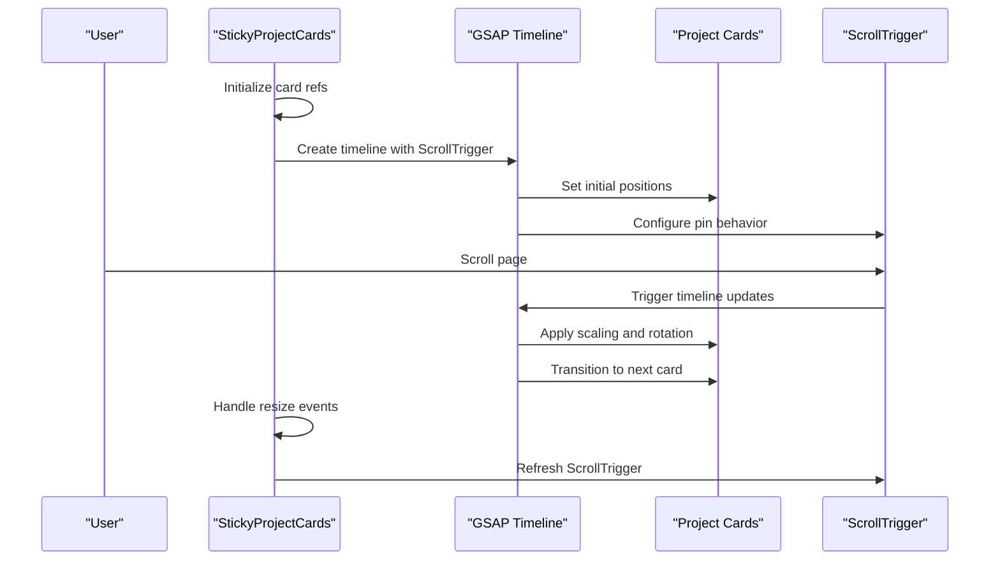

**Diagram sources**
- [StickyProjectCards.jsx:12-50](file://src/components/ui/StickyProjectCards.jsx#L12-L50)
- [StickyProjectCards.jsx:52-144](file://src/components/ui/StickyProjectCards.jsx#L52-L144)

Advanced animation features:
- **Multi-Card Timeline**: Coordinated animations across multiple cards
- **GSAP Integration**: Professional animation library with ScrollTrigger
- **Pin Behavior**: Sticky positioning during scroll interactions
- **Responsive Scaling**: Dynamic card sizing and rotation effects

**Section sources**
- [StickyProjectCards.jsx:8-145](file://src/components/ui/StickyProjectCards.jsx#L8-L145)

### StickyCard002 Component Analysis
The StickyCard002 component provides an alternative card styling solution with simplified image-centric presentation and smooth scrolling transitions.

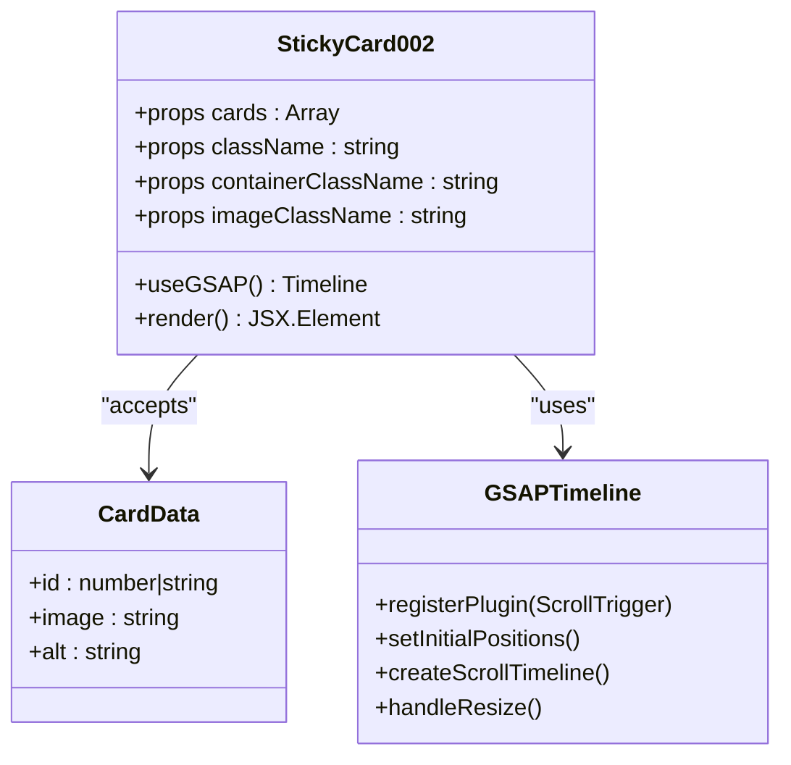

**Diagram sources**
- [StickyCard002.jsx:16-127](file://src/components/ui/StickyCard002.jsx#L16-L127)

Design philosophy:
- **Minimalist Approach**: Focus on image presentation with subtle animations
- **Performance Optimization**: Efficient GSAP implementation with proper cleanup
- **Extensibility**: Props-based customization for various use cases
- **Responsive Design**: Adaptive container sizing with aspect ratio preservation

**Section sources**
- [StickyCard002.jsx:16-127](file://src/components/ui/StickyCard002.jsx#L16-L127)

### ThreeBackground Component Analysis
The ThreeBackground component delivers an immersive 3D particle system with interactive mouse and scroll effects, creating a dynamic visual experience.

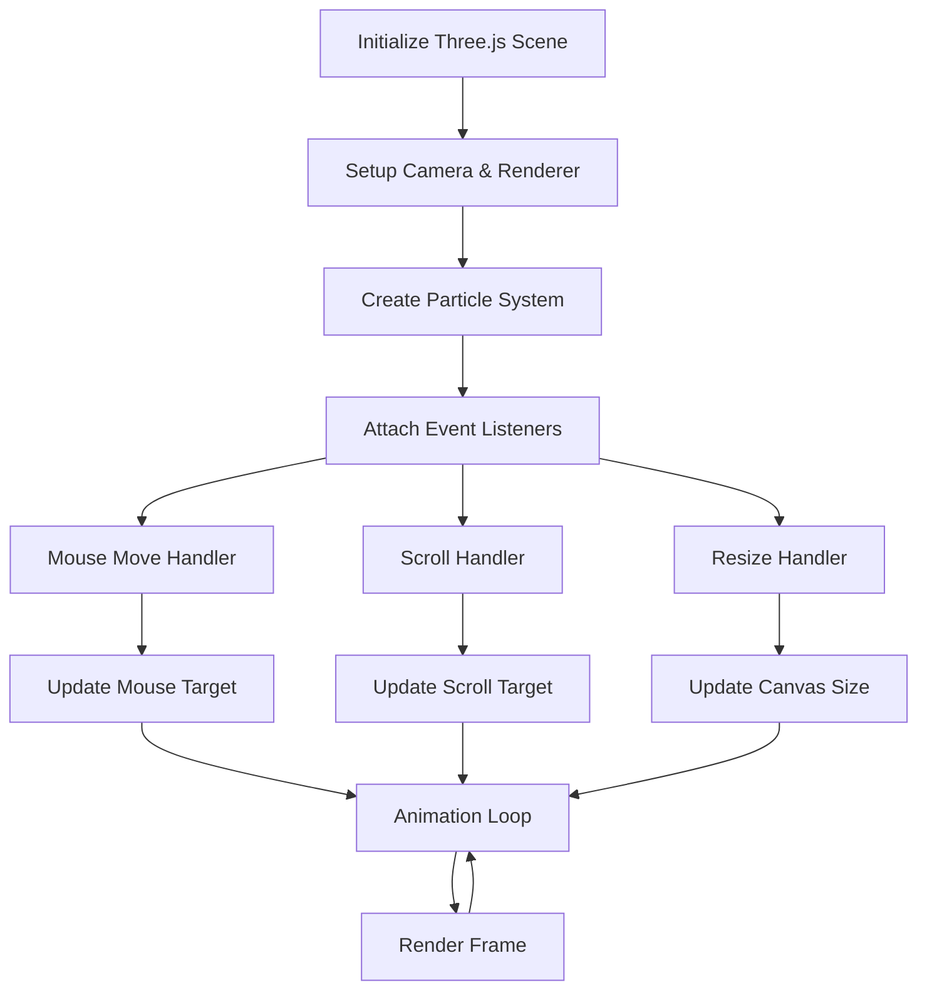

**Diagram sources**
- [ThreeBackground.jsx:19-166](file://src/components/ui/ThreeBackground.jsx#L19-L166)

Technical implementation:
- **WebGL Integration**: Three.js for hardware-accelerated 3D rendering
- **Interactive Physics**: Mouse and scroll-responsive particle movement
- **Dynamic Color Sync**: Real-time accent color synchronization
- **Performance Management**: Cleanup procedures and memory optimization

**Section sources**
- [ThreeBackground.jsx:5-184](file://src/components/ui/ThreeBackground.jsx#L5-L184)

## Dependency Analysis
The utility components demonstrate a well-structured dependency graph with clear separation between core functionality, animation libraries, and styling systems.

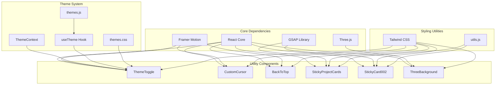

**Diagram sources**
- [ThemeToggle.jsx:1-3](file://src/components/ui/ThemeToggle.jsx#L1-L3)
- [CustomCursor.jsx:1-2](file://src/components/ui/CustomCursor.jsx#L1-L2)
- [BackToTop.jsx:1-2](file://src/components/ui/BackToTop.jsx#L1-L2)
- [StickyProjectCards.jsx:1-4](file://src/components/ui/StickyProjectCards.jsx#L1-L4)
- [StickyCard002.jsx:1-9](file://src/components/ui/StickyCard002.jsx#L1-L9)
- [ThreeBackground.jsx:1-3](file://src/components/ui/ThreeBackground.jsx#L1-L3)
- [ThemeContext.jsx:1-2](file://src/context/ThemeContext.jsx#L1-L2)
- [useTheme.js:1-2](file://src/hooks/useTheme.js#L1-L2)
- [themes.js:1-2](file://src/data/themes.js#L1-L2)
- [themes.css:1-5](file://src/styles/themes.css#L1-L5)
- [utils.js:1-2](file://src/lib/utils.js#L1-L2)

Dependency characteristics:
- **Low Coupling**: Components maintain loose coupling through props and context
- **High Cohesion**: Each component focuses on a specific functionality area
- **External Dependencies**: Strategic use of specialized libraries for complex animations
- **Internal Dependencies**: Shared utilities and styling systems across components

**Section sources**
- [ThemeToggle.jsx:1-3](file://src/components/ui/ThemeToggle.jsx#L1-L3)
- [CustomCursor.jsx:1-2](file://src/components/ui/CustomCursor.jsx#L1-L2)
- [BackToTop.jsx:1-2](file://src/components/ui/BackToTop.jsx#L1-L2)
- [StickyProjectCards.jsx:1-4](file://src/components/ui/StickyProjectCards.jsx#L1-L4)
- [StickyCard002.jsx:1-9](file://src/components/ui/StickyCard002.jsx#L1-L9)
- [ThreeBackground.jsx:1-3](file://src/components/ui/ThreeBackground.jsx#L1-L3)
- [ThemeContext.jsx:1-2](file://src/context/ThemeContext.jsx#L1-L2)
- [useTheme.js:1-2](file://src/hooks/useTheme.js#L1-L2)
- [themes.js:1-2](file://src/data/themes.js#L1-L2)
- [themes.css:1-5](file://src/styles/themes.css#L1-L5)
- [utils.js:1-2](file://src/lib/utils.js#L1-L2)

## Performance Considerations
The utility components implement several performance optimization strategies to ensure smooth user experiences across different devices and browsers.

### Animation Performance
- **Framer Motion**: Uses hardware-accelerated transforms and optimized animation loops
- **GSAP**: Professional animation library with efficient timeline management and cleanup procedures
- **Three.js**: WebGL-powered rendering with requestAnimationFrame optimization and memory cleanup
- **Spring Physics**: Custom damping configurations for smooth yet performant cursor tracking

### Memory Management
- **Event Listener Cleanup**: Comprehensive removal of event listeners in useEffect cleanup functions
- **Resize Observer**: Proper disconnection of ResizeObserver instances to prevent memory leaks
- **Canvas Resource Management**: Three.js components dispose of geometries, materials, and textures
- **MutationObserver**: Cleanup of dynamic DOM observation to prevent accumulation

### Device Optimization
- **Mobile Detection**: Feature detection for touch devices and adaptive behavior
- **Performance Budget**: RequestAnimationFrame-based animations with throttled updates
- **Lazy Loading**: Conditional initialization based on device capabilities
- **Reduced Motion Support**: Respect user preferences for motion reduction

### Rendering Optimization
- **CSS Custom Properties**: Efficient theme switching without full re-rendering
- **Tailwind Classes**: Static class composition for optimal CSS generation
- **Backface Visibility**: Hardware acceleration optimizations for 3D transforms
- **Will Change**: Strategic use of will-change for animation performance

Best practices for extending components:
- **Maintain Cleanup**: Always implement proper cleanup in useEffect hooks
- **Optimize Animations**: Use appropriate easing functions and frame rates
- **Respect User Preferences**: Honor reduced motion settings and accessibility preferences
- **Test Across Devices**: Verify performance on low-end devices and varying network conditions
- **Monitor Memory Usage**: Regularly audit for memory leaks in animation-heavy components

## Troubleshooting Guide
Common issues and solutions for the utility components:

### ThemeToggle Issues
**Problem**: Theme picker not appearing or not closing on outside click
**Solution**: Verify ThemeProvider wrapping and check pickerRef assignment
- Ensure ThemeProvider wraps the application root
- Confirm pickerRef.current is properly assigned
- Check for CSS z-index conflicts

**Problem**: Theme changes not persisting
**Solution**: Verify localStorage availability and theme key validation
- Check browser localStorage support
- Ensure theme keys match predefined values
- Verify useTheme hook initialization order

### CustomCursor Issues
**Problem**: Cursor not following mouse or lagging behind
**Solution**: Check device detection and animation frame optimization
- Verify desktop device detection logic
- Ensure requestAnimationFrame cleanup
- Check for excessive DOM manipulation during hover events

**Problem**: Hover text not displaying
**Solution**: Verify data-cursor-text attributes and event listener registration
- Confirm data-cursor-text attribute presence
- Check MutationObserver for dynamic element detection
- Ensure proper event listener cleanup

### BackToTop Issues
**Problem**: Button not appearing or disappearing unexpectedly
**Solution**: Verify main content element and scroll event handling
- Confirm main content element has correct ID
- Check scroll threshold calculation
- Ensure passive event listener configuration

**Problem**: Smooth scrolling not working
**Solution**: Verify browser compatibility and scroll behavior support
- Check for browser support of smooth scrolling behavior
- Validate scroll target element existence
- Ensure proper scroll event listener cleanup

### Sticky Components Issues
**Problem**: Cards not animating or stuck in position
**Solution**: Verify GSAP initialization and scroll trigger configuration
- Check GSAP plugin registration
- Ensure proper element ref assignment
- Verify ScrollTrigger pin behavior and scrub settings

**Problem**: Performance issues with many cards
**Solution**: Optimize GSAP timeline and reduce unnecessary computations
- Limit concurrent animations
- Use proper cleanup procedures
- Consider lazy loading for large card collections

### ThreeBackground Issues
**Problem**: WebGL context not initializing or rendering errors
**Solution**: Check WebGL support and resource management
- Verify WebGL support in target browsers
- Ensure proper canvas element creation
- Implement error handling for unsupported environments

**Problem**: High memory usage or performance drops
**Solution**: Optimize particle count and animation complexity
- Adjust particle count based on device capabilities
- Implement mobile-specific optimizations
- Ensure proper resource disposal

**Section sources**
- [ThemeToggle.jsx:11-19](file://src/components/ui/ThemeToggle.jsx#L11-L19)
- [CustomCursor.jsx:51-130](file://src/components/ui/CustomCursor.jsx#L51-L130)
- [BackToTop.jsx:7-17](file://src/components/ui/BackToTop.jsx#L7-L17)
- [StickyProjectCards.jsx:12-50](file://src/components/ui/StickyProjectCards.jsx#L12-L50)
- [ThreeBackground.jsx:19-166](file://src/components/ui/ThreeBackground.jsx#L19-L166)

## Conclusion
The utility components in this portfolio application demonstrate a sophisticated approach to enhancing user experience through thoughtful design, performance optimization, and modern React patterns. Each component serves a specific purpose while maintaining loose coupling and high cohesion within the overall system architecture.

The implementation showcases several key strengths:
- **Modular Design**: Components are self-contained with clear responsibilities
- **Performance Focus**: Strategic use of optimization techniques and resource management
- **Accessibility Compliance**: Proper ARIA attributes and keyboard navigation support
- **Theme Integration**: Seamless integration with the global theme system
- **Animation Excellence**: Professional-grade animations using industry-standard libraries

The components provide a solid foundation for extending the application with additional utility features while maintaining performance standards and user experience quality. The modular architecture allows for easy customization and adaptation to different design requirements while preserving the established patterns and best practices demonstrated throughout the codebase.

Future enhancements could include additional animation effects, expanded theme options, improved accessibility features, and performance monitoring tools to track component effectiveness across different devices and usage scenarios.