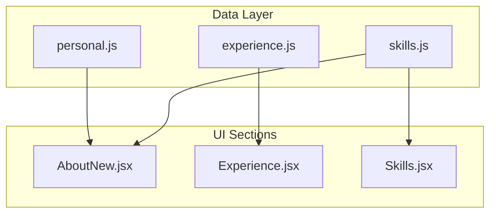
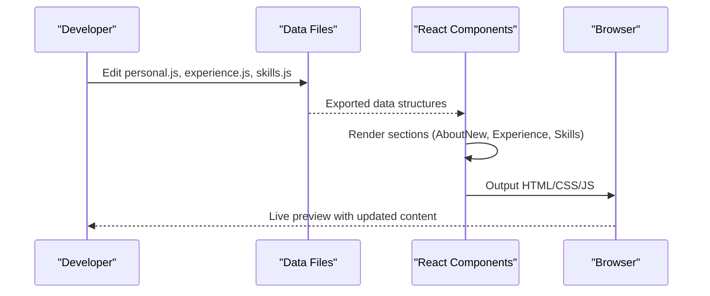
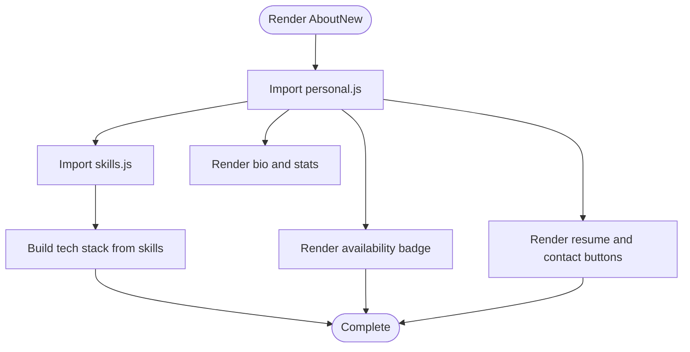
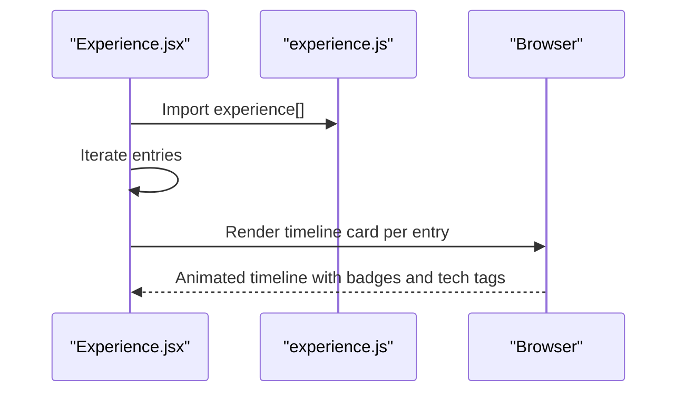
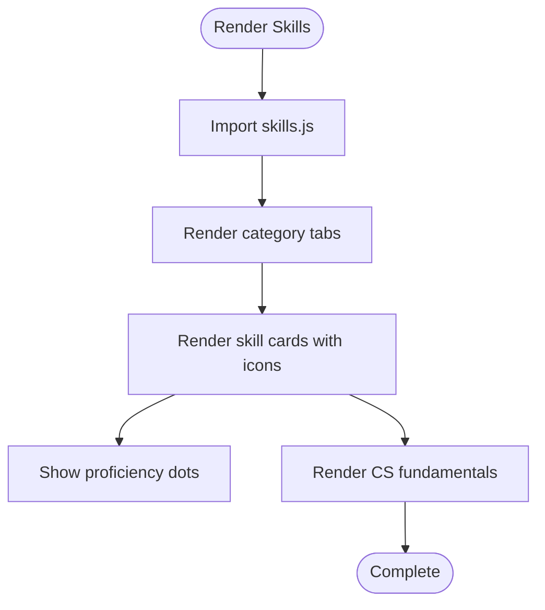
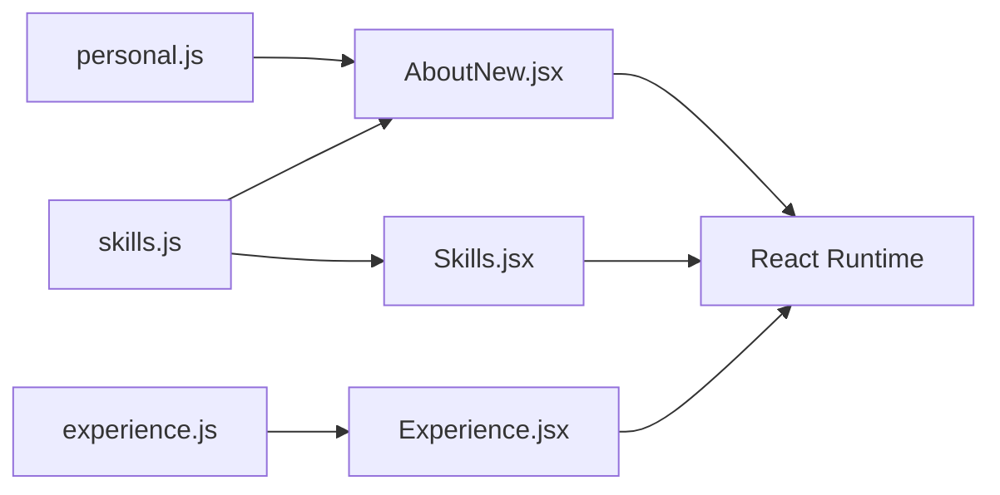

# Content Personalization

<cite>
**Referenced Files in This Document**
- [personal.js](file://src/data/personal.js)
- [experience.js](file://src/data/experience.js)
- [skills.js](file://src/data/skills.js)
- [AboutNew.jsx](file://src/components/sections/AboutNew.jsx)
- [Experience.jsx](file://src/components/sections/Experience.jsx)
- [Skills.jsx](file://src/components/sections/Skills.jsx)
- [SocialIcon.jsx](file://src/components/ui/SocialIcon.jsx)
- [README.md](file://README.md)
</cite>

## Table of Contents
1. [Introduction](#introduction)
2. [Project Structure](#project-structure)
3. [Core Components](#core-components)
4. [Architecture Overview](#architecture-overview)
5. [Detailed Component Analysis](#detailed-component-analysis)
6. [Dependency Analysis](#dependency-analysis)
7. [Performance Considerations](#performance-considerations)
8. [Troubleshooting Guide](#troubleshooting-guide)
9. [Conclusion](#conclusion)

## Introduction
This document explains how to personalize your portfolio by customizing personal information, professional experience, and skills data. It covers the data structures in personal.js, experience.js, and skills.js, including field definitions, data types, and formatting requirements. You will learn how to update profile information, add new work experiences, list technologies, and organize skill categories. The guide also provides examples of common data entry patterns, validation rules, best practices, and troubleshooting tips for formatting and display issues.

## Project Structure
The portfolio uses a straightforward data-driven architecture:
- Data files in src/data define static content (personal, experience, skills).
- React components in src/components consume these data files to render UI sections.
- The AboutNew, Experience, and Skills sections showcase personal information, work history, and technical skills respectively.

**Diagram sources**
- [personal.js](file://src/data/personal.js)
- [experience.js](file://src/data/experience.js)
- [skills.js](file://src/data/skills.js)
- [AboutNew.jsx](file://src/components/sections/AboutNew.jsx)
- [Experience.jsx](file://src/components/sections/Experience.jsx)
- [Skills.jsx](file://src/components/sections/Skills.jsx)

**Section sources**
- [README.md](file://README.md)

## Core Components
This section documents the data structures and their usage across the three key files.

### Personal Information (personal.js)
The personal data object defines your identity, presentation, availability, and social links. It is consumed by AboutNew.jsx and other layout components.

Key fields and types:
- name: string
- firstName: string
- role: string
- tagline: string
- bio: string
- university: string
- year: string
- cgpa: string
- location: string
- availability: string
- availableNow: boolean
- email: string
- resume: string (relative path resolving to public/)
- socials: object
  - github: string (URL)
  - linkedin: string (URL)
  - twitter: string (URL)
  - leetcode: string (URL)
  - devto: string (URL)
- typewriterRoles: array of strings

Formatting and validation requirements:
- All URLs must be valid HTTPS links.
- resume must be a relative path under the public directory.
- availableNow controls visual badges and availability text.
- Typewriter roles are used for animated role display.

Common patterns:
- Keep role and tagline concise and keyword-rich for SEO and readability.
- Use accurate CGPA formatting as a string to preserve precision.
- Ensure socials keys match the SocialIcon component mapping.

**Section sources**
- [personal.js](file://src/data/personal.js)
- [AboutNew.jsx](file://src/components/sections/AboutNew.jsx)
- [SocialIcon.jsx](file://src/components/ui/SocialIcon.jsx)

### Professional Experience (experience.js)
The experience array contains job and project entries. Each entry includes metadata, achievements, and technology tags.

Entry structure:
- id: number
- role: string
- company: string
- badge: string (optional)
- duration: string
- bullets: array of achievement strings
- tech: array of technology names

Formatting and validation requirements:
- Each bullet should be a concise, impact-focused statement.
- Duration should follow a readable format (e.g., "Month Year - Month Year").
- Technology names must match existing skill entries to ensure consistent rendering.

Common patterns:
- Use bullet points to highlight measurable outcomes.
- Align tech tags with skills.js categories for consistency.
- Keep badge text short and meaningful (e.g., "Current", "Active", "Leadership").

**Section sources**
- [experience.js](file://src/data/experience.js)
- [Experience.jsx](file://src/components/sections/Experience.jsx)

### Skills Data (skills.js)
Skills are organized into logical categories. Some categories are arrays of objects with name, icon, and level; others are arrays of strings.

Categories and structures:
- languages: array of objects
  - name: string
  - icon: string (matches Devicon CDN)
  - level: "primary" | "secondary"
- frontend: array of objects
- backend: array of objects
- databases: array of objects
- tools: array of objects
- cs_core: array of strings (core computer science concepts)

Formatting and validation requirements:
- icon values must correspond to Devicon identifiers (e.g., "react", "nodejs").
- level must be "primary" or "secondary".
- For cs_core, list concepts as plain strings.

Common patterns:
- Use primary for technologies you use daily; secondary for familiar but less frequent tools.
- Match tech tags in experience entries with skill names to enable consistent display.

**Section sources**
- [skills.js](file://src/data/skills.js)
- [Skills.jsx](file://src/components/sections/Skills.jsx)

## Architecture Overview
The personalization pipeline connects data files to UI components through imports and props.

**Diagram sources**
- [personal.js](file://src/data/personal.js)
- [experience.js](file://src/data/experience.js)
- [skills.js](file://src/data/skills.js)
- [AboutNew.jsx](file://src/components/sections/AboutNew.jsx)
- [Experience.jsx](file://src/components/sections/Experience.jsx)
- [Skills.jsx](file://src/components/sections/Skills.jsx)

## Detailed Component Analysis

### Personal Information Rendering (AboutNew.jsx)
AboutNew.jsx consumes personal.js to render:
- Bio paragraphs
- Availability badge
- Resume and contact buttons
- Social links
- Tech stack pills derived from skills.js

**Diagram sources**
- [AboutNew.jsx](file://src/components/sections/AboutNew.jsx)
- [personal.js](file://src/data/personal.js)
- [skills.js](file://src/data/skills.js)

**Section sources**
- [AboutNew.jsx](file://src/components/sections/AboutNew.jsx)

### Experience Timeline Rendering (Experience.jsx)
Experience.jsx renders the experience array as an interactive timeline with animated cards.

**Diagram sources**
- [Experience.jsx](file://src/components/sections/Experience.jsx)
- [experience.js](file://src/data/experience.js)

**Section sources**
- [Experience.jsx](file://src/components/sections/Experience.jsx)

### Skills Display and Interaction (Skills.jsx)
Skills.jsx organizes skills into categorized tabs, renders interactive cards with 3D tilt effects, and displays CS fundamentals.

**Diagram sources**
- [Skills.jsx](file://src/components/sections/Skills.jsx)
- [skills.js](file://src/data/skills.js)

**Section sources**
- [Skills.jsx](file://src/components/sections/Skills.jsx)

## Dependency Analysis
The following diagram shows how UI components depend on data files.

**Diagram sources**
- [personal.js](file://src/data/personal.js)
- [experience.js](file://src/data/experience.js)
- [skills.js](file://src/data/skills.js)
- [AboutNew.jsx](file://src/components/sections/AboutNew.jsx)
- [Experience.jsx](file://src/components/sections/Experience.jsx)
- [Skills.jsx](file://src/components/sections/Skills.jsx)

**Section sources**
- [AboutNew.jsx](file://src/components/sections/AboutNew.jsx)
- [Experience.jsx](file://src/components/sections/Experience.jsx)
- [Skills.jsx](file://src/components/sections/Skills.jsx)

## Performance Considerations
- Keep skill icon lists concise to minimize network requests to the Devicon CDN.
- Limit the number of experience entries to maintain smooth timeline rendering.
- Use minimal and focused bullet points to reduce DOM complexity.
- Avoid excessively long strings in personal fields to prevent layout thrashing.

## Troubleshooting Guide

### Data Formatting Issues
- Social links not clickable:
  - Ensure URLs are valid HTTPS links and match socials keys.
  - Confirm SocialIcon.jsx supports the platform key.
- Resume button missing:
  - Verify the resume path resolves under the public directory.
- Availability badge not appearing:
  - availableNow must be true to render the green pulse badge.

**Section sources**
- [personal.js](file://src/data/personal.js)
- [AboutNew.jsx](file://src/components/sections/AboutNew.jsx)
- [SocialIcon.jsx](file://src/components/ui/SocialIcon.jsx)

### Content Display Problems
- Skills not showing:
  - Ensure skill names in experience entries match skills.js entries exactly.
  - Confirm icon identifiers match Devicon names.
- Experience timeline misaligned:
  - Check that each entry has a unique id and valid duration format.
  - Verify bullets and tech arrays are present and non-empty.

**Section sources**
- [skills.js](file://src/data/skills.js)
- [experience.js](file://src/data/experience.js)
- [Skills.jsx](file://src/components/sections/Skills.jsx)
- [Experience.jsx](file://src/components/sections/Experience.jsx)

### Best Practices
- Maintain consistent naming:
  - Use the same technology names across experience.tech and skills.js.
- Keep entries focused:
  - Bullet points should describe outcomes, not responsibilities.
- Update regularly:
  - Rotate out outdated technologies and add new ones.
- Validate links:
  - Test all social and external links before publishing.

[No sources needed since this section provides general guidance]

## Conclusion
By following the data structures and patterns outlined here, you can efficiently personalize your portfolio. Keep your data clean, consistent, and aligned across personal.js, experience.js, and skills.js. Use the provided components as templates for updates, and leverage the troubleshooting tips to resolve common formatting and display issues quickly.