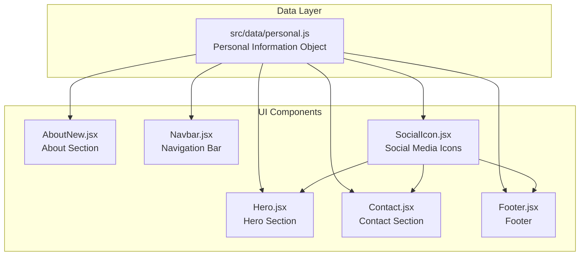
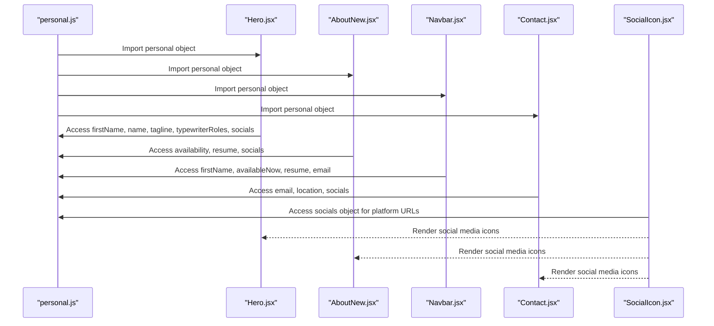
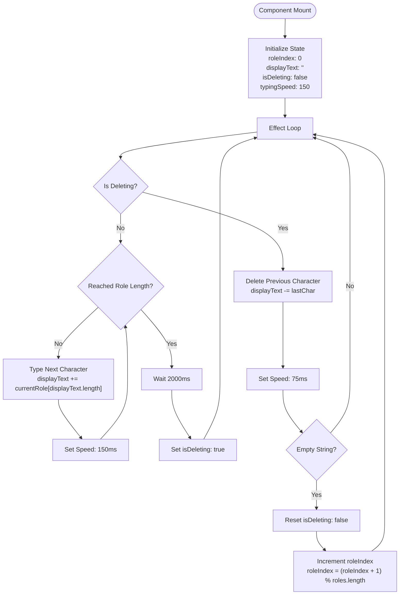
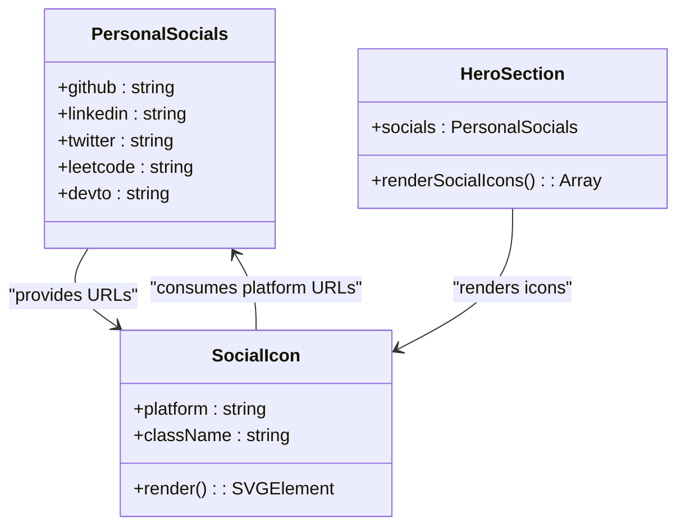
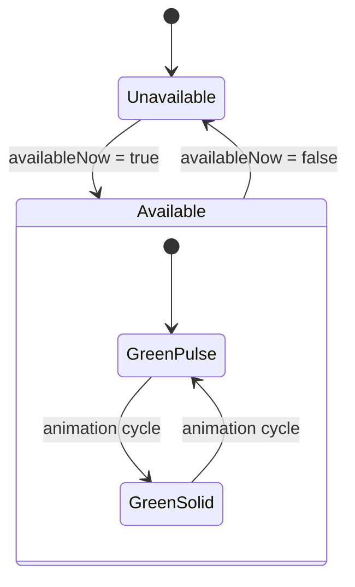
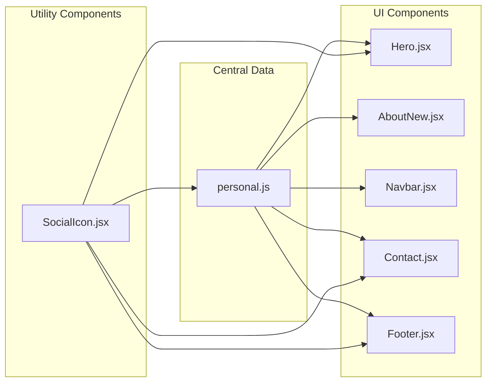

# Personal Information Management

<cite>
**Referenced Files in This Document**
- [personal.js](file://src/data/personal.js)
- [Hero.jsx](file://src/components/sections/Hero.jsx)
- [AboutNew.jsx](file://src/components/sections/AboutNew.jsx)
- [Navbar.jsx](file://src/components/layout/Navbar.jsx)
- [SocialIcon.jsx](file://src/components/ui/SocialIcon.jsx)
- [Footer.jsx](file://src/components/layout/Footer.jsx)
- [Contact.jsx](file://src/components/sections/Contact.jsx)
- [README.md](file://README.md)
</cite>

## Table of Contents
1. [Introduction](#introduction)
2. [Project Structure](#project-structure)
3. [Core Components](#core-components)
4. [Architecture Overview](#architecture-overview)
5. [Detailed Component Analysis](#detailed-component-analysis)
6. [Dependency Analysis](#dependency-analysis)
7. [Performance Considerations](#performance-considerations)
8. [Troubleshooting Guide](#troubleshooting-guide)
9. [Conclusion](#conclusion)

## Introduction
This document provides comprehensive documentation for personal information management in the portfolio. It details the structure and fields in the personal data object, explains how each field is utilized across various components, documents the typewriterRoles array for dynamic role transitions, and describes the social object structure for platform links. Additionally, it offers step-by-step instructions for updating personal details, formatting bio content, configuring availability status, and adding new social media platforms, along with validation rules, character limits, and best practices for maintaining a professional presentation.

## Project Structure
The personal information is centralized in a single data file and consumed by multiple UI components throughout the application. The data file serves as the single source of truth for all personal details, ensuring consistency across the portfolio.

**Diagram sources**
- [personal.js:1-29](file://src/data/personal.js#L1-L29)
- [Hero.jsx:1-229](file://src/components/sections/Hero.jsx#L1-L229)
- [AboutNew.jsx:1-420](file://src/components/sections/AboutNew.jsx#L1-L420)
- [Navbar.jsx:1-255](file://src/components/layout/Navbar.jsx#L1-L255)
- [SocialIcon.jsx:1-32](file://src/components/ui/SocialIcon.jsx#L1-L32)

**Section sources**
- [personal.js:1-29](file://src/data/personal.js#L1-L29)
- [README.md:61-69](file://README.md#L61-L69)

## Core Components
The personal information system consists of a central data object containing all profile details and several UI components that render this information. The data object follows a structured format with clearly defined fields and nested objects for social media links.

### Personal Data Object Structure
The personal object contains the following primary fields:

- **name**: Full legal name for identification
- **firstName**: First name for casual greeting
- **role**: Current professional role/title
- **tagline**: Professional tagline or headline
- **bio**: Detailed biographical information
- **university**: Educational institution
- **year**: Academic year/standing
- **cgpa**: Academic grade point average
- **location**: Geographic location
- **availability**: Availability status text
- **availableNow**: Boolean flag for real-time availability
- **email**: Professional contact email
- **resume**: Resume file path
- **socials**: Object containing social media platform URLs
- **typewriterRoles**: Array for dynamic role transitions

**Section sources**
- [personal.js:1-29](file://src/data/personal.js#L1-L29)

## Architecture Overview
The personal information architecture follows a unidirectional data flow pattern where the central data object is imported and consumed by various components. Each component accesses specific fields based on its rendering requirements.

**Diagram sources**
- [personal.js:1-29](file://src/data/personal.js#L1-L29)
- [Hero.jsx:1-229](file://src/components/sections/Hero.jsx#L1-L229)
- [AboutNew.jsx:1-420](file://src/components/sections/AboutNew.jsx#L1-L420)
- [Navbar.jsx:1-255](file://src/components/layout/Navbar.jsx#L1-L255)
- [Contact.jsx:1-200](file://src/components/sections/Contact.jsx#L1-L200)
- [SocialIcon.jsx:1-32](file://src/components/ui/SocialIcon.jsx#L1-L32)

## Detailed Component Analysis

### Personal Data Object Fields
The personal data object contains comprehensive information organized into logical categories:

#### Basic Identity Information
- **name** (string): Complete legal name used for formal identification
- **firstName** (string): First name used for casual greetings and branding
- **role** (string): Current professional title or position
- **tagline** (string): Professional headline or value proposition

#### Academic Information
- **university** (string): Educational institution name
- **year** (string): Academic standing or year level
- **cgpa** (string): Grade point average (stored as string for consistent formatting)

#### Professional Information
- **location** (string): Geographic location for contact and availability
- **availability** (string): Text describing current availability status
- **availableNow** (boolean): Real-time availability indicator
- **email** (string): Professional email address
- **resume** (string): Path to resume file in public directory

#### Social Media Integration
- **socials** (object): Platform-specific URLs organized by platform name
  - **github**: GitHub profile URL
  - **linkedin**: LinkedIn profile URL
  - **twitter**: Twitter/X profile URL
  - **leetcode**: LeetCode profile URL
  - **devto**: DEV Community profile URL

#### Dynamic Content Features
- **typewriterRoles** (array): Array of role strings for animated typing effect

**Section sources**
- [personal.js:1-29](file://src/data/personal.js#L1-L29)

### Hero Section Integration
The Hero component utilizes multiple personal fields to create a compelling first impression:

#### Typewriter Animation Implementation
The Hero component implements a sophisticated typewriter effect using the `typewriterRoles` array:

**Diagram sources**
- [Hero.jsx:13-39](file://src/components/sections/Hero.jsx#L13-L39)

#### Social Media Integration
The Hero component dynamically renders social media icons using the personal socials object:

**Diagram sources**
- [Hero.jsx:182-202](file://src/components/sections/Hero.jsx#L182-L202)
- [SocialIcon.jsx:1-32](file://src/components/ui/SocialIcon.jsx#L1-L32)

**Section sources**
- [Hero.jsx:1-229](file://src/components/sections/Hero.jsx#L1-L229)
- [SocialIcon.jsx:1-32](file://src/components/ui/SocialIcon.jsx#L1-L32)

### About Section Integration
The About section consumes personal information for comprehensive profile presentation:

#### Availability Badge Implementation
The About section displays real-time availability status using the `availableNow` boolean flag:

**Diagram sources**
- [AboutNew.jsx:336-362](file://src/components/sections/AboutNew.jsx#L336-L362)

#### Resume Integration
The About section provides direct access to the resume through the personal resume field, enabling seamless downloading functionality.

**Section sources**
- [AboutNew.jsx:335-417](file://src/components/sections/AboutNew.jsx#L335-L417)

### Navigation Bar Integration
The Navbar component integrates personal information for branding and accessibility:

#### Real-Time Availability Indicator
The Navbar displays a live availability indicator using the `availableNow` boolean flag, with animated pulsing circles for visual emphasis.

#### Branding Elements
The Navbar uses `firstName` for the logo/brand element, creating a personalized brand identity.

**Section sources**
- [Navbar.jsx:52-78](file://src/components/layout/Navbar.jsx#L52-L78)
- [Navbar.jsx:113-133](file://src/components/layout/Navbar.jsx#L113-L133)

### Contact Section Integration
The Contact section leverages personal information for comprehensive contact options:

#### Contact Methods Array
The Contact section defines contact methods using personal information:
- Email contact using `personal.email`
- Location display using `personal.location`
- LinkedIn connection using `personal.socials.linkedin`

**Section sources**
- [Contact.jsx:93-121](file://src/components/sections/Contact.jsx#L93-L121)

### Footer Integration
The Footer component utilizes personal information for attribution and social connections:

#### Social Media Footer Links
The Footer renders social media links using the personal socials object, providing consistent external link access.

**Section sources**
- [Footer.jsx:15-50](file://src/components/layout/Footer.jsx#L15-L50)

## Dependency Analysis
The personal information system demonstrates excellent separation of concerns with clear data-to-component relationships:

**Diagram sources**
- [personal.js:1-29](file://src/data/personal.js#L1-L29)
- [Hero.jsx:1-229](file://src/components/sections/Hero.jsx#L1-L229)
- [AboutNew.jsx:1-420](file://src/components/sections/AboutNew.jsx#L1-L420)
- [Navbar.jsx:1-255](file://src/components/layout/Navbar.jsx#L1-L255)
- [Contact.jsx:1-200](file://src/components/sections/Contact.jsx#L1-L200)
- [Footer.jsx:1-60](file://src/components/layout/Footer.jsx#L1-L60)
- [SocialIcon.jsx:1-32](file://src/components/ui/SocialIcon.jsx#L1-L32)

### Component Coupling Analysis
- **Low Coupling**: Each component imports only the specific fields it needs
- **Single Responsibility**: Components focus on presentation, not data management
- **Consistent Interface**: All components consume the same data structure
- **Maintainable Dependencies**: Clear import relationships enable easy updates

**Section sources**
- [personal.js:1-29](file://src/data/personal.js#L1-L29)

## Performance Considerations
The personal information system is designed for optimal performance:

### Memory Efficiency
- **Single Source of Truth**: Centralized data reduces memory duplication
- **Minimal Imports**: Components import only required fields
- **Static Data**: Personal information is static, avoiding unnecessary re-renders

### Rendering Performance
- **Efficient Updates**: Changes propagate automatically to all consumers
- **Optimized Social Icons**: Icon component uses efficient SVG rendering
- **Conditional Rendering**: Availability indicators use conditional display logic

### Bundle Impact
- **Minimal Overhead**: Personal data adds negligible bundle size
- **Tree Shaking**: Unused fields don't impact bundle size
- **Static Assets**: Resume and image assets load independently

## Troubleshooting Guide

### Common Issues and Solutions

#### Social Media Links Not Displaying
**Symptoms**: Social media icons appear as fallback circles
**Causes**: 
- Missing platform entries in socials object
- Incorrect platform names
- Invalid URLs

**Solutions**:
1. Verify platform names match existing social object keys
2. Ensure URLs are properly formatted with protocol prefixes
3. Check that platform names are consistent across all components

#### Typewriter Animation Issues
**Symptoms**: Role text doesn't change or animation stutters
**Causes**:
- Empty or missing typewriterRoles array
- Incorrect array structure
- State management conflicts

**Solutions**:
1. Ensure typewriterRoles contains at least one role string
2. Verify array contains only strings
3. Check for proper state initialization

#### Availability Badge Problems
**Symptoms**: Availability indicator not showing or incorrect state
**Causes**:
- availableNow boolean not properly set
- CSS styling conflicts
- Component mounting issues

**Solutions**:
1. Verify availableNow is set to boolean value
2. Check CSS class names and styling
3. Ensure component mounts after data loading

#### Email Contact Issues
**Symptoms**: Email links not functional or contact form errors
**Causes**:
- Invalid email format
- Contact form not configured
- Missing EmailJS setup

**Solutions**:
1. Validate email format using standard email validation
2. Configure EmailJS service and templates
3. Test contact form functionality

**Section sources**
- [Hero.jsx:15-39](file://src/components/sections/Hero.jsx#L15-L39)
- [AboutNew.jsx:336-362](file://src/components/sections/AboutNew.jsx#L336-L362)
- [Contact.jsx:93-121](file://src/components/sections/Contact.jsx#L93-L121)

## Conclusion
The personal information management system provides a robust, maintainable foundation for portfolio customization. Its centralized approach ensures consistency across all components while maintaining flexibility for updates. The clear separation of data and presentation enables easy modifications without affecting other parts of the application. The system's design supports professional presentation standards while remaining accessible to developers of varying skill levels.

Key strengths include:
- **Centralized Data Management**: Single source of truth for all personal information
- **Component-Based Architecture**: Clear separation of concerns and maintainable code
- **Dynamic Content Features**: Typewriter animations and real-time availability indicators
- **Extensible Social Media Integration**: Easy addition of new platforms
- **Professional Presentation Standards**: Consistent formatting and accessibility considerations

The system provides an excellent foundation for portfolio customization while maintaining technical excellence and user experience quality.