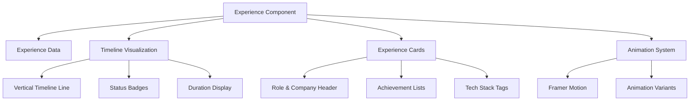
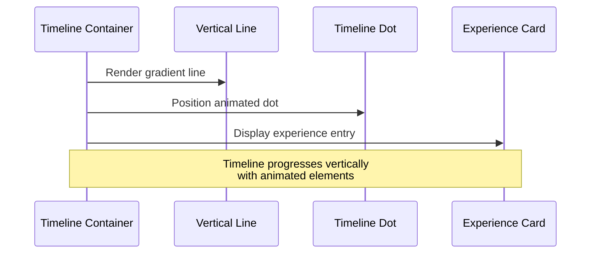
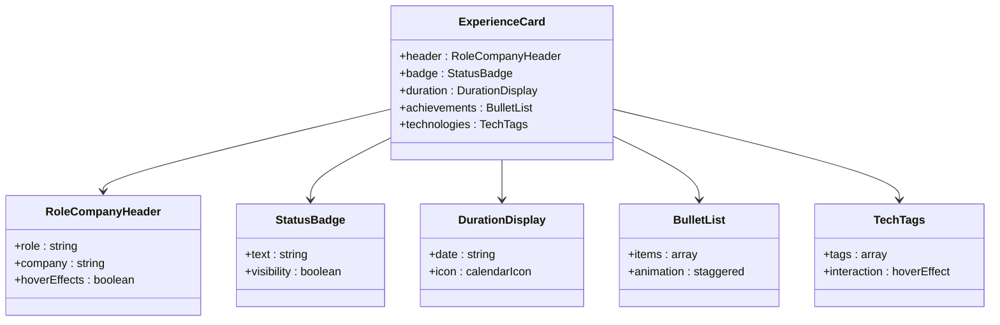
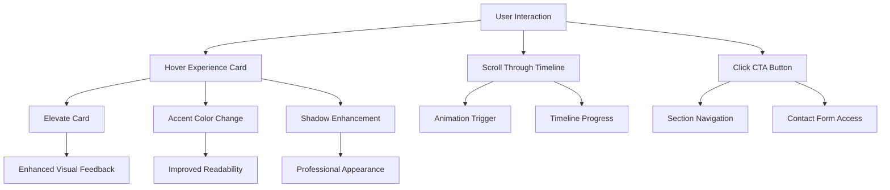

# Professional Experience Configuration

<cite>
**Referenced Files in This Document**
- [experience.js](file://src/data/experience.js)
- [Experience.jsx](file://src/components/sections/Experience.jsx)
- [framerVariants.js](file://src/utils/framerVariants.js)
- [README.md](file://README.md)
- [README-IMAGES.md](file://README-IMAGES.md)
</cite>

## Table of Contents
1. [Introduction](#introduction)
2. [Experience Data Structure](#experience-data-structure)
3. [Experience Component Architecture](#experience-component-architecture)
4. [Timeline Display Implementation](#timeline-display-implementation)
5. [Card Layout and Styling](#card-layout-and-styling)
6. [Interactive Elements](#interactive-elements)
7. [Formatting Guidelines](#formatting-guidelines)
8. [Experience Types and Examples](#experience-types-and-examples)
9. [Best Practices](#best-practices)
10. [Troubleshooting Guide](#troubleshooting-guide)
11. [Conclusion](#conclusion)

## Introduction

The professional experience section of this portfolio website is designed to showcase work history, internships, and technical contributions in an engaging timeline format. The implementation combines structured data management with sophisticated animations to create an immersive user experience that highlights professional growth and responsibilities.

This documentation provides comprehensive guidance for configuring experience data, understanding the component architecture, and implementing best practices for presenting professional milestones effectively.

## Experience Data Structure

The experience data is managed through a centralized JavaScript module that defines the structure and format for all professional experience entries.

### Core Data Fields

Each experience entry follows a standardized structure with the following essential fields:

```javascript
{
  id: number,           // Unique identifier for the experience entry
  role: string,         // Job title or position held
  company: string,      // Organization or company name
  badge: string,        // Status indicator (Current, Active, Leadership)
  duration: string,     // Time period (e.g., "Jan 2023 - Present")
  bullets: array,       // Achievement bullet points
  tech: array          // Technologies used
}
```

### Data Validation Requirements

The experience data structure enforces several validation rules:

- **Unique IDs**: Each experience entry requires a unique numeric identifier
- **Required Fields**: Role, company, and duration are mandatory
- **Bullet Points**: Achievements should be formatted as concise, action-oriented statements
- **Technology Tags**: Tech stack entries should reflect actual technologies used

**Section sources**
- [experience.js:1-43](file://src/data/experience.js#L1-L43)

## Experience Component Architecture

The Experience component serves as the presentation layer for professional experience data, implementing a sophisticated timeline interface with advanced animations and responsive design.

### Component Structure



**Diagram sources**
- [Experience.jsx:14-168](file://src/components/sections/Experience.jsx#L14-L168)
- [framerVariants.js:1-17](file://src/utils/framerVariants.js#L1-L17)

### Animation System Integration

The component leverages Framer Motion for sophisticated entrance animations and scroll-triggered effects:

- **Container Variants**: Staggered entrance animations for the entire timeline
- **Item Variants**: Individual card animations with spring physics
- **Timeline Animation**: Vertical line drawing effect during scroll
- **Interactive Hover Effects**: Smooth transitions and elevation changes

**Section sources**
- [Experience.jsx:1-168](file://src/components/sections/Experience.jsx#L1-L168)
- [framerVariants.js:1-17](file://src/utils/framerVariants.js#L1-L17)

## Timeline Display Implementation

The timeline visualization creates a chronological narrative of professional experience through visual storytelling techniques.

### Timeline Elements



**Diagram sources**
- [Experience.jsx:46-52](file://src/components/sections/Experience.jsx#L46-L52)
- [Experience.jsx:61-69](file://src/components/sections/Experience.jsx#L61-L69)

### Visual Timeline Features

- **Gradient Timeline Line**: Creates depth and visual continuity
- **Animated Timeline Dot**: Spring-loaded entrance with pulse animation
- **Positioning System**: Responsive placement for desktop and mobile
- **Z-index Layering**: Proper stacking order for visual hierarchy

**Section sources**
- [Experience.jsx:46-128](file://src/components/sections/Experience.jsx#L46-L128)

## Card Layout and Styling

Each experience entry is presented within a premium glass-morphism card that balances aesthetics with readability.

### Card Structure Components



**Diagram sources**
- [Experience.jsx:71-124](file://src/components/sections/Experience.jsx#L71-L124)

### Styling Features

- **Glass Morphism**: Premium translucent background with blur effect
- **Hover Interactions**: Subtle elevation and shadow enhancements
- **Responsive Typography**: Adaptive text sizing for different screen sizes
- **Color Scheme Integration**: Consistent with portfolio theme system

**Section sources**
- [Experience.jsx:71-124](file://src/components/sections/Experience.jsx#L71-L124)

## Interactive Elements

The experience section incorporates multiple interactive features designed to enhance user engagement and provide intuitive navigation.

### Interactive Components



**Diagram sources**
- [Experience.jsx:14-168](file://src/components/sections/Experience.jsx#L14-L168)

### Interactive Features

- **Card Hover Effects**: Smooth elevation and shadow transitions
- **Text Color Transitions**: Dynamic accent color changes on hover
- **Spring Animation**: Animated timeline dot with bounce effect
- **CTA Button**: Contact section navigation with arrow animation

**Section sources**
- [Experience.jsx:61-69](file://src/components/sections/Experience.jsx#L61-L69)
- [Experience.jsx:143-159](file://src/components/sections/Experience.jsx#L143-L159)

## Formatting Guidelines

Proper formatting ensures consistency and professionalism across all experience entries while maintaining optimal readability.

### Work History Entry Format

#### Basic Structure Requirements

- **Chronological Order**: Entries should be listed in reverse chronological order
- **Consistent Spacing**: Maintain adequate spacing between timeline elements
- **Alignment**: All cards should align along the central timeline axis
- **Visual Hierarchy**: Clear distinction between role, company, and duration elements

#### Achievement Bullet Point Guidelines

Achievement bullet points should follow these formatting principles:

- **Action Verbs**: Begin with strong action verbs (engineered, developed, led)
- **Quantifiable Results**: Include specific metrics and measurable outcomes
- **Concise Language**: Keep sentences brief and focused
- **Professional Tone**: Maintain formal, confident language

#### Technology Tag Formatting

- **Relevance**: Only include technologies directly used in the role
- **Accuracy**: Match official technology names and spelling
- **Consistency**: Use consistent capitalization and formatting
- **Brevity**: Keep tag names concise and recognizable

**Section sources**
- [experience.js:8-12](file://src/data/experience.js#L8-L12)
- [experience.js:21-25](file://src/data/experience.js#L21-L25)

## Experience Types and Examples

The portfolio accommodates various professional experience formats, each requiring specific formatting approaches to maximize impact.

### Internship Experience

Internship entries should emphasize learning, growth, and contribution to team objectives:

```javascript
// Example internship structure
{
  id: 1,
  role: "Software Engineering Intern",
  company: "Tech Startup Inc.",
  badge: "Current",
  duration: "Summer 2024 - Present",
  bullets: [
    "Developed responsive web applications using React and Node.js",
    "Collaborated with senior developers on feature implementation",
    "Participated in daily stand-ups and sprint planning meetings"
  ],
  tech: ["React", "Node.js", "MongoDB", "Git"]
}
```

### Full-Time Employment

Full-time positions require emphasis on responsibilities, achievements, and leadership:

```javascript
// Example full-time position structure
{
  id: 2,
  role: "Senior Software Developer",
  company: "Enterprise Solutions Ltd.",
  badge: "Leadership",
  duration: "Jan 2023 - Present",
  bullets: [
    "Led team of 5 developers in agile environment",
    "Architected microservices using cloud-native technologies",
    "Implemented CI/CD pipeline reducing deployment time by 60%"
  ],
  tech: ["AWS", "Docker", "Kubernetes", "Go", "PostgreSQL"]
}
```

### Freelance and Contract Work

Freelance projects should highlight independence, client satisfaction, and diverse skill application:

```javascript
// Example freelance project structure
{
  id: 3,
  role: "Freelance Web Developer",
  company: "Independent Contractor",
  badge: "Active",
  duration: "Mar 2022 - Present",
  bullets: [
    "Delivered 8 client websites within tight deadlines",
    "Implemented responsive designs for mobile-first accessibility",
    "Optimized client websites achieving 95+ Google PageSpeed scores"
  ],
  tech: ["Next.js", "Tailwind CSS", "Framer Motion", "Sanity CMS"]
}
```

### Open Source Contributions

Open source contributions require emphasis on community impact and collaborative development:

```javascript
// Example open source contribution structure
{
  id: 4,
  role: "Core Contributor",
  company: "React Community",
  badge: "Active",
  duration: "Jan 2023 - Present",
  bullets: [
    "Contributed to React documentation improvements",
    "Reviewed pull requests from community contributors",
    "Maintained testing infrastructure for component libraries"
  ],
  tech: ["React", "TypeScript", "Jest", "GitHub Actions"]
}
```

**Section sources**
- [experience.js:1-43](file://src/data/experience.js#L1-L43)

## Best Practices

Effective presentation of professional experience requires strategic formatting, meaningful content selection, and thoughtful visual design.

### Content Selection Strategies

- **Quality Over Quantity**: Focus on 3-5 significant achievements per role
- **Impact Focus**: Emphasize measurable results and quantifiable outcomes
- **Relevance Priority**: Highlight experiences most relevant to target positions
- **Progressive Growth**: Showcase career advancement and skill development

### Visual Presentation Guidelines

- **Consistent Iconography**: Use checkmark icons for bullet points consistently
- **Typography Hierarchy**: Maintain clear visual hierarchy between role and company
- **Color Consistency**: Apply accent colors sparingly for emphasis
- **Spacing Balance**: Ensure adequate whitespace for readability

### Technical Implementation Tips

- **Performance Optimization**: Keep animation durations reasonable for accessibility
- **Mobile Responsiveness**: Test timeline alignment across different screen sizes
- **Accessibility Compliance**: Maintain sufficient color contrast and focus states
- **Cross-Browser Compatibility**: Verify timeline animation across different browsers

**Section sources**
- [Experience.jsx:31-44](file://src/components/sections/Experience.jsx#L31-L44)
- [Experience.jsx:96-111](file://src/components/sections/Experience.jsx#L96-L111)

## Troubleshooting Guide

Common issues and solutions for experience data configuration and component rendering.

### Data Structure Issues

**Problem**: Experience entries not displaying
- **Solution**: Verify all required fields (id, role, company, duration) are present
- **Check**: Ensure unique numeric IDs for each entry
- **Validation**: Confirm array syntax is correct with proper commas

**Problem**: Timeline not animating
- **Solution**: Verify Framer Motion is properly installed and configured
- **Check**: Ensure useInView hook has proper intersection observer setup
- **Debug**: Test animation variants in isolation

### Styling and Layout Problems

**Problem**: Cards misaligned on mobile devices
- **Solution**: Adjust responsive breakpoint values in Tailwind classes
- **Check**: Verify flexbox properties for mobile layouts
- **Test**: Validate on multiple device sizes and orientations

**Problem**: Hover effects not working
- **Solution**: Ensure CSS hover pseudo-classes are properly defined
- **Check**: Verify z-index stacking order for interactive elements
- **Debug**: Test with reduced motion preferences enabled

### Performance Considerations

**Problem**: Slow page loading with many experience entries
- **Solution**: Implement virtual scrolling for large datasets
- **Optimization**: Lazy load experience data if necessary
- **Bundle Size**: Minimize animation complexity for better performance

**Section sources**
- [Experience.jsx:14-168](file://src/components/sections/Experience.jsx#L14-L168)
- [framerVariants.js:1-17](file://src/utils/framerVariants.js#L1-L17)

## Conclusion

The professional experience configuration system provides a robust framework for showcasing career progression and achievements through structured data management and sophisticated visual presentation. By following the guidelines outlined in this documentation, users can effectively configure their experience data to create compelling narratives that highlight professional growth, technical expertise, and measurable accomplishments.

The combination of flexible data structures, responsive design, and engaging animations ensures that professional experience content remains accessible, visually appealing, and technically sound across all platforms and devices. Regular updates to experience data will keep the portfolio current and reflective of evolving career milestones.