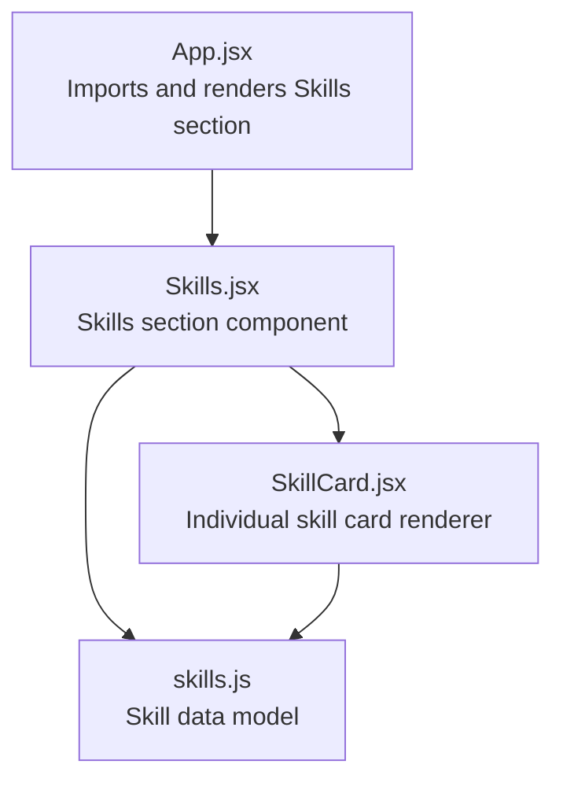
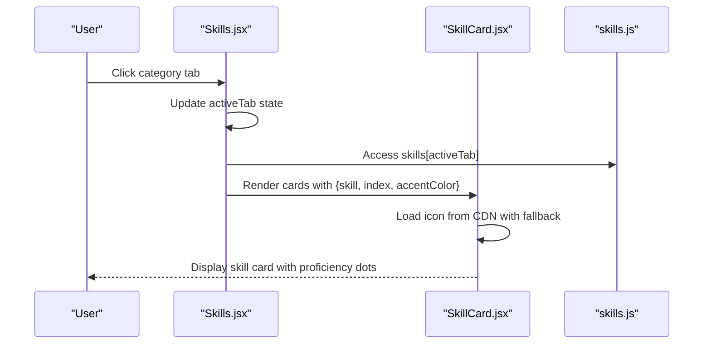
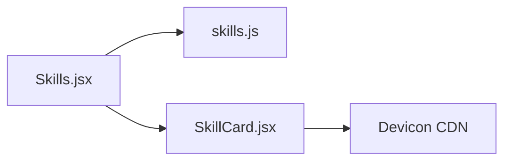

# Skills and Technologies

<cite>
**Referenced Files in This Document**
- [skills.js](file://src/data/skills.js)
- [Skills.jsx](file://src/components/sections/Skills.jsx)
- [SkillCard.jsx](file://src/components/ui/SkillCard.jsx)
- [App.jsx](file://src/App.jsx)
- [index.js](file://src/components/ui/index.js)
</cite>

## Table of Contents
1. [Introduction](#introduction)
2. [Project Structure](#project-structure)
3. [Core Components](#core-components)
4. [Architecture Overview](#architecture-overview)
5. [Detailed Component Analysis](#detailed-component-analysis)
6. [Dependency Analysis](#dependency-analysis)
7. [Performance Considerations](#performance-considerations)
8. [Troubleshooting Guide](#troubleshooting-guide)
9. [Conclusion](#conclusion)
10. [Appendices](#appendices)

## Introduction
This document explains how skills and technologies are structured, categorized, and rendered in the portfolio. It covers the data model in skills.js, the interactive display logic in Skills.jsx, and the visual presentation of individual skills via SkillCard.jsx. It also provides best practices for organizing technologies by category, maintaining proficiency indicators, adding new programming languages and frameworks, and balancing breadth versus depth of skill representation.

## Project Structure
Skills-related functionality spans three main areas:
- Data definition: skills.js defines categories and technology entries
- UI composition: Skills.jsx orchestrates category tabs, filtering, and rendering
- Visual presentation: SkillCard.jsx renders individual skill entries with icons and proficiency dots

**Diagram sources**
- [App.jsx:9](file://src/App.jsx#L9)
- [Skills.jsx:1-410](file://src/components/sections/Skills.jsx#L1-L410)
- [SkillCard.jsx:1-124](file://src/components/ui/SkillCard.jsx#L1-L124)
- [skills.js:1-39](file://src/data/skills.js#L1-L39)

**Section sources**
- [App.jsx:9](file://src/App.jsx#L9)
- [Skills.jsx:167-407](file://src/components/sections/Skills.jsx#L167-L407)
- [SkillCard.jsx:4-121](file://src/components/ui/SkillCard.jsx#L4-L121)
- [skills.js:1-39](file://src/data/skills.js#L1-L39)

## Core Components
- skills.js: Central data store containing category arrays and core computer science concepts
- Skills.jsx: Interactive skills section with category tabs, animated card grid, and proficiency legend
- SkillCard.jsx: Individual skill card with 3D hover effect, dynamic icon loading, and proficiency dots

Key responsibilities:
- skills.js: Define categories (languages, frontend, backend, databases, tools) and core CS topics
- Skills.jsx: Manage active category state, compute totals, render category tabs, and animate card grids
- SkillCard.jsx: Render icons from a CDN, handle fallbacks, show proficiency via dot indicators, and apply hover effects

**Section sources**
- [skills.js:1-39](file://src/data/skills.js#L1-L39)
- [Skills.jsx:167-407](file://src/components/sections/Skills.jsx#L167-L407)
- [SkillCard.jsx:4-121](file://src/components/ui/SkillCard.jsx#L4-L121)

## Architecture Overview
The skills system follows a unidirectional data flow:
- Data source (skills.js) feeds the Skills section component
- Skills.jsx manages UI state (active category) and passes props to SkillCard.jsx
- SkillCard.jsx renders individual entries with icons and proficiency indicators

**Diagram sources**
- [Skills.jsx:170-331](file://src/components/sections/Skills.jsx#L170-L331)
- [SkillCard.jsx:74-84](file://src/components/ui/SkillCard.jsx#L74-L84)
- [skills.js:1-39](file://src/data/skills.js#L1-L39)

## Detailed Component Analysis

### Data Model: skills.js
Structure:
- Top-level keys represent categories (e.g., languages, frontend, backend, databases, tools)
- Each category is an array of objects with:
  - name: Technology or framework name
  - icon: Devicon identifier used to fetch SVG from CDN
  - level: Proficiency level ("primary" or "secondary")
- cs_core: Array of core computer science concepts

Proficiency levels:
- primary: Fully proficient; represented by three filled dots
- secondary: Intermediate proficiency; represented by two filled dots

Icon references:
- Each skill object includes an icon field that maps to devicon identifiers
- SkillCard.jsx loads icons from a CDN and falls back to plain variants when original fails

Best practices for data maintenance:
- Keep category names consistent with the Tabs configuration in Skills.jsx
- Use lowercase kebab-case for icon identifiers to match devicon conventions
- Prefer "primary" for technologies actively used in current projects; reserve "secondary" for exposure or less frequent use

**Section sources**
- [skills.js:1-39](file://src/data/skills.js#L1-L39)

### UI Composition: Skills.jsx
Responsibilities:
- Define category metadata (keys, labels, colors, icons) for tabs
- Track active category and compute total skills across all categories
- Render animated category tabs and a card grid for the active category
- Provide a proficiency legend for quick visual reference
- Render a separate section for core CS concepts

Filtering and organization:
- Filtering occurs implicitly by selecting the active category from CATEGORIES
- The card grid displays only the current category’s skills
- Total skill count badge aggregates counts across all categories

Interactive elements:
- Category tabs switch the active category and trigger animated card re-render
- Cards animate in with staggered delays for a polished entrance

Accessibility:
- Tabs use role attributes and aria-label for assistive technologies
- Visual focus states and hover feedback are provided

**Section sources**
- [Skills.jsx:9-66](file://src/components/sections/Skills.jsx#L9-L66)
- [Skills.jsx:167-407](file://src/components/sections/Skills.jsx#L167-L407)

### Visual Presentation: SkillCard.jsx
Rendering pipeline:
- Loads an icon from the devicon CDN using the skill.icon identifier
- Falls back to a plain variant if the original fails to load
- Renders the skill name and proficiency dots based on level
- Applies 3D hover effects with spring physics and gradient glows

Proficiency visualization:
- Primary level: Three filled dots
- Secondary level: Two filled dots with a shorter third dot

Dynamic styling:
- Uses accentColor passed from the parent to unify visual theme with the active category
- Applies subtle shadows and borders that adapt to light/dark mode via CSS variables

**Section sources**
- [SkillCard.jsx:4-121](file://src/components/ui/SkillCard.jsx#L4-L121)

### Integration Point: App.jsx
Skills is integrated as a standalone section within the main application layout. It receives no props from App.jsx and manages its own state internally.

**Section sources**
- [App.jsx:9](file://src/App.jsx#L9)

## Dependency Analysis
Skills.jsx depends on:
- skills.js for data
- SkillCard.jsx for rendering individual entries
- Framer Motion for animations and transitions

SkillCard.jsx depends on:
- Framer Motion for hover physics and animations
- External CDN for icons (devicons)

**Diagram sources**
- [Skills.jsx:3-4](file://src/components/sections/Skills.jsx#L3-L4)
- [SkillCard.jsx:74-84](file://src/components/ui/SkillCard.jsx#L74-L84)
- [skills.js:1-39](file://src/data/skills.js#L1-L39)

**Section sources**
- [Skills.jsx:1-4](file://src/components/sections/Skills.jsx#L1-L4)
- [SkillCard.jsx:1-2](file://src/components/ui/SkillCard.jsx#L1-L2)

## Performance Considerations
- Memoization: Skills.jsx uses useMemo for particle configurations to avoid unnecessary recalculations during renders.
- Animations: Staggered entrance animations are delayed per card index; keep the number of cards reasonable to prevent jank.
- Icon loading: SkillCard.jsx attempts to load original icons first, then falls back to plain variants. Network latency can impact perceived performance; consider lazy-loading or caching strategies if needed.
- Grid responsiveness: The card grid adapts across breakpoints; ensure category arrays remain balanced to avoid empty cells on smaller screens.

## Troubleshooting Guide
Common issues and resolutions:
- Missing or broken icons:
  - Verify the skill.icon value matches a devicon identifier
  - Confirm the CDN endpoint is reachable; fallback logic switches to plain variants automatically
- Incorrect proficiency display:
  - Ensure level is either "primary" or "secondary"
  - Confirm the dot rendering logic aligns with the intended visual outcome
- Category tab mismatch:
  - Ensure the category key in skills.js matches the key used in the Tabs configuration
  - Verify the activeTab state updates correctly when switching tabs
- Animation glitches:
  - Reduce the number of cards temporarily to isolate performance bottlenecks
  - Check for excessive DOM updates during tab switches

**Section sources**
- [SkillCard.jsx:74-84](file://src/components/ui/SkillCard.jsx#L74-L84)
- [Skills.jsx:170-331](file://src/components/sections/Skills.jsx#L170-L331)

## Conclusion
The skills system combines a clean, category-based data model with an interactive, visually engaging UI. By structuring technologies into logical categories, using consistent proficiency indicators, and leveraging dynamic icon loading, the portfolio presents a comprehensive yet digestible view of technical capabilities. Following the best practices outlined here ensures maintainability and scalability as new technologies are added.

## Appendices

### Best Practices for Categorizing Technologies
- Group by functional area: languages, frontend, backend, databases, tools
- Keep categories meaningful and distinct; avoid overly granular subdivisions
- Align category keys with the Tabs configuration to prevent runtime errors

### Maintaining Proficiency Indicators
- Use "primary" for technologies actively used in current or recent projects
- Use "secondary" for technologies with exposure or occasional use
- Keep the dot rendering logic consistent across components

### Adding New Programming Languages and Frameworks
- Add a new entry to the appropriate category array in skills.js
- Ensure the icon identifier matches a devicon resource
- Consider whether the technology warrants a new category or fits existing ones

### Organizing Skills by Relevance and Experience
- Prioritize technologies that align with target roles or projects
- Reflect recent experience by moving frequently used technologies earlier in the list
- Balance breadth (exposure to diverse tools) with depth (mastery in key technologies)

### Technology Icon Usage Guidelines
- Use devicon identifiers consistently
- Prefer original variants when available; rely on fallbacks for plain variants
- Keep icon alt text descriptive and concise

### Updating Skill Descriptions
- Keep names concise and recognizable
- Avoid vague descriptors; emphasize practical usage or domain relevance
- Maintain consistency in naming conventions across categories

### Balancing Breadth versus Depth
- Include a mix of foundational languages and specialized frameworks
- Emphasize technologies most relevant to the target audience
- Regularly reassess and prune outdated or rarely used technologies