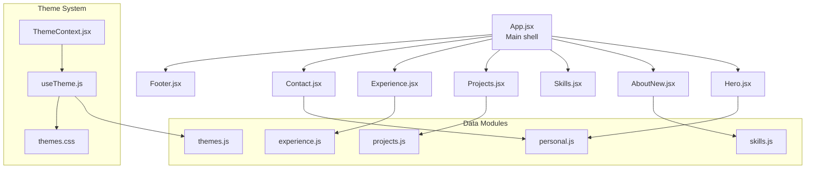
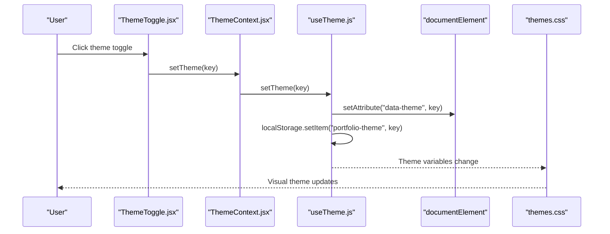
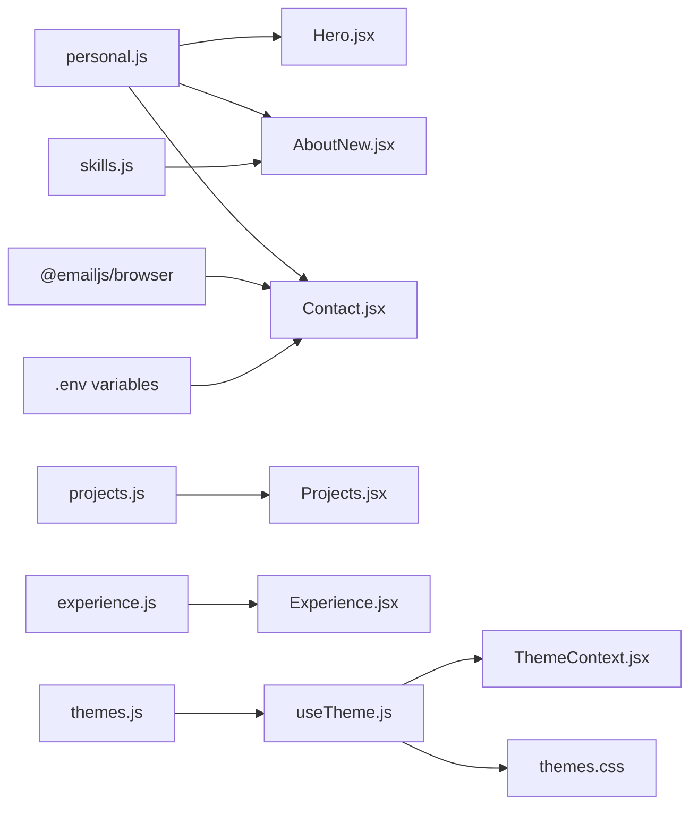

# Customization Guide

<cite>
**Referenced Files in This Document**
- [README.md](file://README.md)
- [README-IMAGES.md](file://README-IMAGES.md)
- [HOW-TO-ADD-IMAGES.md](file://HOW-TO-ADD-IMAGES.md)
- [public/images/README.md](file://public/images/README.md)
- [src/App.jsx](file://src/App.jsx)
- [src/components/sections/Hero.jsx](file://src/components/sections/Hero.jsx)
- [src/components/sections/AboutNew.jsx](file://src/components/sections/AboutNew.jsx)
- [src/components/sections/Projects.jsx](file://src/components/sections/Projects.jsx)
- [src/components/sections/Experience.jsx](file://src/components/sections/Experience.jsx)
- [src/components/sections/Contact.jsx](file://src/components/sections/Contact.jsx)
- [src/components/ui/ThemeToggle.jsx](file://src/components/ui/ThemeToggle.jsx)
- [src/context/ThemeContext.jsx](file://src/context/ThemeContext.jsx)
- [src/hooks/useTheme.js](file://src/hooks/useTheme.js)
- [src/styles/themes.css](file://src/styles/themes.css)
- [src/data/themes.js](file://src/data/themes.js)
- [src/data/personal.js](file://src/data/personal.js)
- [src/data/projects.js](file://src/data/projects.js)
- [src/data/experience.js](file://src/data/experience.js)
- [src/data/skills.js](file://src/data/skills.js)
- [package.json](file://package.json)
</cite>

## Table of Contents
1. [Introduction](#introduction)
2. [Project Structure](#project-structure)
3. [Core Components](#core-components)
4. [Architecture Overview](#architecture-overview)
5. [Detailed Component Analysis](#detailed-component-analysis)
6. [Dependency Analysis](#dependency-analysis)
7. [Performance Considerations](#performance-considerations)
8. [Troubleshooting Guide](#troubleshooting-guide)
9. [Conclusion](#conclusion)
10. [Appendices](#appendices)

## Introduction
This guide explains how to fully customize your portfolio website. It covers updating personal information, adding projects, configuring the contact form, customizing visual themes, managing images and assets, and maintaining the site over time. Step-by-step instructions, templates, and best practices are included to help you personalize the site quickly and reliably.

## Project Structure
The portfolio is organized around content-driven data files and modular React components. Personal details, projects, experience, and skills are stored in dedicated data modules. Sections are implemented as React components and assembled in the main application shell. Themes are controlled via a theme provider and CSS custom properties.

**Diagram sources**
- [src/App.jsx:15-47](file://src/App.jsx#L15-L47)
- [src/components/sections/Hero.jsx:1-229](file://src/components/sections/Hero.jsx#L1-L229)
- [src/components/sections/AboutNew.jsx:1-420](file://src/components/sections/AboutNew.jsx#L1-L420)
- [src/components/sections/Projects.jsx](file://src/components/sections/Projects.jsx)
- [src/components/sections/Experience.jsx](file://src/components/sections/Experience.jsx)
- [src/components/sections/Contact.jsx:1-293](file://src/components/sections/Contact.jsx#L1-L293)
- [src/context/ThemeContext.jsx:1-23](file://src/context/ThemeContext.jsx#L1-L23)
- [src/hooks/useTheme.js:1-33](file://src/hooks/useTheme.js#L1-L33)
- [src/styles/themes.css:1-395](file://src/styles/themes.css#L1-L395)
- [src/data/themes.js:1-30](file://src/data/themes.js#L1-L30)
- [src/data/personal.js:1-29](file://src/data/personal.js#L1-L29)
- [src/data/projects.js:1-67](file://src/data/projects.js#L1-L67)
- [src/data/experience.js:1-43](file://src/data/experience.js#L1-L43)
- [src/data/skills.js:1-39](file://src/data/skills.js#L1-L39)

**Section sources**
- [README.md:32-57](file://README.md#L32-L57)
- [src/App.jsx:15-47](file://src/App.jsx#L15-L47)

## Core Components
- Personal information: Editable in the personal data module.
- Projects: Managed in the projects data module with optional highlights and categories.
- Experience: Work history entries with bullet points and technologies.
- Skills: Structured taxonomy of languages, frameworks, tools, and CS topics.
- Contact form: Integrates with EmailJS and validates inputs.
- Theme system: Provides multiple themes and persists selection in local storage.

**Section sources**
- [src/data/personal.js:1-29](file://src/data/personal.js#L1-L29)
- [src/data/projects.js:1-67](file://src/data/projects.js#L1-L67)
- [src/data/experience.js:1-43](file://src/data/experience.js#L1-L43)
- [src/data/skills.js:1-39](file://src/data/skills.js#L1-L39)
- [src/components/sections/Contact.jsx:1-293](file://src/components/sections/Contact.jsx#L1-L293)
- [src/data/themes.js:1-30](file://src/data/themes.js#L1-L30)

## Architecture Overview
The customization architecture centers on data modules and theme management:

- Data-driven sections: Each section reads from a corresponding data module.
- Theme orchestration: Theme provider sets the active theme on the HTML element and persists it.
- Asset pipeline: Static assets live under the public directory and are referenced by absolute paths.

**Diagram sources**
- [src/components/ui/ThemeToggle.jsx:1-113](file://src/components/ui/ThemeToggle.jsx#L1-L113)
- [src/context/ThemeContext.jsx:1-23](file://src/context/ThemeContext.jsx#L1-L23)
- [src/hooks/useTheme.js:1-33](file://src/hooks/useTheme.js#L1-L33)
- [src/styles/themes.css:1-395](file://src/styles/themes.css#L1-L395)
- [src/data/themes.js:1-30](file://src/data/themes.js#L1-L30)

## Detailed Component Analysis

### Personal Information
- Purpose: Centralizes your identity, headline, bio, contact links, and availability.
- Key fields: Name, first name, role, tagline, bio, university/year/cgpa, location, availability, email, resume link, social profiles, and typewriter roles.
- Usage: Consumed by Hero and About sections for dynamic content.

Steps:
1. Open the personal data file.
2. Update all relevant fields to reflect your identity and branding.
3. Save and refresh the development server to preview changes.

Validation tips:
- Ensure email format is valid.
- Keep availability concise and accurate.
- Confirm social URLs are reachable.

**Section sources**
- [src/data/personal.js:1-29](file://src/data/personal.js#L1-L29)
- [src/components/sections/Hero.jsx:13-39](file://src/components/sections/Hero.jsx#L13-L39)

### Projects
- Purpose: Showcase your work with metadata, tags, and links.
- Fields: id, title, description, tags, category, image path, GitHub and live URLs, featured flag, and highlights.
- Usage: Projects section renders cards from this dataset.

Steps:
1. Open the projects data file.
2. Add or edit entries with your project details.
3. Place images in the public images directory with recommended sizes and formats.
4. Update image paths to match filenames.

Validation tips:
- Use WebP images sized 800x600px and under 200KB.
- Ensure image paths match the filenames you upload.
- Keep tags concise and relevant.

**Section sources**
- [src/data/projects.js:1-67](file://src/data/projects.js#L1-L67)
- [README-IMAGES.md:23-50](file://README-IMAGES.md#L23-L50)

### Experience
- Purpose: Present your professional journey with roles, companies, badges, durations, bullet points, and technologies.
- Usage: Experience section displays a timeline-style list.

Steps:
1. Open the experience data file.
2. Add entries for each role with bullet points and tech keywords.
3. Save and preview.

Validation tips:
- Keep bullet points concise and impact-focused.
- List technologies that align with the role.

**Section sources**
- [src/data/experience.js:1-43](file://src/data/experience.js#L1-L43)

### Skills
- Purpose: Organize your technical competencies across categories.
- Usage: Skills section renders categorized lists and tags.

Steps:
1. Open the skills data file.
2. Update languages, frontend, backend, databases, tools, and CS core topics.
3. Save and preview.

Validation tips:
- Use primary/secondary levels to highlight proficiency.
- Keep names consistent with icon libraries.

**Section sources**
- [src/data/skills.js:1-39](file://src/data/skills.js#L1-L39)

### Contact Form
- Purpose: Enable visitors to reach out via EmailJS.
- Environment: Requires service ID, template ID, and public key from EmailJS.
- Validation: Front-end validation ensures required fields and formats.
- Behavior: On submit, sends payload to EmailJS and shows success/error messages.

Steps:
1. Set up EmailJS and configure environment variables.
2. Add VITE_EMAILJS_SERVICE_ID, VITE_EMAILJS_TEMPLATE_ID, and VITE_EMAILJS_PUBLIC_KEY to your environment.
3. Test the form locally; ensure it sends emails after configuration.

Validation tips:
- Without credentials, the form shows a helpful fallback message with your email.
- Validate email format and minimum lengths for subject and message.

**Section sources**
- [src/components/sections/Contact.jsx:1-293](file://src/components/sections/Contact.jsx#L1-L293)
- [README.md:95-104](file://README.md#L95-L104)

### Theme Customization
- Built-in themes: Obsidian, Warm Slate, Arctic Minimal, Midnight Violet, Steel & Flame.
- Selection: Theme picker toggles between available themes.
- Persistence: Selected theme is saved in local storage and applied to the HTML element.

Steps:
1. Use the floating theme picker to switch themes.
2. To add a new theme:
   - Define a new theme key and preview color in the themes data module.
   - Add CSS variables for the new theme in the themes stylesheet.
3. Refresh to apply.

Validation tips:
- Ensure the theme key exists in both the data module and the stylesheet.
- Verify transitions remain smooth by avoiding excessive repaints.

**Section sources**
- [src/components/ui/ThemeToggle.jsx:1-113](file://src/components/ui/ThemeToggle.jsx#L1-L113)
- [src/context/ThemeContext.jsx:1-23](file://src/context/ThemeContext.jsx#L1-L23)
- [src/hooks/useTheme.js:1-33](file://src/hooks/useTheme.js#L1-L33)
- [src/styles/themes.css:1-395](file://src/styles/themes.css#L1-L395)
- [src/data/themes.js:1-30](file://src/data/themes.js#L1-L30)

### Image Assets and Optimization
- Headshot: 400x400px, JPG/WebP, <100KB.
- Project images: 800x600px, WebP, <200KB.
- Open Graph image: 1200x630px, JPG, <500KB.
- Fallbacks: Placeholder for headshots; gradient fallbacks for missing project images.
- Optimization tools: Squoosh, TinyPNG, ImageMagick batch conversion.

Steps:
1. Prepare images per specifications.
2. Place headshot at the public root and project images under the images directory.
3. Optionally create an OG image for social previews.
4. Test loading on desktop and mobile.

Validation tips:
- Verify file paths are correct and case-sensitive.
- Ensure WebP conversion maintains quality and size targets.

**Section sources**
- [README-IMAGES.md:1-147](file://README-IMAGES.md#L1-L147)
- [public/images/README.md:1-29](file://public/images/README.md#L1-L29)
- [HOW-TO-ADD-IMAGES.md:1-82](file://HOW-TO-ADD-IMAGES.md#L1-L82)

### About Section Visuals
- Optional glass imagery: Replace SVG placeholders with PNG assets for bust and crystal.
- Paths: Update image sources in the About section component to match your uploaded files.
- Layout: The component already implements the desired layout; only image paths need changing.

Steps:
1. Upload PNG images to the images directory.
2. Update the About section image src attributes to point to your PNG files.
3. Rebuild and preview.

Validation tips:
- Keep transparency for glow effects.
- Match filenames exactly as documented.

**Section sources**
- [public/images/README.md:1-29](file://public/images/README.md#L1-L29)
- [HOW-TO-ADD-IMAGES.md:1-82](file://HOW-TO-ADD-IMAGES.md#L1-L82)
- [src/components/sections/AboutNew.jsx:1-420](file://src/components/sections/AboutNew.jsx#L1-L420)

## Dependency Analysis
The customization workflow depends on several modules and environment configuration:

**Diagram sources**
- [src/data/personal.js:1-29](file://src/data/personal.js#L1-L29)
- [src/components/sections/Hero.jsx:1-229](file://src/components/sections/Hero.jsx#L1-L229)
- [src/components/sections/AboutNew.jsx:1-420](file://src/components/sections/AboutNew.jsx#L1-L420)
- [src/components/sections/Contact.jsx:1-293](file://src/components/sections/Contact.jsx#L1-L293)
- [src/data/projects.js:1-67](file://src/data/projects.js#L1-L67)
- [src/components/sections/Projects.jsx](file://src/components/sections/Projects.jsx)
- [src/data/experience.js:1-43](file://src/data/experience.js#L1-L43)
- [src/components/sections/Experience.jsx](file://src/components/sections/Experience.jsx)
- [src/data/skills.js:1-39](file://src/data/skills.js#L1-L39)
- [src/data/themes.js:1-30](file://src/data/themes.js#L1-L30)
- [src/hooks/useTheme.js:1-33](file://src/hooks/useTheme.js#L1-L33)
- [src/context/ThemeContext.jsx:1-23](file://src/context/ThemeContext.jsx#L1-L23)
- [src/styles/themes.css:1-395](file://src/styles/themes.css#L1-L395)
- [package.json:12-24](file://package.json#L12-L24)

**Section sources**
- [package.json:12-24](file://package.json#L12-L24)

## Performance Considerations
- Image optimization: Comply with size and format recommendations to minimize load times.
- Theme transitions: CSS transitions are optimized; avoid unnecessary heavy animations in customizations.
- Local storage usage: Theme persistence is lightweight and fast.
- Build size: Keep assets small to maintain the compact bundle size.

[No sources needed since this section provides general guidance]

## Troubleshooting Guide
Common customization issues and resolutions:

- Build fails
  - Clear node_modules and reinstall dependencies, then rebuild.
  - Reference: [README.md:169-177](file://README.md#L169-L177)

- Images not loading
  - Verify file paths are correct and case-sensitive.
  - Confirm images are placed under the public directory.
  - Check formats and sizes per the image guide.
  - Reference: [README-IMAGES.md:101-114](file://README-IMAGES.md#L101-L114)

- Theme not persisting
  - Ensure local storage is enabled.
  - Verify theme keys match between the data module and stylesheet.
  - Reference: [README.md:183-186](file://README.md#L183-L186)

- Contact form shows an error
  - Confirm EmailJS environment variables are set.
  - Without configuration, the form displays a fallback message with your email.
  - Reference: [README.md:95-104](file://README.md#L95-L104), [src/components/sections/Contact.jsx:26-30](file://src/components/sections/Contact.jsx#L26-L30)

**Section sources**
- [README.md:169-186](file://README.md#L169-L186)
- [README-IMAGES.md:101-114](file://README-IMAGES.md#L101-L114)
- [src/components/sections/Contact.jsx:26-30](file://src/components/sections/Contact.jsx#L26-L30)

## Conclusion
With this guide, you can tailor your portfolio to reflect your personal brand and showcase your work effectively. Use the data modules for content, the theme system for visual identity, and the image optimization guidelines for performance. Keep your environment variables and assets aligned for a seamless experience.

[No sources needed since this section summarizes without analyzing specific files]

## Appendices

### Templates and Examples
- Personal information template
  - Update fields in the personal data module to reflect your identity and branding.
  - Reference: [src/data/personal.js:1-29](file://src/data/personal.js#L1-L29)

- Projects entry template
  - Add a new project with title, description, tags, category, image path, and links.
  - Reference: [src/data/projects.js:1-67](file://src/data/projects.js#L1-L67)

- Experience entry template
  - Add roles with bullets and technologies.
  - Reference: [src/data/experience.js:1-43](file://src/data/experience.js#L1-L43)

- Skills taxonomy template
  - Categorize your competencies and mark proficiency levels.
  - Reference: [src/data/skills.js:1-39](file://src/data/skills.js#L1-L39)

- Contact form environment variables
  - Set EmailJS credentials in your environment.
  - Reference: [README.md:95-104](file://README.md#L95-L104)

### Branding Considerations
- Consistency: Align colors, fonts, and tone across sections.
- Accessibility: Maintain sufficient contrast and readable text sizes.
- Responsiveness: Test on mobile and desktop after customization.

[No sources needed since this section provides general guidance]

### Content Organization Best Practices
- Keep project descriptions concise and benefit-oriented.
- Use clear categories and tags for discoverability.
- Maintain accurate experience timelines and bullet points.

[No sources needed since this section provides general guidance]

### Maintenance Procedures
- Periodically review and update personal information and project showcases.
- Audit image assets for freshness and performance.
- Validate EmailJS configuration after environment changes.

[No sources needed since this section provides general guidance]