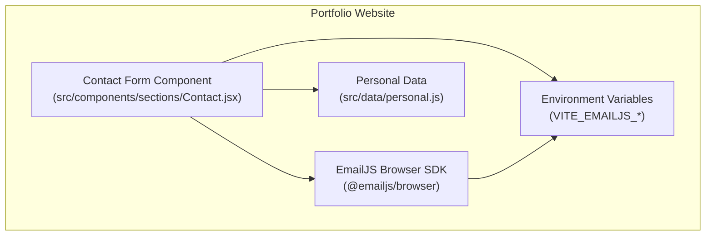
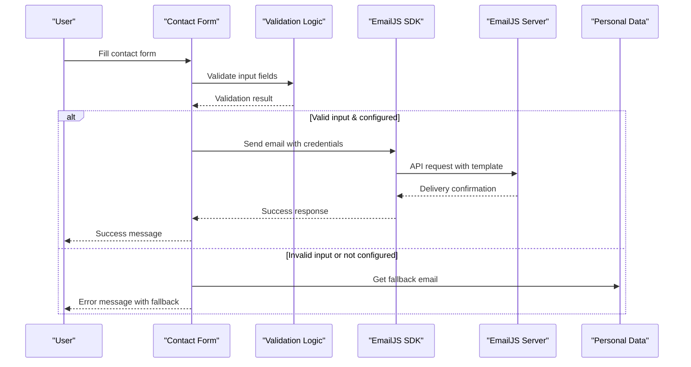
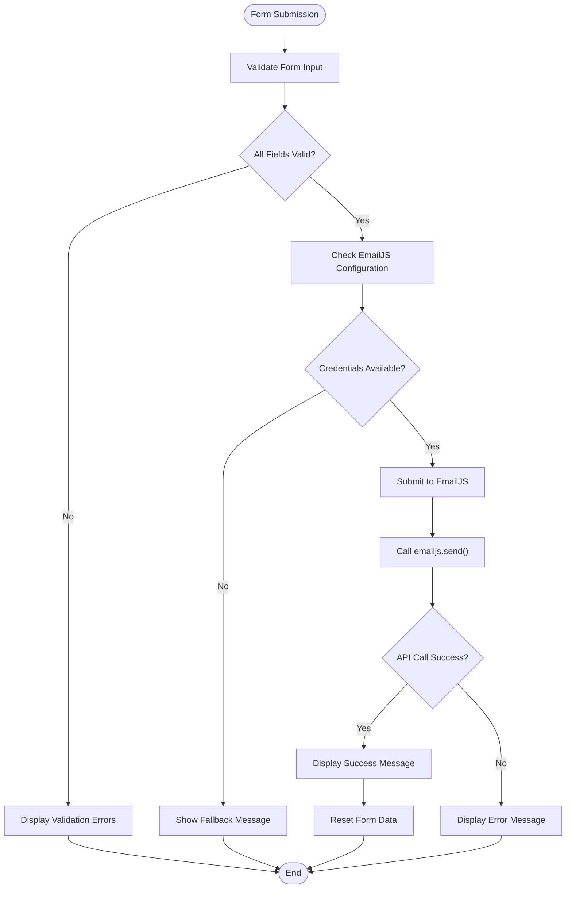
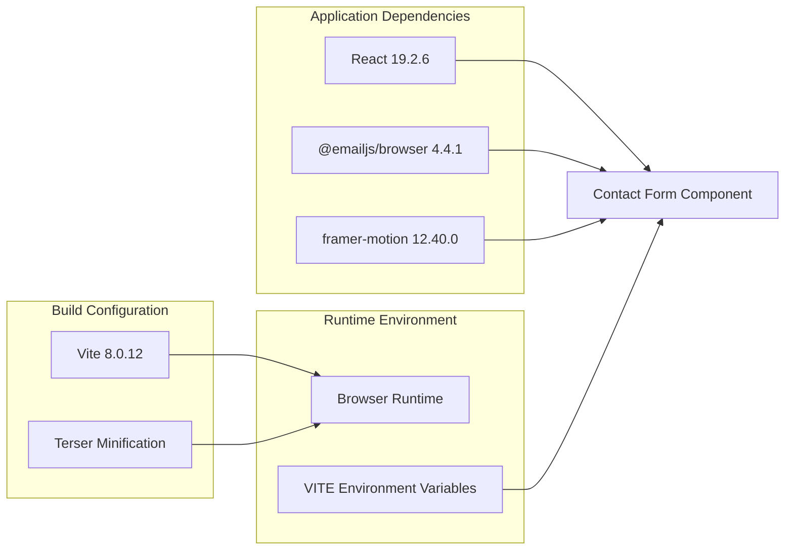

# EmailJS Integration

<cite>
**Referenced Files in This Document**
- [README.md](file://README.md)
- [Contact.jsx](file://src/components/sections/Contact.jsx)
- [personal.js](file://src/data/personal.js)
- [package.json](file://package.json)
- [vite.config.js](file://vite.config.js)
- [QUICK-START.md](file://QUICK-START.md)
</cite>

## Table of Contents
1. [Introduction](#introduction)
2. [Project Structure](#project-structure)
3. [Core Components](#core-components)
4. [Architecture Overview](#architecture-overview)
5. [Detailed Component Analysis](#detailed-component-analysis)
6. [Dependency Analysis](#dependency-analysis)
7. [Performance Considerations](#performance-considerations)
8. [Troubleshooting Guide](#troubleshooting-guide)
9. [Conclusion](#conclusion)

## Introduction
This document provides comprehensive EmailJS integration documentation for the portfolio website. It covers account setup, service configuration, template creation, environment variable structure, security best practices, contact form implementation, validation logic, submission handling, error management, troubleshooting procedures, and security considerations for protecting API credentials.

## Project Structure
The EmailJS integration is implemented within the contact form section of the portfolio website. The key components include:
- Contact form component with validation and submission logic
- Environment variable configuration for EmailJS credentials
- Personal data configuration for fallback email communication
- Package dependencies for EmailJS browser SDK

**Diagram sources**
- [Contact.jsx:1-293](file://src/components/sections/Contact.jsx#L1-L293)
- [personal.js:1-29](file://src/data/personal.js#L1-L29)
- [package.json:12-13](file://package.json#L12-L13)

**Section sources**
- [README.md:14](file://README.md#L14)
- [Contact.jsx:1-293](file://src/components/sections/Contact.jsx#L1-L293)
- [package.json:12-13](file://package.json#L12-L13)

## Core Components
The EmailJS integration consists of several key components working together to provide seamless email functionality:

### Environment Variable Configuration
The system uses Vite's environment variable system with the `VITE_` prefix for client-side configuration:
- `VITE_EMAILJS_SERVICE_ID`: Unique identifier for the EmailJS service
- `VITE_EMAILJS_TEMPLATE_ID`: Template identifier for email formatting
- `VITE_EMAILJS_PUBLIC_KEY`: Public key for EmailJS authentication

### Contact Form Implementation
The contact form component handles user input, validation, submission, and error management through a comprehensive state management system.

### Personal Data Integration
The system integrates with personal data configuration to provide fallback communication options when EmailJS is not configured.

**Section sources**
- [Contact.jsx:8-11](file://src/components/sections/Contact.jsx#L8-L11)
- [Contact.jsx:17-24](file://src/components/sections/Contact.jsx#L17-L24)
- [personal.js:13](file://src/data/personal.js#L13)
- [QUICK-START.md:294-298](file://QUICK-START.md#L294-L298)

## Architecture Overview
The EmailJS integration follows a client-side architecture pattern where the browser directly communicates with EmailJS servers using the provided credentials.

**Diagram sources**
- [Contact.jsx:32-48](file://src/components/sections/Contact.jsx#L32-L48)
- [Contact.jsx:56-91](file://src/components/sections/Contact.jsx#L56-L91)
- [Contact.jsx:20-23](file://src/components/sections/Contact.jsx#L20-L23)

## Detailed Component Analysis

### Contact Form Component
The contact form component implements a comprehensive email submission system with the following key features:

#### State Management
The component maintains four primary state variables:
- `formData`: Contains user input for name, email, subject, and message
- `errors`: Tracks validation errors for each field
- `status`: Manages success/error messages and UI feedback
- `isSubmitting`: Controls button state during submission

#### Validation Logic
The validation system enforces the following rules:
- **Name validation**: Required field with minimum 2 characters
- **Email validation**: Required field with email format regex validation
- **Subject validation**: Required field with minimum 3 characters
- **Message validation**: Required field with minimum 10 characters

#### Submission Handling
The submission process includes:
- Form validation before API calls
- Configuration checking for EmailJS credentials
- Asynchronous email sending with error handling
- Success/failure state management
- Form reset after successful submission

**Diagram sources**
- [Contact.jsx:32-48](file://src/components/sections/Contact.jsx#L32-L48)
- [Contact.jsx:56-91](file://src/components/sections/Contact.jsx#L56-L91)

**Section sources**
- [Contact.jsx:17-24](file://src/components/sections/Contact.jsx#L17-L24)
- [Contact.jsx:32-48](file://src/components/sections/Contact.jsx#L32-L48)
- [Contact.jsx:56-91](file://src/components/sections/Contact.jsx#L56-L91)

### Environment Variable Structure
The EmailJS integration requires three specific environment variables configured in the `.env` file:

| Variable | Purpose | Example Value |
|----------|---------|---------------|
| `VITE_EMAILJS_SERVICE_ID` | Unique identifier for EmailJS service | `service_abc123xyz` |
| `VITE_EMAILJS_TEMPLATE_ID` | Template identifier for email formatting | `template_def456uvw` |
| `VITE_EMAILJS_PUBLIC_KEY` | Public key for EmailJS authentication | `user_xxx_yyy_zzz` |

These variables are accessed using Vite's `import.meta.env` system and are validated for completeness before enabling the contact form functionality.

**Section sources**
- [Contact.jsx:8-11](file://src/components/sections/Contact.jsx#L8-L11)
- [QUICK-START.md:294-298](file://QUICK-START.md#L294-L298)

### Security Best Practices
The EmailJS integration implements several security measures:

#### Client-Side Credential Management
- Credentials are stored as environment variables with `VITE_` prefix
- Public keys are used instead of private keys for client-side operations
- Configuration validation prevents accidental credential exposure

#### Input Sanitization
- Form validation occurs on the client side before API calls
- Email format validation uses regex patterns
- Minimum length requirements prevent abuse

#### Error Handling
- Comprehensive error catching prevents sensitive information leakage
- User-friendly error messages without exposing internal details
- Console logging for debugging without revealing credentials

**Section sources**
- [Contact.jsx:26-30](file://src/components/sections/Contact.jsx#L26-L30)
- [Contact.jsx:86-90](file://src/components/sections/Contact.jsx#L86-L90)

## Dependency Analysis
The EmailJS integration relies on several key dependencies and configurations:

**Diagram sources**
- [package.json:12-23](file://package.json#L12-L23)
- [vite.config.js:10-40](file://vite.config.js#L10-L40)

**Section sources**
- [package.json:12-23](file://package.json#L12-L23)
- [vite.config.js:10-40](file://vite.config.js#L10-L40)

## Performance Considerations
The EmailJS integration is designed for optimal performance:

### Client-Side Optimization
- Single dependency on `@emailjs/browser` reduces bundle size
- Lazy loading through dynamic imports minimizes initial load time
- Efficient state management prevents unnecessary re-renders

### Build-Time Optimizations
- Terser minification reduces JavaScript bundle size
- Code splitting separates vendor libraries from application code
- Tree shaking eliminates unused code from the final bundle

### Runtime Performance
- Asynchronous email sending prevents UI blocking
- Debounced form validation improves user experience
- Efficient error handling minimizes performance impact

## Troubleshooting Guide

### Common Configuration Issues

#### Missing Environment Variables
**Symptoms**: Contact form shows error message with fallback email
**Solution**: 
1. Create `.env` file in project root
2. Add required EmailJS variables
3. Restart development server
4. Verify variables are prefixed with `VITE_`

#### Invalid EmailJS Credentials
**Symptoms**: API errors when submitting form
**Solution**:
1. Verify service ID, template ID, and public key
2. Check EmailJS dashboard for correct values
3. Ensure credentials match selected email service
4. Test credentials with EmailJS test functionality

#### Form Validation Errors
**Symptoms**: Error messages for missing or invalid fields
**Solution**:
1. Check minimum character requirements
2. Verify email format compliance
3. Ensure all required fields are filled
4. Review console for detailed error messages

### Testing Procedures

#### Local Testing
1. Start development server with `npm run dev`
2. Open browser console to monitor EmailJS requests
3. Test form validation with various inputs
4. Verify success and error states
5. Check network tab for API responses

#### Production Testing
1. Build production bundle with `npm run build`
2. Preview locally with `npm run preview`
3. Test form submission with real credentials
4. Monitor browser console for errors
5. Verify email delivery in EmailJS dashboard

### Security Considerations

#### API Key Protection
- Never commit `.env` files to version control
- Use separate EmailJS accounts for development and production
- Regularly rotate public keys if compromised
- Monitor EmailJS usage analytics for unusual activity

#### Input Security
- Validate all user inputs server-side (recommended)
- Implement rate limiting to prevent abuse
- Use Content Security Policy headers
- Monitor for spam attempts

#### Environment Management
- Use different environments for development and production
- Implement proper error handling without exposing credentials
- Regular security audits of configuration files
- Educate team members about credential protection

**Section sources**
- [README.md:169-186](file://README.md#L169-L186)
- [Contact.jsx:26-30](file://src/components/sections/Contact.jsx#L26-L30)
- [Contact.jsx:86-90](file://src/components/sections/Contact.jsx#L86-L90)

## Conclusion
The EmailJS integration provides a robust, secure, and user-friendly contact form solution for the portfolio website. By following the documented setup procedures, implementing proper security practices, and utilizing the comprehensive error handling and validation systems, developers can successfully deploy a reliable email communication system. The integration's client-side architecture ensures fast performance while maintaining security through proper credential management and input validation.

Key benefits of this implementation include:
- Zero backend requirements with EmailJS infrastructure
- Comprehensive form validation and error handling
- Secure credential management with environment variables
- Responsive design with smooth user experience
- Extensive troubleshooting and testing procedures
- Strong security practices for API key protection

The modular design allows for easy maintenance and future enhancements while providing a solid foundation for email communication functionality.