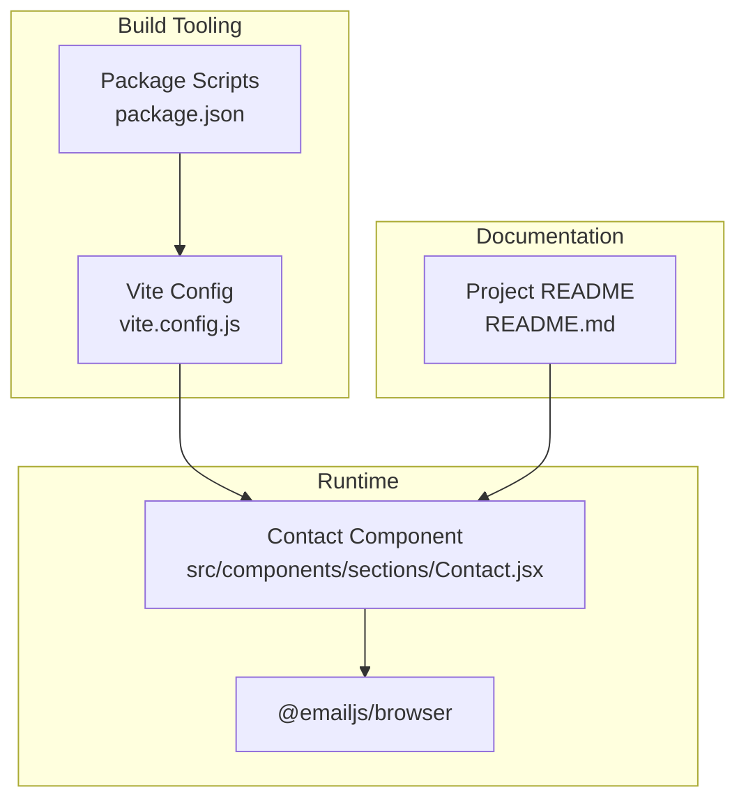
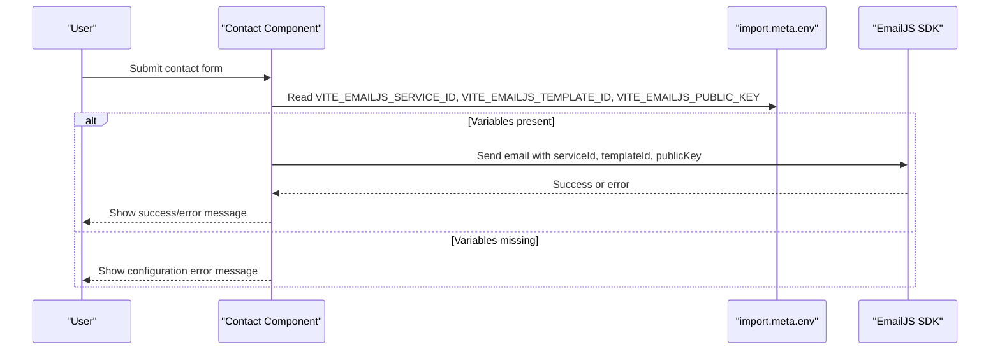
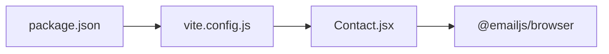

# Environment Configuration

<cite>
**Referenced Files in This Document**
- [vite.config.js](file://vite.config.js)
- [package.json](file://package.json)
- [README.md](file://README.md)
- [Contact.jsx](file://src/components/sections/Contact.jsx)
</cite>

## Table of Contents
1. [Introduction](#introduction)
2. [Project Structure](#project-structure)
3. [Core Components](#core-components)
4. [Architecture Overview](#architecture-overview)
5. [Detailed Component Analysis](#detailed-component-analysis)
6. [Dependency Analysis](#dependency-analysis)
7. [Performance Considerations](#performance-considerations)
8. [Troubleshooting Guide](#troubleshooting-guide)
9. [Conclusion](#conclusion)

## Introduction
This document provides comprehensive guidance for configuring environment variables in this portfolio project, focusing on EmailJS integration, Vite build configuration, and deployment settings. It explains the difference between development and production environments, outlines local development setup procedures, and details security best practices for protecting API keys. It also covers Vite's environment variable handling, build-time variable substitution, and practical troubleshooting steps to validate your configuration.

## Project Structure
The project uses Vite as the build tool and React for the frontend. Environment variables are consumed at build time and runtime via Vite's import.meta.env mechanism. The EmailJS integration is implemented in the Contact component, which reads serviceId, templateId, and publicKey from environment variables.

**Diagram sources**
- [vite.config.js:1-41](file://vite.config.js#L1-L41)
- [package.json:1-42](file://package.json#L1-L42)
- [Contact.jsx:1-267](file://src/components/sections/Contact.jsx#L1-L267)
- [README.md:1-204](file://README.md#L1-L204)

**Section sources**
- [vite.config.js:1-41](file://vite.config.js#L1-L41)
- [package.json:1-42](file://package.json#L1-L42)
- [README.md:1-204](file://README.md#L1-L204)

## Core Components
This section summarizes the environment-related components and their roles:

- Vite configuration: Defines build behavior and aliases used by the project.
- Package scripts: Provide commands for development, building, and previewing the application.
- Contact component: Consumes EmailJS environment variables to enable the contact form.
- README: Documents EmailJS setup and highlights the importance of environment variables.

Key environment variables used by the project:
- VITE_EMAILJS_SERVICE_ID: EmailJS service identifier.
- VITE_EMAILJS_TEMPLATE_ID: EmailJS template identifier.
- VITE_EMAILJS_PUBLIC_KEY: EmailJS public key.

These variables are accessed in the Contact component via import.meta.env and are required for the contact form to function.

**Section sources**
- [vite.config.js:1-41](file://vite.config.js#L1-L41)
- [package.json:1-42](file://package.json#L1-L42)
- [Contact.jsx:8-11](file://src/components/sections/Contact.jsx#L8-L11)
- [README.md:95-104](file://README.md#L95-L104)

## Architecture Overview
The environment configuration architecture centers on Vite's import.meta.env for accessing environment variables at runtime and the build process for substituting variables into the client bundle. The Contact component conditionally enables the EmailJS integration based on whether the required environment variables are present.

**Diagram sources**
- [Contact.jsx:8-11](file://src/components/sections/Contact.jsx#L8-L11)
- [Contact.jsx:56-91](file://src/components/sections/Contact.jsx#L56-L91)

**Section sources**
- [Contact.jsx:8-11](file://src/components/sections/Contact.jsx#L8-L11)
- [Contact.jsx:56-91](file://src/components/sections/Contact.jsx#L56-L91)

## Detailed Component Analysis

### Vite Configuration and Environment Variable Handling
- Vite exposes environment variables prefixed with VITE_ to the client-side code via import.meta.env.
- The project defines build-time optimizations and code splitting behavior in vite.config.js.
- The Contact component reads VITE_EMAILJS_* variables directly from import.meta.env.

Recommended approach:
- Define all client-side environment variables with the VITE_ prefix.
- Keep sensitive secrets (e.g., private keys) out of client bundles by avoiding non-VITE variables in client code.

**Section sources**
- [vite.config.js:1-41](file://vite.config.js#L1-L41)
- [Contact.jsx:8-11](file://src/components/sections/Contact.jsx#L8-L11)

### EmailJS Integration and Required Variables
The Contact component requires three EmailJS variables:
- VITE_EMAILJS_SERVICE_ID: Identifies the EmailJS service.
- VITE_EMAILJS_TEMPLATE_ID: Identifies the EmailJS template.
- VITE_EMAILJS_PUBLIC_KEY: Public key used to authorize sending emails.

Behavior:
- If any of these variables are missing, the component displays a configuration error and prevents sending emails.
- On successful configuration, the component invokes emailjs.send with the provided identifiers and public key.

Security considerations:
- Never commit real private keys to version control.
- Use VITE_ prefixed variables only for public keys and identifiers.
- Validate environment variables at runtime and provide clear error messages if missing.

**Section sources**
- [Contact.jsx:8-11](file://src/components/sections/Contact.jsx#L8-L11)
- [Contact.jsx:26-30](file://src/components/sections/Contact.jsx#L26-L30)
- [Contact.jsx:62-65](file://src/components/sections/Contact.jsx#L62-L65)
- [README.md:95-104](file://README.md#L95-L104)

### Build Scripts and Development Workflow
The package.json defines standard scripts:
- npm run dev: Starts the Vite development server.
- npm run build: Builds the production bundle.
- npm run preview: Serves the production build locally.

Local development setup:
- Install dependencies using npm install.
- Create a .env file with VITE_EMAILJS_* variables for local testing.
- Run npm run dev to start the development server.

**Section sources**
- [package.json:6-11](file://package.json#L6-L11)
- [README.md:16-30](file://README.md#L16-L30)

## Dependency Analysis
The environment configuration interacts with the following dependencies and files:

**Diagram sources**
- [vite.config.js:1-41](file://vite.config.js#L1-L41)
- [package.json:1-42](file://package.json#L1-L42)
- [Contact.jsx:1-267](file://src/components/sections/Contact.jsx#L1-L267)

**Section sources**
- [vite.config.js:1-41](file://vite.config.js#L1-L41)
- [package.json:1-42](file://package.json#L1-L42)
- [Contact.jsx:1-267](file://src/components/sections/Contact.jsx#L1-L267)

## Performance Considerations
- Environment variables are substituted at build time by Vite. Ensure only necessary variables are exposed to the client to minimize bundle bloat.
- Keep the number of environment-dependent branches small to avoid runtime overhead.
- Use Vite's built-in minification and chunking to optimize the production bundle.

## Troubleshooting Guide
Common environment configuration issues and resolutions:

- Missing EmailJS variables:
  - Symptom: Contact form shows a configuration error.
  - Resolution: Ensure VITE_EMAILJS_SERVICE_ID, VITE_EMAILJS_TEMPLATE_ID, and VITE_EMAILJS_PUBLIC_KEY are defined in your .env file and prefixed with VITE_.

- Incorrect variable names:
  - Symptom: Variables not recognized at runtime.
  - Resolution: Confirm variable names match the Contact component usage and are prefixed with VITE_.

- Build-time vs. runtime:
  - Symptom: Variables not available in production builds.
  - Resolution: Verify variables are prefixed with VITE_ and included in the .env file. Vite substitutes VITE_ variables at build time.

- Local development setup:
  - Symptom: Development server runs but contact form fails.
  - Resolution: Confirm .env file is present in the project root and contains the required VITE_EMAILJS_* variables.

Validation procedure:
- Start the development server with npm run dev.
- Open the contact page and submit the form.
- Observe the status message: success indicates correct configuration; otherwise, check the console and error messages.

**Section sources**
- [Contact.jsx:26-30](file://src/components/sections/Contact.jsx#L26-L30)
- [Contact.jsx:62-65](file://src/components/sections/Contact.jsx#L62-L65)
- [README.md:95-104](file://README.md#L95-L104)
- [README.md:16-30](file://README.md#L16-L30)

## Conclusion
This project relies on Vite's import.meta.env for client-side environment variables and requires VITE_EMAILJS_* variables for EmailJS integration. By following the outlined setup procedures, adhering to security best practices, and validating configuration through the troubleshooting steps, you can ensure reliable operation in both development and production environments.