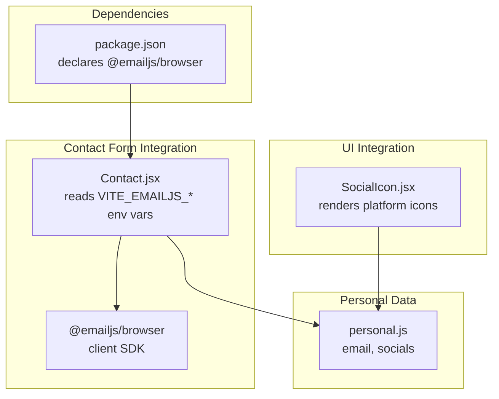
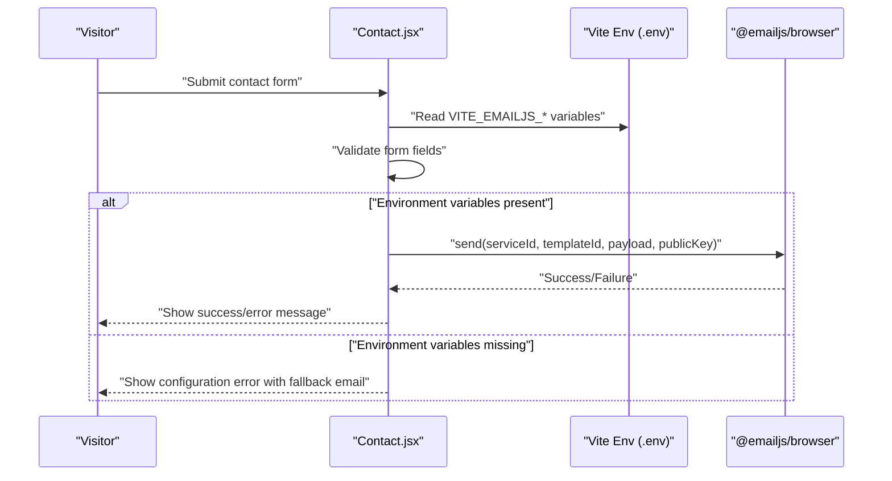
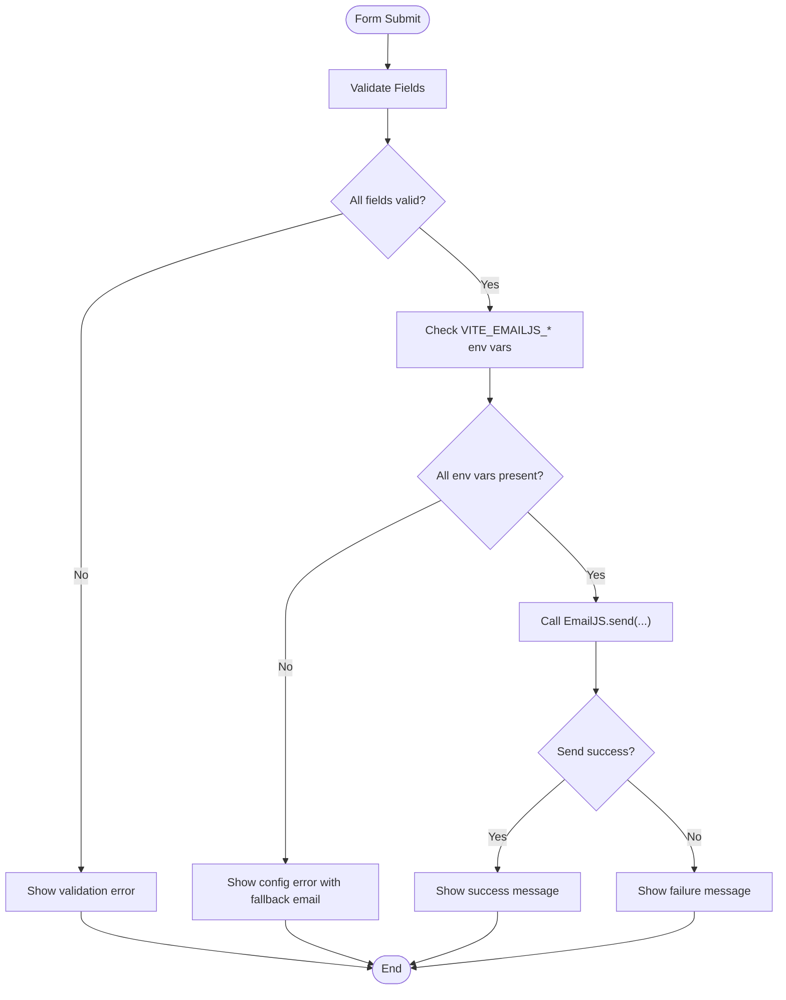
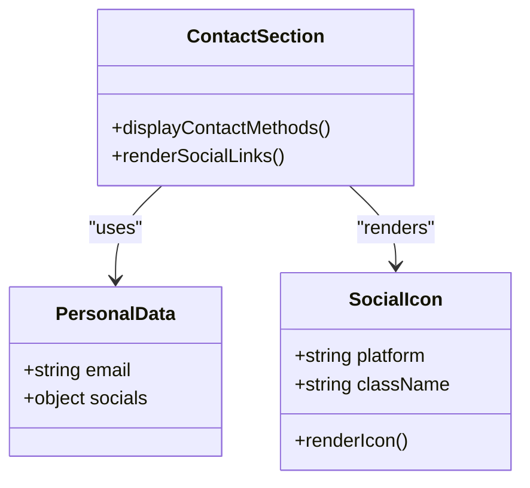
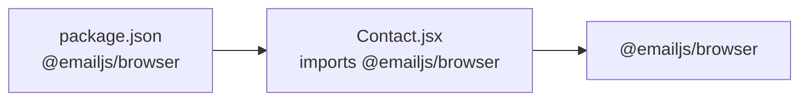

# Integration Setup

<cite>
**Referenced Files in This Document**
- [package.json](file://package.json)
- [README.md](file://README.md)
- [Contact.jsx](file://src/components/sections/Contact.jsx)
- [personal.js](file://src/data/personal.js)
- [SocialIcon.jsx](file://src/components/ui/SocialIcon.jsx)
</cite>

## Table of Contents
1. [Introduction](#introduction)
2. [Project Structure](#project-structure)
3. [Core Components](#core-components)
4. [Architecture Overview](#architecture-overview)
5. [Detailed Component Analysis](#detailed-component-analysis)
6. [Dependency Analysis](#dependency-analysis)
7. [Performance Considerations](#performance-considerations)
8. [Troubleshooting Guide](#troubleshooting-guide)
9. [Conclusion](#conclusion)
10. [Appendices](#appendices)

## Introduction
This document provides comprehensive integration setup guidance for external services and APIs used by the portfolio website. It focuses on:
- EmailJS contact form integration (account setup, template configuration, environment variable management)
- Social media integrations (platform links and icons)
- Analytics tracking and external data sources
- The .env.example file structure, required environment variables, and security best practices for API key management
- Step-by-step setup guides, troubleshooting, and validation procedures

The portfolio uses EmailJS for delivering contact form submissions directly from the client without a backend service. Social media integrations are configured via the personal data file and rendered through a reusable icon component.

## Project Structure
The integration-related parts of the project are organized as follows:
- Dependencies: EmailJS client library is declared in the project dependencies
- Contact form: Implemented in a dedicated section component with environment-driven configuration
- Personal data: Centralized configuration for contact email and social profiles
- Social icons: Reusable component rendering platform-specific SVG icons

**Diagram sources**
- [package.json:12-23](file://package.json#L12-L23)
- [Contact.jsx:6-11](file://src/components/sections/Contact.jsx#L6-L11)
- [personal.js:13-21](file://src/data/personal.js#L13-L21)
- [SocialIcon.jsx:1-32](file://src/components/ui/SocialIcon.jsx#L1-L32)

**Section sources**
- [package.json:12-23](file://package.json#L12-L23)
- [Contact.jsx:6-11](file://src/components/sections/Contact.jsx#L6-L11)
- [personal.js:13-21](file://src/data/personal.js#L13-L21)
- [SocialIcon.jsx:1-32](file://src/components/ui/SocialIcon.jsx#L1-L32)

## Core Components
- EmailJS client integration: The contact form reads three Vite environment variables at runtime to configure the EmailJS SDK and send messages securely from the browser.
- Personal data configuration: The contact form displays a fallback email and social links using centralized data.
- Social media integration: Platform-specific icons are rendered via a shared component, consuming URLs from personal data.

Key integration points:
- Environment variables consumed by the contact form:
  - VITE_EMAILJS_SERVICE_ID
  - VITE_EMAILJS_TEMPLATE_ID
  - VITE_EMAILJS_PUBLIC_KEY
- Personal data used by the contact form:
  - Email address for fallback messaging
  - Social media URLs for clickable profiles

**Section sources**
- [Contact.jsx:6-11](file://src/components/sections/Contact.jsx#L6-L11)
- [personal.js:13-21](file://src/data/personal.js#L13-L21)

## Architecture Overview
The contact form integration follows a client-side flow that leverages environment variables for secure configuration. The diagram below maps the actual code components involved in the integration.

**Diagram sources**
- [Contact.jsx:6-11](file://src/components/sections/Contact.jsx#L6-L11)
- [Contact.jsx:56-91](file://src/components/sections/Contact.jsx#L56-L91)

## Detailed Component Analysis

### EmailJS Contact Form Integration
This component integrates with EmailJS to deliver contact form submissions directly from the browser. It reads environment variables at runtime and conditionally enables the form submission flow.

Implementation highlights:
- Environment-driven configuration: The component reads VITE_EMAILJS_SERVICE_ID, VITE_EMAILJS_TEMPLATE_ID, and VITE_EMAILJS_PUBLIC_KEY from the Vite runtime environment.
- Conditional enablement: If any of the required environment variables are missing, the form displays an error status and suggests contacting via the fallback email.
- Client-side validation: The component validates form inputs before attempting to send the message.
- Secure sending: Uses the EmailJS SDK to send the message with the provided public key.

**Diagram sources**
- [Contact.jsx:32-48](file://src/components/sections/Contact.jsx#L32-L48)
- [Contact.jsx:56-91](file://src/components/sections/Contact.jsx#L56-L91)

**Section sources**
- [Contact.jsx:6-11](file://src/components/sections/Contact.jsx#L6-L11)
- [Contact.jsx:32-48](file://src/components/sections/Contact.jsx#L32-L48)
- [Contact.jsx:56-91](file://src/components/sections/Contact.jsx#L56-L91)

### Social Media Integrations
Social media links and icons are integrated through two complementary pieces:
- Personal data: The personal data module defines social media URLs used by the contact section and elsewhere.
- Icon rendering: The SocialIcon component renders platform-specific SVG icons based on the platform name.

**Diagram sources**
- [personal.js:13-21](file://src/data/personal.js#L13-L21)
- [SocialIcon.jsx:23-29](file://src/components/ui/SocialIcon.jsx#L23-L29)
- [Contact.jsx:93-202](file://src/components/sections/Contact.jsx#L93-L202)

**Section sources**
- [personal.js:13-21](file://src/data/personal.js#L13-L21)
- [SocialIcon.jsx:1-32](file://src/components/ui/SocialIcon.jsx#L1-L32)
- [Contact.jsx:93-202](file://src/components/sections/Contact.jsx#L93-L202)

### Analytics Tracking and External Data Sources
- Analytics tracking: No analytics libraries or tracking pixels are included in the current codebase. If you intend to add analytics, integrate the chosen provider according to their official SDK or script injection method and manage any required environment variables separately.
- External data sources: The portfolio loads static data from local files (personal, projects, skills, experience). There are no external API integrations in the current codebase.

[No sources needed since this section provides general guidance based on absence of analytics code]

## Dependency Analysis
The EmailJS integration depends on the EmailJS browser SDK installed as a project dependency. The contact form component imports and uses this SDK to send emails.

**Diagram sources**
- [package.json:13](file://package.json#L13)
- [Contact.jsx:6](file://src/components/sections/Contact.jsx#L6)

**Section sources**
- [package.json:13](file://package.json#L13)
- [Contact.jsx:6](file://src/components/sections/Contact.jsx#L6)

## Performance Considerations
- Client-side sending: Using EmailJS from the browser avoids server-side processing but relies on the client’s network connectivity and browser capabilities.
- Minimize payload size: Keep the contact form payload small to reduce transmission time and potential failures.
- Environment variable loading: Ensure environment variables are loaded at build/runtime by Vite to avoid unnecessary re-renders or errors.

[No sources needed since this section provides general guidance]

## Troubleshooting Guide
Common issues and resolutions:
- Contact form shows configuration error:
  - Cause: Missing VITE_EMAILJS_SERVICE_ID, VITE_EMAILJS_TEMPLATE_ID, or VITE_EMAILJS_PUBLIC_KEY.
  - Resolution: Add the required environment variables to your .env file and restart the development server.
- Form validation errors:
  - Cause: Empty or invalid fields.
  - Resolution: Correct the highlighted fields as per validation rules.
- Sending fails:
  - Cause: Incorrect credentials, template misconfiguration, or network issues.
  - Resolution: Verify EmailJS credentials, template ID, and service ID; test with a known working template; check browser console for detailed error logs.

Validation procedures:
- Confirm environment variables are present and correctly named.
- Test the contact form locally after adding environment variables.
- Review browser console for any JavaScript errors during form submission.

**Section sources**
- [Contact.jsx:18-23](file://src/components/sections/Contact.jsx#L18-L23)
- [Contact.jsx:32-48](file://src/components/sections/Contact.jsx#L32-L48)
- [Contact.jsx:86-91](file://src/components/sections/Contact.jsx#L86-L91)

## Conclusion
The portfolio’s integration with EmailJS is straightforward and secure, relying on environment variables for configuration and client-side validation for reliability. Social media integrations are centralized in the personal data file and rendered via a reusable icon component. For analytics and external data sources, no integrations are currently present in the codebase, leaving room for future additions following the established patterns of environment-driven configuration and component reuse.

[No sources needed since this section summarizes without analyzing specific files]

## Appendices

### A. EmailJS Setup Steps
- Create an EmailJS account and configure an email service (for example, Gmail or Outlook).
- Create an email template and note the Template ID.
- Obtain the Service ID and Public Key from your EmailJS dashboard.
- Add the following environment variables to your .env file:
  - VITE_EMAILJS_SERVICE_ID
  - VITE_EMAILJS_TEMPLATE_ID
  - VITE_EMAILJS_PUBLIC_KEY
- Restart the development server and test the contact form.

**Section sources**
- [README.md:95-103](file://README.md#L95-L103)
- [Contact.jsx:6-11](file://src/components/sections/Contact.jsx#L6-L11)

### B. Environment Variables Reference
- VITE_EMAILJS_SERVICE_ID: EmailJS service identifier
- VITE_EMAILJS_TEMPLATE_ID: EmailJS template identifier
- VITE_EMAILJS_PUBLIC_KEY: EmailJS public key for client-side sending

Security best practices:
- Never commit secrets to version control; keep them in .env files excluded by .gitignore.
- Use separate EmailJS accounts for development and production.
- Restrict template access and review EmailJS account activity regularly.

**Section sources**
- [Contact.jsx:6-11](file://src/components/sections/Contact.jsx#L6-L11)

### C. Social Media Integration Notes
- Update social URLs in the personal data file to reflect your profiles.
- The SocialIcon component supports multiple platforms; ensure the platform names match the keys in the personal data socials object.

**Section sources**
- [personal.js:15-21](file://src/data/personal.js#L15-L21)
- [SocialIcon.jsx:1-32](file://src/components/ui/SocialIcon.jsx#L1-L32)