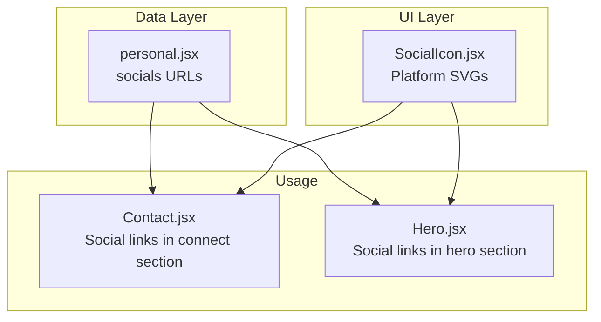
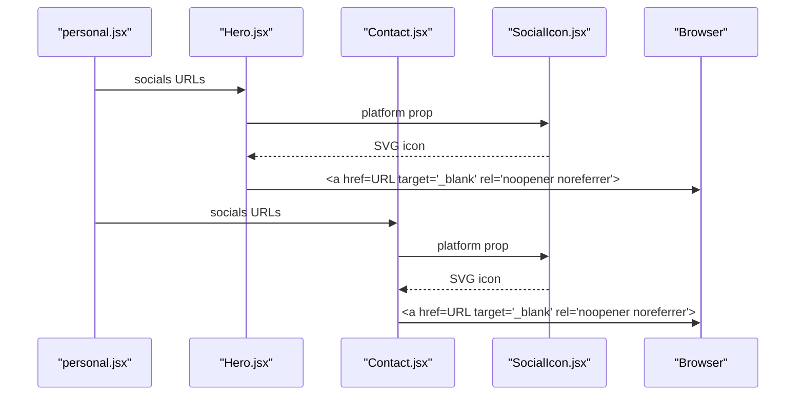
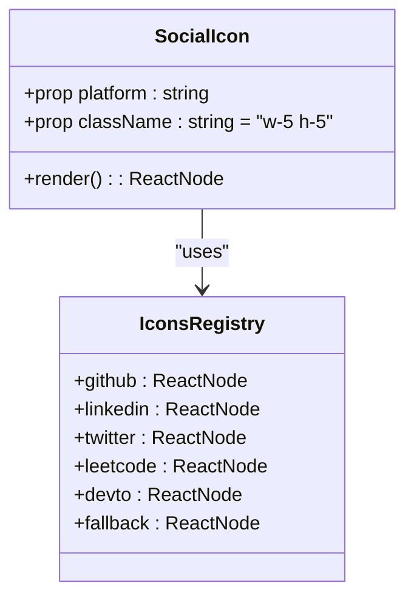
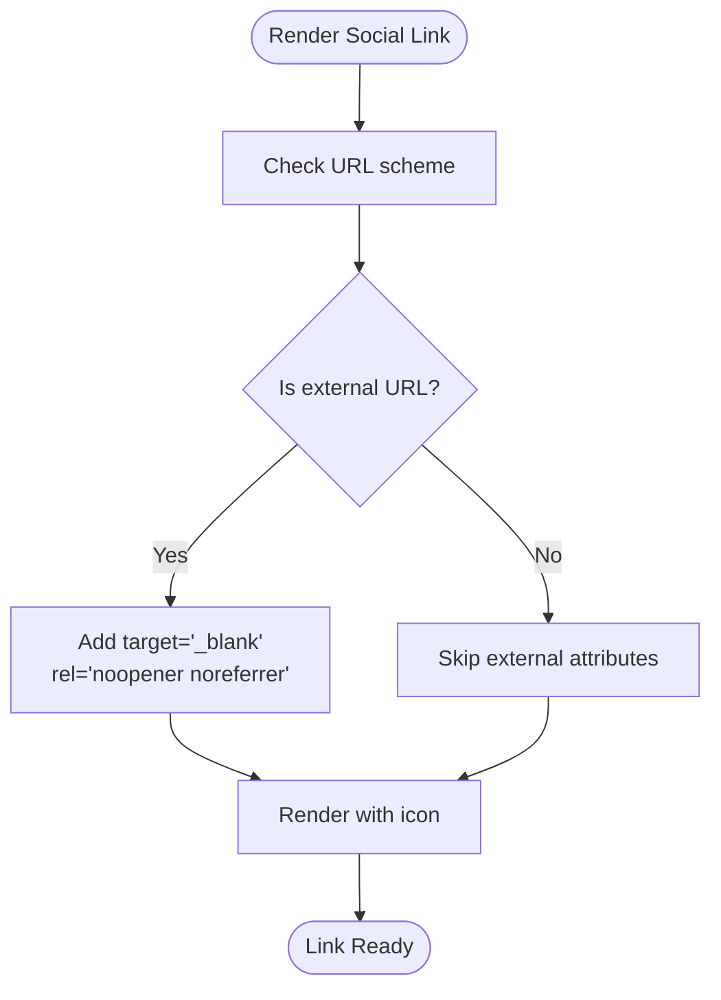
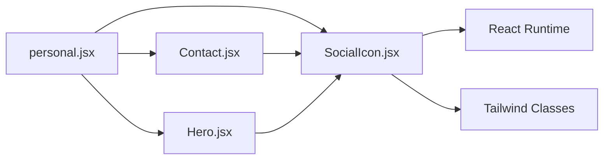

# Social Media Integrations

<cite>
**Referenced Files in This Document**
- [SocialIcon.jsx](file://src/components/ui/SocialIcon.jsx)
- [personal.jsx](file://src/data/personal.jsx)
- [Contact.jsx](file://src/components/sections/Contact.jsx)
- [Hero.jsx](file://src/components/sections/Hero.jsx)
- [package.json](file://package.json)
</cite>

## Table of Contents
1. [Introduction](#introduction)
2. [Project Structure](#project-structure)
3. [Core Components](#core-components)
4. [Architecture Overview](#architecture-overview)
5. [Detailed Component Analysis](#detailed-component-analysis)
6. [Dependency Analysis](#dependency-analysis)
7. [Performance Considerations](#performance-considerations)
8. [Troubleshooting Guide](#troubleshooting-guide)
9. [Conclusion](#conclusion)

## Introduction
This document explains how social media integrations are implemented and configured in the portfolio application. It focuses on the SocialIcon component, the social media configuration in the personal data file, URL structure requirements, and accessibility features. It also covers usage patterns across the Contact and Hero sections, guidelines for adding new social platforms, and best practices for consistent branding, proper link formatting, and security.

## Project Structure
The social media integration spans three main areas:
- Data configuration: social URLs and metadata are defined in the personal data file.
- UI component: the SocialIcon component renders platform-specific SVG icons.
- Usage locations: SocialIcon is embedded within the Contact and Hero sections to link to external profiles.

**Diagram sources**
- [personal.jsx:15-21](file://src/data/personal.jsx#L15-L21)
- [SocialIcon.jsx:1-31](file://src/components/ui/SocialIcon.jsx#L1-L31)
- [Contact.jsx:158-174](file://src/components/sections/Contact.jsx#L158-L174)
- [Hero.jsx:145-172](file://src/components/sections/Hero.jsx#L145-L172)

**Section sources**
- [personal.jsx:15-21](file://src/data/personal.jsx#L15-L21)
- [SocialIcon.jsx:1-31](file://src/components/ui/SocialIcon.jsx#L1-L31)
- [Contact.jsx:158-174](file://src/components/sections/Contact.jsx#L158-L174)
- [Hero.jsx:145-172](file://src/components/sections/Hero.jsx#L145-L172)

## Core Components
- SocialIcon component: Renders platform-specific SVG icons using a lookup table and provides a fallback icon for unknown platforms.
- personal.socials: Centralized configuration of social URLs used across the application.
- Contact and Hero sections: Display social links with appropriate accessibility attributes and external link handling.

Key responsibilities:
- SocialIcon: Platform-agnostic icon rendering with consistent sizing and color semantics.
- personal.socials: Single source of truth for social URLs; ensures uniform branding and easy maintenance.
- Sections: Provide accessible anchor elements with proper target and rel attributes for external links.

**Section sources**
- [SocialIcon.jsx:1-31](file://src/components/ui/SocialIcon.jsx#L1-L31)
- [personal.jsx:15-21](file://src/data/personal.jsx#L15-L21)
- [Contact.jsx:158-174](file://src/components/sections/Contact.jsx#L158-L174)
- [Hero.jsx:145-172](file://src/components/sections/Hero.jsx#L145-L172)

## Architecture Overview
The integration follows a unidirectional data flow:
- Data defines social URLs.
- Components render icons and links.
- Accessibility and security are handled at the anchor level.

**Diagram sources**
- [personal.jsx:15-21](file://src/data/personal.jsx#L15-L21)
- [Hero.jsx:145-172](file://src/components/sections/Hero.jsx#L145-L172)
- [Contact.jsx:158-174](file://src/components/sections/Contact.jsx#L158-L174)
- [SocialIcon.jsx:23-28](file://src/components/ui/SocialIcon.jsx#L23-L28)

## Detailed Component Analysis

### SocialIcon Component
The SocialIcon component encapsulates platform-specific icon rendering and provides a fallback for unknown platforms. It accepts a platform identifier and an optional className for sizing and styling.

Implementation highlights:
- Icon registry: A lookup table maps platform identifiers to SVG paths.
- Fallback mechanism: Unknown platforms render a default circle icon.
- Props: platform and className with a sensible default for consistent sizing.

**Diagram sources**
- [SocialIcon.jsx:1-31](file://src/components/ui/SocialIcon.jsx#L1-L31)

Usage patterns:
- Hero section: Renders small icons within interactive circles with hover effects.
- Contact section: Renders medium icons inside clickable social link blocks.

Accessibility and security:
- Links in both sections use target="_blank" and rel="noopener noreferrer" for external profiles.
- aria-label attributes provide meaningful screen-reader context.

**Section sources**
- [SocialIcon.jsx:1-31](file://src/components/ui/SocialIcon.jsx#L1-L31)
- [Hero.jsx:162-171](file://src/components/sections/Hero.jsx#L162-L171)
- [Contact.jsx:160-173](file://src/components/sections/Contact.jsx#L160-L173)

### Social Media Configuration in personal.js
The personal data file centralizes social media URLs under the socials object. This enables:
- Consistent branding across the application.
- Easy addition or removal of platforms.
- Single source of truth for external links.

Current supported platforms:
- GitHub
- LinkedIn
- Twitter
- LeetCode
- DEV.to

URL structure requirements:
- Absolute URLs are recommended for external profiles.
- Ensure trailing slashes are included if required by the platform.
- Keep URLs up to date to avoid broken links.

**Section sources**
- [personal.jsx:15-21](file://src/data/personal.jsx#L15-L21)

### Link Handling for External Profiles
Both Contact and Hero sections render external social links with:
- target="_blank" to open links in new tabs.
- rel="noopener noreferrer" to prevent tab-nabbing and leaking referrer data.
- aria-label attributes for accessibility.

**Diagram sources**
- [Contact.jsx:160-173](file://src/components/sections/Contact.jsx#L160-L173)
- [Hero.jsx:151-171](file://src/components/sections/Hero.jsx#L151-L171)

**Section sources**
- [Contact.jsx:160-173](file://src/components/sections/Contact.jsx#L160-L173)
- [Hero.jsx:151-171](file://src/components/sections/Hero.jsx#L151-L171)

### Adding New Social Platforms
Follow these steps to add a new platform:
1. Extend the socials object in personal.jsx with the new platform and its URL.
2. Add a new icon definition to the SocialIcon component’s icon registry.
3. Verify the icon renders correctly in both Contact and Hero sections.
4. Test external link behavior and accessibility attributes.

Guidelines:
- Maintain consistent icon sizes via className props.
- Use semantic platform names aligned with the socials keys.
- Keep URLs absolute and validated.

**Section sources**
- [personal.jsx:15-21](file://src/data/personal.jsx#L15-L21)
- [SocialIcon.jsx:1-31](file://src/components/ui/SocialIcon.jsx#L1-L31)

## Dependency Analysis
The social media integration depends on:
- React for component rendering.
- Tailwind CSS for styling and responsive behavior.
- Environment variables for optional integrations (e.g., EmailJS), though unrelated to social icons.

**Diagram sources**
- [SocialIcon.jsx:23-31](file://src/components/ui/SocialIcon.jsx#L23-L31)
- [personal.jsx:15-21](file://src/data/personal.jsx#L15-L21)
- [Contact.jsx:158-174](file://src/components/sections/Contact.jsx#L158-L174)
- [Hero.jsx:145-172](file://src/components/sections/Hero.jsx#L145-L172)

**Section sources**
- [package.json:12-24](file://package.json#L12-L24)
- [SocialIcon.jsx:23-31](file://src/components/ui/SocialIcon.jsx#L23-L31)
- [personal.jsx:15-21](file://src/data/personal.jsx#L15-L21)

## Performance Considerations
- SVG icons are lightweight and scalable; keep paths minimal for optimal performance.
- Avoid unnecessary re-renders by passing stable props and memoizing where appropriate.
- Use className for sizing to leverage CSS scaling rather than recalculating SVG dimensions.

## Troubleshooting Guide
Common issues and resolutions:
- Broken external links: Verify URLs in personal.jsx are correct and reachable.
- Missing icons: Ensure the platform key exists in SocialIcon’s icon registry.
- Accessibility warnings: Confirm aria-label attributes are present on social link containers.
- Security concerns: Ensure all external links include target="_blank" and rel="noopener noreferrer".

**Section sources**
- [personal.jsx:15-21](file://src/data/personal.jsx#L15-L21)
- [SocialIcon.jsx:1-31](file://src/components/ui/SocialIcon.jsx#L1-L31)
- [Contact.jsx:160-173](file://src/components/sections/Contact.jsx#L160-L173)
- [Hero.jsx:151-171](file://src/components/sections/Hero.jsx#L151-L171)

## Conclusion
The social media integration leverages a clean separation of concerns: centralized configuration in personal.jsx, reusable icon rendering in SocialIcon.jsx, and consistent usage in Contact and Hero sections. By following the documented patterns and guidelines, you can reliably add new platforms, maintain brand consistency, and ensure secure and accessible external link handling.