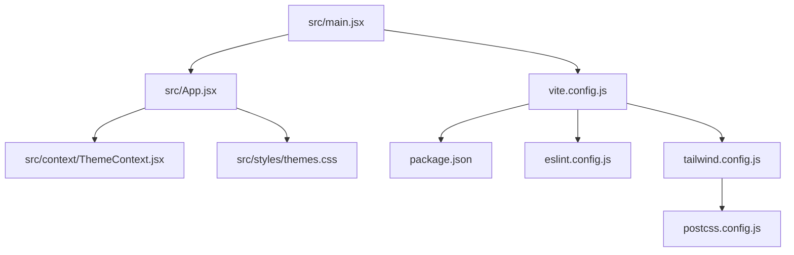
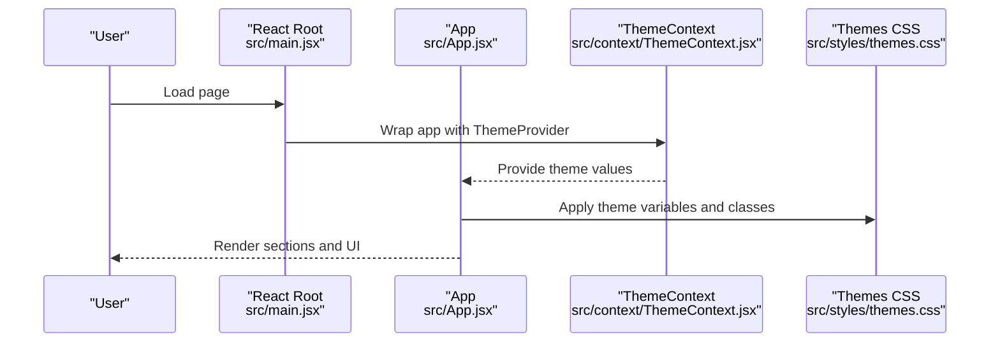
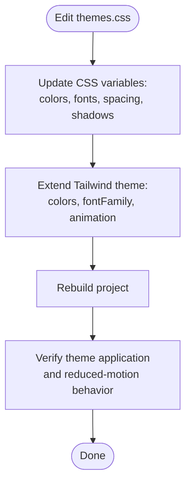
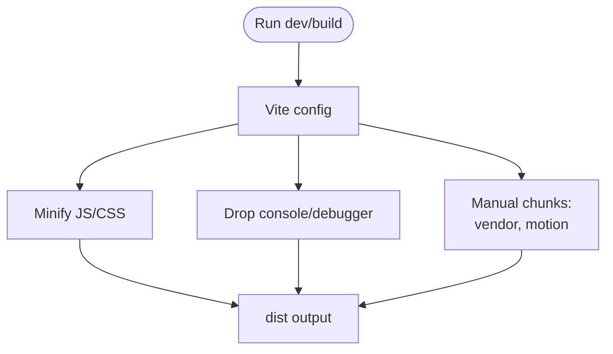
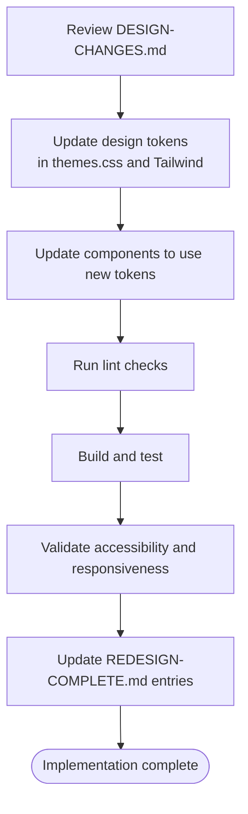
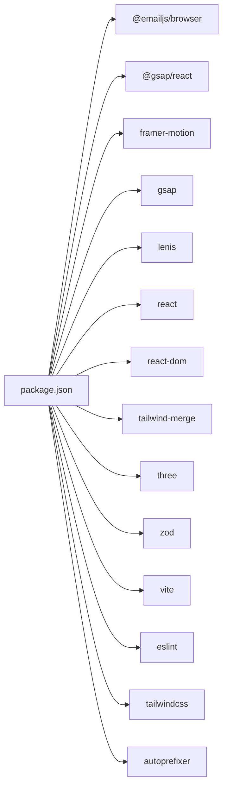

# Maintenance Procedures

<cite>
**Referenced Files in This Document**
- [README.md](file://README.md)
- [package.json](file://package.json)
- [vite.config.js](file://vite.config.js)
- [eslint.config.js](file://eslint.config.js)
- [tailwind.config.js](file://tailwind.config.js)
- [postcss.config.js](file://postcss.config.js)
- [src/main.jsx](file://src/main.jsx)
- [src/App.jsx](file://src/App.jsx)
- [src/context/ThemeContext.jsx](file://src/context/ThemeContext.jsx)
- [src/styles/themes.css](file://src/styles/themes.css)
- [DESIGN-CHANGES.md](file://DESIGN-CHANGES.md)
- [REDESIGN-COMPLETE.md](file://REDESIGN-COMPLETE.md)
</cite>

## Table of Contents
1. [Introduction](#introduction)
2. [Project Structure](#project-structure)
3. [Core Components](#core-components)
4. [Architecture Overview](#architecture-overview)
5. [Detailed Component Analysis](#detailed-component-analysis)
6. [Dependency Analysis](#dependency-analysis)
7. [Performance Considerations](#performance-considerations)
8. [Troubleshooting Guide](#troubleshooting-guide)
9. [Conclusion](#conclusion)
10. [Appendices](#appendices)

## Introduction
This document defines ongoing maintenance procedures for the portfolio project, covering update workflows, cleanup, design change implementation, project completion tracking, version control best practices, backups, content validation, dependency updates, conflict resolution, code quality, performance monitoring, security updates, and accessibility maintenance. It also provides checklists and emergency procedures to ensure long-term sustainability.

## Project Structure
The project is a React 19 application built with Vite 8, styled with Tailwind CSS 4, and enhanced with animations via Framer Motion and Three.js. Configuration is centralized in Vite, ESLint, PostCSS, and Tailwind. The theme system is CSS variable-driven and supports multiple themes with consistent design tokens.

**Diagram sources**
- [src/main.jsx:1-16](file://src/main.jsx#L1-L16)
- [src/App.jsx:1-47](file://src/App.jsx#L1-L47)
- [src/context/ThemeContext.jsx:1-23](file://src/context/ThemeContext.jsx#L1-L23)
- [src/styles/themes.css:1-339](file://src/styles/themes.css#L1-L339)
- [vite.config.js:1-41](file://vite.config.js#L1-L41)
- [package.json:1-42](file://package.json#L1-L42)
- [eslint.config.js:1-22](file://eslint.config.js#L1-L22)
- [tailwind.config.js:1-54](file://tailwind.config.js#L1-L54)
- [postcss.config.js:1-7](file://postcss.config.js#L1-L7)

**Section sources**
- [src/main.jsx:1-16](file://src/main.jsx#L1-L16)
- [src/App.jsx:1-47](file://src/App.jsx#L1-L47)
- [vite.config.js:1-41](file://vite.config.js#L1-L41)
- [package.json:1-42](file://package.json#L1-L42)
- [tailwind.config.js:1-54](file://tailwind.config.js#L1-L54)
- [postcss.config.js:1-7](file://postcss.config.js#L1-L7)

## Core Components
- Application bootstrap initializes the React root, theme provider, and global styles.
- Theme system defines CSS variables for colors, typography, spacing, shadows, and animations, with per-theme overrides and reduced-motion support.
- Build pipeline uses Vite with Terser minification, console/debugger removal, and manual chunking for vendor/motion bundles.
- Linting enforces React Hooks and refresh rules via flat ESLint config.

Key maintenance touchpoints:
- Update theme variables and keyframes in the theme stylesheet.
- Adjust Vite build options and chunking strategy for performance.
- Extend Tailwind theme tokens and animation/keyframes consistently.
- Keep ESLint configuration aligned with React Refresh and Hooks rules.

**Section sources**
- [src/main.jsx:1-16](file://src/main.jsx#L1-L16)
- [src/context/ThemeContext.jsx:1-23](file://src/context/ThemeContext.jsx#L1-L23)
- [src/styles/themes.css:1-339](file://src/styles/themes.css#L1-L339)
- [vite.config.js:17-39](file://vite.config.js#L17-L39)
- [eslint.config.js:7-21](file://eslint.config.js#L7-L21)

## Architecture Overview
The runtime architecture integrates React rendering, theme context, and global styles. Build-time architecture focuses on bundling, minification, and code splitting.

**Diagram sources**
- [src/main.jsx:6-15](file://src/main.jsx#L6-L15)
- [src/App.jsx:15-43](file://src/App.jsx#L15-L43)
- [src/context/ThemeContext.jsx:6-12](file://src/context/ThemeContext.jsx#L6-L12)
- [src/styles/themes.css:7-57](file://src/styles/themes.css#L7-L57)

## Detailed Component Analysis

### Theme System Maintenance
The theme system centralizes design tokens via CSS variables and applies them through Tailwind aliases. It supports multiple themes and respects reduced motion preferences.

**Diagram sources**
- [src/styles/themes.css:7-57](file://src/styles/themes.css#L7-L57)
- [tailwind.config.js:7-22](file://tailwind.config.js#L7-L22)

**Section sources**
- [src/styles/themes.css:1-339](file://src/styles/themes.css#L1-L339)
- [tailwind.config.js:1-54](file://tailwind.config.js#L1-L54)

### Build and Bundle Maintenance
Vite configuration controls minification, console/debugger stripping, and manual chunking. These settings directly impact performance and bundle sizes.

**Diagram sources**
- [vite.config.js:17-39](file://vite.config.js#L17-L39)

**Section sources**
- [vite.config.js:1-41](file://vite.config.js#L1-41)

### Design Change Implementation
Follow the documented design system to maintain consistency across typography, color, spacing, and animations.

**Diagram sources**
- [DESIGN-CHANGES.md:1-368](file://DESIGN-CHANGES.md#L1-L368)
- [REDESIGN-COMPLETE.md:1-330](file://REDESIGN-COMPLETE.md#L1-L330)
- [src/styles/themes.css:1-339](file://src/styles/themes.css#L1-L339)
- [tailwind.config.js:1-54](file://tailwind.config.js#L1-L54)

**Section sources**
- [DESIGN-CHANGES.md:1-368](file://DESIGN-CHANGES.md#L1-L368)
- [REDESIGN-COMPLETE.md:1-330](file://REDESIGN-COMPLETE.md#L1-L330)

### Content Validation Workflow
- Validate typography, color contrast, and spacing against the design system.
- Ensure components adhere to the accessibility checklist and responsive breakpoints.
- Confirm build output meets performance targets.

**Section sources**
- [REDESIGN-COMPLETE.md:83-103](file://REDESIGN-COMPLETE.md#L83-L103)
- [DESIGN-CHANGES.md:327-341](file://DESIGN-CHANGES.md#L327-L341)

## Dependency Analysis
The project’s runtime and dev dependencies define the technology stack. Dependencies should be updated systematically with validation.

**Diagram sources**
- [package.json:12-40](file://package.json#L12-L40)

**Section sources**
- [package.json:1-42](file://package.json#L1-L42)

## Performance Considerations
- Monitor build time and bundle sizes; adjust Vite chunking and minification as needed.
- Keep animations optimized (transform/opacity only) and respect reduced motion.
- Validate CSS and JS gzipped sizes post-build.

[No sources needed since this section provides general guidance]

## Troubleshooting Guide
Common maintenance issues and resolutions:
- Build failures: Review Vite terser options and manual chunking configuration.
- Lint errors: Align with ESLint flat config and React Refresh/Hooks rules.
- Theme inconsistencies: Verify CSS variables and Tailwind theme extensions.
- Accessibility regressions: Run checks against the pre-delivery checklist and WCAG AA targets.

**Section sources**
- [vite.config.js:17-39](file://vite.config.js#L17-L39)
- [eslint.config.js:7-21](file://eslint.config.js#L7-L21)
- [src/styles/themes.css:299-321](file://src/styles/themes.css#L299-L321)
- [REDESIGN-COMPLETE.md:83-103](file://REDESIGN-COMPLETE.md#L83-L103)

## Conclusion
Maintaining this portfolio requires disciplined adherence to the design system, robust build configuration, and continuous validation of performance and accessibility. Use the provided checklists and procedures to ensure updates remain consistent, secure, and sustainable.

[No sources needed since this section summarizes without analyzing specific files]

## Appendices

### Version Control Best Practices
- Branch by feature; keep commits small and focused.
- Use conventional commit messages for automated changelog generation.
- Protect main branch with required reviews and status checks.
- Tag releases with semantic versioning.

[No sources needed since this section provides general guidance]

### Backup Procedures
- Commit and push regularly; maintain remote origin.
- Back up critical configuration files locally and in cloud storage.
- Preserve build artifacts for rollback verification.

[No sources needed since this section provides general guidance]

### Dependency Update and Conflict Resolution
- Audit dependencies periodically; update minor/patch versions first.
- Test builds after each update; revert if regressions appear.
- Resolve conflicts by merging changes from main and re-running tests.

**Section sources**
- [package.json:6-11](file://package.json#L6-L11)

### Code Quality and Security Maintenance
- Run linting before commits; fix issues proactively.
- Keep dependencies updated; monitor security advisories.
- Enforce type checking and static analysis as configured.

**Section sources**
- [eslint.config.js:7-21](file://eslint.config.js#L7-L21)

### Accessibility Maintenance
- Validate contrast ratios and keyboard navigation.
- Respect reduced motion preferences.
- Test with screen readers and assistive technologies.

**Section sources**
- [src/styles/themes.css:299-321](file://src/styles/themes.css#L299-L321)
- [REDESIGN-COMPLETE.md:87-91](file://REDESIGN-COMPLETE.md#L87-L91)

### Regular Maintenance Checklists
- Daily: Run linter and preview server; address warnings.
- Weekly: Audit dependencies; update documentation.
- Monthly: Review build metrics; optimize chunking and animations.
- Quarterly: Validate accessibility and responsiveness across devices.

[No sources needed since this section provides general guidance]

### Emergency Procedures
- Rollback to previous release if critical failure occurs.
- Temporarily disable animations for performance or accessibility issues.
- Revert theme changes if visual regressions are detected.

[No sources needed since this section provides general guidance]