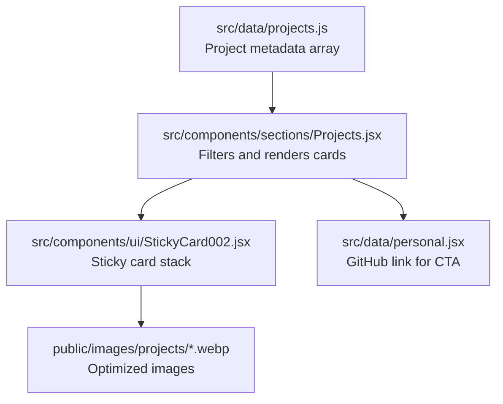
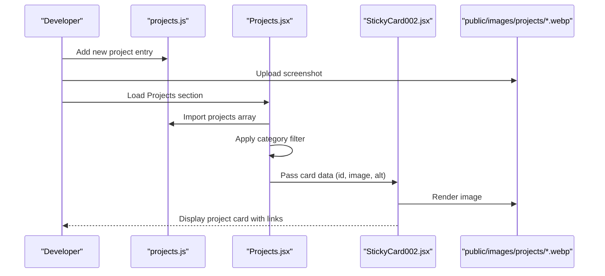
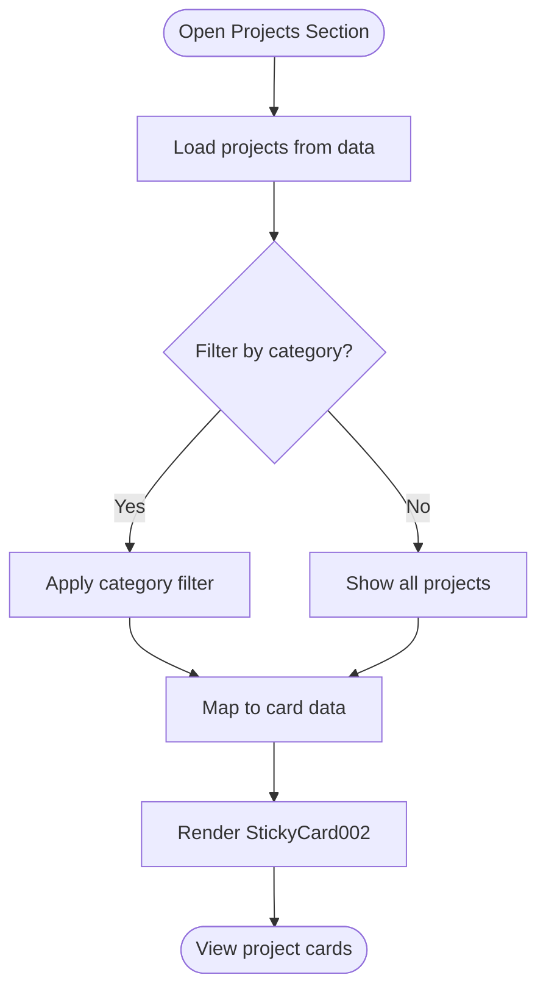

# Adding New Projects

<cite>
**Referenced Files in This Document**
- [projects.js](file://src/data/projects.js)
- [Projects.jsx](file://src/components/sections/Projects.jsx)
- [StickyCard002.jsx](file://src/components/ui/StickyCard002.jsx)
- [README.md](file://README.md)
- [README-IMAGES.md](file://README-IMAGES.md)
- [personal.jsx](file://src/data/personal.jsx)
- [package.json](file://package.json)
</cite>

## Table of Contents
1. [Introduction](#introduction)
2. [Project Structure](#project-structure)
3. [Core Components](#core-components)
4. [Architecture Overview](#architecture-overview)
5. [Detailed Component Analysis](#detailed-component-analysis)
6. [Dependency Analysis](#dependency-analysis)
7. [Performance Considerations](#performance-considerations)
8. [Troubleshooting Guide](#troubleshooting-guide)
9. [Conclusion](#conclusion)
10. [Appendices](#appendices)

## Introduction
This guide explains how to add new projects to your portfolio, from editing the project metadata to uploading optimized images and verifying the display. It covers:
- Creating and editing project entries in the data source
- Configuring categories, tags, and featured status
- Adding GitHub repositories and live demo links
- Uploading and optimizing images for the projects section
- Testing the display and filtering behavior
- Troubleshooting common issues

## Project Structure
The projects are defined centrally and rendered by dedicated UI components:
- Data source: projects metadata
- Rendering: Projects section with category filters and sticky cards
- Image assets: WebP screenshots under the public images directory

**Diagram sources**
- [projects.js:1-67](file://src/data/projects.js#L1-L67)
- [Projects.jsx:1-125](file://src/components/sections/Projects.jsx#L1-L125)
- [StickyCard002.jsx:1-127](file://src/components/ui/StickyCard002.jsx#L1-L127)
- [personal.jsx:1-61](file://src/data/personal.jsx#L1-L61)

**Section sources**
- [projects.js:1-67](file://src/data/projects.js#L1-L67)
- [Projects.jsx:1-125](file://src/components/sections/Projects.jsx#L1-L125)
- [README.md:71-82](file://README.md#L71-L82)

## Core Components
- Project metadata: An array of project objects with fields for identification, presentation, links, and display flags.
- Projects section: Provides category filters and renders a sticky card stack of project previews.
- Sticky card renderer: Displays project images and links, with fallback behavior for missing images.

Key responsibilities:
- projects.js: Define project entries with id, title, description, tags, category, image path, GitHub URL, live demo URL, featured flag, and highlights.
- Projects.jsx: Exposes category filters and maps projects to card data for rendering.
- StickyCard002.jsx: Renders a vertical stack of cards with animated transitions and fallback visuals.

**Section sources**
- [projects.js:1-67](file://src/data/projects.js#L1-L67)
- [Projects.jsx:9-15](file://src/components/sections/Projects.jsx#L9-L15)
- [Projects.jsx:22-31](file://src/components/sections/Projects.jsx#L22-L31)
- [StickyCard002.jsx:106-119](file://src/components/ui/StickyCard002.jsx#L106-L119)

## Architecture Overview
The workflow from data to display:
1. Edit projects.js to add a new project entry.
2. Upload the project screenshot to public/images/projects/<filename>.webp.
3. Start the development server and navigate to the Projects section.
4. Filter by category if needed; verify the project appears with image fallbacks if the asset is missing.
5. Click “Live” and “Code” links to test external URLs.

**Diagram sources**
- [projects.js:1-67](file://src/data/projects.js#L1-L67)
- [Projects.jsx:22-31](file://src/components/sections/Projects.jsx#L22-L31)
- [StickyCard002.jsx:106-119](file://src/components/ui/StickyCard002.jsx#L106-L119)

## Detailed Component Analysis

### Project Metadata Schema and Examples
- Location: projects.js
- Fields to define:
  - id: Unique integer identifier
  - title: Human-readable project name
  - description: Short summary
  - tags: Array of technology/tool tags
  - category: One of fullstack, systems, ml, devops
  - image: Path under /public/images/projects/<name>.webp
  - github: Full HTTPS URL to repository
  - live: Full HTTPS URL to demo/deployment
  - featured: Boolean to highlight in the card
  - highlights: Array of bullet points describing achievements

Examples in the repository illustrate:
- Full stack applications with backend and frontend stacks
- Systems tools with CLI and performance metrics
- ML/AI and DevOps categories are supported conceptually

Template outline (do not copy verbatim; adapt fields):
- id: integer
- title: string
- description: string
- tags: array of strings
- category: "fullstack" | "systems" | "ml" | "devops"
- image: "/images/projects/<slug>.webp"
- github: "https://github.com/owner/repo"
- live: "https://example.vercel.app"
- featured: boolean
- highlights: array of short strings

Notes:
- Use lowercase slugs for filenames and consistent naming.
- Keep image dimensions and size within recommended specs.

**Section sources**
- [projects.js:1-67](file://src/data/projects.js#L1-L67)
- [README.md:71-82](file://README.md#L71-L82)

### Category Configuration
- Supported categories are defined in the Projects section component.
- Filtering logic compares each project’s category field against the selected filter.

Categories:
- all
- fullstack
- systems
- ml
- devops

Behavior:
- Selecting a category narrows the list to matching projects.
- The “All Projects” filter shows the entire collection.

**Section sources**
- [Projects.jsx:9-15](file://src/components/sections/Projects.jsx#L9-L15)
- [Projects.jsx:22-25](file://src/components/sections/Projects.jsx#L22-L25)

### Featured Status
- The project’s featured flag controls a small badge shown on the card.
- The Projects section does not filter by featured; it displays all projects and marks featured ones visually.

**Section sources**
- [projects.js:11](file://src/data/projects.js#L11)
- [StickyCard002.jsx:78-83](file://src/components/ui/StickyCard002.jsx#L78-L83)

### Links: GitHub and Live Demo
- The card exposes two action buttons:
  - Code: Opens the project’s GitHub URL
  - Live: Opens the deployed demo URL
- These links are taken directly from the project entry fields.

Testing tips:
- Ensure URLs are publicly accessible and HTTPS.
- Verify redirects and CORS do not block external domains.

**Section sources**
- [projects.js:9-10](file://src/data/projects.js#L9-L10)
- [StickyCard002.jsx:86-101](file://src/components/ui/StickyCard002.jsx#L86-L101)

### Image Handling and Optimization
- Image location: public/images/projects/<slug>.webp
- Recommended specifications:
  - Format: WebP
  - Dimensions: 800x600 pixels (4:3 aspect ratio)
  - Size: Under 200 KB
- Fallback behavior:
  - If the image fails to load, the card switches to a gradient background with themed accents.
- Additional assets:
  - Headshot: public/headshot.jpg (profile photo)
  - Open Graph preview: public/og-image.jpg (social sharing)

Optimization tools and commands are documented in the images guide.

**Section sources**
- [README-IMAGES.md:23-50](file://README-IMAGES.md#L23-L50)
- [README-IMAGES.md:76-97](file://README-IMAGES.md#L76-L97)
- [README-IMAGES.md:101-113](file://README-IMAGES.md#L101-L113)

### Display Pipeline and Filters
- The Projects section:
  - Defines category filters
  - Filters the projects array by category
  - Maps filtered projects to card data (id, image, alt)
  - Renders a sticky card stack
- The sticky card component:
  - Renders images with graceful fallback
  - Shows tags, highlights, and links

**Diagram sources**
- [Projects.jsx:22-31](file://src/components/sections/Projects.jsx#L22-L31)
- [StickyCard002.jsx:106-119](file://src/components/ui/StickyCard002.jsx#L106-L119)

**Section sources**
- [Projects.jsx:17-88](file://src/components/sections/Projects.jsx#L17-L88)
- [StickyCard002.jsx:25-95](file://src/components/ui/StickyCard002.jsx#L25-L95)

## Dependency Analysis
- Projects.jsx depends on:
  - projects.js for data
  - personal.jsx for the GitHub CTA link
  - StickyCard002.jsx for rendering
- StickyCard002.jsx depends on:
  - GSAP and ScrollTrigger for animations
  - Tailwind classes for styling
- Image assets depend on:
  - Correct file paths and WebP format
  - Public directory placement

External libraries:
- GSAP and ScrollTrigger for scroll-driven animations
- Framer Motion and Lenis for scroll interactions

**Section sources**
- [Projects.jsx:1-7](file://src/components/sections/Projects.jsx#L1-L7)
- [StickyCard002.jsx:1-10](file://src/components/ui/StickyCard002.jsx#L1-L10)
- [package.json:12-24](file://package.json#L12-L24)

## Performance Considerations
- Use WebP images sized to 800x600 with file sizes under 200 KB to minimize bandwidth and improve loading speed.
- Keep the number of concurrently loaded large assets reasonable; the card stack is scroll-driven and pinned, which helps manage perceived performance.
- Prefer static images in the public directory for fast, direct delivery.

## Troubleshooting Guide
Common issues and resolutions:
- Broken image links
  - Symptom: Fallback gradient appears instead of the project image.
  - Checks:
    - Confirm the image filename matches the slug used in the project entry.
    - Verify the file is placed under public/images/projects/.
    - Ensure the image is in WebP format and meets size/size limits.
- Missing images
  - Symptom: Placeholder gradient background.
  - Resolution: Upload the image with the exact filename and path.
- Incorrect category filtering
  - Symptom: Project does not appear when filtering.
  - Checks:
    - Ensure the category value matches one of the supported keys.
    - Confirm the category spelling aligns with the filter options.
- External links not opening
  - Symptom: Buttons do nothing or open unexpected pages.
  - Checks:
    - Validate the URLs in the project entry are correct and publicly accessible.
    - Ensure HTTPS links are used for live demos.
- GitHub CTA link incorrect
  - Symptom: Call-to-action opens a different profile.
  - Checks:
    - Update the GitHub URL in personal.jsx if needed.

**Section sources**
- [README-IMAGES.md:101-113](file://README-IMAGES.md#L101-L113)
- [Projects.jsx:9-15](file://src/components/sections/Projects.jsx#L9-L15)
- [projects.js:7](file://src/data/projects.js#L7)
- [personal.jsx:15-21](file://src/data/personal.jsx#L15-L21)

## Conclusion
Adding a new project involves three straightforward steps:
1. Add a new entry to the projects array with accurate metadata and links.
2. Upload the optimized WebP screenshot to the public images directory.
3. Test the display by navigating to the Projects section, applying filters, and clicking the links.

Following the category, tag, and featured configurations ensures your project integrates seamlessly with the existing UI and filtering behavior.

## Appendices

### Step-by-Step: Adding a New Project
- Prepare the project entry in projects.js:
  - Assign a unique id
  - Set title, description, tags, category, image path, GitHub URL, live URL, featured flag, and highlights
- Prepare the image:
  - Capture a clean screenshot at 800x600 pixels
  - Convert to WebP and compress under 200 KB
  - Save as public/images/projects/<slug>.webp
- Verify display:
  - Start the dev server and go to the Projects section
  - Test category filters and links
  - Confirm fallback visuals if the image is missing

**Section sources**
- [projects.js:1-67](file://src/data/projects.js#L1-L67)
- [README-IMAGES.md:23-50](file://README-IMAGES.md#L23-L50)
- [README.md:169-186](file://README.md#L169-L186)