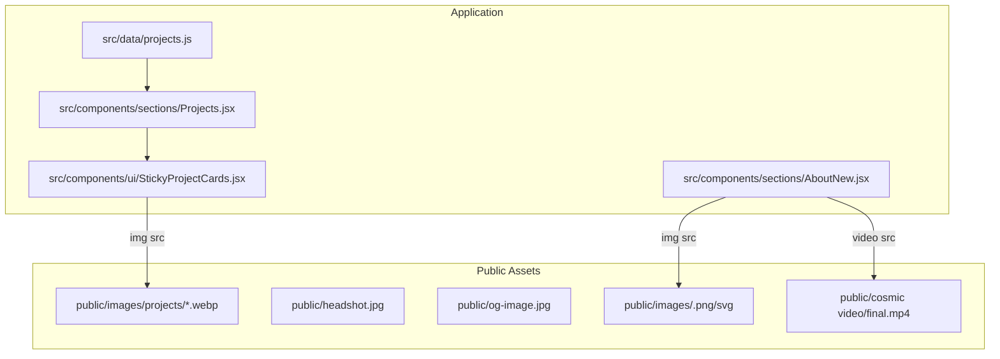
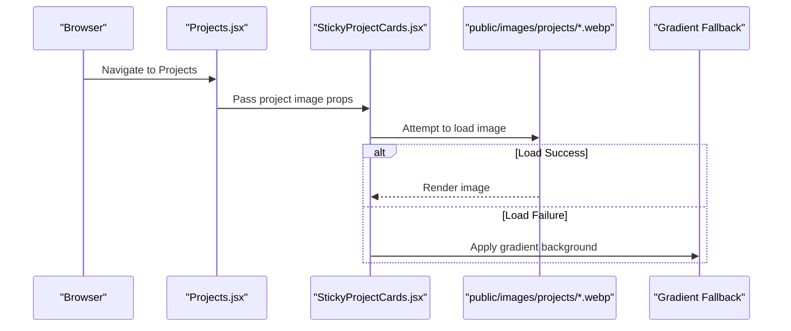
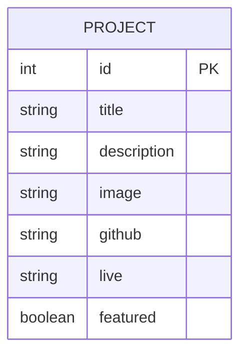
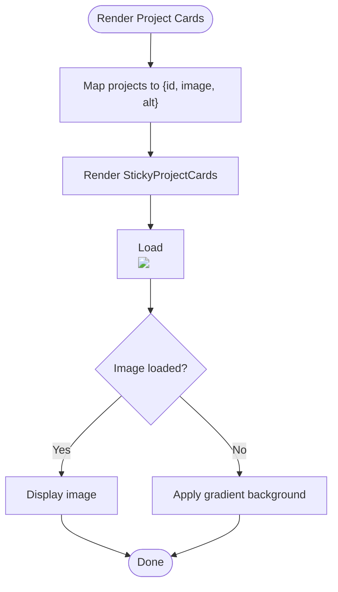
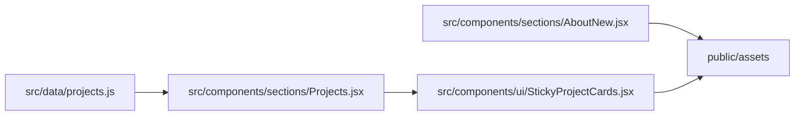

# Image Management and Optimization

<cite>
**Referenced Files in This Document**
- [README-IMAGES.md](file://README-IMAGES.md)
- [public/images/README.md](file://public/images/README.md)
- [public/README-HEADSHOT.md](file://public/README-HEADSHOT.md)
- [src/data/projects.js](file://src/data/projects.js)
- [src/components/sections/Projects.jsx](file://src/components/sections/Projects.jsx)
- [src/components/ui/StickyProjectCards.jsx](file://src/components/ui/StickyProjectCards.jsx)
- [src/components/sections/AboutNew.jsx](file://src/components/sections/AboutNew.jsx)
- [vite.config.js](file://vite.config.js)
- [package.json](file://package.json)
</cite>

## Table of Contents
1. [Introduction](#introduction)
2. [Project Structure](#project-structure)
3. [Core Components](#core-components)
4. [Architecture Overview](#architecture-overview)
5. [Detailed Component Analysis](#detailed-component-analysis)
6. [Dependency Analysis](#dependency-analysis)
7. [Performance Considerations](#performance-considerations)
8. [Troubleshooting Guide](#troubleshooting-guide)
9. [Conclusion](#conclusion)
10. [Appendices](#appendices)

## Introduction
This document provides comprehensive guidance for managing and optimizing images in the portfolio. It covers naming conventions, supported formats, placement in the public directory, optimization workflows, responsive handling, and fallback behavior. It also includes step-by-step instructions for adding new project images, troubleshooting common display issues, and optimizing images for different screen sizes.

## Project Structure
Images are served from the static public directory and referenced by React components. The primary locations are:
- Project images: public/images/projects/
- Headshots: public/headshot.jpg
- OG preview: public/og-image.jpg
- About section visuals: public/images/<glass-bust|glass-crystal>.png/svg
- Background video: public/cosmic video/final.mp4

**Diagram sources**
- [src/data/projects.js:1-67](file://src/data/projects.js#L1-L67)
- [src/components/sections/Projects.jsx:1-125](file://src/components/sections/Projects.jsx#L1-L125)
- [src/components/ui/StickyProjectCards.jsx:1-147](file://src/components/ui/StickyProjectCards.jsx#L1-L147)
- [src/components/sections/AboutNew.jsx:1-420](file://src/components/sections/AboutNew.jsx#L1-L420)

**Section sources**
- [README-IMAGES.md:23-50](file://README-IMAGES.md#L23-L50)
- [public/images/README.md:1-29](file://public/images/README.md#L1-L29)
- [public/README-HEADSHOT.md:1-21](file://public/README-HEADSHOT.md#L1-L21)

## Core Components
- Project image data: projects.js defines image paths for each project.
- Project page: Projects.jsx renders project cards and delegates image rendering to StickyProjectCards.
- Project card: StickyProjectCards.jsx displays images with graceful fallback behavior.
- About section: AboutNew.jsx references glass-bust and glass-crystal images and a background video.
- Build pipeline: Vite handles asset bundling and minification.

Key responsibilities:
- projects.js: centralizes image path definitions for projects.
- StickyProjectCards: renders images with onError fallback to gradient background.
- AboutNew: loads visual assets from public/images and video from public/cosmic video.

**Section sources**
- [src/data/projects.js:1-67](file://src/data/projects.js#L1-L67)
- [src/components/sections/Projects.jsx:1-125](file://src/components/sections/Projects.jsx#L1-L125)
- [src/components/ui/StickyProjectCards.jsx:66-75](file://src/components/ui/StickyProjectCards.jsx#L66-L75)
- [src/components/sections/AboutNew.jsx:91-116](file://src/components/sections/AboutNew.jsx#L91-L116)

## Architecture Overview
The image pipeline follows a straightforward flow:
- Static assets reside under public/.
- Components import images via relative paths from public/.
- On load failure, images fall back to gradient backgrounds.
- Build pipeline optimizes bundle output.

**Diagram sources**
- [src/components/sections/Projects.jsx:27-31](file://src/components/sections/Projects.jsx#L27-L31)
- [src/components/ui/StickyProjectCards.jsx:66-75](file://src/components/ui/StickyProjectCards.jsx#L66-L75)

## Detailed Component Analysis

### Project Image Data Model
Projects are defined centrally with image paths. Each project includes:
- id, title, description, tags, category, image path, links to GitHub and live demo, and highlights.

**Diagram sources**
- [src/data/projects.js:1-67](file://src/data/projects.js#L1-L67)

**Section sources**
- [src/data/projects.js:1-67](file://src/data/projects.js#L1-L67)

### Project Page and Card Rendering
- Projects.jsx builds a filtered list of cards and passes image and alt props to StickyProjectCards.
- StickyProjectCards.jsx renders an img element with onError handler that switches to a gradient background when the image fails to load.

**Diagram sources**
- [src/components/sections/Projects.jsx:27-31](file://src/components/sections/Projects.jsx#L27-L31)
- [src/components/ui/StickyProjectCards.jsx:66-75](file://src/components/ui/StickyProjectCards.jsx#L66-L75)

**Section sources**
- [src/components/sections/Projects.jsx:27-31](file://src/components/sections/Projects.jsx#L27-L31)
- [src/components/ui/StickyProjectCards.jsx:66-75](file://src/components/ui/StickyProjectCards.jsx#L66-L75)

### About Section Visuals
- AboutNew.jsx references:
  - 3D head image: /images/3D Head.png
  - Purple crystal: /images/crystal-purple.png
  - Glass bust and crystal placeholders: /images/glass-bust.svg and /images/glass-crystal.svg
  - Background video: /cosmic video/final.mp4

These assets are loaded directly from public/images and public/cosmic video.

**Section sources**
- [src/components/sections/AboutNew.jsx:91-116](file://src/components/sections/AboutNew.jsx#L91-L116)
- [public/images/README.md:7-17](file://public/images/README.md#L7-L17)

### Build and Asset Handling
- Vite configuration enables Terser minification and manual chunking for vendor libraries.
- Static assets under public/ are served as-is; no special transformation is applied by the build for images referenced from public/.

**Section sources**
- [vite.config.js:17-38](file://vite.config.js#L17-L38)
- [package.json:6-11](file://package.json#L6-L11)

## Dependency Analysis
- Projects.jsx depends on projects.js for image paths.
- StickyProjectCards.jsx depends on Projects.jsx props and applies onError fallback.
- AboutNew.jsx depends on public assets for visuals and video.
- No circular dependencies detected among image-related components.

**Diagram sources**
- [src/data/projects.js:1-67](file://src/data/projects.js#L1-L67)
- [src/components/sections/Projects.jsx:1-125](file://src/components/sections/Projects.jsx#L1-L125)
- [src/components/ui/StickyProjectCards.jsx:1-147](file://src/components/ui/StickyProjectCards.jsx#L1-L147)
- [src/components/sections/AboutNew.jsx:1-420](file://src/components/sections/AboutNew.jsx#L1-L420)

**Section sources**
- [src/data/projects.js:1-67](file://src/data/projects.js#L1-L67)
- [src/components/sections/Projects.jsx:1-125](file://src/components/sections/Projects.jsx#L1-L125)
- [src/components/ui/StickyProjectCards.jsx:1-147](file://src/components/ui/StickyProjectCards.jsx#L1-L147)
- [src/components/sections/AboutNew.jsx:1-420](file://src/components/sections/AboutNew.jsx#L1-L420)

## Performance Considerations
- Image format: WebP is recommended for project screenshots to achieve smaller file sizes with acceptable quality.
- Dimensions: 800x600px (4:3 aspect ratio) for project images.
- File size: Target under 200KB per project image.
- Headshots: Square format (400x400px or larger), under 100KB for profile photos.
- Compression tools: Squoosh, TinyPNG, Compressor.io, and ImageMagick CLI are suggested.
- Build optimization: Vite minifies JS/CSS and removes console/debugger statements; ensure images meet size targets to avoid unnecessary bandwidth.

[No sources needed since this section provides general guidance]

## Troubleshooting Guide
Common issues and resolutions:
- Project images not displaying:
  - Verify files exist at public/images/projects/<name>.webp.
  - Confirm image paths in projects.js match filenames.
  - Check browser network tab for 404 errors.
  - On error, the card applies a gradient background; confirm onError handler is intact.
- About section visuals not loading:
  - Ensure glass-bust.png and glass-crystal.png are placed in public/images/.
  - Update AboutNew.jsx image src attributes if switching from SVG to PNG.
- Headshot not showing:
  - Place headshot at public/headshot.jpg.
  - Confirm file size under 100KB and format is JPG/WebP/PNG.
- Video background not playing:
  - Confirm public/cosmic video/final.mp4 exists.
  - Ensure muted autoplay is supported by the browser/device.

**Section sources**
- [src/components/ui/StickyProjectCards.jsx:66-75](file://src/components/ui/StickyProjectCards.jsx#L66-L75)
- [public/images/README.md:23-29](file://public/images/README.md#L23-L29)
- [public/README-HEADSHOT.md:12-13](file://public/README-HEADSHOT.md#L12-L13)

## Conclusion
By adhering to the naming conventions, placing images under public/, and following the recommended formats and sizes, you can maintain fast load times and consistent visuals. The components include robust fallbacks to ensure graceful degradation when assets are missing. Use the provided optimization tools and guidelines to balance quality and performance.

[No sources needed since this section summarizes without analyzing specific files]

## Appendices

### Step-by-Step: Adding New Project Images
- Prepare images:
  - Capture screenshots and crop to 800x600px.
  - Convert to WebP using Squoosh or ImageMagick.
  - Ensure each image is under 200KB.
- Place files:
  - Save images to public/images/projects/<name>.webp.
- Update data:
  - Add or update entries in projects.js with the correct image path.
- Verify:
  - Run the development server and confirm images render without fallback.
  - Test on mobile devices to ensure responsiveness.

**Section sources**
- [README-IMAGES.md:38-49](file://README-IMAGES.md#L38-L49)
- [README-IMAGES.md:128-136](file://README-IMAGES.md#L128-L136)
- [src/data/projects.js:1-67](file://src/data/projects.js#L1-L67)

### Supported Formats and Naming Conventions
- Project images: WebP, filename pattern <name>.webp, placed in public/images/projects/.
- Headshots: JPG/WebP/PNG, square aspect ratio, 400x400px or larger, placed at public/headshot.jpg.
- About visuals: PNG with transparency or SVG, filenames glass-bust.png and glass-crystal.png.
- Background video: MP4, placed at public/cosmic video/final.mp4.

**Section sources**
- [README-IMAGES.md:32-36](file://README-IMAGES.md#L32-L36)
- [README-IMAGES.md:8-13](file://README-IMAGES.md#L8-L13)
- [public/images/README.md:7-17](file://public/images/README.md#L7-L17)

### Responsive Image Handling
- The project does not implement srcset or picture elements.
- Recommendations:
  - Serve appropriately sized WebP assets (as defined).
  - Use CSS object-fit and container queries for responsive layouts.
  - Keep aspect ratios consistent (4:3 for project images) to minimize cropping.

**Section sources**
- [README-IMAGES.md:34-36](file://README-IMAGES.md#L34-L36)
- [src/components/ui/StickyProjectCards.jsx:66-70](file://src/components/ui/StickyProjectCards.jsx#L66-L70)

### GitHub Integration for Images
- The project does not fetch images from GitHub.
- Images are served statically from the public directory.
- If integrating external assets, ensure CORS policies permit embedding and consider hosting on a CDN for performance.

[No sources needed since this section provides general guidance]