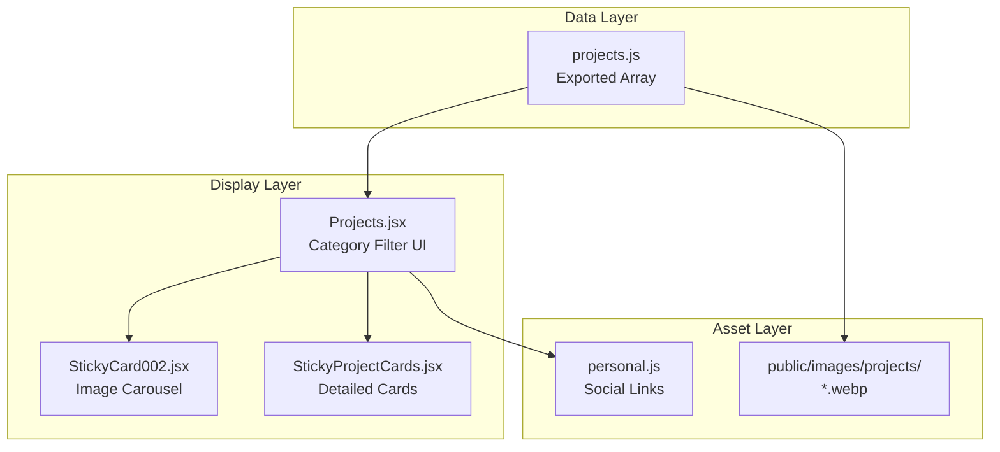
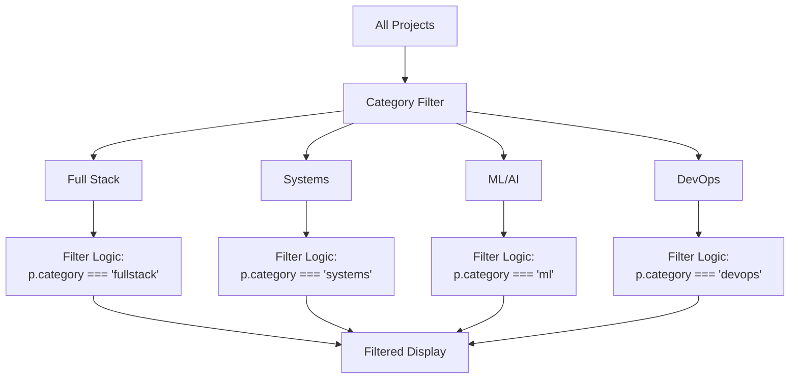
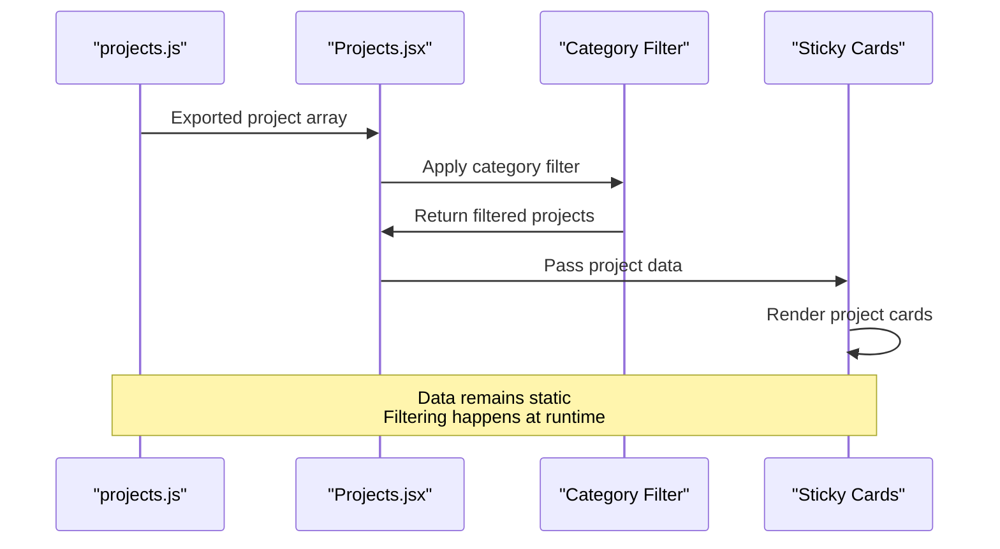
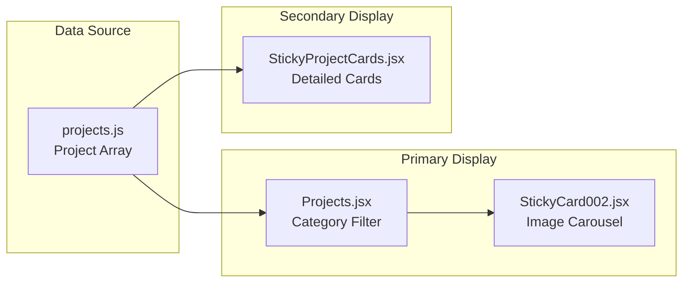
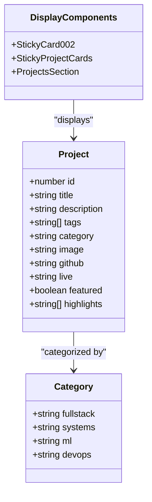
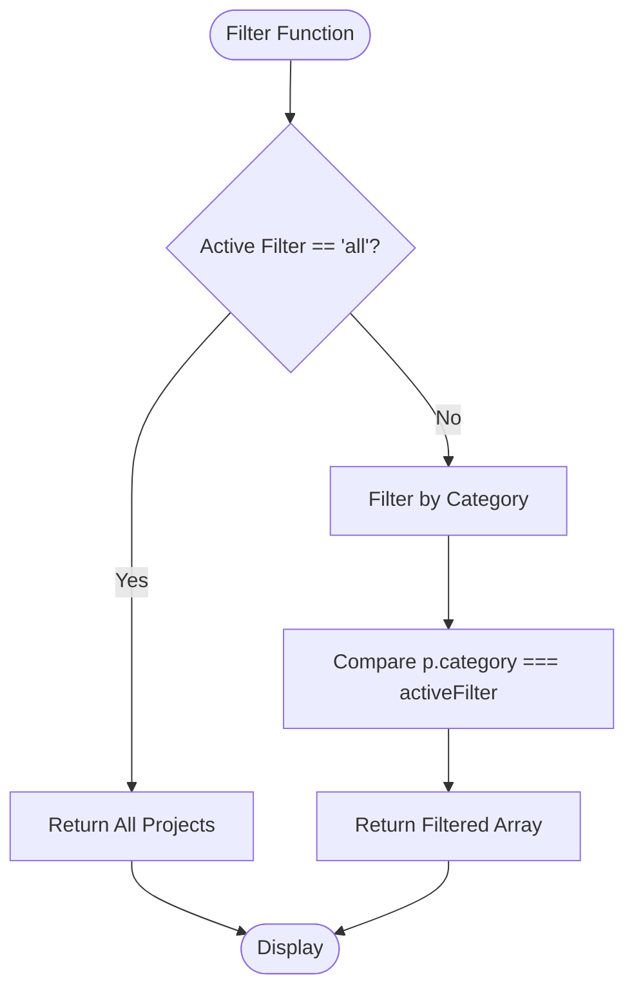
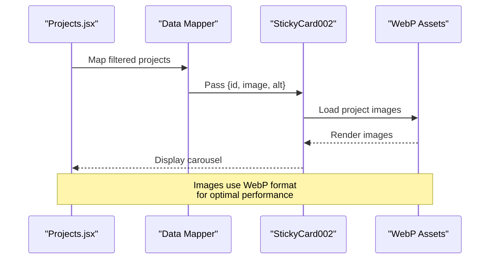
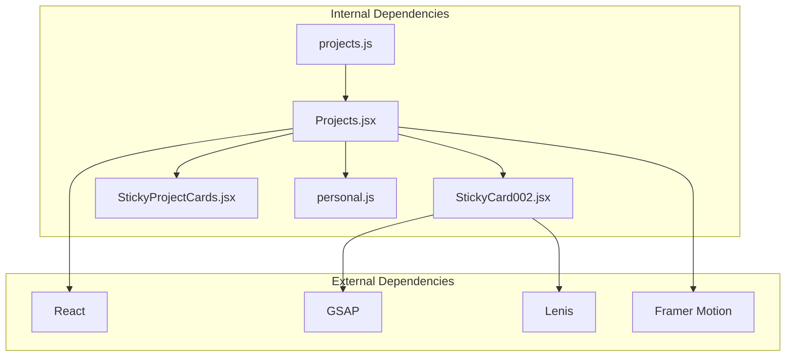
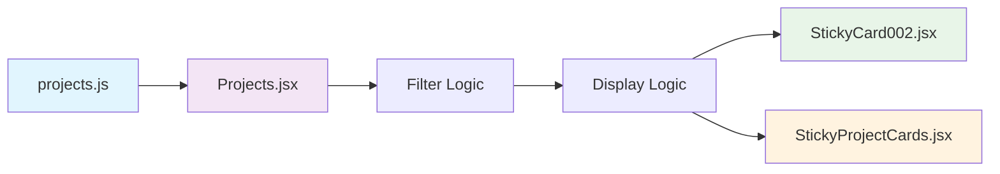
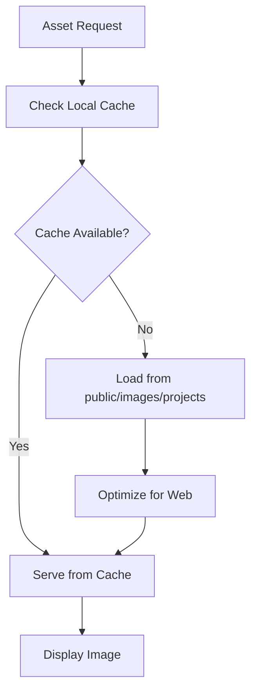

# Project Data Structure

<cite>
**Referenced Files in This Document**
- [projects.js](file://src/data/projects.js)
- [Projects.jsx](file://src/components/sections/Projects.jsx)
- [StickyCard002.jsx](file://src/components/ui/StickyCard002.jsx)
- [StickyProjectCards.jsx](file://src/components/ui/StickyProjectCards.jsx)
- [personal.js](file://src/data/personal.js)
- [README-IMAGES.md](file://README-IMAGES.md)
- [structure.md](file://.amazonq/rules/memory-bank/structure.md)
</cite>

## Table of Contents
1. [Introduction](#introduction)
2. [Project Structure](#project-structure)
3. [Core Components](#core-components)
4. [Architecture Overview](#architecture-overview)
5. [Detailed Component Analysis](#detailed-component-analysis)
6. [Dependency Analysis](#dependency-analysis)
7. [Performance Considerations](#performance-considerations)
8. [Troubleshooting Guide](#troubleshooting-guide)
9. [Conclusion](#conclusion)

## Introduction
This document provides comprehensive documentation for the project data structure used in the portfolio website. It explains the complete project object schema, the category system, filtering mechanisms, and best practices for maintaining consistent project metadata across entries. The documentation covers how projects are structured, displayed, and filtered within the application.

## Project Structure
The project data is organized as a JavaScript module that exports an array of project objects. Each project object contains standardized fields that define its metadata, categorization, and presentation details.

**Diagram sources**
- [projects.js:1-67](file://src/data/projects.js#L1-L67)
- [Projects.jsx:1-125](file://src/components/sections/Projects.jsx#L1-L125)
- [StickyCard002.jsx:1-127](file://src/components/ui/StickyCard002.jsx#L1-L127)
- [StickyProjectCards.jsx:1-146](file://src/components/ui/StickyProjectCards.jsx#L1-L146)

**Section sources**
- [projects.js:1-67](file://src/data/projects.js#L1-L67)
- [structure.md:19-31](file://.amazonq/rules/memory-bank/structure.md#L19-L31)

## Core Components

### Project Object Schema
Each project object follows a standardized structure with the following fields:

#### Basic Metadata Fields
- **id**: Unique identifier for the project (integer)
- **title**: Project name displayed prominently
- **description**: Brief description of the project's purpose and functionality
- **tags**: Array of technology and skill tags associated with the project

#### Categorization Fields
- **category**: Primary category selector (fullstack, systems, ml, devops)
- **featured**: Boolean flag indicating whether project appears in featured section

#### Media and Link Fields
- **image**: Path to project screenshot/image asset
- **github**: GitHub repository URL
- **live**: Live demo URL

#### Highlight Field
- **highlights**: Array of key achievements or features to display

**Section sources**
- [projects.js:2-17](file://src/data/projects.js#L2-L17)
- [projects.js:18-33](file://src/data/projects.js#L18-L33)
- [projects.js:34-49](file://src/data/projects.js#L34-L49)
- [projects.js:50-65](file://src/data/projects.js#L50-L65)

### Category System
The application implements a four-category filtering system:

**Diagram sources**
- [Projects.jsx:9-15](file://src/components/sections/Projects.jsx#L9-L15)
- [Projects.jsx:22-25](file://src/components/sections/Projects.jsx#L22-L25)

**Section sources**
- [Projects.jsx:9-15](file://src/components/sections/Projects.jsx#L9-L15)
- [Projects.jsx:22-25](file://src/components/sections/Projects.jsx#L22-L25)

## Architecture Overview

### Data Flow Architecture
The project data flows through a clear pipeline from storage to presentation:

**Diagram sources**
- [projects.js:1-67](file://src/data/projects.js#L1-L67)
- [Projects.jsx:17-31](file://src/components/sections/Projects.jsx#L17-L31)
- [StickyCard002.jsx:16-31](file://src/components/ui/StickyCard002.jsx#L16-L31)

### Display Architecture
The application uses two different card components for project presentation:

**Diagram sources**
- [Projects.jsx:3-6](file://src/components/sections/Projects.jsx#L3-L6)
- [StickyCard002.jsx:16-21](file://src/components/ui/StickyCard002.jsx#L16-L21)
- [StickyProjectCards.jsx:8-146](file://src/components/ui/StickyProjectCards.jsx#L8-L146)

**Section sources**
- [Projects.jsx:3-6](file://src/components/sections/Projects.jsx#L3-L6)
- [StickyCard002.jsx:16-21](file://src/components/ui/StickyCard002.jsx#L16-L21)
- [StickyProjectCards.jsx:8-146](file://src/components/ui/StickyProjectCards.jsx#L8-L146)

## Detailed Component Analysis

### Project Data Structure Implementation
The project data structure demonstrates excellent organization and consistency:

#### Field Types and Validation
- **id**: Integer (sequential numbering)
- **title**: String (descriptive project name)
- **description**: String (concise project summary)
- **tags**: Array of strings (technology stack representation)
- **category**: String (limited set: fullstack, systems, ml, devops)
- **image**: String (relative path to WebP asset)
- **github**: String (URL)
- **live**: String (URL)
- **featured**: Boolean (true/false)
- **highlights**: Array of strings (achievement bullet points)

#### Category Assignment Patterns
The projects demonstrate clear categorization patterns:

**Diagram sources**
- [projects.js:2-17](file://src/data/projects.js#L2-L17)
- [Projects.jsx:9-15](file://src/components/sections/Projects.jsx#L9-L15)

**Section sources**
- [projects.js:2-67](file://src/data/projects.js#L2-L67)

### Filtering Mechanism Analysis
The filtering system operates through a simple but effective approach:

**Diagram sources**
- [Projects.jsx:22-25](file://src/components/sections/Projects.jsx#L22-L25)

**Section sources**
- [Projects.jsx:22-25](file://src/components/sections/Projects.jsx#L22-L25)

### Image Display Architecture
The image carousel component handles project visualization:

**Diagram sources**
- [Projects.jsx:27-31](file://src/components/sections/Projects.jsx#L27-L31)
- [StickyCard002.jsx:106-119](file://src/components/ui/StickyCard002.jsx#L106-L119)

**Section sources**
- [Projects.jsx:27-31](file://src/components/sections/Projects.jsx#L27-L31)
- [StickyCard002.jsx:106-119](file://src/components/ui/StickyCard002.jsx#L106-L119)

## Dependency Analysis

### Component Dependencies
The project data structure creates clear dependency relationships:

**Diagram sources**
- [projects.js:1-67](file://src/data/projects.js#L1-L67)
- [Projects.jsx:1-7](file://src/components/sections/Projects.jsx#L1-L7)
- [StickyCard002.jsx:1-9](file://src/components/ui/StickyCard002.jsx#L1-L9)

### Data Flow Dependencies
The filtering and display system maintains loose coupling through the project data interface:

**Diagram sources**
- [projects.js:1-67](file://src/data/projects.js#L1-L67)
- [Projects.jsx:17-31](file://src/components/sections/Projects.jsx#L17-L31)

**Section sources**
- [projects.js:1-67](file://src/data/projects.js#L1-L67)
- [Projects.jsx:17-31](file://src/components/sections/Projects.jsx#L17-L31)

## Performance Considerations

### Image Optimization
The project implements several performance optimizations:

- **WebP Format**: All project images use WebP format for optimal compression
- **Size Limits**: Images constrained to 200KB maximum
- **Aspect Ratio**: Consistent 4:3 aspect ratio (800x600px)
- **Lazy Loading**: Automatic fallback gradients when images fail to load

### Filtering Performance
The filtering mechanism operates efficiently with O(n) complexity:

- **Single Pass Filtering**: Each project checked once per filter change
- **Memory Efficient**: No deep copying of project objects
- **Reactive Updates**: Filter state changes trigger minimal re-renders

### Asset Management
The image asset system ensures optimal loading:

**Diagram sources**
- [README-IMAGES.md:23-49](file://README-IMAGES.md#L23-L49)

**Section sources**
- [README-IMAGES.md:23-49](file://README-IMAGES.md#L23-L49)

## Troubleshooting Guide

### Common Issues and Solutions

#### Project Not Appearing in Filter
**Issue**: Project doesn't show up when filtering by category
**Solution**: Verify category field matches one of the allowed values: 'fullstack', 'systems', 'ml', 'devops'

#### Image Loading Failures
**Issue**: Project images not displaying
**Solution**: 
1. Ensure WebP files exist in `public/images/projects/`
2. Verify file names match project image paths
3. Check file sizes don't exceed 200KB limit

#### Filter Not Working
**Issue**: Category filter doesn't change displayed projects
**Solution**: 
1. Verify activeFilter state updates correctly
2. Check that filteredProjects array reflects filter changes
3. Ensure category values in project objects match filter keys

#### Social Links Configuration
**Issue**: GitHub link button not working
**Solution**: Verify personal.socials.github exists in personal.js data

**Section sources**
- [Projects.jsx:22-25](file://src/components/sections/Projects.jsx#L22-L25)
- [README-IMAGES.md:23-49](file://README-IMAGES.md#L23-L49)
- [personal.js:15-21](file://src/data/personal.js#L15-L21)

## Best Practices for Project Metadata

### Consistency Guidelines
1. **Category Assignment**: Assign projects to only one primary category
2. **Tag Selection**: Use industry-standard technology names
3. **Image Standards**: Maintain consistent sizing and format
4. **URL Validation**: Ensure all URLs are accessible and functional

### Metadata Organization
- **Sequential ID Numbers**: Maintain incrementing integer IDs
- **Descriptive Titles**: Use clear, professional project names
- **Concise Descriptions**: Limit to 2-3 sentences maximum
- **Achievement Highlights**: Focus on quantifiable results and features

### Asset Management
- **File Naming**: Use lowercase, hyphenated names for image files
- **Format Consistency**: All project images should be WebP format
- **Size Optimization**: Compress images to under 200KB
- **Backup Images**: Provide fallback options for failed loads

### Maintenance Recommendations
1. **Regular Audits**: Periodically review project categories and tags
2. **Link Verification**: Test all external links monthly
3. **Image Updates**: Refresh screenshots when significant changes occur
4. **Performance Monitoring**: Monitor asset loading times and optimize as needed

**Section sources**
- [README-IMAGES.md:23-49](file://README-IMAGES.md#L23-L49)
- [projects.js:1-67](file://src/data/projects.js#L1-L67)