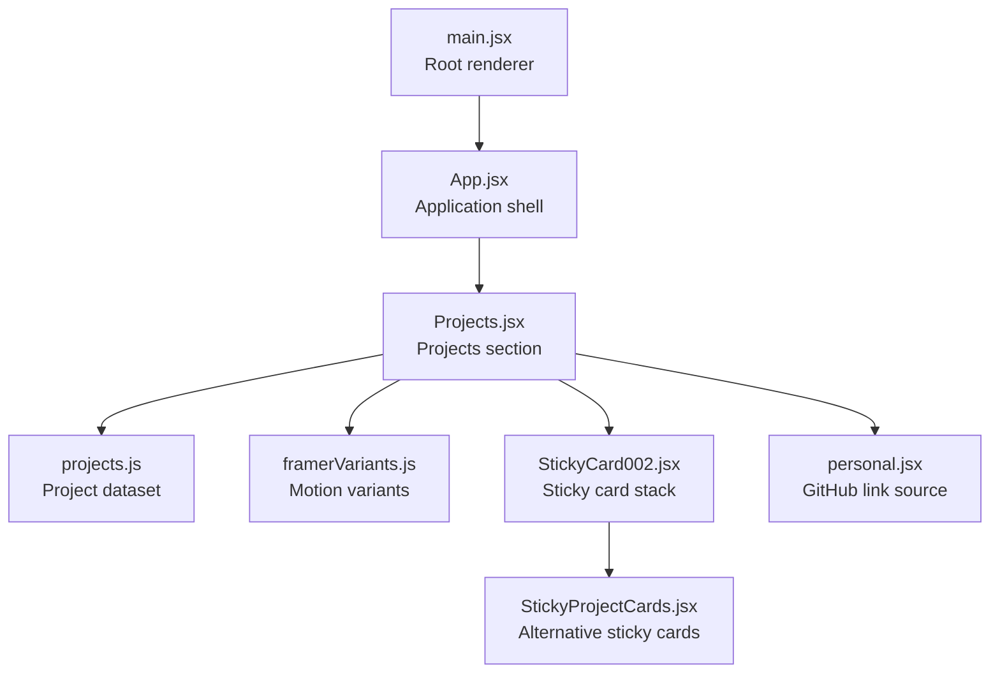
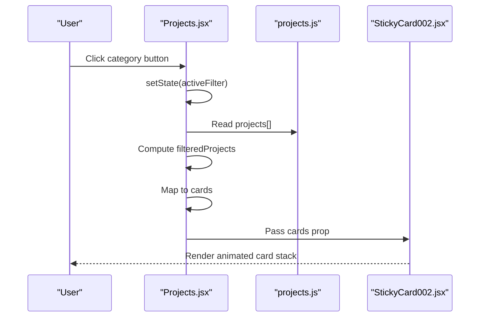
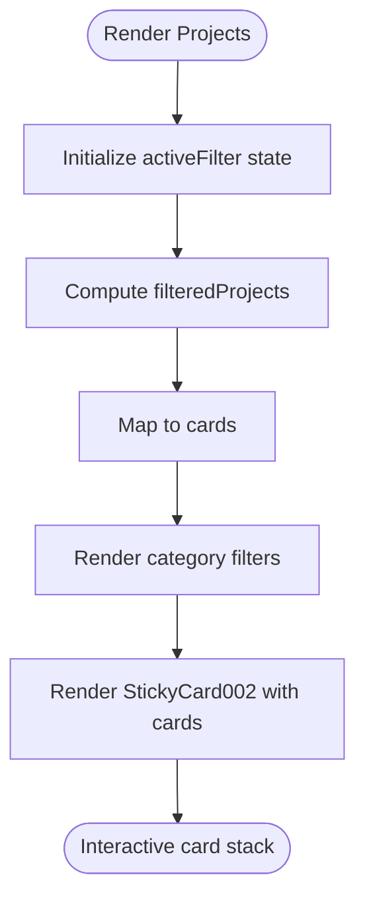
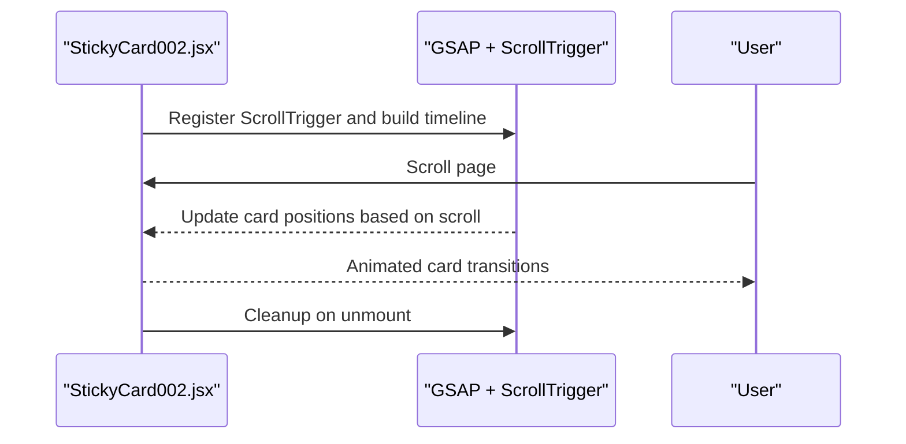
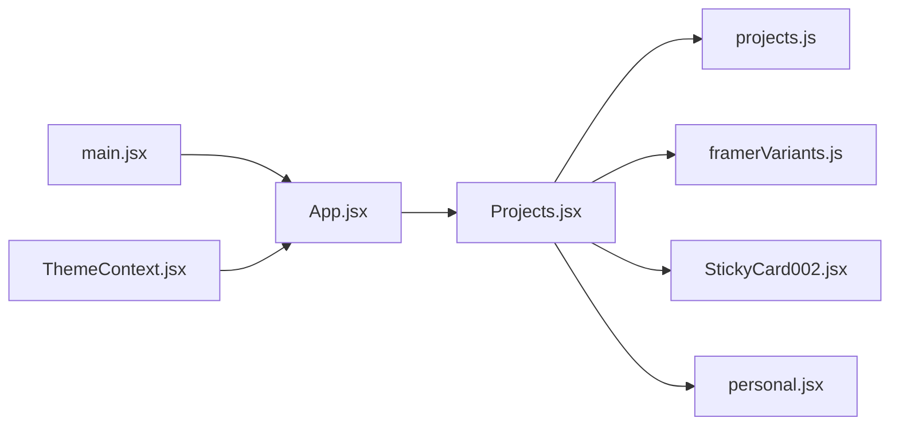

# Project Filtering and Display

<cite>
**Referenced Files in This Document**
- [Projects.jsx](file://src/components/sections/Projects.jsx)
- [projects.js](file://src/data/projects.js)
- [StickyCard002.jsx](file://src/components/ui/StickyCard002.jsx)
- [StickyProjectCards.jsx](file://src/components/ui/StickyProjectCards.jsx)
- [framerVariants.js](file://src/utils/framerVariants.js)
- [personal.jsx](file://src/data/personal.jsx)
- [App.jsx](file://src/App.jsx)
- [main.jsx](file://src/main.jsx)
- [ThemeContext.jsx](file://src/context/ThemeContext.jsx)
- [package.json](file://package.json)
</cite>

## Table of Contents
1. [Introduction](#introduction)
2. [Project Structure](#project-structure)
3. [Core Components](#core-components)
4. [Architecture Overview](#architecture-overview)
5. [Detailed Component Analysis](#detailed-component-analysis)
6. [Dependency Analysis](#dependency-analysis)
7. [Performance Considerations](#performance-considerations)
8. [Troubleshooting Guide](#troubleshooting-guide)
9. [Conclusion](#conclusion)
10. [Appendices](#appendices)

## Introduction
This document explains the project filtering and display system used in the portfolio. It focuses on how category-based filtering works in the Projects section, how filter state is managed and rendered, how featured projects are highlighted, and how projects are sorted and displayed. It also covers the responsive grid layout, mobile optimization, and interactive project cards. Finally, it provides practical guidance for extending the system with new filter categories, customizing display logic, and implementing additional filtering criteria, along with performance considerations for large project galleries.

## Project Structure
The project gallery is implemented as a dedicated section that renders a set of project cards with category-based filtering. The key pieces are:
- Projects section component that manages filter state and renders filtered project cards
- Project data model with category and featured flags
- Sticky card presentation components for an immersive scrolling experience
- Motion and intersection observer utilities for animations and visibility detection

**Diagram sources**
- [main.jsx:1-16](file://src/main.jsx#L1-L16)
- [App.jsx:15-47](file://src/App.jsx#L15-L47)
- [Projects.jsx:17-122](file://src/components/sections/Projects.jsx#L17-L122)
- [projects.js:1-67](file://src/data/projects.js#L1-L67)
- [framerVariants.js:1-17](file://src/utils/framerVariants.js#L1-L17)
- [StickyCard002.jsx:16-126](file://src/components/ui/StickyCard002.jsx#L16-L126)
- [StickyProjectCards.jsx:8-146](file://src/components/ui/StickyProjectCards.jsx#L8-L146)
- [personal.jsx:1-61](file://src/data/personal.jsx#L1-L61)

**Section sources**
- [Projects.jsx:17-122](file://src/components/sections/Projects.jsx#L17-L122)
- [projects.js:1-67](file://src/data/projects.js#L1-L67)
- [StickyCard002.jsx:16-126](file://src/components/ui/StickyCard002.jsx#L16-L126)
- [framerVariants.js:1-17](file://src/utils/framerVariants.js#L1-L17)
- [personal.jsx:1-61](file://src/data/personal.jsx#L1-L61)
- [App.jsx:15-47](file://src/App.jsx#L15-L47)
- [main.jsx:1-16](file://src/main.jsx#L1-L16)

## Core Components
- Projects section: Manages active filter state, computes filtered projects, transforms data for card rendering, and renders category filters and the sticky card stack.
- Project data: Defines project entries with category, featured flag, and metadata used for filtering and display.
- Sticky card components: Provide animated, pinned, and scroll-driven card stacks for immersive browsing.
- Motion utilities: Provide animation variants for entrance and header animations.
- Personal data: Supplies the GitHub URL used in the call-to-action.

Key responsibilities:
- Filter state management: Active filter is stored in component state and toggled by user interaction.
- Filtering logic: A simple equality check against the category field produces the filtered list.
- Display transformation: Projects are mapped to a minimal card shape with id, image, and alt for the sticky card stack.
- Featured highlighting: Projects with the featured flag render a special badge in the card content.
- Responsive layout: Tailwind classes ensure proper responsiveness across breakpoints.

**Section sources**
- [Projects.jsx:17-122](file://src/components/sections/Projects.jsx#L17-L122)
- [projects.js:1-67](file://src/data/projects.js#L1-L67)
- [StickyCard002.jsx:16-126](file://src/components/ui/StickyCard002.jsx#L16-L126)
- [framerVariants.js:1-17](file://src/utils/framerVariants.js#L1-L17)
- [personal.jsx:1-61](file://src/data/personal.jsx#L1-L61)

## Architecture Overview
The Projects section orchestrates filtering and display:
- State: activeFilter holds the currently selected category.
- Computation: filteredProjects is derived from the activeFilter and the project dataset.
- Presentation: cards is a transformed subset of filtered projects optimized for the sticky card stack.
- Interaction: Category buttons update activeFilter, re-computing filteredProjects and cards.

**Diagram sources**
- [Projects.jsx:17-122](file://src/components/sections/Projects.jsx#L17-L122)
- [projects.js:1-67](file://src/data/projects.js#L1-L67)
- [StickyCard002.jsx:16-126](file://src/components/ui/StickyCard002.jsx#L16-L126)

## Detailed Component Analysis

### Projects Section: Filtering and Display
- Filter state: A local state variable tracks the active category.
- Filtering logic: When the active filter is "all", the entire dataset is shown; otherwise, projects are filtered by category equality.
- Card transformation: The filtered projects are mapped to a compact shape containing id, image, and alt for the card stack.
- UI: Category buttons render with conditional styling based on the active filter; clicking a button updates the filter state.

Featured project highlighting:
- The project dataset includes a featured flag per project.
- The sticky card component conditionally renders a "Featured" badge when the project is marked as featured.

Sorting behavior:
- No explicit sort is applied; the order follows the original dataset order.

Responsive layout and mobile optimization:
- The filter row uses flex wrapping and spacing utilities to adapt to small screens.
- The sticky card container applies responsive max widths and padding adjustments across breakpoints.
- The card content area uses responsive flex directions to stack vertically on smaller screens.

Interactive project cards:
- The sticky card stack uses scroll-triggered animations to transition between cards as the user scrolls.
- Hover states reveal action buttons and subtle scaling for visual feedback.

**Diagram sources**
- [Projects.jsx:17-122](file://src/components/sections/Projects.jsx#L17-L122)
- [StickyCard002.jsx:16-126](file://src/components/ui/StickyCard002.jsx#L16-L126)

**Section sources**
- [Projects.jsx:17-122](file://src/components/sections/Projects.jsx#L17-L122)
- [projects.js:1-67](file://src/data/projects.js#L1-L67)
- [StickyCard002.jsx:16-126](file://src/components/ui/StickyCard002.jsx#L16-L126)

### Sticky Card Stack: Animation and Behavior
- The sticky card stack uses GSAP timeline and ScrollTrigger to pin and animate cards as the user scrolls.
- The component sets initial positions for cards and animates transitions between adjacent cards.
- It handles resize events and cleans up resources on unmount.

**Diagram sources**
- [StickyCard002.jsx:25-95](file://src/components/ui/StickyCard002.jsx#L25-L95)

**Section sources**
- [StickyCard002.jsx:16-126](file://src/components/ui/StickyCard002.jsx#L16-L126)

### Alternative Sticky Cards Implementation
An alternate sticky card component demonstrates a similar scroll-driven animation pattern with a simplified card structure.

**Section sources**
- [StickyProjectCards.jsx:8-146](file://src/components/ui/StickyProjectCards.jsx#L8-L146)

### Motion and Visibility Utilities
- Framer Motion variants define staggered entrance animations for the header and child elements.
- An intersection observer detects when the section enters the viewport to trigger animations.

**Section sources**
- [framerVariants.js:1-17](file://src/utils/framerVariants.js#L1-L17)
- [Projects.jsx:17-122](file://src/components/sections/Projects.jsx#L17-L122)

### Personal Data Integration
- The GitHub URL used in the call-to-action is sourced from the personal data file.

**Section sources**
- [personal.jsx:1-61](file://src/data/personal.jsx#L1-L61)
- [Projects.jsx:17-122](file://src/components/sections/Projects.jsx#L17-L122)

## Dependency Analysis
The Projects section depends on:
- Project dataset for filtering and display
- Motion utilities for entrance animations
- Sticky card components for rendering
- Personal data for the GitHub link

**Diagram sources**
- [Projects.jsx:17-122](file://src/components/sections/Projects.jsx#L17-L122)
- [projects.js:1-67](file://src/data/projects.js#L1-L67)
- [framerVariants.js:1-17](file://src/utils/framerVariants.js#L1-L17)
- [StickyCard002.jsx:16-126](file://src/components/ui/StickyCard002.jsx#L16-L126)
- [personal.jsx:1-61](file://src/data/personal.jsx#L1-L61)
- [App.jsx:15-47](file://src/App.jsx#L15-L47)
- [main.jsx:1-16](file://src/main.jsx#L1-L16)
- [ThemeContext.jsx:1-23](file://src/context/ThemeContext.jsx#L1-L23)

**Section sources**
- [Projects.jsx:17-122](file://src/components/sections/Projects.jsx#L17-L122)
- [App.jsx:15-47](file://src/App.jsx#L15-L47)
- [main.jsx:1-16](file://src/main.jsx#L1-L16)
- [ThemeContext.jsx:1-23](file://src/context/ThemeContext.jsx#L1-L23)

## Performance Considerations
Current implementation characteristics:
- Filtering is performed via a simple equality check against the category field, which is efficient for moderate datasets.
- The card stack uses GSAP and ScrollTrigger, which are GPU-accelerated and optimized for smooth scrolling.
- The project images are rendered as static assets; no lazy loading is implemented in the current gallery.

Recommendations for large galleries:
- Lazy load images below the fold using native lazy loading attributes or a library to reduce initial payload.
- Virtualize the card stack if the number of projects grows significantly to limit DOM nodes and memory usage.
- Debounce or throttle filter updates if additional dynamic filters are introduced.
- Memoize derived computations (filteredProjects and cards) to avoid unnecessary recalculations on re-renders.
- Consider server-side pagination or progressive loading for very large datasets.

[No sources needed since this section provides general guidance]

## Troubleshooting Guide
Common issues and resolutions:
- Filter not updating: Ensure the category button handlers correctly update the active filter state.
- Featured badge not appearing: Confirm the project dataset includes the featured flag for intended projects.
- Cards not animating: Verify that the sticky card component receives the cards prop and that ScrollTrigger is registered.
- GitHub link missing: Check that the personal data file contains a valid GitHub URL.

**Section sources**
- [Projects.jsx:17-122](file://src/components/sections/Projects.jsx#L17-L122)
- [projects.js:1-67](file://src/data/projects.js#L1-L67)
- [StickyCard002.jsx:16-126](file://src/components/ui/StickyCard002.jsx#L16-L126)
- [personal.jsx:1-61](file://src/data/personal.jsx#L1-L61)

## Conclusion
The project filtering and display system centers on a simple, effective category-based filter with a visually engaging sticky card stack. The design balances clarity and performance, leveraging modern animation libraries and responsive utilities. Extending the system—such as adding new categories, customizing display logic, or introducing additional filters—is straightforward due to the clear separation of concerns and modular components.

[No sources needed since this section summarizes without analyzing specific files]

## Appendices

### How to Add New Filter Categories
- Extend the category list in the Projects component with a new category object containing a unique key and label.
- Add a corresponding category value to the category field in relevant project entries.
- Optionally, introduce additional filtering criteria by augmenting the filtering computation to include extra conditions.

**Section sources**
- [Projects.jsx:9-15](file://src/components/sections/Projects.jsx#L9-L15)
- [projects.js:1-67](file://src/data/projects.js#L1-L67)

### How to Customize Display Logic
- Modify the card transformation to include additional fields from the project dataset.
- Adjust the sticky card component props to pass more detailed project data if needed.
- Update the card rendering logic to show or hide specific elements based on project metadata.

**Section sources**
- [Projects.jsx:27-31](file://src/components/sections/Projects.jsx#L27-L31)
- [StickyCard002.jsx:106-119](file://src/components/ui/StickyCard002.jsx#L106-L119)

### Implementing Additional Filtering Criteria
- Expand the filtering computation to include extra fields (e.g., tags, year, or featured).
- Add UI controls for the new criteria alongside the existing category filters.
- Ensure the filter state integrates seamlessly with the existing activeFilter mechanism.

**Section sources**
- [Projects.jsx:22-25](file://src/components/sections/Projects.jsx#L22-L25)

### Performance Enhancements for Large Galleries
- Introduce lazy loading for images and virtualize the card stack.
- Memoize derived computations and avoid unnecessary re-renders.
- Consider pagination or progressive loading to manage memory and initial load times.

[No sources needed since this section provides general guidance]