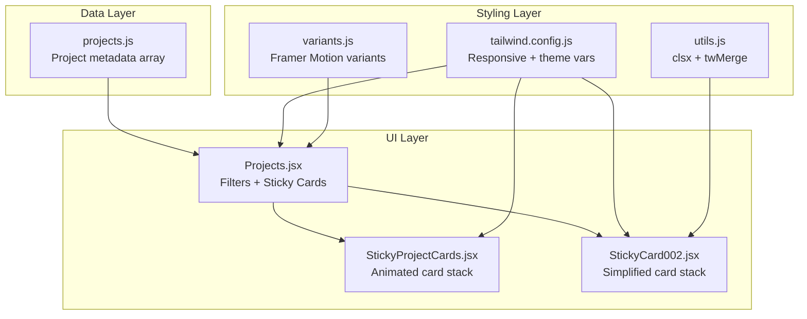
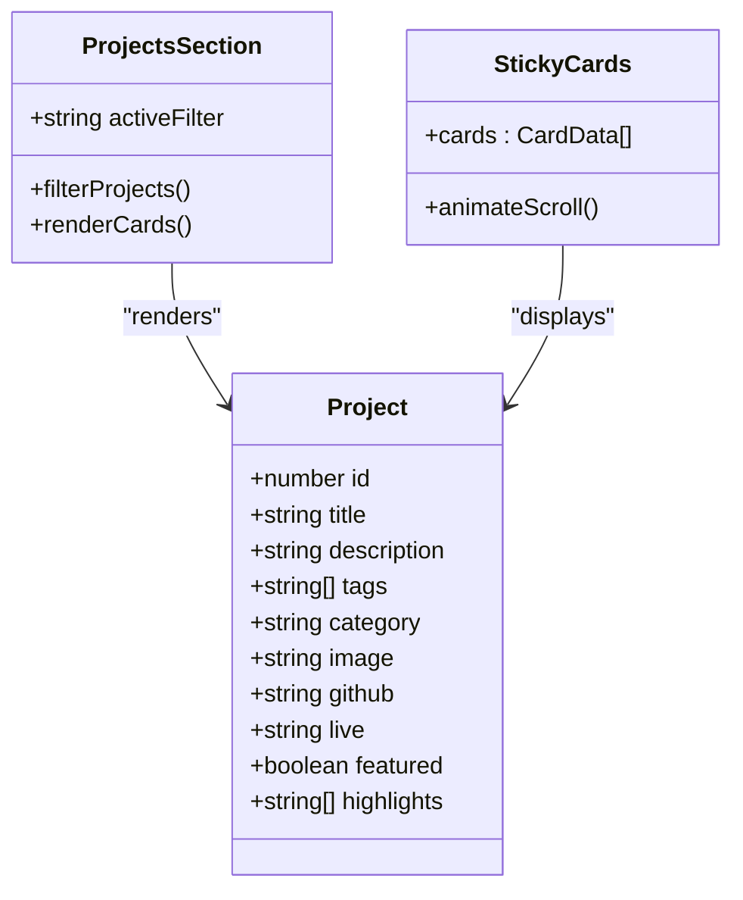
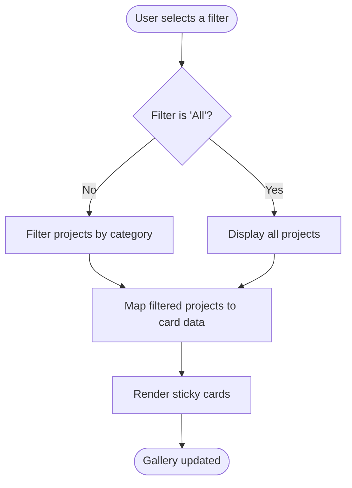
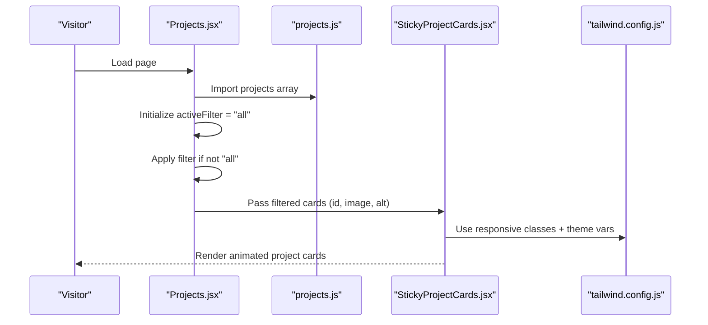
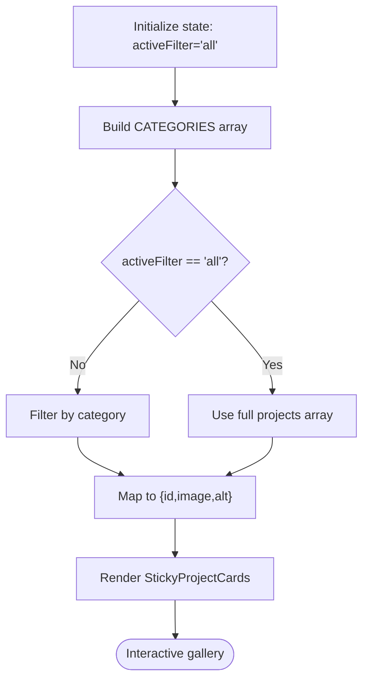
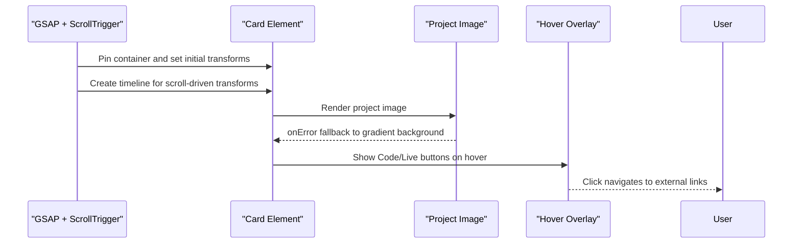
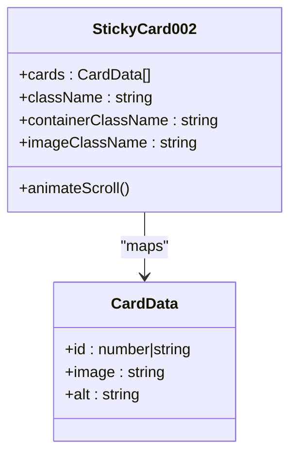
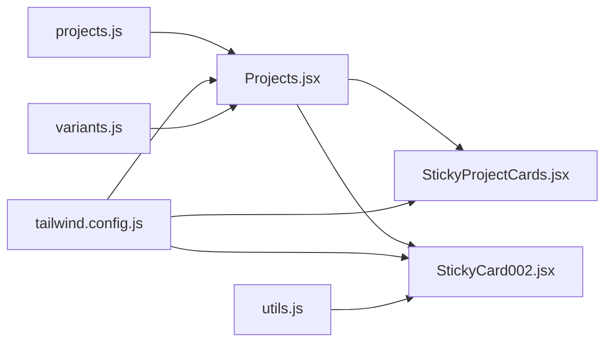

# Project Showcase Management

<cite>
**Referenced Files in This Document**
- [projects.js](file://src/data/projects.js)
- [Projects.jsx](file://src/components/sections/Projects.jsx)
- [StickyProjectCards.jsx](file://src/components/ui/StickyProjectCards.jsx)
- [StickyCard002.jsx](file://src/components/ui/StickyCard002.jsx)
- [README-IMAGES.md](file://README-IMAGES.md)
- [HOW-TO-ADD-IMAGES.md](file://HOW-TO-ADD-IMAGES.md)
- [tailwind.config.js](file://tailwind.config.js)
- [variants.js](file://src/utils/variants.js)
- [utils.js](file://src/lib/utils.js)
</cite>

## Table of Contents
1. [Introduction](#introduction)
2. [Project Structure](#project-structure)
3. [Core Components](#core-components)
4. [Architecture Overview](#architecture-overview)
5. [Detailed Component Analysis](#detailed-component-analysis)
6. [Dependency Analysis](#dependency-analysis)
7. [Performance Considerations](#performance-considerations)
8. [Troubleshooting Guide](#troubleshooting-guide)
9. [Conclusion](#conclusion)
10. [Appendices](#appendices)

## Introduction
This document provides a comprehensive guide to managing the portfolio's project gallery. It explains the project data structure, category organization, filtering mechanisms, and how to add new projects. It also covers image optimization requirements, file naming conventions, and integration with GitHub for project links. Step-by-step instructions are included for adding project links, screenshots, and live demos, along with best practices for categorization, filtering, and mobile-responsive displays.

## Project Structure
The project showcase is composed of:
- Data layer: a JavaScript array of project objects containing metadata, categories, and links
- UI layer: a section component that renders filtered projects using animated sticky cards
- Styling layer: Tailwind CSS configuration enabling responsive design and theme variables

**Diagram sources**
- [projects.js:1-67](file://src/data/projects.js#L1-L67)
- [Projects.jsx:1-125](file://src/components/sections/Projects.jsx#L1-L125)
- [StickyProjectCards.jsx:1-145](file://src/components/ui/StickyProjectCards.jsx#L1-L145)
- [StickyCard002.jsx:1-127](file://src/components/ui/StickyCard002.jsx#L1-L127)
- [tailwind.config.js:1-54](file://tailwind.config.js#L1-L54)
- [utils.js:1-7](file://src/lib/utils.js#L1-L7)
- [variants.js:1-17](file://src/utils/variants.js#L1-L17)

**Section sources**
- [projects.js:1-67](file://src/data/projects.js#L1-L67)
- [Projects.jsx:1-125](file://src/components/sections/Projects.jsx#L1-L125)
- [tailwind.config.js:1-54](file://tailwind.config.js#L1-L54)

## Core Components
This section documents the project data model and the UI components responsible for rendering and filtering the project gallery.

### Project Data Model
Each project object includes:
- id: Unique identifier
- title: Project name
- description: Brief overview
- tags: Technology stack or keywords
- category: One of fullstack, systems, ml, devops
- image: Path to the WebP screenshot
- github: GitHub repository URL
- live: Live demo URL
- featured: Boolean flag for highlighting
- highlights: Array of up to three bullet points

**Diagram sources**
- [projects.js:1-67](file://src/data/projects.js#L1-L67)
- [Projects.jsx:17-31](file://src/components/sections/Projects.jsx#L17-L31)
- [StickyProjectCards.jsx:8-145](file://src/components/ui/StickyProjectCards.jsx#L8-L145)

**Section sources**
- [projects.js:1-67](file://src/data/projects.js#L1-L67)

### Filtering Mechanism
The Projects section defines category filters and applies a simple filter function to the project list.

**Diagram sources**
- [Projects.jsx:9-25](file://src/components/sections/Projects.jsx#L9-L25)

**Section sources**
- [Projects.jsx:9-25](file://src/components/sections/Projects.jsx#L9-L25)

### Mobile-Responsive Display
The gallery uses Tailwind utility classes to adapt layouts across breakpoints and includes theme-aware color variables.

Key responsive patterns:
- Container widths: max-w-3xl on desktop, smaller on mobile
- Flex direction changes: column on small screens, row on medium+
- Spacing adjustments: padding and margins scale with screen size
- Theme variables: colors mapped to CSS variables for dark/light modes

**Section sources**
- [Projects.jsx:34-121](file://src/components/sections/Projects.jsx#L34-L121)
- [tailwind.config.js:1-54](file://tailwind.config.js#L1-L54)

## Architecture Overview
The project showcase integrates data, UI, and styling to deliver an animated, categorized gallery with smooth scrolling and responsive behavior.

**Diagram sources**
- [Projects.jsx:1-125](file://src/components/sections/Projects.jsx#L1-L125)
- [projects.js:1-67](file://src/data/projects.js#L1-L67)
- [StickyProjectCards.jsx:1-145](file://src/components/ui/StickyProjectCards.jsx#L1-L145)
- [tailwind.config.js:1-54](file://tailwind.config.js#L1-L54)

## Detailed Component Analysis

### Projects Section (Filtering + Rendering)
Responsibilities:
- Define category filters
- Filter projects by category
- Map filtered projects to card data
- Render animated sticky cards

**Diagram sources**
- [Projects.jsx:9-31](file://src/components/sections/Projects.jsx#L9-L31)

**Section sources**
- [Projects.jsx:9-31](file://src/components/sections/Projects.jsx#L9-L31)

### StickyProjectCards Component (Animation + Interaction)
Responsibilities:
- Animate a stack of cards during scroll
- Handle hover overlays with Code and Live links
- Display project metadata (title, description, tags, highlights)
- Fallback to gradient backgrounds if images fail to load

**Diagram sources**
- [StickyProjectCards.jsx:12-49](file://src/components/ui/StickyProjectCards.jsx#L12-L49)
- [StickyProjectCards.jsx:66-102](file://src/components/ui/StickyProjectCards.jsx#L66-L102)

**Section sources**
- [StickyProjectCards.jsx:12-49](file://src/components/ui/StickyProjectCards.jsx#L12-L49)
- [StickyProjectCards.jsx:66-102](file://src/components/ui/StickyProjectCards.jsx#L66-L102)

### StickyCard002 Component (Simplified Animation)
Responsibilities:
- Render a pure image stack with scroll-driven animations
- Use clsx/twMerge for conditional class composition
- Support responsive container sizing

**Diagram sources**
- [StickyCard002.jsx:11-21](file://src/components/ui/StickyCard002.jsx#L11-L21)
- [StickyCard002.jsx:97-123](file://src/components/ui/StickyCard002.jsx#L97-L123)

**Section sources**
- [StickyCard002.jsx:11-21](file://src/components/ui/StickyCard002.jsx#L11-L21)
- [utils.js:4-6](file://src/lib/utils.js#L4-L6)

### Image Handling and Fallbacks
Behavior:
- Project images are loaded from public/images/projects/
- Fallback: gradient background with accent color when images fail
- Headshots and OG images have separate fallbacks documented elsewhere

**Section sources**
- [README-IMAGES.md:23-50](file://README-IMAGES.md#L23-L50)
- [StickyProjectCards.jsx:70-75](file://src/components/ui/StickyProjectCards.jsx#L70-L75)

## Dependency Analysis
The project showcase relies on:
- Data import from projects.js
- UI components for rendering and animation
- Tailwind CSS for responsive design and theme variables
- Utility functions for class merging

**Diagram sources**
- [projects.js:1-67](file://src/data/projects.js#L1-L67)
- [Projects.jsx:1-7](file://src/components/sections/Projects.jsx#L1-L7)
- [StickyProjectCards.jsx:1-6](file://src/components/ui/StickyProjectCards.jsx#L1-L6)
- [StickyCard002.jsx:1-9](file://src/components/ui/StickyCard002.jsx#L1-L9)
- [tailwind.config.js:1-54](file://tailwind.config.js#L1-L54)
- [utils.js:1-7](file://src/lib/utils.js#L1-L7)
- [variants.js:1-17](file://src/utils/variants.js#L1-L17)

**Section sources**
- [Projects.jsx:1-7](file://src/components/sections/Projects.jsx#L1-L7)
- [tailwind.config.js:1-54](file://tailwind.config.js#L1-L54)

## Performance Considerations
- Image optimization: Use WebP format with recommended dimensions and file sizes to minimize bandwidth and improve loading times
- Lazy loading: Consider lazy-loading images when scrolling to further reduce initial payload
- Animation cost: Keep transforms minimal; avoid heavy GPU-intensive effects on low-end devices
- Responsive breakpoints: Tailwind utilities ensure efficient rendering across devices without custom CSS bloat
- Fallbacks: Graceful degradation prevents layout shifts when images fail to load

[No sources needed since this section provides general guidance]

## Troubleshooting Guide
Common issues and resolutions:
- Missing project images: The component falls back to a gradient background with the project's accent color
- Incorrect image paths: Ensure images are placed under public/images/projects/ with exact filenames matching the project.image field
- Links not opening: Verify github and live URLs are valid and use https protocol
- Filtering not working: Confirm category values match the allowed keys (fullstack, systems, ml, devops)
- Mobile layout problems: Check Tailwind breakpoint classes and ensure container widths are appropriate for small screens

**Section sources**
- [README-IMAGES.md:101-113](file://README-IMAGES.md#L101-L113)
- [StickyProjectCards.jsx:66-75](file://src/components/ui/StickyProjectCards.jsx#L66-L75)

## Conclusion
The project showcase combines a clean data model with animated, responsive UI components to present a polished portfolio gallery. By following the guidelines for project metadata, category organization, and image optimization, you can maintain a fast, visually appealing, and easy-to-navigate project gallery.

[No sources needed since this section summarizes without analyzing specific files]

## Appendices

### Adding New Projects
Step-by-step process:
1. Prepare project assets
   - Capture a 800x600px WebP screenshot named after the project slug
   - Place the image in public/images/projects/
2. Update the data file
   - Add a new project object with required fields
   - Set category to one of fullstack, systems, ml, devops
   - Configure featured flag if applicable
3. Configure links
   - Set github to the repository URL
   - Set live to the deployed demo URL
4. Review and test
   - Run the development server to preview
   - Verify filtering and mobile responsiveness

**Section sources**
- [projects.js:1-67](file://src/data/projects.js#L1-L67)
- [README-IMAGES.md:23-50](file://README-IMAGES.md#L23-L50)

### Image Optimization Requirements
- Format: WebP preferred
- Dimensions: 800x600px (4:3 aspect ratio)
- File size: Under 200KB per image
- Naming: Match the project.image field exactly
- Fallback: Gradient background if images fail to load

**Section sources**
- [README-IMAGES.md:32-42](file://README-IMAGES.md#L32-L42)
- [StickyProjectCards.jsx:70-75](file://src/components/ui/StickyProjectCards.jsx#L70-L75)

### GitHub Integration
- The gallery links to GitHub repositories via the github field
- A global GitHub call-to-action is available in the section footer
- Ensure repository URLs are accurate and publicly accessible

**Section sources**
- [projects.js:8-10](file://src/data/projects.js#L8-L10)
- [Projects.jsx:100-116](file://src/components/sections/Projects.jsx#L100-L116)

### Best Practices for Categorization and Filtering
- Use consistent category values: fullstack, systems, ml, devops
- Keep tags concise and relevant to the project scope
- Limit highlights to three key achievements or features
- Maintain a balanced mix of featured and non-featured projects

**Section sources**
- [Projects.jsx:9-15](file://src/components/sections/Projects.jsx#L9-L15)
- [projects.js:6-16](file://src/data/projects.js#L6-L16)

### Mobile-Responsive Guidelines
- Use Tailwind breakpoints to adjust layout and spacing
- Prefer flexible containers with max-width constraints
- Ensure touch targets are adequately sized for navigation
- Test on various screen sizes to confirm readability and usability

**Section sources**
- [Projects.jsx:34-121](file://src/components/sections/Projects.jsx#L34-L121)
- [tailwind.config.js:18-22](file://tailwind.config.js#L18-L22)