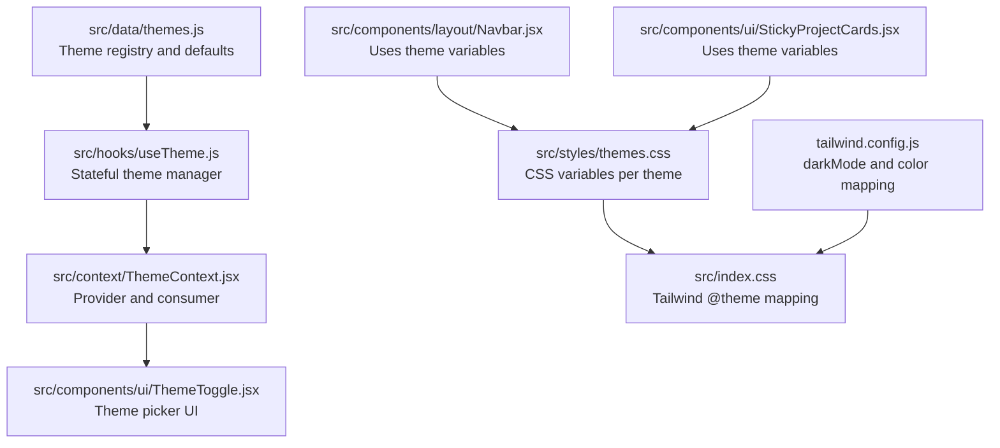
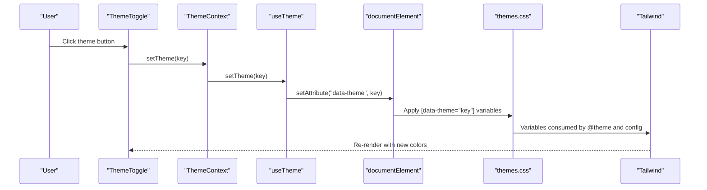
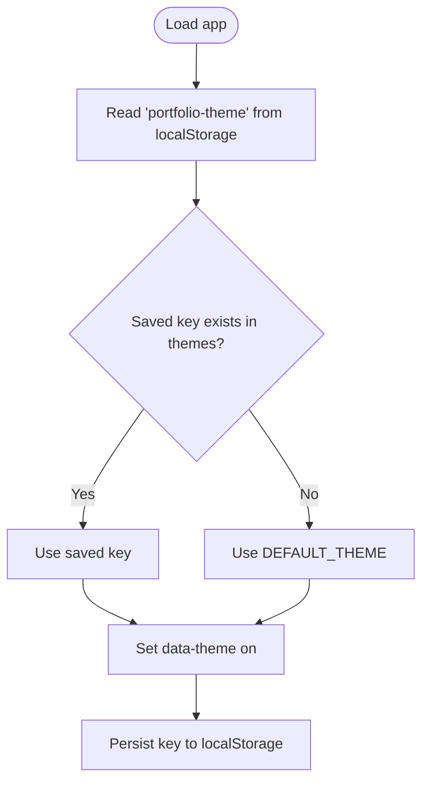
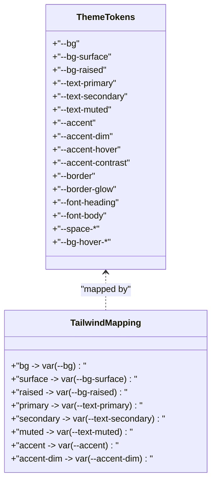
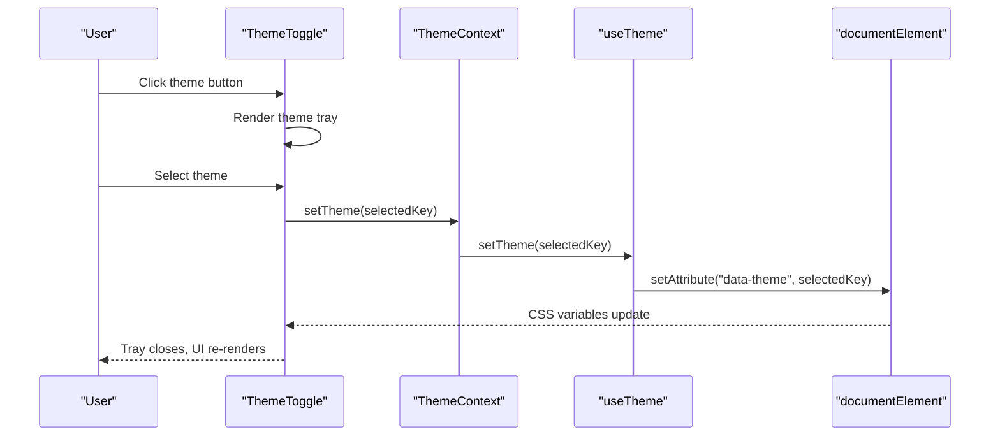
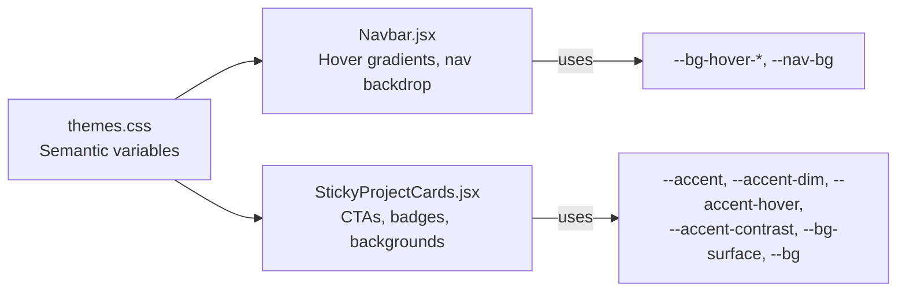
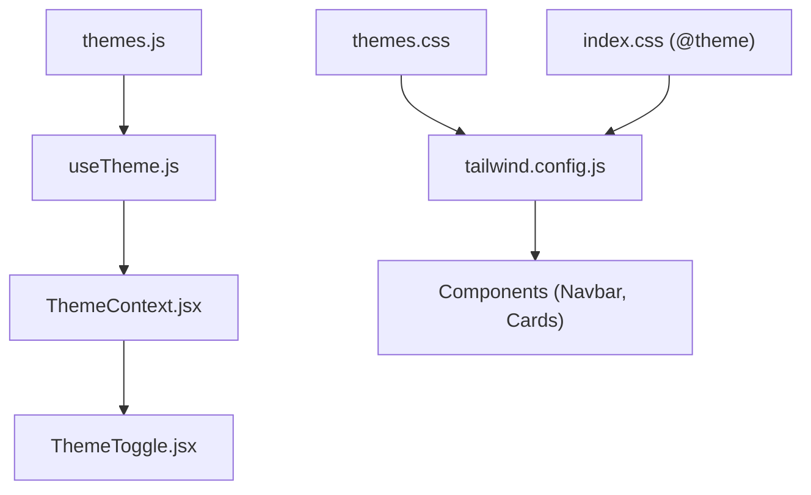

# Color Schemes Management

<cite>
**Referenced Files in This Document**
- [themes.js](file://src/data/themes.js)
- [ThemeContext.jsx](file://src/context/ThemeContext.jsx)
- [useTheme.js](file://src/hooks/useTheme.js)
- [themes.css](file://src/styles/themes.css)
- [index.css](file://src/index.css)
- [ThemeToggle.jsx](file://src/components/ui/ThemeToggle.jsx)
- [Navbar.jsx](file://src/components/layout/Navbar.jsx)
- [StickyProjectCards.jsx](file://src/components/ui/StickyProjectCards.jsx)
- [tailwind.config.js](file://tailwind.config.js)
- [DESIGN-CHANGES.md](file://DESIGN-CHANGES.md)
</cite>

## Table of Contents
1. [Introduction](#introduction)
2. [Project Structure](#project-structure)
3. [Core Components](#core-components)
4. [Architecture Overview](#architecture-overview)
5. [Detailed Component Analysis](#detailed-component-analysis)
6. [Dependency Analysis](#dependency-analysis)
7. [Performance Considerations](#performance-considerations)
8. [Troubleshooting Guide](#troubleshooting-guide)
9. [Conclusion](#conclusion)
10. [Appendices](#appendices)

## Introduction
This document explains how the portfolio’s color scheme management works end-to-end. It covers the theme data structure, CSS variable mapping, React-based theme switching, Tailwind integration, and best practices for maintaining semantic color naming, accessibility, and consistency across components. It also provides practical guidance for modifying existing themes, adding new color variations, and integrating brand colors while preserving responsive and motion-friendly behavior.

## Project Structure
The color system is organized around three pillars:
- Theme metadata and defaults
- CSS custom properties mapped per theme
- React hooks and UI controls that apply and persist theme changes

**Diagram sources**
- [themes.js:1-30](file://src/data/themes.js#L1-L30)
- [useTheme.js:1-33](file://src/hooks/useTheme.js#L1-L33)
- [ThemeContext.jsx:1-23](file://src/context/ThemeContext.jsx#L1-L23)
- [ThemeToggle.jsx:1-113](file://src/components/ui/ThemeToggle.jsx#L1-L113)
- [themes.css:1-339](file://src/styles/themes.css#L1-L339)
- [index.css:1-153](file://src/index.css#L1-L153)
- [tailwind.config.js:1-54](file://tailwind.config.js#L1-L54)
- [Navbar.jsx:1-255](file://src/components/layout/Navbar.jsx#L1-L255)
- [StickyProjectCards.jsx:1-147](file://src/components/ui/StickyProjectCards.jsx#L1-L147)

**Section sources**
- [themes.js:1-30](file://src/data/themes.js#L1-L30)
- [useTheme.js:1-33](file://src/hooks/useTheme.js#L1-L33)
- [ThemeContext.jsx:1-23](file://src/context/ThemeContext.jsx#L1-L23)
- [ThemeToggle.jsx:1-113](file://src/components/ui/ThemeToggle.jsx#L1-L113)
- [themes.css:1-339](file://src/styles/themes.css#L1-L339)
- [index.css:1-153](file://src/index.css#L1-L153)
- [tailwind.config.js:1-54](file://tailwind.config.js#L1-L54)
- [Navbar.jsx:1-255](file://src/components/layout/Navbar.jsx#L1-L255)
- [StickyProjectCards.jsx:1-147](file://src/components/ui/StickyProjectCards.jsx#L1-L147)

## Core Components
- Theme registry: Defines available themes, labels, previews, and defaults.
- Theme manager: Persists and applies the selected theme to the document element and local storage.
- Theme provider: Exposes theme state and helpers to components.
- Theme picker: UI to cycle and select themes.
- CSS variables: Per-theme color tokens mapped to semantic names.
- Tailwind integration: Maps CSS variables to Tailwind utilities for consistent component styling.

Key responsibilities:
- Maintain semantic color naming (e.g., --text-primary, --accent, --bg-surface).
- Ensure accessibility by validating contrast ratios and respecting reduced motion.
- Keep transitions smooth and performant across theme switches.

**Section sources**
- [themes.js:1-30](file://src/data/themes.js#L1-L30)
- [useTheme.js:1-33](file://src/hooks/useTheme.js#L1-L33)
- [ThemeContext.jsx:1-23](file://src/context/ThemeContext.jsx#L1-L23)
- [ThemeToggle.jsx:1-113](file://src/components/ui/ThemeToggle.jsx#L1-L113)
- [themes.css:1-339](file://src/styles/themes.css#L1-L339)
- [index.css:1-153](file://src/index.css#L1-L153)
- [tailwind.config.js:1-54](file://tailwind.config.js#L1-L54)

## Architecture Overview
The theme system follows a unidirectional flow: user selection updates state, which writes a data attribute on the document element, triggering CSS variable updates and Tailwind utility re-evaluation.

**Diagram sources**
- [ThemeToggle.jsx:1-113](file://src/components/ui/ThemeToggle.jsx#L1-L113)
- [ThemeContext.jsx:1-23](file://src/context/ThemeContext.jsx#L1-L23)
- [useTheme.js:1-33](file://src/hooks/useTheme.js#L1-L33)
- [themes.css:1-339](file://src/styles/themes.css#L1-L339)
- [index.css:1-153](file://src/index.css#L1-L153)
- [tailwind.config.js:1-54](file://tailwind.config.js#L1-L54)

## Detailed Component Analysis

### Theme Data Structure
The theme registry defines:
- key: used as the data-theme value on the document element
- label: human-readable name
- preview: accent swatch shown in the picker
- dark: indicates dark mode preference for the theme

Default theme is persisted and restored from local storage.

**Diagram sources**
- [useTheme.js:1-33](file://src/hooks/useTheme.js#L1-L33)
- [themes.js:1-30](file://src/data/themes.js#L1-L30)

**Section sources**
- [themes.js:1-30](file://src/data/themes.js#L1-L30)
- [useTheme.js:1-33](file://src/hooks/useTheme.js#L1-L33)

### CSS Variable Mapping and Theme Tokens
Each theme block defines a set of semantic CSS variables:
- Background tokens: --bg, --bg-surface, --bg-raised
- Text tokens: --text-primary, --text-secondary, --text-muted
- Accent tokens: --accent, --accent-dim, --accent-hover, --accent-contrast
- Borders and glows: --border, --border-glow
- Typography and spacing: --font-heading, --font-body, --space-*
- Section hover gradients: --bg-hover-*

Tailwind consumes these variables to provide color utilities and animations.

**Diagram sources**
- [themes.css:1-339](file://src/styles/themes.css#L1-L339)
- [index.css:1-153](file://src/index.css#L1-L153)
- [tailwind.config.js:1-54](file://tailwind.config.js#L1-L54)

**Section sources**
- [themes.css:1-339](file://src/styles/themes.css#L1-L339)
- [index.css:1-153](file://src/index.css#L1-L153)
- [tailwind.config.js:1-54](file://tailwind.config.js#L1-L54)

### Theme Picker UI and Interaction
The ThemeToggle component:
- Renders a tray of available themes with visual previews
- Uses layoutId for smooth transitions
- Applies active state styling and glow effects
- Invokes setTheme on selection and closes the tray

**Diagram sources**
- [ThemeToggle.jsx:1-113](file://src/components/ui/ThemeToggle.jsx#L1-L113)
- [ThemeContext.jsx:1-23](file://src/context/ThemeContext.jsx#L1-L23)
- [useTheme.js:1-33](file://src/hooks/useTheme.js#L1-L33)

**Section sources**
- [ThemeToggle.jsx:1-113](file://src/components/ui/ThemeToggle.jsx#L1-L113)
- [ThemeContext.jsx:1-23](file://src/context/ThemeContext.jsx#L1-L23)
- [useTheme.js:1-33](file://src/hooks/useTheme.js#L1-L33)

### Component-Level Usage of Theme Variables
Components consume theme variables directly:
- Navbar uses --bg-hover-* gradients for section hover states and --nav-bg for backdrop blur and borders.
- StickyProjectCards uses --accent, --accent-dim, --accent-hover, --accent-contrast, --bg-surface, and --bg for consistent theming across cards and CTAs.

**Diagram sources**
- [themes.css:1-339](file://src/styles/themes.css#L1-L339)
- [Navbar.jsx:1-255](file://src/components/layout/Navbar.jsx#L1-L255)
- [StickyProjectCards.jsx:1-147](file://src/components/ui/StickyProjectCards.jsx#L1-L147)

**Section sources**
- [Navbar.jsx:1-255](file://src/components/layout/Navbar.jsx#L1-L255)
- [StickyProjectCards.jsx:1-147](file://src/components/ui/StickyProjectCards.jsx#L1-L147)

## Dependency Analysis
The theme system exhibits clear separation of concerns:
- Data: themes.js holds theme metadata and defaults
- State: useTheme.js manages persistence and attribute application
- UI: ThemeToggle.jsx renders the picker and triggers changes
- Styles: themes.css defines semantic tokens per theme
- Utilities: Tailwind config maps CSS variables to utilities

**Diagram sources**
- [themes.js:1-30](file://src/data/themes.js#L1-L30)
- [useTheme.js:1-33](file://src/hooks/useTheme.js#L1-L33)
- [ThemeContext.jsx:1-23](file://src/context/ThemeContext.jsx#L1-L23)
- [ThemeToggle.jsx:1-113](file://src/components/ui/ThemeToggle.jsx#L1-L113)
- [themes.css:1-339](file://src/styles/themes.css#L1-L339)
- [index.css:1-153](file://src/index.css#L1-L153)
- [tailwind.config.js:1-54](file://tailwind.config.js#L1-L54)

**Section sources**
- [themes.js:1-30](file://src/data/themes.js#L1-L30)
- [useTheme.js:1-33](file://src/hooks/useTheme.js#L1-L33)
- [ThemeContext.jsx:1-23](file://src/context/ThemeContext.jsx#L1-L23)
- [ThemeToggle.jsx:1-113](file://src/components/ui/ThemeToggle.jsx#L1-L113)
- [themes.css:1-339](file://src/styles/themes.css#L1-L339)
- [index.css:1-153](file://src/index.css#L1-L153)
- [tailwind.config.js:1-54](file://tailwind.config.js#L1-L54)

## Performance Considerations
- CSS transitions: The theme system applies smooth color transitions across background, border, and text. Some components exclude transitions to avoid performance drops during heavy animations.
- Reduced motion: The design respects prefers-reduced-motion by minimizing transitions and disabling animations for affected elements.
- GPU acceleration: Components leverage transform and opacity for smooth animations, reducing layout thrash.

Practical tips:
- Prefer CSS variable updates over recalculating styles in JavaScript.
- Avoid frequent DOM writes during theme changes; batch updates when possible.
- Keep hover/focus states lightweight to preserve responsiveness.

**Section sources**
- [themes.css:224-339](file://src/styles/themes.css#L224-L339)
- [index.css:300-321](file://src/index.css#L300-L321)

## Troubleshooting Guide
Common issues and resolutions:
- Theme not persisting: Verify localStorage key and that the saved key exists in the theme registry.
- Incorrect theme applied: Ensure the data-theme attribute is set on the document element and Tailwind darkMode is configured to read [data-theme].
- Colors not updating: Confirm CSS selectors match [data-theme="key"] and that Tailwind utilities resolve to CSS variables.
- Accessibility regressions: Validate contrast ratios and ensure focus indicators remain visible under theme changes.

Checklist:
- Confirm DEFAULT_THEME and theme keys align with CSS selectors.
- Validate Tailwind color mappings and darkMode configuration.
- Test with reduced motion and keyboard-only navigation.

**Section sources**
- [useTheme.js:1-33](file://src/hooks/useTheme.js#L1-L33)
- [tailwind.config.js:1-54](file://tailwind.config.js#L1-L54)
- [DESIGN-CHANGES.md:327-341](file://DESIGN-CHANGES.md#L327-L341)

## Conclusion
The portfolio’s color scheme system centers on semantic CSS variables, a compact theme registry, and a React-driven theme manager. By consistently mapping theme tokens to Tailwind utilities and applying them via a data attribute, the system ensures coherent, accessible, and performant theming across components. Following the documented practices enables safe extension and maintenance of color schemes.

## Appendices

### Practical Examples

- Modify an existing theme
  - Edit the relevant [data-theme="..."] block in the CSS file to adjust semantic tokens.
  - Ensure Tailwind mappings remain consistent so utilities continue to work.
  - Validate contrast and motion preferences after changes.

- Add a new theme variant
  - Add a new entry to the theme registry with a unique key and preview color.
  - Define CSS variables for the new key in the CSS file.
  - Confirm Tailwind darkMode and @theme mappings still resolve correctly.

- Maintain semantic color naming
  - Use --text-* for typographic colors, --bg-* for backgrounds, --accent-* for interactive accents.
  - Keep hover/focus states consistent across components by referencing shared variables.

- Dark/light mode considerations
  - Use the dark flag in the theme registry to signal intent; ensure the data attribute drives appropriate variable sets.
  - Validate readability and contrast across both dark and light palettes.

- Brand color integration
  - Replace --accent and related tokens with brand-aligned hues while preserving contrast and accessible variants.
  - Update the theme preview swatches to reflect brand identity.

- Color consistency across components
  - Reference shared variables for borders, shadows, and gradients.
  - Use Tailwind utilities that map to CSS variables for uniform behavior.

- Responsive design implications
  - Ensure hover states and transitions remain usable on smaller screens.
  - Respect reduced motion preferences universally.

**Section sources**
- [themes.js:1-30](file://src/data/themes.js#L1-L30)
- [themes.css:1-339](file://src/styles/themes.css#L1-L339)
- [index.css:1-153](file://src/index.css#L1-L153)
- [tailwind.config.js:1-54](file://tailwind.config.js#L1-L54)
- [DESIGN-CHANGES.md:284-368](file://DESIGN-CHANGES.md#L284-L368)