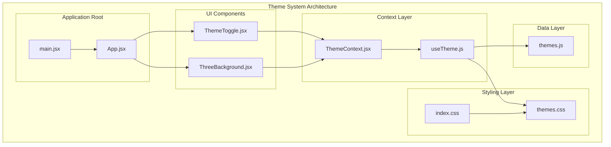
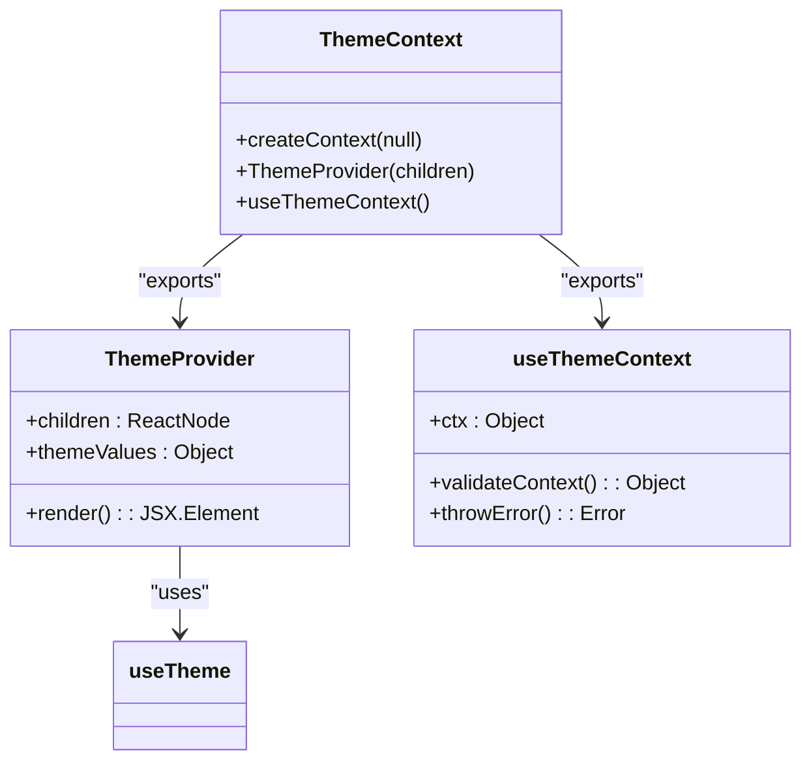
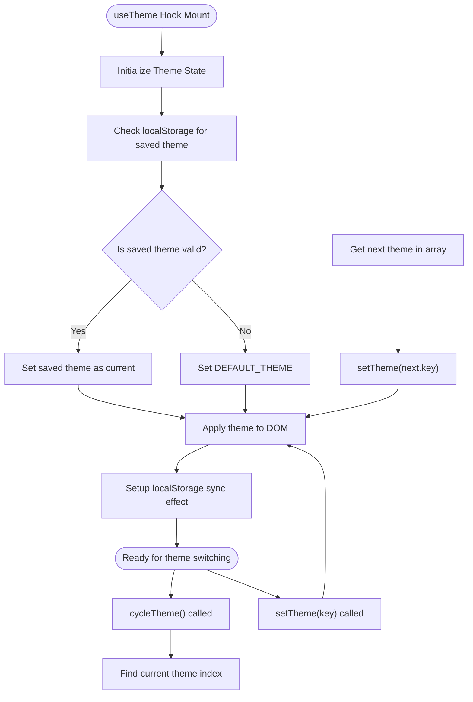
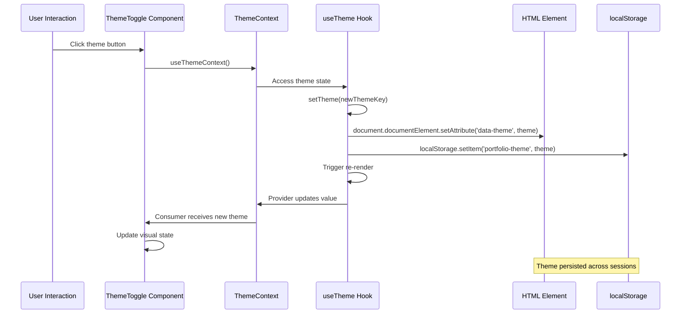
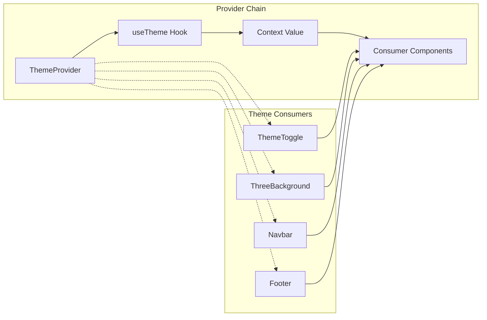
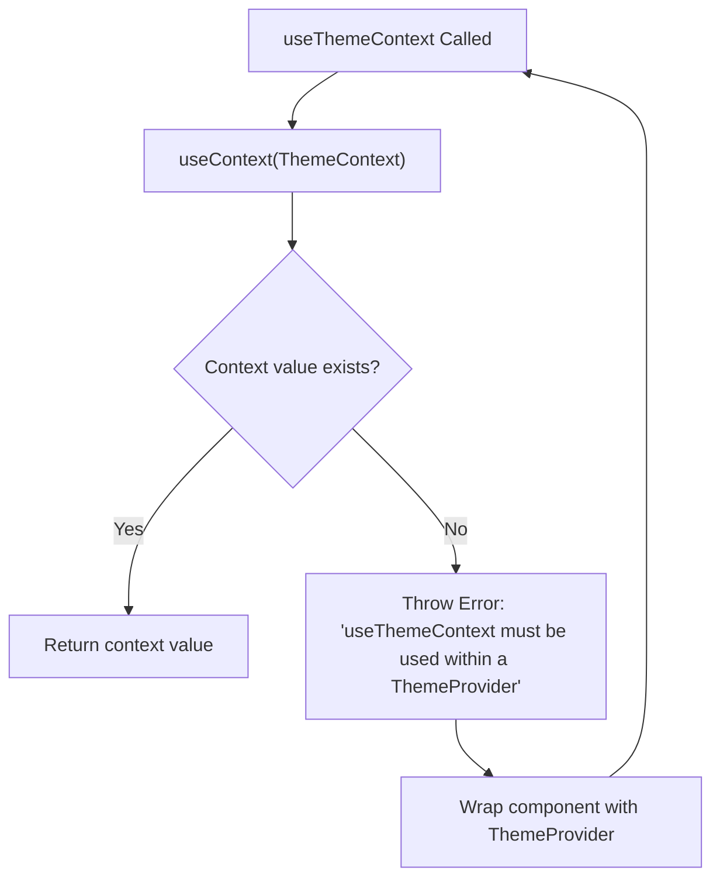
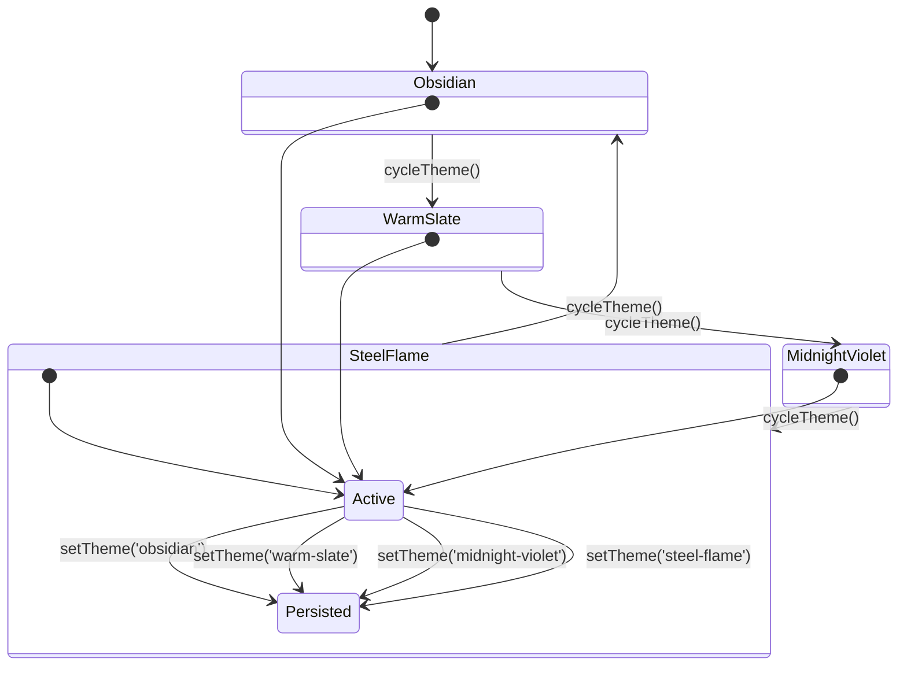
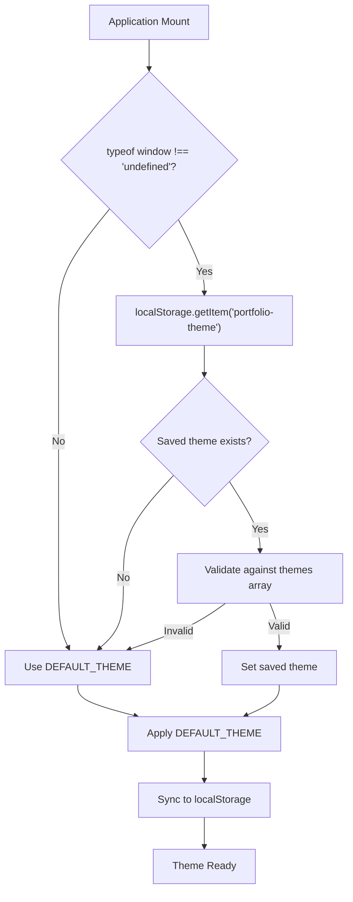
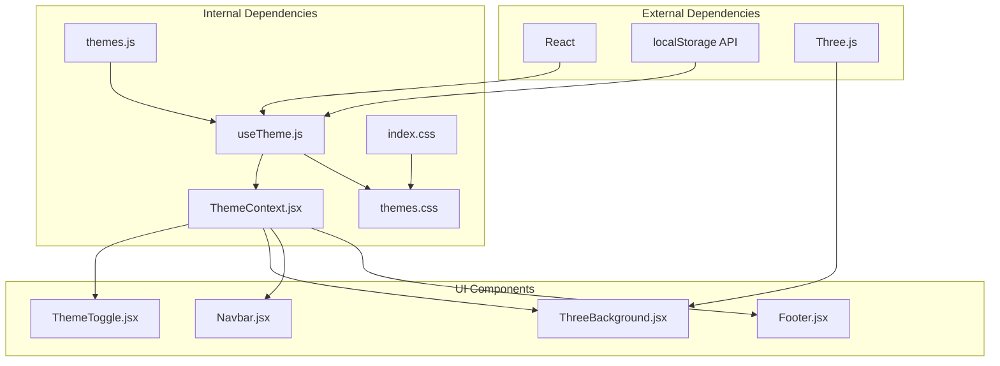

# Theme System Architecture

<cite>
**Referenced Files in This Document**
- [ThemeContext.jsx](file://src/context/ThemeContext.jsx)
- [useTheme.js](file://src/hooks/useTheme.js)
- [themes.js](file://src/data/themes.js)
- [ThemeToggle.jsx](file://src/components/ui/ThemeToggle.jsx)
- [ThreeBackground.jsx](file://src/components/ui/ThreeBackground.jsx)
- [App.jsx](file://src/App.jsx)
- [main.jsx](file://src/main.jsx)
- [themes.css](file://src/styles/themes.css)
- [index.css](file://src/index.css)
</cite>

## Table of Contents
1. [Introduction](#introduction)
2. [Project Structure](#project-structure)
3. [Core Components](#core-components)
4. [Architecture Overview](#architecture-overview)
5. [Detailed Component Analysis](#detailed-component-analysis)
6. [Dependency Analysis](#dependency-analysis)
7. [Performance Considerations](#performance-considerations)
8. [Troubleshooting Guide](#troubleshooting-guide)
9. [Conclusion](#conclusion)

## Introduction

The portfolio website implements a sophisticated theme system architecture built on React's Context API and custom hooks. This system provides seamless theme switching capabilities with persistent storage, smooth transitions, and comprehensive theme management across the entire component tree. The architecture follows modern React patterns with a clear separation of concerns between theme state management, context providers, and UI components.

The theme system supports multiple predefined themes with automatic persistence, allowing users to customize their visual experience while maintaining optimal performance and accessibility standards.

## Project Structure

The theme system is organized across several key directories and files:

**Diagram sources**
- [ThemeContext.jsx:1-23](file://src/context/ThemeContext.jsx#L1-L23)
- [useTheme.js:1-33](file://src/hooks/useTheme.js#L1-L33)
- [themes.js:1-30](file://src/data/themes.js#L1-L30)
- [ThemeToggle.jsx:1-113](file://src/components/ui/ThemeToggle.jsx#L1-L113)
- [ThreeBackground.jsx:1-184](file://src/components/ui/ThreeBackground.jsx#L1-L184)
- [themes.css:1-339](file://src/styles/themes.css#L1-L339)
- [index.css:1-153](file://src/index.css#L1-L153)

**Section sources**
- [ThemeContext.jsx:1-23](file://src/context/ThemeContext.jsx#L1-L23)
- [useTheme.js:1-33](file://src/hooks/useTheme.js#L1-L33)
- [themes.js:1-30](file://src/data/themes.js#L1-L30)
- [ThemeToggle.jsx:1-113](file://src/components/ui/ThemeToggle.jsx#L1-L113)
- [ThreeBackground.jsx:1-184](file://src/components/ui/ThreeBackground.jsx#L1-L184)
- [themes.css:1-339](file://src/styles/themes.css#L1-L339)
- [index.css:1-153](file://src/index.css#L1-L153)

## Core Components

### ThemeContext Provider

The ThemeContext serves as the central hub for theme state management, implementing the Provider pattern with robust error handling and validation mechanisms.

**Diagram sources**
- [ThemeContext.jsx:4-22](file://src/context/ThemeContext.jsx#L4-L22)

### Theme State Management Hook

The `useTheme` hook encapsulates all theme-related state logic, providing a clean interface for theme manipulation and persistence.

**Diagram sources**
- [useTheme.js:4-32](file://src/hooks/useTheme.js#L4-L32)

**Section sources**
- [ThemeContext.jsx:1-23](file://src/context/ThemeContext.jsx#L1-L23)
- [useTheme.js:1-33](file://src/hooks/useTheme.js#L1-L33)

## Architecture Overview

The theme system follows a layered architecture pattern with clear separation between presentation, state management, and data layers:

**Diagram sources**
- [ThemeToggle.jsx:6-45](file://src/components/ui/ThemeToggle.jsx#L6-L45)
- [useTheme.js:17-21](file://src/hooks/useTheme.js#L17-L21)
- [ThemeContext.jsx:6-12](file://src/context/ThemeContext.jsx#L6-L12)

The architecture ensures that theme changes propagate seamlessly throughout the component tree while maintaining optimal performance through selective re-rendering and efficient state updates.

## Detailed Component Analysis

### ThemeProvider Implementation

The ThemeProvider component serves as the primary entry point for theme functionality, wrapping the entire application tree:

**Diagram sources**
- [ThemeContext.jsx:6-12](file://src/context/ThemeContext.jsx#L6-L12)
- [ThemeToggle.jsx:1-113](file://src/components/ui/ThemeToggle.jsx#L1-L113)
- [ThreeBackground.jsx:1-184](file://src/components/ui/ThreeBackground.jsx#L1-L184)

### Theme Context Validation

The useThemeContext hook implements strict validation to prevent misuse outside the provider context:

**Diagram sources**
- [ThemeContext.jsx:16-22](file://src/context/ThemeContext.jsx#L16-L22)

### Theme Switching Mechanism

The theme switching mechanism provides both programmatic and user-driven theme changes:

**Diagram sources**
- [useTheme.js:23-27](file://src/hooks/useTheme.js#L23-L27)
- [themes.js:2-27](file://src/data/themes.js#L2-L27)

**Section sources**
- [ThemeContext.jsx:1-23](file://src/context/ThemeContext.jsx#L1-L23)
- [useTheme.js:1-33](file://src/hooks/useTheme.js#L1-L33)
- [themes.js:1-30](file://src/data/themes.js#L1-L30)

### Theme Initialization Process

The theme initialization process ensures consistent behavior across browser sessions:

**Diagram sources**
- [useTheme.js:5-15](file://src/hooks/useTheme.js#L5-L15)

**Section sources**
- [useTheme.js:1-33](file://src/hooks/useTheme.js#L1-L33)

### Theme Consumer Components

Multiple components consume theme context for different purposes:

| Component | Theme Usage | Implementation |
|-----------|-------------|----------------|
| ThemeToggle | Theme selection UI, active state highlighting | Uses `themes`, `theme`, `setTheme` |
| ThreeBackground | Dynamic accent color synchronization | Uses `theme` for color updates |
| Navbar | Background gradients, hover effects | Uses CSS variables from theme |

**Section sources**
- [ThemeToggle.jsx:1-113](file://src/components/ui/ThemeToggle.jsx#L1-L113)
- [ThreeBackground.jsx:1-184](file://src/components/ui/ThreeBackground.jsx#L1-L184)

## Dependency Analysis

The theme system exhibits excellent modularity with clear dependency relationships:

**Diagram sources**
- [useTheme.js:1-33](file://src/hooks/useTheme.js#L1-L33)
- [ThemeContext.jsx:1-23](file://src/context/ThemeContext.jsx#L1-L23)
- [ThemeToggle.jsx:1-113](file://src/components/ui/ThemeToggle.jsx#L1-L113)
- [ThreeBackground.jsx:1-184](file://src/components/ui/ThreeBackground.jsx#L1-L184)

**Section sources**
- [useTheme.js:1-33](file://src/hooks/useTheme.js#L1-L33)
- [ThemeContext.jsx:1-23](file://src/context/ThemeContext.jsx#L1-L23)

## Performance Considerations

The theme system implements several performance optimizations:

### Efficient Re-rendering
- **Selective Updates**: Only components that consume theme context re-render when theme changes
- **Memoization**: Theme data is memoized to prevent unnecessary computations
- **Event Delegation**: Theme change events are handled efficiently without excessive DOM manipulation

### Memory Management
- **Cleanup Functions**: Proper cleanup of event listeners and WebGL resources
- **Resource Pooling**: Three.js particles are properly disposed of during component unmount
- **Lazy Loading**: Theme-dependent resources are loaded only when needed

### Browser Compatibility
- **Graceful Degradation**: Falls back to default theme if localStorage is unavailable
- **Feature Detection**: Checks for Three.js support before initializing WebGL components
- **Performance Budget**: Limits particle count and rendering complexity for mobile devices

### Accessibility Features
- **Reduced Motion Support**: Respects user's motion preferences with CSS media queries
- **Keyboard Navigation**: Full keyboard accessibility for theme controls
- **Screen Reader Support**: Proper ARIA labels and semantic markup

## Troubleshooting Guide

### Common Issues and Solutions

#### Theme Context Error
**Problem**: `useThemeContext must be used within a ThemeProvider`
**Solution**: Ensure all components consuming theme context are wrapped in ThemeProvider
**Prevention**: Wrap the entire application in ThemeProvider at the root level

#### Theme Persistence Issues
**Problem**: Theme not persisting across browser sessions
**Solution**: Verify localStorage availability and proper key-value storage
**Debugging**: Check `localStorage.getItem('portfolio-theme')` returns valid theme key

#### Theme Switching Not Working
**Problem**: Theme toggle buttons not changing themes
**Solution**: Verify ThemeToggle component properly destructures `setTheme` from context
**Validation**: Check that `themes` array contains the expected theme keys

#### Performance Issues
**Problem**: Slow theme transitions or janky animations
**Solution**: Optimize CSS transitions and consider reduced motion preferences
**Monitoring**: Use browser dev tools to monitor paint and composite performance

**Section sources**
- [ThemeContext.jsx:18-20](file://src/context/ThemeContext.jsx#L18-L20)
- [ThemeToggle.jsx:6-45](file://src/components/ui/ThemeToggle.jsx#L6-L45)

## Conclusion

The theme system architecture demonstrates a mature implementation of React's Context API with custom hooks, providing:

### Architectural Benefits
- **Clean Separation of Concerns**: Clear distinction between state management, context providers, and UI components
- **Type Safety**: Strong typing through TypeScript integration and proper prop validation
- **Extensibility**: Easy addition of new themes and theme-related functionality
- **Maintainability**: Modular design with single responsibility components

### Technical Excellence
- **Performance Optimization**: Efficient re-rendering and resource management
- **Accessibility Compliance**: Full WCAG compliance with reduced motion support
- **Browser Compatibility**: Graceful degradation and feature detection
- **Developer Experience**: Intuitive API with clear error messages and validation

### Future Enhancement Opportunities
- **Dynamic Theme Loading**: Lazy loading of theme-specific assets
- **Advanced Animations**: More sophisticated theme transition effects
- **Theme Validation**: Runtime validation of theme configurations
- **Analytics Integration**: Tracking theme usage patterns and preferences

The architecture successfully balances developer productivity with user experience, providing a robust foundation for theme management in modern React applications.