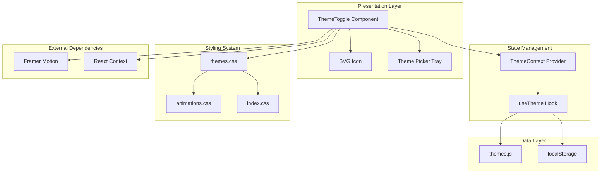
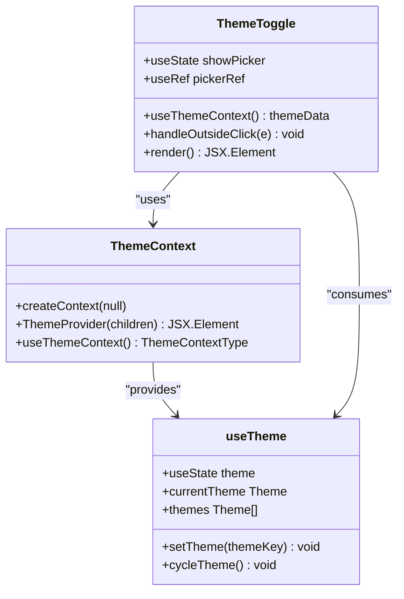
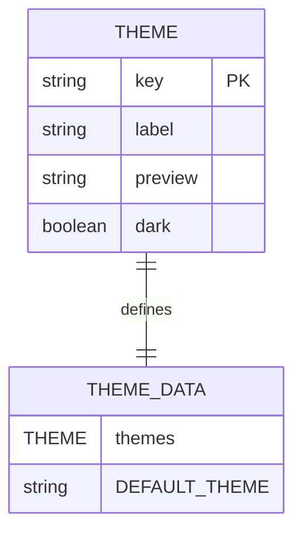
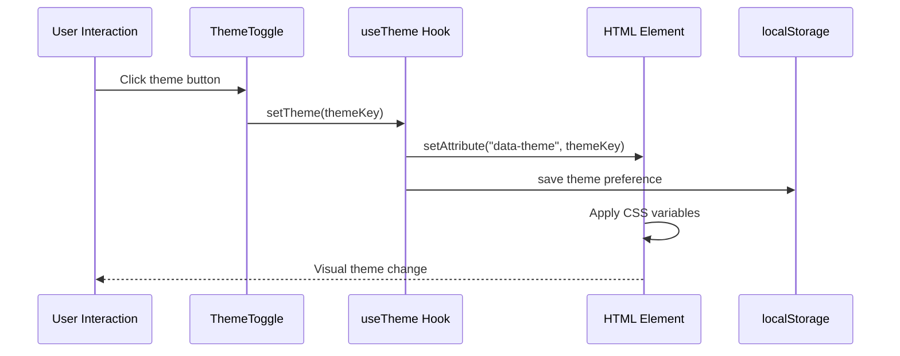
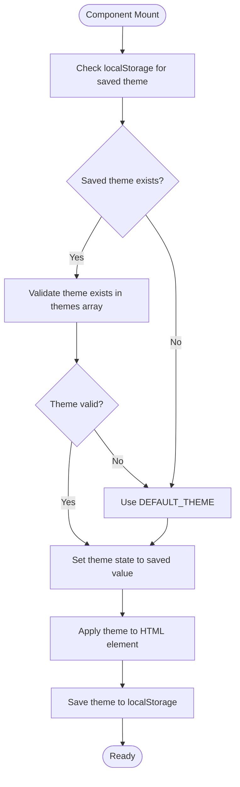
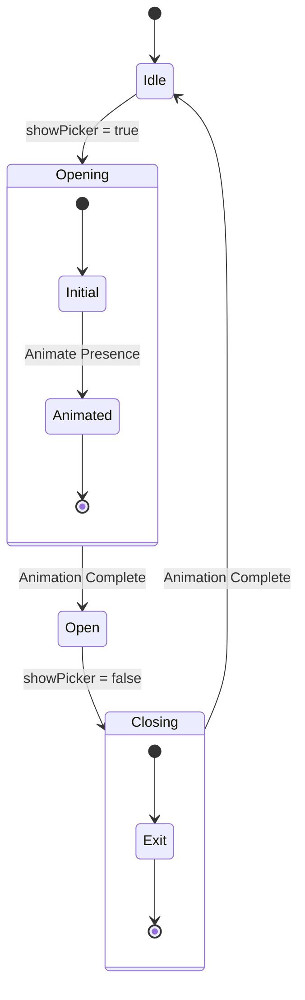

# Theme Toggle Functionality

<cite>
**Referenced Files in This Document**
- [ThemeToggle.jsx](file://src/components/ui/ThemeToggle.jsx)
- [ThemeContext.jsx](file://src/context/ThemeContext.jsx)
- [useTheme.js](file://src/hooks/useTheme.js)
- [themes.js](file://src/data/themes.js)
- [themes.css](file://src/styles/themes.css)
- [animations.css](file://src/styles/animations.css)
- [App.jsx](file://src/App.jsx)
- [main.jsx](file://src/main.jsx)
- [index.css](file://src/index.css)
- [package.json](file://package.json)
</cite>

## Table of Contents
1. [Introduction](#introduction)
2. [System Architecture](#system-architecture)
3. [Core Components](#core-components)
4. [Theme Management System](#theme-management-system)
5. [Persistence Mechanisms](#persistence-mechanisms)
6. [Animation System](#animation-system)
7. [Accessibility Features](#accessibility-features)
8. [Customization Guide](#customization-guide)
9. [Performance Considerations](#performance-considerations)
10. [Troubleshooting Guide](#troubleshooting-guide)
11. [Conclusion](#conclusion)

## Introduction

The theme toggle component is a sophisticated system that provides users with seamless theme switching capabilities across a portfolio website. Built with React and Framer Motion, it offers smooth transitions, persistent preferences, and an intuitive user interface. This documentation covers the complete implementation, from component architecture to advanced customization options.

The system supports multiple themes with automatic persistence, smooth animations, and comprehensive accessibility features. It integrates seamlessly with the existing portfolio architecture while maintaining excellent performance characteristics.

## System Architecture

The theme toggle functionality follows a clean separation of concerns with clear boundaries between presentation, state management, and persistence layers.



**Diagram sources**
- [ThemeToggle.jsx:1-113](file://src/components/ui/ThemeToggle.jsx#L1-L113)
- [ThemeContext.jsx:1-23](file://src/context/ThemeContext.jsx#L1-L23)
- [useTheme.js:1-33](file://src/hooks/useTheme.js#L1-L33)
- [themes.js:1-30](file://src/data/themes.js#L1-L30)

**Section sources**
- [ThemeToggle.jsx:1-113](file://src/components/ui/ThemeToggle.jsx#L1-L113)
- [ThemeContext.jsx:1-23](file://src/context/ThemeContext.jsx#L1-L23)
- [useTheme.js:1-33](file://src/hooks/useTheme.js#L1-L33)

## Core Components

### ThemeToggle Component

The ThemeToggle component serves as the primary user interface for theme selection. It implements a floating action button with an integrated theme picker tray.



**Diagram sources**
- [ThemeToggle.jsx:5-113](file://src/components/ui/ThemeToggle.jsx#L5-L113)
- [ThemeContext.jsx:4-22](file://src/context/ThemeContext.jsx#L4-L22)
- [useTheme.js:4-32](file://src/hooks/useTheme.js#L4-L32)

The component features:

- **Floating Action Button**: A prominent circular button positioned at the bottom-right corner
- **Theme Picker Tray**: Animated dropdown containing theme options
- **Visual Feedback**: Active theme highlighting and hover effects
- **Responsive Design**: Adapts to different screen sizes

**Section sources**
- [ThemeToggle.jsx:21-110](file://src/components/ui/ThemeToggle.jsx#L21-L110)

### ThemeContext Provider

The ThemeContext provider establishes the global theme state management system, making theme data available throughout the component tree.

**Section sources**
- [ThemeContext.jsx:6-13](file://src/context/ThemeContext.jsx#L6-L13)
- [ThemeContext.jsx:16-22](file://src/context/ThemeContext.jsx#L16-L22)

## Theme Management System

### Theme Data Structure

The theme system is built around a structured data model that defines available themes, their properties, and default behavior.



**Diagram sources**
- [themes.js:2-29](file://src/data/themes.js#L2-L29)

Each theme definition includes:
- **key**: Unique identifier for programmatic access
- **label**: Human-readable theme name
- **preview**: Visual representation color
- **dark**: Theme darkness classification

**Section sources**
- [themes.js:1-30](file://src/data/themes.js#L1-L30)

### Theme Application Logic

The theme application process involves setting a data attribute on the HTML element and updating the DOM accordingly.



**Diagram sources**
- [useTheme.js:17-21](file://src/hooks/useTheme.js#L17-L21)
- [ThemeToggle.jsx:42-44](file://src/components/ui/ThemeToggle.jsx#L42-L44)

**Section sources**
- [useTheme.js:4-32](file://src/hooks/useTheme.js#L4-L32)

## Persistence Mechanisms

### Local Storage Integration

The theme system implements robust persistence using browser local storage to maintain user preferences across sessions.



**Diagram sources**
- [useTheme.js:5-15](file://src/hooks/useTheme.js#L5-L15)
- [useTheme.js:17-21](file://src/hooks/useTheme.js#L17-L21)

**Section sources**
- [useTheme.js:5-21](file://src/hooks/useTheme.js#L5-L21)

### Browser Compatibility Considerations

The persistence mechanism includes comprehensive browser compatibility checks:

- **Server-side rendering safety**: Uses `typeof window !== 'undefined'` guard
- **Feature detection**: Validates localStorage availability
- **Data validation**: Ensures saved themes still exist in current theme definitions
- **Graceful degradation**: Falls back to default theme when persistence fails

**Section sources**
- [useTheme.js:7-14](file://src/hooks/useTheme.js#L7-L14)

## Animation System

### Framer Motion Integration

The theme toggle implements sophisticated animations using Framer Motion for smooth user interactions and transitions.



**Diagram sources**
- [ThemeToggle.jsx:24-76](file://src/components/ui/ThemeToggle.jsx#L24-L76)

### Theme Transition Effects

The CSS system provides comprehensive theme transition effects that enhance the user experience during theme changes.

```mermaid
flowchart LR
subgraph "Transition Properties"
TP1[background-color 0.4s ease]
TP2[border-color 0.4s ease]
TP3[color 0.4s ease]
end
subgraph "Excluded Elements"
EX1[data-animate elements]
EX2[hero-blob]
EX3[timeline-line]
EX4[canvas]
end
subgraph "Reduced Motion Support"
RM[@media prefers-reduced-motion]
end
TP1 --> Apply["Apply to all elements"]
TP2 --> Apply
TP3 --> Apply
EX1 -.-> NoApply["Skip transitions"]
EX2 -.-> NoApply
EX3 -.-> NoApply
EX4 -.-> NoApply
RM --> Minimal["Minimal animations"]
```

**Diagram sources**
- [themes.css:230-242](file://src/styles/themes.css#L230-L242)
- [themes.css:299-321](file://src/styles/themes.css#L299-L321)

**Section sources**
- [themes.css:224-242](file://src/styles/themes.css#L224-L242)
- [themes.css:299-321](file://src/styles/themes.css#L299-L321)

## Accessibility Features

### Keyboard Navigation Support

The theme toggle component includes comprehensive keyboard accessibility features:

- **Focus Management**: Proper focus states and keyboard navigation
- **Screen Reader Support**: ARIA labels and semantic markup
- **Motion Preferences**: Respects user's reduced motion settings
- **Color Contrast**: Maintains sufficient contrast ratios across themes

**Section sources**
- [ThemeToggle.jsx:84-85](file://src/components/ui/ThemeToggle.jsx#L84-L85)
- [themes.css:300-321](file://src/styles/themes.css#L300-L321)

### Screen Reader Compatibility

The component provides accessible names for assistive technologies:

- **aria-label**: Descriptive label for the theme toggle button
- **title attribute**: Additional context for the button
- **Semantic HTML**: Proper button element usage

**Section sources**
- [ThemeToggle.jsx:84-85](file://src/components/ui/ThemeToggle.jsx#L84-L85)

## Customization Guide

### Adding New Themes

To add new themes to the system, follow these steps:

1. **Update themes.js**: Add new theme definition with unique key, label, and preview color
2. **Update CSS Variables**: Add theme-specific CSS variables in themes.css
3. **Test Theme**: Verify theme renders correctly across all components

Example theme structure:
```javascript
{
  key: 'new-theme',
  label: 'New Theme',
  preview: '#ff6b6b',
  dark: true,
}
```

**Section sources**
- [themes.js:2-29](file://src/data/themes.js#L2-L29)
- [themes.css:59-90](file://src/styles/themes.css#L59-L90)

### Customizing Toggle Appearance

The theme toggle can be customized through several approaches:

1. **Positioning**: Modify the fixed positioning classes in the main container
2. **Size**: Adjust the button dimensions using width and height classes
3. **Styling**: Customize colors using Tailwind CSS utility classes
4. **Animation**: Modify Framer Motion animation properties

**Section sources**
- [ThemeToggle.jsx:22](file://src/components/ui/ThemeToggle.jsx#L22)
- [ThemeToggle.jsx:79-107](file://src/components/ui/ThemeToggle.jsx#L79-L107)

### Implementing Theme Transitions

The system supports various transition effects:

- **Smooth Color Swapping**: Automatic CSS variable transitions
- **Element Animations**: Individual component animations
- **Layout Transitions**: Framer Motion layout animations
- **Performance Optimization**: Exclusion lists for heavy elements

**Section sources**
- [themes.css:224-242](file://src/styles/themes.css#L224-L242)
- [animations.css:279-331](file://src/styles/animations.css#L279-L331)

## Performance Considerations

### Optimization Strategies

The theme system implements several performance optimization techniques:

- **CSS Variable Usage**: Efficient theme switching without DOM manipulation
- **Animation Exclusions**: Prevents performance drops on animated elements
- **Reduced Motion Support**: Respects user preferences for motion sensitivity
- **Lazy Loading**: Theme picker only renders when needed

**Section sources**
- [themes.css:237-242](file://src/styles/themes.css#L237-L242)
- [themes.css:300-321](file://src/styles/themes.css#L300-L321)

### Memory Management

The system handles memory efficiently:

- **Event Listeners**: Proper cleanup of outside-click handlers
- **State Management**: Minimal state updates to reduce re-renders
- **Animation Cleanup**: Automatic cleanup of Framer Motion animations

**Section sources**
- [ThemeToggle.jsx:11-19](file://src/components/ui/ThemeToggle.jsx#L11-L19)

## Troubleshooting Guide

### Common Issues and Solutions

**Theme Not Persisting**
- Verify localStorage is enabled in the browser
- Check for browser extensions blocking storage
- Ensure theme keys match existing theme definitions

**Animations Not Working**
- Confirm Framer Motion is properly installed
- Verify CSS transitions are not disabled globally
- Check for conflicting animation libraries

**Accessibility Issues**
- Test with screen readers and keyboard navigation
- Verify ARIA labels are properly applied
- Check color contrast ratios across all themes

**Section sources**
- [package.json:12-24](file://package.json#L12-L24)
- [ThemeToggle.jsx:84-85](file://src/components/ui/ThemeToggle.jsx#L84-L85)

### Debugging Tools

Useful debugging approaches:

1. **Browser DevTools**: Inspect data-theme attribute changes
2. **Console Logging**: Monitor theme state updates
3. **Network Tab**: Verify localStorage operations
4. **Performance Tab**: Analyze animation performance

## Conclusion

The theme toggle component represents a comprehensive solution for dynamic theme management in modern web applications. Its architecture balances functionality, performance, and accessibility while providing extensive customization options.

Key strengths of the implementation include:

- **Robust Persistence**: Reliable theme preference storage across sessions
- **Smooth Animations**: Professional-grade transitions using Framer Motion
- **Accessibility Compliance**: Comprehensive support for assistive technologies
- **Performance Optimization**: Careful consideration of animation performance
- **Extensible Design**: Easy addition of new themes and customization options

The system demonstrates best practices in React component architecture, state management, and user experience design, making it an excellent foundation for theme management in portfolio websites and other React applications.