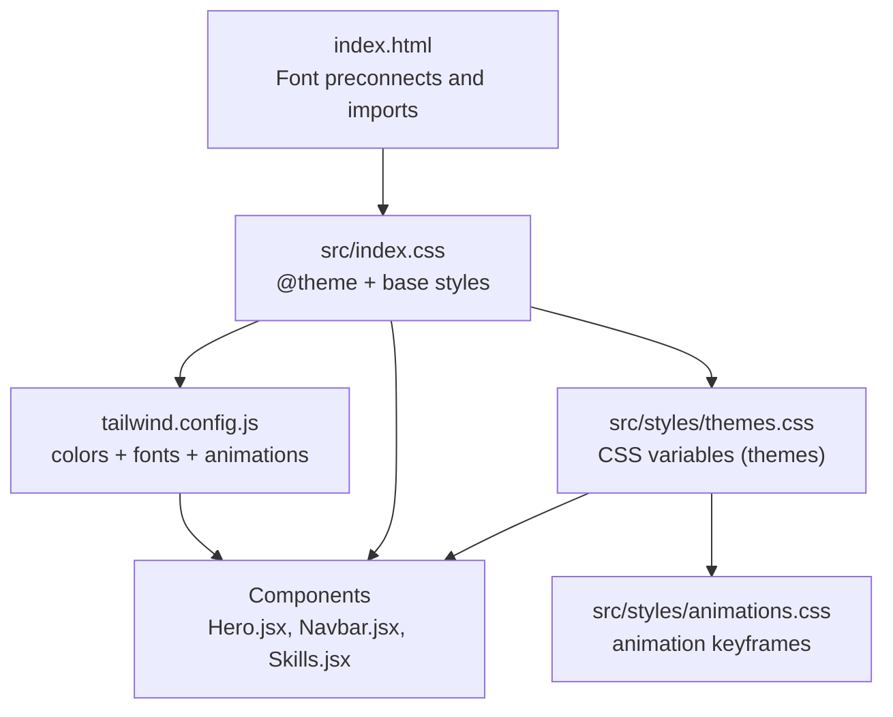
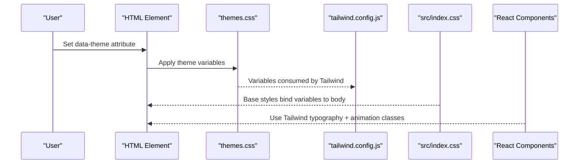
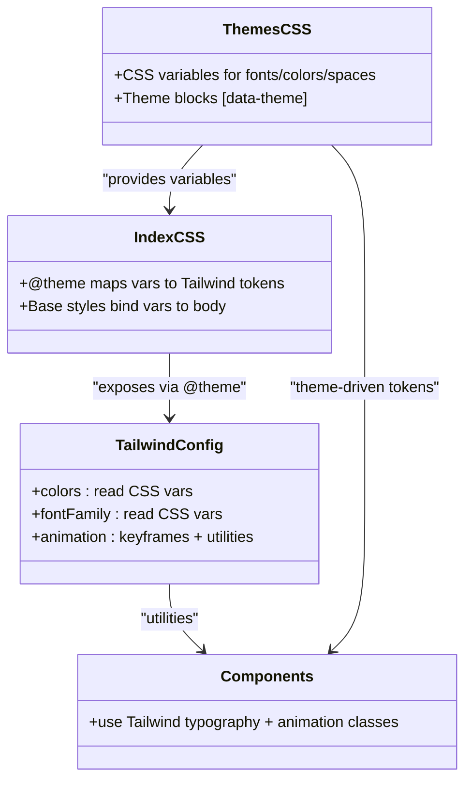
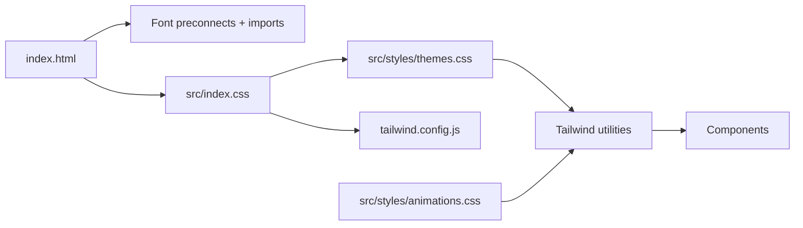

# Typography and Styling

<cite>
**Referenced Files in This Document**
- [index.html](file://index.html)
- [index.css](file://src/index.css)
- [themes.css](file://src/styles/themes.css)
- [animations.css](file://src/styles/animations.css)
- [tailwind.config.js](file://tailwind.config.js)
- [postcss.config.js](file://postcss.config.js)
- [Hero.jsx](file://src/components/sections/Hero.jsx)
- [Navbar.jsx](file://src/components/layout/Navbar.jsx)
- [Skills.jsx](file://src/components/sections/Experience.jsx)
- [DESIGN-CHANGES.md](file://DESIGN-CHANGES.md)
- [QUICK-START.md](file://QUICK-START.md)
- [ux-guidelines.csv](file://.kiro/steering/ui-ux-pro-max/data/ux-guidelines.csv)
- [styles.csv](file://.kiro/steering/ui-ux-pro-max/data/styles.csv)
</cite>

## Table of Contents
1. [Introduction](#introduction)
2. [Project Structure](#project-structure)
3. [Core Components](#core-components)
4. [Architecture Overview](#architecture-overview)
5. [Detailed Component Analysis](#detailed-component-analysis)
6. [Dependency Analysis](#dependency-analysis)
7. [Performance Considerations](#performance-considerations)
8. [Troubleshooting Guide](#troubleshooting-guide)
9. [Conclusion](#conclusion)
10. [Appendices](#appendices)

## Introduction
This document explains the typography system and styling customization used across the portfolio. It covers font family configurations, the typography scale, responsive patterns, and how CSS custom properties connect to Tailwind utility classes. It also documents heading hierarchies, body text styling, code block formatting, font loading and fallback strategies, cross-platform compatibility, accessibility considerations, reading comfort optimization, and practical customization examples.

## Project Structure
The typography and styling pipeline is built around three pillars:
- Global CSS theme variables and base styles
- Tailwind CSS configuration extending the design system
- Component-level usage of typography utilities and animations

**Diagram sources**
- [index.html:1-79](file://index.html#L1-L79)
- [index.css:1-153](file://src/index.css#L1-L153)
- [tailwind.config.js:1-54](file://tailwind.config.js#L1-L54)
- [themes.css:1-339](file://src/styles/themes.css#L1-L339)
- [animations.css:1-358](file://src/styles/animations.css#L1-L358)
- [Hero.jsx:1-198](file://src/components/sections/Hero.jsx#L1-L198)
- [Navbar.jsx:1-255](file://src/components/layout/Navbar.jsx#L1-L255)
- [Skills.jsx:1-200](file://src/components/sections/Experience.jsx#L1-L200)

**Section sources**
- [index.html:1-79](file://index.html#L1-L79)
- [index.css:1-153](file://src/index.css#L1-L153)
- [tailwind.config.js:1-54](file://tailwind.config.js#L1-L54)
- [themes.css:1-339](file://src/styles/themes.css#L1-L339)
- [animations.css:1-358](file://src/styles/animations.css#L1-L358)

## Core Components
- CSS custom properties define fonts, colors, spacing, shadows, and transitions. Themes are applied via a data attribute on the root element.
- Tailwind consumes these variables to provide color, font family, and animation utilities.
- Base styles bind the CSS variables to the body and global elements.
- Components apply typography utilities and animations consistently.

Key elements:
- Font families: heading, body, and monospace stacks with safe fallbacks
- Spacing tokens enabling consistent rhythm
- Theme-aware color tokens for text, borders, accents, and surfaces
- Animation keyframes and Tailwind animation utilities

**Section sources**
- [themes.css:32-57](file://src/styles/themes.css#L32-L57)
- [index.css:3-81](file://src/index.css#L3-L81)
- [tailwind.config.js:7-22](file://tailwind.config.js#L7-L22)

## Architecture Overview
The typography system is a layered design:
- Variables: CSS custom properties in themes define fonts and colors
- Theme engine: data-theme toggles switch variables globally
- Tailwind integration: Tailwind reads variables to expose utilities
- Base styles: body and global resets consume variables
- Components: use Tailwind utilities and animation classes

**Diagram sources**
- [themes.css:7-57](file://src/styles/themes.css#L7-L57)
- [tailwind.config.js:4-22](file://tailwind.config.js#L4-L22)
- [index.css:88-105](file://src/index.css#L88-L105)
- [Hero.jsx:69-102](file://src/components/sections/Hero.jsx#L69-L102)

## Detailed Component Analysis

### Font Family Configuration
- Heading stack: a modern geometric sans-serif with Inter as a fallback
- Body stack: a humanist sans-serif with Inter as a fallback
- Monospace stack: JetBrains Mono for code-like elements
- Preconnects and imports are configured in the HTML head for fast font loading

Practical usage:
- Components use font families via Tailwind utilities mapped to CSS variables
- Monospace is applied for numeric badges and code-like labels

**Section sources**
- [themes.css:33-35](file://src/styles/themes.css#L33-L35)
- [index.css:19-21](file://src/index.css#L19-L21)
- [tailwind.config.js:18-22](file://tailwind.config.js#L18-L22)
- [index.html:37-43](file://index.html#L37-L43)
- [Skills.jsx:89-99](file://src/components/sections/Experience.jsx#L89-L99)

### Typography Scale and Modular Rhythm
- The design system defines a consistent scale for headings and body text
- Tailwind utilities align with the scale for predictable sizing
- Line heights and weights are optimized for readability and scanning

Examples in components:
- Hero heading uses large, bold sizes with tight leading
- Role text uses a smaller heading size with elevated weight
- Body copy uses comfortable line lengths and medium weights

**Section sources**
- [QUICK-START.md:166-180](file://QUICK-START.md#L166-L180)
- [Hero.jsx:69-102](file://src/components/sections/Hero.jsx#L69-L102)
- [DESIGN-CHANGES.md:200-204](file://DESIGN-CHANGES.md#L200-L204)

### Responsive Typography Patterns
- Headings scale responsively across breakpoints with large minimums and capped maximums
- Body text maintains legibility with minimum sizes on small screens
- Leading and spacing adapt to improve readability on all devices

Evidence:
- Responsive headings in hero and role text
- Minimum body font sizes enforced for mobile
- Line height tuned for dense reading

**Section sources**
- [DESIGN-CHANGES.md:245-283](file://DESIGN-CHANGES.md#L245-L283)
- [Hero.jsx:69-102](file://src/components/sections/Hero.jsx#L69-L102)
- [ux-guidelines.csv:68-73](file://.kiro/steering/ui-ux-pro-max/data/ux-guidelines.csv#L68-L73)

### Relationship Between CSS Variables and Tailwind Utilities
- Tailwind’s color and font family utilities read CSS variables
- Animation utilities are defined in Tailwind config and backed by keyframes
- Base styles bind variables to body and global elements

**Diagram sources**
- [themes.css:7-57](file://src/styles/themes.css#L7-L57)
- [index.css:3-81](file://src/index.css#L3-L81)
- [tailwind.config.js:7-33](file://tailwind.config.js#L7-L33)

**Section sources**
- [index.css:3-81](file://src/index.css#L3-L81)
- [tailwind.config.js:7-33](file://tailwind.config.js#L7-L33)

### Heading Hierarchies and Body Text Styling
- Headings use the heading font family and bold weights
- Body text uses the body font family with moderate weights
- Components enforce semantic hierarchy and consistent visual weight

Examples:
- Hero h1 and h2 demonstrate clear hierarchy
- Paragraphs use relaxed leading and appropriate weights

**Section sources**
- [Hero.jsx:69-102](file://src/components/sections/Hero.jsx#L69-L102)
- [index.css:88-105](file://src/index.css#L88-L105)

### Code Block Formatting
- Monospace font is used for numeric badges and code-like labels
- Borders and subtle backgrounds enhance readability without distraction

**Section sources**
- [Skills.jsx:89-99](file://src/components/sections/Experience.jsx#L89-L99)
- [tailwind.config.js:21](file://tailwind.config.js#L21)

### Animations and Micro-interactions
- Animation utilities are defined in Tailwind config and backed by keyframes
- Components use micro-interactions to guide attention and improve UX

**Section sources**
- [animations.css:273-358](file://src/styles/animations.css#L273-L358)
- [tailwind.config.js:23-49](file://tailwind.config.js#L23-L49)

### Theme Switching and Cross-Platform Compatibility
- Themes are switched via a data attribute on the root element
- Preconnects and imports in the HTML improve loading reliability
- Reduced motion support ensures accessibility

**Section sources**
- [themes.css:7-57](file://src/styles/themes.css#L7-L57)
- [index.html:37-43](file://index.html#L37-L43)
- [index.css:300-321](file://src/index.css#L300-L321)

## Dependency Analysis
The typography system depends on:
- HTML head for font preloading
- Tailwind config for utility exposure
- Base CSS for variable binding
- Theme CSS for token definitions
- Animation CSS for keyframes

**Diagram sources**
- [index.html:37-43](file://index.html#L37-L43)
- [index.css:3-81](file://src/index.css#L3-L81)
- [themes.css:7-57](file://src/styles/themes.css#L7-L57)
- [tailwind.config.js:4-22](file://tailwind.config.js#L4-L22)
- [animations.css:273-358](file://src/styles/animations.css#L273-L358)

**Section sources**
- [postcss.config.js:1-7](file://postcss.config.js#L1-L7)
- [tailwind.config.js:1-54](file://tailwind.config.js#L1-L54)

## Performance Considerations
- Font preconnects reduce DNS and connection latency
- CSS variables minimize duplication and enable efficient theme switching
- Animation keyframes are centralized to avoid redundant definitions
- Reduced motion queries prevent unnecessary animations for sensitive users

[No sources needed since this section provides general guidance]

## Troubleshooting Guide
Common issues and resolutions:
- Fonts not loading: verify CDN links and preconnects in the HTML head
- Theme mismatch: ensure the data-theme attribute is present on the root element
- Animation performance: prefer transform and opacity; respect reduced motion
- Contrast and readability: maintain sufficient contrast ratios and readable line lengths

**Section sources**
- [QUICK-START.md:235-266](file://QUICK-START.md#L235-L266)
- [index.html:37-43](file://index.html#L37-L43)
- [themes.css:229-321](file://src/styles/themes.css#L229-L321)
- [ux-guidelines.csv:74-81](file://.kiro/steering/ui-ux-pro-max/data/ux-guidelines.csv#L74-L81)

## Conclusion
The typography and styling system integrates CSS variables, Tailwind utilities, and component-level patterns to deliver a consistent, accessible, and performant typographic experience. By centralizing tokens and animations, the system scales across themes and devices while maintaining readability and brand coherence.

[No sources needed since this section summarizes without analyzing specific files]

## Appendices

### Typography Scale Reference
- Headings: large minimums with capped maximums across breakpoints
- Body: minimum legible sizes on small screens
- Line heights optimized for reading comfort

**Section sources**
- [DESIGN-CHANGES.md:200-204](file://DESIGN-CHANGES.md#L200-L204)
- [QUICK-START.md:166-180](file://QUICK-START.md#L166-L180)

### Accessibility and Reading Comfort
- WCAG AA contrast ratios maintained
- Semantic heading hierarchy preserved
- Motion preferences respected
- Line length and spacing optimized

**Section sources**
- [DESIGN-CHANGES.md:217-222](file://DESIGN-CHANGES.md#L217-L222)
- [ux-guidelines.csv:36-42](file://.kiro/steering/ui-ux-pro-max/data/ux-guidelines.csv#L36-L42)
- [ux-guidelines.csv:74-81](file://.kiro/steering/ui-ux-pro-max/data/ux-guidelines.csv#L74-L81)

### Customization Examples
- Switch themes via the data attribute on the root element
- Extend font families by updating CSS variables and Tailwind config
- Add new animation utilities by defining keyframes and registering them in Tailwind
- Adjust typography scale by modifying base variables and Tailwind theme extensions

**Section sources**
- [themes.css:7-57](file://src/styles/themes.css#L7-L57)
- [tailwind.config.js:18-33](file://tailwind.config.js#L18-L33)
- [animations.css:273-358](file://src/styles/animations.css#L273-L358)