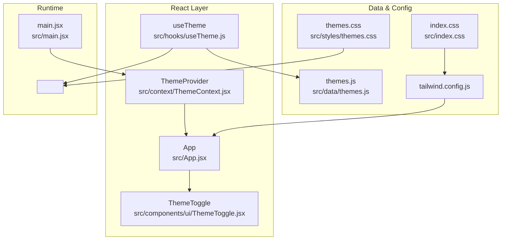
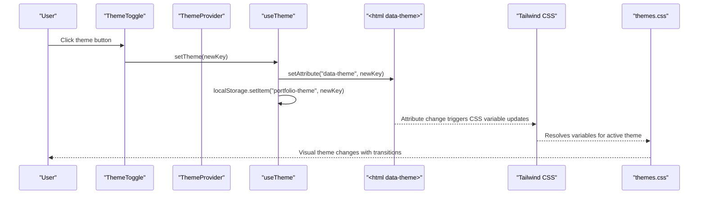
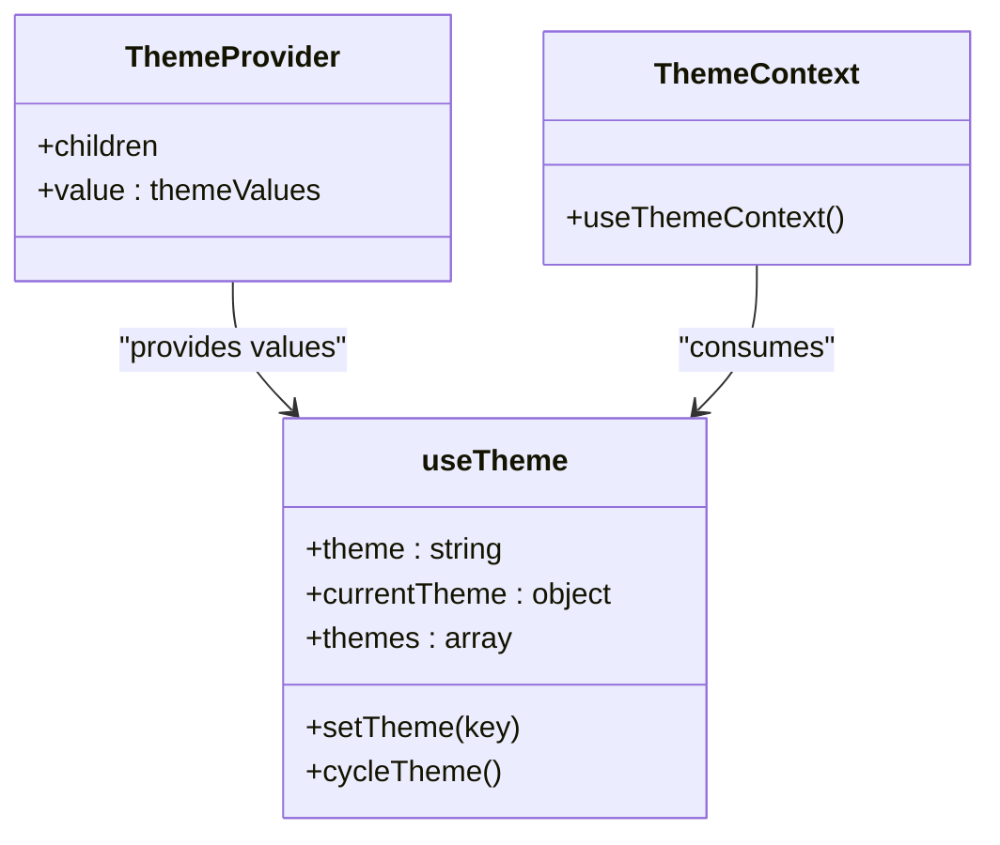
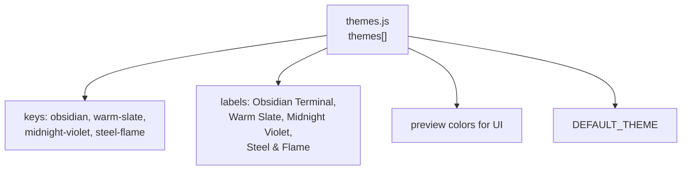
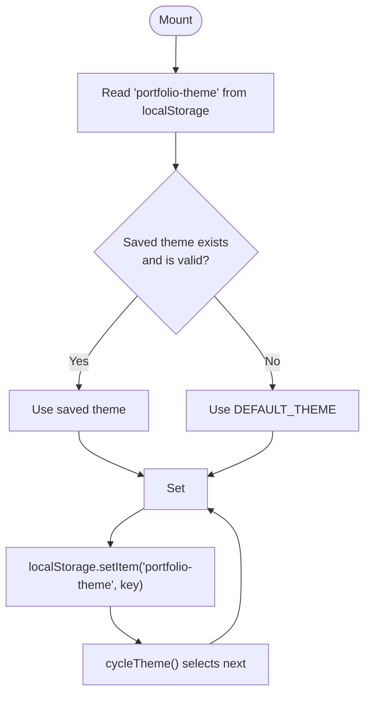
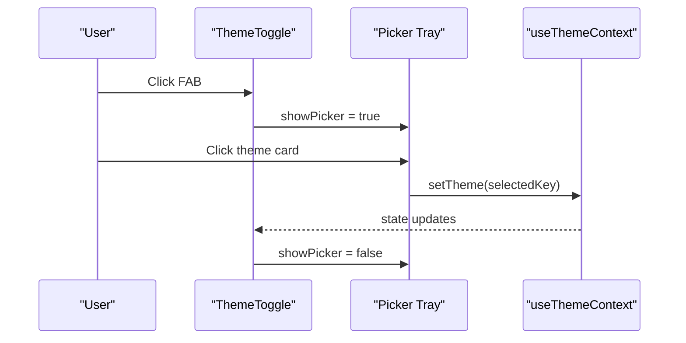
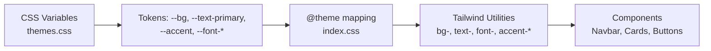
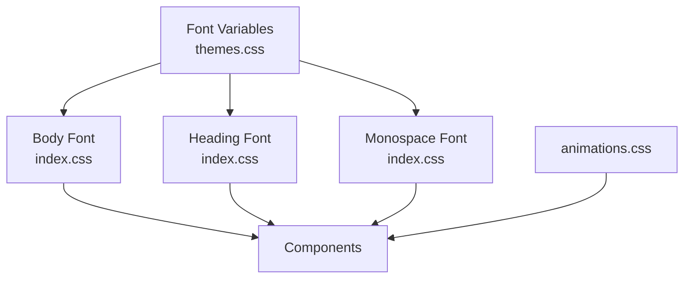
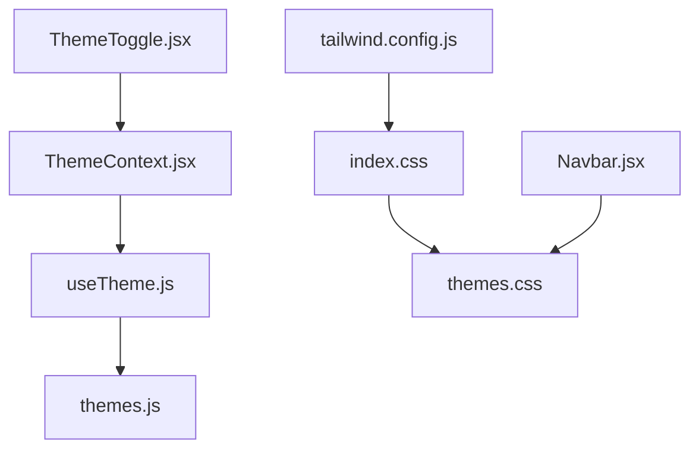

# Visual Customization

<cite>
**Referenced Files in This Document**
- [ThemeContext.jsx](file://src/context/ThemeContext.jsx)
- [useTheme.js](file://src/hooks/useTheme.js)
- [themes.js](file://src/data/themes.js)
- [ThemeToggle.jsx](file://src/components/ui/ThemeToggle.jsx)
- [themes.css](file://src/styles/themes.css)
- [index.css](file://src/index.css)
- [tailwind.config.js](file://tailwind.config.js)
- [App.jsx](file://src/App.jsx)
- [main.jsx](file://src/main.jsx)
- [Navbar.jsx](file://src/components/layout/Navbar.jsx)
- [animations.css](file://src/styles/animations.css)
</cite>

## Table of Contents
1. [Introduction](#introduction)
2. [Project Structure](#project-structure)
3. [Core Components](#core-components)
4. [Architecture Overview](#architecture-overview)
5. [Detailed Component Analysis](#detailed-component-analysis)
6. [Dependency Analysis](#dependency-analysis)
7. [Performance Considerations](#performance-considerations)
8. [Troubleshooting Guide](#troubleshooting-guide)
9. [Conclusion](#conclusion)
10. [Appendices](#appendices)

## Introduction
This document explains the visual customization system for the portfolio, focusing on theme management, color scheme modifications, and visual element personalization. It covers the theme system architecture, CSS variable configuration, and the relationship between ThemeContext and theme data. You will learn how to modify existing color schemes, add new themes, customize typography, implement theme toggling, persist preferences, and consider responsive and accessibility concerns. Practical examples and troubleshooting guidance are included to help you maintain visual consistency and resolve styling conflicts.

## Project Structure
The visual customization system is organized around a small set of cohesive modules:
- Theme data and defaults live in a dedicated data module.
- A React hook manages theme state, persistence, and DOM attribute updates.
- A provider exposes theme values globally.
- A floating theme picker UI allows users to switch themes.
- CSS variables define theme tokens and are consumed by Tailwind and components.
- Tailwind is configured to map CSS variables to utility classes for consistent styling.

**Diagram sources**
- [ThemeContext.jsx:1-23](file://src/context/ThemeContext.jsx#L1-L23)
- [useTheme.js:1-33](file://src/hooks/useTheme.js#L1-L33)
- [ThemeToggle.jsx:1-113](file://src/components/ui/ThemeToggle.jsx#L1-L113)
- [themes.js:1-30](file://src/data/themes.js#L1-L30)
- [tailwind.config.js:1-54](file://tailwind.config.js#L1-L54)
- [index.css:1-172](file://src/index.css#L1-L172)
- [themes.css:1-395](file://src/styles/themes.css#L1-L395)
- [main.jsx:1-16](file://src/main.jsx#L1-L16)

**Section sources**
- [ThemeContext.jsx:1-23](file://src/context/ThemeContext.jsx#L1-L23)
- [useTheme.js:1-33](file://src/hooks/useTheme.js#L1-L33)
- [ThemeToggle.jsx:1-113](file://src/components/ui/ThemeToggle.jsx#L1-L113)
- [themes.js:1-30](file://src/data/themes.js#L1-L30)
- [tailwind.config.js:1-54](file://tailwind.config.js#L1-L54)
- [index.css:1-172](file://src/index.css#L1-L172)
- [themes.css:1-395](file://src/styles/themes.css#L1-L395)
- [main.jsx:1-16](file://src/main.jsx#L1-L16)

## Core Components
- ThemeContext and ThemeProvider: Expose theme values to the app via React Context.
- useTheme: Manages theme state, applies the data-theme attribute on <html>, persists to localStorage, and cycles themes.
- themes.js: Defines available themes, labels, previews, and the default theme.
- ThemeToggle: Provides a floating UI to pick themes and animate transitions.
- CSS variable system: Centralized tokens in themes.css mapped to Tailwind utilities in index.css.
- Tailwind configuration: Bridges CSS variables to Tailwind classes for consistent component styling.

Key responsibilities:
- ThemeContext ensures components can consume theme data without prop drilling.
- useTheme centralizes persistence and DOM attribute updates.
- themes.css defines theme tokens and transitions.
- Tailwind consumes CSS variables to keep utilities consistent across themes.

**Section sources**
- [ThemeContext.jsx:1-23](file://src/context/ThemeContext.jsx#L1-L23)
- [useTheme.js:1-33](file://src/hooks/useTheme.js#L1-L33)
- [themes.js:1-30](file://src/data/themes.js#L1-L30)
- [ThemeToggle.jsx:1-113](file://src/components/ui/ThemeToggle.jsx#L1-L113)
- [themes.css:1-395](file://src/styles/themes.css#L1-L395)
- [index.css:1-172](file://src/index.css#L1-L172)
- [tailwind.config.js:1-54](file://tailwind.config.js#L1-L54)

## Architecture Overview
The theme system follows a unidirectional data flow:
- Initial render reads localStorage to select a persisted theme or falls back to the default.
- The provider supplies theme values to the app.
- The theme picker triggers state updates.
- The hook writes the selected theme to the <html> data-theme attribute and persists it to localStorage.
- Tailwind and CSS variables reactively update colors and typography across the UI.

**Diagram sources**
- [ThemeToggle.jsx:1-113](file://src/components/ui/ThemeToggle.jsx#L1-L113)
- [useTheme.js:1-33](file://src/hooks/useTheme.js#L1-L33)
- [themes.css:1-395](file://src/styles/themes.css#L1-L395)
- [tailwind.config.js:1-54](file://tailwind.config.js#L1-L54)

## Detailed Component Analysis

### ThemeContext and Provider
ThemeContext creates a context with theme values supplied by the useTheme hook. ThemeProvider wraps the app and injects these values. Components can use useThemeContext to access theme metadata and setters.

**Diagram sources**
- [ThemeContext.jsx:1-23](file://src/context/ThemeContext.jsx#L1-L23)
- [useTheme.js:1-33](file://src/hooks/useTheme.js#L1-L33)

**Section sources**
- [ThemeContext.jsx:1-23](file://src/context/ThemeContext.jsx#L1-L23)
- [useTheme.js:1-33](file://src/hooks/useTheme.js#L1-L33)

### Theme Data Model
Themes are defined as an array of objects with keys for identification, human-readable labels, preview colors, and a dark mode flag. The default theme is exported for initialization.

**Diagram sources**
- [themes.js:1-30](file://src/data/themes.js#L1-L30)

**Section sources**
- [themes.js:1-30](file://src/data/themes.js#L1-L30)

### Theme Hook and Persistence
The useTheme hook:
- Initializes theme from localStorage or the default.
- Applies the data-theme attribute on <html> to activate the selected theme.
- Persists the selection to localStorage.
- Provides a cycle function to move through themes.

**Diagram sources**
- [useTheme.js:1-33](file://src/hooks/useTheme.js#L1-L33)

**Section sources**
- [useTheme.js:1-33](file://src/hooks/useTheme.js#L1-L33)

### Theme Picker UI
ThemeToggle renders a floating panel with theme cards. Each card displays a preview dot and label. Clicking a card sets the theme and closes the picker. The component uses animations and outside-click detection to manage visibility.

**Diagram sources**
- [ThemeToggle.jsx:1-113](file://src/components/ui/ThemeToggle.jsx#L1-L113)

**Section sources**
- [ThemeToggle.jsx:1-113](file://src/components/ui/ThemeToggle.jsx#L1-L113)

### CSS Variable System and Tailwind Integration
CSS variables define theme tokens scoped under :root and per-theme selectors. Tailwind is configured to map these variables to utility classes, enabling consistent styling across components. index.css bridges CSS variables to Tailwind’s @theme, and themes.css defines per-theme values and transitions.

**Diagram sources**
- [themes.css:1-395](file://src/styles/themes.css#L1-L395)
- [index.css:1-172](file://src/index.css#L1-L172)
- [tailwind.config.js:1-54](file://tailwind.config.js#L1-L54)

**Section sources**
- [themes.css:1-395](file://src/styles/themes.css#L1-L395)
- [index.css:1-172](file://src/index.css#L1-L172)
- [tailwind.config.js:1-54](file://tailwind.config.js#L1-L54)

### Typography and Visual Elements
Typography is centralized via CSS variables for headings, body, and monospace fonts. Components like Navbar use these variables for consistent fonts and hover effects. Animations are defined in animations.css and integrated via Tailwind utilities.

**Diagram sources**
- [themes.css:1-395](file://src/styles/themes.css#L1-L395)
- [index.css:1-172](file://src/index.css#L1-L172)
- [animations.css:1-426](file://src/styles/animations.css#L1-L426)

**Section sources**
- [themes.css:1-395](file://src/styles/themes.css#L1-L395)
- [index.css:1-172](file://src/index.css#L1-L172)
- [animations.css:1-426](file://src/styles/animations.css#L1-L426)

### Example Scenarios

- Modify an existing color scheme
  - Edit the relevant [data-theme] block in themes.css to adjust tokens like --bg, --text-primary, --accent, and gradients.
  - Verify Tailwind mappings in tailwind.config.js remain aligned with CSS variables.
  - Confirm transitions and exclusions in themes.css do not conflict with new values.

- Add a new theme
  - Add a new theme object to themes.js with a unique key, label, preview color, and dark flag.
  - Define a new [data-theme="your-key"] block in themes.css with all required tokens.
  - Optionally update the default theme constant if desired.

- Customize typography
  - Change font families in themes.css under the font variables.
  - Ensure Tailwind font mappings in tailwind.config.js reflect the new families.
  - Test across devices and browsers for rendering consistency.

- Persist theme preferences
  - The useTheme hook already persists selections to localStorage. Ensure the key remains consistent and validate that invalid stored values fall back to the default.

- Theme toggle behavior
  - ThemeToggle uses the theme context to set the theme and close the picker. Confirm that the picker respects outside clicks and maintains accessibility attributes.

- Responsive design considerations
  - The theme system relies on CSS variables and Tailwind utilities, which adapt responsively by default. Ensure media queries and breakpoints in components align with the chosen design system.

- Accessibility and cross-browser compatibility
  - Prefer CSS variables for colors and transitions to ensure smooth updates across browsers.
  - Respect reduced motion preferences via prefers-reduced-motion in themes.css.
  - Maintain sufficient contrast ratios and avoid conveying information by color alone.

**Section sources**
- [themes.js:1-30](file://src/data/themes.js#L1-L30)
- [themes.css:1-395](file://src/styles/themes.css#L1-L395)
- [tailwind.config.js:1-54](file://tailwind.config.js#L1-L54)
- [useTheme.js:1-33](file://src/hooks/useTheme.js#L1-L33)
- [ThemeToggle.jsx:1-113](file://src/components/ui/ThemeToggle.jsx#L1-L113)

## Dependency Analysis
The theme system exhibits low coupling and high cohesion:
- ThemeContext depends on useTheme.
- useTheme depends on themes.js and localStorage.
- ThemeToggle depends on ThemeContext and external animation libraries.
- Tailwind depends on CSS variables defined in index.css and themes.css.
- Navbar and other components depend on CSS variables for consistent visuals.

**Diagram sources**
- [ThemeContext.jsx:1-23](file://src/context/ThemeContext.jsx#L1-L23)
- [useTheme.js:1-33](file://src/hooks/useTheme.js#L1-L33)
- [themes.js:1-30](file://src/data/themes.js#L1-L30)
- [ThemeToggle.jsx:1-113](file://src/components/ui/ThemeToggle.jsx#L1-L113)
- [tailwind.config.js:1-54](file://tailwind.config.js#L1-L54)
- [index.css:1-172](file://src/index.css#L1-L172)
- [themes.css:1-395](file://src/styles/themes.css#L1-L395)
- [Navbar.jsx:1-255](file://src/components/layout/Navbar.jsx#L1-L255)

**Section sources**
- [ThemeContext.jsx:1-23](file://src/context/ThemeContext.jsx#L1-L23)
- [useTheme.js:1-33](file://src/hooks/useTheme.js#L1-L33)
- [themes.js:1-30](file://src/data/themes.js#L1-L30)
- [ThemeToggle.jsx:1-113](file://src/components/ui/ThemeToggle.jsx#L1-L113)
- [tailwind.config.js:1-54](file://tailwind.config.js#L1-L54)
- [index.css:1-172](file://src/index.css#L1-L172)
- [themes.css:1-395](file://src/styles/themes.css#L1-L395)
- [Navbar.jsx:1-255](file://src/components/layout/Navbar.jsx#L1-L255)

## Performance Considerations
- CSS variable transitions are optimized with easing curves and excluded from heavy elements to prevent jank.
- Tailwind utilities are generated from CSS variables, minimizing runtime style recalculation.
- The theme toggle uses lightweight animations and avoids unnecessary re-renders by managing visibility locally.
- Consider lazy-loading animations and deferring heavy gradients until needed.

[No sources needed since this section provides general guidance]

## Troubleshooting Guide
Common issues and resolutions:
- Theme does not persist
  - Ensure localStorage is available and the key matches the expected value. The hook validates saved values against the themes list and falls back to the default if invalid.

- Theme changes do not apply
  - Verify the <html> element has the correct data-theme attribute and that the corresponding [data-theme="..."] block exists in themes.css.

- Typography inconsistencies
  - Confirm font variables are defined in themes.css and mapped in tailwind.config.js and index.css.

- Animation conflicts
  - Check for excluded selectors in themes.css that disable transitions on specific elements. Adjust exclusions if necessary.

- Accessibility regressions
  - Validate contrast ratios and ensure reduced motion preferences are respected. Avoid relying solely on color to convey information.

**Section sources**
- [useTheme.js:1-33](file://src/hooks/useTheme.js#L1-L33)
- [themes.css:1-395](file://src/styles/themes.css#L1-L395)
- [tailwind.config.js:1-54](file://tailwind.config.js#L1-L54)
- [index.css:1-172](file://src/index.css#L1-L172)

## Conclusion
The visual customization system centers on a robust theme architecture using CSS variables, React Context, and Tailwind utilities. It enables easy modification of color schemes, typography, and visual effects while maintaining consistency, persistence, and responsiveness. By following the guidelines and using the provided examples, you can confidently extend and refine the theme system to meet evolving design needs.

[No sources needed since this section summarizes without analyzing specific files]

## Appendices

### How to Add a New Theme
1. Add a new theme object to themes.js with a unique key, label, preview color, and dark flag.
2. Define a new [data-theme="your-key"] block in themes.css with all required tokens.
3. Optionally update the default theme constant if desired.
4. Verify Tailwind mappings and confirm transitions behave as expected.

**Section sources**
- [themes.js:1-30](file://src/data/themes.js#L1-L30)
- [themes.css:1-395](file://src/styles/themes.css#L1-L395)
- [tailwind.config.js:1-54](file://tailwind.config.js#L1-L54)

### Maintaining Visual Consistency
- Centralize tokens in themes.css and map them in index.css and tailwind.config.js.
- Use Tailwind utilities consistently to leverage CSS variables.
- Keep transitions uniform and respect reduced motion preferences.

**Section sources**
- [themes.css:1-395](file://src/styles/themes.css#L1-L395)
- [index.css:1-172](file://src/index.css#L1-L172)
- [tailwind.config.js:1-54](file://tailwind.config.js#L1-L54)

### Cross-Browser Compatibility Checklist
- Use CSS variables for colors and typography.
- Test transitions and animations across browsers.
- Validate reduced motion behavior and contrast ratios.

**Section sources**
- [themes.css:1-395](file://src/styles/themes.css#L1-L395)
- [index.css:1-172](file://src/index.css#L1-L172)