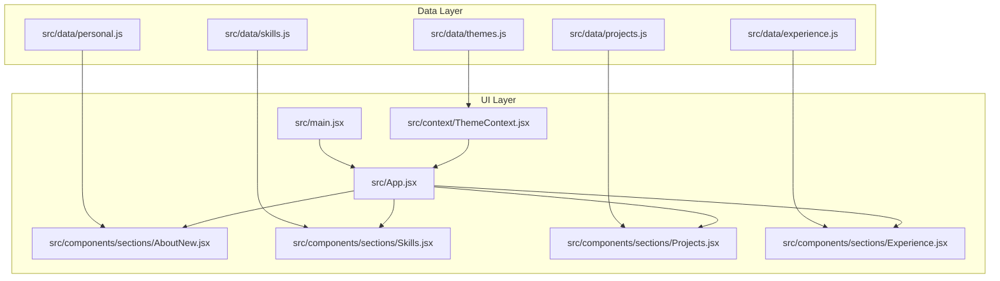
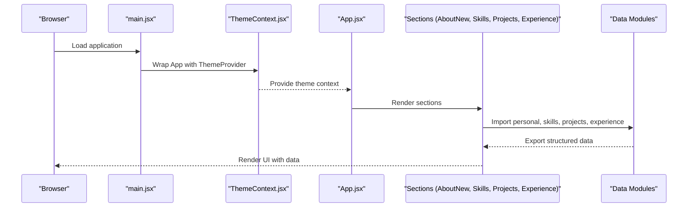
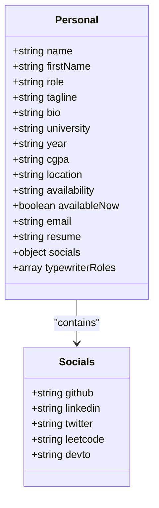
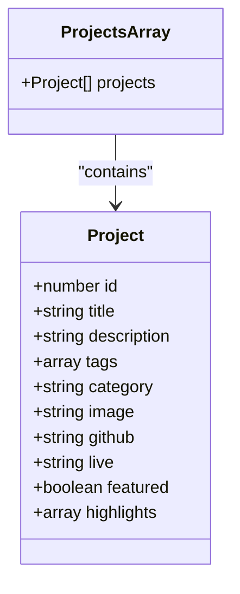
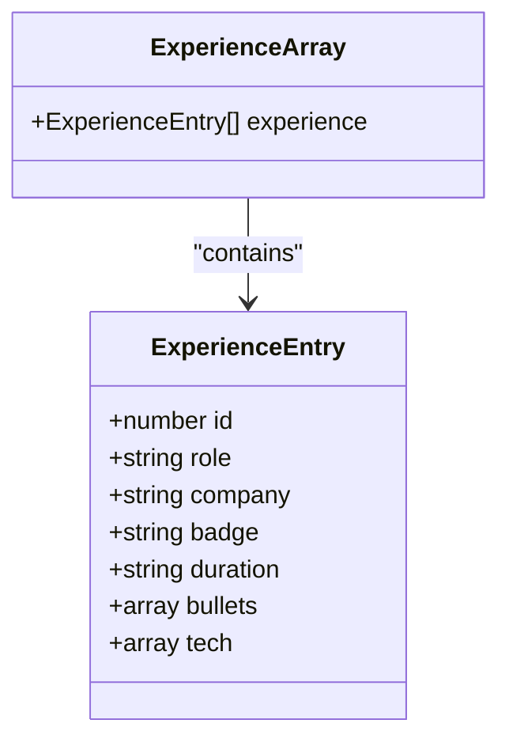
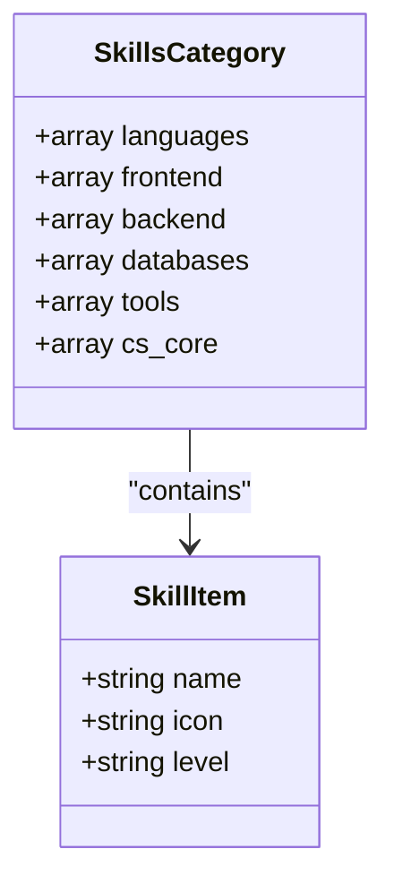
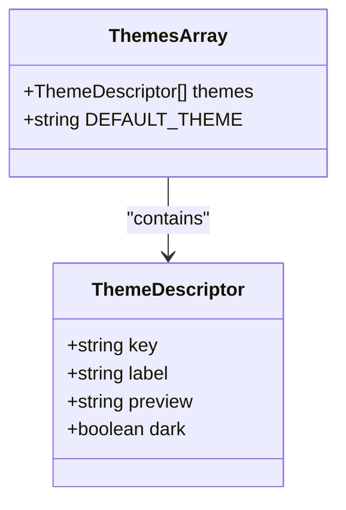
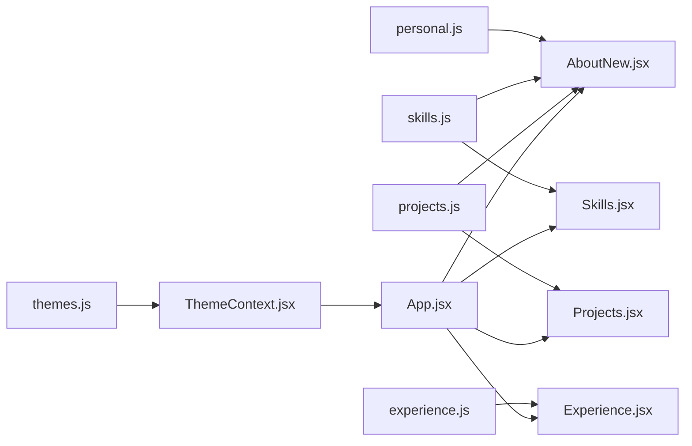
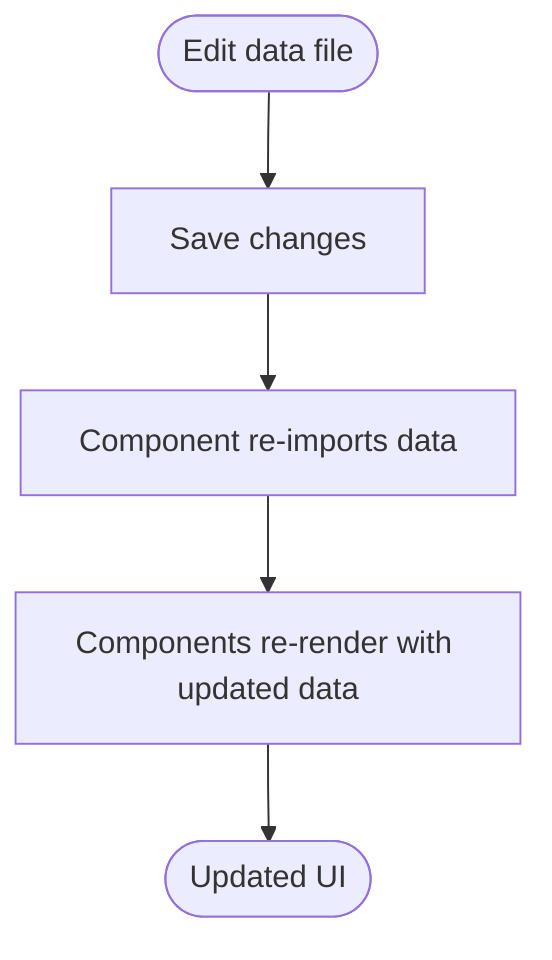

# Data Management

<cite>
**Referenced Files in This Document**
- [personal.js](file://src/data/personal.js)
- [projects.js](file://src/data/projects.js)
- [experience.js](file://src/data/experience.js)
- [skills.js](file://src/data/skills.js)
- [themes.js](file://src/data/themes.js)
- [AboutNew.jsx](file://src/components/sections/AboutNew.jsx)
- [Projects.jsx](file://src/components/sections/Projects.jsx)
- [Experience.jsx](file://src/components/sections/Experience.jsx)
- [Skills.jsx](file://src/components/sections/Skills.jsx)
- [App.jsx](file://src/App.jsx)
- [main.jsx](file://src/main.jsx)
- [ThemeContext.jsx](file://src/context/ThemeContext.jsx)
</cite>

## Table of Contents
1. [Introduction](#introduction)
2. [Project Structure](#project-structure)
3. [Core Components](#core-components)
4. [Architecture Overview](#architecture-overview)
5. [Detailed Component Analysis](#detailed-component-analysis)
6. [Dependency Analysis](#dependency-analysis)
7. [Performance Considerations](#performance-considerations)
8. [Troubleshooting Guide](#troubleshooting-guide)
9. [Conclusion](#conclusion)
10. [Appendices](#appendices)

## Introduction
This document describes the data model and content management system for the portfolio. It explains how personal information, project portfolios, work experience timelines, and skills are structured, validated, formatted, and rendered into React components. It also documents the data flow from static data files to UI components, caching strategies, and best practices for importing/exporting content.

## Project Structure
The portfolio organizes content as small, immutable JavaScript modules under src/data. Each module exports a single data object or array tailored to a specific UI section. Components import these modules and render the data declaratively.

**Diagram sources**
- [personal.js:1-29](file://src/data/personal.js#L1-L29)
- [skills.js:1-39](file://src/data/skills.js#L1-L39)
- [projects.js:1-67](file://src/data/projects.js#L1-L67)
- [experience.js:1-43](file://src/data/experience.js#L1-L43)
- [themes.js:1-30](file://src/data/themes.js#L1-L30)
- [AboutNew.jsx:1-420](file://src/components/sections/AboutNew.jsx#L1-L420)
- [Skills.jsx:1-531](file://src/components/sections/Skills.jsx#L1-L531)
- [Projects.jsx:1-125](file://src/components/sections/Projects.jsx#L1-L125)
- [Experience.jsx:1-168](file://src/components/sections/Experience.jsx#L1-L168)
- [App.jsx:1-47](file://src/App.jsx#L1-L47)
- [main.jsx:1-16](file://src/main.jsx#L1-L16)
- [ThemeContext.jsx:1-23](file://src/context/ThemeContext.jsx#L1-L23)

**Section sources**
- [personal.js:1-29](file://src/data/personal.js#L1-L29)
- [skills.js:1-39](file://src/data/skills.js#L1-L39)
- [projects.js:1-67](file://src/data/projects.js#L1-L67)
- [experience.js:1-43](file://src/data/experience.js#L1-L43)
- [themes.js:1-30](file://src/data/themes.js#L1-L30)
- [AboutNew.jsx:1-420](file://src/components/sections/AboutNew.jsx#L1-L420)
- [Skills.jsx:1-531](file://src/components/sections/Skills.jsx#L1-L531)
- [Projects.jsx:1-125](file://src/components/sections/Projects.jsx#L1-L125)
- [Experience.jsx:1-168](file://src/components/sections/Experience.jsx#L1-L168)
- [App.jsx:1-47](file://src/App.jsx#L1-L47)
- [main.jsx:1-16](file://src/main.jsx#L1-L16)
- [ThemeContext.jsx:1-23](file://src/context/ThemeContext.jsx#L1-L23)

## Core Components
This section defines the data models and their relationships to UI components.

- Personal Information Model
  - Purpose: Centralize identity, roles, bios, contact links, and availability.
  - Key fields: name, firstName, role, tagline, bio, university, year, cgpa, location, availability, availableNow, email, resume, socials, typewriterRoles.
  - Validation and formatting: Strongly typed strings; availability toggles UI badges; socials URLs validated externally; resume path resolves to public/.
  - Relationship: Imported by AboutNew and Contact sections.

- Projects Model
  - Purpose: Store project entries with metadata, categorization, and highlights.
  - Key fields: id, title, description, tags, category, image, github, live, featured, highlights.
  - Categories: fullstack, systems, ml, devops.
  - Validation and formatting: id uniqueness; category enum; image path resolution; tags and highlights arrays; featured flag for prominence.
  - Relationship: Imported by Projects and AboutNew.

- Experience Model
  - Purpose: Timeline of professional roles with achievements and technologies.
  - Key fields: id, role, company, badge, duration, bullets, tech.
  - Validation and formatting: bullets and tech arrays; badge labels (e.g., Current, Active, Leadership).
  - Relationship: Imported by Experience.

- Skills Model
  - Purpose: Organize technical proficiencies by category with proficiency levels.
  - Key fields: languages, frontend, backend, databases, tools, cs_core.
  - Sub-fields: name, icon, level (primary or secondary).
  - Validation and formatting: name uniqueness within category; icon mapped to DevIcon CDN; level controls visual emphasis.
  - Relationship: Imported by Skills.

- Themes Model
  - Purpose: Define available UI themes and defaults.
  - Key fields: key, label, preview, dark.
  - Relationship: Imported by ThemeContext and UI theme toggle.

**Section sources**
- [personal.js:1-29](file://src/data/personal.js#L1-L29)
- [projects.js:1-67](file://src/data/projects.js#L1-L67)
- [experience.js:1-43](file://src/data/experience.js#L1-L43)
- [skills.js:1-39](file://src/data/skills.js#L1-L39)
- [themes.js:1-30](file://src/data/themes.js#L1-L30)

## Architecture Overview
The data architecture follows a unidirectional flow: data modules export static content; React components import and render; theme context manages presentation.

**Diagram sources**
- [main.jsx:1-16](file://src/main.jsx#L1-L16)
- [ThemeContext.jsx:1-23](file://src/context/ThemeContext.jsx#L1-L23)
- [App.jsx:1-47](file://src/App.jsx#L1-L47)
- [AboutNew.jsx:1-420](file://src/components/sections/AboutNew.jsx#L1-L420)
- [Skills.jsx:1-531](file://src/components/sections/Skills.jsx#L1-L531)
- [Projects.jsx:1-125](file://src/components/sections/Projects.jsx#L1-L125)
- [Experience.jsx:1-168](file://src/components/sections/Experience.jsx#L1-L168)
- [personal.js:1-29](file://src/data/personal.js#L1-L29)
- [skills.js:1-39](file://src/data/skills.js#L1-L39)
- [projects.js:1-67](file://src/data/projects.js#L1-L67)
- [experience.js:1-43](file://src/data/experience.js#L1-L43)

## Detailed Component Analysis

### Personal Information Data Model
- Structure: Object with nested socials and typewriterRoles array.
- Rendering: Used in AboutNew for bio, stats, availability badge, and CTA buttons; referenced in Projects for GitHub CTA fallback.
- Validation: No runtime validation in code; rely on field presence and types.

**Diagram sources**
- [personal.js:1-29](file://src/data/personal.js#L1-L29)

**Section sources**
- [personal.js:1-29](file://src/data/personal.js#L1-L29)
- [AboutNew.jsx:1-420](file://src/components/sections/AboutNew.jsx#L1-L420)
- [Projects.jsx:1-125](file://src/components/sections/Projects.jsx#L1-L125)

### Projects Data Model
- Structure: Array of project objects with category and highlights.
- Rendering: Projects.jsx filters by category and renders sticky cards; AboutNew composes tech list from skills.
- Validation: id must be unique; category must match allowed values; image path must resolve.

**Diagram sources**
- [projects.js:1-67](file://src/data/projects.js#L1-L67)

**Section sources**
- [projects.js:1-67](file://src/data/projects.js#L1-L67)
- [Projects.jsx:1-125](file://src/components/sections/Projects.jsx#L1-L125)
- [AboutNew.jsx:1-420](file://src/components/sections/AboutNew.jsx#L1-L420)

### Experience Data Model
- Structure: Array of experience entries with bullets and tech arrays.
- Rendering: Experience.jsx renders a vertical timeline with badges and technology tags.
- Validation: bullet and tech arrays should be non-empty for meaningful rendering.

**Diagram sources**
- [experience.js:1-43](file://src/data/experience.js#L1-L43)

**Section sources**
- [experience.js:1-43](file://src/data/experience.js#L1-L43)
- [Experience.jsx:1-168](file://src/components/sections/Experience.jsx#L1-L168)

### Skills Data Model
- Structure: Object with categorized arrays and a cs_core array.
- Rendering: Skills.jsx renders category tabs, skill cards with 3D tilt effects, and CS fundamentals.
- Validation: level must be primary or secondary; icon must resolve via CDN.

**Diagram sources**
- [skills.js:1-39](file://src/data/skills.js#L1-L39)

**Section sources**
- [skills.js:1-39](file://src/data/skills.js#L1-L39)
- [Skills.jsx:1-531](file://src/components/sections/Skills.jsx#L1-L531)

### Themes Data Model
- Structure: Array of theme descriptors with preview colors and dark mode flags.
- Rendering: ThemeContext.jsx provides theme state; UI theme toggle applies data-theme attribute.
- Validation: key must be unique and match expected values.

**Diagram sources**
- [themes.js:1-30](file://src/data/themes.js#L1-L30)
- [ThemeContext.jsx:1-23](file://src/context/ThemeContext.jsx#L1-L23)

**Section sources**
- [themes.js:1-30](file://src/data/themes.js#L1-L30)
- [ThemeContext.jsx:1-23](file://src/context/ThemeContext.jsx#L1-L23)

## Dependency Analysis
- Data-to-Component Dependencies
  - AboutNew depends on personal and skills.
  - Projects depends on projects and personal.
  - Experience depends on experience.
  - Skills depends on skills.
- Theme Context
  - ThemeProvider wraps the application and exposes theme state to UI.
- Static Asset Resolution
  - Image paths in projects.js resolve under public/images/projects.
  - Resume path in personal.js resolves under public/.

**Diagram sources**
- [personal.js:1-29](file://src/data/personal.js#L1-L29)
- [skills.js:1-39](file://src/data/skills.js#L1-L39)
- [projects.js:1-67](file://src/data/projects.js#L1-L67)
- [experience.js:1-43](file://src/data/experience.js#L1-L43)
- [themes.js:1-30](file://src/data/themes.js#L1-L30)
- [AboutNew.jsx:1-420](file://src/components/sections/AboutNew.jsx#L1-L420)
- [Skills.jsx:1-531](file://src/components/sections/Skills.jsx#L1-L531)
- [Projects.jsx:1-125](file://src/components/sections/Projects.jsx#L1-L125)
- [Experience.jsx:1-168](file://src/components/sections/Experience.jsx#L1-L168)
- [ThemeContext.jsx:1-23](file://src/context/ThemeContext.jsx#L1-L23)
- [App.jsx:1-47](file://src/App.jsx#L1-L47)

**Section sources**
- [AboutNew.jsx:1-420](file://src/components/sections/AboutNew.jsx#L1-L420)
- [Skills.jsx:1-531](file://src/components/sections/Skills.jsx#L1-L531)
- [Projects.jsx:1-125](file://src/components/sections/Projects.jsx#L1-L125)
- [Experience.jsx:1-168](file://src/components/sections/Experience.jsx#L1-L168)
- [ThemeContext.jsx:1-23](file://src/context/ThemeContext.jsx#L1-L23)
- [App.jsx:1-47](file://src/App.jsx#L1-L47)

## Performance Considerations
- Data Reuse
  - AboutNew composes a flat tech list from skills to avoid repeated rendering of redundant entries.
- Rendering Optimization
  - Projects.jsx uses category filtering client-side; keep project counts reasonable to maintain smooth filtering.
  - Skills.jsx uses AnimatePresence and spring-based transforms; limit excessive category switching for responsiveness.
- Asset Loading
  - Skills.jsx loads icons from a CDN; ensure fallbacks are handled to prevent layout shifts.
- Theme Switching
  - ThemeContext.jsx centralizes theme state; minimize unnecessary re-renders by keeping theme logic pure.

[No sources needed since this section provides general guidance]

## Troubleshooting Guide
- Missing Images
  - Symptom: Broken image placeholders in Projects.
  - Action: Verify image paths in projects.js exist under public/images/projects and filenames match exactly.
- Broken Social Links
  - Symptom: Non-functional links in AboutNew or Projects CTA.
  - Action: Confirm URLs in personal.js socials are valid and reachable.
- Skills Icon Fallback
  - Symptom: Missing skill icons.
  - Action: Skills.jsx handles CDN fallback; ensure network connectivity and that icon names in skills.js match DevIcon slugs.
- Experience Bullet Points
  - Symptom: Empty or missing bullet lists.
  - Action: Ensure bullets arrays are populated in experience.js.
- Theme Not Applying
  - Symptom: Theme toggle has no effect.
  - Action: Confirm ThemeProvider wraps App and that data-theme attribute is applied to the root element.

**Section sources**
- [Projects.jsx:1-125](file://src/components/sections/Projects.jsx#L1-L125)
- [AboutNew.jsx:1-420](file://src/components/sections/AboutNew.jsx#L1-L420)
- [Skills.jsx:1-531](file://src/components/sections/Skills.jsx#L1-L531)
- [experience.js:1-43](file://src/data/experience.js#L1-L43)
- [personal.js:1-29](file://src/data/personal.js#L1-L29)
- [ThemeContext.jsx:1-23](file://src/context/ThemeContext.jsx#L1-L23)

## Conclusion
The portfolio’s data management relies on small, focused data modules that are imported directly by React components. This approach keeps content declarative, easy to update, and strongly aligned with UI sections. By adhering to the data models and validation expectations outlined here, contributors can reliably add new projects, update experience entries, and modify skills lists while maintaining consistent rendering and performance.

[No sources needed since this section summarizes without analyzing specific files]

## Appendices

### Data Validation Rules and Formatting Requirements
- Personal Information
  - Fields: strings; availability toggles UI badge; socials must be valid URLs; resume path resolves to public/.
- Projects
  - Fields: id (unique), category in ["fullstack","systems","ml","devops"], image path must resolve, tags and highlights arrays.
- Experience
  - Fields: bullets and tech arrays; badge labels are free text but commonly "Current", "Active", "Leadership".
- Skills
  - Fields: level in ["primary","secondary"]; icon must match DevIcon slug; cs_core is a list of strings.
- Themes
  - Fields: key must be unique; preview is a hex color; dark indicates theme darkness.

**Section sources**
- [personal.js:1-29](file://src/data/personal.js#L1-L29)
- [projects.js:1-67](file://src/data/projects.js#L1-L67)
- [experience.js:1-43](file://src/data/experience.js#L1-L43)
- [skills.js:1-39](file://src/data/skills.js#L1-L39)
- [themes.js:1-30](file://src/data/themes.js#L1-L30)

### Adding New Projects
- Steps
  - Add a new entry to projects.js with a unique id, appropriate category, and image path.
  - Include highlights and tags for richer presentation.
  - Reference: [projects.js:1-67](file://src/data/projects.js#L1-L67), [Projects.jsx:1-125](file://src/components/sections/Projects.jsx#L1-L125).

**Section sources**
- [projects.js:1-67](file://src/data/projects.js#L1-L67)
- [Projects.jsx:1-125](file://src/components/sections/Projects.jsx#L1-L125)

### Updating Experience Information
- Steps
  - Append a new experience entry to experience.js with role, company, duration, bullets, and tech.
  - Use badge to indicate current or leadership status.
  - Reference: [experience.js:1-43](file://src/data/experience.js#L1-L43), [Experience.jsx:1-168](file://src/components/sections/Experience.jsx#L1-L168).

**Section sources**
- [experience.js:1-43](file://src/data/experience.js#L1-L43)
- [Experience.jsx:1-168](file://src/components/sections/Experience.jsx#L1-L168)

### Modifying Skills Lists
- Steps
  - Update skills.js categories with new skill entries; ensure icon matches DevIcon slug and level is primary or secondary.
  - Reference: [skills.js:1-39](file://src/data/skills.js#L1-L39), [Skills.jsx:1-531](file://src/components/sections/Skills.jsx#L1-L531).

**Section sources**
- [skills.js:1-39](file://src/data/skills.js#L1-L39)
- [Skills.jsx:1-531](file://src/components/sections/Skills.jsx#L1-L531)

### Data Import/Export Capabilities and Best Practices
- Import/Export
  - The portfolio uses static JavaScript modules for data. There is no built-in JSON import/export mechanism.
- Best Practices
  - Keep ids unique across collections.
  - Use lowercase category names consistently.
  - Maintain icon slugs that match DevIcon naming.
  - Validate external links (GitHub, LinkedIn) before committing.
  - Keep image paths under public/ and ensure files exist.

[No sources needed since this section provides general guidance]

### Data Flow from Static Files to React Components and Caching Strategies
- Data Flow
  - Data modules are imported by components; React renders UI declaratively.
  - ThemeContext.jsx provides theme state globally.
- Caching
  - Skills icons are fetched from a CDN; ensure reliable fallbacks.
  - Client-side filtering in Projects.jsx avoids server round-trips.
  - No explicit client-side cache invalidation is present; rely on component re-rendering when data modules change.

**Diagram sources**
- [personal.js:1-29](file://src/data/personal.js#L1-L29)
- [skills.js:1-39](file://src/data/skills.js#L1-L39)
- [projects.js:1-67](file://src/data/projects.js#L1-L67)
- [experience.js:1-43](file://src/data/experience.js#L1-L43)
- [AboutNew.jsx:1-420](file://src/components/sections/AboutNew.jsx#L1-L420)
- [Skills.jsx:1-531](file://src/components/sections/Skills.jsx#L1-L531)
- [Projects.jsx:1-125](file://src/components/sections/Projects.jsx#L1-L125)
- [Experience.jsx:1-168](file://src/components/sections/Experience.jsx#L1-L168)

**Section sources**
- [main.jsx:1-16](file://src/main.jsx#L1-L16)
- [ThemeContext.jsx:1-23](file://src/context/ThemeContext.jsx#L1-L23)
- [App.jsx:1-47](file://src/App.jsx#L1-L47)