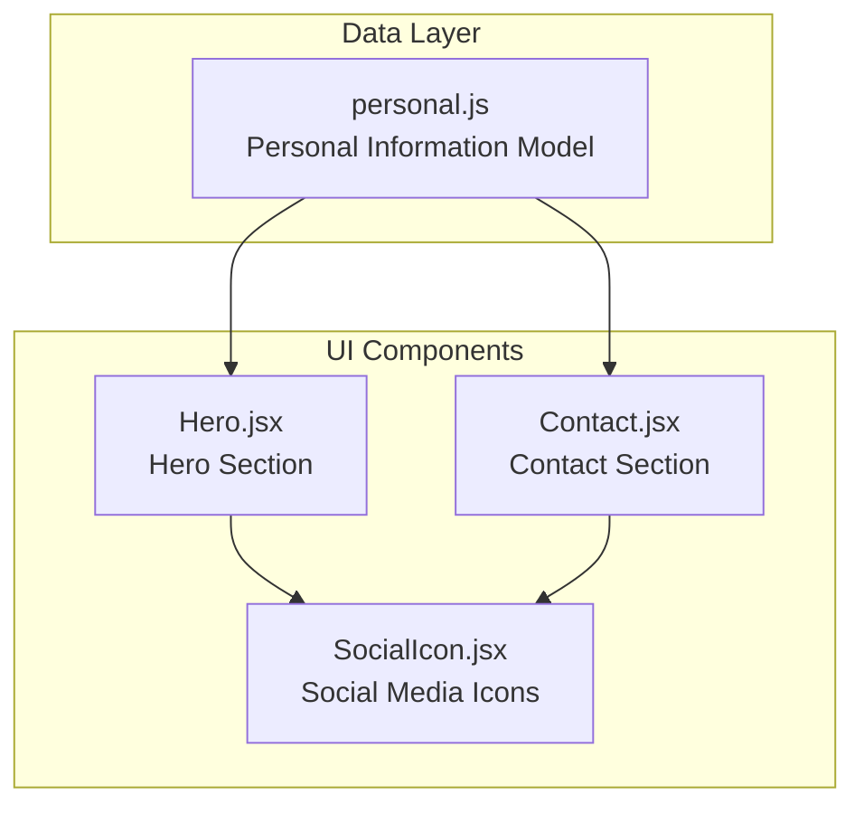
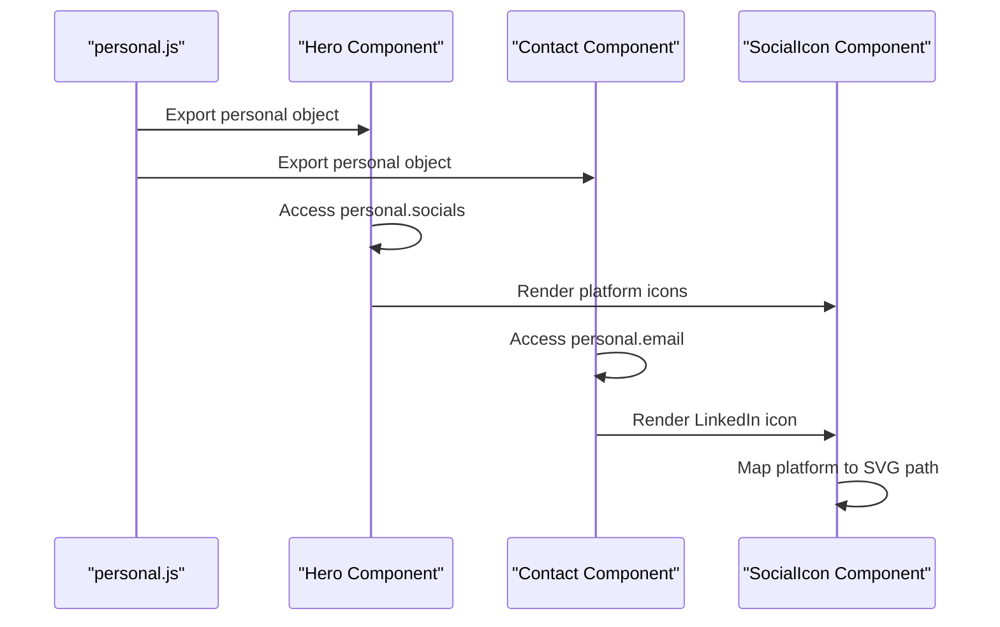
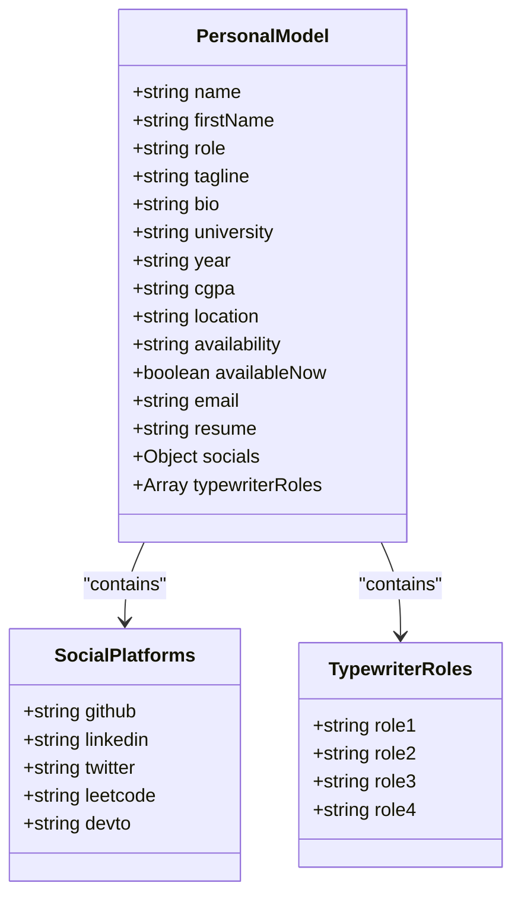
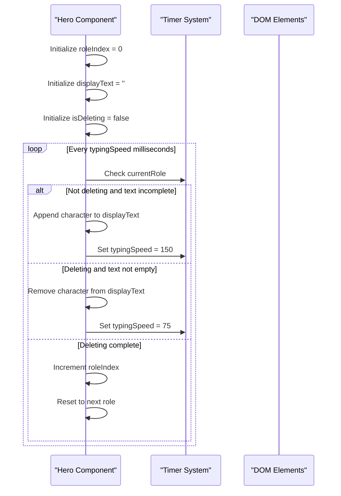
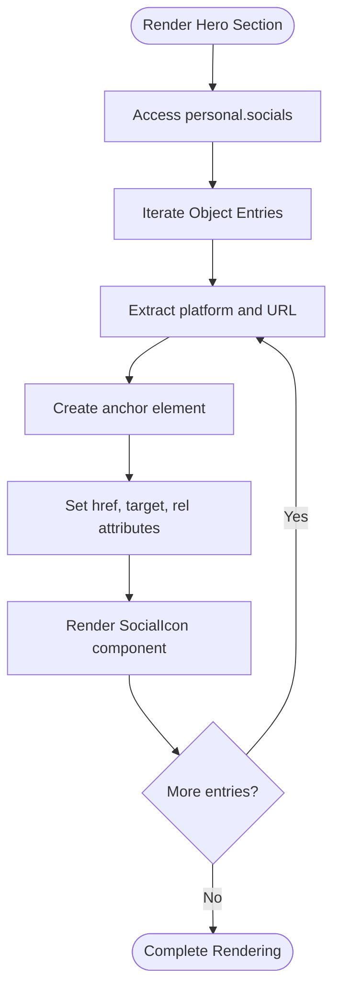
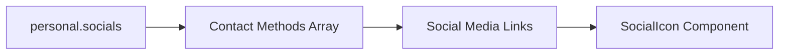
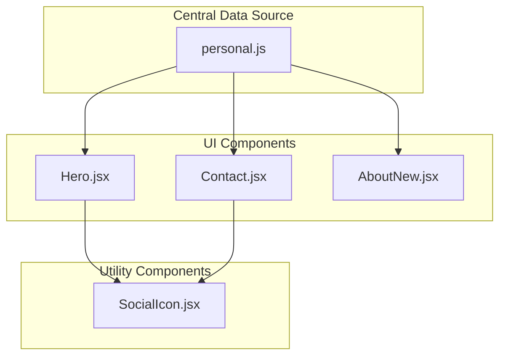

# Personal Information Model

<cite>
**Referenced Files in This Document**
- [personal.js](file://src/data/personal.js)
- [Hero.jsx](file://src/components/sections/Hero.jsx)
- [SocialIcon.jsx](file://src/components/ui/SocialIcon.jsx)
- [Contact.jsx](file://src/components/sections/Contact.jsx)
- [README.md](file://README.md)
</cite>

## Table of Contents
1. [Introduction](#introduction)
2. [Project Structure](#project-structure)
3. [Core Components](#core-components)
4. [Architecture Overview](#architecture-overview)
5. [Detailed Component Analysis](#detailed-component-analysis)
6. [Dependency Analysis](#dependency-analysis)
7. [Performance Considerations](#performance-considerations)
8. [Troubleshooting Guide](#troubleshooting-guide)
9. [Conclusion](#conclusion)

## Introduction
This document provides comprehensive documentation for the personal information data model used throughout the portfolio website. The personal information model serves as the central data source for displaying professional information, social media links, and dynamic content like role transitions in the Hero section. It forms the foundation for consistent branding and user experience across all sections of the portfolio.

## Project Structure
The personal information model is organized within the data layer of the application, specifically in the `src/data/personal.js` file. This centralized approach ensures consistency across all components that display personal information.

**Diagram sources**
- [personal.js:1-29](file://src/data/personal.js#L1-L29)
- [Hero.jsx:1-229](file://src/components/sections/Hero.jsx#L1-L229)
- [Contact.jsx:1-293](file://src/components/sections/Contact.jsx#L1-L293)
- [SocialIcon.jsx:1-32](file://src/components/ui/SocialIcon.jsx#L1-L32)

**Section sources**
- [personal.js:1-29](file://src/data/personal.js#L1-L29)
- [README.md:61-69](file://README.md#L61-L69)

## Core Components
The personal information model consists of several key components that work together to present a comprehensive professional profile:

### Basic Information Fields
The model includes fundamental identification and professional details:
- **Name and First Name**: Complete name and first name for personalized greetings
- **Role**: Primary professional designation
- **Tagline**: Professional summary or value proposition
- **Bio**: Detailed professional background and achievements

### Academic Information
Structured academic details for educational background presentation:
- **University**: Institution name and location
- **Year**: Current academic year
- **CGPA**: Academic performance indicator
- **Location**: Geographic location for contact purposes

### Availability Status
Dynamic availability indicators for career opportunities:
- **Availability Text**: Public availability message
- **Available Now Flag**: Boolean flag controlling visual indicators

### Contact Information
Essential contact details for professional communication:
- **Email**: Primary professional email address
- **Resume**: Resume file path for download

### Social Media Platform Integration
Comprehensive social media connectivity:
- **GitHub**: Open source contributions and projects
- **LinkedIn**: Professional networking
- **Twitter**: Professional updates and engagement
- **LeetCode**: Problem-solving and coding challenges
- **Dev.to**: Technical writing and blogging

### Dynamic Role Transitions
Interactive role display system:
- **Typewriter Roles Array**: Collection of professional roles for animated display

**Section sources**
- [personal.js:1-29](file://src/data/personal.js#L1-L29)

## Architecture Overview
The personal information model follows a unidirectional data flow pattern where the centralized data source feeds information to multiple UI components through React's component architecture.

**Diagram sources**
- [personal.js:1-29](file://src/data/personal.js#L1-L29)
- [Hero.jsx:13-203](file://src/components/sections/Hero.jsx#L13-L203)
- [Contact.jsx:93-200](file://src/components/sections/Contact.jsx#L93-L200)
- [SocialIcon.jsx:1-32](file://src/components/ui/SocialIcon.jsx#L1-L32)

## Detailed Component Analysis

### Personal Information Data Structure
The personal information model is structured as a JavaScript object containing multiple categories of information:

**Diagram sources**
- [personal.js:1-29](file://src/data/personal.js#L1-L29)

### Hero Section Integration
The Hero section serves as the primary showcase for personal information, utilizing the personal model for dynamic content presentation:

#### Typewriter Role Animation
The Hero component implements a sophisticated typewriter effect that cycles through professional roles:

**Diagram sources**
- [Hero.jsx:15-39](file://src/components/sections/Hero.jsx#L15-L39)

#### Social Media Integration
The Hero section dynamically renders social media links based on the personal model:

**Diagram sources**
- [Hero.jsx:182-202](file://src/components/sections/Hero.jsx#L182-L202)
- [SocialIcon.jsx:23-28](file://src/components/ui/SocialIcon.jsx#L23-L28)

**Section sources**
- [Hero.jsx:1-229](file://src/components/sections/Hero.jsx#L1-L229)
- [SocialIcon.jsx:1-32](file://src/components/ui/SocialIcon.jsx#L1-L32)

### Contact Section Integration
The Contact section utilizes personal information for multiple purposes:

#### Contact Methods Array
The Contact component creates a structured array of contact methods using personal information:

| Field | Source | Purpose |
|-------|--------|---------|
| Email | `personal.email` | Primary contact method |
| Location | `personal.location` | Geographic contact information |
| LinkedIn | `personal.socials.linkedin` | Professional networking |

#### Social Media Links
The Contact section maintains its own social media integration pattern:

**Diagram sources**
- [Contact.jsx:93-200](file://src/components/sections/Contact.jsx#L93-L200)

**Section sources**
- [Contact.jsx:1-293](file://src/components/sections/Contact.jsx#L1-L293)

## Dependency Analysis
The personal information model creates dependencies across multiple components, establishing a clear data flow pattern:

**Diagram sources**
- [personal.js:1-29](file://src/data/personal.js#L1-L29)
- [Hero.jsx:3-5](file://src/components/sections/Hero.jsx#L3-L5)
- [Contact.jsx:3-4](file://src/components/sections/Contact.jsx#L3-L4)

### Component Coupling Analysis
The personal model demonstrates low coupling with high cohesion:
- **Low Coupling**: Components import only the specific fields they need
- **High Cohesion**: Related personal information is grouped logically
- **Single Source of Truth**: Centralized data prevents inconsistencies

**Section sources**
- [personal.js:1-29](file://src/data/personal.js#L1-L29)
- [Hero.jsx:1-229](file://src/components/sections/Hero.jsx#L1-L229)
- [Contact.jsx:1-293](file://src/components/sections/Contact.jsx#L1-L293)

## Performance Considerations
The personal information model is designed for optimal performance characteristics:

### Memory Efficiency
- **Immutable Data**: The personal object is exported as a constant, enabling React's memoization benefits
- **Minimal Dependencies**: Components only import required fields, reducing unnecessary re-renders
- **Efficient Rendering**: Social media links are rendered using efficient mapping patterns

### Runtime Performance
- **Static Content**: Personal information loads once and remains static during component lifecycle
- **Optimized Animations**: Typewriter effect uses minimal DOM manipulation
- **Lazy Loading**: Social media icons are loaded only when needed

## Troubleshooting Guide

### Common Issues and Solutions

#### Social Media Platform Not Displaying
**Issue**: New social media platform not appearing in Hero or Contact sections
**Solution**: Ensure the platform is added to the `socials` object in `personal.js` with a valid URL format

#### Typewriter Animation Not Working
**Issue**: Role animation not cycling through roles
**Solution**: Verify that `typewriterRoles` array contains at least one role and that the Hero component is importing the personal model correctly

#### Availability Badge Not Showing
**Issue**: Green availability badge not appearing in Hero section
**Solution**: Check that `availableNow` boolean is set to `true` and that the Hero component's availability logic is functioning correctly

#### Social Icon Not Rendering
**Issue**: Social media icons not displaying properly
**Solution**: Verify that the platform name exists in the SocialIcon component's icon mapping and that the URL is properly formatted

**Section sources**
- [Hero.jsx:80-94](file://src/components/sections/Hero.jsx#L80-L94)
- [Hero.jsx:182-202](file://src/components/sections/Hero.jsx#L182-L202)
- [SocialIcon.jsx:1-32](file://src/components/ui/SocialIcon.jsx#L1-L32)

## Conclusion
The personal information model serves as a robust foundation for the portfolio website, providing a centralized, maintainable source of professional information. Its design emphasizes simplicity, scalability, and performance while maintaining flexibility for future enhancements. The model's integration with the Hero and Contact sections demonstrates effective separation of concerns and reusable component architecture.

The modular structure allows for easy maintenance and updates, while the centralized approach ensures consistency across all user-facing components. Future enhancements could include additional social media platforms, expanded academic information fields, or enhanced availability status indicators.