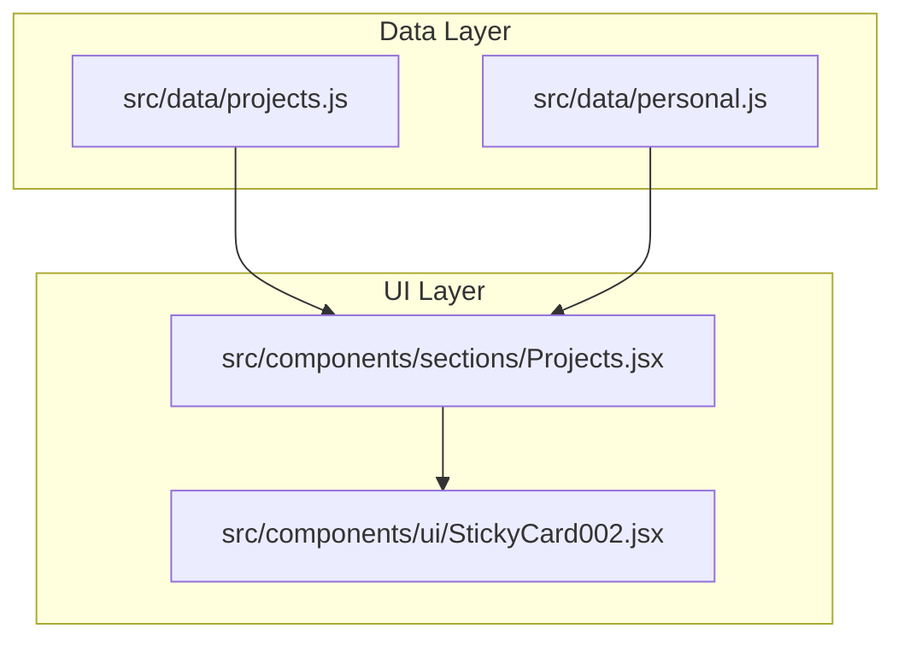
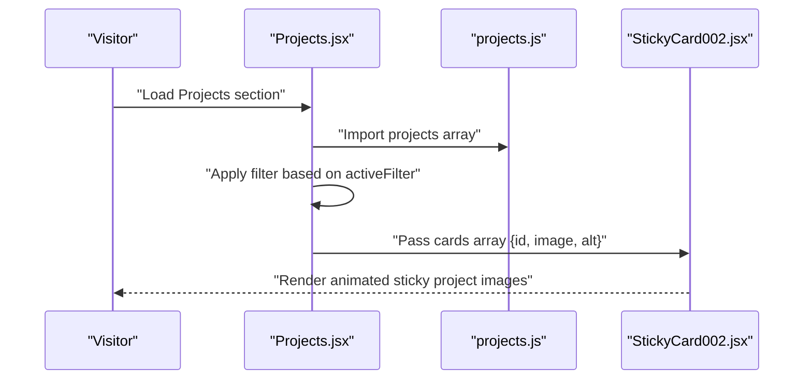
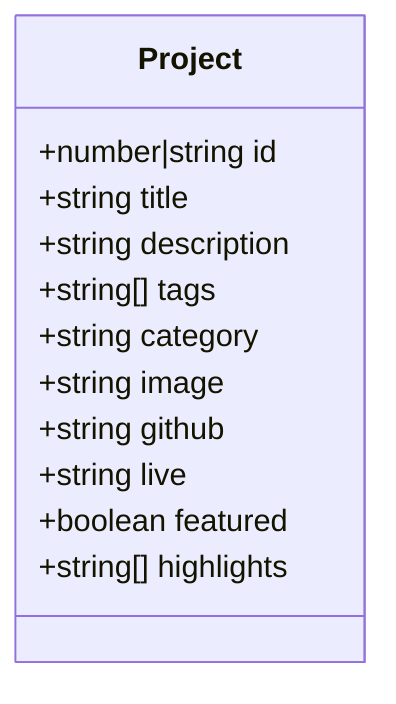
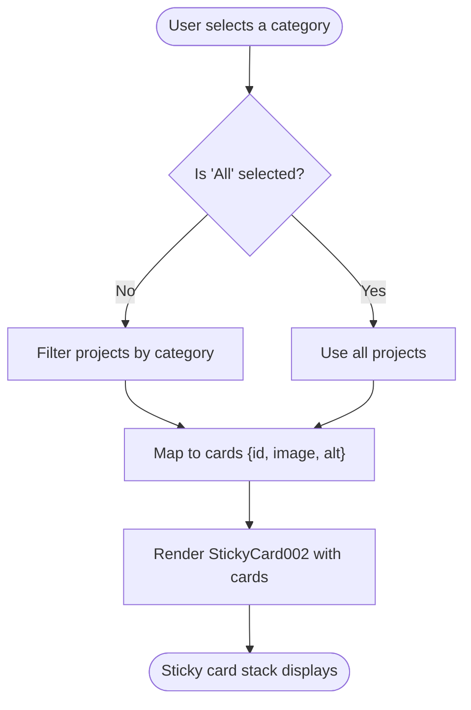
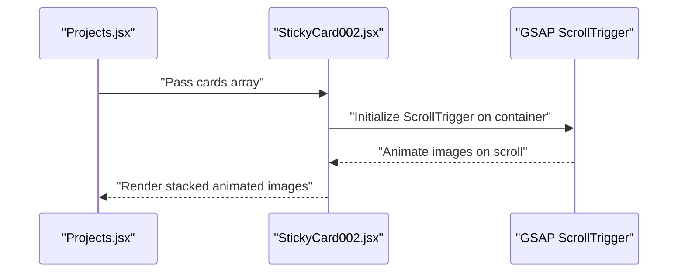

# Projects Portfolio Model

<cite>
**Referenced Files in This Document**
- [projects.js](file://src/data/projects.js)
- [Projects.jsx](file://src/components/sections/Projects.jsx)
- [StickyCard002.jsx](file://src/components/ui/StickyCard002.jsx)
- [README.md](file://README.md)
- [README-IMAGES.md](file://README-IMAGES.md)
- [personal.js](file://src/data/personal.js)
- [package.json](file://package.json)
</cite>

## Table of Contents
1. [Introduction](#introduction)
2. [Project Structure](#project-structure)
3. [Core Components](#core-components)
4. [Architecture Overview](#architecture-overview)
5. [Detailed Component Analysis](#detailed-component-analysis)
6. [Dependency Analysis](#dependency-analysis)
7. [Performance Considerations](#performance-considerations)
8. [Troubleshooting Guide](#troubleshooting-guide)
9. [Conclusion](#conclusion)

## Introduction
This document describes the projects data model and portfolio management system used in the portfolio website. It explains the project object structure, filtering by category, featured project selection, and how the data integrates with the Projects section components. It also covers image optimization requirements, link configuration, and metadata management for projects.

## Project Structure
The projects portfolio is composed of:
- A centralized data file that defines the project collection
- A Projects section component that renders and filters projects
- A sticky card viewer component that animates project images
- Supporting documentation for image assets and optimization

**Diagram sources**
- [projects.js:1-67](file://src/data/projects.js#L1-L67)
- [Projects.jsx:1-125](file://src/components/sections/Projects.jsx#L1-L125)
- [StickyCard002.jsx:1-127](file://src/components/ui/StickyCard002.jsx#L1-L127)
- [personal.js:1-29](file://src/data/personal.js#L1-L29)

**Section sources**
- [projects.js:1-67](file://src/data/projects.js#L1-L67)
- [Projects.jsx:1-125](file://src/components/sections/Projects.jsx#L1-L125)
- [StickyCard002.jsx:1-127](file://src/components/ui/StickyCard002.jsx#L1-L127)
- [README.md:32-57](file://README.md#L32-L57)

## Core Components
This section documents the project data model and the Projects section behavior.

- Project object structure
  - Unique identifier
  - Title and description
  - Technology tags
  - Category for filtering
  - Image asset path
  - GitHub and live demo links
  - Featured flag for prominence
  - Highlights bullet points

- Filtering system
  - Categories supported: all, fullstack, systems, ml, devops
  - Filter applied client-side by matching the category field

- Featured project selection
  - Projects marked as featured appear prominently in the UI
  - The selection is controlled by the featured flag in the project data

- Relationship to UI components
  - Projects section imports the project collection and applies filters
  - The sticky card viewer receives a minimal card dataset containing id, image, and alt

**Section sources**
- [projects.js:1-67](file://src/data/projects.js#L1-L67)
- [Projects.jsx:9-15](file://src/components/sections/Projects.jsx#L9-L15)
- [Projects.jsx:22-31](file://src/components/sections/Projects.jsx#L22-L31)
- [StickyCard002.jsx:11-14](file://src/components/ui/StickyCard002.jsx#L11-L14)

## Architecture Overview
The Projects section orchestrates data consumption, filtering, and presentation.

**Diagram sources**
- [Projects.jsx:1-125](file://src/components/sections/Projects.jsx#L1-L125)
- [projects.js:1-67](file://src/data/projects.js#L1-L67)
- [StickyCard002.jsx:1-127](file://src/components/ui/StickyCard002.jsx#L1-L127)

## Detailed Component Analysis

### Project Data Model
The project data model defines each project entry with the following fields:
- id: integer or string identifier
- title: display name
- description: short summary
- tags: array of technology names
- category: one of fullstack, systems, ml, devops
- image: path to the project screenshot
- github: link to source code repository
- live: link to deployed demo
- featured: boolean to mark as featured
- highlights: array of key achievement bullets

**Diagram sources**
- [projects.js:1-67](file://src/data/projects.js#L1-L67)

**Section sources**
- [projects.js:1-67](file://src/data/projects.js#L1-L67)

### Projects Section Filtering and Presentation
The Projects section implements:
- Category filter buttons
- Client-side filtering logic
- Animated sticky card stack for project images

Key behaviors:
- Filters projects by category when a filter button is selected
- Builds a minimal cards array with id, image, and alt for the sticky card component
- Uses motion variants for entrance animations

**Diagram sources**
- [Projects.jsx:9-15](file://src/components/sections/Projects.jsx#L9-L15)
- [Projects.jsx:22-31](file://src/components/sections/Projects.jsx#L22-L31)
- [StickyCard002.jsx:11-14](file://src/components/ui/StickyCard002.jsx#L11-L14)

**Section sources**
- [Projects.jsx:9-15](file://src/components/sections/Projects.jsx#L9-L15)
- [Projects.jsx:17-88](file://src/components/sections/Projects.jsx#L17-L88)
- [Projects.jsx:22-31](file://src/components/sections/Projects.jsx#L22-L31)

### Sticky Card Viewer
The sticky card viewer component:
- Accepts a cards prop with id, image, and optional alt
- Uses GSAP and Lenis for scroll-driven animations
- Pins the card container during scroll with scrubbed transitions

**Diagram sources**
- [Projects.jsx:84-88](file://src/components/sections/Projects.jsx#L84-L88)
- [StickyCard002.jsx:25-95](file://src/components/ui/StickyCard002.jsx#L25-L95)

**Section sources**
- [StickyCard002.jsx:1-127](file://src/components/ui/StickyCard002.jsx#L1-L127)

## Dependency Analysis
External libraries used by the projects system:
- Framer Motion for animations
- GSAP and ScrollTrigger for scroll-driven effects
- Lenis for smooth scrolling
- clsx and tailwind-merge for class merging

These dependencies are declared in the project configuration.

**Section sources**
- [package.json:12-24](file://package.json#L12-L24)

## Performance Considerations
- Image optimization
  - Project screenshots should be WebP, 800x600 pixels, under 200KB
  - Headshots should be square, around 400x400 pixels, under 100KB
- Bundle impact
  - Framer Motion and GSAP contribute to the bundle size; ensure only necessary animations are active
- Lazy loading
  - Consider lazy-loading images if the number of projects grows significantly

**Section sources**
- [README-IMAGES.md:32-49](file://README-IMAGES.md#L32-L49)
- [README.md:125-135](file://README.md#L125-L135)

## Troubleshooting Guide
Common issues and resolutions:
- Images not loading
  - Verify image paths are correct and files are placed under the public directory
  - Ensure WebP format for project images and proper dimensions
- Links not opening
  - Confirm GitHub and live URLs are valid and accessible
- Filter not working
  - Ensure category values match exactly: fullstack, systems, ml, devops
- Animation glitches
  - Check that the sticky card container has sufficient height and that ScrollTrigger is initialized after images are mounted

**Section sources**
- [README.md:178-182](file://README.md#L178-L182)
- [README-IMAGES.md:101-113](file://README-IMAGES.md#L101-L113)
- [Projects.jsx:9-15](file://src/components/sections/Projects.jsx#L9-L15)

## Conclusion
The projects portfolio model centers on a clean, structured data definition and a flexible filtering UI. By adhering to the image specifications and link requirements, and by leveraging the provided components, you can maintain a performant and visually engaging project showcase. The featured flag and category system enable easy curation and discovery of your work.