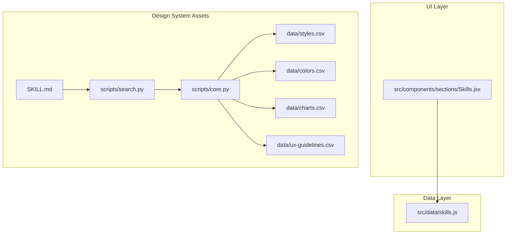
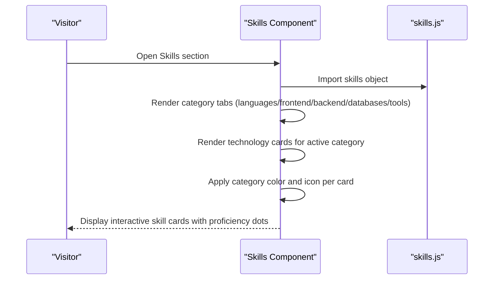
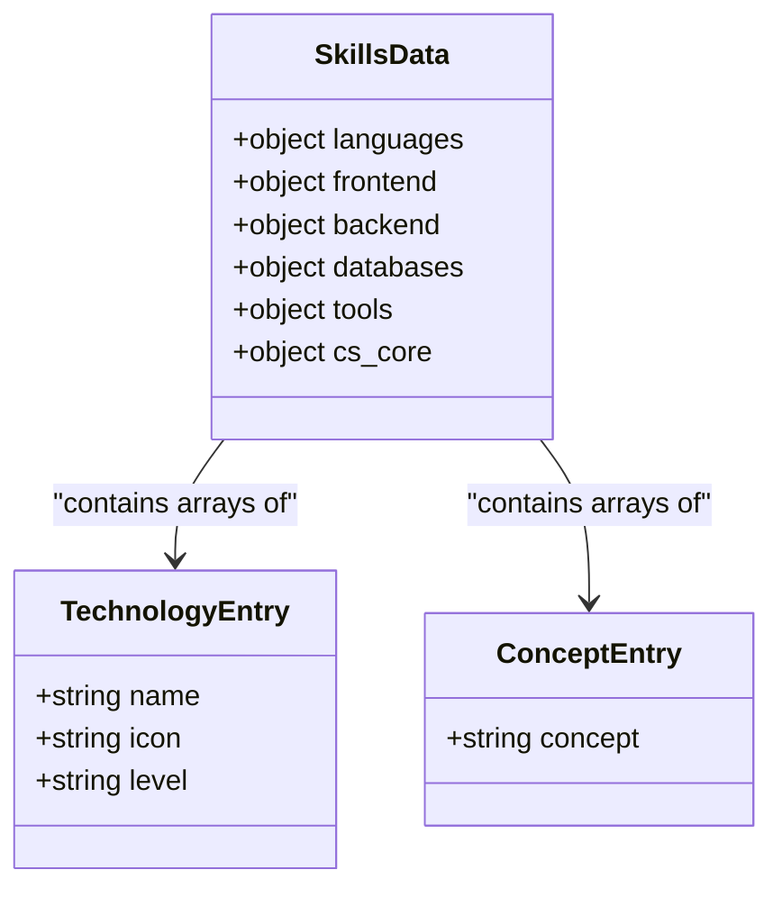
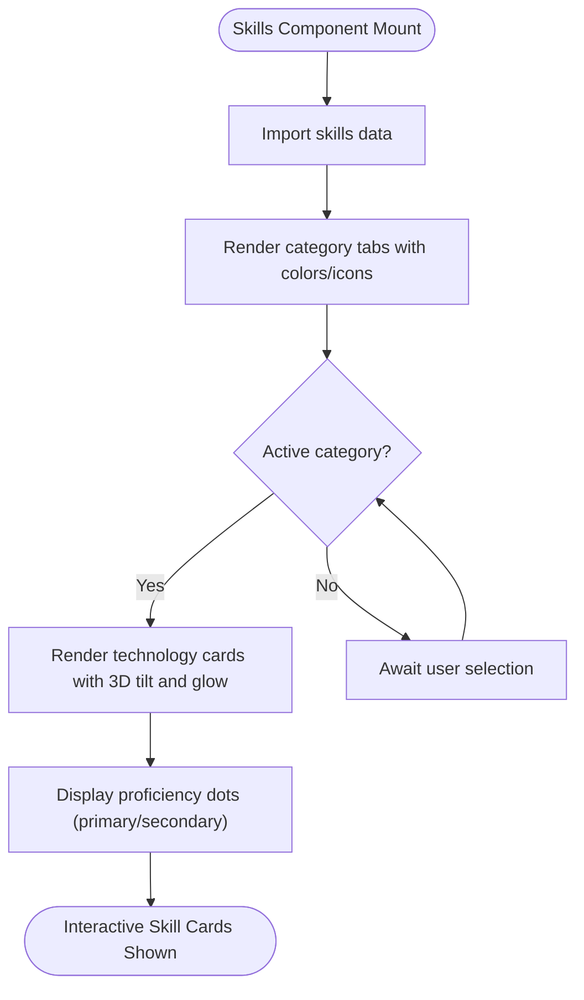
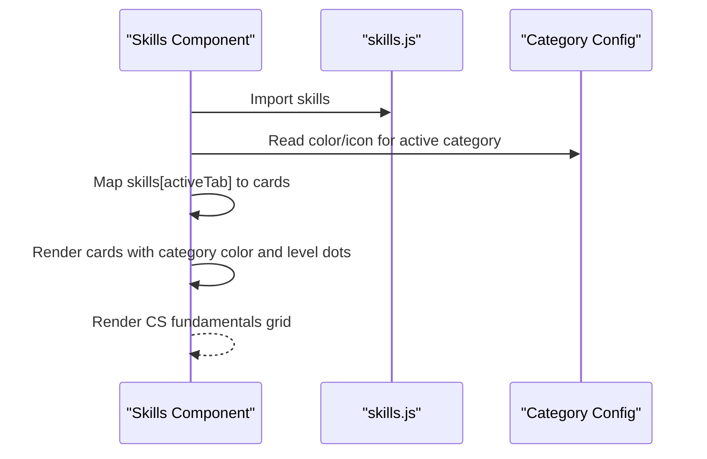
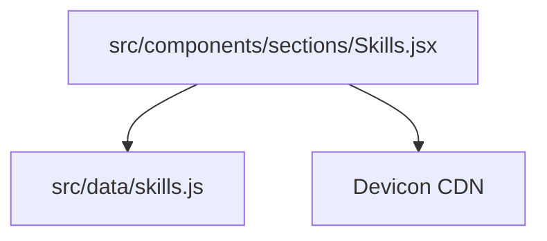

# Skills and Technologies

<cite>
**Referenced Files in This Document**
- [skills.js](file://src/data/skills.js)
- [Skills.jsx](file://src/components/sections/Skills.jsx)
- [SKILL.md](file://.kiro/steering/ui-ux-pro-max/SKILL.md)
- [core.py](file://.kiro/steering/ui-ux-pro-max/scripts/core.py)
- [search.py](file://.kiro/steering/ui-ux-pro-max/scripts/search.py)
- [charts.csv](file://.kiro/steering/ui-ux-pro-max/data/charts.csv)
- [colors.csv](file://.kiro/steering/ui-ux-pro-max/data/colors.csv)
- [styles.csv](file://.kiro/steering/ui-ux-pro-max/data/styles.csv)
- [ux-guidelines.csv](file://.kiro/steering/ui-ux-pro-max/data/ux-guidelines.csv)
</cite>

## Table of Contents
1. [Introduction](#introduction)
2. [Project Structure](#project-structure)
3. [Core Components](#core-components)
4. [Architecture Overview](#architecture-overview)
5. [Detailed Component Analysis](#detailed-component-analysis)
6. [Dependency Analysis](#dependency-analysis)
7. [Performance Considerations](#performance-considerations)
8. [Troubleshooting Guide](#troubleshooting-guide)
9. [Conclusion](#conclusion)
10. [Appendices](#appendices)

## Introduction
This document describes the skills and technology data model used in the portfolio website. It explains how technologies are categorized (programming languages, frontend/backend frameworks, databases, tools, and computer science fundamentals), how proficiency levels are represented, and how the Skills section integrates with the data model to render interactive visualizations. It also provides guidance for maintaining data consistency, naming conventions, and extending the model with new technologies and categories.

## Project Structure
The skills data model is defined in a single JavaScript module and consumed by the Skills section component. Supporting design system assets and guidelines are stored in the `.kiro/steering/ui-ux-pro-max` directory for broader UI/UX guidance.

**Diagram sources**
- [skills.js](file://src/data/skills.js)
- [Skills.jsx](file://src/components/sections/Skills.jsx)
- [SKILL.md](file://.kiro/steering/ui-ux-pro-max/SKILL.md)
- [core.py](file://.kiro/steering/ui-ux-pro-max/scripts/core.py)
- [search.py](file://.kiro/steering/ui-ux-pro-max/scripts/search.py)
- [charts.csv](file://.kiro/steering/ui-ux-pro-max/data/charts.csv)
- [colors.csv](file://.kiro/steering/ui-ux-pro-max/data/colors.csv)
- [styles.csv](file://.kiro/steering/ui-ux-pro-max/data/styles.csv)
- [ux-guidelines.csv](file://.kiro/steering/ui-ux-pro-max/data/ux-guidelines.csv)

**Section sources**
- [skills.js](file://src/data/skills.js)
- [Skills.jsx](file://src/components/sections/Skills.jsx)
- [SKILL.md](file://.kiro/steering/ui-ux-pro-max/SKILL.md)
- [core.py](file://.kiro/steering/ui-ux-pro-max/scripts/core.py)
- [search.py](file://.kiro/steering/ui-ux-pro-max/scripts/search.py)

## Core Components
- Skills data model: A JavaScript object containing arrays of technology entries grouped by category keys (e.g., languages, frontend, backend, databases, tools, cs_core).
- Skills section component: A React component that renders category tabs, technology cards, and CS fundamentals grid, consuming the skills data and applying visual styling and interactivity.

Key characteristics:
- Categories: languages, frontend, backend, databases, tools, cs_core.
- Technology entries: objects with name, icon, and level; or strings for CS fundamentals.
- Proficiency levels: primary and secondary indicators used for visual styling and card emphasis.
- Integration: The Skills component imports the skills data and dynamically renders category-specific content.

**Section sources**
- [skills.js](file://src/data/skills.js)
- [Skills.jsx](file://src/components/sections/Skills.jsx)

## Architecture Overview
The Skills section follows a straightforward data-driven architecture:
- Data source: skills.js exports a normalized object keyed by category.
- Presentation: Skills.jsx reads the data, renders category tabs, and displays technology cards with proficiency indicators.
- Visual design: Uses category-specific colors and SVG icons; cards include 3D tilt, glow, and level indicators.

**Diagram sources**
- [Skills.jsx](file://src/components/sections/Skills.jsx)
- [skills.js](file://src/data/skills.js)

## Detailed Component Analysis

### Skills Data Model
The skills data model organizes technologies into categories. Each category is an array:
- For languages, frontend, backend, databases, tools: array of objects with name, icon, and level.
- For cs_core: array of strings representing core computer science concepts.

Proficiency indicators:
- level: primary or secondary. The Skills component uses this to style cards and level indicators.

Technology stack grouping:
- The model groups technologies by functional roles (languages, frontend, backend, databases, tools) and by conceptual knowledge (cs_core).

**Diagram sources**
- [skills.js](file://src/data/skills.js)

**Section sources**
- [skills.js](file://src/data/skills.js)

### Skills Section Component
The Skills component:
- Defines category metadata (keys, labels, colors, icons).
- Renders category tabs and applies active state styling.
- Displays technology cards with:
  - 3D tilt and magnetic glow effects.
  - Dynamic accent color based on category.
  - Level indicators using colored dots.
  - Devicon-based icons with fallback handling.
- Renders CS fundamentals as numbered cards.

**Diagram sources**
- [Skills.jsx](file://src/components/sections/Skills.jsx)

**Section sources**
- [Skills.jsx](file://src/components/sections/Skills.jsx)

### Category Organization and Naming Conventions
- Category keys: lowercase, plural nouns (languages, frontend, backend, databases, tools, cs_core).
- Category labels: human-readable titles (e.g., Languages, Frontend, Backend, Databases, Tools, CS Fundamentals).
- Colors: hex values per category for visual consistency.
- Icons: SVG elements per category for tab and header visuals.

Data consistency requirements:
- Maintain consistent category keys across the data model and component.
- Ensure category colors and icons are defined for each key.
- Keep category counts accurate for tab badges.

**Section sources**
- [Skills.jsx](file://src/components/sections/Skills.jsx)
- [skills.js](file://src/data/skills.js)

### Technology Naming Standards
- name: Human-readable technology name.
- icon: Devicon identifier used for icon fetching.
- level: primary or secondary to indicate proficiency.

Naming standards:
- Use canonical names for technologies.
- Use lowercase devicon identifiers for icon resolution.
- Keep names concise and consistent across the same category.

**Section sources**
- [skills.js](file://src/data/skills.js)
- [Skills.jsx](file://src/components/sections/Skills.jsx)

### Adding New Technologies
Steps to add a new technology:
1. Choose or define the category key (e.g., languages, frontend, backend, databases, tools).
2. Append a new technology entry to the appropriate array with:
   - name: Technology name.
   - icon: Devicon identifier.
   - level: primary or secondary.
3. Verify the category key exists in the Skills component’s category configuration.
4. Confirm the icon resolves via the devicon CDN and falls back gracefully if unavailable.

Example reference paths:
- [skills.js](file://src/data/skills.js)
- [Skills.jsx](file://src/components/sections/Skills.jsx)

**Section sources**
- [skills.js](file://src/data/skills.js)
- [Skills.jsx](file://src/components/sections/Skills.jsx)

### Updating Skill Categories
To add a new category:
1. Extend the skills data model with a new array under a new key.
2. Add a new category entry in the Skills component’s category configuration with:
   - key: New category key.
   - label: Display label.
   - color: Hex color.
   - icon: SVG icon element.
3. Ensure the new category key is used consistently in the data and component.

Example reference paths:
- [skills.js](file://src/data/skills.js)
- [Skills.jsx](file://src/components/sections/Skills.jsx)

**Section sources**
- [skills.js](file://src/data/skills.js)
- [Skills.jsx](file://src/components/sections/Skills.jsx)

### Modifying Proficiency Levels
To adjust proficiency indicators:
- Change level values to primary or secondary in the skills data.
- The Skills component reads level to style cards and level dots accordingly.

Example reference paths:
- [skills.js](file://src/data/skills.js)
- [Skills.jsx](file://src/components/sections/Skills.jsx)

**Section sources**
- [skills.js](file://src/data/skills.js)
- [Skills.jsx](file://src/components/sections/Skills.jsx)

### Integration with Skills Section Components
The Skills component integrates with the data model by:
- Importing the skills object.
- Iterating over the active category to render cards.
- Using category metadata (color, icon) for visual styling.
- Rendering CS fundamentals separately from technology arrays.

**Diagram sources**
- [Skills.jsx](file://src/components/sections/Skills.jsx)
- [skills.js](file://src/data/skills.js)

**Section sources**
- [Skills.jsx](file://src/components/sections/Skills.jsx)
- [skills.js](file://src/data/skills.js)

## Dependency Analysis
The Skills section depends on:
- skills.js for the data model.
- Devicon CDN for technology icons with fallback handling.
- Framer Motion for animations and interactive effects.

**Diagram sources**
- [skills.js](file://src/data/skills.js)
- [Skills.jsx](file://src/components/sections/Skills.jsx)

**Section sources**
- [skills.js](file://src/data/skills.js)
- [Skills.jsx](file://src/components/sections/Skills.jsx)

## Performance Considerations
- Icon loading: The component attempts SVG with original icon and falls back to plain icon if the original fails. This reduces repeated network requests for missing assets.
- Animations: Framer Motion effects are used for interactive feedback; keep the number of animated elements reasonable to maintain responsiveness.
- Data size: The skills data is static and small; no special optimization is required.

[No sources needed since this section provides general guidance]

## Troubleshooting Guide
Common issues and resolutions:
- Missing or incorrect icon:
  - Verify the icon identifier matches a devicon entry.
  - Confirm the fallback path is triggered when the original icon fails.
  - References:
    - [Skills.jsx](file://src/components/sections/Skills.jsx)
- Incorrect category key:
  - Ensure the category key exists in both the data model and the component’s category configuration.
  - References:
    - [skills.js](file://src/data/skills.js)
    - [Skills.jsx](file://src/components/sections/Skills.jsx)
- Proficiency level not reflected:
  - Confirm level values are primary or secondary.
  - References:
    - [skills.js](file://src/data/skills.js)
    - [Skills.jsx](file://src/components/sections/Skills.jsx)

**Section sources**
- [Skills.jsx](file://src/components/sections/Skills.jsx)
- [skills.js](file://src/data/skills.js)

## Conclusion
The skills and technology data model is a simple, extensible structure that cleanly separates data from presentation. The Skills section leverages this model to deliver an engaging, interactive visualization of technical proficiencies and foundational knowledge. By following the naming and consistency guidelines, contributors can reliably add new technologies, categories, and refine proficiency indicators.

[No sources needed since this section summarizes without analyzing specific files]

## Appendices

### Appendix A: Category Keys and Labels
- languages: Programming languages
- frontend: Frontend frameworks and libraries
- backend: Backend frameworks and runtimes
- databases: Databases and data stores
- tools: Development and infrastructure tools
- cs_core: Computer science fundamentals

**Section sources**
- [Skills.jsx](file://src/components/sections/Skills.jsx)
- [skills.js](file://src/data/skills.js)

### Appendix B: Proficiency Level Indicators
- primary: Emphasized card and full-width proficiency dots.
- secondary: Standard card and partial-width proficiency dots.

**Section sources**
- [Skills.jsx](file://src/components/sections/Skills.jsx)
- [skills.js](file://src/data/skills.js)

### Appendix C: Design System Context
While the Skills section focuses on technology visualization, the broader design system assets provide guidance on:
- Style categories and implementation patterns.
- Color palettes aligned to product types.
- Chart recommendations and accessibility notes.
- UX guidelines for interaction and accessibility.

These resources can inform consistent theming and interaction patterns across the site.

**Section sources**
- [SKILL.md](file://.kiro/steering/ui-ux-pro-max/SKILL.md)
- [core.py](file://.kiro/steering/ui-ux-pro-max/scripts/core.py)
- [search.py](file://.kiro/steering/ui-ux-pro-max/scripts/search.py)
- [styles.csv](file://.kiro/steering/ui-ux-pro-max/data/styles.csv)
- [colors.csv](file://.kiro/steering/ui-ux-pro-max/data/colors.csv)
- [charts.csv](file://.kiro/steering/ui-ux-pro-max/data/charts.csv)
- [ux-guidelines.csv](file://.kiro/steering/ui-ux-pro-max/data/ux-guidelines.csv)