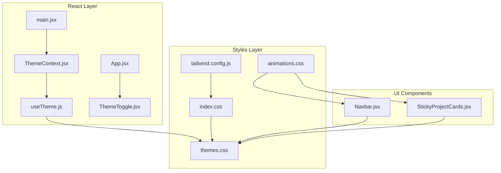
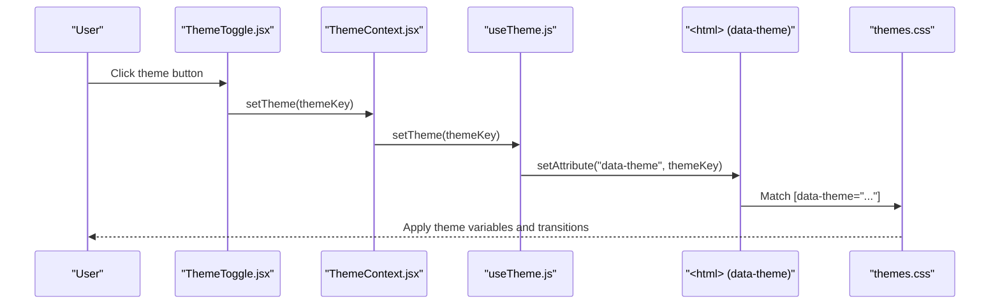
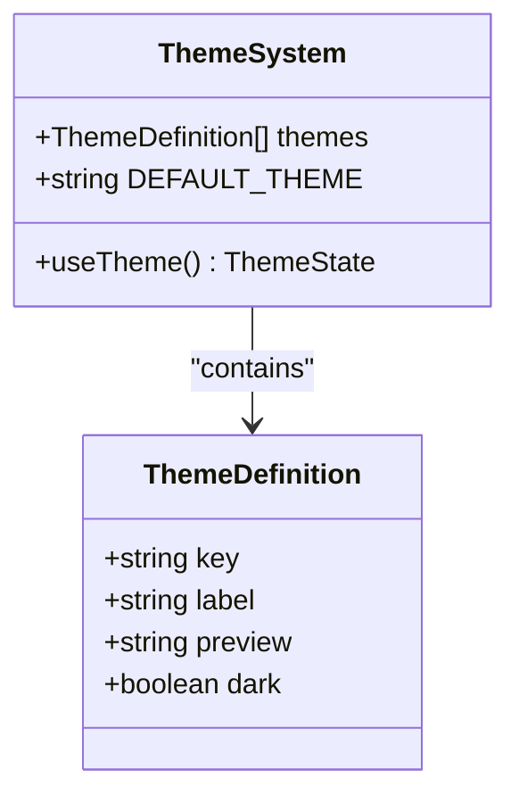
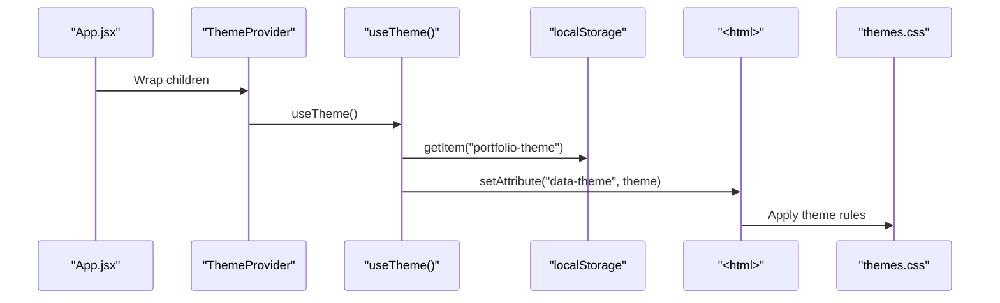
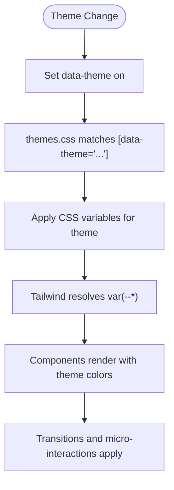
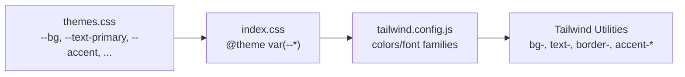
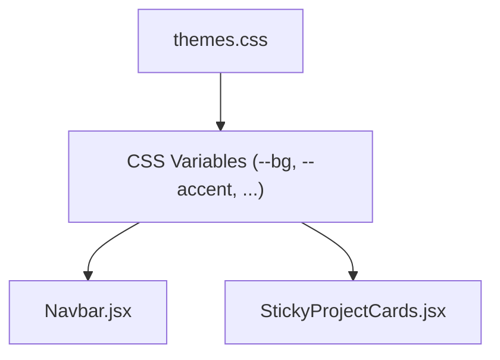
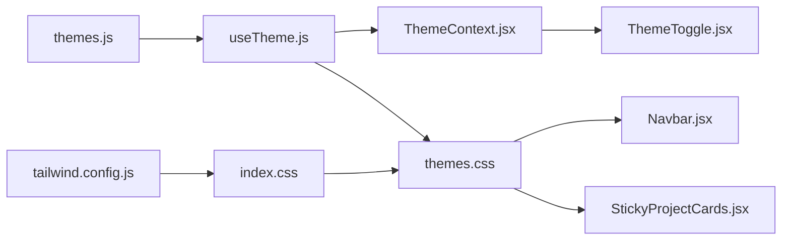

# Theme Configuration

<cite>
**Referenced Files in This Document**
- [themes.js](file://src/data/themes.js)
- [ThemeContext.jsx](file://src/context/ThemeContext.jsx)
- [useTheme.js](file://src/hooks/useTheme.js)
- [themes.css](file://src/styles/themes.css)
- [ThemeToggle.jsx](file://src/components/ui/ThemeToggle.jsx)
- [App.jsx](file://src/App.jsx)
- [main.jsx](file://src/main.jsx)
- [index.css](file://src/index.css)
- [tailwind.config.js](file://tailwind.config.js)
- [animations.css](file://src/styles/animations.css)
- [Navbar.jsx](file://src/components/layout/Navbar.jsx)
- [StickyProjectCards.jsx](file://src/components/ui/StickyProjectCards.jsx)
- [DESIGN-CHANGES.md](file://DESIGN-CHANGES.md)
</cite>

## Table of Contents
1. [Introduction](#introduction)
2. [Project Structure](#project-structure)
3. [Core Components](#core-components)
4. [Architecture Overview](#architecture-overview)
5. [Detailed Component Analysis](#detailed-component-analysis)
6. [Dependency Analysis](#dependency-analysis)
7. [Performance Considerations](#performance-considerations)
8. [Troubleshooting Guide](#troubleshooting-guide)
9. [Conclusion](#conclusion)
10. [Appendices](#appendices)

## Introduction
This document explains the theme configuration data model and how it integrates with the UI to deliver a consistent, accessible, and animated theming system. It covers:
- Theme definition structure and variants
- CSS variable mappings and selectors
- Theme switching via ThemeContext and hooks
- Accessibility and contrast requirements
- Extending the theme system with new color schemes

## Project Structure
The theme system spans data definitions, React context and hooks, CSS variables, Tailwind integration, and UI components that consume the theme.

**Diagram sources**
- [main.jsx:1-16](file://src/main.jsx#L1-L16)
- [ThemeContext.jsx:1-23](file://src/context/ThemeContext.jsx#L1-L23)
- [useTheme.js:1-33](file://src/hooks/useTheme.js#L1-L33)
- [ThemeToggle.jsx:1-113](file://src/components/ui/ThemeToggle.jsx#L1-L113)
- [index.css:1-153](file://src/index.css#L1-L153)
- [themes.css:1-339](file://src/styles/themes.css#L1-L339)
- [animations.css:1-359](file://src/styles/animations.css#L1-L359)
- [tailwind.config.js:1-34](file://tailwind.config.js#L1-L34)
- [Navbar.jsx:1-255](file://src/components/layout/Navbar.jsx#L1-L255)
- [StickyProjectCards.jsx:1-147](file://src/components/ui/StickyProjectCards.jsx#L1-L147)

**Section sources**
- [main.jsx:1-16](file://src/main.jsx#L1-L16)
- [ThemeContext.jsx:1-23](file://src/context/ThemeContext.jsx#L1-L23)
- [useTheme.js:1-33](file://src/hooks/useTheme.js#L1-L33)
- [ThemeToggle.jsx:1-113](file://src/components/ui/ThemeToggle.jsx#L1-L113)
- [index.css:1-153](file://src/index.css#L1-L153)
- [themes.css:1-339](file://src/styles/themes.css#L1-L339)
- [animations.css:1-359](file://src/styles/animations.css#L1-L359)
- [tailwind.config.js:1-34](file://tailwind.config.js#L1-L34)
- [Navbar.jsx:1-255](file://src/components/layout/Navbar.jsx#L1-L255)
- [StickyProjectCards.jsx:1-147](file://src/components/ui/StickyProjectCards.jsx#L1-L147)

## Core Components
- Theme definitions: array of theme objects with keys, labels, preview swatches, and flags.
- Theme provider and hook: manage state, persistence, and DOM attribute updates.
- CSS variable layer: theme-specific selectors bind CSS variables to design tokens.
- Tailwind integration: maps CSS variables to Tailwind utilities.
- UI components: consume CSS variables for consistent theming across components.
- Theme picker: toggles and cycles themes.

**Section sources**
- [themes.js:1-30](file://src/data/themes.js#L1-L30)
- [useTheme.js:1-33](file://src/hooks/useTheme.js#L1-L33)
- [themes.css:1-339](file://src/styles/themes.css#L1-L339)
- [tailwind.config.js:1-34](file://tailwind.config.js#L1-L34)
- [ThemeToggle.jsx:1-113](file://src/components/ui/ThemeToggle.jsx#L1-L113)

## Architecture Overview
The theme system is driven by a data-driven theme list and a React hook that applies a CSS attribute to the root element. Styles cascade from CSS variables to Tailwind utilities and component classes.

**Diagram sources**
- [ThemeToggle.jsx:1-113](file://src/components/ui/ThemeToggle.jsx#L1-L113)
- [ThemeContext.jsx:1-23](file://src/context/ThemeContext.jsx#L1-L23)
- [useTheme.js:1-33](file://src/hooks/useTheme.js#L1-L33)
- [themes.css:1-339](file://src/styles/themes.css#L1-L339)

## Detailed Component Analysis

### Theme Data Model
- Structure: Each theme object defines a unique key, human-readable label, preview color, and metadata (e.g., dark mode flag).
- Defaults: A default theme is exported for initialization.
- Variants: Themes are selectable via a theme picker and cycled programmatically.

**Diagram sources**
- [themes.js:1-30](file://src/data/themes.js#L1-L30)
- [useTheme.js:1-33](file://src/hooks/useTheme.js#L1-L33)

**Section sources**
- [themes.js:1-30](file://src/data/themes.js#L1-L30)

### Theme Switching Mechanism
- Persistence: The hook reads a stored theme from local storage and validates it against the theme list.
- DOM attribute: On change, the hook sets a data attribute on the HTML element.
- Provider: A context provider exposes theme state to the app tree.
- Picker: A floating UI presents theme options and updates the selected theme.

**Diagram sources**
- [App.jsx:1-47](file://src/App.jsx#L1-L47)
- [ThemeContext.jsx:1-23](file://src/context/ThemeContext.jsx#L1-L23)
- [useTheme.js:1-33](file://src/hooks/useTheme.js#L1-L33)
- [themes.css:1-339](file://src/styles/themes.css#L1-L339)

**Section sources**
- [useTheme.js:1-33](file://src/hooks/useTheme.js#L1-L33)
- [ThemeContext.jsx:1-23](file://src/context/ThemeContext.jsx#L1-L23)
- [ThemeToggle.jsx:1-113](file://src/components/ui/ThemeToggle.jsx#L1-L113)

### CSS Variable Mappings and Theme Variants
- Selector-based activation: Each theme is declared under a selector that matches the HTML data attribute.
- Design tokens: Core tokens include backgrounds, borders, text, accents, shadows, spacing, and typography.
- Component-specific gradients: Themes define radial gradients for interactive hover states.
- Global transitions: Smooth color transitions are applied to most elements, with exclusions for performance-sensitive components.

**Diagram sources**
- [themes.css:1-339](file://src/styles/themes.css#L1-L339)
- [index.css:1-153](file://src/index.css#L1-L153)
- [animations.css:1-359](file://src/styles/animations.css#L1-L359)

**Section sources**
- [themes.css:1-339](file://src/styles/themes.css#L1-L339)
- [index.css:1-153](file://src/index.css#L1-L153)
- [animations.css:1-359](file://src/styles/animations.css#L1-L359)

### Tailwind Integration and CSS Variables
- Tailwind configuration maps CSS variables to Tailwind color and font utilities.
- This ensures consistent theming across utility classes and component classes.

**Diagram sources**
- [themes.css:1-339](file://src/styles/themes.css#L1-L339)
- [index.css:1-153](file://src/index.css#L1-L153)
- [tailwind.config.js:1-34](file://tailwind.config.js#L1-L34)

**Section sources**
- [tailwind.config.js:1-34](file://tailwind.config.js#L1-L34)
- [index.css:1-153](file://src/index.css#L1-L153)

### UI Components and Theme Consistency
- Navbar: Uses theme-defined gradients for hover states and dynamic background layers.
- Project cards: Leverages theme variables for glass morphism, borders, and accent usage.
- Shared patterns: Components consistently reference CSS variables for background, text, and accent tokens.

**Diagram sources**
- [themes.css:1-339](file://src/styles/themes.css#L1-L339)
- [Navbar.jsx:1-255](file://src/components/layout/Navbar.jsx#L1-L255)
- [StickyProjectCards.jsx:1-147](file://src/components/ui/StickyProjectCards.jsx#L1-L147)

**Section sources**
- [Navbar.jsx:1-255](file://src/components/layout/Navbar.jsx#L1-L255)
- [StickyProjectCards.jsx:1-147](file://src/components/ui/StickyProjectCards.jsx#L1-L147)

## Dependency Analysis
- Theme data drives the theme list and defaults.
- The hook depends on theme data and persists selections.
- The DOM attribute triggers CSS rule application.
- Tailwind consumes CSS variables to resolve utilities.
- Animations rely on CSS variables for dynamic effects.

**Diagram sources**
- [themes.js:1-30](file://src/data/themes.js#L1-L30)
- [useTheme.js:1-33](file://src/hooks/useTheme.js#L1-L33)
- [ThemeContext.jsx:1-23](file://src/context/ThemeContext.jsx#L1-L23)
- [ThemeToggle.jsx:1-113](file://src/components/ui/ThemeToggle.jsx#L1-L113)
- [themes.css:1-339](file://src/styles/themes.css#L1-L339)
- [index.css:1-153](file://src/index.css#L1-L153)
- [tailwind.config.js:1-34](file://tailwind.config.js#L1-L34)
- [Navbar.jsx:1-255](file://src/components/layout/Navbar.jsx#L1-L255)
- [StickyProjectCards.jsx:1-147](file://src/components/ui/StickyProjectCards.jsx#L1-L147)

**Section sources**
- [themes.js:1-30](file://src/data/themes.js#L1-L30)
- [useTheme.js:1-33](file://src/hooks/useTheme.js#L1-L33)
- [ThemeContext.jsx:1-23](file://src/context/ThemeContext.jsx#L1-L23)
- [ThemeToggle.jsx:1-113](file://src/components/ui/ThemeToggle.jsx#L1-L113)
- [themes.css:1-339](file://src/styles/themes.css#L1-L339)
- [index.css:1-153](file://src/index.css#L1-L153)
- [tailwind.config.js:1-34](file://tailwind.config.js#L1-L34)
- [Navbar.jsx:1-255](file://src/components/layout/Navbar.jsx#L1-L255)
- [StickyProjectCards.jsx:1-147](file://src/components/ui/StickyProjectCards.jsx#L1-L147)

## Performance Considerations
- Transition durations balance smoothness and performance; excluded elements avoid jank during theme swaps.
- Reduced motion support respects user preferences and disables animations accordingly.
- CSS variable usage minimizes repaint costs compared to recalculating values in JavaScript.

[No sources needed since this section provides general guidance]

## Troubleshooting Guide
- Theme not persisting: Verify local storage key and that the saved theme exists in the theme list.
- Theme not applying: Ensure the HTML element has the correct data attribute and that the selector matches the theme key.
- Tailwind utilities not reflecting theme: Confirm Tailwind configuration maps CSS variables to utilities and that the build reprocesses CSS.
- Picker not updating: Check the context consumer and that the provider wraps the component tree.

**Section sources**
- [useTheme.js:1-33](file://src/hooks/useTheme.js#L1-L33)
- [ThemeContext.jsx:1-23](file://src/context/ThemeContext.jsx#L1-L23)
- [themes.css:1-339](file://src/styles/themes.css#L1-L339)
- [tailwind.config.js:1-34](file://tailwind.config.js#L1-L34)

## Conclusion
The theme system combines a declarative theme list, a React hook for state and persistence, CSS variables for scalable theming, and Tailwind integration for utility consistency. UI components consume these variables to maintain visual coherence across variants. Accessibility and performance are addressed through contrast-focused tokens, reduced motion support, and judicious transitions.

[No sources needed since this section summarizes without analyzing specific files]

## Appendices

### Adding a New Color Scheme
Steps to introduce a new theme variant:
1. Define the theme object in the theme list with a unique key, label, preview swatch, and dark mode flag.
2. Add a new block in the CSS that targets the HTML data attribute with the theme key.
3. Populate CSS variables for backgrounds, borders, text, accents, shadows, spacing, and typography.
4. Optionally add component-specific gradients for interactive states.
5. Verify Tailwind utilities resolve the new variables and test transitions and animations.

Guidelines:
- Maintain consistent naming for CSS variables across themes.
- Ensure sufficient contrast ratios for text and interactive elements.
- Keep transition durations balanced for performance.
- Test with reduced motion enabled.

**Section sources**
- [themes.js:1-30](file://src/data/themes.js#L1-L30)
- [themes.css:1-339](file://src/styles/themes.css#L1-L339)
- [tailwind.config.js:1-34](file://tailwind.config.js#L1-L34)
- [DESIGN-CHANGES.md:284-352](file://DESIGN-CHANGES.md#L284-L352)

### Modifying Existing Themes
- Adjust CSS variable values within the theme’s selector block.
- Update component-specific gradients if hover behaviors change.
- Rebuild styles to ensure Tailwind utilities reflect updated variables.

**Section sources**
- [themes.css:1-339](file://src/styles/themes.css#L1-L339)
- [tailwind.config.js:1-34](file://tailwind.config.js#L1-L34)

### Extending the Theme System
- Extend the theme list with additional variants.
- Add new CSS blocks for each variant under the appropriate selector.
- Introduce new CSS variables for specialized tokens and map them in Tailwind.
- Update the theme picker UI if needed.

**Section sources**
- [themes.js:1-30](file://src/data/themes.js#L1-L30)
- [themes.css:1-339](file://src/styles/themes.css#L1-L339)
- [index.css:1-153](file://src/index.css#L1-L153)
- [tailwind.config.js:1-34](file://tailwind.config.js#L1-L34)

### Accessibility and Contrast Guidelines
- Maintain minimum contrast ratios for text and interactive elements.
- Provide high-contrast options and ensure readable typography scales.
- Respect reduced motion preferences and offer alternatives for motion-sensitive interactions.
- Validate focus visibility and keyboard navigation across themes.

**Section sources**
- [DESIGN-CHANGES.md:284-352](file://DESIGN-CHANGES.md#L284-L352)
- [themes.css:1-339](file://src/styles/themes.css#L1-L339)
- [animations.css:1-359](file://src/styles/animations.css#L1-L359)