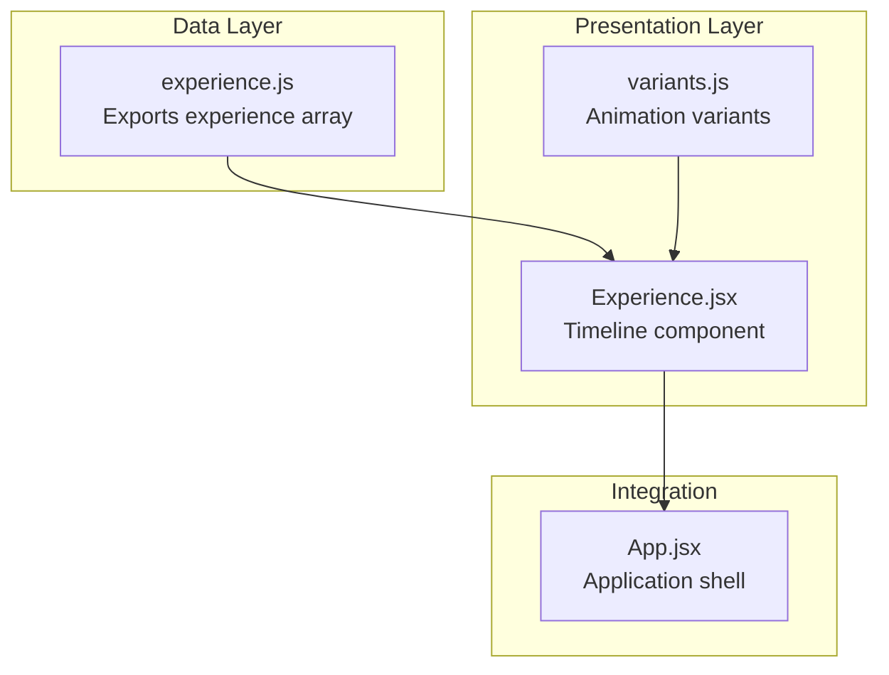
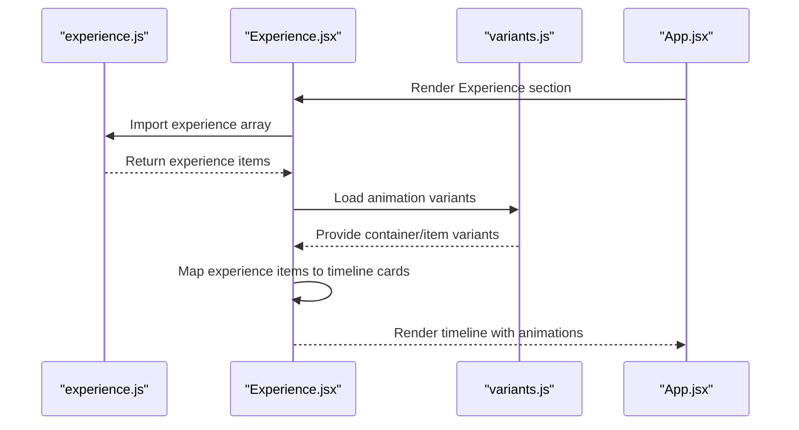
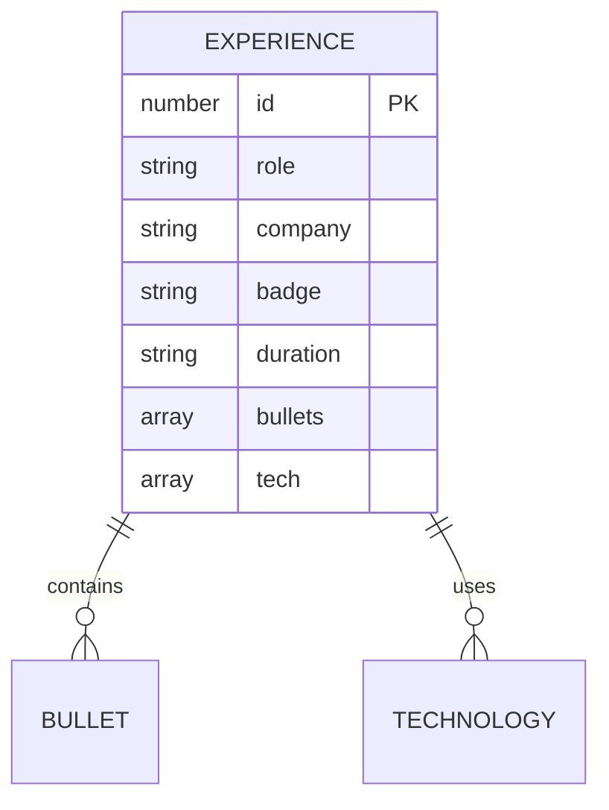
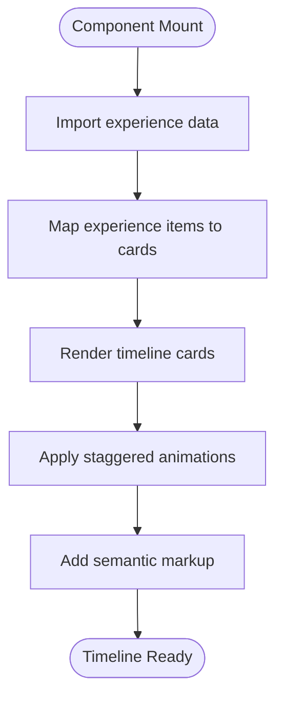
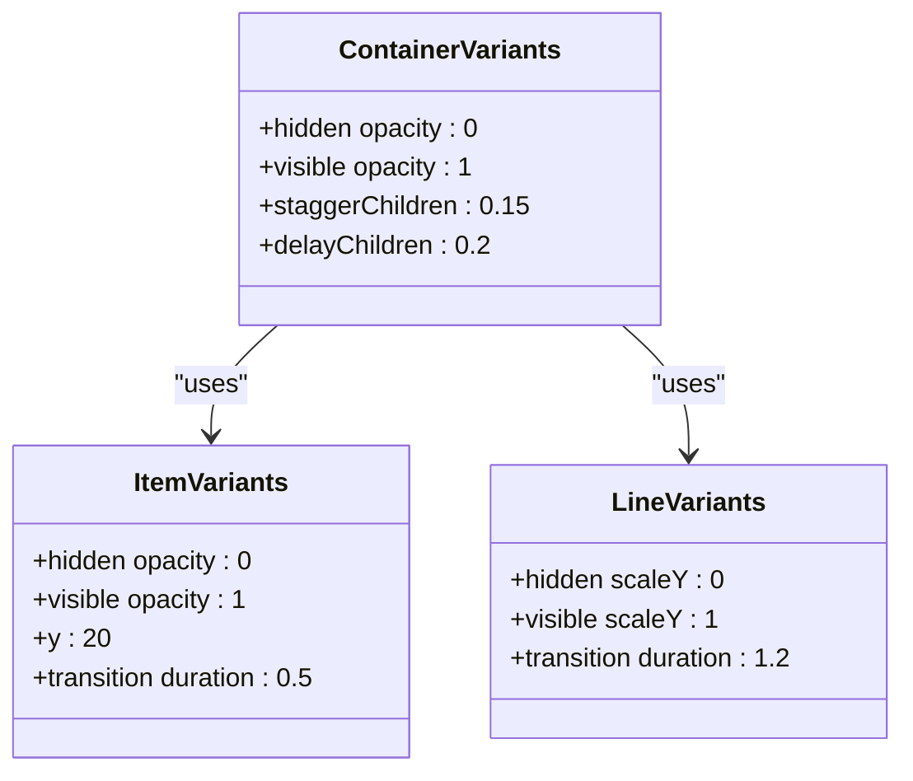
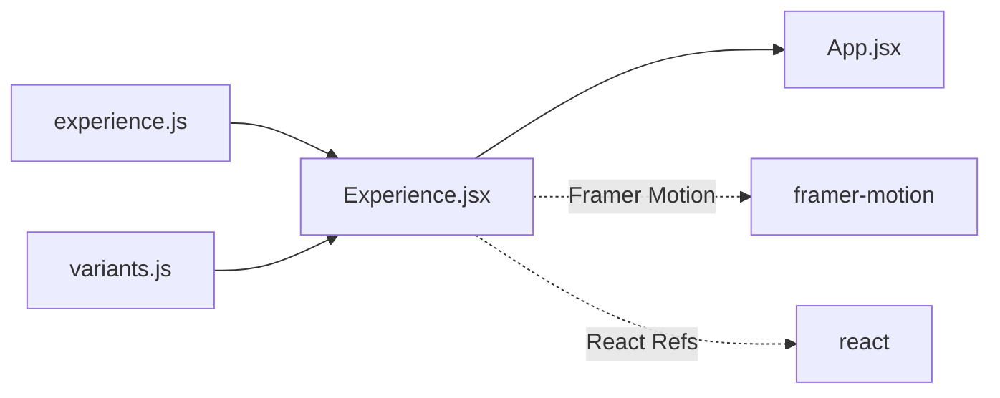

# Work Experience Timeline

<cite>
**Referenced Files in This Document**
- [experience.js](file://src/data/experience.js)
- [Experience.jsx](file://src/components/sections/Experience.jsx)
- [App.jsx](file://src/App.jsx)
- [variants.js](file://src/utils/variants.js)
</cite>

## Table of Contents
1. [Introduction](#introduction)
2. [Project Structure](#project-structure)
3. [Core Components](#core-components)
4. [Architecture Overview](#architecture-overview)
5. [Detailed Component Analysis](#detailed-component-analysis)
6. [Dependency Analysis](#dependency-analysis)
7. [Performance Considerations](#performance-considerations)
8. [Troubleshooting Guide](#troubleshooting-guide)
9. [Conclusion](#conclusion)

## Introduction
This document provides comprehensive documentation for the work experience timeline data model used in the portfolio website. It explains the structure of experience items, timeline formatting, date handling, chronological ordering, and integration with the Experience section components. It also covers data validation requirements, proper formatting of job responsibilities, and achievement bullet point structure.

## Project Structure
The work experience timeline is implemented using a clean separation of concerns:
- Data layer: A JavaScript module exports an array of experience items
- Presentation layer: A React component renders the timeline with animated entries
- Integration: The Experience component is mounted within the main application shell

**Diagram sources**
- [experience.js:1-43](file://src/data/experience.js#L1-L43)
- [Experience.jsx:1-168](file://src/components/sections/Experience.jsx#L1-L168)
- [variants.js:1-17](file://src/utils/variants.js#L1-L17)
- [App.jsx:15-47](file://src/App.jsx#L15-L47)

**Section sources**
- [experience.js:1-43](file://src/data/experience.js#L1-L43)
- [Experience.jsx:14-168](file://src/components/sections/Experience.jsx#L14-L168)
- [App.jsx:15-47](file://src/App.jsx#L15-L47)

## Core Components
The experience timeline consists of two primary components:
- Data model: An array of experience objects with standardized fields
- Timeline renderer: A React component that visualizes the experience data as an animated timeline

Key characteristics:
- Immutable data structure with explicit field definitions
- Consistent formatting for dates and durations
- Semantic HTML for accessibility and SEO
- Responsive design with smooth animations

**Section sources**
- [experience.js:1-43](file://src/data/experience.js#L1-L43)
- [Experience.jsx:54-127](file://src/components/sections/Experience.jsx#L54-L127)

## Architecture Overview
The experience timeline follows a unidirectional data flow pattern:

**Diagram sources**
- [Experience.jsx:3-4](file://src/components/sections/Experience.jsx#L3-L4)
- [variants.js:1-17](file://src/utils/variants.js#L1-L17)
- [App.jsx:11-38](file://src/App.jsx#L11-L38)

## Detailed Component Analysis

### Data Model Structure
Each experience item follows a strict schema with the following fields:

**Diagram sources**
- [experience.js:2-41](file://src/data/experience.js#L2-L41)

Field specifications:
- id: Unique identifier for each experience item
- role: Job title or position held
- company: Organization name
- badge: Status indicator (optional)
- duration: Date range in "Month Year - Month Year" format
- bullets: Array of achievement descriptions
- tech: Array of technologies used

**Section sources**
- [experience.js:2-41](file://src/data/experience.js#L2-L41)

### Timeline Rendering Component
The Experience component implements a sophisticated timeline visualization:

**Diagram sources**
- [Experience.jsx:54-127](file://src/components/sections/Experience.jsx#L54-L127)

Key rendering features:
- Animated timeline line with gradient styling
- Staggered card appearance with spring physics
- Interactive hover states with subtle translations
- Responsive layout adapting to different screen sizes

**Section sources**
- [Experience.jsx:46-127](file://src/components/sections/Experience.jsx#L46-L127)

### Animation System
The timeline leverages Framer Motion for smooth animations:

**Diagram sources**
- [variants.js:1-17](file://src/utils/variants.js#L1-L17)
- [Experience.jsx:6-12](file://src/components/sections/Experience.jsx#L6-L12)

**Section sources**
- [variants.js:1-17](file://src/utils/variants.js#L1-L17)
- [Experience.jsx:6-12](file://src/components/sections/Experience.jsx#L6-L12)

## Dependency Analysis
The experience timeline has minimal but essential dependencies:

**Diagram sources**
- [Experience.jsx:1-4](file://src/components/sections/Experience.jsx#L1-L4)
- [App.jsx:11-38](file://src/App.jsx#L11-L38)

**Section sources**
- [Experience.jsx:1-4](file://src/components/sections/Experience.jsx#L1-L4)
- [App.jsx:11-38](file://src/App.jsx#L11-L38)

## Performance Considerations
The timeline implementation prioritizes performance through several optimizations:
- Efficient React rendering with memoization
- CSS-based animations for GPU acceleration
- Minimal re-renders through proper key usage
- Optimized SVG graphics for timeline markers
- Responsive design avoiding expensive layout calculations

## Troubleshooting Guide

### Common Issues and Solutions

**Issue: Incorrect chronological ordering**
- Verify experience items are arranged in reverse chronological order (most recent first)
- Ensure duration strings follow the "Month Year - Month Year" format
- Check that "Present" appears only in the current position

**Issue: Timeline not animating**
- Confirm Framer Motion is properly installed and configured
- Verify animation variants are correctly imported and applied
- Check that the timeline section is within the viewport for animation triggers

**Issue: Badge text not displaying**
- Ensure badge field contains valid text content
- Verify the conditional rendering logic for badge display
- Check CSS classes for proper styling of badge elements

**Section sources**
- [Experience.jsx:79-83](file://src/components/sections/Experience.jsx#L79-L83)
- [Experience.jsx:61-69](file://src/components/sections/Experience.jsx#L61-L69)

## Conclusion
The work experience timeline data model provides a robust, accessible, and visually appealing representation of professional history. Its clean separation of concerns, consistent data structure, and thoughtful animations create an engaging user experience while maintaining excellent performance characteristics. The modular design allows for easy maintenance and extension as professional experience evolves.