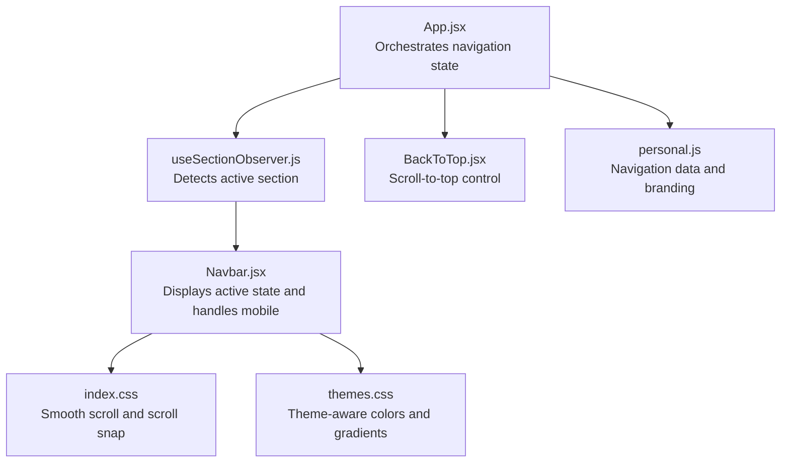
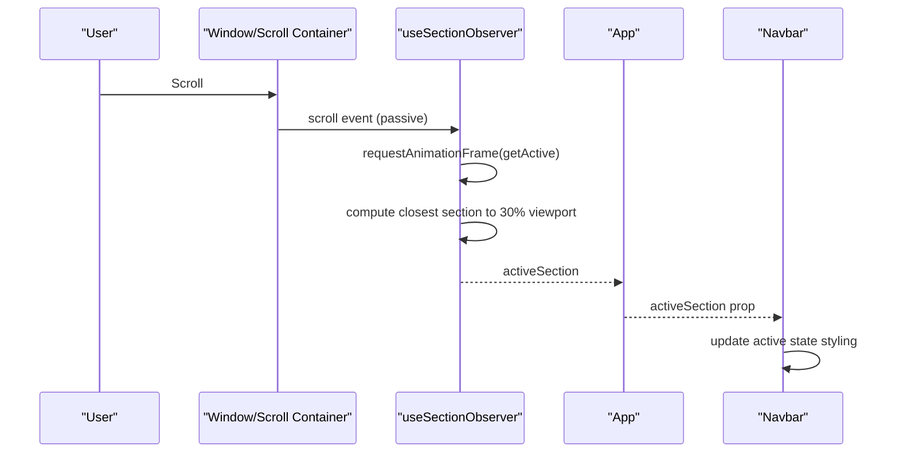
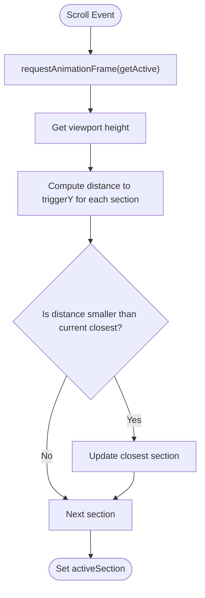
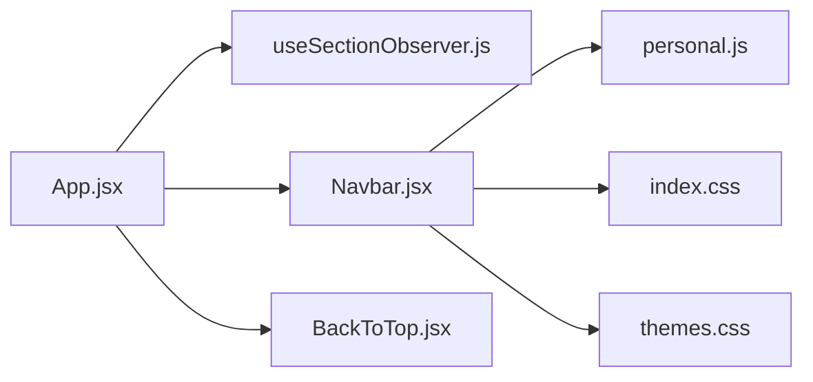

# Navigation System

<cite>
**Referenced Files in This Document**
- [Navbar.jsx](file://src/components/layout/Navbar.jsx)
- [useSectionObserver.js](file://src/hooks/useSectionObserver.js)
- [App.jsx](file://src/App.jsx)
- [BackToTop.jsx](file://src/components/ui/BackToTop.jsx)
- [index.css](file://src/index.css)
- [themes.css](file://src/styles/themes.css)
- [personal.js](file://src/data/personal.js)
- [main.jsx](file://src/main.jsx)
</cite>

## Table of Contents
1. [Introduction](#introduction)
2. [Project Structure](#project-structure)
3. [Core Components](#core-components)
4. [Architecture Overview](#architecture-overview)
5. [Detailed Component Analysis](#detailed-component-analysis)
6. [Dependency Analysis](#dependency-analysis)
7. [Performance Considerations](#performance-considerations)
8. [Accessibility and Mobile Navigation](#accessibility-and-mobile-navigation)
9. [Integration with External Routing](#integration-with-external-routing)
10. [Troubleshooting Guide](#troubleshooting-guide)
11. [Conclusion](#conclusion)

## Introduction
This document explains the portfolio's navigation system with a focus on scroll-based section detection and active state management. It covers how the Intersection Observer-inspired detection works, how scroll positions are tracked, and how navigation highlighting is managed. It also documents the navbar behavior, skip-to-content functionality, keyboard navigation support, accessibility considerations, mobile navigation patterns, responsive design adaptations, performance optimizations, and customization options for integrating with external routing solutions.

## Project Structure
The navigation system spans several components and hooks:
- The main app orchestrates section IDs and passes the active section to the navbar.
- A custom hook detects the currently visible section based on scroll position.
- The navbar renders navigation items and applies active state styling.
- Additional UI components provide skip-to-content and back-to-top functionality.

**Diagram sources**
- [App.jsx:15-44](file://src/App.jsx#L15-L44)
- [useSectionObserver.js:3-49](file://src/hooks/useSectionObserver.js#L3-L49)
- [Navbar.jsx:14-254](file://src/components/layout/Navbar.jsx#L14-L254)
- [BackToTop.jsx:4-47](file://src/components/ui/BackToTop.jsx#L4-L47)
- [index.css:121-141](file://src/index.css#L121-L141)
- [themes.css:25-57](file://src/styles/themes.css#L25-L57)
- [personal.js:1-29](file://src/data/personal.js#L1-L29)

**Section sources**
- [App.jsx:15-44](file://src/App.jsx#L15-L44)
- [useSectionObserver.js:3-49](file://src/hooks/useSectionObserver.js#L3-L49)
- [Navbar.jsx:14-254](file://src/components/layout/Navbar.jsx#L14-L254)
- [BackToTop.jsx:4-47](file://src/components/ui/BackToTop.jsx#L4-L47)
- [index.css:121-141](file://src/index.css#L121-L141)
- [themes.css:25-57](file://src/styles/themes.css#L25-L57)
- [personal.js:1-29](file://src/data/personal.js#L1-L29)

## Core Components
- Active section detection hook: Computes the nearest section to a 30% viewport trigger point during scroll using requestAnimationFrame for performance.
- Navbar: Renders desktop and mobile navigation, applies active state styling, and manages scroll-aware elevation.
- Skip-to-content link: Provides keyboard accessibility to jump to the main content area.
- Back-to-top button: Appears when scrolling down and smoothly scrolls back to the top.

Key behaviors:
- Scroll position tracking uses a scroll container with passive listeners and requestAnimationFrame throttling.
- Active state highlighting uses CSS classes and layoutId transitions for smooth visual updates.
- Mobile navigation toggles a drawer overlay with animated entrance and exit.

**Section sources**
- [useSectionObserver.js:3-49](file://src/hooks/useSectionObserver.js#L3-L49)
- [Navbar.jsx:14-254](file://src/components/layout/Navbar.jsx#L14-L254)
- [App.jsx:21-26](file://src/App.jsx#L21-L26)
- [BackToTop.jsx:4-47](file://src/components/ui/BackToTop.jsx#L4-L47)

## Architecture Overview
The navigation system follows a unidirectional data flow:
- App maintains a memoized list of section IDs.
- useSectionObserver computes the active section based on scroll position.
- Navbar receives the active section and renders the navigation with appropriate styling.

**Diagram sources**
- [useSectionObserver.js:33-41](file://src/hooks/useSectionObserver.js#L33-L41)
- [App.jsx:16-17](file://src/App.jsx#L16-L17)
- [Navbar.jsx:84-109](file://src/components/layout/Navbar.jsx#L84-L109)

## Detailed Component Analysis

### Active Section Detection Hook
The hook determines the currently active section by measuring distances from each section's top edge to a fixed trigger point at 30% of the viewport height. It uses requestAnimationFrame to batch computations and cancel previous frames to avoid redundant work.

**Diagram sources**
- [useSectionObserver.js:10-31](file://src/hooks/useSectionObserver.js#L10-L31)

Implementation highlights:
- Uses a scroll container ID to detect the active section, falling back to window if the container is not found.
- Initializes with the first section ID to ensure a valid active state on mount.
- Cancels the previous animation frame before scheduling a new one to optimize performance.

**Section sources**
- [useSectionObserver.js:3-49](file://src/hooks/useSectionObserver.js#L3-L49)

### Navbar Component
The navbar renders navigation items with:
- Desktop: horizontal list with hover effects and active state underline.
- Mobile: hamburger menu that opens a drawer overlay with animated entrance.
- Scroll-aware elevation: increases shadow and blur when scrolled past a threshold.
- Theme-aware gradients for hover backgrounds and active indicators.

Active state management:
- Compares the active section prop with each item's href (without the leading hash) to determine active styling.
- Uses Framer Motion layoutId for smooth underline transitions.

Mobile navigation:
- Animated drawer with backdrop overlay.
- Accessible ARIA attributes for menu open/close states.
- Responsive breakpoint at medium screens.

**Section sources**
- [Navbar.jsx:5-12](file://src/components/layout/Navbar.jsx#L5-L12)
- [Navbar.jsx:84-109](file://src/components/layout/Navbar.jsx#L84-L109)
- [Navbar.jsx:137-160](file://src/components/layout/Navbar.jsx#L137-L160)
- [Navbar.jsx:165-250](file://src/components/layout/Navbar.jsx#L165-L250)

### Skip-to-Content Link
A skip link allows keyboard users to bypass repeated navigation and go straight to the main content. It is visually hidden until focused, then positioned prominently for quick access.

Accessibility:
- Uses a focus-visible technique to show the link only when focused.
- Positioned near the top-left corner for easy access.

**Section sources**
- [App.jsx:21-26](file://src/App.jsx#L21-L26)

### Back-to-Top Button
The back-to-top button appears when the user scrolls down and smoothly scrolls back to the top of the main content area.

Behavior:
- Visibility toggled based on scroll threshold.
- Smooth scroll behavior enabled via scroll container.

**Section sources**
- [BackToTop.jsx:4-47](file://src/components/ui/BackToTop.jsx#L4-L47)

## Dependency Analysis
The navigation system has minimal coupling and clear responsibilities:
- App depends on the hook for active state computation.
- Navbar depends on the active section prop and personal data for branding.
- CSS provides global scroll behavior and responsive breakpoints.

**Diagram sources**
- [App.jsx:13-17](file://src/App.jsx#L13-L17)
- [Navbar.jsx:3-3](file://src/components/layout/Navbar.jsx#L3-L3)
- [BackToTop.jsx:1-2](file://src/components/ui/BackToTop.jsx#L1-L2)
- [index.css:121-141](file://src/index.css#L121-L141)
- [themes.css:25-57](file://src/styles/themes.css#L25-L57)

**Section sources**
- [App.jsx:13-17](file://src/App.jsx#L13-L17)
- [Navbar.jsx:3-3](file://src/components/layout/Navbar.jsx#L3-L3)
- [BackToTop.jsx:1-2](file://src/components/ui/BackToTop.jsx#L1-L2)
- [index.css:121-141](file://src/index.css#L121-L141)
- [themes.css:25-57](file://src/styles/themes.css#L25-L57)

## Performance Considerations
- Throttling: The hook uses requestAnimationFrame to batch scroll computations and cancel previous frames, reducing layout thrash.
- Passive listeners: Scroll events are attached with passive: true to improve scroll performance.
- Scroll container: The hook targets a specific scroll container by ID to avoid unnecessary recalculations when other parts of the page scroll.
- Scroll snap: Global CSS enables scroll-snap alignment for smooth section transitions.
- Reduced motion: Theme CSS respects prefers-reduced-motion to disable animations and smooth scrolling when requested.

Optimization tips:
- Keep the number of sections manageable to minimize DOM queries.
- Avoid heavy computations in the scroll handler; rely on requestAnimationFrame batching.
- Use CSS transforms and opacity for animations to leverage GPU acceleration.

**Section sources**
- [useSectionObserver.js:33-41](file://src/hooks/useSectionObserver.js#L33-L41)
- [index.css:127-136](file://src/index.css#L127-L136)
- [themes.css:355-377](file://src/styles/themes.css#L355-L377)

## Accessibility and Mobile Navigation
Accessibility features:
- Skip-to-content link for keyboard navigation.
- ARIA attributes on mobile menu toggle and drawer for assistive technologies.
- Focus management: Buttons and links receive focus styles via theme CSS.
- Reduced motion support: Animations and smooth scrolling are disabled when users prefer reduced motion.

Mobile navigation:
- Hamburger menu triggers a drawer overlay with animated entrance.
- Drawer includes navigation links and a close button with accessible labels.
- Responsive breakpoint at medium screens ensures optimal usability on small devices.

Responsive design:
- Desktop navigation uses hover states and active underlines.
- Mobile navigation switches to a slide-in drawer with larger touch targets.
- Theme CSS defines consistent spacing and typography across devices.

**Section sources**
- [App.jsx:21-26](file://src/App.jsx#L21-L26)
- [Navbar.jsx:137-160](file://src/components/layout/Navbar.jsx#L137-L160)
- [Navbar.jsx:165-250](file://src/components/layout/Navbar.jsx#L165-L250)
- [themes.css:355-377](file://src/styles/themes.css#L355-L377)

## Integration with External Routing
The current implementation relies on hash-based navigation and scroll position detection. To integrate with external routing libraries (e.g., React Router):
- Replace hash-based hrefs in the navbar with route-based links.
- Synchronize the active section with the router's current location.
- Consider disabling or adapting the scroll-snap behavior to align with programmatic navigation.

Example integration steps:
- Update navbar items to use route props instead of hash anchors.
- Derive active section from router state rather than scroll detection.
- Adjust scroll behavior to respect programmatic navigation.

Note: These changes would require modifications to the navbar and potentially the active section detection logic.

**Section sources**
- [Navbar.jsx:5-12](file://src/components/layout/Navbar.jsx#L5-L12)
- [App.jsx:16-17](file://src/App.jsx#L16-L17)

## Troubleshooting Guide
Common issues and resolutions:
- Active section not updating: Ensure the scroll container ID matches the main content element and that section IDs correspond to actual elements.
- Scroll jank during navigation: Verify passive listeners are attached and requestAnimationFrame batching is active.
- Mobile menu not closing: Confirm ARIA attributes and click handlers are correctly wired.
- Skip link not visible: Check focus styles and ensure the link is placed before the navigation in the DOM order.

Debugging tips:
- Log active section changes to confirm detection logic.
- Inspect computed distances to the trigger point for each section.
- Validate ARIA attributes and focus states using browser developer tools.

**Section sources**
- [useSectionObserver.js:33-41](file://src/hooks/useSectionObserver.js#L33-L41)
- [Navbar.jsx:137-160](file://src/components/layout/Navbar.jsx#L137-L160)
- [App.jsx:21-26](file://src/App.jsx#L21-L26)

## Conclusion
The navigation system combines efficient scroll detection with responsive design and strong accessibility practices. The custom hook provides robust, performance-conscious section detection, while the navbar delivers a polished user experience across devices. With minor adjustments, the system can integrate with external routing solutions and maintain its performance characteristics.