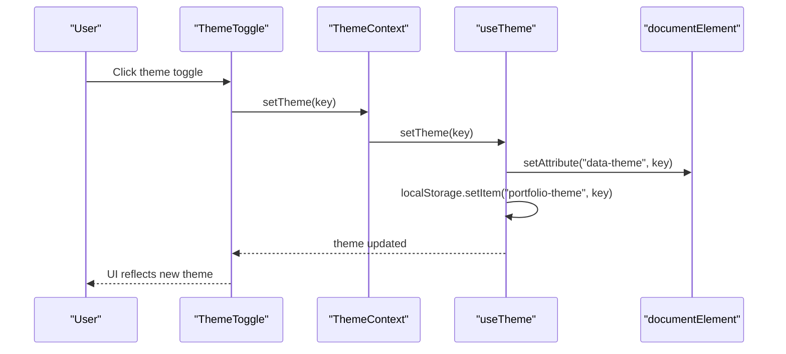
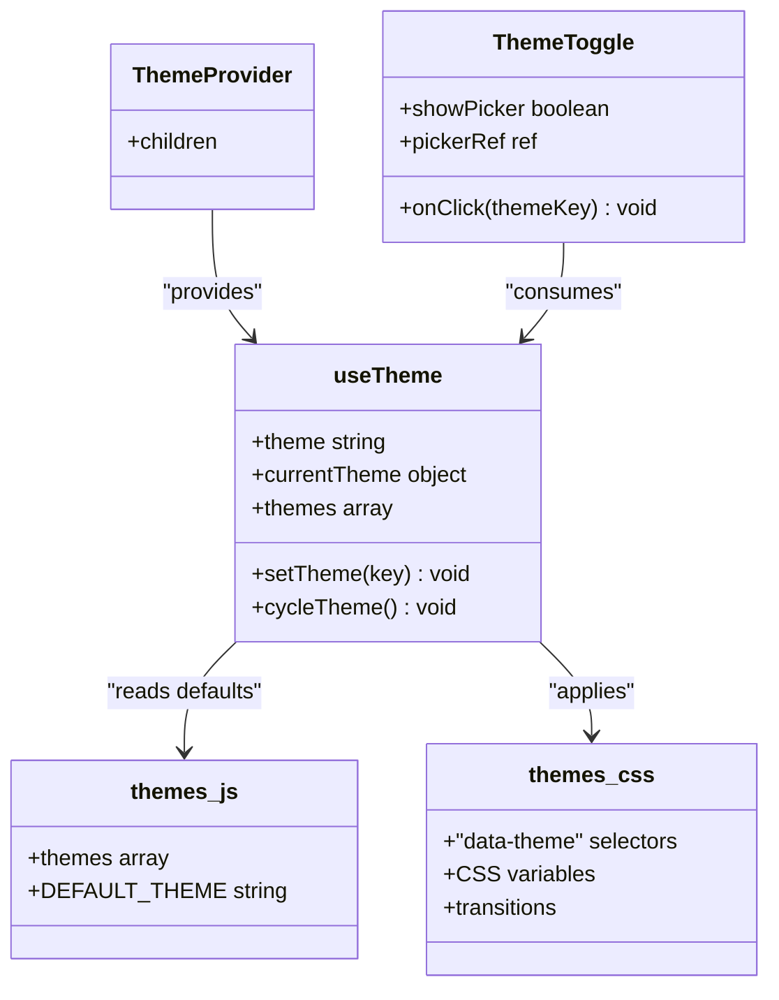
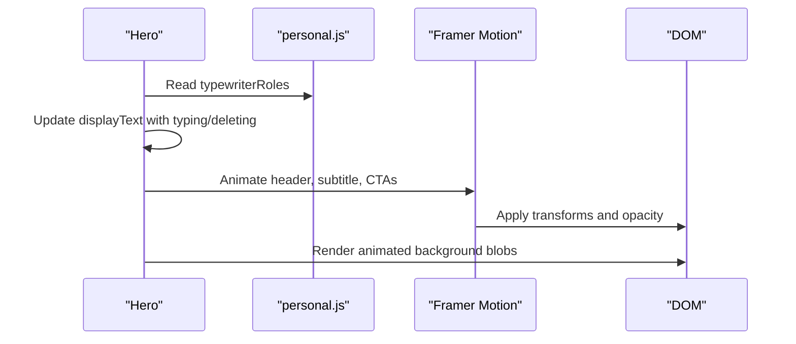
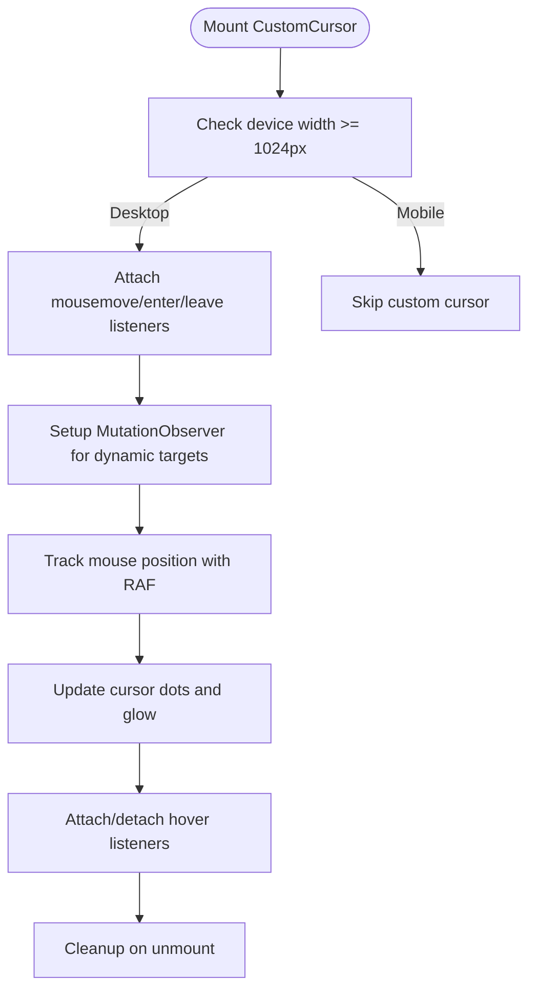
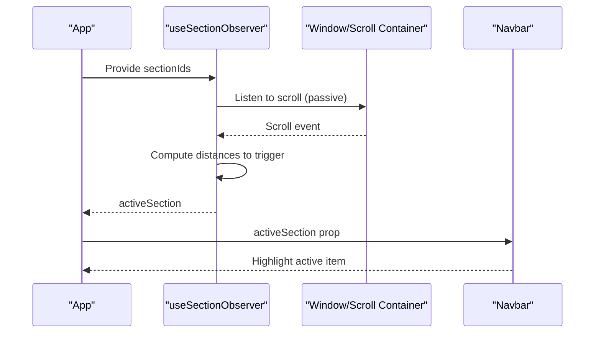
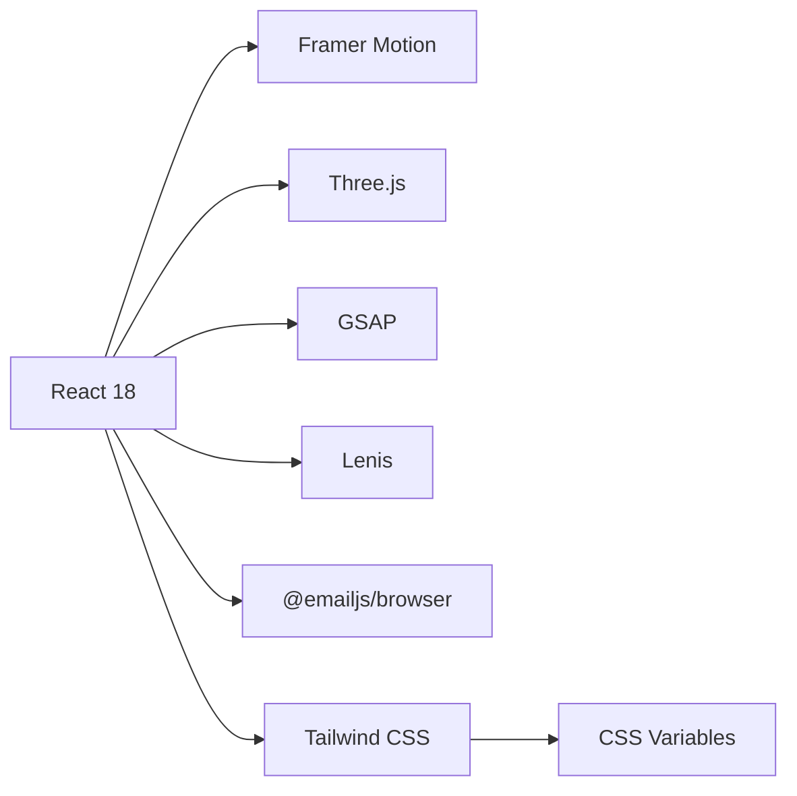

# Project Overview

<cite>
**Referenced Files in This Document**
- [README.md](file://README.md)
- [package.json](file://package.json)
- [src/main.jsx](file://src/main.jsx)
- [src/App.jsx](file://src/App.jsx)
- [src/context/ThemeContext.jsx](file://src/context/ThemeContext.jsx)
- [src/hooks/useTheme.js](file://src/hooks/useTheme.js)
- [src/data/themes.js](file://src/data/themes.js)
- [src/styles/themes.css](file://src/styles/themes.css)
- [src/components/ui/ThemeToggle.jsx](file://src/components/ui/ThemeToggle.jsx)
- [src/components/sections/Hero.jsx](file://src/components/sections/Hero.jsx)
- [src/components/ui/CustomCursor.jsx](file://src/components/ui/CustomCursor.jsx)
- [src/components/layout/Navbar.jsx](file://src/components/layout/Navbar.jsx)
- [src/hooks/useSectionObserver.js](file://src/hooks/useSectionObserver.js)
- [src/data/personal.js](file://src/data/personal.js)
- [tailwind.config.js](file://tailwind.config.js)
</cite>

## Table of Contents
1. [Introduction](#introduction)
2. [Project Structure](#project-structure)
3. [Core Components](#core-components)
4. [Architecture Overview](#architecture-overview)
5. [Detailed Component Analysis](#detailed-component-analysis)
6. [Dependency Analysis](#dependency-analysis)
7. [Performance Considerations](#performance-considerations)
8. [Troubleshooting Guide](#troubleshooting-guide)
9. [Conclusion](#conclusion)
10. [Appendices](#appendices)

## Introduction
This modern React portfolio website serves as a professional digital showcase for developers and creators. It emphasizes a polished user experience through a multi-theme system, smooth animations, responsive design, and accessibility compliance. The site is built with contemporary web technologies and optimized for performance, making it suitable for showcasing projects, skills, and professional experience to potential employers, collaborators, or clients.

Key goals:
- Present a visually engaging, accessible, and performant portfolio
- Offer five distinct, thoughtfully designed themes
- Deliver delightful interactions with animations and a custom cursor
- Maintain mobile-first responsiveness and cross-device usability
- Provide a robust foundation for customization and deployment

## Project Structure
The project follows a component-driven structure with clear separation of concerns:
- Entry point initializes providers and global styles
- App composes reusable layout and section components
- Theme system is centralized via a provider and hook
- Sections encapsulate content areas (Hero, About, Skills, Projects, Experience, Contact)
- UI components provide shared interactions (ThemeToggle, CustomCursor, BackToTop, etc.)
- Data modules define personal info, projects, skills, experience, and themes
- Styling leverages CSS variables and Tailwind utilities for consistent theming

```mermaid
graph TB
subgraph "Entry"
MAIN["src/main.jsx"]
APP["src/App.jsx"]
end
subgraph "Layout"
NAV["src/components/layout/Navbar.jsx"]
FOOTER["src/components/layout/Footer.jsx"]
end
subgraph "Sections"
HERO["src/components/sections/Hero.jsx"]
ABOUT["src/components/sections/AboutNew.jsx"]
SKILLS["src/components/sections/Skills.jsx"]
PROJECTS["src/components/sections/Projects.jsx"]
EXPERIENCE["src/components/sections/Experience.jsx"]
CONTACT["src/components/sections/Contact.jsx"]
end
subgraph "UI"
THEME_TOGGLE["src/components/ui/ThemeToggle.jsx"]
CURSOR["src/components/ui/CustomCursor.jsx"]
BACKTOTOP["src/components/ui/BackToTop.jsx"]
end
subgraph "State & Theming"
THEME_CTX["src/context/ThemeContext.jsx"]
USE_THEME["src/hooks/useTheme.js"]
THEMES_DATA["src/data/themes.js"]
THEMES_CSS["src/styles/themes.css"]
end
subgraph "Data"
PERSONAL["src/data/personal.js"]
EXPERIENCE_DATA["src/data/experience.js"]
PROJECTS_DATA["src/data/projects.js"]
SKILLS_DATA["src/data/skills.js"]
end
MAIN --> THEME_CTX
THEME_CTX --> USE_THEME
USE_THEME --> THEMES_DATA
USE_THEME --> THEMES_CSS
MAIN --> APP
APP --> NAV
APP --> THEME_TOGGLE
APP --> BACKTOTOP
APP --> CURSOR
APP --> HERO
APP --> ABOUT
APP --> SKILLS
APP --> PROJECTS
APP --> EXPERIENCE
APP --> CONTACT
APP --> FOOTER
HERO --> PERSONAL
```

**Diagram sources**
- [src/main.jsx:1-16](file://src/main.jsx#L1-L16)
- [src/App.jsx:1-47](file://src/App.jsx#L1-L47)
- [src/context/ThemeContext.jsx:1-23](file://src/context/ThemeContext.jsx#L1-L23)
- [src/hooks/useTheme.js:1-33](file://src/hooks/useTheme.js#L1-L33)
- [src/data/themes.js:1-30](file://src/data/themes.js#L1-L30)
- [src/styles/themes.css:1-395](file://src/styles/themes.css#L1-L395)
- [src/components/layout/Navbar.jsx:1-255](file://src/components/layout/Navbar.jsx#L1-L255)
- [src/components/sections/Hero.jsx:1-229](file://src/components/sections/Hero.jsx#L1-L229)
- [src/components/ui/ThemeToggle.jsx:1-113](file://src/components/ui/ThemeToggle.jsx#L1-L113)
- [src/components/ui/CustomCursor.jsx:1-245](file://src/components/ui/CustomCursor.jsx#L1-L245)
- [src/data/personal.js:1-29](file://src/data/personal.js#L1-L29)

**Section sources**
- [README.md:32-57](file://README.md#L32-L57)
- [src/main.jsx:1-16](file://src/main.jsx#L1-L16)
- [src/App.jsx:1-47](file://src/App.jsx#L1-L47)

## Core Components
- Theme system: Centralized theme selection and persistence via a provider and hook, with CSS variables applied to the document root for seamless transitions.
- Animated Hero: Dynamic role text, ambient background effects, and animated CTAs powered by Framer Motion.
- Custom cursor: Desktop-only interactive cursor with trailing rings and hover labels, implemented with spring physics and MutationObserver for dynamic targets.
- Navigation: Responsive navbar with active section highlighting, morphing background, and mobile drawer.
- Section observer: Efficient scroll detection to highlight active navigation items using requestAnimationFrame.
- Accessibility: Semantic markup, keyboard navigation, focus management, reduced-motion support, and ARIA attributes.

Practical examples:
- Switching themes: Use the floating ThemeToggle to cycle through Obsidian Terminal, Warm Slate, Arctic Minimal, Midnight Violet, and Steel & Flame.
- Scrolling behavior: As you scroll, the active section indicator updates smoothly in the navbar.
- Cursor interactions: Hovering links and buttons shows the custom cursor with a label and subtle glow.

**Section sources**
- [src/context/ThemeContext.jsx:1-23](file://src/context/ThemeContext.jsx#L1-L23)
- [src/hooks/useTheme.js:1-33](file://src/hooks/useTheme.js#L1-L33)
- [src/data/themes.js:1-30](file://src/data/themes.js#L1-L30)
- [src/styles/themes.css:1-395](file://src/styles/themes.css#L1-L395)
- [src/components/ui/ThemeToggle.jsx:1-113](file://src/components/ui/ThemeToggle.jsx#L1-L113)
- [src/components/sections/Hero.jsx:1-229](file://src/components/sections/Hero.jsx#L1-L229)
- [src/components/ui/CustomCursor.jsx:1-245](file://src/components/ui/CustomCursor.jsx#L1-L245)
- [src/components/layout/Navbar.jsx:1-255](file://src/components/layout/Navbar.jsx#L1-L255)
- [src/hooks/useSectionObserver.js:1-52](file://src/hooks/useSectionObserver.js#L1-L52)

## Architecture Overview
The application uses a provider pattern to manage theme state globally, enabling components to consume and modify theme settings without prop drilling. The theme hook reads from localStorage on mount, applies the selected theme to the document element, and persists changes. Tailwind CSS integrates with CSS variables for consistent theming across components.

**Diagram sources**
- [src/components/ui/ThemeToggle.jsx:1-113](file://src/components/ui/ThemeToggle.jsx#L1-L113)
- [src/context/ThemeContext.jsx:1-23](file://src/context/ThemeContext.jsx#L1-L23)
- [src/hooks/useTheme.js:1-33](file://src/hooks/useTheme.js#L1-L33)

Technology stack highlights:
- Framework: React 18 with hooks and concurrent features
- Build tool: Vite 8 for fast development and optimized builds
- Styling: Tailwind CSS 4 with CSS variables for theme tokens
- Animations: Framer Motion for gesture-driven motion and scroll-triggered animations
- Icons: Devicons via CDN
- Deployment: Vercel, Netlify, or GitHub Pages

**Section sources**
- [README.md:116-123](file://README.md#L116-L123)
- [package.json:12-24](file://package.json#L12-L24)
- [tailwind.config.js:1-54](file://tailwind.config.js#L1-L54)

## Detailed Component Analysis

### Theme System
The theme system consists of:
- Theme keys and labels defined centrally
- A provider that exposes theme state and helpers
- A hook that manages local storage, applies the theme to the document, and cycles themes
- CSS variables mapped per theme with smooth transitions and exclusions for performance-sensitive elements

**Diagram sources**
- [src/context/ThemeContext.jsx:1-23](file://src/context/ThemeContext.jsx#L1-L23)
- [src/hooks/useTheme.js:1-33](file://src/hooks/useTheme.js#L1-L33)
- [src/data/themes.js:1-30](file://src/data/themes.js#L1-L30)
- [src/styles/themes.css:1-395](file://src/styles/themes.css#L1-L395)
- [src/components/ui/ThemeToggle.jsx:1-113](file://src/components/ui/ThemeToggle.jsx#L1-L113)

**Section sources**
- [src/context/ThemeContext.jsx:1-23](file://src/context/ThemeContext.jsx#L1-L23)
- [src/hooks/useTheme.js:1-33](file://src/hooks/useTheme.js#L1-L33)
- [src/data/themes.js:1-30](file://src/data/themes.js#L1-L30)
- [src/styles/themes.css:1-395](file://src/styles/themes.css#L1-L395)
- [src/components/ui/ThemeToggle.jsx:1-113](file://src/components/ui/ThemeToggle.jsx#L1-L113)

### Hero Section and Animations
The Hero section demonstrates:
- Typewriter effect for dynamic role text
- Ambient animated background blobs
- Scroll-triggered fade-in and slide animations
- Gradient text and animated CTAs

**Diagram sources**
- [src/components/sections/Hero.jsx:1-229](file://src/components/sections/Hero.jsx#L1-L229)
- [src/data/personal.js:1-29](file://src/data/personal.js#L1-L29)

**Section sources**
- [src/components/sections/Hero.jsx:1-229](file://src/components/sections/Hero.jsx#L1-L229)
- [src/data/personal.js:1-29](file://src/data/personal.js#L1-L29)

### Custom Cursor
The custom cursor:
- Tracks mouse movement with requestAnimationFrame
- Uses spring physics for smooth trailing rings
- Detects hover targets dynamically with MutationObserver
- Hides on mobile and supports hover labels

**Diagram sources**
- [src/components/ui/CustomCursor.jsx:1-245](file://src/components/ui/CustomCursor.jsx#L1-L245)

**Section sources**
- [src/components/ui/CustomCursor.jsx:1-245](file://src/components/ui/CustomCursor.jsx#L1-L245)

### Navigation and Active Section Detection
The navbar:
- Highlights the active section based on scroll position
- Provides smooth morphing background on hover
- Includes a mobile drawer with premium styling

The active section detection:
- Computes distance from each section’s top to a viewport trigger
- Uses requestAnimationFrame to throttle calculations
- Updates the active section efficiently

**Diagram sources**
- [src/hooks/useSectionObserver.js:1-52](file://src/hooks/useSectionObserver.js#L1-L52)
- [src/App.jsx:15-17](file://src/App.jsx#L15-L17)
- [src/components/layout/Navbar.jsx:1-255](file://src/components/layout/Navbar.jsx#L1-L255)

**Section sources**
- [src/hooks/useSectionObserver.js:1-52](file://src/hooks/useSectionObserver.js#L1-L52)
- [src/App.jsx:15-17](file://src/App.jsx#L15-L17)
- [src/components/layout/Navbar.jsx:1-255](file://src/components/layout/Navbar.jsx#L1-L255)

### Conceptual Overview
Beginners can think of the portfolio as a “digital business card” that tells your story through visuals and interactions. Experienced developers can see a modular, themeable React application with thoughtful UX patterns, performance-conscious animations, and a scalable data layer.

## Dependency Analysis
External libraries and their roles:
- Framer Motion: Gesture-driven animations and scroll-triggered effects
- Three.js: 3D background elements in Hero
- GSAP: Advanced scroll-based animations
- Lenis: Smooth scrolling behavior
- EmailJS: Contact form delivery
- Tailwind CSS: Utility-first styling with CSS variable integration

**Diagram sources**
- [package.json:12-24](file://package.json#L12-L24)
- [tailwind.config.js:1-54](file://tailwind.config.js#L1-L54)

**Section sources**
- [package.json:12-24](file://package.json#L12-L24)
- [tailwind.config.js:1-54](file://tailwind.config.js#L1-L54)

## Performance Considerations
- Bundle size: Optimized with a total of approximately 420KB (gzipped ~125KB)
- Animation performance: Uses requestAnimationFrame and prefers reduced-motion for accessibility
- CSS transitions: Scoped to theme variables and excluded from performance-sensitive elements
- Lazy loading: Consider lazy-loading heavy sections if content grows

[No sources needed since this section provides general guidance]

## Troubleshooting Guide
Common issues and resolutions:
- Build fails: Clear node_modules and reinstall dependencies, then rebuild
- Images not loading: Verify paths, formats, and placement under the public directory
- Theme not persisting: Ensure localStorage is enabled and theme keys match between data and CSS

**Section sources**
- [README.md:169-186](file://README.md#L169-L186)

## Conclusion
This portfolio website combines modern design principles with robust engineering practices. Its multi-theme system, smooth animations, responsive layout, and accessibility features deliver a professional, memorable experience. The architecture supports easy customization and deployment, making it an excellent foundation for personal branding and career advancement.

[No sources needed since this section summarizes without analyzing specific files]

## Appendices

### Target Audience
- Job seekers and freelancers in tech
- Recruiters and hiring managers reviewing candidates
- Collaborators and mentors seeking quick insights
- General audiences interested in modern web design

### Practical Examples
- Theme variations: Explore Obsidian Terminal (dark with green), Warm Slate (dark with orange), Arctic Minimal (light with blue), Midnight Violet (dark with purple), and Steel & Flame (dark with red)
- Interaction demos: Hover over links to see the custom cursor label, scroll through sections to observe active highlighting, and toggle themes to preview color palettes

**Section sources**
- [README.md:105-114](file://README.md#L105-L114)
- [src/styles/themes.css:59-222](file://src/styles/themes.css#L59-L222)
- [src/components/ui/CustomCursor.jsx:1-245](file://src/components/ui/CustomCursor.jsx#L1-L245)
- [src/components/layout/Navbar.jsx:1-255](file://src/components/layout/Navbar.jsx#L1-L255)