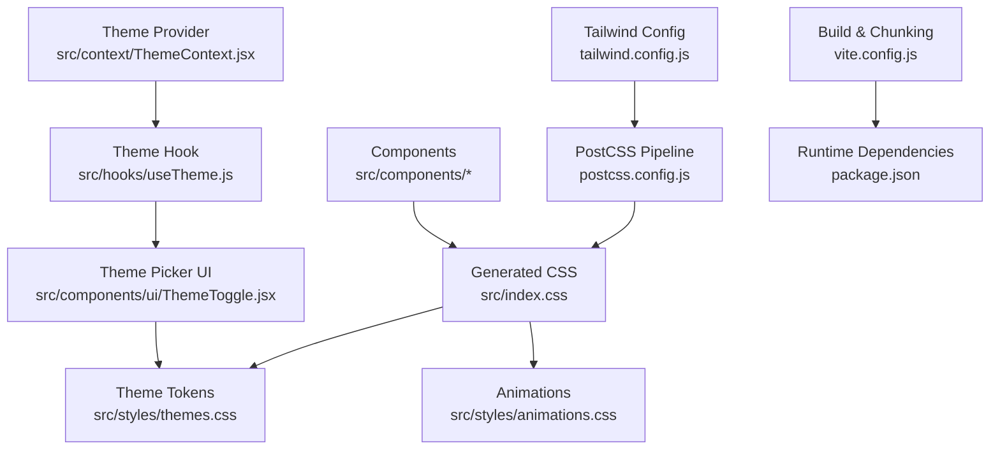
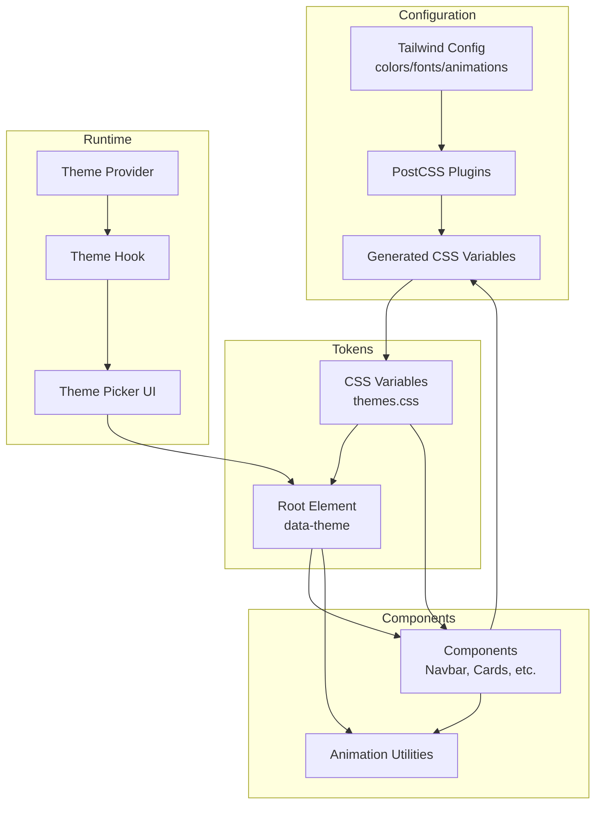
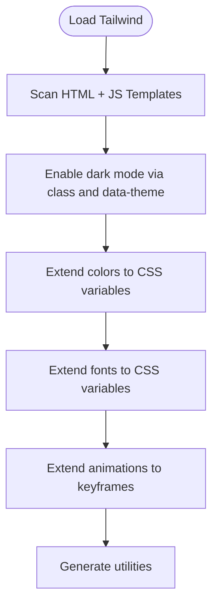
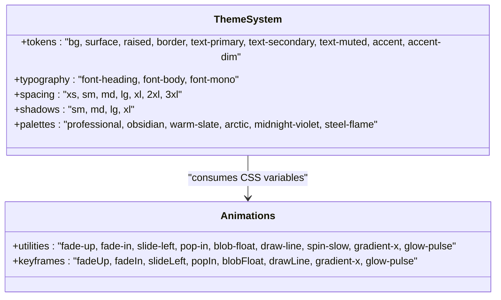
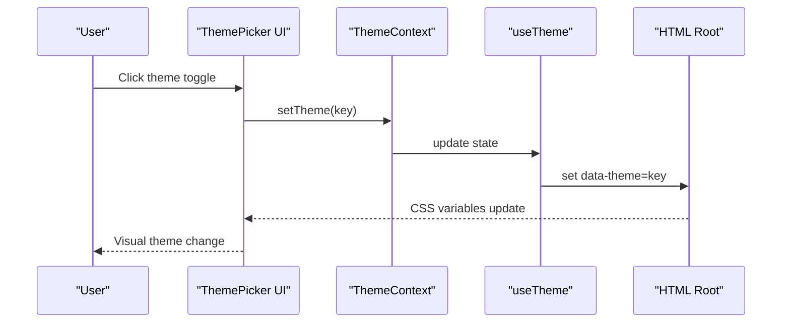
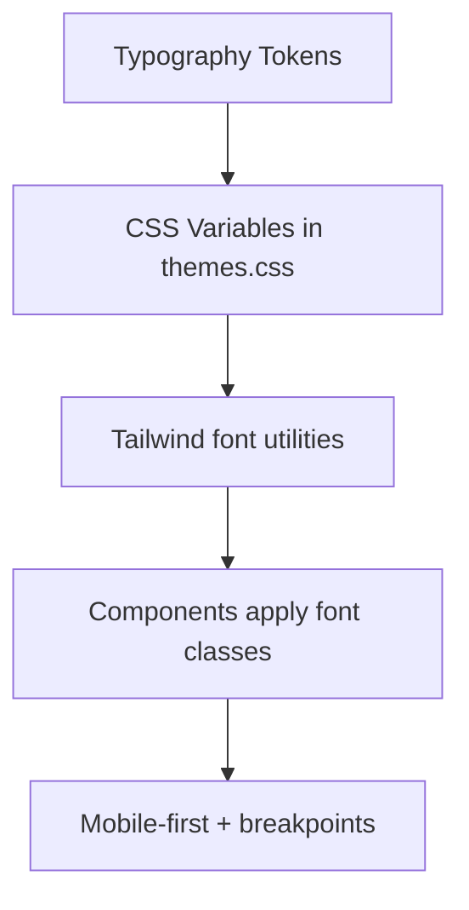
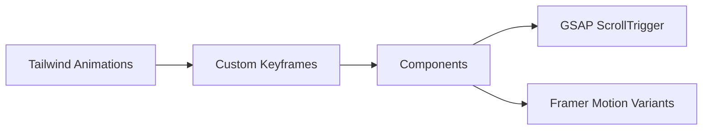
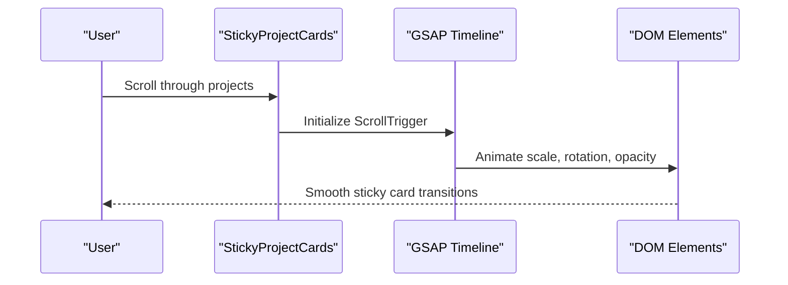
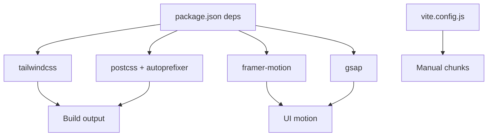

# Styling Strategy

<cite>
**Referenced Files in This Document**
- [tailwind.config.js](file://tailwind.config.js)
- [postcss.config.js](file://postcss.config.js)
- [package.json](file://package.json)
- [src/index.css](file://src/index.css)
- [src/styles/themes.css](file://src/styles/themes.css)
- [src/styles/animations.css](file://src/styles/animations.css)
- [src/data/themes.js](file://src/data/themes.js)
- [src/context/ThemeContext.jsx](file://src/context/ThemeContext.jsx)
- [src/hooks/useTheme.js](file://src/hooks/useTheme.js)
- [src/components/ui/ThemeToggle.jsx](file://src/components/ui/ThemeToggle.jsx)
- [src/components/layout/Navbar.jsx](file://src/components/layout/Navbar.jsx)
- [src/components/ui/StickyProjectCards.jsx](file://src/components/ui/StickyProjectCards.jsx)
- [src/utils/variants.js](file://src/utils/variants.js)
- [vite.config.js](file://vite.config.js)
</cite>

## Table of Contents
1. [Introduction](#introduction)
2. [Project Structure](#project-structure)
3. [Core Components](#core-components)
4. [Architecture Overview](#architecture-overview)
5. [Detailed Component Analysis](#detailed-component-analysis)
6. [Dependency Analysis](#dependency-analysis)
7. [Performance Considerations](#performance-considerations)
8. [Troubleshooting Guide](#troubleshooting-guide)
9. [Conclusion](#conclusion)
10. [Appendices](#appendices)

## Introduction
This document defines the portfolio’s styling strategy and design system. It explains how Tailwind CSS integrates with CSS variables to create a theme-aware, animation-rich, and responsive interface. It covers the configuration, custom design tokens, typography, responsive patterns, and performance practices. It also provides guidelines for extending the system, maintaining consistency, and ensuring accessibility and cross-browser compatibility.

## Project Structure
The styling system is organized around three pillars:
- Tailwind CSS configuration and PostCSS pipeline
- CSS variable-driven themes with multiple palettes
- Utility-first component classes and animation libraries

**Diagram sources**
- [tailwind.config.js:1-54](file://tailwind.config.js#L1-L54)
- [postcss.config.js:1-7](file://postcss.config.js#L1-L7)
- [src/index.css:1-172](file://src/index.css#L1-L172)
- [src/styles/themes.css:1-395](file://src/styles/themes.css#L1-L395)
- [src/styles/animations.css:1-426](file://src/styles/animations.css#L1-L426)
- [src/context/ThemeContext.jsx:1-23](file://src/context/ThemeContext.jsx#L1-L23)
- [src/hooks/useTheme.js:1-33](file://src/hooks/useTheme.js#L1-L33)
- [src/components/ui/ThemeToggle.jsx:1-113](file://src/components/ui/ThemeToggle.jsx#L1-L113)
- [vite.config.js:1-34](file://vite.config.js#L1-L34)
- [package.json:1-41](file://package.json#L1-L41)

**Section sources**
- [tailwind.config.js:1-54](file://tailwind.config.js#L1-L54)
- [postcss.config.js:1-7](file://postcss.config.js#L1-L7)
- [src/index.css:1-172](file://src/index.css#L1-L172)
- [src/styles/themes.css:1-395](file://src/styles/themes.css#L1-L395)
- [src/styles/animations.css:1-426](file://src/styles/animations.css#L1-L426)
- [src/context/ThemeContext.jsx:1-23](file://src/context/ThemeContext.jsx#L1-L23)
- [src/hooks/useTheme.js:1-33](file://src/hooks/useTheme.js#L1-L33)
- [src/components/ui/ThemeToggle.jsx:1-113](file://src/components/ui/ThemeToggle.jsx#L1-L113)
- [vite.config.js:1-34](file://vite.config.js#L1-L34)
- [package.json:1-41](file://package.json#L1-L41)

## Core Components
- Tailwind configuration extends color palette, fonts, and animation utilities to consume CSS variables.
- CSS variables define theme tokens and are applied via a data-theme attribute on the root element.
- Animations combine Tailwind animation utilities with custom keyframes and micro-interactions.
- Theme provider and hook manage persistence and switching across the app.
- Components apply utility classes consistently to maintain design system fidelity.

Key implementation references:
- Tailwind theme extension and animation utilities: [tailwind.config.js:5-51](file://tailwind.config.js#L5-L51)
- CSS variable tokens and transitions: [src/styles/themes.css:7-246](file://src/styles/themes.css#L7-L246)
- Tailwind CSS variable exposure: [src/index.css:3-100](file://src/index.css#L3-L100)
- Theme picker UI and provider: [src/components/ui/ThemeToggle.jsx:1-113](file://src/components/ui/ThemeToggle.jsx#L1-L113), [src/context/ThemeContext.jsx:1-23](file://src/context/ThemeContext.jsx#L1-L23), [src/hooks/useTheme.js:1-33](file://src/hooks/useTheme.js#L1-L33)
- Animation utilities and micro-interactions: [src/styles/animations.css:1-426](file://src/styles/animations.css#L1-L426)

**Section sources**
- [tailwind.config.js:5-51](file://tailwind.config.js#L5-L51)
- [src/styles/themes.css:7-246](file://src/styles/themes.css#L7-L246)
- [src/index.css:3-100](file://src/index.css#L3-L100)
- [src/components/ui/ThemeToggle.jsx:1-113](file://src/components/ui/ThemeToggle.jsx#L1-L113)
- [src/context/ThemeContext.jsx:1-23](file://src/context/ThemeContext.jsx#L1-L23)
- [src/hooks/useTheme.js:1-33](file://src/hooks/useTheme.js#L1-L33)
- [src/styles/animations.css:1-426](file://src/styles/animations.css#L1-L426)

## Architecture Overview
The design system architecture connects configuration, tokens, and runtime behavior to deliver a cohesive, theme-aware UI.

**Diagram sources**
- [tailwind.config.js:1-54](file://tailwind.config.js#L1-L54)
- [postcss.config.js:1-7](file://postcss.config.js#L1-L7)
- [src/index.css:1-172](file://src/index.css#L1-L172)
- [src/styles/themes.css:1-395](file://src/styles/themes.css#L1-L395)
- [src/context/ThemeContext.jsx:1-23](file://src/context/ThemeContext.jsx#L1-L23)
- [src/hooks/useTheme.js:1-33](file://src/hooks/useTheme.js#L1-L33)
- [src/components/ui/ThemeToggle.jsx:1-113](file://src/components/ui/ThemeToggle.jsx#L1-L113)

## Detailed Component Analysis

### Tailwind CSS Configuration and Theme Extension
Tailwind is configured to:
- Scan JSX/TSX templates for class usage
- Enable dark mode via a class and a data attribute
- Extend colors, fonts, and animation utilities to bind to CSS variables

**Diagram sources**
- [tailwind.config.js:3-51](file://tailwind.config.js#L3-L51)

**Section sources**
- [tailwind.config.js:3-51](file://tailwind.config.js#L3-L51)

### CSS Variable Tokens and Theme System
The theme system defines:
- Multiple named themes (professional, obsidian, warm-slate, arctic, midnight-violet, steel-flame)
- Core tokens for backgrounds, borders, text, accents, shadows, spacing, and typography
- Global transitions and animation utilities
- Glassmorphism and hover effects

**Diagram sources**
- [src/styles/themes.css:7-246](file://src/styles/themes.css#L7-L246)
- [tailwind.config.js:23-49](file://tailwind.config.js#L23-L49)

**Section sources**
- [src/styles/themes.css:7-246](file://src/styles/themes.css#L7-L246)
- [tailwind.config.js:23-49](file://tailwind.config.js#L23-L49)

### Theme-Aware Styling and Runtime Switching
Theme switching is powered by:
- A theme provider and hook that persist the selected theme in local storage
- A theme picker UI that toggles the data-theme attribute on the root element
- Tailwind’s dark mode configured to respect the data attribute

**Diagram sources**
- [src/components/ui/ThemeToggle.jsx:1-113](file://src/components/ui/ThemeToggle.jsx#L1-L113)
- [src/context/ThemeContext.jsx:1-23](file://src/context/ThemeContext.jsx#L1-L23)
- [src/hooks/useTheme.js:1-33](file://src/hooks/useTheme.js#L1-L33)
- [tailwind.config.js:4](file://tailwind.config.js#L4)

**Section sources**
- [src/components/ui/ThemeToggle.jsx:1-113](file://src/components/ui/ThemeToggle.jsx#L1-L113)
- [src/context/ThemeContext.jsx:1-23](file://src/context/ThemeContext.jsx#L1-L23)
- [src/hooks/useTheme.js:1-33](file://src/hooks/useTheme.js#L1-L33)
- [tailwind.config.js:4](file://tailwind.config.js#L4)

### Typography System and Responsive Patterns
Typography is driven by CSS variables for headings, body, and mono fonts. Responsive patterns are enforced via:
- Mobile-first defaults with Tailwind modifiers for larger screens
- Consistent line heights and readable sizes
- Viewport meta and scroll behavior tuned for smooth experiences

**Diagram sources**
- [src/styles/themes.css:32-35](file://src/styles/themes.css#L32-L35)
- [tailwind.config.js:18-22](file://tailwind.config.js#L18-L22)
- [src/index.css:107-114](file://src/index.css#L107-L114)

**Section sources**
- [src/styles/themes.css:32-35](file://src/styles/themes.css#L32-L35)
- [tailwind.config.js:18-22](file://tailwind.config.js#L18-L22)
- [src/index.css:107-114](file://src/index.css#L107-L114)

### Animation-Specific Styles and Micro-Interactions
Animations combine Tailwind animation utilities with custom keyframes and micro-interactions:
- Scroll-triggered animations via GSAP and ScrollTrigger
- Motion primitives from Framer Motion for UI feedback
- Utility classes for hover lifts, glows, and staggered reveals

**Diagram sources**
- [tailwind.config.js:23-49](file://tailwind.config.js#L23-L49)
- [src/styles/animations.css:1-426](file://src/styles/animations.css#L1-L426)
- [src/utils/variants.js:1-17](file://src/utils/variants.js#L1-L17)
- [src/components/ui/StickyProjectCards.jsx:1-145](file://src/components/ui/StickyProjectCards.jsx#L1-L145)

**Section sources**
- [tailwind.config.js:23-49](file://tailwind.config.js#L23-L49)
- [src/styles/animations.css:1-426](file://src/styles/animations.css#L1-L426)
- [src/utils/variants.js:1-17](file://src/utils/variants.js#L1-L17)
- [src/components/ui/StickyProjectCards.jsx:1-145](file://src/components/ui/StickyProjectCards.jsx#L1-L145)

### Example Component: Sticky Project Cards
This component demonstrates:
- Glassmorphism with Tailwind classes and CSS variables
- Hover overlays and transitions
- Responsive layout using flex and grid utilities
- Scroll-triggered animations for immersive storytelling

**Diagram sources**
- [src/components/ui/StickyProjectCards.jsx:12-50](file://src/components/ui/StickyProjectCards.jsx#L12-L50)

**Section sources**
- [src/components/ui/StickyProjectCards.jsx:1-145](file://src/components/ui/StickyProjectCards.jsx#L1-L145)

## Dependency Analysis
The styling pipeline depends on Tailwind 4, PostCSS, and build-time configuration. Runtime dependencies include motion libraries and GSAP for advanced animations.

**Diagram sources**
- [package.json:12-38](file://package.json#L12-L38)
- [vite.config.js:17-32](file://vite.config.js#L17-L32)

**Section sources**
- [package.json:12-38](file://package.json#L12-L38)
- [vite.config.js:17-32](file://vite.config.js#L17-L32)

## Performance Considerations
- Prefer CSS variables for theme tokens to avoid re-rendering costs.
- Use Tailwind utilities over ad-hoc CSS to minimize CSS bloat.
- Leverage motion libraries selectively; disable heavy animations for reduced motion preferences.
- Keep animation keyframes minimal and reuse shared easing curves.
- Use build chunk splitting to optimize vendor and motion bundles.

[No sources needed since this section provides general guidance]

## Troubleshooting Guide
Common issues and resolutions:
- Theme not applying: ensure the data-theme attribute is set on the root element and CSS variables are defined.
- Animations stuttering: verify prefers-reduced-motion handling and limit expensive transforms.
- Fonts not loading: confirm CSS variable font families are available and fallbacks are defined.
- Build errors: check Tailwind and PostCSS plugin versions match the installed packages.

**Section sources**
- [src/styles/themes.css:229-246](file://src/styles/themes.css#L229-L246)
- [src/styles/themes.css:355-377](file://src/styles/themes.css#L355-L377)
- [tailwind.config.js:18-22](file://tailwind.config.js#L18-L22)
- [package.json:25-38](file://package.json#L25-L38)

## Conclusion
The portfolio’s styling strategy centers on a robust theme system powered by CSS variables, a Tailwind configuration that exposes tokens as utilities, and a curated set of animations and micro-interactions. By adhering to mobile-first patterns, accessibility best practices, and performance-conscious techniques, the system remains consistent, scalable, and delightful across devices and browsers.

[No sources needed since this section summarizes without analyzing specific files]

## Appendices

### Extending the Design System
- Add new tokens in the theme CSS and expose them to Tailwind via the theme extension.
- Define new animation utilities and keyframes in the animations stylesheet.
- Introduce new theme variants by adding entries to the theme data and updating the provider.
- Maintain naming conventions for colors, spacing, and typography to preserve consistency.

**Section sources**
- [src/styles/themes.css:7-246](file://src/styles/themes.css#L7-L246)
- [tailwind.config.js:5-51](file://tailwind.config.js#L5-L51)
- [src/styles/animations.css:1-426](file://src/styles/animations.css#L1-L426)
- [src/data/themes.js:1-30](file://src/data/themes.js#L1-L30)

### Accessibility and Cross-Browser Compatibility
- Ensure sufficient color contrast for text and interactive elements under all themes.
- Respect reduced motion preferences by disabling or shortening animations.
- Test responsive breakpoints and touch targets across devices.
- Verify CSS variable support and provide appropriate fallbacks for older browsers.

**Section sources**
- [src/styles/themes.css:229-246](file://src/styles/themes.css#L229-L246)
- [src/styles/themes.css:355-377](file://src/styles/themes.css#L355-L377)
- [.kiro/steering/ui-ux-pro-max/data/ux-guidelines.csv:66-73](file://.kiro/steering/ui-ux-pro-max/data/ux-guidelines.csv#L66-L73)
- [.kiro/steering/ui-ux-pro-max/data/stacks/html-tailwind.csv:28-35](file://.kiro/steering/ui-ux-pro-max/data/stacks/html-tailwind.csv#L28-L35)