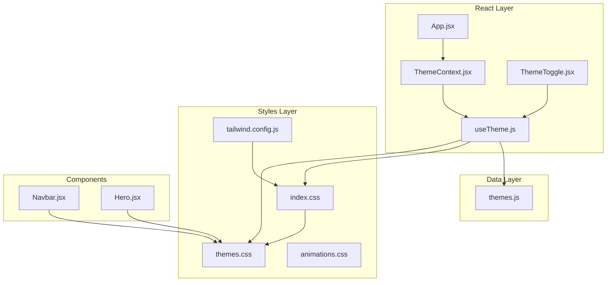
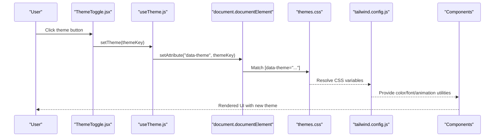
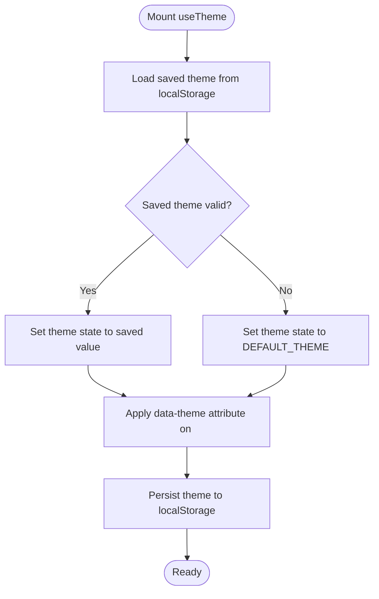
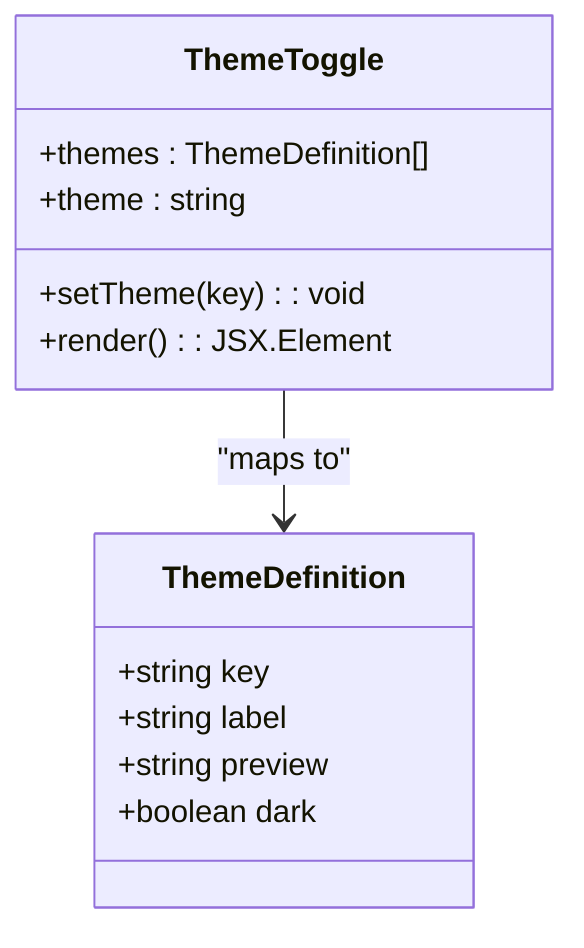
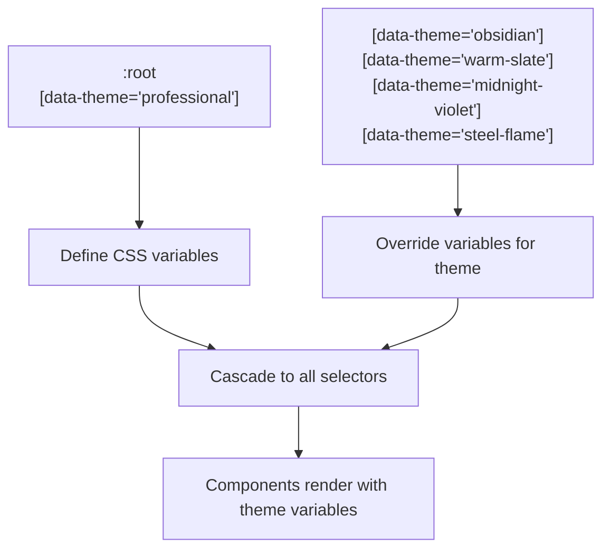
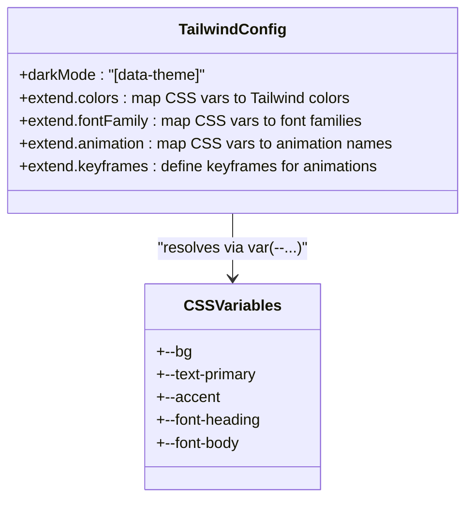
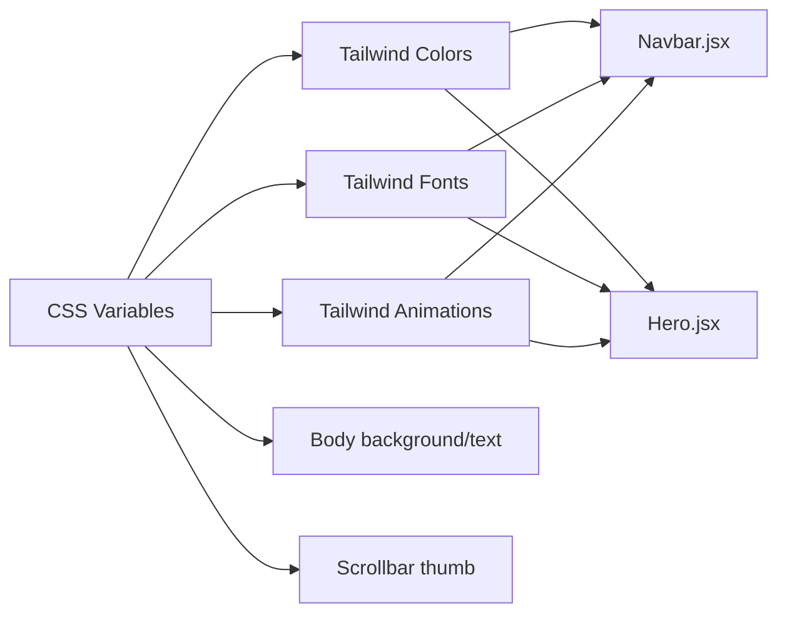
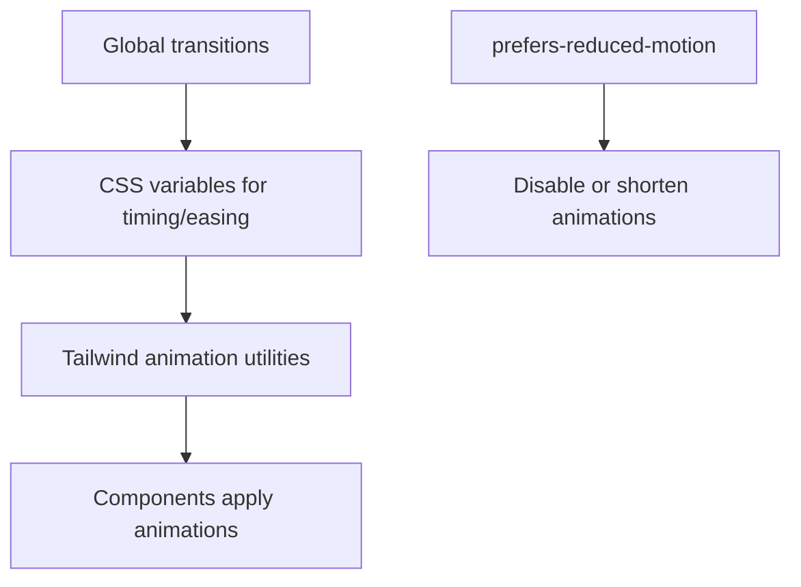
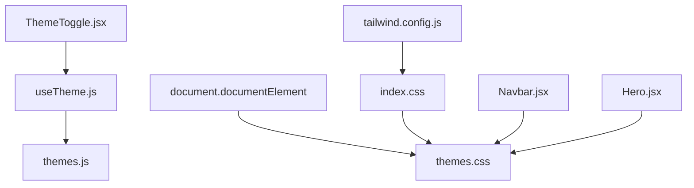

# CSS Variable Management

<cite>
**Referenced Files in This Document**
- [ThemeContext.jsx](file://src/context/ThemeContext.jsx)
- [useTheme.js](file://src/hooks/useTheme.js)
- [themes.js](file://src/data/themes.js)
- [themes.css](file://src/styles/themes.css)
- [ThemeToggle.jsx](file://src/components/ui/ThemeToggle.jsx)
- [index.css](file://src/index.css)
- [animations.css](file://src/styles/animations.css)
- [Navbar.jsx](file://src/components/layout/Navbar.jsx)
- [Hero.jsx](file://src/components/sections/Hero.jsx)
- [App.jsx](file://src/App.jsx)
- [tailwind.config.js](file://tailwind.config.js)
</cite>

## Table of Contents
1. [Introduction](#introduction)
2. [Project Structure](#project-structure)
3. [Core Components](#core-components)
4. [Architecture Overview](#architecture-overview)
5. [Detailed Component Analysis](#detailed-component-analysis)
6. [Dependency Analysis](#dependency-analysis)
7. [Performance Considerations](#performance-considerations)
8. [Troubleshooting Guide](#troubleshooting-guide)
9. [Conclusion](#conclusion)

## Introduction
This document explains the CSS variable system that powers the theme switching mechanism in the portfolio application. It details how CSS custom properties are dynamically updated based on the selected theme, the cascade of theme variables, and their usage throughout the application. It also documents naming conventions, fallback mechanisms, browser compatibility considerations, performance optimization techniques, and the relationship between JavaScript theme state and CSS rendering.

## Project Structure
The theme system spans several layers:
- Theme definition and selection logic in React hooks and context
- CSS variable declarations organized by theme
- Tailwind integration mapping CSS variables to utility classes
- Component usage of CSS variables for colors, typography, spacing, and animations

**Diagram sources**
- [ThemeContext.jsx:1-23](file://src/context/ThemeContext.jsx#L1-L23)
- [useTheme.js:1-33](file://src/hooks/useTheme.js#L1-L33)
- [themes.js:1-30](file://src/data/themes.js#L1-L30)
- [ThemeToggle.jsx:1-113](file://src/components/ui/ThemeToggle.jsx#L1-L113)
- [index.css:1-172](file://src/index.css#L1-L172)
- [themes.css:1-395](file://src/styles/themes.css#L1-L395)
- [animations.css:1-426](file://src/styles/animations.css#L1-L426)
- [tailwind.config.js:1-54](file://tailwind.config.js#L1-L54)
- [Navbar.jsx:1-255](file://src/components/layout/Navbar.jsx#L1-L255)
- [Hero.jsx:1-229](file://src/components/sections/Hero.jsx#L1-L229)
- [App.jsx:1-47](file://src/App.jsx#L1-L47)

**Section sources**
- [ThemeContext.jsx:1-23](file://src/context/ThemeContext.jsx#L1-L23)
- [useTheme.js:1-33](file://src/hooks/useTheme.js#L1-L33)
- [themes.js:1-30](file://src/data/themes.js#L1-L30)
- [ThemeToggle.jsx:1-113](file://src/components/ui/ThemeToggle.jsx#L1-L113)
- [index.css:1-172](file://src/index.css#L1-L172)
- [themes.css:1-395](file://src/styles/themes.css#L1-L395)
- [animations.css:1-426](file://src/styles/animations.css#L1-L426)
- [tailwind.config.js:1-54](file://tailwind.config.js#L1-L54)
- [Navbar.jsx:1-255](file://src/components/layout/Navbar.jsx#L1-L255)
- [Hero.jsx:1-229](file://src/components/sections/Hero.jsx#L1-L229)
- [App.jsx:1-47](file://src/App.jsx#L1-L47)

## Core Components
- Theme provider and context: Centralizes theme state and exposes it to components.
- Theme hook: Manages theme selection, persistence, and DOM attribute updates.
- Theme definitions: Enumerates available themes and defaults.
- Theme toggle UI: Allows users to switch themes and persist selections.
- CSS variable declarations: Defines theme-specific variables and global transitions.
- Tailwind integration: Maps CSS variables to utility classes for consistent theming.
- Component usage: Components consume CSS variables for colors, gradients, shadows, and animations.

**Section sources**
- [ThemeContext.jsx:1-23](file://src/context/ThemeContext.jsx#L1-L23)
- [useTheme.js:1-33](file://src/hooks/useTheme.js#L1-L33)
- [themes.js:1-30](file://src/data/themes.js#L1-L30)
- [ThemeToggle.jsx:1-113](file://src/components/ui/ThemeToggle.jsx#L1-L113)
- [themes.css:1-395](file://src/styles/themes.css#L1-L395)
- [tailwind.config.js:1-54](file://tailwind.config.js#L1-L54)

## Architecture Overview
The theme system follows a unidirectional data flow:
- React state manages the current theme key.
- The theme hook applies the theme to the document root via a data attribute.
- CSS selectors target the data attribute to apply theme-specific variables.
- Tailwind utilities resolve CSS variables at build-time.
- Components render using Tailwind classes that map to CSS variables.

**Diagram sources**
- [ThemeToggle.jsx:1-113](file://src/components/ui/ThemeToggle.jsx#L1-L113)
- [useTheme.js:17-21](file://src/hooks/useTheme.js#L17-L21)
- [themes.css:1-395](file://src/styles/themes.css#L1-L395)
- [tailwind.config.js:1-54](file://tailwind.config.js#L1-L54)

## Detailed Component Analysis

### Theme State Management
The theme state is managed in a React hook that:
- Initializes from localStorage with a fallback to the default theme.
- Updates the document root's data attribute when the theme changes.
- Persists the theme selection in localStorage.
- Provides a cycling function to move to the next theme.

**Diagram sources**
- [useTheme.js:4-21](file://src/hooks/useTheme.js#L4-L21)

**Section sources**
- [useTheme.js:1-33](file://src/hooks/useTheme.js#L1-L33)
- [themes.js:1-30](file://src/data/themes.js#L1-L30)

### Theme Definitions and Switching
Themes are defined with keys and metadata. The toggle UI renders a list of themes and triggers state changes.

**Diagram sources**
- [themes.js:2-27](file://src/data/themes.js#L2-L27)
- [ThemeToggle.jsx:37-73](file://src/components/ui/ThemeToggle.jsx#L37-L73)

**Section sources**
- [themes.js:1-30](file://src/data/themes.js#L1-L30)
- [ThemeToggle.jsx:1-113](file://src/components/ui/ThemeToggle.jsx#L1-L113)

### CSS Variable Declarations and Cascade
Theme variables are declared under theme-specific selectors and a root selector. The cascade ensures:
- Root/default variables apply when no data-theme attribute is present.
- Specific theme selectors override root variables when the attribute matches.
- Global transitions apply to most elements, with exclusions for performance-sensitive components.

**Diagram sources**
- [themes.css:7-57](file://src/styles/themes.css#L7-L57)
- [themes.css:59-90](file://src/styles/themes.css#L59-L90)
- [themes.css:92-122](file://src/styles/themes.css#L92-L122)
- [themes.css:125-156](file://src/styles/themes.css#L125-L156)
- [themes.css:159-189](file://src/styles/themes.css#L159-L189)
- [themes.css:192-222](file://src/styles/themes.css#L192-L222)

**Section sources**
- [themes.css:1-395](file://src/styles/themes.css#L1-L395)

### Tailwind Integration and Fallbacks
Tailwind maps CSS variables to utility classes, enabling consistent theming across the app. The configuration:
- Uses a class-based dark mode strategy targeting the data-theme attribute.
- Extends colors, fonts, and animation utilities to resolve CSS variables.
- Provides keyframes and animation names that components reference.

**Diagram sources**
- [tailwind.config.js:4-50](file://tailwind.config.js#L4-L50)
- [index.css:3-30](file://src/index.css#L3-L30)

**Section sources**
- [tailwind.config.js:1-54](file://tailwind.config.js#L1-L54)
- [index.css:1-172](file://src/index.css#L1-L172)

### Component Usage Patterns
Components consume CSS variables through Tailwind classes and inline styles:
- Navbar uses theme-specific hover backgrounds via CSS variables.
- Hero uses gradients and borders that adapt to the current theme.
- Body and scrollbar colors derive from CSS variables.

**Diagram sources**
- [Navbar.jsx:5-12](file://src/components/layout/Navbar.jsx#L5-L12)
- [Hero.jsx:48-72](file://src/components/sections/Hero.jsx#L48-L72)
- [index.css:107-171](file://src/index.css#L107-L171)
- [animations.css:1-426](file://src/styles/animations.css#L1-L426)

**Section sources**
- [Navbar.jsx:1-255](file://src/components/layout/Navbar.jsx#L1-L255)
- [Hero.jsx:1-229](file://src/components/sections/Hero.jsx#L1-L229)
- [index.css:1-172](file://src/index.css#L1-L172)
- [animations.css:1-426](file://src/styles/animations.css#L1-L426)

### Animation Variables and Responsive Patterns
Animations leverage CSS variables for timing, easing, and color transitions. The system includes:
- Global transition durations and easing curves.
- Motion preference detection to reduce animations.
- Component-specific animations using Tailwind animation utilities.

**Diagram sources**
- [themes.css:229-246](file://src/styles/themes.css#L229-L246)
- [themes.css:355-377](file://src/styles/themes.css#L355-L377)
- [index.css:22-29](file://src/index.css#L22-L29)
- [animations.css:1-426](file://src/styles/animations.css#L1-L426)

**Section sources**
- [themes.css:224-377](file://src/styles/themes.css#L224-L377)
- [index.css:1-172](file://src/index.css#L1-L172)
- [animations.css:1-426](file://src/styles/animations.css#L1-L426)

## Dependency Analysis
The theme system exhibits low coupling and high cohesion:
- Theme hook depends on theme definitions and localStorage.
- Theme toggle depends on theme context and state.
- CSS selectors depend on the data-theme attribute.
- Tailwind configuration depends on CSS variable availability.
- Components depend on Tailwind utilities that resolve CSS variables.

**Diagram sources**
- [useTheme.js:1-33](file://src/hooks/useTheme.js#L1-L33)
- [themes.js:1-30](file://src/data/themes.js#L1-L30)
- [ThemeToggle.jsx:1-113](file://src/components/ui/ThemeToggle.jsx#L1-L113)
- [themes.css:1-395](file://src/styles/themes.css#L1-L395)
- [tailwind.config.js:1-54](file://tailwind.config.js#L1-L54)
- [index.css:1-172](file://src/index.css#L1-L172)
- [Navbar.jsx:1-255](file://src/components/layout/Navbar.jsx#L1-L255)
- [Hero.jsx:1-229](file://src/components/sections/Hero.jsx#L1-L229)

**Section sources**
- [useTheme.js:1-33](file://src/hooks/useTheme.js#L1-L33)
- [themes.js:1-30](file://src/data/themes.js#L1-L30)
- [ThemeToggle.jsx:1-113](file://src/components/ui/ThemeToggle.jsx#L1-L113)
- [themes.css:1-395](file://src/styles/themes.css#L1-L395)
- [tailwind.config.js:1-54](file://tailwind.config.js#L1-L54)
- [index.css:1-172](file://src/index.css#L1-L172)
- [Navbar.jsx:1-255](file://src/components/layout/Navbar.jsx#L1-L255)
- [Hero.jsx:1-229](file://src/components/sections/Hero.jsx#L1-L229)

## Performance Considerations
- Attribute-based theming: Using a data attribute on the root element enables efficient CSS selector matching and avoids cascading reflows.
- Transition exclusions: Certain components disable transitions to prevent performance drops during complex animations.
- Reduced motion support: Motion preferences are respected to minimize heavy animations.
- CSS variable resolution: Tailwind resolves CSS variables at build-time, reducing runtime overhead.
- Local storage caching: Theme selection is persisted locally to avoid repeated computation on subsequent visits.

[No sources needed since this section provides general guidance]

## Troubleshooting Guide
- Theme not applying: Verify the data-theme attribute is set on the document root and matches a theme selector in CSS.
- Variables not resolving: Ensure CSS variables are defined for the active theme and Tailwind configuration maps them to utilities.
- Animations not respecting reduced motion: Confirm the prefers-reduced-motion media query is correctly implemented.
- Inconsistent colors: Check that Tailwind utilities reference CSS variables and that the theme selector order is correct.

**Section sources**
- [useTheme.js:17-21](file://src/hooks/useTheme.js#L17-L21)
- [themes.css:224-377](file://src/styles/themes.css#L224-L377)
- [tailwind.config.js:4-50](file://tailwind.config.js#L4-L50)

## Conclusion
The CSS variable system integrates React state, CSS selectors, and Tailwind utilities to deliver a seamless, performant theme switching experience. By centralizing theme definitions, leveraging data attributes, and mapping variables to Tailwind classes, the application achieves consistent theming across components while maintaining flexibility and accessibility.