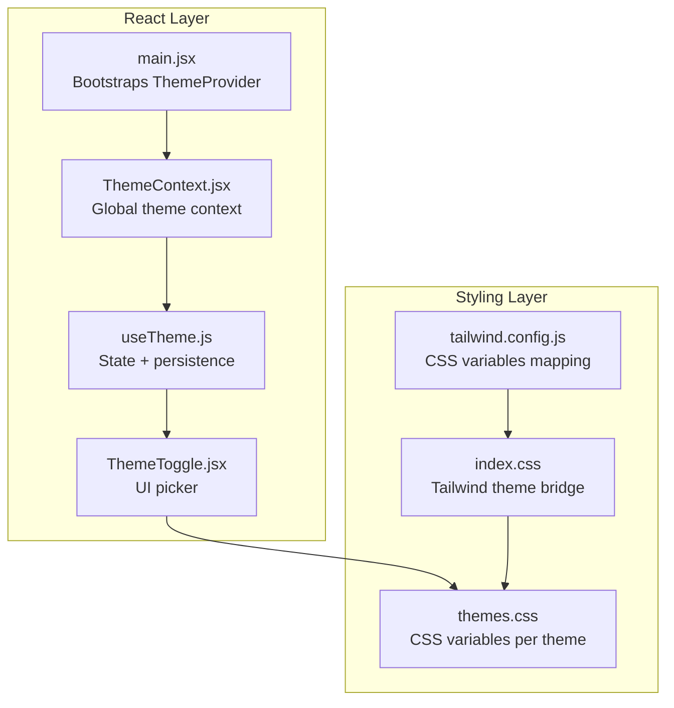
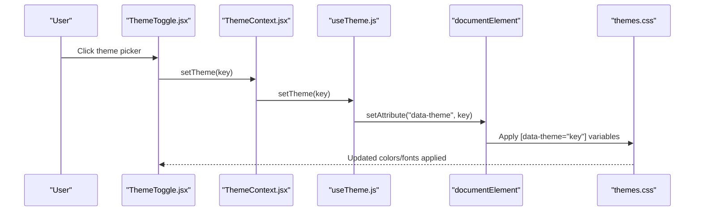
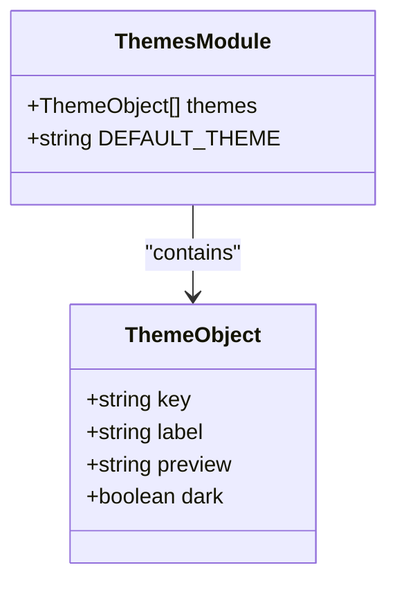
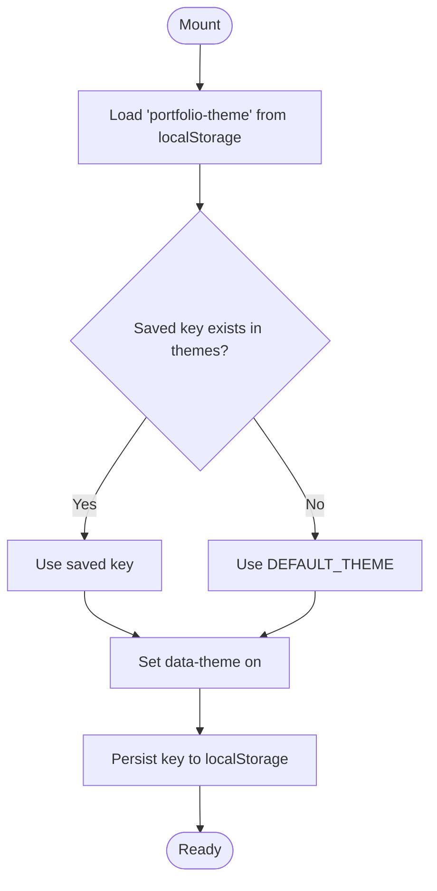
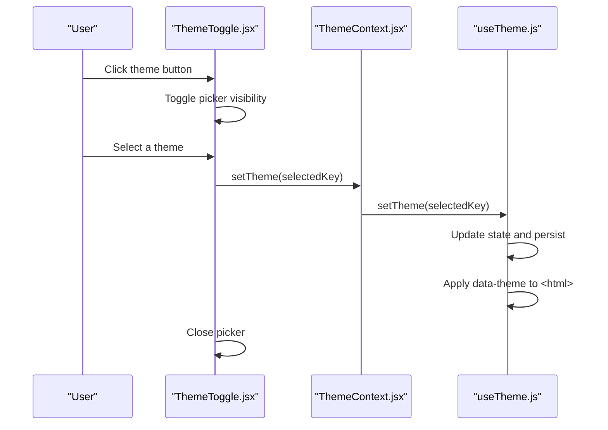
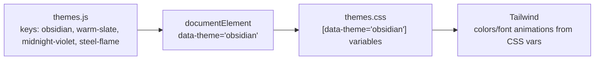
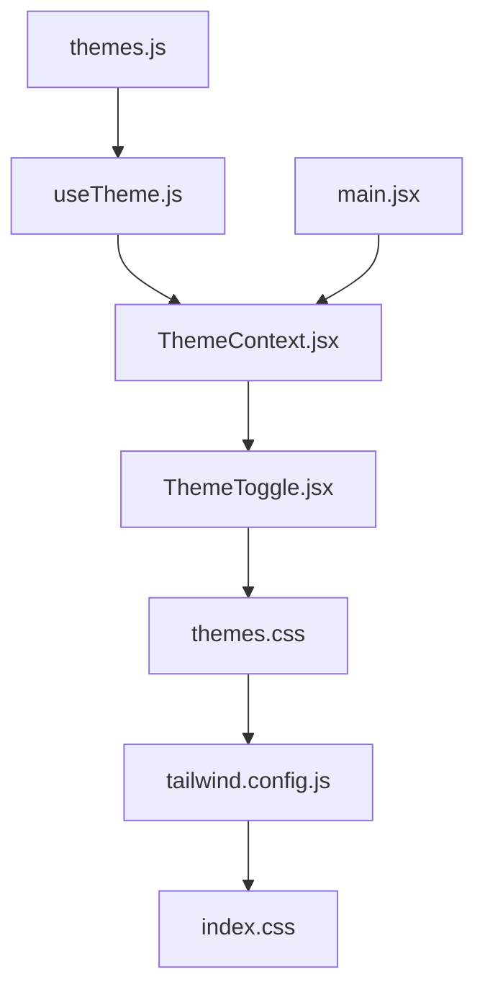

# Theme Configuration

<cite>
**Referenced Files in This Document**
- [themes.js](file://src/data/themes.js)
- [useTheme.js](file://src/hooks/useTheme.js)
- [ThemeContext.jsx](file://src/context/ThemeContext.jsx)
- [ThemeToggle.jsx](file://src/components/ui/ThemeToggle.jsx)
- [themes.css](file://src/styles/themes.css)
- [index.css](file://src/index.css)
- [tailwind.config.js](file://tailwind.config.js)
- [main.jsx](file://src/main.jsx)
</cite>

## Table of Contents
1. [Introduction](#introduction)
2. [Project Structure](#project-structure)
3. [Core Components](#core-components)
4. [Architecture Overview](#architecture-overview)
5. [Detailed Component Analysis](#detailed-component-analysis)
6. [Dependency Analysis](#dependency-analysis)
7. [Performance Considerations](#performance-considerations)
8. [Troubleshooting Guide](#troubleshooting-guide)
9. [Conclusion](#conclusion)

## Introduction
This document explains the theme configuration system used in the portfolio application. It covers how themes are defined, stored, applied, and rendered across the interface. The system centers around a small set of predefined themes, each mapped to CSS variables that define the visual palette. Users can switch themes via a floating action button, and selections persist locally.

## Project Structure
The theme system spans several files:
- Theme definitions and defaults live in a data module
- A React hook manages theme state and persistence
- A context provider exposes theme state globally
- A UI component renders the theme picker and applies selections
- CSS variables define the actual colors and typography per theme
- Tailwind CSS integrates with CSS variables for utility classes
- The application bootstraps the theme provider at startup

**Diagram sources**
- [main.jsx:1-16](file://src/main.jsx#L1-L16)
- [ThemeContext.jsx:1-23](file://src/context/ThemeContext.jsx#L1-L23)
- [useTheme.js:1-33](file://src/hooks/useTheme.js#L1-L33)
- [ThemeToggle.jsx:1-113](file://src/components/ui/ThemeToggle.jsx#L1-L113)
- [index.css:1-172](file://src/index.css#L1-L172)
- [themes.css:1-395](file://src/styles/themes.css#L1-L395)
- [tailwind.config.js:1-54](file://tailwind.config.js#L1-L54)

**Section sources**
- [main.jsx:1-16](file://src/main.jsx#L1-L16)
- [ThemeContext.jsx:1-23](file://src/context/ThemeContext.jsx#L1-L23)
- [useTheme.js:1-33](file://src/hooks/useTheme.js#L1-L33)
- [ThemeToggle.jsx:1-113](file://src/components/ui/ThemeToggle.jsx#L1-L113)
- [index.css:1-172](file://src/index.css#L1-L172)
- [themes.css:1-395](file://src/styles/themes.css#L1-L395)
- [tailwind.config.js:1-54](file://tailwind.config.js#L1-L54)

## Core Components
- Theme data module defines the available themes, their identifiers, labels, preview colors, and whether they are dark themes.
- The theme hook initializes state from storage, applies the selected theme to the document root, cycles through themes, and exposes the current theme object.
- The theme context provides the theme state to the rest of the app.
- The theme toggle UI renders a picker that lets users select a theme and updates the selection immediately.
- CSS variables define the actual color tokens for each theme, including backgrounds, borders, text, accents, and typography.
- Tailwind is configured to resolve color and font families from CSS variables, enabling utility-first styling with dynamic themes.
- The application bootstraps the theme provider at startup so the theme system is available throughout the app lifecycle.

**Section sources**
- [themes.js:1-30](file://src/data/themes.js#L1-L30)
- [useTheme.js:1-33](file://src/hooks/useTheme.js#L1-L33)
- [ThemeContext.jsx:1-23](file://src/context/ThemeContext.jsx#L1-L23)
- [ThemeToggle.jsx:1-113](file://src/components/ui/ThemeToggle.jsx#L1-L113)
- [themes.css:1-395](file://src/styles/themes.css#L1-L395)
- [tailwind.config.js:1-54](file://tailwind.config.js#L1-L54)
- [index.css:1-172](file://src/index.css#L1-L172)
- [main.jsx:1-16](file://src/main.jsx#L1-L16)

## Architecture Overview
The theme system follows a unidirectional data flow:
- Theme data is declared centrally
- The hook reads persisted state and writes the active theme to the document root attribute
- The UI component triggers theme changes
- CSS responds to the attribute change and updates all variables
- Tailwind utilities consume the variables for consistent styling

**Diagram sources**
- [ThemeToggle.jsx:1-113](file://src/components/ui/ThemeToggle.jsx#L1-L113)
- [ThemeContext.jsx:1-23](file://src/context/ThemeContext.jsx#L1-L23)
- [useTheme.js:1-33](file://src/hooks/useTheme.js#L1-L33)
- [themes.css:1-395](file://src/styles/themes.css#L1-L395)

## Detailed Component Analysis

### Theme Data Module
The theme data module exports:
- An array of theme objects, each with:
  - key: the identifier used in the data attribute
  - label: human-readable name for UI display
  - preview: a representative accent color for the picker
  - dark: a boolean flag indicating a dark theme
- A default theme constant

Each theme object corresponds to a CSS selector targeting the HTML element’s data attribute. The module does not define color palettes itself; those are defined in CSS.

**Diagram sources**
- [themes.js:1-30](file://src/data/themes.js#L1-L30)

**Section sources**
- [themes.js:1-30](file://src/data/themes.js#L1-L30)

### Theme Hook and Persistence
The theme hook:
- Initializes state from localStorage if present and valid
- Applies the active theme to the document root via a data attribute
- Persists the selection to localStorage on change
- Provides a cycling mechanism to move to the next theme
- Exposes the current theme object and the full theme list

**Diagram sources**
- [useTheme.js:1-33](file://src/hooks/useTheme.js#L1-L33)

**Section sources**
- [useTheme.js:1-33](file://src/hooks/useTheme.js#L1-L33)

### Theme Context Provider
The context provider wraps the app and exposes theme state to all descendants. It enforces that consumers use the hook to access theme data, preventing misuse.

**Section sources**
- [ThemeContext.jsx:1-23](file://src/context/ThemeContext.jsx#L1-L23)

### Theme Picker UI
The theme picker:
- Renders a tray of available themes
- Highlights the active theme
- Updates the theme on selection
- Uses CSS variables for visual feedback (e.g., glowing dots)
- Integrates with motion libraries for smooth transitions

**Diagram sources**
- [ThemeToggle.jsx:1-113](file://src/components/ui/ThemeToggle.jsx#L1-L113)
- [ThemeContext.jsx:1-23](file://src/context/ThemeContext.jsx#L1-L23)
- [useTheme.js:1-33](file://src/hooks/useTheme.js#L1-L33)

**Section sources**
- [ThemeToggle.jsx:1-113](file://src/components/ui/ThemeToggle.jsx#L1-L113)

### CSS Variable Definitions and Tailwind Integration
The CSS layer defines:
- A base set of CSS variables under a default selector
- Theme-specific blocks keyed by the data attribute
- Global transitions for smooth color swaps
- Utilities leveraging CSS variables (e.g., glassmorphism)

Tailwind is configured to resolve:
- Color tokens to CSS variables
- Font families to CSS variables
- Animation durations and easing curves to CSS variables

**Diagram sources**
- [themes.js:1-30](file://src/data/themes.js#L1-L30)
- [themes.css:1-395](file://src/styles/themes.css#L1-L395)
- [tailwind.config.js:1-54](file://tailwind.config.js#L1-L54)
- [index.css:1-172](file://src/index.css#L1-L172)

**Section sources**
- [themes.css:1-395](file://src/styles/themes.css#L1-L395)
- [tailwind.config.js:1-54](file://tailwind.config.js#L1-L54)
- [index.css:1-172](file://src/index.css#L1-L172)

### Theme Object Structure and Metadata
Each theme object has:
- key: Unique identifier used in the data attribute
- label: Human-readable theme name
- preview: Representative accent color for the picker
- dark: Boolean indicating a dark theme

Example structure reference:
- [themes.js:3-27](file://src/data/themes.js#L3-L27)

Relationship to CSS:
- The key maps to a selector on the HTML element
- The CSS block defines all relevant variables for that theme
- Tailwind resolves colors and fonts from those variables

**Section sources**
- [themes.js:1-30](file://src/data/themes.js#L1-L30)
- [themes.css:1-395](file://src/styles/themes.css#L1-L395)
- [tailwind.config.js:1-54](file://tailwind.config.js#L1-L54)

## Dependency Analysis
The theme system exhibits low coupling and clear separation of concerns:
- Data module is independent of UI and styling
- Hook depends on data and DOM APIs
- Context depends on the hook
- UI depends on context and motion libraries
- CSS depends on the data attribute and Tailwind configuration
- Tailwind depends on CSS variables

**Diagram sources**
- [themes.js:1-30](file://src/data/themes.js#L1-L30)
- [useTheme.js:1-33](file://src/hooks/useTheme.js#L1-L33)
- [ThemeContext.jsx:1-23](file://src/context/ThemeContext.jsx#L1-L23)
- [ThemeToggle.jsx:1-113](file://src/components/ui/ThemeToggle.jsx#L1-L113)
- [themes.css:1-395](file://src/styles/themes.css#L1-L395)
- [tailwind.config.js:1-54](file://tailwind.config.js#L1-L54)
- [index.css:1-172](file://src/index.css#L1-L172)
- [main.jsx:1-16](file://src/main.jsx#L1-L16)

**Section sources**
- [themes.js:1-30](file://src/data/themes.js#L1-L30)
- [useTheme.js:1-33](file://src/hooks/useTheme.js#L1-L33)
- [ThemeContext.jsx:1-23](file://src/context/ThemeContext.jsx#L1-L23)
- [ThemeToggle.jsx:1-113](file://src/components/ui/ThemeToggle.jsx#L1-L113)
- [themes.css:1-395](file://src/styles/themes.css#L1-L395)
- [tailwind.config.js:1-54](file://tailwind.config.js#L1-L54)
- [index.css:1-172](file://src/index.css#L1-L172)
- [main.jsx:1-16](file://src/main.jsx#L1-L16)

## Performance Considerations
- CSS transitions are tuned to avoid heavy repaints during theme switches
- Certain animated elements exclude transitions to prevent jank
- Motion preferences are respected to minimize animations for accessibility
- Tailwind utilities rely on CSS variables, avoiding runtime style recalculation overhead

[No sources needed since this section provides general guidance]

## Troubleshooting Guide
Common issues and resolutions:
- Theme not applying:
  - Verify the data attribute is set on the HTML element
  - Confirm the theme key exists in the theme list
  - Check that the CSS block for the key is defined
- Incorrect colors:
  - Ensure Tailwind is configured to resolve colors from CSS variables
  - Verify the CSS variable names match Tailwind’s expectations
- Picker not updating:
  - Confirm the context provider is wrapping the component tree
  - Ensure the hook is used within the provider
- Persistence lost:
  - Check that localStorage is available and readable
  - Validate that the saved key still exists in the theme list

Validation and consistency checks:
- Validate theme keys against the theme list before applying
- Ensure each theme has a unique key and a valid preview color
- Confirm CSS variable names are consistent across theme blocks
- Verify Tailwind color mappings align with CSS variable names

**Section sources**
- [useTheme.js:1-33](file://src/hooks/useTheme.js#L1-L33)
- [ThemeContext.jsx:1-23](file://src/context/ThemeContext.jsx#L1-L23)
- [themes.css:1-395](file://src/styles/themes.css#L1-L395)
- [tailwind.config.js:1-54](file://tailwind.config.js#L1-L54)

## Conclusion
The theme configuration system cleanly separates data, state, UI, and styling. Themes are defined declaratively, applied via a data attribute, and rendered through CSS variables. Tailwind integrates seamlessly with CSS variables, enabling consistent utility-driven styling across themes. The system persists user preferences, supports cycling, and maintains performance through carefully tuned transitions and accessibility considerations.