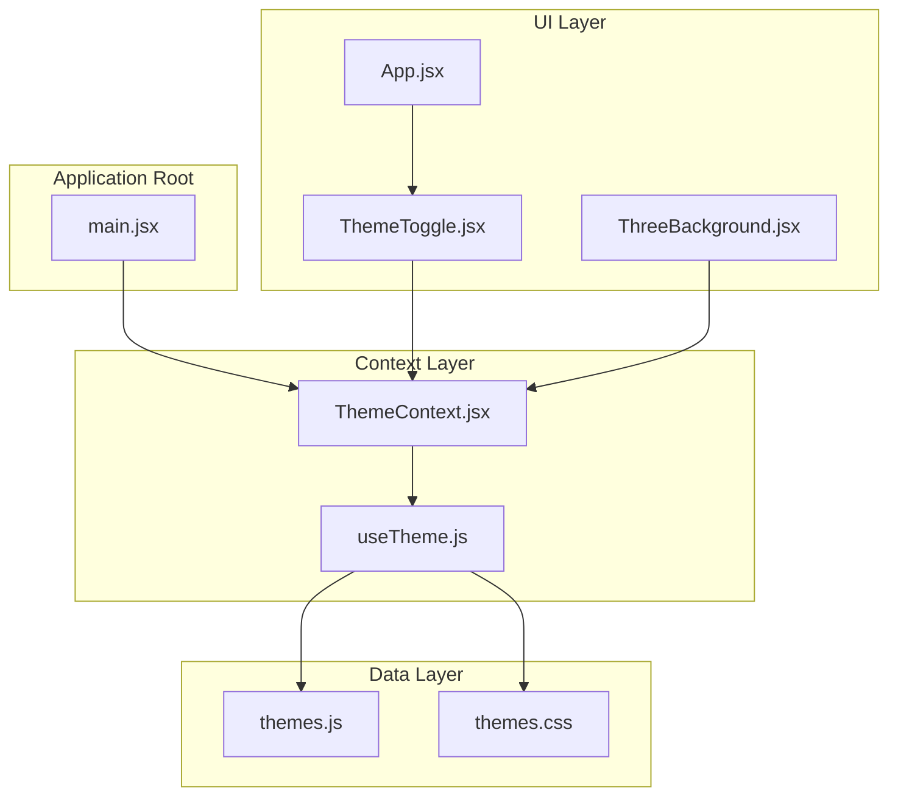
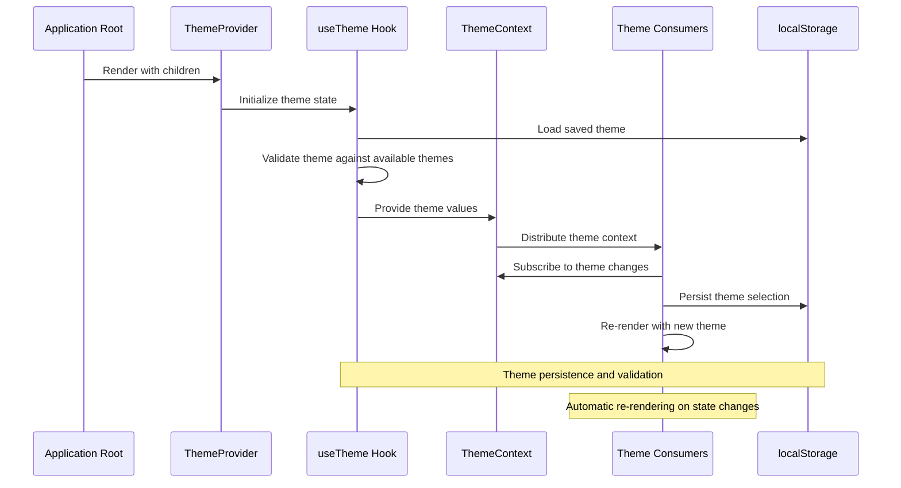
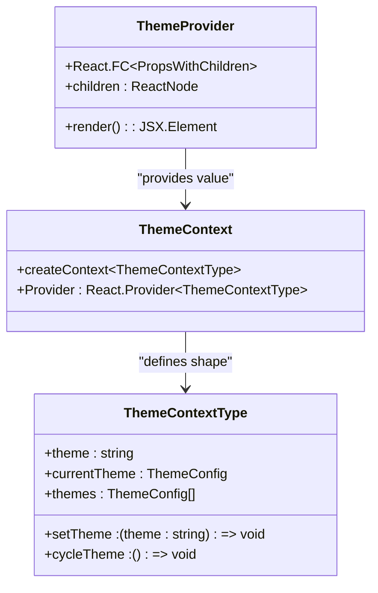
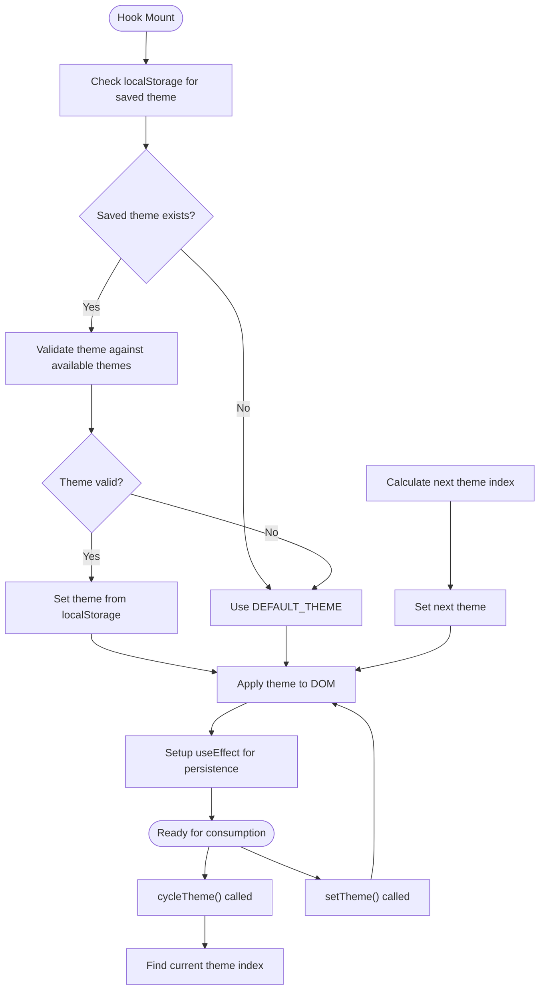
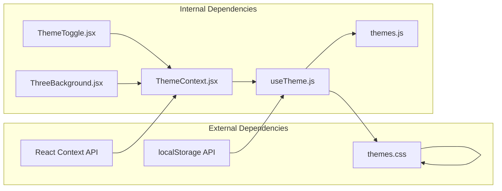

# Theme Context Implementation

<cite>
**Referenced Files in This Document**
- [ThemeContext.jsx](file://src/context/ThemeContext.jsx)
- [useTheme.js](file://src/hooks/useTheme.js)
- [themes.js](file://src/data/themes.js)
- [ThemeToggle.jsx](file://src/components/ui/ThemeToggle.jsx)
- [ThreeBackground.jsx](file://src/components/ui/ThreeBackground.jsx)
- [App.jsx](file://src/App.jsx)
- [main.jsx](file://src/main.jsx)
- [themes.css](file://src/styles/themes.css)
</cite>

## Table of Contents
1. [Introduction](#introduction)
2. [Project Structure](#project-structure)
3. [Core Components](#core-components)
4. [Architecture Overview](#architecture-overview)
5. [Detailed Component Analysis](#detailed-component-analysis)
6. [Dependency Analysis](#dependency-analysis)
7. [Performance Considerations](#performance-considerations)
8. [Troubleshooting Guide](#troubleshooting-guide)
9. [Conclusion](#conclusion)

## Introduction

This document provides comprehensive documentation for the theme context system implemented in the portfolio project. The system leverages React's Context API to manage global theme state, enabling seamless theme switching with persistent storage and dynamic UI updates. The implementation follows modern React patterns with custom hooks, proper error handling, and efficient state management.

The theme system supports multiple color schemes with CSS custom properties, providing a cohesive design language across all components while maintaining optimal performance through strategic context usage.

## Project Structure

The theme context system is organized across several key files that work together to provide a robust theme management solution:

**Diagram sources**
- [ThemeContext.jsx:1-23](file://src/context/ThemeContext.jsx#L1-L23)
- [useTheme.js:1-33](file://src/hooks/useTheme.js#L1-L33)
- [themes.js:1-30](file://src/data/themes.js#L1-L30)
- [main.jsx:1-16](file://src/main.jsx#L1-L16)

**Section sources**
- [ThemeContext.jsx:1-23](file://src/context/ThemeContext.jsx#L1-L23)
- [useTheme.js:1-33](file://src/hooks/useTheme.js#L1-L33)
- [themes.js:1-30](file://src/data/themes.js#L1-L30)
- [main.jsx:1-16](file://src/main.jsx#L1-L16)

## Core Components

The theme context system consists of four primary components that work together to provide comprehensive theme management:

### ThemeProvider Component
The ThemeProvider serves as the central context provider that wraps the entire application, making theme state available to all child components through React's Context API.

### useTheme Custom Hook
The useTheme hook encapsulates all theme-related logic, including state initialization, persistence, and theme cycling functionality.

### ThemeContext Module
This module defines the React Context and provides a custom hook for consuming theme values with proper error handling.

### Theme Consumer Components
Components like ThemeToggle and ThreeBackground demonstrate practical usage of the theme context for UI updates and dynamic styling.

**Section sources**
- [ThemeContext.jsx:6-22](file://src/context/ThemeContext.jsx#L6-L22)
- [useTheme.js:4-32](file://src/hooks/useTheme.js#L4-L32)
- [themes.js:2-29](file://src/data/themes.js#L2-L29)

## Architecture Overview

The theme context system follows a layered architecture pattern that separates concerns and maintains clean component boundaries:

**Diagram sources**
- [main.jsx:9-15](file://src/main.jsx#L9-L15)
- [ThemeContext.jsx:6-13](file://src/context/ThemeContext.jsx#L6-L13)
- [useTheme.js:5-21](file://src/hooks/useTheme.js#L5-L21)

The architecture ensures that theme changes propagate efficiently throughout the component tree while maintaining optimal performance through selective re-rendering.

## Detailed Component Analysis

### ThemeProvider Implementation

The ThemeProvider component demonstrates the classic context provider pattern, wrapping the application with theme state management:

**Diagram sources**
- [ThemeContext.jsx:4-13](file://src/context/ThemeContext.jsx#L4-L13)

The provider pattern ensures that all components within the application tree have access to theme functionality without requiring explicit prop drilling.

**Section sources**
- [ThemeContext.jsx:6-13](file://src/context/ThemeContext.jsx#L6-L13)

### useTheme Hook Functionality

The useTheme hook encapsulates sophisticated theme management logic with multiple responsibilities:

#### State Initialization and Persistence
The hook implements intelligent state initialization that checks for existing theme preferences in localStorage and validates them against available themes.

#### Theme Switching Mechanism
The hook provides both programmatic theme setting and automatic cycling through available themes.

#### CSS Integration
The hook applies theme changes to the HTML element's data-theme attribute, enabling CSS custom property-based theming.

**Diagram sources**
- [useTheme.js:5-31](file://src/hooks/useTheme.js#L5-L31)

**Section sources**
- [useTheme.js:4-32](file://src/hooks/useTheme.js#L4-L32)

### Theme Context Module

The ThemeContext module implements the React Context API with proper error handling and separation of concerns:

#### Context Creation and Provider
The module creates a typed context and provides a dedicated provider component that injects theme values into the component tree.

#### Custom Hook Implementation
The useThemeContext hook provides safe access to theme values with comprehensive error handling for misuse scenarios.

#### Error Handling Strategy
The custom hook throws descriptive errors when used outside of the ThemeProvider, preventing runtime issues and providing clear guidance to developers.

**Section sources**
- [ThemeContext.jsx:1-23](file://src/context/ThemeContext.jsx#L1-L23)

### Theme Consumer Components

Two primary consumer components demonstrate different approaches to theme context usage:

#### ThemeToggle Component
The ThemeToggle component showcases interactive theme switching with a sophisticated UI that includes:
- Theme picker interface with animated transitions
- Outside-click detection for closing the picker
- Real-time theme previews with visual indicators
- Smooth animations using Framer Motion

#### ThreeBackground Component
The ThreeBackground component demonstrates advanced theme integration with:
- Dynamic color extraction from CSS custom properties
- Real-time theme updates through useEffect dependencies
- Performance-conscious rendering with cleanup functions
- Integration with external libraries (Three.js) for dynamic visuals

**Section sources**
- [ThemeToggle.jsx:1-113](file://src/components/ui/ThemeToggle.jsx#L1-L113)
- [ThreeBackground.jsx:1-184](file://src/components/ui/ThreeBackground.jsx#L1-L184)

### Theme Data Management

The theme system utilizes structured data management through the themes.js module:

#### Theme Configuration Structure
Each theme definition includes:
- Unique key for programmatic identification
- Human-readable label for UI display
- Preview color for visual selection
- Dark mode indicator for accessibility considerations

#### Default Theme Selection
The system establishes a sensible default theme while maintaining flexibility for user customization.

**Section sources**
- [themes.js:2-29](file://src/data/themes.js#L2-L29)

### CSS Theme Implementation

The themes.css file implements a comprehensive CSS custom property system that responds to the data-theme attribute:

#### CSS Custom Properties
Each theme defines a complete palette of CSS variables for backgrounds, text, accents, borders, and shadows.

#### Theme-Specific Styles
Individual theme blocks apply different color schemes while maintaining consistent design tokens.

#### Performance Optimizations
The CSS includes transition optimizations and reduced motion support for accessibility compliance.

**Section sources**
- [themes.css:1-395](file://src/styles/themes.css#L1-L395)

## Dependency Analysis

The theme context system exhibits well-structured dependencies that promote maintainability and scalability:

**Diagram sources**
- [ThemeContext.jsx:1](file://src/context/ThemeContext.jsx#L1)
- [useTheme.js:1](file://src/hooks/useTheme.js#L1)
- [ThemeToggle.jsx:1](file://src/components/ui/ThemeToggle.jsx#L1)
- [ThreeBackground.jsx:1](file://src/components/ui/ThreeBackground.jsx#L1)

The dependency graph reveals a clean separation of concerns where the context layer depends on the hook layer, which in turn manages data and CSS integration independently.

**Section sources**
- [ThemeContext.jsx:1-2](file://src/context/ThemeContext.jsx#L1-L2)
- [useTheme.js:1-2](file://src/hooks/useTheme.js#L1-L2)

## Performance Considerations

The theme context system implements several performance optimizations to ensure smooth user experience:

### Efficient Context Updates
- Minimal re-rendering through selective context distribution
- Stable context values that don't change frequently
- Proper dependency arrays in useEffect hooks

### Memory Management
- Cleanup functions in useEffect for event listeners and observers
- Proper disposal of Three.js resources and animation frames
- Timeout cleanup for delayed operations

### Storage Optimization
- Single localStorage write operation per theme change
- Validation prevents unnecessary updates
- Efficient theme cycling algorithm

### Rendering Performance
- CSS transitions handle visual changes efficiently
- Reduced motion support for accessibility
- Optimized animation timing and easing functions

### Bundle Size Impact
- Minimal overhead from context usage
- Lazy loading for heavy components (ThreeBackground)
- Tree-shaking compatibility for unused features

## Troubleshooting Guide

Common issues and solutions when working with the theme context system:

### Context Consumer Errors
**Problem**: Components throw "useThemeContext must be used within a ThemeProvider" errors
**Solution**: Ensure all components using theme context are wrapped in ThemeProvider
**Prevention**: Verify main.jsx includes ThemeProvider around the App component

### Theme Persistence Issues
**Problem**: Theme selections reset on page refresh
**Solution**: Check browser localStorage availability and permissions
**Prevention**: Implement proper error handling for storage operations

### CSS Theme Not Applying
**Problem**: Theme changes don't reflect in component styling
**Solution**: Verify data-theme attribute is set on HTML element
**Prevention**: Ensure useEffect runs and applies theme attribute correctly

### Performance Issues
**Problem**: Slow theme switching or excessive re-renders
**Solution**: Review component dependency arrays and optimize expensive computations
**Prevention**: Use useMemo and useCallback for expensive operations

**Section sources**
- [ThemeContext.jsx:18-20](file://src/context/ThemeContext.jsx#L18-L20)
- [useTheme.js:17-21](file://src/hooks/useTheme.js#L17-L21)

## Conclusion

The theme context system demonstrates a mature implementation of React's Context API with comprehensive state management, error handling, and performance optimization. The system successfully balances developer experience with runtime efficiency while providing a flexible foundation for future enhancements.

Key strengths of the implementation include:
- Clean separation of concerns through modular architecture
- Robust error handling with descriptive messages
- Efficient state management with localStorage persistence
- Comprehensive theming system with CSS custom properties
- Performance-conscious design with proper cleanup and optimization

The system serves as an excellent example of modern React patterns and can serve as a foundation for more complex state management scenarios while maintaining simplicity and maintainability.