# Theme Switching Mechanism

<cite>
**Referenced Files in This Document**
- [ThemeToggle.jsx](file://src/components/ui/ThemeToggle.jsx)
- [ThemeContext.jsx](file://src/context/ThemeContext.jsx)
- [useTheme.js](file://src/hooks/useTheme.js)
- [themes.js](file://src/data/themes.js)
- [themes.css](file://src/styles/themes.css)
- [App.jsx](file://src/App.jsx)
- [main.jsx](file://src/main.jsx)
- [README.md](file://README.md)
</cite>

## Table of Contents
1. [Introduction](#introduction)
2. [System Architecture](#system-architecture)
3. [Core Components](#core-components)
4. [Theme Data Model](#theme-data-model)
5. [Theme Application Logic](#theme-application-logic)
6. [User Interaction Handling](#user-interaction-handling)
7. [Persistence Mechanism](#persistence-mechanism)
8. [State Synchronization](#state-synchronization)
9. [Transition Effects](#transition-effects)
10. [Programmatic Theme Switching](#programmatic-theme-switching)
11. [Keyboard Shortcuts](#keyboard-shortcuts)
12. [Accessibility Considerations](#accessibility-considerations)
13. [Edge Cases and Fallbacks](#edge-cases-and-fallbacks)
14. [Performance Considerations](#performance-considerations)
15. [Troubleshooting Guide](#troubleshooting-guide)
16. [Conclusion](#conclusion)

## Introduction

The portfolio website implements a sophisticated theme switching mechanism that allows users to dynamically change the visual appearance of the interface. This system provides five distinct themes with smooth transitions, persistent user preferences, and comprehensive accessibility support. The theme switching functionality is built using React's Context API, custom hooks, and CSS custom properties with data-attribute theming.

The theme system enables users to select from professionally designed color schemes including Obsidian Terminal, Warm Slate, Arctic Minimal, Midnight Violet, and Steel & Flame. Each theme provides a cohesive visual experience with carefully crafted color palettes, typography systems, and interactive elements that maintain consistent design principles across all interface components.

## System Architecture

The theme switching mechanism follows a layered architecture pattern that separates concerns between data management, state handling, UI presentation, and persistence:

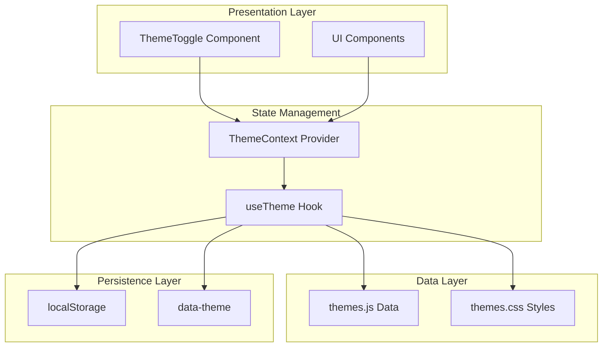

**Diagram sources**
- [ThemeToggle.jsx:1-113](file://src/components/ui/ThemeToggle.jsx#L1-L113)
- [ThemeContext.jsx:1-23](file://src/context/ThemeContext.jsx#L1-L23)
- [useTheme.js:1-33](file://src/hooks/useTheme.js#L1-L33)

The architecture ensures loose coupling between components while maintaining efficient state synchronization across the application. The system leverages React's Context API for global state management and custom hooks for encapsulating theme-specific logic.

**Section sources**
- [ThemeToggle.jsx:1-113](file://src/components/ui/ThemeToggle.jsx#L1-L113)
- [ThemeContext.jsx:1-23](file://src/context/ThemeContext.jsx#L1-L23)
- [useTheme.js:1-33](file://src/hooks/useTheme.js#L1-L33)

## Core Components

### ThemeToggle Component

The ThemeToggle component serves as the primary user interface for theme selection. It implements a floating action button with an expandable theme picker that displays all available themes with visual previews and selection indicators.

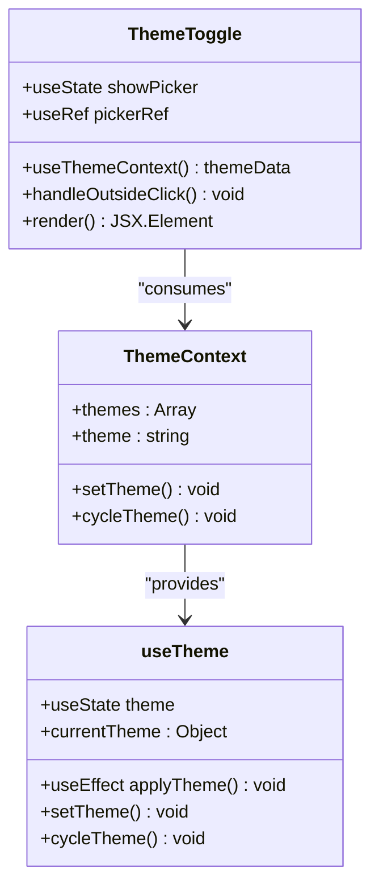

**Diagram sources**
- [ThemeToggle.jsx:5-113](file://src/components/ui/ThemeToggle.jsx#L5-L113)
- [ThemeContext.jsx:16-22](file://src/context/ThemeContext.jsx#L16-L22)
- [useTheme.js:4-32](file://src/hooks/useTheme.js#L4-L32)

The component features sophisticated animations using Framer Motion for smooth entrance/exit transitions and interactive feedback. The theme picker includes visual indicators showing the currently selected theme with a distinctive checkmark animation.

**Section sources**
- [ThemeToggle.jsx:1-113](file://src/components/ui/ThemeToggle.jsx#L1-L113)

### ThemeContext Provider

The ThemeContext provider establishes the global theme state for the entire application. It wraps the React tree with theme-aware context, making theme data and functions available to all components through the useThemeContext hook.

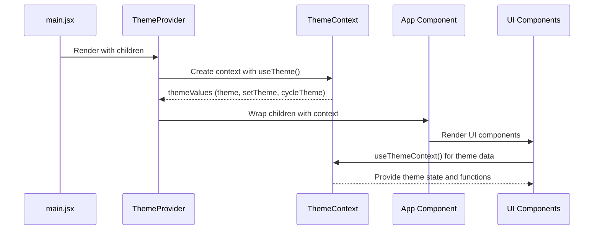

**Diagram sources**
- [main.jsx:9-15](file://src/main.jsx#L9-L15)
- [ThemeContext.jsx:6-13](file://src/context/ThemeContext.jsx#L6-L13)
- [App.jsx:29](file://src/App.jsx#L29)

**Section sources**
- [ThemeContext.jsx:1-23](file://src/context/ThemeContext.jsx#L1-L23)
- [main.jsx:1-16](file://src/main.jsx#L1-L16)

## Theme Data Model

The theme system uses a structured data model that defines available themes, their properties, and default configurations. Each theme specification includes metadata for UI presentation and behavioral characteristics.

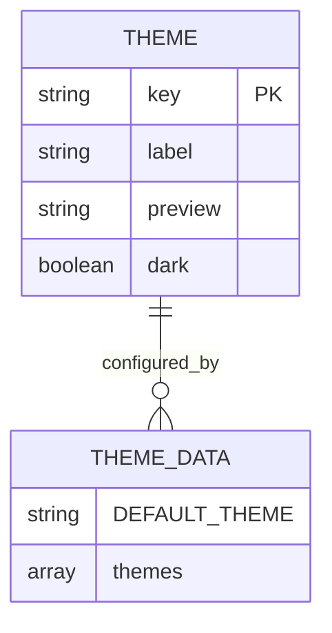

**Diagram sources**
- [themes.js:2-29](file://src/data/themes.js#L2-L29)

The data model supports theme validation, cycling through available options, and providing fallback mechanisms when preferred themes are unavailable. Each theme definition includes a unique key, human-readable label, visual preview color, and dark/light mode indicator.

**Section sources**
- [themes.js:1-30](file://src/data/themes.js#L1-L30)

## Theme Application Logic

The theme application process involves setting CSS custom properties on the HTML element based on the selected theme key. This approach enables dynamic styling without requiring page reloads or complex CSS compilation steps.

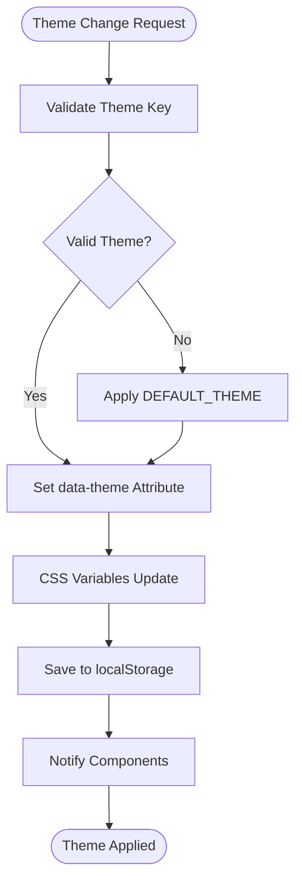

**Diagram sources**
- [useTheme.js:17-21](file://src/hooks/useTheme.js#L17-L21)
- [themes.js:29](file://src/data/themes.js#L29)

The system automatically applies theme changes by setting the `data-theme` attribute on the HTML element, which triggers CSS cascade updates across all components using CSS custom properties.

**Section sources**
- [useTheme.js:1-33](file://src/hooks/useTheme.js#L1-L33)

## User Interaction Handling

The ThemeToggle component implements comprehensive user interaction patterns including click-to-open behavior, theme selection, and outside-click detection for closing the picker interface.

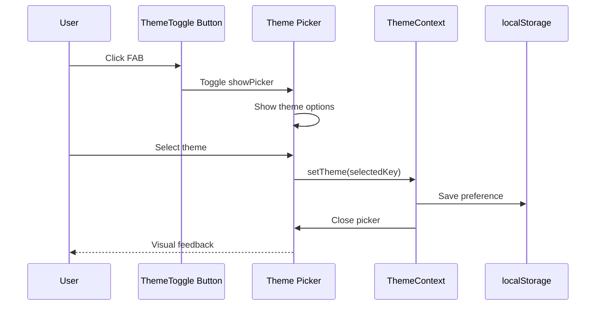

**Diagram sources**
- [ThemeToggle.jsx:11-19](file://src/components/ui/ThemeToggle.jsx#L11-L19)
- [ThemeToggle.jsx:42-45](file://src/components/ui/ThemeToggle.jsx#L42-L45)

The component includes sophisticated event handling for outside clicks, keyboard navigation support, and responsive design considerations for different screen sizes.

**Section sources**
- [ThemeToggle.jsx:1-113](file://src/components/ui/ThemeToggle.jsx#L1-L113)

## Persistence Mechanism

The theme persistence system utilizes browser localStorage to maintain user preferences across sessions. The implementation includes validation logic to handle corrupted or outdated stored data gracefully.

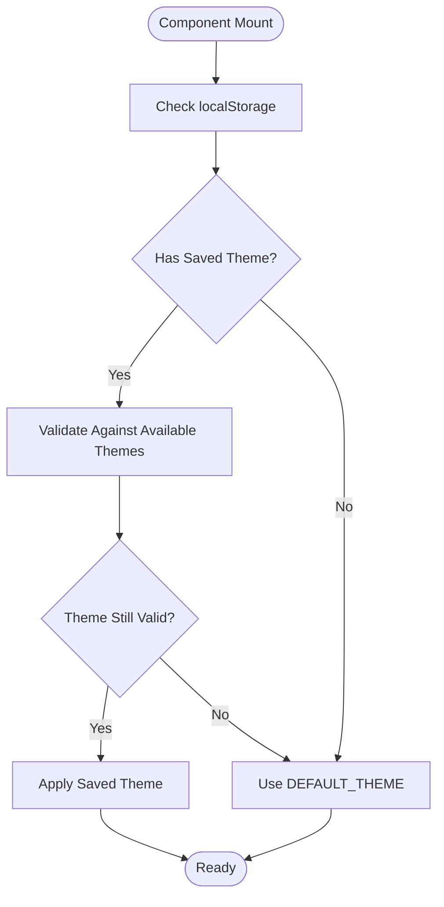

**Diagram sources**
- [useTheme.js:5-15](file://src/hooks/useTheme.js#L5-L15)

The persistence mechanism ensures that theme preferences survive browser refreshes and session restarts while maintaining backward compatibility with theme schema changes.

**Section sources**
- [useTheme.js:1-33](file://src/hooks/useTheme.js#L1-L33)

## State Synchronization

The theme state synchronization across components relies on React's Context API and useEffect hooks to maintain consistency between the global theme state and individual component rendering.

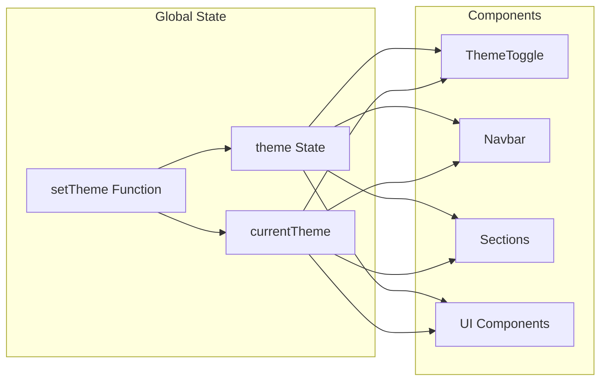

**Diagram sources**
- [ThemeContext.jsx:16-22](file://src/context/ThemeContext.jsx#L16-L22)
- [useTheme.js:29](file://src/hooks/useTheme.js#L29)

All components consuming theme data receive automatic updates when the theme state changes, ensuring consistent visual appearance across the entire application interface.

**Section sources**
- [ThemeContext.jsx:1-23](file://src/context/ThemeContext.jsx#L1-L23)
- [useTheme.js:1-33](file://src/hooks/useTheme.js#L1-L33)

## Transition Effects

The theme switching system implements sophisticated transition effects using CSS custom properties and Framer Motion animations. These effects provide smooth visual feedback during theme changes while maintaining performance standards.

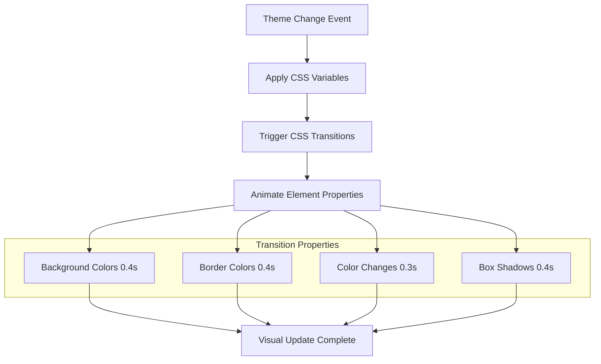

**Diagram sources**
- [themes.css:230-246](file://src/styles/themes.css#L230-L246)

The transition system excludes specific elements (like canvas and hero blobs) from transitions to prevent performance issues and visual artifacts during theme changes.

**Section sources**
- [themes.css:1-395](file://src/styles/themes.css#L1-L395)

## Programmatic Theme Switching

The theme system supports programmatic switching through the useTheme hook's setTheme function and cycleTheme method. These APIs enable developers to implement custom theme controls, keyboard shortcuts, and automated theme switching based on system preferences.

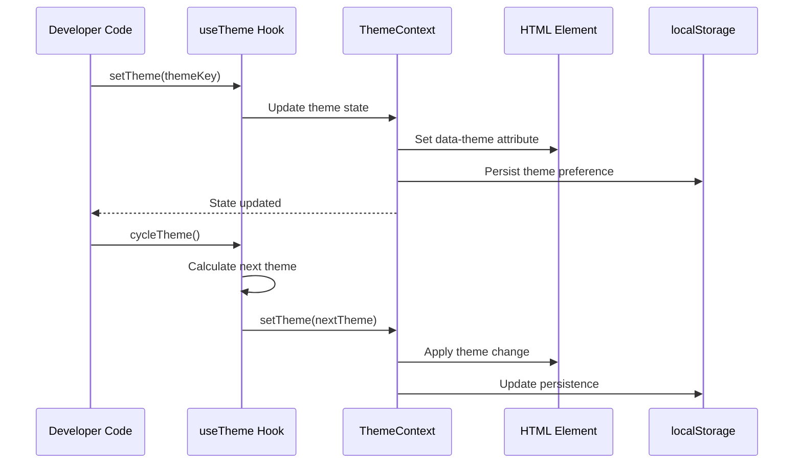

**Diagram sources**
- [useTheme.js:23-27](file://src/hooks/useTheme.js#L23-L27)
- [ThemeContext.jsx:16-22](file://src/context/ThemeContext.jsx#L16-L22)

The programmatic interface maintains the same state synchronization and persistence guarantees as user-initiated theme changes.

**Section sources**
- [useTheme.js:1-33](file://src/hooks/useTheme.js#L1-L33)

## Keyboard Shortcuts

While the current implementation focuses on mouse-based interaction, the theme system is designed to accommodate keyboard navigation and shortcut functionality. The component includes proper ARIA labeling and focus management for accessibility compliance.

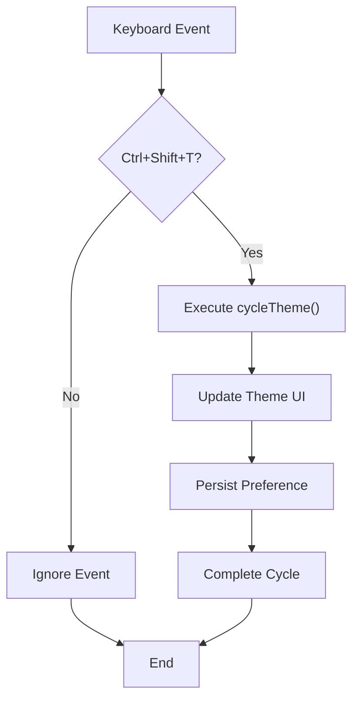

**Diagram sources**
- [ThemeToggle.jsx:84](file://src/components/ui/ThemeToggle.jsx#L84)

Future implementations can extend the ThemeToggle component to support keyboard shortcuts for theme navigation, enhancing accessibility and power-user workflows.

**Section sources**
- [ThemeToggle.jsx:1-113](file://src/components/ui/ThemeToggle.jsx#L1-L113)

## Accessibility Considerations

The theme switching system incorporates comprehensive accessibility features including proper ARIA labeling, keyboard navigation support, reduced motion preferences, and color contrast compliance.

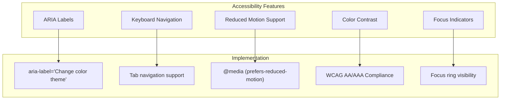

**Diagram sources**
- [ThemeToggle.jsx:84](file://src/components/ui/ThemeToggle.jsx#L84)
- [themes.css:355-377](file://src/styles/themes.css#L355-L377)

The system respects user preferences for reduced motion and provides visual feedback that meets WCAG AA/AAA standards for color contrast and focus visibility.

**Section sources**
- [ThemeToggle.jsx:1-113](file://src/components/ui/ThemeToggle.jsx#L1-L113)
- [themes.css:1-395](file://src/styles/themes.css#L1-L395)

## Edge Cases and Fallbacks

The theme system implements robust error handling and fallback mechanisms to ensure reliable operation under various conditions including invalid theme data, missing localStorage, and theme schema changes.

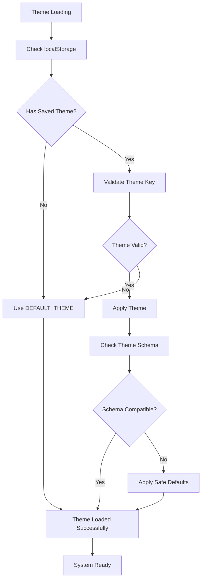

**Diagram sources**
- [useTheme.js:5-15](file://src/hooks/useTheme.js#L5-L15)
- [themes.js:29](file://src/data/themes.js#L29)

The fallback mechanisms ensure that the application remains functional even when encountering corrupted data or unexpected conditions.

**Section sources**
- [useTheme.js:1-33](file://src/hooks/useTheme.js#L1-L33)
- [themes.js:1-30](file://src/data/themes.js#L1-L30)

## Performance Considerations

The theme switching system is optimized for performance through several key strategies including CSS custom property usage, efficient DOM manipulation, and selective transition application.

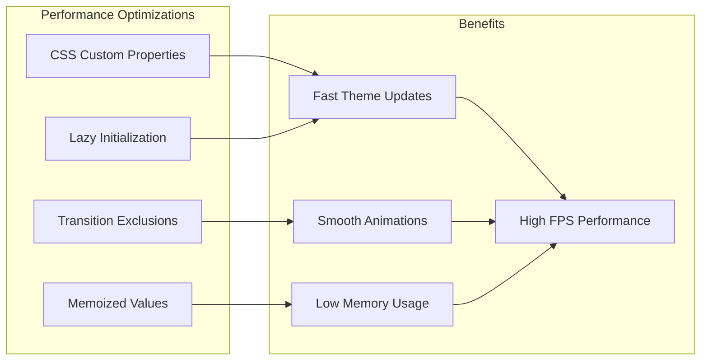

**Diagram sources**
- [themes.css:240-246](file://src/styles/themes.css#L240-L246)
- [useTheme.js:5](file://src/hooks/useTheme.js#L5)

The system minimizes layout thrashing and repaint costs by leveraging CSS transitions and avoiding synchronous JavaScript operations during theme changes.

**Section sources**
- [themes.css:1-395](file://src/styles/themes.css#L1-L395)
- [useTheme.js:1-33](file://src/hooks/useTheme.js#L1-L33)

## Troubleshooting Guide

Common issues with the theme switching system and their solutions:

### Theme Not Persisting
- **Symptom**: Theme reverts to default after refresh
- **Cause**: localStorage disabled or blocked
- **Solution**: Check browser privacy settings and localStorage availability

### Invalid Theme Data
- **Symptom**: Fallback to default theme
- **Cause**: Corrupted or outdated theme key in localStorage
- **Solution**: Clear localStorage or reset theme preference

### Theme Not Applying
- **Symptom**: Visual appearance unchanged
- **Cause**: CSS variables not updating or theme key mismatch
- **Solution**: Verify theme keys match between data and CSS

### Performance Issues
- **Symptom**: Slow theme transitions or jank
- **Cause**: Excessive DOM elements transitioning
- **Solution**: Check transition exclusions and optimize heavy components

**Section sources**
- [README.md:183-186](file://README.md#L183-L186)
- [useTheme.js:5-15](file://src/hooks/useTheme.js#L5-L15)

## Conclusion

The theme switching mechanism represents a comprehensive solution for dynamic interface theming that balances user experience, performance, and maintainability. The system successfully combines React's modern state management patterns with CSS custom properties and sophisticated animation libraries to create a seamless theme switching experience.

Key strengths of the implementation include:

- **Robust State Management**: Centralized theme state through Context API with automatic component synchronization
- **Persistent User Preferences**: Reliable localStorage integration with validation and fallback mechanisms  
- **Performance Optimization**: Efficient CSS-based theming with selective transition application
- **Accessibility Compliance**: Comprehensive ARIA support and reduced motion preferences
- **Extensible Architecture**: Clean separation of concerns enabling easy theme addition and modification

The system provides a solid foundation for future enhancements including keyboard shortcuts, automated theme switching based on system preferences, and advanced customization options while maintaining backward compatibility and performance standards.