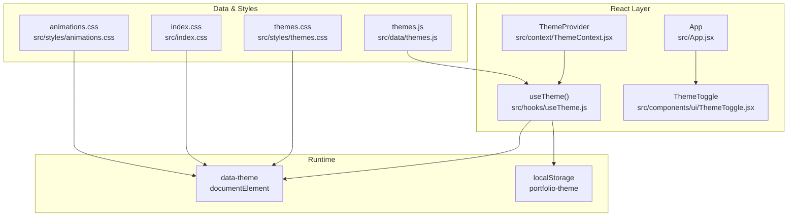
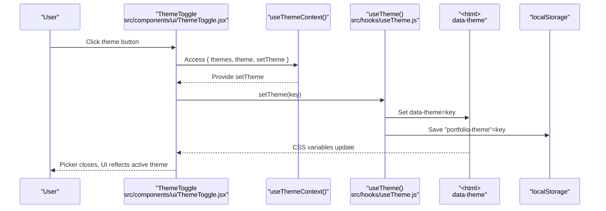
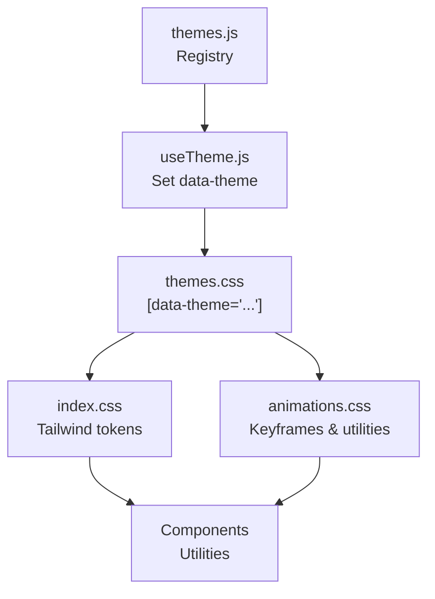
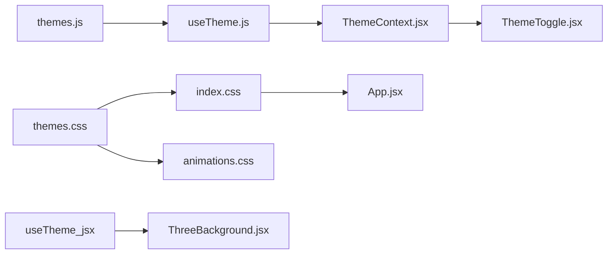

# Theme System

<cite>
**Referenced Files in This Document**
- [ThemeContext.jsx](file://src/context/ThemeContext.jsx)
- [useTheme.js](file://src/hooks/useTheme.js)
- [themes.js](file://src/data/themes.js)
- [themes.css](file://src/styles/themes.css)
- [animations.css](file://src/styles/animations.css)
- [index.css](file://src/index.css)
- [ThemeToggle.jsx](file://src/components/ui/ThemeToggle.jsx)
- [ThreeBackground.jsx](file://src/components/ui/ThreeBackground.jsx)
- [main.jsx](file://src/main.jsx)
- [App.jsx](file://src/App.jsx)
- [package.json](file://package.json)
</cite>

## Table of Contents
1. [Introduction](#introduction)
2. [Project Structure](#project-structure)
3. [Core Components](#core-components)
4. [Architecture Overview](#architecture-overview)
5. [Detailed Component Analysis](#detailed-component-analysis)
6. [Dependency Analysis](#dependency-analysis)
7. [Performance Considerations](#performance-considerations)
8. [Troubleshooting Guide](#troubleshooting-guide)
9. [Conclusion](#conclusion)
10. [Appendices](#appendices)

## Introduction
This document explains the portfolio’s theme system: how themes are defined, applied, and switched; how CSS variables power the design system; how animations integrate with theme transitions; and how persistence works. It also documents the five pre-built themes, the configuration process for adding new themes, and customization strategies. Finally, it covers performance characteristics and browser compatibility considerations.

## Project Structure
The theme system spans React context, a custom hook, static theme metadata, CSS variables, Tailwind theme mapping, and UI controls. The runtime applies the active theme to the document root and persists the selection.

**Diagram sources**
- [ThemeContext.jsx:1-23](file://src/context/ThemeContext.jsx#L1-L23)
- [useTheme.js:1-33](file://src/hooks/useTheme.js#L1-L33)
- [ThemeToggle.jsx:1-113](file://src/components/ui/ThemeToggle.jsx#L1-L113)
- [themes.js:1-30](file://src/data/themes.js#L1-L30)
- [themes.css:1-395](file://src/styles/themes.css#L1-L395)
- [animations.css:1-426](file://src/styles/animations.css#L1-L426)
- [index.css:1-172](file://src/index.css#L1-L172)

**Section sources**
- [ThemeContext.jsx:1-23](file://src/context/ThemeContext.jsx#L1-L23)
- [useTheme.js:1-33](file://src/hooks/useTheme.js#L1-L33)
- [ThemeToggle.jsx:1-113](file://src/components/ui/ThemeToggle.jsx#L1-L113)
- [themes.js:1-30](file://src/data/themes.js#L1-L30)
- [themes.css:1-395](file://src/styles/themes.css#L1-L395)
- [animations.css:1-426](file://src/styles/animations.css#L1-L426)
- [index.css:1-172](file://src/index.css#L1-L172)
- [main.jsx:1-16](file://src/main.jsx#L1-L16)
- [App.jsx:1-47](file://src/App.jsx#L1-L47)

## Core Components
- Theme metadata and defaults: defines available themes, labels, previews, and the default selection.
- Theme provider and hook: manages state, persistence, and DOM attribute updates.
- Theme toggle UI: renders a picker and applies selections.
- CSS variable system: maps theme tokens to CSS custom properties and Tailwind tokens.
- Animations: define transitions and micro-interactions that respect theme colors and motion preferences.

Key responsibilities:
- ThemeContext: exposes theme values to components.
- useTheme: orchestrates state, persistence, and DOM attribute application.
- themes.js: central registry of theme keys and labels.
- themes.css: theme-specific CSS variable blocks and global transitions.
- index.css: bridges CSS variables to Tailwind tokens.
- ThemeToggle: user interface for switching themes.
- ThreeBackground: reads accent color dynamically to animate visuals.

**Section sources**
- [ThemeContext.jsx:1-23](file://src/context/ThemeContext.jsx#L1-L23)
- [useTheme.js:1-33](file://src/hooks/useTheme.js#L1-L33)
- [themes.js:1-30](file://src/data/themes.js#L1-L30)
- [themes.css:1-395](file://src/styles/themes.css#L1-L395)
- [index.css:1-172](file://src/index.css#L1-L172)
- [ThemeToggle.jsx:1-113](file://src/components/ui/ThemeToggle.jsx#L1-L113)
- [ThreeBackground.jsx:1-184](file://src/components/ui/ThreeBackground.jsx#L1-L184)

## Architecture Overview
The theme system follows a unidirectional data flow:
- Initialization reads persisted theme from localStorage.
- The hook sets the HTML data-theme attribute and saves the selection.
- CSS variables change across the page, driven by the active theme.
- Animations and Tailwind utilities consume CSS variables for consistent visuals.
- The ThemeToggle UI allows interactive switching.

**Diagram sources**
- [ThemeToggle.jsx:1-113](file://src/components/ui/ThemeToggle.jsx#L1-L113)
- [useTheme.js:1-33](file://src/hooks/useTheme.js#L1-L33)
- [ThemeContext.jsx:1-23](file://src/context/ThemeContext.jsx#L1-L23)

## Detailed Component Analysis

### Theme Metadata and Defaults
- Theme registry includes keys, human-readable labels, and preview swatches.
- Default theme is defined centrally.
- The hook validates saved theme against the registry to avoid stale values.

Practical implications:
- To add a theme, extend the registry with a new key and label.
- Preview swatches are used in the picker UI.
- Dark mode flag is present for semantic clarity.

**Section sources**
- [themes.js:1-30](file://src/data/themes.js#L1-L30)

### Theme Provider and Context
- ThemeProvider wraps the app and injects theme values via context.
- useThemeContext enforces usage within ThemeProvider.

Design notes:
- Keeps theme logic centralized and composable.
- Prevents accidental misuse outside the provider.

**Section sources**
- [ThemeContext.jsx:1-23](file://src/context/ThemeContext.jsx#L1-L23)

### Theme Hook: State, Persistence, and DOM Attribute
Responsibilities:
- Initialize from localStorage if present and valid.
- Apply data-theme on the document element.
- Persist selection to localStorage.
- Provide cycling and current theme lookup.

Behavior highlights:
- Uses a keyed attribute on <html> to scope theme CSS.
- Validates saved theme against the registry to avoid invalid values.

**Section sources**
- [useTheme.js:1-33](file://src/hooks/useTheme.js#L1-L33)

### Theme Switching UI
- Renders a floating action button and a themed tray.
- Displays all registered themes with preview dots.
- Highlights the active theme and animates selection changes.
- Closes the tray on outside clicks.

Integration:
- Calls setTheme on selection.
- Uses layoutId for smooth cross-theme transitions.

**Section sources**
- [ThemeToggle.jsx:1-113](file://src/components/ui/ThemeToggle.jsx#L1-L113)

### CSS Variable System and Tailwind Bridge
- themes.css defines CSS variables per theme under [data-theme="..."] selectors.
- index.css maps CSS variables to Tailwind tokens for utility classes.
- Global transitions apply smooth color swaps across the UI.
- Motion preferences are respected via media queries.

Implications:
- Changing data-theme updates all CSS variables instantly.
- Tailwind utilities automatically reflect theme changes.
- Transitions exclude animated components to prevent jank.

**Section sources**
- [themes.css:1-395](file://src/styles/themes.css#L1-L395)
- [index.css:1-172](file://src/index.css#L1-L172)

### Animations and Theme Integration
- animations.css defines micro-interactions and keyframes.
- Many effects use CSS variables for colors and timing.
- Global transitions coordinate with theme changes.
- Reduced-motion support disables or minimizes animations.

**Section sources**
- [animations.css:1-426](file://src/styles/animations.css#L1-L426)
- [themes.css:224-377](file://src/styles/themes.css#L224-L377)

### Dynamic Theme Integration Example: Animated Background
- ThreeBackground reads the current accent color from computed styles.
- It updates the animated particle color when the theme changes.
- This ensures dynamic visuals stay in sync with the active theme.

**Section sources**
- [ThreeBackground.jsx:1-184](file://src/components/ui/ThreeBackground.jsx#L1-L184)

### Pre-Built Themes and Palettes
The system ships with five themes. Each defines a distinct palette of backgrounds, surfaces, borders, text, accents, and hover gradients. The following table summarizes each theme’s identity and dominant characteristics.

- Obsidian Terminal
  - Identity: Dark terminal-inspired theme with blue accent.
  - Notable tokens: deep blacks, subtle blues, soft glows.
  - Use case: Developer-focused, low-light environments.

- Warm Slate
  - Identity: Earthy warm tones with amber-orange accent.
  - Notable tokens: warm browns, orange highlights, muted neutrals.
  - Use case: Creative professionals seeking warmth.

- Arctic Minimal
  - Identity: Light theme with clean, minimal aesthetic.
  - Notable tokens: light grays, crisp white, blue accents.
  - Use case: Modern, minimalist portfolios.

- Midnight Violet
  - Identity: Dark with purple-violet accent.
  - Notable tokens: deep purples, violet glows, dark surfaces.
  - Use case: Night owls and creative branding.

- Steel & Flame
  - Identity: Dark with fiery red-orange accent.
  - Notable tokens: deep reds, orange highlights, strong contrast.
  - Use case: Bold, energetic profiles.

Notes:
- The “Arctic Minimal” theme is defined in the CSS but not included in the JavaScript registry. It can be added by extending the registry and ensuring the key matches the CSS selector.

**Section sources**
- [themes.js:1-30](file://src/data/themes.js#L1-L30)
- [themes.css:125-156](file://src/styles/themes.css#L125-L156)

### Adding a New Theme
Steps:
1. Extend the theme registry with a new key, label, and preview swatch.
2. Add a corresponding [data-theme="your-key"] block in themes.css with all required CSS variables.
3. Optionally add hover gradients and brand-specific tokens.
4. Verify Tailwind utilities still work (they rely on CSS variables).
5. Test transitions and reduced-motion behavior.

Validation tips:
- Confirm the key matches the CSS selector.
- Ensure all variables used by Tailwind and animations are defined.
- Test switching to the new theme and confirm persistence.

**Section sources**
- [themes.js:1-30](file://src/data/themes.js#L1-L30)
- [themes.css:1-395](file://src/styles/themes.css#L1-L395)
- [index.css:1-172](file://src/index.css#L1-L172)

### Customizing Existing Themes
Options:
- Adjust base colors: background, surface, raised, borders.
- Modify text palette: primary, secondary, muted.
- Change accent family and hover states.
- Tune typography families and spacing tokens.
- Customize section hover gradients for visual interest.
- Update danger/warning/success tokens for status indicators.

Guidance:
- Keep contrast ratios consistent for accessibility.
- Mirror changes across hover states and glows.
- Validate with reduced-motion settings.

**Section sources**
- [themes.css:1-395](file://src/styles/themes.css#L1-L395)
- [index.css:1-172](file://src/index.css#L1-L172)

### Relationship Between Theme Data, CSS Variables, and Animations
- Theme data drives the active key.
- The hook sets data-theme on <html>.
- themes.css applies variables scoped to that key.
- index.css maps variables to Tailwind tokens.
- animations.css consumes variables for colors and timing.
- Global transitions coordinate color swaps across the UI.

**Diagram sources**
- [themes.js:1-30](file://src/data/themes.js#L1-L30)
- [useTheme.js:1-33](file://src/hooks/useTheme.js#L1-L33)
- [themes.css:1-395](file://src/styles/themes.css#L1-L395)
- [index.css:1-172](file://src/index.css#L1-L172)
- [animations.css:1-426](file://src/styles/animations.css#L1-L426)

## Dependency Analysis
- ThemeContext depends on useTheme.
- ThemeToggle depends on ThemeContext and Framer Motion for animations.
- useTheme depends on themes.js and localStorage.
- themes.css is consumed globally; index.css bridges to Tailwind.
- ThreeBackground depends on computed CSS variables for dynamic color.

**Diagram sources**
- [themes.js:1-30](file://src/data/themes.js#L1-L30)
- [useTheme.js:1-33](file://src/hooks/useTheme.js#L1-L33)
- [ThemeContext.jsx:1-23](file://src/context/ThemeContext.jsx#L1-L23)
- [ThemeToggle.jsx:1-113](file://src/components/ui/ThemeToggle.jsx#L1-L113)
- [themes.css:1-395](file://src/styles/themes.css#L1-L395)
- [index.css:1-172](file://src/index.css#L1-L172)
- [animations.css:1-426](file://src/styles/animations.css#L1-L426)
- [App.jsx:1-47](file://src/App.jsx#L1-L47)
- [ThreeBackground.jsx:1-184](file://src/components/ui/ThreeBackground.jsx#L1-L184)

**Section sources**
- [package.json:1-41](file://package.json#L1-L41)

## Performance Considerations
- CSS variable updates are efficient; they avoid re-rendering React components.
- Global transitions use optimized easing curves and exclude heavy animated elements to prevent jank.
- Reduced-motion media queries minimize or disable animations for user comfort.
- ThreeBackground throttles updates and uses additive blending; it reads accent color with a small delay to ensure CSS updates propagate.
- localStorage access is synchronous but infrequent, occurring on mount and on theme changes.

Recommendations:
- Keep the number of animated elements under [data-animate] minimal.
- Prefer CSS transitions over JS-driven animations when possible.
- Avoid frequent reflows during theme changes; the current approach batches updates via a single attribute change.

**Section sources**
- [themes.css:224-377](file://src/styles/themes.css#L224-L377)
- [animations.css:1-426](file://src/styles/animations.css#L1-L426)
- [ThreeBackground.jsx:168-171](file://src/components/ui/ThreeBackground.jsx#L168-L171)

## Troubleshooting Guide
Common issues and resolutions:
- Theme does not persist across reloads
  - Cause: localStorage disabled or corrupted entry.
  - Fix: Clear the stored key and verify the hook initializes from registry fallback.
  - Validation: Check that the saved key exists in the registry.

- Active theme mismatch after updates
  - Cause: Registry changed without updating persisted key.
  - Fix: The hook validates saved keys; it falls back to default if invalid.

- Picker shows unexpected active state
  - Cause: Theme key mismatch or missing CSS variables.
  - Fix: Ensure the key exists in both registry and CSS.

- Dynamic visuals not updating (e.g., animated background)
  - Cause: Read before CSS variables updated.
  - Fix: The component schedules a delayed read to ensure updates propagate.

- Animations feel sluggish
  - Cause: Overuse of expensive effects or lack of reduced-motion handling.
  - Fix: Review excluded selectors and ensure reduced-motion is respected.

**Section sources**
- [useTheme.js:4-15](file://src/hooks/useTheme.js#L4-L15)
- [useTheme.js:17-21](file://src/hooks/useTheme.js#L17-L21)
- [ThreeBackground.jsx:14-17](file://src/components/ui/ThreeBackground.jsx#L14-L17)
- [ThreeBackground.jsx:168-171](file://src/components/ui/ThreeBackground.jsx#L168-L171)
- [themes.css:240-246](file://src/styles/themes.css#L240-L246)
- [animations.css:355-377](file://src/styles/animations.css#L355-L377)

## Conclusion
The theme system combines a compact registry, a resilient hook, and a robust CSS variable architecture to deliver smooth, customizable experiences. With persistent state, global transitions, and motion-friendly defaults, it balances aesthetics and performance. Extending or modifying themes is straightforward thanks to the clear separation of concerns and Tailwind bridge.

## Appendices

### Practical Examples
- Switching themes programmatically
  - Call setTheme with a valid key from the registry.
  - The hook updates the DOM attribute and persists the choice.

- Creating a new theme variant
  - Add a new key to the registry.
  - Define a [data-theme="your-key"] block in themes.css with all required variables.
  - Test with Tailwind utilities and animations.

- Aligning animations with theme changes
  - Ensure animations consume CSS variables for colors.
  - Exclude rapidly changing elements from global transitions if needed.

- Verifying persistence
  - On load, the hook reads localStorage and validates against the registry.
  - If invalid, it falls back to the default theme.

**Section sources**
- [themes.js:1-30](file://src/data/themes.js#L1-L30)
- [useTheme.js:1-33](file://src/hooks/useTheme.js#L1-L33)
- [themes.css:1-395](file://src/styles/themes.css#L1-L395)
- [index.css:1-172](file://src/index.css#L1-L172)