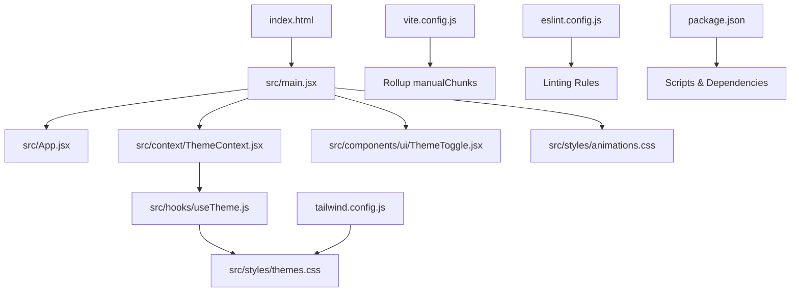
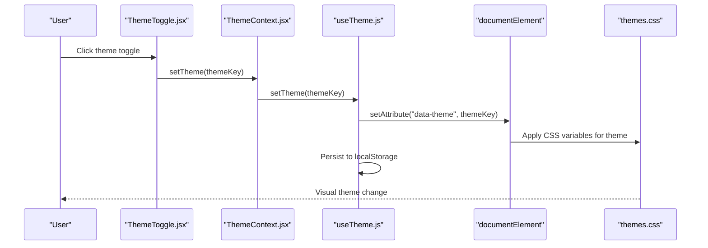
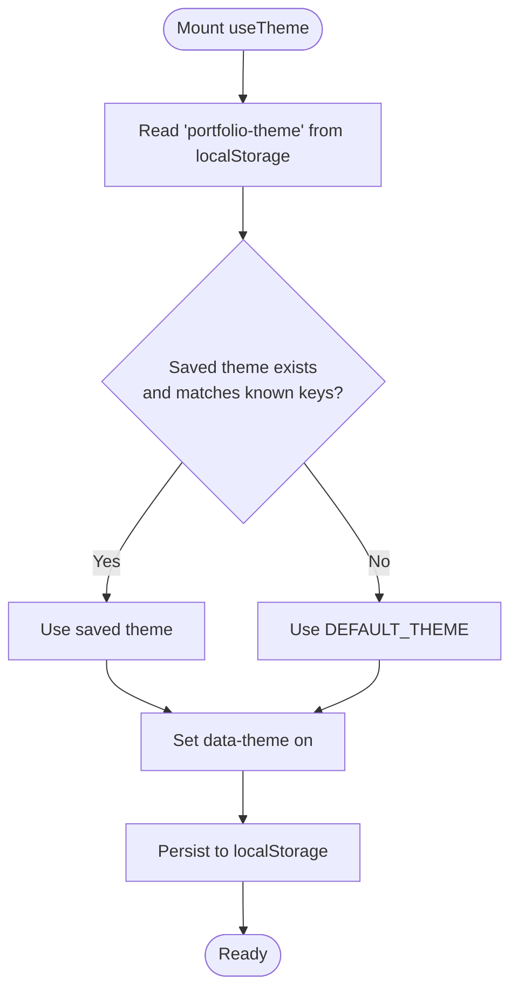
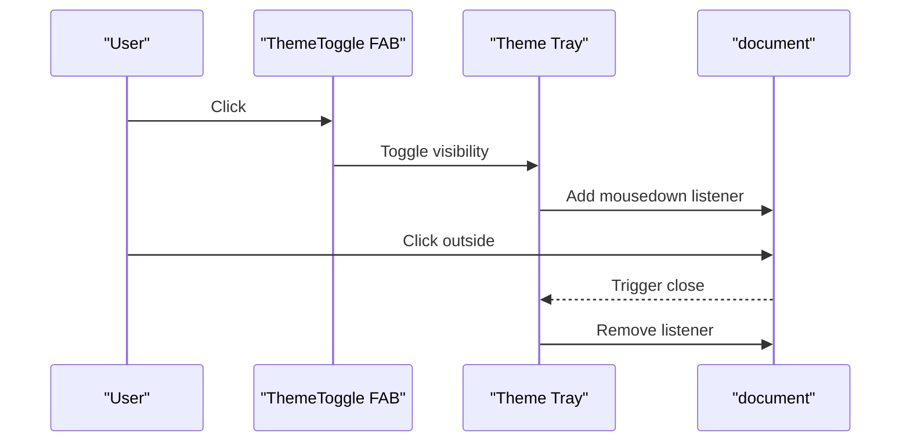
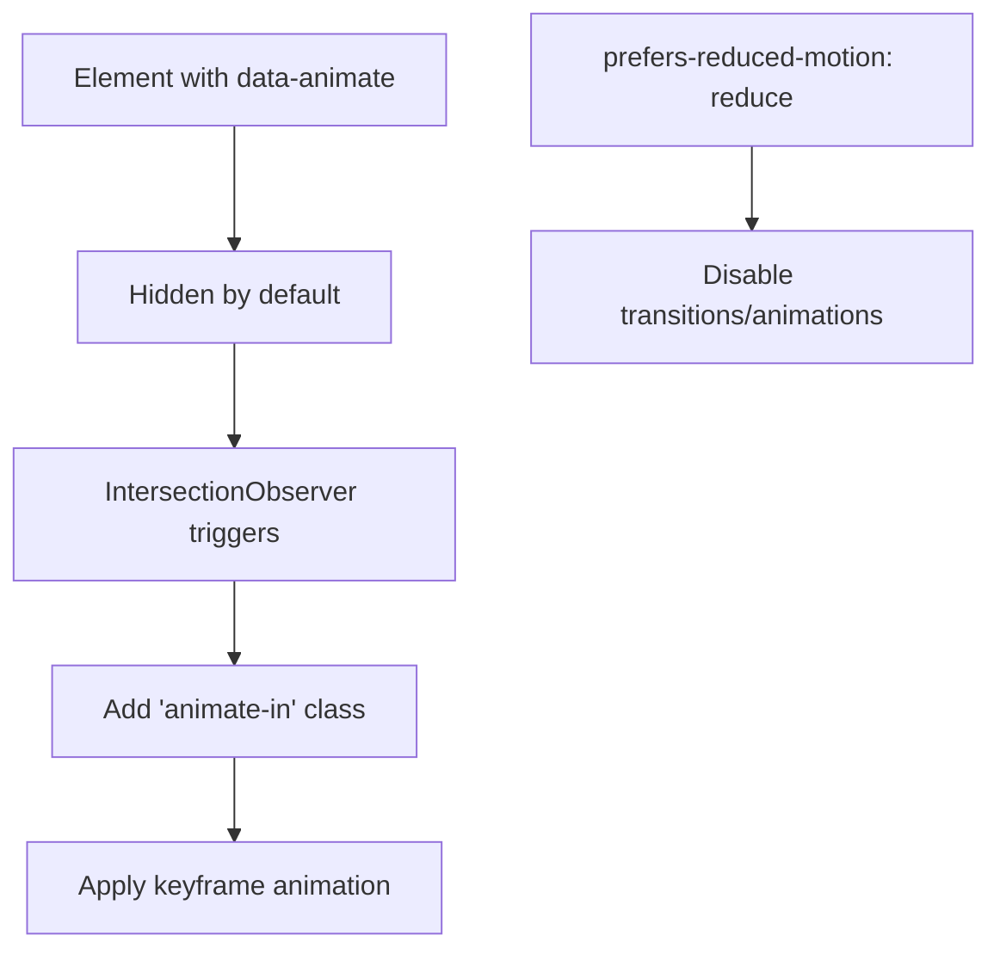
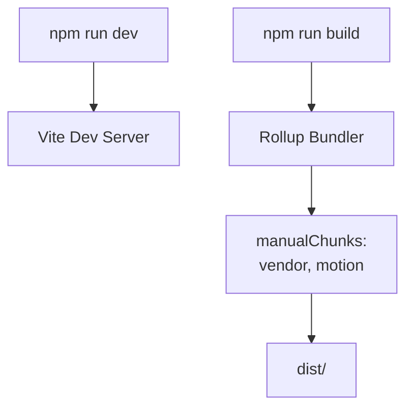

# Troubleshooting & FAQ

<cite>
**Referenced Files in This Document**
- [README.md](file://README.md)
- [QUICK-START.md](file://QUICK-START.md)
- [HOW-TO-ADD-IMAGES.md](file://HOW-TO-ADD-IMAGES.md)
- [README-IMAGES.md](file://README-IMAGES.md)
- [package.json](file://package.json)
- [vite.config.js](file://vite.config.js)
- [tailwind.config.js](file://tailwind.config.js)
- [eslint.config.js](file://eslint.config.js)
- [index.html](file://index.html)
- [src/main.jsx](file://src/main.jsx)
- [src/context/ThemeContext.jsx](file://src/context/ThemeContext.jsx)
- [src/hooks/useTheme.js](file://src/hooks/useTheme.js)
- [src/components/ui/ThemeToggle.jsx](file://src/components/ui/ThemeToggle.jsx)
- [src/styles/themes.css](file://src/styles/themes.css)
- [src/data/themes.js](file://src/data/themes.js)
</cite>

## Table of Contents
1. [Introduction](#introduction)
2. [Project Structure](#project-structure)
3. [Core Components](#core-components)
4. [Architecture Overview](#architecture-overview)
5. [Detailed Component Analysis](#detailed-component-analysis)
6. [Dependency Analysis](#dependency-analysis)
7. [Performance Considerations](#performance-considerations)
8. [Troubleshooting Guide](#troubleshooting-guide)
9. [Conclusion](#conclusion)
10. [Appendices](#appendices)

## Introduction
This document provides a comprehensive troubleshooting and FAQ guide for the portfolio project. It focuses on resolving build failures, dependency conflicts, development server issues, image loading problems, theme persistence, animation performance, browser compatibility, accessibility validation, and deployment troubleshooting. It also includes systematic debugging approaches, error interpretation, resolution workflows, preventive measures, maintenance schedules, and monitoring recommendations.

## Project Structure
The project is a React + Vite + Tailwind CSS + Framer Motion application with a theme system and animations. Key areas relevant to troubleshooting include:
- Build and bundling configuration
- Theme system and persistence
- Animation and motion libraries
- Image assets and fallbacks
- Linting and formatting configuration
- Fonts and CDN connectivity

**Diagram sources**
- [index.html](file://index.html)
- [src/main.jsx](file://src/main.jsx)
- [src/context/ThemeContext.jsx](file://src/context/ThemeContext.jsx)
- [src/hooks/useTheme.js](file://src/hooks/useTheme.js)
- [src/styles/themes.css](file://src/styles/themes.css)
- [src/components/ui/ThemeToggle.jsx](file://src/components/ui/ThemeToggle.jsx)
- [vite.config.js](file://vite.config.js)
- [tailwind.config.js](file://tailwind.config.js)
- [eslint.config.js](file://eslint.config.js)
- [package.json](file://package.json)

**Section sources**
- [README.md](file://README.md)
- [QUICK-START.md](file://QUICK-START.md)
- [package.json](file://package.json)
- [vite.config.js](file://vite.config.js)
- [tailwind.config.js](file://tailwind.config.js)
- [eslint.config.js](file://eslint.config.js)
- [index.html](file://index.html)
- [src/main.jsx](file://src/main.jsx)

## Core Components
- Theme system: Theme persistence via localStorage, CSS variable-based themes, and a theme picker UI.
- Animations: Tailwind utilities and Framer Motion for UI transitions and scroll-triggered animations.
- Build pipeline: Vite with React plugin, path aliases, and Rollup chunk splitting.
- Linting: ESLint flat config with recommended rules for React Hooks and React Refresh.
- Fonts and assets: Google Fonts CDN links and public directory asset serving.

Key implementation references:
- Theme provider and context: [src/context/ThemeContext.jsx](file://src/context/ThemeContext.jsx)
- Theme hook and persistence: [src/hooks/useTheme.js](file://src/hooks/useTheme.js)
- Theme picker UI: [src/components/ui/ThemeToggle.jsx](file://src/components/ui/ThemeToggle.jsx)
- Theme CSS variables and animations: [src/styles/themes.css](file://src/styles/themes.css)
- Theme metadata: [src/data/themes.js](file://src/data/themes.js)
- Entry point and provider wiring: [src/main.jsx](file://src/main.jsx)
- Build configuration: [vite.config.js](file://vite.config.js)
- Tailwind configuration: [tailwind.config.js](file://tailwind.config.js)
- ESLint configuration: [eslint.config.js](file://eslint.config.js)
- Fonts and meta: [index.html](file://index.html)

**Section sources**
- [src/context/ThemeContext.jsx](file://src/context/ThemeContext.jsx)
- [src/hooks/useTheme.js](file://src/hooks/useTheme.js)
- [src/components/ui/ThemeToggle.jsx](file://src/components/ui/ThemeToggle.jsx)
- [src/styles/themes.css](file://src/styles/themes.css)
- [src/data/themes.js](file://src/data/themes.js)
- [src/main.jsx](file://src/main.jsx)
- [vite.config.js](file://vite.config.js)
- [tailwind.config.js](file://tailwind.config.js)
- [eslint.config.js](file://eslint.config.js)
- [index.html](file://index.html)

## Architecture Overview
The runtime architecture ties together the theme system, animations, and build pipeline. The theme is applied at the root via a data attribute and propagated through CSS variables. Animations leverage Tailwind utilities and Framer Motion. The build pipeline splits vendor and motion bundles for performance.

**Diagram sources**
- [src/components/ui/ThemeToggle.jsx](file://src/components/ui/ThemeToggle.jsx)
- [src/context/ThemeContext.jsx](file://src/context/ThemeContext.jsx)
- [src/hooks/useTheme.js](file://src/hooks/useTheme.js)
- [src/styles/themes.css](file://src/styles/themes.css)

## Detailed Component Analysis

### Theme System and Persistence
- Persistence mechanism: The theme is stored in localStorage and restored on mount. It updates the root data attribute to apply CSS variables.
- Validation: On mount, the saved theme is validated against known theme keys.
- Cycle and selection: The hook exposes a cycle function and returns the current theme object for rendering.

**Diagram sources**
- [src/hooks/useTheme.js](file://src/hooks/useTheme.js)
- [src/data/themes.js](file://src/data/themes.js)
- [src/styles/themes.css](file://src/styles/themes.css)

**Section sources**
- [src/hooks/useTheme.js](file://src/hooks/useTheme.js)
- [src/context/ThemeContext.jsx](file://src/context/ThemeContext.jsx)
- [src/data/themes.js](file://src/data/themes.js)
- [src/styles/themes.css](file://src/styles/themes.css)

### Theme Picker UI
- Outside click handling: Adds a global listener to close the picker when clicking outside.
- Framer Motion animations: Uses AnimatePresence and motion primitives for smooth transitions.
- Accessibility: Includes aria-label and title attributes.

**Diagram sources**
- [src/components/ui/ThemeToggle.jsx](file://src/components/ui/ThemeToggle.jsx)

**Section sources**
- [src/components/ui/ThemeToggle.jsx](file://src/components/ui/ThemeToggle.jsx)

### Animations and Motion
- Tailwind animations: Defined keyframes and animation utilities for fade, slide, scale, and gradient effects.
- Scroll-triggered animations: Elements with data-animate attributes are animated via CSS transitions and keyframes.
- Reduced motion: Prefers-reduced-motion media query disables or minimizes animations.

**Diagram sources**
- [src/styles/themes.css](file://src/styles/themes.css)

**Section sources**
- [src/styles/themes.css](file://src/styles/themes.css)

### Build Pipeline and Code Splitting
- Vite configuration: React plugin, path alias, and Rollup manualChunks for vendor and motion bundles.
- Scripts: dev, build, lint, preview.

**Diagram sources**
- [vite.config.js](file://vite.config.js)
- [package.json](file://package.json)

**Section sources**
- [vite.config.js](file://vite.config.js)
- [package.json](file://package.json)

## Dependency Analysis
- Runtime dependencies: React, React DOM, Tailwind merge, clsx, GSAP, @gsap/react, lenis, three, framer-motion, zod, emailjs.
- Dev dependencies: Vite, React plugin, PostCSS, Tailwind CSS v4, autoprefixer, ESLint, globals, types for React/React DOM.
- Scripts: dev, build, lint, preview.

Potential conflict areas:
- Multiple animation libraries (GSAP and Framer Motion) are present; ensure only one is actively used per component to avoid duplication.
- Tailwind CSS v4 plugin and PostCSS setup require careful alignment.

**Section sources**
- [package.json](file://package.json)
- [tailwind.config.js](file://tailwind.config.js)
- [eslint.config.js](file://eslint.config.js)

## Performance Considerations
- Bundle composition: Vendor and motion chunks are separated to optimize caching and loading.
- CSS variables and transitions: Smooth theme transitions are defined with cubic-bezier curves optimized for perceived performance.
- Reduced motion: Respects user preferences to minimize unnecessary animations.
- Image optimization: Guidance for WebP, sizing, and fallbacks to reduce payload and improve CLS.

[No sources needed since this section provides general guidance]

## Troubleshooting Guide

### Build Failures
Symptoms:
- npm run build fails with module resolution or transpilation errors.

Resolution steps:
1. Clear caches and reinstall dependencies:
   - Remove node_modules and lock file, then reinstall.
2. Re-run build:
   - Execute the build script again.
3. Validate Vite and plugin versions:
   - Confirm Vite and @vitejs/plugin-react versions in package.json.
4. Check manualChunks configuration:
   - Ensure Rollup manualChunks in vite.config.js aligns with installed dependencies.

Preventive measures:
- Pin versions in package.json.
- Regularly audit dependencies for breaking changes.
- Keep node and npm versions compatible with Vite 8.

**Section sources**
- [README.md](file://README.md)
- [QUICK-START.md](file://QUICK-START.md)
- [vite.config.js](file://vite.config.js)
- [package.json](file://package.json)

### Dependency Conflicts
Symptoms:
- Duplicate or conflicting packages causing warnings or runtime errors.

Resolution steps:
1. Identify conflicting packages:
   - Review dependency tree and logs.
2. Align versions:
   - Ensure Tailwind CSS v4 plugin and PostCSS versions are compatible.
3. Prefer single animation library:
   - Choose either GSAP or Framer Motion per component to avoid duplication.
4. Reinstall:
   - Delete node_modules and package-lock.json, then reinstall.

Monitoring:
- Periodically run npm outdated and update minor/patch versions.
- Watch for deprecation notices in CI logs.

**Section sources**
- [package.json](file://package.json)
- [tailwind.config.js](file://tailwind.config.js)
- [eslint.config.js](file://eslint.config.js)

### Development Server Problems
Symptoms:
- Dev server does not start, hot reload not working, or port conflicts.

Resolution steps:
1. Start dev server:
   - Run the dev script.
2. Check port availability:
   - Default is 5173; change Vite config if needed.
3. Verify React plugin:
   - Ensure @vitejs/plugin-react is installed and configured.
4. Clear Vite cache:
   - Delete .vite directory if present.

**Section sources**
- [QUICK-START.md](file://QUICK-START.md)
- [package.json](file://package.json)
- [vite.config.js](file://vite.config.js)

### Image Loading Issues
Symptoms:
- Images not appearing in the UI or fallbacks not triggering.

Resolution steps:
1. Verify file paths:
   - Paths are case-sensitive; confirm exact filenames and locations.
2. Check public directory:
   - Place images under public/ and reference them with leading slash.
3. Validate formats and sizes:
   - Use WebP for projects; ensure dimensions and size limits.
4. Test locally:
   - Run dev server and inspect network tab for 404s.
5. Fallback behavior:
   - Components fall back to gradients or placeholders if images are missing.

Preventive measures:
- Use the provided optimization tools and batch conversion commands.
- Maintain a checklist before deployment.

**Section sources**
- [README-IMAGES.md](file://README-IMAGES.md)
- [HOW-TO-ADD-IMAGES.md](file://HOW-TO-ADD-IMAGES.md)
- [README.md](file://README.md)

### Theme Persistence Problems
Symptoms:
- Theme resets after refresh or does not persist across sessions.

Resolution steps:
1. Check localStorage:
   - Ensure browser allows localStorage and it is not disabled.
2. Validate theme keys:
   - Confirm saved key exists in themes.js and CSS variables are defined.
3. Inspect data-theme attribute:
   - Verify <html> has the correct data-theme attribute.
4. Reset and reselect:
   - Clear localStorage manually if corrupted, then reselect a theme.

**Section sources**
- [src/hooks/useTheme.js](file://src/hooks/useTheme.js)
- [src/context/ThemeContext.jsx](file://src/context/ThemeContext.jsx)
- [src/data/themes.js](file://src/data/themes.js)
- [src/styles/themes.css](file://src/styles/themes.css)

### Animation Performance Concerns
Symptoms:
- Choppy animations, jank on scroll, or high CPU usage.

Resolution steps:
1. Reduce motion:
   - Enable prefers-reduced-motion in OS/browser settings.
2. Optimize keyframes:
   - Use GPU-friendly properties (transform/opacity) and cubic-bezier curves.
3. Limit animated elements:
   - Avoid animating heavy DOM nodes; use will-change sparingly.
4. Monitor bundle:
   - Ensure motion chunk is loaded efficiently.

**Section sources**
- [src/styles/themes.css](file://src/styles/themes.css)
- [vite.config.js](file://vite.config.js)

### Browser Compatibility Issues
Symptoms:
- Fonts not loading, animations not playing, or layout shifts.

Resolution steps:
1. Fonts:
   - Confirm Google Fonts link is present in index.html.
2. Animations:
   - Ensure CSS keyframes and transitions are supported; test on target browsers.
3. Polyfills:
   - Add polyfills if targeting older browsers (not included by default).
4. Validate Tailwind darkMode configuration:
   - Confirm data-theme selectors are supported.

**Section sources**
- [index.html](file://index.html)
- [src/styles/themes.css](file://src/styles/themes.css)
- [tailwind.config.js](file://tailwind.config.js)
- [QUICK-START.md](file://QUICK-START.md)

### Accessibility Validation Problems
Symptoms:
- Screen readers misinterpret content, keyboard navigation issues, or low contrast.

Resolution steps:
1. Semantic HTML:
   - Use proper headings, roles, and landmarks.
2. ARIA:
   - Add labels and descriptions where appropriate.
3. Contrast:
   - Maintain WCAG AA/AAA contrast ratios; adjust theme colors if needed.
4. Reduced motion:
   - Respect prefers-reduced-motion; animations are already disabled via media query.

**Section sources**
- [README.md](file://README.md)
- [src/styles/themes.css](file://src/styles/themes.css)

### Deployment Troubleshooting
Symptoms:
- Build succeeds but preview or hosted site looks broken.

Resolution steps:
1. Preview production build:
   - Run preview script locally to simulate production.
2. Static hosting:
   - Ensure base path and asset paths are correct for static hosts.
3. Environment variables:
   - For EmailJS, ensure Vite env variables are configured.
4. CI/CD:
   - Cache node_modules and build artifacts; run lint and build in CI.

**Section sources**
- [README.md](file://README.md)
- [QUICK-START.md](file://QUICK-START.md)
- [package.json](file://package.json)

### Systematic Debugging Approaches
- Reproduce locally first:
  - Use dev server to isolate issues.
- Check console and network tabs:
  - Look for 404s, CORS errors, or eval/script errors.
- Validate configuration files:
  - Compare vite.config.js, tailwind.config.js, and index.html with defaults.
- Test in isolation:
  - Temporarily remove animations or third-party integrations to narrow causes.
- Use preview:
  - npm run preview to emulate production behavior.

**Section sources**
- [vite.config.js](file://vite.config.js)
- [tailwind.config.js](file://tailwind.config.js)
- [index.html](file://index.html)
- [README.md](file://README.md)

### Error Message Interpretations
- Module not found:
  - Indicates missing dependency or incorrect import path; check package.json and vite alias.
- Tailwind not generating classes:
  - Ensure content globs in tailwind.config.js match file extensions.
- ESLint errors:
  - Fix recommended issues; run lint script to auto-fix where possible.

**Section sources**
- [package.json](file://package.json)
- [tailwind.config.js](file://tailwind.config.js)
- [eslint.config.js](file://eslint.config.js)

### Resolution Workflows
- Build failure:
  - Clean install → Rebuild → Validate versions → Check manualChunks.
- Image not loading:
  - Verify path/format → Place in public → Test dev server → Check fallbacks.
- Theme not persisting:
  - Check localStorage → Validate keys → Confirm CSS variables → Reset and retry.
- Animation issues:
  - Disable reduced motion → Simplify keyframes → Limit animated nodes → Monitor bundle.
- Deployment issues:
  - Preview build → Validate env vars → Check base path → CI cache strategy.

**Section sources**
- [README.md](file://README.md)
- [README-IMAGES.md](file://README-IMAGES.md)
- [src/hooks/useTheme.js](file://src/hooks/useTheme.js)
- [src/styles/themes.css](file://src/styles/themes.css)
- [package.json](file://package.json)

## Conclusion
This guide consolidates actionable steps to diagnose and resolve common issues across builds, dependencies, development server, images, themes, animations, browser compatibility, accessibility, and deployment. Adopt the preventive measures and monitoring recommendations to maintain a smooth development and production experience.

[No sources needed since this section summarizes without analyzing specific files]

## Appendices

### Maintenance Schedule
- Weekly:
  - Run lint and fix issues.
  - Audit dependencies and update patch/minor versions.
- Monthly:
  - Rebuild and preview to catch regressions.
  - Validate image assets and optimize as needed.
- Quarterly:
  - Review theme and animation performance.
  - Evaluate browser compatibility and polyfills if needed.

[No sources needed since this section provides general guidance]

### Monitoring Recommendations
- Linting:
  - Integrate lint in pre-commit hooks and CI.
- Performance:
  - Monitor bundle sizes and chunk composition.
- Accessibility:
  - Use automated tools and manual checks during QA.
- Observability:
  - Log critical errors and user-reported issues centrally.

[No sources needed since this section provides general guidance]